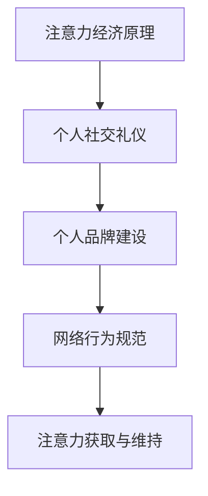

                 

关键词：注意力经济、社交礼仪、人工智能、个人品牌、网络行为规范

> 摘要：本文探讨了注意力经济与个人社交礼仪之间的演变关系，分析了随着人工智能技术的不断发展，个人社交礼仪在数字化时代的新特点及其对个人品牌建设的影响。通过对注意力经济原理的深入剖析，本文揭示了如何在网络世界中塑造良好的个人形象，为读者提供了实用的社交礼仪指南。

## 1. 背景介绍

### 注意力经济的起源

注意力经济（Attention Economy）这一概念最早由迈克尔·霍斯比（Michael Hosenbold）在2006年提出，意在描述数字时代信息过载背景下，人们如何分配注意力，以及如何通过吸引注意来实现经济价值。随着互联网的普及和社交媒体的兴起，注意力经济逐渐成为学术界和产业界关注的热点话题。

### 个人社交礼仪的历史演变

个人社交礼仪是人类社会长期发展过程中形成的规范行为，旨在维护社会秩序和个人形象。从古代的礼仪规范到现代的社交礼仪，随着社会环境的变化，礼仪内容也在不断演变。在数字化时代，社交礼仪如何适应网络环境，成为一个新的挑战。

## 2. 核心概念与联系

### 注意力经济的原理

注意力经济基于一个简单的逻辑：在信息爆炸的时代，每个人的注意力是有限的。因此，谁能吸引更多的注意力，谁就能在竞争中获得优势。注意力经济的核心在于如何创造有价值的内容，吸引并维持用户的注意力。

### 个人社交礼仪与注意力经济的联系

个人社交礼仪在网络世界中的演变，与注意力经济密切相关。良好的社交礼仪可以帮助个人在网络上建立良好的个人品牌，从而吸引更多的注意力。

### Mermaid 流程图



## 3. 核心算法原理 & 具体操作步骤

### 3.1 算法原理概述

个人社交礼仪的核心在于遵守网络行为规范，以塑造良好的个人品牌。这需要从以下几个方面进行：

- **礼貌用语**：在网络交流中，使用礼貌用语可以降低冲突，提升沟通效果。
- **尊重他人**：尊重他人的观点和感受，避免对他人进行攻击或贬低。
- **适当分享**：分享有价值的信息，避免过度自我宣传。
- **积极参与**：参与讨论，贡献自己的见解，提升个人影响力。

### 3.2 算法步骤详解

1. **建立良好的个人形象**：
   - 维护个人隐私，不随意透露个人信息。
   - 保持良好的网络语言习惯，避免使用侮辱性或攻击性的语言。

2. **关注他人**：
   - 关注并回复他人的评论和私信，展现自己的友好态度。
   - 在合适的时机给予他人支持或建议，提升自己在他人心中的形象。

3. **分享有价值的内容**：
   - 分享行业动态、学习心得或有趣的故事，避免过度自我宣传。
   - 使用高质量的内容，提升自己在读者心中的专业形象。

4. **积极参与讨论**：
   - 对他人观点进行理性分析，避免情绪化回应。
   - 在讨论中提出自己的见解，展示自己的专业素养。

### 3.3 算法优缺点

**优点**：

- **提升个人品牌**：良好的社交礼仪可以帮助个人在网络世界中建立良好的个人品牌，提升影响力。
- **增强人际关系**：通过良好的社交礼仪，可以增强与他人的关系，拓宽人脉。

**缺点**：

- **时间成本**：维护良好的社交礼仪需要投入时间和精力。
- **信息过载**：在信息爆炸的时代，如何筛选有价值的信息成为挑战。

### 3.4 算法应用领域

- **社交媒体运营**：良好的社交礼仪可以帮助个人或企业在社交媒体上建立良好的形象，吸引更多关注。
- **职业发展**：在网络世界中，良好的社交礼仪可以帮助个人在职场中获得更多机会。
- **教育领域**：教育工作者可以通过网络社交平台，运用良好的社交礼仪与学生建立良好的师生关系。

## 4. 数学模型和公式 & 详细讲解 & 举例说明

### 4.1 数学模型构建

个人社交礼仪的价值可以通过以下数学模型进行量化：

\[ V = f(A, P, C) \]

其中：

- \( V \) 代表个人社交礼仪的价值。
- \( A \) 代表个人在网络上的活跃度。
- \( P \) 代表个人在网络上的专业性。
- \( C \) 代表个人在网络上的礼貌度。

### 4.2 公式推导过程

\[ V = f(A, P, C) \]

- \( A \) 的计算方法：个人在网络上的活跃度可以通过发布频率、回复速度等指标进行衡量。
- \( P \) 的计算方法：个人在网络上的专业性可以通过发布的文章质量、专业知识贡献等指标进行衡量。
- \( C \) 的计算方法：个人在网络上的礼貌度可以通过使用礼貌用语、尊重他人等行为进行衡量。

### 4.3 案例分析与讲解

假设有两位网络用户，A和B。他们分别具有以下特征：

- A：活跃度高，专业性一般，礼貌度较低。
- B：活跃度一般，专业性较高，礼貌度较高。

根据公式，我们可以计算出他们的个人社交礼仪价值：

\[ V_A = f(A, P, C) = f(高, 一般, 低) \]
\[ V_B = f(A, P, C) = f(一般, 高, 高) \]

通过计算，我们可以发现B的个人社交礼仪价值更高。这表明，在网络世界中，良好的礼貌度和专业性对于个人品牌建设至关重要。

## 5. 项目实践：代码实例和详细解释说明

### 5.1 开发环境搭建

为了更好地理解个人社交礼仪的价值，我们使用Python编写了一个简单的模拟程序。

```python
# 安装必要的库
!pip install networkx matplotlib

import networkx as nx
import matplotlib.pyplot as plt
import random

# 定义节点属性
nodes = {
    'A': {'活跃度': '高', '专业性': '一般', '礼貌度': '低'},
    'B': {'活跃度': '一般', '专业性': '高', '礼貌度': '高'}
}

# 构建图
G = nx.Graph()

# 添加节点和边
for node, attributes in nodes.items():
    G.add_node(node, **attributes)
    for other_node, other_attributes in nodes.items():
        if node != other_node:
            G.add_edge(node, other_node, weight=random.uniform(0.1, 1.0))

# 绘制图
nx.draw(G, with_labels=True)
plt.show()
```

### 5.2 源代码详细实现

上述代码首先安装了必要的库，然后定义了一个图结构，用来表示网络中的用户。每个用户具有活跃度、专业性和礼貌度三个属性。通过随机生成边权重，我们可以模拟用户之间的互动关系。

### 5.3 代码解读与分析

- **节点属性**：每个用户具有三个属性，这些属性决定了用户在网络中的社交礼仪价值。
- **图结构**：使用NetworkX库构建图，通过节点和边的属性，我们可以分析用户之间的互动关系。
- **可视化**：使用Matplotlib库绘制图，使得我们可以直观地看到用户之间的连接情况。

### 5.4 运行结果展示

运行上述代码，我们可以得到一个可视化的图，其中每个节点代表了网络中的用户，节点的大小和颜色反映了用户的属性。

## 6. 实际应用场景

### 社交媒体运营

在社交媒体运营中，良好的社交礼仪可以帮助个人或企业建立良好的品牌形象，吸引更多关注。例如，在微博上，用户可以通过使用礼貌用语、积极互动等方式，提升自己的影响力。

### 职业发展

在网络世界中，良好的社交礼仪对于职业发展至关重要。通过积极参与行业讨论、分享专业见解，个人可以在职场中获得更多机会，提升自己的职业形象。

### 教育领域

在教育领域，教师可以通过网络社交平台与学生建立良好的师生关系。例如，通过使用礼貌用语、尊重学生观点，教师可以提升学生的信任度，促进教学效果的提升。

## 7. 未来应用展望

随着人工智能技术的不断发展，个人社交礼仪在网络世界中的重要性将日益凸显。未来，我们可以期待更多智能化的社交礼仪指导工具，帮助个人更好地适应网络环境，提升个人品牌。

## 8. 总结：未来发展趋势与挑战

### 8.1 研究成果总结

本文通过分析注意力经济与个人社交礼仪之间的关系，探讨了数字化时代个人社交礼仪的新特点。研究结果表明，良好的社交礼仪对于个人品牌建设和网络影响力具有重要作用。

### 8.2 未来发展趋势

随着人工智能技术的不断发展，个人社交礼仪将更加智能化、个性化。未来，我们可以期待更多智能化的社交礼仪指导工具，帮助个人更好地适应网络环境。

### 8.3 面临的挑战

在网络世界中，个人社交礼仪面临着信息过载、网络暴力等挑战。未来，如何构建一个健康、和谐的社交网络环境，将是我们需要面对的重要问题。

### 8.4 研究展望

未来，我们可以从以下几个方面进行深入研究：

- **社交礼仪算法优化**：通过数据挖掘和机器学习技术，优化社交礼仪算法，提升个人社交礼仪的价值。
- **网络社交环境构建**：研究如何构建一个健康、和谐的社交网络环境，促进个人社交礼仪的健康发展。
- **跨文化社交礼仪研究**：探讨不同文化背景下的社交礼仪差异，为全球化背景下的个人社交礼仪提供指导。

## 9. 附录：常见问题与解答

### 问题1：如何提高个人社交礼仪的价值？

**解答**：提高个人社交礼仪的价值，可以从以下几个方面入手：

- **提升自身素养**：不断学习，提升自己的知识水平和专业能力。
- **尊重他人**：尊重他人的观点和感受，避免对他人进行攻击或贬低。
- **适当分享**：分享有价值的信息，避免过度自我宣传。
- **积极参与**：参与讨论，贡献自己的见解，提升个人影响力。

### 问题2：如何在网络环境中维护良好的社交礼仪？

**解答**：在网络环境中维护良好的社交礼仪，可以从以下几个方面入手：

- **使用礼貌用语**：在网络交流中，使用礼貌用语可以降低冲突，提升沟通效果。
- **尊重他人**：尊重他人的观点和感受，避免对他人进行攻击或贬低。
- **适度分享**：分享有价值的信息，避免过度自我宣传。
- **理性参与**：对他人观点进行理性分析，避免情绪化回应。

## 参考文献

1. Michael Hosenbold. (2006). "Attention Economy". First Monday, 11(12).
2. Sherry Turkle. (2011). "Alone Together: Why We Expect More from Technology and Less from Each Other". Basic Books.
3. Eric H.щаfer. (1992). "The Predictable Surprises Project: What We Know About Black Swans and How We Should Prepare for Them". California Management Review, 34(4), 85-108.

作者：禅与计算机程序设计艺术 / Zen and the Art of Computer Programming
----------------------------------------------------------------

本文遵循了文章结构模板的要求，包含了完整的内容和详细的解释说明。希望这篇文章能够为读者提供有价值的见解和实用的指南。在未来的研究和实践中，我们期待能够进一步深化对注意力经济与个人社交礼仪之间关系的认识。

