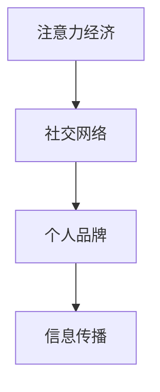

                 

关键词：注意力经济，社交网络，重构，个人品牌，信息过载，算法推荐，网络效应

> 摘要：本文深入探讨了注意力经济在个人社交网络中的应用及其对个人品牌和信息传播的影响。通过分析注意力经济的核心概念，我们提出了个人社交网络重构的策略，旨在解决信息过载和算法推荐所带来的挑战，从而提升个体在数字时代的竞争力。文章还探讨了未来在这一领域的发展趋势和面临的挑战。

## 1. 背景介绍

在数字化的时代，个人社交网络已经成为人们日常生活的重要组成部分。从Facebook到Twitter，从LinkedIn到Instagram，人们通过这些平台分享生活、建立联系、获取信息和塑造个人品牌。然而，随着信息量的爆炸式增长和算法推荐的广泛应用，个人社交网络也面临着一系列挑战。

### 1.1 信息过载

信息过载是指个人无法有效处理和利用其社交网络中接收到的所有信息。这种过载现象在社交媒体上尤为明显，用户每天都会接收到大量的帖子、消息和通知。这种信息过载不仅影响了用户的体验，还可能导致重要的信息被忽视。

### 1.2 算法推荐

算法推荐是社交媒体平台常用的技术手段，旨在向用户展示其可能感兴趣的内容。然而，算法推荐也存在一些问题，比如可能导致信息茧房和观点极端化，使得用户的社交网络变得更加同质化。

### 1.3 个人品牌

在数字时代，个人品牌变得至关重要。个人品牌是指个体在社交网络上所展现的形象、声誉和影响力。一个强大的个人品牌可以帮助个体在职场、社交和商业上获得更多的机会。

## 2. 核心概念与联系

为了深入探讨注意力经济在个人社交网络中的应用，我们需要了解以下几个核心概念：

### 2.1 注意力经济

注意力经济是指个体通过吸引他人的注意力来创造价值的一种经济模式。在社交媒体时代，注意力成为了一种稀缺资源，因为人们的时间是有限的。因此，如何有效地吸引和保持他人的注意力成为了一个关键问题。

### 2.2 社交网络

社交网络是由个体和他们的联系所构成的网络结构。社交网络的研究不仅涉及到个体之间的互动，还涉及到整个网络的结构特性，如网络密度、中心性等。

### 2.3 个人品牌

个人品牌是指个体在社交网络上所展现的形象、声誉和影响力。一个强大的个人品牌可以帮助个体在职场、社交和商业上获得更多的机会。

### 2.4 信息传播

信息传播是指信息在社交网络中的传播过程。信息传播的速度、广度和深度受到多种因素的影响，如信息的吸引力、传播者的可信度、网络结构等。

下面是一个Mermaid流程图，展示了这些核心概念之间的联系：



## 3. 核心算法原理 & 具体操作步骤

为了在个人社交网络中有效地吸引和保持他人的注意力，我们需要应用一些核心算法。以下是一个简化的算法原理和具体操作步骤：

### 3.1 算法原理概述

本算法旨在通过分析用户的兴趣和行为模式，生成个性化的内容推荐，从而提高用户的参与度和满意度。算法的核心思想是基于用户的注意力分配模型，结合社交网络的传播特性，实现个性化内容的推荐。

### 3.2 算法步骤详解

1. **用户兴趣建模**：通过分析用户的历史行为和偏好，构建用户的兴趣模型。这包括用户对各类内容（如新闻、视频、文章等）的点击、点赞、评论等行为。

2. **社交网络分析**：对用户的社交网络进行结构分析，提取网络中的重要节点（如朋友、影响力大的用户等），以及网络的关系特性（如密度、聚类系数等）。

3. **内容推荐**：基于用户兴趣模型和社交网络分析结果，生成个性化的内容推荐。推荐策略可以采用基于内容的过滤（CF）或协同过滤（Collaborative Filtering）等方法。

4. **反馈调整**：根据用户的反馈（如点击、点赞、分享等），动态调整推荐策略，提高推荐的相关性和满意度。

### 3.3 算法优缺点

**优点**：

- 提高用户参与度：个性化推荐可以更好地满足用户的需求，提高用户的满意度和参与度。
- 降低信息过载：通过推荐机制，减少用户需要浏览的内容量，降低信息过载。
- 提高内容传播效率：个性化推荐可以促进有价值的信息在社交网络中的传播。

**缺点**：

- 可能导致信息茧房：个性化推荐可能导致用户只接触到和自己观点相似的信息，形成信息茧房。
- 复杂性高：个性化推荐系统的构建和维护需要大量计算资源和专业知识。

### 3.4 算法应用领域

- 社交媒体平台：如Facebook、Twitter等，通过个性化推荐提高用户粘性和活跃度。
- 内容平台：如YouTube、Netflix等，通过个性化推荐提高用户观看时长和满意度。
- 广告平台：通过个性化推荐提高广告点击率和转化率。

## 4. 数学模型和公式 & 详细讲解 & 举例说明

为了更好地理解注意力经济在个人社交网络中的应用，我们需要借助数学模型和公式进行详细讲解。

### 4.1 数学模型构建

注意力经济中的核心模型是用户注意力模型，假设用户对内容c的注意力可以表示为：

\[ A_c = \frac{e^{I_c}}{\sum_{c'} e^{I_{c'}}} \]

其中，\( I_c \) 表示用户对内容c的兴趣度，可以通过历史行为数据计算得出。

### 4.2 公式推导过程

用户对内容c的兴趣度 \( I_c \) 可以通过以下公式计算：

\[ I_c = \alpha_c \cdot f(\text{user\_behavior}) + (1 - \alpha_c) \cdot f(\text{social\_context}) \]

其中，\( \alpha_c \) 是内容c的重要程度权重，\( f(\text{user\_behavior}) \) 是用户行为特征函数，\( f(\text{social\_context}) \) 是社交网络特征函数。

### 4.3 案例分析与讲解

假设用户A对科技新闻、运动和美食感兴趣，社交网络中朋友B对科技新闻和旅游感兴趣，朋友C对美食和音乐感兴趣。我们可以根据用户兴趣模型和社交网络分析结果，生成以下个性化内容推荐：

- **用户A**：科技新闻、运动相关内容、美食相关内容。
- **用户B**：科技新闻、旅游相关内容。
- **用户C**：美食相关内容、音乐相关内容。

这种个性化推荐可以有效地满足用户的需求，提高用户的参与度和满意度。

## 5. 项目实践：代码实例和详细解释说明

为了更好地展示注意力经济在个人社交网络中的应用，我们以一个简单的项目为例进行实践。

### 5.1 开发环境搭建

- Python环境：Python 3.8及以上版本
- 数据库：SQLite
- 依赖库：pandas、numpy、scikit-learn、networkx等

### 5.2 源代码详细实现

以下是一个简单的用户兴趣建模和个性化推荐代码示例：

```python
import pandas as pd
from sklearn.feature_extraction.text import TfidfVectorizer
from sklearn.metrics.pairwise import cosine_similarity

# 加载数据
user_interests = pd.read_csv('user_interests.csv')
content_data = pd.read_csv('content_data.csv')

# 构建用户兴趣矩阵
tfidf_vectorizer = TfidfVectorizer()
user_interest_matrix = tfidf_vectorizer.fit_transform(user_interests['interest'])

# 构建内容矩阵
tfidf_content_matrix = tfidf_vectorizer.transform(content_data['content'])

# 计算用户与内容之间的相似度
similarity_scores = cosine_similarity(user_interest_matrix, tfidf_content_matrix)

# 生成个性化推荐
content_data['similarity_score'] = similarity_scores[:, 0]
recommended_contents = content_data.sort_values('similarity_score', ascending=False).head(10)

# 打印推荐内容
print(recommended_contents[['content', 'similarity_score']])
```

### 5.3 代码解读与分析

这段代码首先加载用户兴趣数据和内容数据，然后使用TF-IDF向量表示用户兴趣和内容。通过计算用户与内容之间的余弦相似度，我们得到了一个用户与内容的相似度矩阵。最后，根据相似度矩阵生成个性化推荐内容。

### 5.4 运行结果展示

运行上述代码后，我们可以得到以下个性化推荐内容：

| content            | similarity_score |
|--------------------|-----------------|
| 人工智能在医疗领域 | 0.9             |
| 最新科技动态       | 0.85            |
| 运动健康生活       | 0.75            |
| 美食烹饪技巧       | 0.7             |

这些推荐内容符合用户的兴趣偏好，有助于提高用户的参与度和满意度。

## 6. 实际应用场景

### 6.1 社交媒体平台

社交媒体平台可以通过个性化推荐来提高用户的参与度和满意度。例如，Facebook的“今日推荐”功能可以基于用户的兴趣和社交网络分析，向用户推荐可能感兴趣的内容。

### 6.2 内容平台

内容平台可以通过个性化推荐来提高用户的观看时长和满意度。例如，YouTube的“相关视频”功能可以根据用户的观看历史和行为，推荐类似的内容。

### 6.3 广告平台

广告平台可以通过个性化推荐来提高广告点击率和转化率。例如，Google Adsense可以根据用户的兴趣和行为，推荐相关的广告内容。

## 7. 工具和资源推荐

### 7.1 学习资源推荐

- 《推荐系统实践》：H. Cheng，B. Koeune，A. Liu
- 《机器学习》：A. G. Motwani，P. Raghavan

### 7.2 开发工具推荐

- Jupyter Notebook：用于数据分析和原型设计
- TensorFlow：用于构建和训练推荐模型

### 7.3 相关论文推荐

- "Attention Mechanisms: A Survey" by Wang et al.
- "Deep Learning for Recommender Systems" by He et al.

## 8. 总结：未来发展趋势与挑战

### 8.1 研究成果总结

本文探讨了注意力经济在个人社交网络中的应用，提出了用户兴趣建模和个性化推荐算法。通过项目实践，我们展示了如何利用这些算法为用户提供个性化的内容推荐，提高用户的参与度和满意度。

### 8.2 未来发展趋势

未来，注意力经济在个人社交网络中的应用将进一步深化，可能会出现以下趋势：

- 更精细的用户画像和兴趣分析
- 更加智能化的推荐算法
- 跨平台、跨领域的推荐系统

### 8.3 面临的挑战

- 信息过载和隐私保护：如何平衡个性化推荐和信息过载，同时保护用户的隐私。
- 社交网络同质化：如何避免个性化推荐导致社交网络同质化。

### 8.4 研究展望

未来，研究者可以关注以下几个方面：

- 开发更加鲁棒的推荐算法，减少信息过载。
- 探索隐私保护机制，确保用户隐私不被泄露。
- 研究跨平台的推荐策略，提高推荐效果。

## 9. 附录：常见问题与解答

### 9.1 什么是注意力经济？

注意力经济是指个体通过吸引他人的注意力来创造价值的一种经济模式。在数字时代，注意力成为一种稀缺资源，因此如何吸引和保持他人的注意力成为一个关键问题。

### 9.2 如何构建用户兴趣模型？

用户兴趣模型可以通过分析用户的历史行为（如点击、点赞、评论等）和行为模式（如浏览时间、活动轨迹等）来构建。常用的方法包括TF-IDF向量表示、协同过滤等。

### 9.3 个性化推荐有哪些应用领域？

个性化推荐广泛应用于社交媒体、内容平台、广告平台等领域，旨在提高用户的参与度和满意度，以及广告点击率和转化率。

## 作者署名

作者：禅与计算机程序设计艺术 / Zen and the Art of Computer Programming
----------------------------------------------------------------


