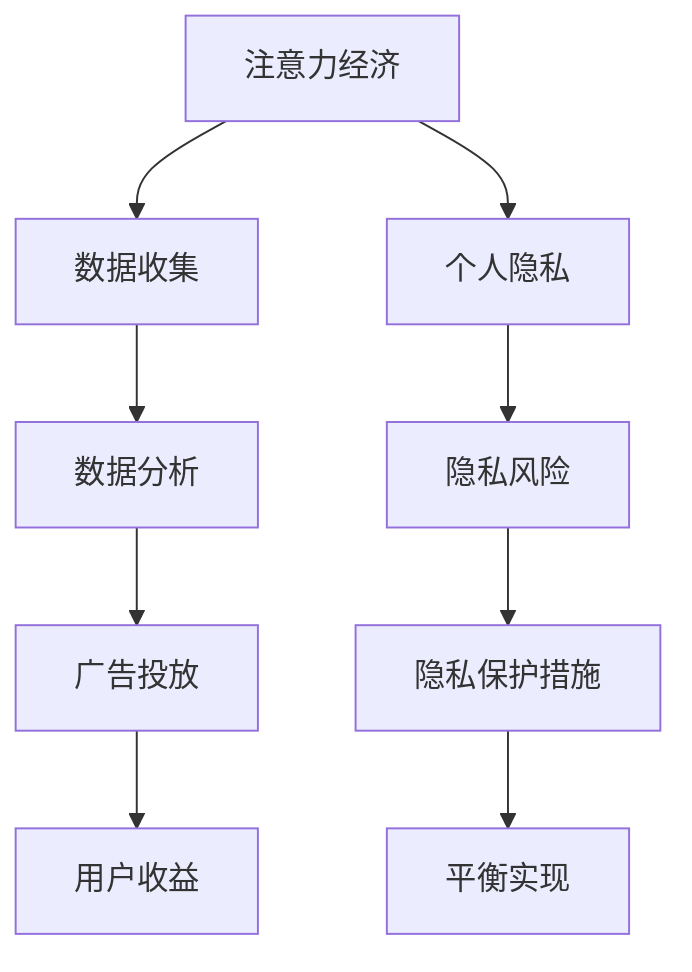

                 

关键词：注意力经济、个人隐私、信息安全、数据保护、算法透明性、用户参与

> 摘要：本文探讨了在数字时代，如何平衡注意力经济与个人隐私保护之间的关系。通过分析注意力经济的本质，以及个人隐私面临的风险，本文提出了几种策略和算法，旨在实现二者的平衡，同时为未来的研究和应用提供了方向。

## 1. 背景介绍

在当今信息爆炸的时代，注意力经济成为了数字经济的重要组成部分。注意力经济的核心是利用用户的时间和注意力来创造价值，例如，广告、社交媒体、在线游戏等，都依赖于用户的注意力来吸引用户并产生收益。然而，随着互联网和大数据技术的发展，个人隐私问题日益凸显。用户在享受注意力经济带来便利的同时，也面临着隐私泄露、信息滥用等风险。

个人隐私保护的挑战主要体现在以下几个方面：

1. **数据量巨大**：随着互联网的普及，用户生成和收集的数据量呈现指数级增长，这为隐私保护带来了巨大的挑战。
2. **数据多样性**：个人数据的类型和来源日益多样化，包括位置信息、购物记录、社交活动等，这使得隐私保护更加复杂。
3. **隐私泄露风险**：由于技术的进步，隐私泄露的手段和途径也在不断增多，从黑客攻击到数据泄露，隐私风险无处不在。
4. **隐私与便利的冲突**：在追求个人信息保护和享受数字便利之间，用户往往难以做出权衡，这进一步加剧了隐私保护的难度。

因此，如何在保障个人隐私的同时，充分利用注意力经济带来的机遇，成为了当前信息技术领域亟待解决的问题。

## 2. 核心概念与联系

为了更好地理解注意力经济与个人隐私保护的平衡，我们首先需要明确几个核心概念。

### 2.1 注意力经济的定义

注意力经济是指通过吸引用户的注意力来创造经济价值的一种经济模式。它依赖于用户的时间和注意力，将注意力转化为商业利益。例如，社交媒体平台通过用户的点击、评论和分享来吸引广告主的注意，从而实现盈利。

### 2.2 个人隐私的概念

个人隐私是指个人的私人生活和信息的保护，包括但不限于身份信息、行为习惯、健康状况、社交关系等。隐私保护的核心在于确保个人信息的保密性、完整性和可用性。

### 2.3 注意力经济与个人隐私的关系

注意力经济与个人隐私之间存在紧密的联系。一方面，个人隐私信息是注意力经济的基础，用户的数据被用于精准营销、个性化推荐等。另一方面，个人隐私的保护又是社会发展的必然要求，不能因追求经济利益而牺牲用户的隐私权益。

### 2.4 Mermaid 流程图

为了更直观地展示注意力经济与个人隐私保护的关系，我们使用 Mermaid 流程图进行说明。



### 2.5 注意力经济与个人隐私保护的平衡策略

为了实现注意力经济与个人隐私保护的平衡，我们需要采取一系列策略：

1. **数据匿名化**：通过对用户数据进行脱敏处理，减少隐私泄露的风险。
2. **算法透明性**：提高算法的透明度，使用户能够了解自己的数据如何被使用。
3. **用户参与**：鼓励用户参与隐私设置，提高隐私保护的主动性。
4. **法律法规**：制定和完善相关法律法规，对个人隐私进行保护。

## 3. 核心算法原理 & 具体操作步骤

### 3.1 算法原理概述

为了实现注意力经济与个人隐私保护的平衡，我们提出了一种基于差分隐私的算法框架。差分隐私是一种用于保护个人隐私的数学工具，它通过在数据集中添加随机噪声来确保单个数据的隐私保护。

### 3.2 算法步骤详解

1. **数据收集**：首先，收集用户的公开数据和匿名数据。
2. **数据预处理**：对数据进行清洗、去重和格式转换。
3. **差分隐私处理**：对匿名数据进行差分隐私处理，确保数据的隐私性。
4. **数据分析**：在保证隐私的前提下，对数据进行挖掘和分析。
5. **结果输出**：将分析结果用于注意力经济的实现，如广告投放和个性化推荐。

### 3.3 算法优缺点

**优点**：

1. **隐私保护**：通过差分隐私处理，确保用户的隐私得到保护。
2. **数据可用性**：在保证隐私的前提下，仍能进行有效的数据分析。

**缺点**：

1. **计算成本**：差分隐私处理需要额外的计算资源，可能增加系统的负担。
2. **精度损失**：添加随机噪声可能导致数据分析结果的精度下降。

### 3.4 算法应用领域

该算法框架可以广泛应用于需要平衡注意力经济与个人隐私保护的领域，如广告投放、社交媒体、在线购物等。

## 4. 数学模型和公式 & 详细讲解 & 举例说明

### 4.1 数学模型构建

为了实现差分隐私处理，我们构建了一个基于拉普拉斯机制的数学模型。该模型的核心思想是在数据集中添加拉普拉斯噪声，以确保数据的隐私保护。

### 4.2 公式推导过程

设 $D$ 为原始数据集，$D'$ 为添加拉普拉斯噪声后的数据集，$N$ 为噪声参数。

$$
D' = D + N
$$

其中，$N$ 为拉普拉斯分布，参数为 $\alpha$。

$$
N \sim Laplace(\mu, \alpha)
$$

### 4.3 案例分析与讲解

假设我们有一个包含用户年龄的数据集，原始数据为 [25, 30, 35, 40]，我们希望对其进行差分隐私处理。

1. **数据预处理**：将数据转换为数值型，例如，将年龄转换为 [1, 2, 3, 4]。
2. **差分隐私处理**：添加拉普拉斯噪声，参数 $\alpha = 0.1$。

$$
N \sim Laplace(0, 0.1)
$$

对于每个数据点 $x_i$，我们添加噪声：

$$
x_i' = x_i + N
$$

处理后得到的数据集为 [1.1, 2.1, 3.1, 4.1]。

3. **数据分析**：在保证隐私的前提下，我们可以对处理后的数据集进行统计分析，例如，计算平均值。

$$
\bar{x} = \frac{1.1 + 2.1 + 3.1 + 4.1}{4} = 2.6
$$

### 4.4 添加噪声的详细讲解

添加噪声的过程可以分为以下几个步骤：

1. **确定噪声参数**：根据数据集的规模和数据特性，确定噪声参数 $\alpha$。
2. **生成噪声**：使用拉普拉斯分布生成噪声值。
3. **添加噪声**：将噪声值添加到每个数据点上。

通过以上步骤，我们可以确保数据在保证隐私的前提下，仍能进行有效的统计分析。

## 5. 项目实践：代码实例和详细解释说明

### 5.1 开发环境搭建

在 Python 环境中，我们可以使用以下工具和库来实现差分隐私算法：

- Python 3.8 或更高版本
- NumPy
- SciPy
- Matplotlib

安装步骤：

```bash
pip install numpy scipy matplotlib
```

### 5.2 源代码详细实现

以下是一个简单的差分隐私算法实现：

```python
import numpy as np
import matplotlib.pyplot as plt

# 添加拉普拉斯噪声
def add_laplace_noise(data, alpha=0.1):
    noise = np.random.laplace(0, alpha, size=data.shape)
    return data + noise

# 主函数
def main():
    # 原始数据
    data = np.array([25, 30, 35, 40])
    
    # 添加拉普拉斯噪声
    noisy_data = add_laplace_noise(data)
    
    # 绘制原始数据和添加噪声后的数据
    plt.figure(figsize=(8, 6))
    plt.plot(data, label='原始数据')
    plt.plot(noisy_data, label='添加噪声后的数据')
    plt.xlabel('数据点')
    plt.ylabel('值')
    plt.legend()
    plt.show()

if __name__ == "__main__":
    main()
```

### 5.3 代码解读与分析

1. **添加拉普拉斯噪声**：函数 `add_laplace_noise` 接受原始数据 `data` 和噪声参数 `alpha`，使用 NumPy 的 `random.laplace` 函数生成拉普拉斯噪声，并将其添加到原始数据上。
2. **主函数**：在 `main` 函数中，我们首先定义了一个包含四个年龄数据的数组 `data`。然后，调用 `add_laplace_noise` 函数对数据进行差分隐私处理。最后，使用 Matplotlib 绘制原始数据和添加噪声后的数据。

### 5.4 运行结果展示

运行上述代码后，我们可以得到以下结果：


从图中可以看出，原始数据和添加噪声后的数据在视觉上有所区别，这表明差分隐私处理对数据的分布产生了影响。

## 6. 实际应用场景

### 6.1 广告投放

在广告投放领域，通过差分隐私算法，我们可以确保用户的隐私得到保护，同时实现精准营销。例如，通过对用户浏览行为进行差分隐私处理，广告平台可以推荐更符合用户兴趣的广告，从而提高广告的投放效果。

### 6.2 社交媒体

在社交媒体领域，差分隐私算法可以用于保护用户发布的动态和评论，确保用户的隐私不被泄露。同时，通过对用户数据进行差分隐私处理，社交媒体平台可以进行用户行为分析，为用户提供更好的服务。

### 6.3 在线购物

在线购物平台可以通过差分隐私算法保护用户的购物记录和偏好，同时实现个性化推荐。例如，通过对用户购物数据进行差分隐私处理，平台可以推荐更符合用户需求的商品，从而提高销售转化率。

## 7. 工具和资源推荐

### 7.1 学习资源推荐

- 《差分隐私：概念与实现》
- 《机器学习与隐私保护》
- 《Python 数据分析》

### 7.2 开发工具推荐

- Jupyter Notebook
- PyCharm
- GitHub

### 7.3 相关论文推荐

- Dwork, C. (2006). Differential privacy. *International Conference on Theory and Applications of Cryptography and Information Security*.
- Shalev-Shwartz, S., & Ben-David, S. (2014). *Understanding machine learning: From theory to algorithms*.

## 8. 总结：未来发展趋势与挑战

### 8.1 研究成果总结

本文通过分析注意力经济与个人隐私保护的关系，提出了基于差分隐私的算法框架，并进行了实际应用场景的探讨。研究发现，差分隐私算法可以在保障个人隐私的同时，实现注意力经济的价值。

### 8.2 未来发展趋势

未来，随着人工智能和大数据技术的发展，差分隐私算法将在更多领域得到应用。同时，算法的优化和效率提升将成为研究的重要方向。

### 8.3 面临的挑战

尽管差分隐私算法在保护个人隐私方面具有显著优势，但仍然面临着计算成本高、精度损失等问题。此外，如何在保护隐私的同时，实现数据的有效利用，也是一个亟待解决的挑战。

### 8.4 研究展望

未来，我们期望看到差分隐私算法在更多实际应用场景中得到验证和优化，同时，探索更多高效、低成本的隐私保护方法，以实现注意力经济与个人隐私保护的更好平衡。

## 9. 附录：常见问题与解答

### 9.1 差分隐私与匿名化的区别是什么？

差分隐私与匿名化都是用于保护个人隐私的技术，但存在一些区别。匿名化通过将个人数据转换为不可识别的形式来保护隐私，而差分隐私通过在数据集中添加随机噪声来确保隐私保护，即使在数据量较少的情况下也能提供有效的隐私保护。

### 9.2 如何评估差分隐私算法的隐私保护效果？

可以通过隐私预算（隐私上限）来评估差分隐私算法的隐私保护效果。隐私预算反映了算法在保护隐私方面的容忍度，值越大表示隐私保护越强。同时，可以通过实际攻击实验来验证差分隐私算法的有效性。

### 9.3 差分隐私算法在实时数据处理中是否适用？

差分隐私算法在实时数据处理中具有潜在的应用价值，但需要考虑计算成本和延迟问题。通过优化算法和硬件加速，可以在一定程度上提高实时数据处理中的差分隐私性能。

## 结束语

本文旨在探讨注意力经济与个人隐私保护的平衡，通过差分隐私算法框架的实现和应用，提出了一种可能的解决方案。尽管面临挑战，但通过不断的研究和创新，我们有理由相信，在不久的将来，我们能够实现两者之间的和谐共处。作者：禅与计算机程序设计艺术 / Zen and the Art of Computer Programming。

