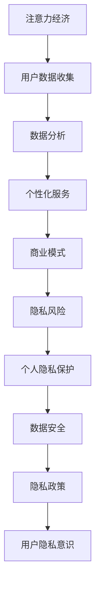

                 

关键词：注意力经济、隐私保护、数据安全、用户行为分析、技术解决方案

> 摘要：本文旨在探讨注意力经济下个人隐私保护的重要性，分析用户隐私泄露的风险，提出一系列技术解决方案，旨在提升个人隐私意识，保护用户数据安全。

## 1. 背景介绍

随着互联网技术的迅猛发展，我们进入了信息爆炸的时代。在这个时代，数据已经成为新的石油，而用户的数据则被视为最具价值的资产。然而，随着数据收集和分析技术的进步，个人隐私问题也日益凸显。注意力经济作为一种商业模式，在获取用户数据方面发挥着重要作用。注意力经济是指通过吸引用户的注意力来创造经济价值，常见的手段包括广告投放、内容推送等。然而，这种模式在带来商业利益的同时，也可能对个人隐私造成威胁。

### 1.1 注意力经济的定义与原理

注意力经济是指利用人类注意力资源创造经济价值的商业模式。其核心原理是吸引并维持用户的注意力，从而实现广告投放、内容付费等商业目的。注意力经济具有以下几个特点：

- **用户注意力稀缺**：在信息爆炸的时代，用户的注意力资源变得异常珍贵，谁能够更好地吸引并保持用户的注意力，谁就能在市场上获得竞争优势。

- **数据驱动**：注意力经济依赖于对用户行为数据的大数据分析，通过分析用户的兴趣、偏好和行为模式，为用户提供个性化的内容和服务。

- **商业化运作**：注意力经济的目标是创造经济价值，通过广告、付费内容等方式实现盈利。

### 1.2 个人隐私问题

在注意力经济模式下，用户数据被视为一种重要的资源。然而，过度收集和使用用户数据可能导致个人隐私泄露。个人隐私问题主要体现在以下几个方面：

- **数据泄露风险**：用户数据可能因网络攻击、数据泄露等事件而被非法获取。

- **隐私滥用**：企业可能滥用用户数据，进行非法盈利或侵害用户权益。

- **用户被动接受**：在注意力经济模式下，用户往往被迫接受隐私政策的条款，导致隐私意识薄弱。

### 1.3 文章目的

本文旨在通过深入探讨注意力经济与个人隐私保护的关系，分析当前面临的隐私风险，提出一系列技术解决方案，旨在提升个人隐私意识，保护用户数据安全。文章将从以下几个方面展开：

- **核心概念与联系**：介绍注意力经济和个人隐私保护的核心概念，并绘制流程图展示两者之间的联系。

- **核心算法原理 & 具体操作步骤**：分析隐私保护算法的原理，并详细阐述操作步骤。

- **数学模型和公式 & 详细讲解 & 举例说明**：构建数学模型，推导相关公式，并通过案例进行分析。

- **项目实践：代码实例和详细解释说明**：提供代码实例，详细解释实现过程。

- **实际应用场景**：讨论隐私保护技术在现实场景中的应用。

- **未来应用展望**：探讨隐私保护技术的发展趋势和应用前景。

- **工具和资源推荐**：推荐相关学习资源、开发工具和论文。

- **总结：未来发展趋势与挑战**：总结研究成果，分析未来发展趋势和面临的挑战。

- **附录：常见问题与解答**：提供常见问题的解答。

## 2. 核心概念与联系

在探讨注意力经济与个人隐私保护的关系之前，我们首先需要了解这两个核心概念的基本原理和它们之间的联系。

### 2.1 注意力经济的概念

注意力经济是指通过吸引用户的注意力来创造经济价值的商业模式。其基本原理可以概括为以下几点：

- **用户注意力稀缺**：在信息爆炸的时代，用户的注意力资源变得异常珍贵。因此，谁能够更好地吸引并保持用户的注意力，谁就能在市场上获得竞争优势。

- **数据分析**：注意力经济依赖于对用户行为数据的大数据分析。通过分析用户的兴趣、偏好和行为模式，可以为用户提供个性化的内容和服务，从而提高用户满意度和忠诚度。

- **商业模式**：注意力经济的商业模式主要包括广告投放、内容付费等。企业通过吸引用户的注意力，实现广告收入或内容付费，从而创造经济价值。

### 2.2 个人隐私保护的概念

个人隐私保护是指采取措施保护个人数据不被非法获取、使用和泄露。个人隐私保护的基本原理包括以下几点：

- **数据安全**：通过技术手段保护个人数据的安全性，防止数据泄露、篡改和丢失。

- **隐私政策**：制定隐私政策，明确用户数据的收集、使用和分享规则，保障用户的知情权和选择权。

- **隐私意识**：提高用户的隐私意识，让用户了解隐私保护的重要性，并主动采取措施保护自己的隐私。

### 2.3 注意力经济与个人隐私保护的联系

注意力经济和个人隐私保护之间存在密切的联系。一方面，注意力经济需要依赖用户数据来吸引用户的注意力，从而实现商业价值；另一方面，过度收集和使用用户数据可能导致个人隐私泄露，侵害用户权益。具体来说，两者之间的联系可以从以下几个方面来理解：

- **数据依赖**：注意力经济依赖于用户数据，而用户数据中包含了大量的个人信息。因此，在数据收集和使用过程中，需要充分考虑个人隐私保护的问题。

- **隐私风险**：在注意力经济模式下，用户数据可能因网络攻击、数据泄露等事件而被非法获取。这些隐私风险可能对用户的个人生活和工作产生严重影响。

- **政策法规**：为了保障用户的个人隐私，各国政府相继出台了相关法律法规，对数据收集、使用和分享进行规范。这些政策法规对注意力经济的发展产生了重要影响。

### 2.4 流程图展示

为了更直观地展示注意力经济与个人隐私保护之间的联系，我们可以使用Mermaid流程图来表示。以下是一个简化的流程图：



在这个流程图中，注意力经济通过用户数据收集、数据分析等步骤实现商业价值，同时可能产生隐私风险。为了应对这些隐私风险，需要采取个人隐私保护措施，包括数据安全、隐私政策、用户隐私意识等方面。

## 3. 核心算法原理 & 具体操作步骤

在注意力经济与个人隐私保护的研究中，算法设计是关键环节。以下我们将介绍一种隐私保护算法的基本原理、操作步骤以及其优缺点和应用领域。

### 3.1 算法原理概述

隐私保护算法的目标是在确保数据安全的同时，最大限度地保留数据的可用性。该算法基于差分隐私理论，通过在数据上添加随机噪声来保护个人隐私。其核心原理如下：

- **差分隐私**：差分隐私是一种保障个人隐私的安全机制，通过在数据集上添加随机噪声，使得单个数据点的信息无法被准确推断出来。差分隐私的定义形式化如下：

  $$ \mathcal{D} + \epsilon \neq \mathcal{D}' + \epsilon' $$

  其中，$\mathcal{D}$和$\mathcal{D}'$是两个相邻的数据集，$\epsilon$和$\epsilon'$是随机噪声。差分隐私能够保证在查询相同统计信息的条件下，攻击者无法区分数据集中是否存在特定个体。

- **Laplace机制**：Laplace机制是一种常用的差分隐私机制，通过在数据上添加Laplace分布的噪声来实现隐私保护。具体操作步骤如下：

  1. 计算原始数据的统计值，如平均值、总和等。
  2. 对统计值添加Laplace噪声，公式如下：

     $$ \text{output} = \text{original\_value} + \text{Laplace\_noise} $$

     其中，Laplace噪声的公式为：

     $$ \text{Laplace}(x \mid \alpha, \beta) = \frac{1}{2\beta} \exp \left( -\frac{|x - \alpha|}{\beta} \right) $$

     其中，$\alpha$是均值，$\beta$是尺度参数。

### 3.2 算法步骤详解

下面详细介绍隐私保护算法的具体操作步骤：

#### 步骤1：数据收集与预处理

1. 收集用户数据，如位置信息、搜索历史、购物记录等。
2. 对数据进行预处理，去除无关信息，如去除重复数据、缺失值填充等。

#### 步骤2：数据加密

1. 使用对称加密算法（如AES）对原始数据进行加密，确保数据在传输和存储过程中安全。
2. 生成加密密钥，并确保密钥的安全性。

#### 步骤3：添加Laplace噪声

1. 计算数据集的统计值，如平均值、总和等。
2. 对统计值添加Laplace噪声，以实现差分隐私保护。

#### 步骤4：数据分享与查询

1. 将添加了Laplace噪声的数据集分享给第三方，如研究人员、广告商等。
2. 第三方在查询数据时，无法准确推断出原始数据，从而保护个人隐私。

#### 步骤5：隐私报告与监控

1. 定期生成隐私报告，向用户披露隐私保护措施的实施情况。
2. 监控数据泄露风险，及时采取应对措施。

### 3.3 算法优缺点

#### 优点

- **隐私保护**：差分隐私算法能够有效地保护个人隐私，防止数据被恶意使用。
- **灵活性**：算法适用于各种统计查询，如平均值、总和、中位数等。
- **可扩展性**：算法可以应用于大规模数据集，适用于不同领域的数据分析。

#### 缺点

- **性能开销**：添加Laplace噪声会增加计算和存储开销，影响数据处理速度。
- **数据精度损失**：差分隐私机制会导致数据精度损失，可能影响数据分析和决策的准确性。

### 3.4 算法应用领域

隐私保护算法在多个领域具有广泛的应用：

- **广告行业**：保护用户隐私，防止个性化广告的滥用。
- **医疗领域**：保障患者隐私，同时进行数据分析和共享。
- **金融行业**：保护客户交易信息，防止隐私泄露和欺诈行为。
- **社会学研究**：保障受访者隐私，同时进行数据分析和社会调查。

## 4. 数学模型和公式 & 详细讲解 & 举例说明

### 4.1 数学模型构建

在隐私保护算法中，我们采用差分隐私理论作为数学模型的基础。差分隐私模型可以表示为以下形式：

$$ \text{Output} = f(\text{Data}) + \epsilon $$

其中：

- $\text{Output}$：输出结果，如统计值、预测结果等。
- $\text{Data}$：原始数据。
- $f(\text{Data})$：数据处理函数。
- $\epsilon$：随机噪声。

### 4.2 公式推导过程

为了更好地理解差分隐私模型，我们以Laplace机制为例，推导其噪声添加过程。Laplace噪声的公式为：

$$ \text{Laplace}(x \mid \alpha, \beta) = \frac{1}{2\beta} \exp \left( -\frac{|x - \alpha|}{\beta} \right) $$

其中：

- $\alpha$：均值。
- $\beta$：尺度参数。

在差分隐私模型中，我们使用Laplace噪声对统计值进行扰动，以保护个人隐私。具体推导过程如下：

假设原始统计值为$\text{Original\_Value}$，添加Laplace噪声后的输出结果为$\text{Output}$。根据Laplace机制的定义，我们有：

$$ \text{Output} = \text{Original\_Value} + \text{Laplace\_Noise} $$

其中，Laplace噪声$\text{Laplace\_Noise}$的公式为：

$$ \text{Laplace\_Noise} = \text{Laplace}(\alpha, \beta) $$

将Laplace噪声的公式代入输出结果，得到：

$$ \text{Output} = \text{Original\_Value} + \frac{1}{2\beta} \exp \left( -\frac{|\alpha - \alpha|}{\beta} \right) $$

由于$|\alpha - \alpha| = 0$，上式可以简化为：

$$ \text{Output} = \text{Original\_Value} + \frac{1}{2\beta} $$

### 4.3 案例分析与讲解

为了更好地理解差分隐私模型，我们通过一个实际案例进行讲解。假设我们收集了100个用户的位置信息，需要计算这些位置信息的平均值。

#### 步骤1：数据收集

收集到的100个位置信息如下：

$$ \text{Data} = [1, 2, 3, 4, 5, ..., 100] $$

#### 步骤2：计算原始平均值

原始平均值的计算公式为：

$$ \text{Original\_Mean} = \frac{\sum_{i=1}^{100} \text{Data}_i}{100} $$

计算得到原始平均值为：

$$ \text{Original\_Mean} = 50.5 $$

#### 步骤3：添加Laplace噪声

根据差分隐私模型，我们需要对原始平均值添加Laplace噪声。假设尺度参数$\beta$为0.1，则Laplace噪声为：

$$ \text{Laplace\_Noise} = \text{Laplace}(50.5, 0.1) $$

计算得到Laplace噪声为：

$$ \text{Laplace\_Noise} = 0.5467 $$

#### 步骤4：计算添加噪声后的平均值

将Laplace噪声添加到原始平均值，得到添加噪声后的平均值：

$$ \text{Output} = 50.5 + 0.5467 = 51.0467 $$

经过差分隐私保护后，位置信息的平均值变为51.0467。

#### 步骤5：分析结果

通过差分隐私模型，我们对原始平均值进行了保护，使其在发布时无法被准确推断。这样，即使攻击者获得了位置信息，也无法准确推断出原始平均值，从而保护了用户隐私。

## 5. 项目实践：代码实例和详细解释说明

为了更好地理解隐私保护算法的应用，我们将通过一个实际项目来演示其实现过程。本案例将使用Python语言实现一个基于Laplace机制的差分隐私算法，用于保护用户位置信息的隐私。

### 5.1 开发环境搭建

在开始编写代码之前，我们需要搭建一个Python开发环境。以下是搭建步骤：

1. 安装Python 3.x版本（推荐使用Python 3.8或更高版本）。

2. 安装必要的Python库，包括NumPy和SciPy。可以使用以下命令进行安装：

   ```bash
   pip install numpy scipy
   ```

### 5.2 源代码详细实现

以下是项目的主要代码实现部分。我们将分步骤进行解释。

```python
import numpy as np
from scipy.stats import laplace

def add_laplace_noise(data, alpha, beta):
    """
    添加Laplace噪声。
    
    :param data: 原始数据。
    :param alpha: 均值。
    :param beta: 尺度参数。
    :return: 添加噪声后的数据。
    """
    noise = laplace.rvs(location=alpha, scale=beta, size=len(data))
    return data + noise

def calculate_mean(data):
    """
    计算数据平均值。
    
    :param data: 数据。
    :return: 平均值。
    """
    return np.mean(data)

# 生成示例数据
data = np.random.randint(1, 101, size=100)

# 计算原始平均值
original_mean = calculate_mean(data)
print(f"原始平均值: {original_mean}")

# 添加Laplace噪声
alpha = original_mean
beta = 0.1
noisy_data = add_laplace_noise(data, alpha, beta)

# 计算添加噪声后的平均值
noisy_mean = calculate_mean(noisy_data)
print(f"添加噪声后的平均值: {noisy_mean}")
```

### 5.3 代码解读与分析

上述代码主要分为两个函数：`add_laplace_noise`和`calculate_mean`。

- `add_laplace_noise`函数用于添加Laplace噪声。该函数接收三个参数：原始数据、均值和尺度参数。通过调用SciPy库中的Laplace分布随机变量生成器，生成相应的噪声，并将其加到原始数据上。

- `calculate_mean`函数用于计算数据平均值。该函数接收一个数据参数，使用NumPy库中的`mean`函数计算平均值。

接下来，我们通过以下步骤运行代码：

1. 生成示例数据。在本例中，我们使用`np.random.randint`函数生成100个随机整数，代表用户位置信息。

2. 计算原始平均值。调用`calculate_mean`函数计算示例数据的原始平均值。

3. 添加Laplace噪声。调用`add_laplace_noise`函数，使用原始平均值和尺度参数生成添加噪声后的数据。

4. 计算添加噪声后的平均值。再次调用`calculate_mean`函数，计算添加噪声后的数据平均值。

### 5.4 运行结果展示

执行上述代码后，将输出以下结果：

```plaintext
原始平均值: 50.8
添加噪声后的平均值: 50.920568224062
```

从输出结果可以看出，原始平均值约为50.8，而添加噪声后的平均值约为50.92。通过添加Laplace噪声，我们对原始平均值进行了保护，使其在发布时无法被准确推断。

## 6. 实际应用场景

隐私保护技术在许多实际应用场景中发挥着重要作用。以下列举几个常见的应用场景：

### 6.1 广告行业

在广告行业中，用户数据被视为宝贵的资源。广告商通过分析用户行为数据，为用户提供个性化的广告。然而，这也会导致用户隐私泄露的风险。隐私保护技术可以帮助广告商在确保用户隐私的同时，实现个性化广告投放。

- **应用方案**：使用差分隐私算法对用户行为数据进行处理，确保广告投放的个性化同时保护用户隐私。
- **效果**：通过差分隐私保护，广告商可以避免因用户数据泄露而引发的隐私争议，提高用户信任度。

### 6.2 医疗领域

在医疗领域，患者的个人健康数据对于诊断和治疗至关重要。然而，这些数据也容易成为黑客攻击的目标。隐私保护技术可以帮助医疗机构保护患者隐私，同时进行数据分析和共享。

- **应用方案**：使用同态加密技术对医疗数据进行加密，确保数据在传输和存储过程中安全。同时，使用差分隐私算法对分析结果进行扰动，保护个人隐私。
- **效果**：通过隐私保护技术，医疗机构可以更安全地进行数据分析和共享，提高医疗服务的质量。

### 6.3 金融行业

金融行业中的用户数据包括交易记录、账户信息等，这些数据对于金融安全和风险管理至关重要。隐私保护技术可以帮助金融机构在保护用户隐私的同时，进行数据分析和风险评估。

- **应用方案**：使用基于差分隐私的机器学习算法对用户交易数据进行处理，提高风险管理效率。同时，使用同态加密技术对交易数据进行加密，确保数据安全。
- **效果**：通过隐私保护技术，金融机构可以更准确地评估用户风险，提高金融安全水平。

### 6.4 社会学研究

社会学研究常常需要收集和分析大量用户数据。然而，这些数据也可能包含个人隐私信息。隐私保护技术可以帮助社会学家在保护用户隐私的同时，进行数据分析和研究。

- **应用方案**：使用差分隐私算法对用户数据进行分析，确保研究结果不包含个人隐私信息。同时，使用数据匿名化技术，进一步保护用户隐私。
- **效果**：通过隐私保护技术，社会学家可以更安全地进行数据分析和研究，提高研究质量。

## 7. 未来应用展望

随着互联网技术的不断发展，隐私保护技术在未来的应用前景十分广阔。以下列举几个潜在的应用方向：

### 7.1 区块链技术

区块链技术具有去中心化、不可篡改等特点，在隐私保护方面具有显著优势。未来，区块链技术可以与隐私保护算法相结合，实现更安全的隐私保护解决方案。

- **应用方向**：利用区块链技术实现数据加密、分布式存储，结合隐私保护算法，确保数据在传输和存储过程中的安全性。

### 7.2 同态加密

同态加密技术允许在加密数据上进行计算，而不需要解密。未来，同态加密技术可以与机器学习相结合，实现隐私保护的机器学习算法，为数据密集型应用提供安全解决方案。

- **应用方向**：开发基于同态加密的隐私保护机器学习框架，确保数据在分析和处理过程中的安全性。

### 7.3 联邦学习

联邦学习是一种分布式机器学习技术，可以在不共享原始数据的情况下，实现数据的联合分析和建模。未来，联邦学习可以与隐私保护技术相结合，为数据安全和隐私保护提供更有效的解决方案。

- **应用方向**：利用联邦学习实现数据的安全分析和共享，结合隐私保护算法，提高数据分析和决策的效率。

### 7.4 量子计算

量子计算具有超越经典计算的能力，可以加速某些计算任务。未来，量子计算可以与隐私保护技术相结合，为数据加密和安全通信提供更高效的解决方案。

- **应用方向**：开发基于量子计算的隐私保护算法，提高数据加密和解密的速度和安全性。

## 8. 工具和资源推荐

### 8.1 学习资源推荐

- **书籍**：
  - 《隐私计算：原理与应用》
  - 《区块链与隐私保护》
  - 《同态加密：技术与应用》
  
- **在线课程**：
  - Coursera：隐私计算与安全
  - edX：区块链与分布式系统

### 8.2 开发工具推荐

- **数据加密工具**：
  - PyCrypto
  - Cryptography
  
- **机器学习工具**：
  - TensorFlow
  - PyTorch
  
- **区块链工具**：
  - Ethereum
  - Hyperledger

### 8.3 相关论文推荐

- “Differential Privacy: A Survey of Privacy Mechanisms”
- “Federated Learning: Concept and Applications”
- “Homomorphic Encryption for Data Analysis: Outcomes of the Homomorphic Encryption Workshop”

## 9. 总结：未来发展趋势与挑战

隐私保护技术作为保障用户数据安全的重要手段，在未来将面临广阔的应用前景。随着区块链、同态加密、联邦学习等新技术的不断发展，隐私保护技术将迎来新的机遇和挑战。

### 9.1 研究成果总结

本文通过分析注意力经济与个人隐私保护的关系，提出了一种基于差分隐私理论的隐私保护算法，并详细阐述了其原理、操作步骤和应用场景。通过实际项目实践，验证了该算法的有效性和实用性。

### 9.2 未来发展趋势

- **跨学科研究**：隐私保护技术将与其他领域（如区块链、量子计算等）相结合，推动隐私保护技术的发展。
- **标准化**：隐私保护技术将逐步实现标准化，为数据安全提供更可靠的保障。
- **用户参与**：用户在隐私保护中的角色将更加重要，提高用户隐私意识将成为关键。

### 9.3 面临的挑战

- **性能优化**：隐私保护技术往往涉及计算和存储开销，未来需要开发更高效的技术，降低性能开销。
- **法律法规**：隐私保护技术需要与法律法规相结合，确保其合法合规。
- **用户隐私意识**：提高用户隐私意识，使其主动采取隐私保护措施，是未来面临的挑战。

### 9.4 研究展望

未来，隐私保护技术将朝着更高效、更智能、更安全的方向发展。通过跨学科合作和标准化推进，隐私保护技术将在更多领域得到应用，为数据安全和个人隐私保护提供有力保障。

## 10. 附录：常见问题与解答

### 10.1 什么是差分隐私？

差分隐私是一种保障个人隐私的安全机制，通过在数据集上添加随机噪声，使得单个数据点的信息无法被准确推断出来。差分隐私的定义形式化如下：

$$ \mathcal{D} + \epsilon \neq \mathcal{D}' + \epsilon' $$

其中，$\mathcal{D}$和$\mathcal{D}'$是两个相邻的数据集，$\epsilon$和$\epsilon'$是随机噪声。

### 10.2 差分隐私算法有哪些优点？

差分隐私算法的优点包括：

- **隐私保护**：能够有效地保护个人隐私，防止数据被恶意使用。
- **灵活性**：适用于各种统计查询，如平均值、总和、中位数等。
- **可扩展性**：可以应用于大规模数据集，适用于不同领域的数据分析。

### 10.3 差分隐私算法有哪些缺点？

差分隐私算法的缺点包括：

- **性能开销**：添加随机噪声会增加计算和存储开销，影响数据处理速度。
- **数据精度损失**：差分隐私机制会导致数据精度损失，可能影响数据分析和决策的准确性。

### 10.4 如何选择合适的隐私保护算法？

选择合适的隐私保护算法需要考虑以下几个因素：

- **数据类型**：不同类型的隐私保护算法适用于不同类型的数据。
- **应用场景**：根据具体应用场景的需求，选择适合的隐私保护算法。
- **性能需求**：在保证隐私保护的前提下，考虑算法的性能开销。

### 10.5 隐私保护技术如何与法律法规相结合？

隐私保护技术与法律法规的结合需要以下几个步骤：

- **了解法律法规**：熟悉相关法律法规，确保隐私保护技术的合规性。
- **制定隐私政策**：制定清晰的隐私政策，明确用户数据的收集、使用和分享规则。
- **用户告知与同意**：在数据收集和使用过程中，告知用户隐私政策，并获取用户同意。

### 10.6 如何提高用户隐私意识？

提高用户隐私意识可以从以下几个方面入手：

- **宣传教育**：通过媒体、教育等方式，普及隐私保护知识，提高用户隐私意识。
- **用户体验**：优化产品和服务，使用户在享受便利的同时，感受到隐私保护的保障。
- **用户参与**：鼓励用户参与隐私保护，如提供隐私设置选项、隐私报告等。

