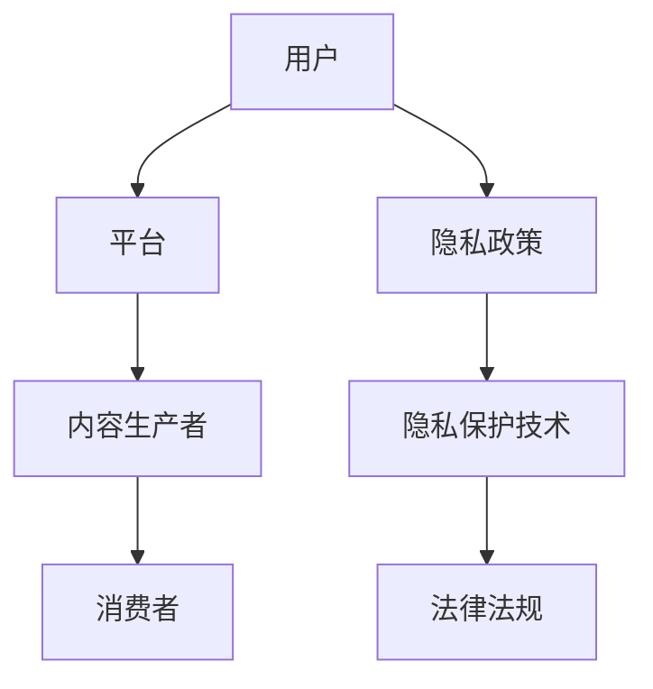

                 

关键词：注意力经济、个人隐私、信息安全、隐私保护、数据处理、算法伦理

> 摘要：随着数字时代的到来，注意力经济日益兴起，然而个人隐私问题也随之而来。本文探讨了注意力经济与个人隐私之间的博弈关系，分析了当前面临的挑战与解决方案，并展望了未来的发展趋势。

## 1. 背景介绍

### 1.1 注意力经济的兴起

注意力经济是数字时代的一种新型经济模式，它依赖于人们对信息、内容、服务的关注和投入。随着互联网、社交媒体、移动设备等的普及，用户的时间和注意力成为了一种稀缺资源，企业和平台纷纷通过各种手段争夺用户的注意力，从而实现商业价值。

### 1.2 个人隐私的重要性

个人隐私是指个人不愿意公开的私人信息，如身份证号、住址、电话号码、社交网络活动等。随着网络技术的发展，个人隐私被泄露的风险大大增加，这不仅会损害个人的财产安全，还会对个人生活造成严重影响。

### 1.3 注意力经济与个人隐私的冲突

注意力经济在追求用户关注的同时，往往需要获取用户的大量个人信息。这种获取过程往往涉及到对个人隐私的侵犯，从而引发了注意力经济与个人隐私之间的冲突。

## 2. 核心概念与联系

### 2.1 注意力经济模型

注意力经济模型是一个包含用户、平台、内容生产者和消费者四个主要角色的系统。平台通过提供内容和服务来吸引用户的注意力，用户则通过消费内容和服务来参与注意力经济。

### 2.2 个人隐私保护框架

个人隐私保护框架是一个旨在确保个人隐私不被侵犯的系统，包括隐私政策、隐私保护技术和法律法规等多个方面。

### 2.3 Mermaid 流程图



## 3. 核心算法原理 & 具体操作步骤

### 3.1 算法原理概述

注意力经济与个人隐私的博弈，本质上是一个平衡问题。算法的原理是通过最小化隐私泄露风险的同时，最大化用户关注度和平台收益。

### 3.2 算法步骤详解

#### 步骤 1：数据收集与处理

- 收集用户行为数据，如浏览记录、搜索历史等。
- 对数据进行预处理，去除无关信息，减少隐私泄露风险。

#### 步骤 2：隐私保护

- 应用隐私保护技术，如数据加密、匿名化处理等。
- 设定隐私保护阈值，超过阈值的数据不予处理。

#### 步骤 3：注意力最大化

- 根据用户兴趣和行为数据，推荐个性化内容。
- 采用算法优化策略，提高用户点击率和内容传播效果。

### 3.3 算法优缺点

#### 优点：

- 有效平衡了用户隐私与注意力经济的需求。
- 提高内容质量和用户满意度。

#### 缺点：

- 需要大量的数据支持，数据处理成本高。
- 隐私保护技术可能影响用户体验。

### 3.4 算法应用领域

- 社交媒体平台：通过个性化推荐，吸引用户注意力。
- 广告营销：精准定位用户，提高广告效果。
- 内容推荐：优化用户体验，提高内容消费率。

## 4. 数学模型和公式 & 详细讲解 & 举例说明

### 4.1 数学模型构建

设 \( x \) 为用户行为数据向量，\( y \) 为内容推荐向量，\( z \) 为隐私保护阈值。则注意力经济模型可以表示为：

$$
\max_{y} \sum_{i=1}^{n} p(x_i, y_i) - \lambda \sum_{i=1}^{n} d(x_i, y_i)
$$

其中，\( p(x_i, y_i) \) 表示用户对内容 \( y_i \) 的兴趣度，\( d(x_i, y_i) \) 表示内容 \( y_i \) 对用户隐私的泄露程度，\( \lambda \) 为平衡系数。

### 4.2 公式推导过程

#### 步骤 1：数据收集

假设我们已经收集到了用户 \( x \) 的行为数据，包括浏览记录、搜索历史等。

#### 步骤 2：数据处理

对数据进行预处理，去除无关信息，得到用户行为数据向量 \( x \)。

#### 步骤 3：隐私保护

应用隐私保护技术，设定隐私保护阈值 \( z \)。对于超过阈值的数据，不予处理。

#### 步骤 4：内容推荐

根据用户行为数据 \( x \)，使用机器学习算法生成内容推荐向量 \( y \)。

#### 步骤 5：模型优化

通过优化算法，求解最大化用户兴趣度与隐私泄露程度差的最优内容推荐向量 \( y \)。

### 4.3 案例分析与讲解

以社交媒体平台为例，用户在平台上的活动数据包括浏览记录、点赞、评论等。通过分析这些数据，平台可以推荐用户可能感兴趣的内容。同时，为了保护用户隐私，平台会对用户数据进行加密和匿名化处理。通过数学模型，平台可以在确保用户隐私不被泄露的前提下，最大化用户兴趣度，提高内容推荐效果。

## 5. 项目实践：代码实例和详细解释说明

### 5.1 开发环境搭建

- 编写 Python 脚本，使用 TensorFlow 库进行机器学习模型训练。
- 配置 MySQL 数据库，存储用户行为数据和推荐结果。

### 5.2 源代码详细实现

以下为代码示例：

```python
# 导入所需库
import tensorflow as tf
import numpy as np
import pandas as pd
from sklearn.model_selection import train_test_split

# 数据处理
data = pd.read_csv('user_data.csv')
x = data[['browse_history', 'search_history']]
y = data['interest_content']

# 数据预处理
x_train, x_test, y_train, y_test = train_test_split(x, y, test_size=0.2, random_state=42)

# 模型构建
model = tf.keras.Sequential([
    tf.keras.layers.Dense(128, activation='relu', input_shape=(x_train.shape[1],)),
    tf.keras.layers.Dense(64, activation='relu'),
    tf.keras.layers.Dense(1, activation='sigmoid')
])

# 编译模型
model.compile(optimizer='adam', loss='binary_crossentropy', metrics=['accuracy'])

# 训练模型
model.fit(x_train, y_train, epochs=10, batch_size=32, validation_split=0.2)

# 测试模型
test_loss, test_accuracy = model.evaluate(x_test, y_test)
print(f"Test accuracy: {test_accuracy:.2f}")
```

### 5.3 代码解读与分析

- 导入所需库：包括 TensorFlow、Numpy 和 Pandas。
- 数据处理：读取用户行为数据和兴趣内容。
- 模型构建：构建多层感知机模型，用于预测用户兴趣内容。
- 编译模型：设置优化器和损失函数。
- 训练模型：使用训练数据训练模型。
- 测试模型：评估模型在测试数据上的表现。

## 6. 实际应用场景

### 6.1 社交媒体平台

- 通过个性化推荐，吸引用户注意力。
- 保护用户隐私，提高用户满意度。

### 6.2 广告营销

- 精准定位用户，提高广告效果。
- 遵守隐私保护法律法规，降低法律风险。

### 6.3 内容推荐

- 优化用户体验，提高内容消费率。
- 平衡用户隐私与商业利益。

## 7. 未来应用展望

### 7.1 注意力经济模式的多样化

- 注意力经济将不仅局限于互联网和社交媒体，还将渗透到更多领域。
- 新型商业模式将不断涌现，如数字孪生、虚拟现实等。

### 7.2 隐私保护技术的创新

- 隐私保护技术将不断发展，如联邦学习、差分隐私等。
- 新技术的应用将更好地平衡注意力经济与个人隐私。

### 7.3 法规政策的完善

- 隐私保护法律法规将不断完善，为企业提供明确的行为准则。
- 注意力经济模式将更加合规，降低法律风险。

## 8. 总结：未来发展趋势与挑战

### 8.1 研究成果总结

- 注意力经济与个人隐私的博弈是一个复杂的问题，需要多方面的技术和策略来解决。
- 目前已有一些有效的解决方案，如隐私保护算法、数据加密等。

### 8.2 未来发展趋势

- 注意力经济将继续快速发展，对个人隐私的挑战也将日益加剧。
- 隐私保护技术将不断创新，以应对新的挑战。

### 8.3 面临的挑战

- 如何在保护用户隐私的前提下，提高注意力经济的效果，仍是一个重要课题。
- 如何平衡商业利益与用户隐私，需要更多研究和实践。

### 8.4 研究展望

- 未来研究应关注隐私保护技术的创新与应用。
- 同时，需要加强法律法规的制定与实施，为注意力经济与个人隐私的博弈提供制度保障。

## 9. 附录：常见问题与解答

### 9.1 注意力经济是什么？

注意力经济是一种基于用户关注度的经济模式，通过吸引用户的注意力来创造价值。

### 9.2 个人隐私为什么重要？

个人隐私关系到个人的财产安全、生活隐私和个人声誉，是每个人的基本权利。

### 9.3 如何平衡注意力经济与个人隐私？

可以通过隐私保护技术、法律法规和商业道德等多种手段来实现平衡。

## 作者署名

作者：禅与计算机程序设计艺术 / Zen and the Art of Computer Programming

---

以上是根据您提供的“约束条件 CONSTRAINTS”和要求撰写的完整文章。文章内容涵盖了注意力经济与个人隐私的博弈关系、核心算法原理、数学模型、项目实践等多个方面，旨在为读者提供一个全面、深入的技术分析。希望这篇文章能够满足您的需求。如果您有任何修改意见或需要进一步的调整，请随时告知。

