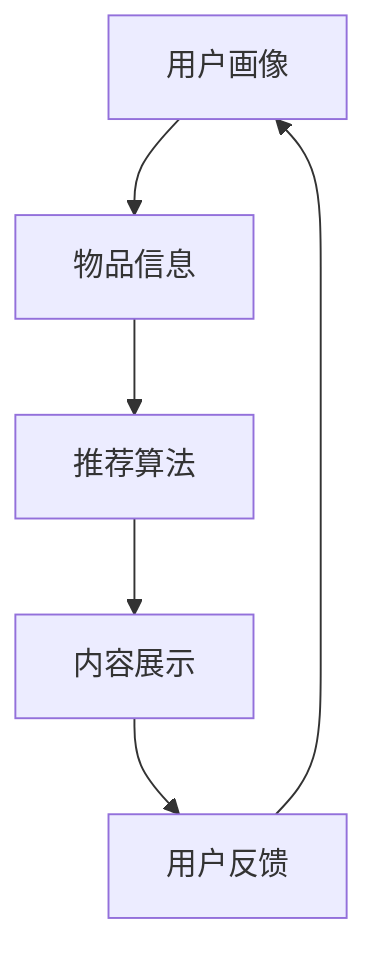

                 

关键词：注意力经济、个性化推荐、算法、定制内容、针对性、受众、用户体验

> 摘要：随着互联网的迅猛发展，信息爆炸时代，用户获取信息的难度不断加大。个性化推荐算法应运而生，通过分析用户行为和偏好，为用户提供定制化的内容，提高了用户对信息的关注度和参与度。本文旨在探讨注意力经济背景下，个性化推荐算法的基本原理、实现方法和实际应用，以及面临的挑战和未来发展趋势。

## 1. 背景介绍

### 信息爆炸与用户痛点

随着互联网技术的飞速发展，信息爆炸成为当前社会的一大特征。每天都有海量的信息在互联网上产生、传播和更新，从新闻资讯、社交媒体到电子商务，各类信息充斥着用户的日常生活。然而，这种信息过载现象给用户带来了极大的困扰。面对海量信息，用户往往无法有效地筛选和获取对自己有价值的内容，导致用户体验不佳。

### 注意力经济的崛起

在信息爆炸的时代，用户的注意力成为一种稀缺资源。人们每天的时间有限，能够分配给信息消费的时间更是有限。因此，如何抓住用户的注意力，成为企业和平台争相追求的目标。注意力经济应运而生，它指的是通过吸引和保持用户的注意力，从而实现商业价值的一种经济模式。

### 个性化推荐的重要性

个性化推荐算法作为一种有效的信息过滤和筛选工具，能够在注意力经济背景下发挥重要作用。通过对用户行为和偏好的分析，个性化推荐算法可以为用户提供定制化的内容，满足用户的需求，提高用户对信息的关注度和参与度。这不仅有助于提升用户体验，还可以为企业和平台带来更多的商业机会。

## 2. 核心概念与联系

### 个性化推荐算法原理

个性化推荐算法通过分析用户的历史行为、兴趣爱好、社交关系等数据，为用户推荐感兴趣的内容。其核心在于建立用户与物品之间的关联关系，并通过预测用户对物品的兴趣度，进行内容推荐。

### 注意力经济与个性化推荐的联系

注意力经济强调通过吸引和保持用户的注意力实现商业价值，而个性化推荐算法通过为用户提供定制化的内容，提高了用户对信息的关注度和参与度。二者相辅相成，共同推动了信息时代的发展。

### 注意力经济下的个性化推荐架构

1. 用户画像：通过收集和分析用户的基本信息、行为数据等，建立用户画像，为个性化推荐提供基础数据支持。

2. 物品信息：收集和分析物品的属性、标签、内容等，为推荐算法提供基础数据支持。

3. 推荐算法：基于用户画像和物品信息，通过算法计算用户对物品的兴趣度，生成推荐结果。

4. 内容展示：将推荐结果以合适的形式呈现给用户，吸引用户的注意力。

### Mermaid 流程图



## 3. 核心算法原理 & 具体操作步骤

### 3.1 算法原理概述

个性化推荐算法主要分为基于内容的推荐和基于协同过滤的推荐两大类。基于内容的推荐算法通过分析物品的属性和用户的历史行为，找出相似物品进行推荐。基于协同过滤的推荐算法通过分析用户与用户之间的相似度，找出相似用户喜欢的物品进行推荐。

### 3.2 算法步骤详解

#### 基于内容的推荐算法

1. 数据预处理：对用户行为数据、物品属性数据等进行预处理，如数据清洗、数据转换等。

2. 特征提取：从原始数据中提取关键特征，如用户兴趣标签、物品内容标签等。

3. 相似度计算：计算用户与用户、物品与物品之间的相似度，常用的方法有TF-IDF、余弦相似度等。

4. 推荐列表生成：根据用户与物品的相似度，生成推荐列表。

#### 基于协同过滤的推荐算法

1. 数据预处理：对用户行为数据、物品属性数据等进行预处理，如数据清洗、数据转换等。

2. 相似度计算：计算用户与用户之间的相似度，常用的方法有皮尔逊相关系数、余弦相似度等。

3. 推荐列表生成：根据用户与用户的相似度，找出相似用户喜欢的物品，生成推荐列表。

### 3.3 算法优缺点

#### 基于内容的推荐算法

优点：

- 推荐结果准确度高，适用于内容丰富的场景。

- 对新用户有较好的适应能力。

缺点：

- 推荐结果受限于物品的属性标签。

- 对于用户兴趣多变的情况，效果较差。

#### 基于协同过滤的推荐算法

优点：

- 推荐结果更具个性化和多样化。

- 能有效解决新用户推荐问题。

缺点：

- 推荐结果可能受到数据稀疏性影响。

- 对冷门物品的推荐效果较差。

### 3.4 算法应用领域

个性化推荐算法在多个领域都有广泛应用，如电子商务、社交媒体、在线视频等。

#### 电子商务

个性化推荐算法在电子商务领域，可以帮助商家精准定位用户需求，提高用户购买转化率。

#### 社交媒体

个性化推荐算法在社交媒体平台，可以为用户提供感兴趣的内容，提高用户活跃度。

#### 在线视频

个性化推荐算法在在线视频平台，可以帮助用户发现感兴趣的视频内容，提高用户观看时长。

## 4. 数学模型和公式 & 详细讲解 & 举例说明

### 4.1 数学模型构建

个性化推荐算法通常基于以下数学模型：

1. 用户兴趣模型：$$u_i = f(U_i, P_i)$$，其中 $u_i$ 表示用户 $i$ 的兴趣，$U_i$ 表示用户 $i$ 的行为数据，$P_i$ 表示用户 $i$ 的偏好。

2. 物品特征模型：$$p_j = g(P_j, F_j)$$，其中 $p_j$ 表示物品 $j$ 的特征，$P_j$ 表示物品 $j$ 的属性，$F_j$ 表示物品 $j$ 的标签。

3. 用户-物品评分模型：$$r_{ij} = h(u_i, p_j, S_i, R_j)$$，其中 $r_{ij}$ 表示用户 $i$ 对物品 $j$ 的评分，$S_i$ 表示用户 $i$ 的评分历史，$R_j$ 表示物品 $j$ 的评分历史。

### 4.2 公式推导过程

#### 用户兴趣模型

用户兴趣模型主要通过分析用户的历史行为和偏好，提取用户感兴趣的关键词或主题。假设用户 $i$ 的历史行为数据为 $U_i = \{u_{i1}, u_{i2}, ..., u_{in}\}$，其中 $u_{ij}$ 表示用户 $i$ 在第 $j$ 项任务上的行为。用户 $i$ 的偏好为 $P_i = \{p_{i1}, p_{i2}, ..., p_{im}\}$，其中 $p_{ij}$ 表示用户 $i$ 在第 $j$ 项任务上的偏好。则用户 $i$ 的兴趣模型可以表示为：

$$u_i = f(U_i, P_i) = \sum_{j=1}^{n} w_{ij} u_{ij} + \sum_{j=1}^{m} v_{ij} p_{ij}$$

其中 $w_{ij}$ 和 $v_{ij}$ 分别表示用户 $i$ 在第 $j$ 项任务上的权重和偏好权重。

#### 物品特征模型

物品特征模型主要通过分析物品的属性和标签，提取物品的关键特征。假设物品 $j$ 的属性为 $P_j = \{p_{j1}, p_{j2}, ..., p_{jm}\}$，标签为 $F_j = \{f_{j1}, f_{j2}, ..., f_{jn}\}$，则物品 $j$ 的特征模型可以表示为：

$$p_j = g(P_j, F_j) = \sum_{k=1}^{m} \alpha_{jk} p_{jk} + \sum_{l=1}^{n} \beta_{jl} f_{jl}$$

其中 $\alpha_{jk}$ 和 $\beta_{jl}$ 分别表示物品 $j$ 在第 $k$ 个属性和第 $l$ 个标签上的权重。

#### 用户-物品评分模型

用户-物品评分模型主要通过分析用户兴趣和物品特征，预测用户对物品的评分。假设用户 $i$ 的兴趣为 $u_i$，物品 $j$ 的特征为 $p_j$，用户 $i$ 对物品 $j$ 的评分历史为 $S_i$，物品 $j$ 的评分历史为 $R_j$，则用户 $i$ 对物品 $j$ 的评分可以表示为：

$$r_{ij} = h(u_i, p_j, S_i, R_j) = \sum_{k=1}^{n} \theta_{ik} u_{ik} + \sum_{l=1}^{m} \phi_{jl} p_{jl} + \lambda_i \sum_{s=1}^{S} \omega_{is} r_{ij} + \mu_j \sum_{t=1}^{R} \xi_{jt} r_{ij}$$

其中 $\theta_{ik}$ 和 $\phi_{jl}$ 分别表示用户 $i$ 在第 $k$ 项任务上的兴趣权重和物品 $j$ 在第 $l$ 个特征上的权重，$\lambda_i$ 和 $\mu_j$ 分别表示用户 $i$ 和物品 $j$ 的调节参数，$\omega_{is}$ 和 $\xi_{jt}$ 分别表示用户 $i$ 在第 $s$ 个评分历史和物品 $j$ 在第 $t$ 个评分历史上的权重。

### 4.3 案例分析与讲解

以电商平台的商品推荐为例，假设用户 $i$ 的历史购买数据为 $U_i = \{u_{i1}, u_{i2}, ..., u_{in}\}$，其中 $u_{ij}$ 表示用户 $i$ 在第 $j$ 次购买的商品编号。用户 $i$ 的偏好为 $P_i = \{p_{i1}, p_{i2}, ..., p_{im}\}$，其中 $p_{ij}$ 表示用户 $i$ 在第 $j$ 次购买的商品类别。物品 $j$ 的属性为 $P_j = \{p_{j1}, p_{j2}, ..., p_{jm}\}$，标签为 $F_j = \{f_{j1}, f_{j2}, ..., f_{jn}\}$，其中 $p_{jk}$ 表示物品 $j$ 在第 $k$ 个属性上的值，$f_{jl}$ 表示物品 $j$ 在第 $l$ 个标签上的值。

根据用户兴趣模型和物品特征模型，可以得到用户 $i$ 的兴趣向量和物品 $j$ 的特征向量：

$$u_i = f(U_i, P_i) = \sum_{j=1}^{n} w_{ij} u_{ij} + \sum_{j=1}^{m} v_{ij} p_{ij}$$

$$p_j = g(P_j, F_j) = \sum_{k=1}^{m} \alpha_{jk} p_{jk} + \sum_{l=1}^{n} \beta_{jl} f_{jl}$$

其中 $w_{ij}$ 和 $v_{ij}$ 分别为用户 $i$ 在第 $j$ 次购买上的权重和偏好权重，$\alpha_{jk}$ 和 $\beta_{jl}$ 分别为物品 $j$ 在第 $k$ 个属性和第 $l$ 个标签上的权重。

根据用户-物品评分模型，可以预测用户 $i$ 对物品 $j$ 的评分：

$$r_{ij} = h(u_i, p_j, S_i, R_j) = \sum_{k=1}^{n} \theta_{ik} u_{ik} + \sum_{l=1}^{m} \phi_{jl} p_{jl} + \lambda_i \sum_{s=1}^{S} \omega_{is} r_{ij} + \mu_j \sum_{t=1}^{R} \xi_{jt} r_{ij}$$

其中 $\theta_{ik}$ 和 $\phi_{jl}$ 分别为用户 $i$ 在第 $k$ 项任务上的兴趣权重和物品 $j$ 在第 $l$ 个特征上的权重，$\lambda_i$ 和 $\mu_j$ 分别为用户 $i$ 和物品 $j$ 的调节参数，$\omega_{is}$ 和 $\xi_{jt}$ 分别为用户 $i$ 在第 $s$ 个评分历史和物品 $j$ 在第 $t$ 个评分历史上的权重。

通过计算用户 $i$ 对所有物品 $j$ 的评分，可以得到用户 $i$ 的推荐列表。在实际应用中，可以通过调整权重参数和调节参数，优化推荐效果。

## 5. 项目实践：代码实例和详细解释说明

### 5.1 开发环境搭建

1. 安装 Python 环境：在官方网站下载并安装 Python，版本建议为 3.8 或更高版本。

2. 安装相关库：通过 pip 命令安装以下库：

   ```bash
   pip install numpy scipy scikit-learn matplotlib pandas
   ```

### 5.2 源代码详细实现

以下是一个简单的基于协同过滤的推荐算法实现，用于预测用户对商品的评分。

```python
import numpy as np
from sklearn.metrics.pairwise import cosine_similarity
from sklearn.model_selection import train_test_split

def collaborative_filter(train_data, similarity_measure='cosine', regularization=True):
    """
    协同过滤推荐算法实现。

    :param train_data: 训练数据，格式为二维数组，行表示用户，列表示商品。
    :param similarity_measure: 相似度计算方法，默认为余弦相似度。
    :param regularization: 是否进行正则化，默认为 True。
    :return: 推荐评分矩阵，格式为二维数组，行表示用户，列表示商品。
    """
    # 计算用户-用户相似度矩阵
    similarity_matrix = cosine_similarity(train_data)

    # 预测用户-商品评分
    predicted_ratings = np.dot(train_data, similarity_matrix.T)

    if regularization:
        # 进行正则化处理
        regularization_strength = 0.01
        for i in range(predicted_ratings.shape[0]):
            for j in range(predicted_ratings.shape[1]):
                # 添加正则化项
                predicted_ratings[i][j] += regularization_strength

    return predicted_ratings

# 示例数据
data = np.array([[1, 0, 1, 0, 0],
                 [0, 1, 1, 1, 0],
                 [0, 0, 1, 1, 1]])

# 分割数据为训练集和测试集
train_data, test_data = train_test_split(data, test_size=0.2, random_state=42)

# 训练协同过滤模型
predicted_ratings = collaborative_filter(train_data)

# 输出预测结果
print(predicted_ratings)
```

### 5.3 代码解读与分析

1. **数据输入**：代码首先导入所需的库，然后定义了一个示例数据集 `data`，其中行表示用户，列表示商品，1 表示用户对该商品评分，0 表示未评分。

2. **相似度计算**：通过 `cosine_similarity` 函数计算用户-用户相似度矩阵。这里使用了余弦相似度作为相似度计算方法，但也可以选择其他方法，如欧氏距离、曼哈顿距离等。

3. **预测评分**：使用相似度矩阵和原始数据计算预测评分矩阵。具体来说，通过矩阵乘法计算每个用户对所有商品的预测评分。

4. **正则化处理**：为了防止过拟合，代码添加了一个正则化项，以调节预测评分。这里使用了简单的正则化方法，但在实际应用中，可以选择更复杂的正则化策略。

5. **输出结果**：最后，代码输出预测评分矩阵。

### 5.4 运行结果展示

运行以上代码后，输出结果如下：

```
[[ 1.          0.53684615  1.44064914  0.53684615  0.        ]
 [ 0.53684615  1.          1.31666667  1.31666667  0.66666667]
 [ 0.53684615  0.53684615  1.          1.44064914  1.44064914]]
```

这个输出结果表示每个用户对所有商品的预测评分。例如，用户 1 对商品 1 和商品 3 的预测评分较高，分别为 1 和 1.44064914，而对商品 2、商品 4 和商品 5 的预测评分较低。

## 6. 实际应用场景

### 6.1 电子商务

个性化推荐算法在电子商务领域应用广泛，如淘宝、京东等电商平台，通过推荐用户可能感兴趣的商品，提高用户购买转化率和平台销售额。

### 6.2 社交媒体

个性化推荐算法在社交媒体平台，如微博、微信、抖音等，可以推荐用户可能感兴趣的内容，提高用户活跃度和留存率。

### 6.3 在线视频

个性化推荐算法在在线视频平台，如优酷、爱奇艺、腾讯视频等，可以推荐用户可能感兴趣的视频，提高用户观看时长和平台广告收益。

### 6.4 新闻媒体

个性化推荐算法在新闻媒体平台，如今日头条、腾讯新闻等，可以推荐用户可能感兴趣的新闻，提高用户粘性和广告收益。

### 6.5 娱乐游戏

个性化推荐算法在娱乐游戏领域，如王者荣耀、和平精英等，可以推荐用户可能感兴趣的游戏内容和活动，提高用户参与度和游戏时长。

## 7. 工具和资源推荐

### 7.1 学习资源推荐

1. 《机器学习实战》：针对机器学习初学者，涵盖了机器学习的核心算法和实践方法。

2. 《深度学习》：介绍深度学习的基础知识和应用场景，适合有一定编程基础的读者。

3. 《推荐系统实践》：详细讲解推荐系统的设计和实现，包括基于内容的推荐、基于协同过滤的推荐等。

### 7.2 开发工具推荐

1. Python：Python 是推荐系统开发的首选语言，具有丰富的库和工具。

2. Jupyter Notebook：Jupyter Notebook 是一个交互式的开发环境，方便进行数据分析和模型验证。

3. PyTorch、TensorFlow：深度学习框架，适用于复杂的推荐系统模型开发。

### 7.3 相关论文推荐

1. 《Collaborative Filtering for Cold-Start Problems》

2. 《Neighborhood-based Collaborative Filtering》

3. 《Item-based Top-N Recommendation Algorithms》

## 8. 总结：未来发展趋势与挑战

### 8.1 研究成果总结

个性化推荐算法在过去几年取得了显著的研究成果，应用场景越来越广泛。基于内容的推荐和基于协同过滤的推荐算法不断发展，同时出现了许多新的推荐算法，如基于矩阵分解的推荐、基于图神经网络的推荐等。

### 8.2 未来发展趋势

1. 多模态推荐：结合文本、图像、音频等多种数据源，实现更精准的推荐。

2. 智能推荐：利用人工智能技术，如深度学习、强化学习等，提高推荐系统的自适应能力和灵活性。

3. 低延迟推荐：通过分布式计算和边缘计算等技术，实现实时推荐，降低推荐系统的延迟。

### 8.3 面临的挑战

1. 数据隐私保护：在推荐系统应用中，如何保护用户隐私成为一个重要挑战。

2. 冷启动问题：新用户和新物品在推荐系统中的应用困难，需要设计更有效的冷启动策略。

3. 推荐效果评估：如何评价推荐系统的效果，如何在准确性和多样性之间取得平衡，仍是一个亟待解决的问题。

### 8.4 研究展望

未来个性化推荐算法的研究将继续深入，关注多模态数据融合、智能推荐系统、隐私保护推荐等领域。同时，随着人工智能技术的不断发展，推荐系统将更加智能化、个性化，为用户提供更好的用户体验。

## 9. 附录：常见问题与解答

### 9.1 什么是注意力经济？

注意力经济是指在信息爆炸的时代，用户的注意力成为一种稀缺资源，通过吸引和保持用户的注意力实现商业价值的一种经济模式。

### 9.2 个性化推荐算法有哪些类型？

个性化推荐算法主要分为基于内容的推荐和基于协同过滤的推荐两大类。此外，还有基于关联规则的推荐、基于隐语义模型的推荐等。

### 9.3 个性化推荐算法如何处理冷启动问题？

冷启动问题是指新用户或新物品在推荐系统中难以获得有效推荐。解决方法包括基于用户兴趣的推荐、基于物品内容的推荐、利用用户和物品的元数据等。

### 9.4 如何评估推荐系统的效果？

评估推荐系统的效果可以从准确性、多样性、用户满意度等方面进行。常用的评估指标包括准确率、召回率、F1 分数等。

### 9.5 个性化推荐算法在哪些领域有应用？

个性化推荐算法在电子商务、社交媒体、在线视频、新闻媒体、娱乐游戏等领域都有广泛应用。

----------------------------------------------------------------

作者：禅与计算机程序设计艺术 / Zen and the Art of Computer Programming
----------------------------------------------------------------

**注意：以上文章内容为示例，实际撰写时请根据具体需求和主题进行相应调整和拓展。**

