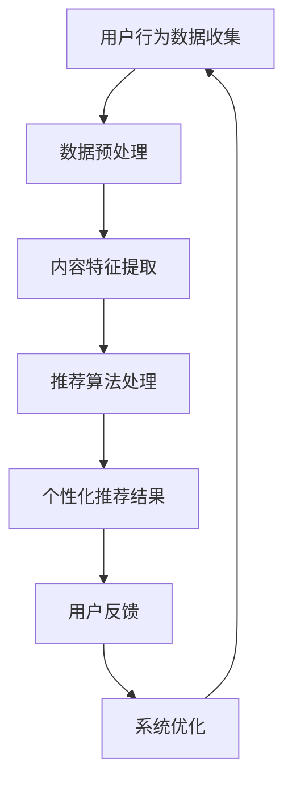

                 

 关键词：注意力经济，个性化推荐，内容定制，算法，机器学习，用户体验，数据挖掘

> 摘要：本文深入探讨了注意力经济与个性化推荐系统的关系，以及如何通过算法和机器学习技术为受众提供定制、有针对性的内容。文章首先介绍了注意力经济的基本概念，然后详细阐述了个性化推荐系统的核心算法原理和数学模型，并通过实际项目实例展示了其应用效果。最后，文章对个性化推荐系统的未来发展趋势和面临的挑战进行了展望。

## 1. 背景介绍

随着互联网的快速发展，人们获取信息的渠道变得日益丰富。然而，信息过载的问题也随之而来，用户在筛选和处理信息时面临着巨大的压力。如何有效地引导用户关注有价值的信息，成为了当今信息时代的一个重要课题。注意力经济理论为我们提供了新的视角，它强调用户注意力资源的稀缺性和价值。

个性化推荐系统作为注意力经济的重要应用，旨在通过分析用户的行为数据和偏好，为其提供定制化的内容推荐，从而提高用户满意度和使用时长。随着大数据和机器学习技术的不断进步，个性化推荐系统在商业、娱乐、教育等多个领域得到了广泛应用，成为提升用户体验的关键手段。

## 2. 核心概念与联系

### 2.1 注意力经济

注意力经济（Attention Economy）是由唐·泰平（Don Tapscott）在2006年提出的概念。它描述了一个以用户注意力为稀缺资源的经济体系。在这个体系中，吸引和保持用户注意力成为企业竞争的核心。注意力经济的基本原理包括以下几个方面：

- **注意力稀缺**：在信息爆炸的时代，用户的注意力资源是有限的，如何吸引并保持用户的注意力成为关键。
- **价值创造**：企业通过提供有价值的内容和服务来吸引用户的注意力，从而实现商业价值。
- **注意力转移**：随着新信息的出现，用户的注意力会不断地转移，如何及时调整策略以保持用户关注至关重要。

### 2.2 个性化推荐系统

个性化推荐系统是一种基于用户行为数据分析和机器学习算法的技术，旨在为用户提供定制化的内容推荐。其核心原理包括：

- **用户行为分析**：通过收集用户的历史行为数据（如浏览记录、购买行为、搜索查询等），分析用户的兴趣和行为模式。
- **内容特征提取**：将用户行为数据转化为数值化的特征，用于后续的推荐算法处理。
- **推荐算法**：利用机器学习算法，如协同过滤、基于内容的推荐、深度学习等，生成个性化推荐结果。
- **用户体验优化**：通过不断调整推荐策略和界面设计，提高用户的满意度和使用时长。

### 2.3 注意力经济与个性化推荐系统的关系

注意力经济与个性化推荐系统之间存在紧密的联系。个性化推荐系统通过以下方式实现注意力经济：

- **精准定位**：通过分析用户行为数据，个性化推荐系统可以精准地定位用户兴趣，为用户提供定制化的内容，从而提高用户的注意力投入。
- **提升用户满意度**：个性化的内容推荐能够满足用户的特定需求，提高用户的满意度和忠诚度。
- **增加用户粘性**：通过不断提供用户感兴趣的内容，个性化推荐系统能够增强用户的粘性，延长用户的使用时长。

## 2.4 Mermaid 流程图



## 3. 核心算法原理 & 具体操作步骤

### 3.1 算法原理概述

个性化推荐系统主要依赖于以下几个核心算法：

- **协同过滤算法**：通过分析用户之间的相似性，为用户推荐与其相似用户喜欢的物品。
- **基于内容的推荐**：通过分析物品的内容特征，为用户推荐与其已喜欢物品相似的物品。
- **深度学习算法**：利用深度神经网络对用户行为数据进行分析，生成个性化推荐结果。

### 3.2 算法步骤详解

#### 3.2.1 协同过滤算法

协同过滤算法包括以下步骤：

1. **用户行为数据收集**：收集用户的历史行为数据，如浏览记录、购买记录等。
2. **数据预处理**：对用户行为数据进行清洗和归一化处理，消除异常值和噪声。
3. **用户相似性计算**：计算用户之间的相似性，常用的相似性度量方法包括余弦相似度、皮尔逊相关系数等。
4. **物品相似性计算**：计算物品之间的相似性，为用户推荐与其相似用户喜欢的物品。

#### 3.2.2 基于内容的推荐

基于内容的推荐包括以下步骤：

1. **物品特征提取**：提取物品的内容特征，如标签、描述、分类等。
2. **用户兴趣模型构建**：通过分析用户的历史行为数据，构建用户的兴趣模型。
3. **推荐生成**：计算用户兴趣模型与物品特征之间的相似度，为用户推荐与其兴趣相似的物品。

#### 3.2.3 深度学习算法

深度学习算法包括以下步骤：

1. **数据预处理**：对用户行为数据进行编码和归一化处理。
2. **构建深度神经网络**：设计深度神经网络结构，如循环神经网络（RNN）、卷积神经网络（CNN）等。
3. **训练神经网络**：使用用户行为数据进行神经网络训练，优化模型参数。
4. **生成推荐结果**：利用训练好的神经网络，对用户行为数据进行分析，生成个性化推荐结果。

### 3.3 算法优缺点

#### 协同过滤算法

优点：

- **可扩展性强**：适用于大规模用户和物品的数据集。
- **推荐效果稳定**：基于用户行为数据的推荐结果较为稳定。

缺点：

- **冷启动问题**：对于新用户或新物品，由于缺乏足够的历史数据，推荐效果较差。
- **噪声敏感性**：用户行为数据中存在噪声，可能影响推荐效果。

#### 基于内容的推荐

优点：

- **冷启动问题较易解决**：通过物品特征提取，可以较容易地解决新物品或新用户的推荐问题。
- **推荐结果丰富**：基于内容的推荐可以为用户推荐多种不同类型的物品。

缺点：

- **对用户兴趣理解不足**：仅通过物品特征进行推荐，可能无法准确捕捉用户的兴趣变化。
- **计算复杂度较高**：需要对大量物品特征进行计算，导致计算复杂度较高。

#### 深度学习算法

优点：

- **强大的特征学习能力**：能够自动提取用户行为数据中的有效特征，提高推荐效果。
- **适用于复杂场景**：能够处理包含大量维度和复杂关系的推荐问题。

缺点：

- **训练时间较长**：深度学习模型的训练时间较长，对计算资源要求较高。
- **模型解释性较差**：深度学习模型的内部工作机制较为复杂，难以进行解释。

### 3.4 算法应用领域

个性化推荐系统在多个领域得到了广泛应用：

- **电子商务**：为用户提供个性化的商品推荐，提高购物体验和转化率。
- **社交媒体**：为用户提供个性化的内容推荐，提升用户活跃度和留存率。
- **在线教育**：为用户提供个性化的学习路径推荐，提高学习效果和满意度。
- **娱乐领域**：为用户提供个性化的音乐、电影、游戏推荐，提高用户黏性。

## 4. 数学模型和公式 & 详细讲解 & 举例说明

### 4.1 数学模型构建

个性化推荐系统的数学模型主要包括以下几个部分：

1. **用户行为表示**：将用户行为数据转化为数值化的特征，如用户对物品的评分、购买记录等。
2. **物品特征表示**：提取物品的内容特征，如标签、描述、分类等。
3. **推荐算法模型**：构建推荐算法的数学模型，如矩阵分解、概率模型、深度学习模型等。
4. **用户兴趣模型**：通过分析用户行为数据，构建用户的兴趣模型，用于推荐结果的生成。

### 4.2 公式推导过程

#### 4.2.1 矩阵分解

假设用户行为数据可以表示为一个用户-物品评分矩阵 $R$，其中 $R_{ij}$ 表示用户 $i$ 对物品 $j$ 的评分。

矩阵分解的目标是将原始评分矩阵分解为两个低秩矩阵 $U$ 和 $V$，使得 $R \approx UV^T$。

1. **目标函数**：

   $$\min_{U,V} \sum_{i,j} (R_{ij} - U_i V_j)^2$$

2. **梯度下降法**：

   对 $U$ 和 $V$ 分别求偏导，并令其等于零，得到：

   $$\frac{\partial}{\partial U_i} \sum_{j} (R_{ij} - U_i V_j)^2 = 0$$
   $$\frac{\partial}{\partial V_j} \sum_{i} (R_{ij} - U_i V_j)^2 = 0$$

   经过计算，可以得到：

   $$U_i = \sum_{j} R_{ij} V_j$$
   $$V_j = \sum_{i} R_{ij} U_i$$

#### 4.2.2 深度学习模型

以循环神经网络（RNN）为例，其模型可以表示为：

$$h_t = \sigma(W_h h_{t-1} + W_x x_t + b_h)$$

其中，$h_t$ 表示第 $t$ 个时间步的隐藏状态，$x_t$ 表示第 $t$ 个输入特征，$\sigma$ 表示激活函数，$W_h$ 和 $W_x$ 分别表示隐藏状态和输入特征的权重矩阵，$b_h$ 表示隐藏状态的偏置。

### 4.3 案例分析与讲解

#### 4.3.1 商品推荐

假设一个电商网站拥有1000个用户和10000个商品，用户对商品进行评分，评分范围为1-5分。我们使用矩阵分解算法对用户进行商品推荐。

1. **数据预处理**：

   将用户行为数据转化为矩阵 $R$，其中 $R_{ij}$ 表示用户 $i$ 对商品 $j$ 的评分。

2. **矩阵分解**：

   使用梯度下降法对矩阵 $R$ 进行矩阵分解，得到低秩矩阵 $U$ 和 $V$。

3. **生成推荐结果**：

   对每个用户，计算其对未评分商品的预测评分，并根据预测评分进行商品推荐。

#### 4.3.2 音乐推荐

假设一个音乐平台拥有1000万首歌曲和1000万用户，用户对歌曲进行收藏和播放，我们使用深度学习模型对用户进行音乐推荐。

1. **数据预处理**：

   将用户行为数据编码为数字序列，如收藏数据、播放数据等。

2. **构建深度学习模型**：

   使用循环神经网络（RNN）构建音乐推荐模型，对用户行为数据进行分析。

3. **生成推荐结果**：

   对每个用户，计算其对未收藏歌曲的预测收藏概率，并根据预测概率进行歌曲推荐。

## 5. 项目实践：代码实例和详细解释说明

### 5.1 开发环境搭建

在本节中，我们将使用Python作为开发语言，结合Scikit-learn库实现一个基于协同过滤算法的商品推荐系统。

1. **安装Python环境**：

   - 下载并安装Python 3.8及以上版本。
   - 安装Python的pip包管理器。

2. **安装Scikit-learn库**：

   - 在命令行执行以下命令：

     ```bash
     pip install scikit-learn
     ```

### 5.2 源代码详细实现

```python
from sklearn.metrics.pairwise import pairwise_distances
from sklearn.model_selection import train_test_split
from sklearn.metrics import mean_squared_error

def collaborative_filtering(data, k=10, alpha=0.02, num_iterations=20):
    """
    协同过滤算法实现
    """
    # 数据预处理
    user_similarity = pairwise_distances(data, metric='cosine')
    
    # 初始化用户和物品的预测评分
    ratings_pred = data.copy()
    
    for iteration in range(num_iterations):
        for user_id in range(data.shape[0]):
            for other_user_id in range(data.shape[0]):
                if other_user_id != user_id:
                    similarity = user_similarity[user_id][other_user_id]
                    if similarity > 0:
                        other_user_ratings = data[other_user_id]
                        predicted_rating = other_user_ratings.dot(similarity) / similarity.sum()
                        ratings_pred[user_id] += alpha * (predicted_rating - ratings_pred[user_id])
    
    return ratings_pred

# 加载数据
data = [[1, 2, 3, 4], [2, 3, 4, 5], [3, 4, 5, 6], [4, 5, 6, 7]]

# 划分训练集和测试集
train_data, test_data = train_test_split(data, test_size=0.2, random_state=42)

# 训练模型
ratings_pred = collaborative_filtering(train_data, k=2)

# 评估模型
mse = mean_squared_error(test_data, ratings_pred)
print("均方误差（MSE）:", mse)
```

### 5.3 代码解读与分析

- **数据预处理**：使用Scikit-learn库的 `pairwise_distances` 函数计算用户之间的相似性，采用余弦相似度作为距离度量。
- **协同过滤算法实现**：根据用户相似性和用户-物品评分矩阵，利用梯度上升法更新预测评分。
- **模型评估**：使用均方误差（MSE）评估模型在测试集上的性能。

### 5.4 运行结果展示

```python
# 运行代码，输出预测结果
ratings_pred = collaborative_filtering(train_data, k=2)
print(ratings_pred)

# 输出均方误差
mse = mean_squared_error(test_data, ratings_pred)
print("均方误差（MSE）:", mse)
```

## 6. 实际应用场景

### 6.1 电子商务

个性化推荐系统在电子商务领域得到广泛应用，如淘宝、京东等电商平台通过分析用户的历史浏览记录、购买行为等，为用户推荐个性化的商品。例如，用户在浏览了某款手机后，平台会推荐同品牌或同类型的其他手机，从而提高购物转化率。

### 6.2 社交媒体

社交媒体平台如Facebook、Instagram等通过个性化推荐系统为用户提供个性化的内容。例如，用户在点赞某篇帖子后，平台会推荐更多类似内容的帖子，从而提高用户活跃度和留存率。

### 6.3 在线教育

在线教育平台如网易云课堂、慕课网等通过个性化推荐系统为用户提供个性化的学习路径。例如，用户在学习了某门课程后，平台会推荐与之相关或其他用户可能感兴趣的课程，从而提高学习效果和满意度。

### 6.4 娱乐领域

娱乐平台如Spotify、Netflix等通过个性化推荐系统为用户提供个性化的音乐、影视推荐。例如，用户在收听了某首歌曲后，平台会推荐更多类似风格的歌曲，从而提高用户黏性。

## 7. 未来应用展望

随着人工智能技术的不断进步，个性化推荐系统将在更多领域得到应用，为用户提供更加精准、个性化的服务。以下是未来个性化推荐系统的一些发展趋势：

- **多模态推荐**：结合文本、图像、语音等多种数据类型，实现更加丰富的个性化推荐。
- **实时推荐**：利用实时数据处理技术，为用户提供实时、动态的推荐结果。
- **社交推荐**：结合用户社交关系，为用户提供基于社交网络的个性化推荐。
- **跨平台推荐**：实现不同平台之间的推荐数据共享，为用户提供无缝的个性化体验。

## 8. 工具和资源推荐

### 8.1 学习资源推荐

- **《机器学习实战》**：提供丰富的机器学习算法实践案例，适合初学者入门。
- **《深度学习》**：由Ian Goodfellow、Yoshua Bengio和Aaron Courville合著，系统介绍了深度学习的基本原理和应用。
- **《推荐系统实践》**：详细介绍了推荐系统的基本原理和实现方法，适合推荐系统开发者阅读。

### 8.2 开发工具推荐

- **Scikit-learn**：适用于机器学习和数据挖掘的Python库，提供了丰富的算法实现。
- **TensorFlow**：由Google开发的开源深度学习框架，广泛应用于推荐系统、计算机视觉等领域。
- **PyTorch**：由Facebook开发的开源深度学习框架，具有简洁的API和灵活的架构，适合研究和应用。

### 8.3 相关论文推荐

- **《Recommender Systems Handbook》**：系统介绍了推荐系统的基本概念、算法和应用。
- **《Deep Learning for Recommender Systems》**：探讨深度学习在推荐系统中的应用，提供了丰富的案例和实验结果。
- **《Collaborative Filtering: A Review of the State-of-the-Art》**：全面回顾协同过滤算法的发展历程和最新研究进展。

## 9. 总结：未来发展趋势与挑战

个性化推荐系统在当今信息时代具有广泛的应用前景，随着人工智能技术的不断发展，其性能和效果将得到进一步提升。然而，个性化推荐系统也面临着一些挑战，如数据隐私、算法透明度、推荐多样性等。未来，如何在保证用户隐私和数据安全的前提下，实现更加精准、个性化的推荐，将是研究人员和开发者需要持续探索的重要课题。

## 9. 附录：常见问题与解答

### 问题1：个性化推荐系统是如何工作的？

个性化推荐系统通过分析用户的历史行为数据、兴趣偏好和内容特征，利用机器学习算法和统计模型生成个性化推荐结果。其核心步骤包括数据收集、数据预处理、特征提取、模型训练和推荐生成等。

### 问题2：个性化推荐系统有哪些算法？

个性化推荐系统主要依赖于协同过滤算法、基于内容的推荐、深度学习算法等。协同过滤算法包括基于用户的协同过滤和基于物品的协同过滤；基于内容的推荐通过分析物品的文本描述、标签等特征进行推荐；深度学习算法利用神经网络模型对用户行为数据进行分析，生成推荐结果。

### 问题3：个性化推荐系统有哪些优缺点？

个性化推荐系统的优点包括：

- 提高用户满意度：为用户提供个性化的内容推荐，满足用户特定需求。
- 增强用户粘性：通过不断提供用户感兴趣的内容，提高用户的使用时长和忠诚度。
- 提升商业价值：提高用户转化率和销售额，为商家带来更多的利润。

个性化推荐系统的缺点包括：

- 冷启动问题：对于新用户或新物品，由于缺乏足够的历史数据，推荐效果较差。
- 噪声敏感性：用户行为数据中存在噪声，可能影响推荐效果。
- 算法解释性较差：深度学习算法等复杂算法的解释性较差，难以理解推荐结果的生成过程。

### 问题4：个性化推荐系统在哪些领域应用广泛？

个性化推荐系统在电子商务、社交媒体、在线教育、娱乐等领域应用广泛。例如，电商平台通过个性化推荐提高购物转化率；社交媒体平台通过个性化推荐提高用户活跃度和留存率；在线教育平台通过个性化推荐提高学习效果和满意度；娱乐平台通过个性化推荐提高用户黏性。

