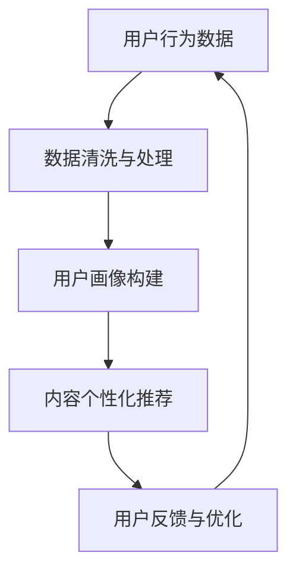

                 

关键词：注意力经济、个性化营销、用户体验、算法、数据分析、定制化

> 摘要：在数字时代，用户的注意力已成为一种宝贵的资源。本文探讨了注意力经济与个性化营销技术的结合，如何通过算法和数据分析为用户提供定制、有针对性的体验，从而提升营销效果和企业竞争力。

## 1. 背景介绍

随着互联网和移动互联网的快速发展，信息爆炸带来了前所未有的用户注意力分散问题。在这个注意力稀缺的时代，如何有效抓住用户的眼球，实现有效的营销传播，成为企业和营销人员面临的一大挑战。而个性化营销技术，正是解决这一问题的关键。

### 注意力经济的概念

注意力经济，是建立在人类注意力稀缺性基础上的新型经济模式。与传统经济模式不同，注意力经济更注重如何吸引和保持用户的注意力，从而实现价值创造。用户的注意力成为了一种新的资源，企业和个人为了争夺这一资源，展开了激烈的竞争。

### 个性化营销技术的崛起

个性化营销技术，指的是通过数据分析和算法，对用户的兴趣、行为、需求等进行深度挖掘，从而为用户推荐个性化内容和服务。这种技术不仅能够提高营销的精准度，还能提升用户的满意度，增强品牌忠诚度。

## 2. 核心概念与联系

### 核心概念原理

注意力经济：用户注意力成为稀缺资源，企业需要通过内容或服务来吸引和保持用户注意力。

个性化营销技术：基于数据分析和算法，对用户行为进行挖掘，为用户提供定制化的内容和服务。

### 架构的 Mermaid 流程图



### 流程说明

- 用户行为数据收集：通过各种渠道收集用户在网站、应用等平台上的行为数据。
- 数据清洗与处理：对收集到的数据进行清洗、整合和处理，确保数据质量。
- 用户画像构建：基于用户行为数据，构建用户的兴趣、需求、行为等画像。
- 内容个性化推荐：根据用户画像，为用户推荐个性化的内容和服务。
- 用户反馈与优化：收集用户反馈，不断优化推荐算法和内容，提升用户体验。

## 3. 核心算法原理 & 具体操作步骤

### 3.1 算法原理概述

个性化营销技术主要依赖于推荐系统和机器学习算法。推荐系统负责根据用户的历史行为和偏好，为用户推荐相关的内容和服务。而机器学习算法则用于训练模型，从数据中提取有用的特征，实现精准的个性化推荐。

### 3.2 算法步骤详解

- 数据收集：从多个渠道收集用户的行为数据，如浏览记录、购买历史、搜索关键词等。
- 数据预处理：对收集到的数据进行清洗、去重、填充等处理，确保数据质量。
- 特征提取：从预处理后的数据中提取用户的行为特征、内容特征等。
- 模型训练：利用提取的特征，训练机器学习模型，如协同过滤、矩阵分解、深度学习等。
- 推荐生成：根据用户画像和模型预测，生成个性化的推荐结果。
- 推荐评估：评估推荐效果，优化推荐算法和内容。

### 3.3 算法优缺点

- 优点：提高营销精准度，提升用户满意度，增强品牌忠诚度。
- 缺点：数据隐私问题、算法偏见、推荐过度个性化等。

### 3.4 算法应用领域

- 电子商务：为用户提供个性化商品推荐，提高销售额。
- 社交媒体：根据用户兴趣推荐好友、动态等内容，增强用户活跃度。
- 教育领域：为学习者推荐个性化学习资源，提高学习效果。
- 健康医疗：为用户提供个性化的健康建议和医疗服务。

## 4. 数学模型和公式 & 详细讲解 & 举例说明

### 4.1 数学模型构建

个性化营销技术中的推荐系统通常基于矩阵分解模型，如最小二乘回归、奇异值分解（SVD）等。以下是矩阵分解模型的基本公式：

$$
X = U \Sigma V^T
$$

其中，$X$ 是用户-物品评分矩阵，$U$ 和 $V$ 分别是用户和物品的特征矩阵，$\Sigma$ 是对角矩阵，包含奇异值。

### 4.2 公式推导过程

矩阵分解的推导过程涉及线性代数中的奇异值分解。给定一个矩阵 $X$，我们可以将其分解为三个矩阵的乘积，即：

$$
X = U \Sigma V^T
$$

其中，$U$ 和 $V$ 是正交矩阵，$\Sigma$ 是对角矩阵，对角线上的元素称为奇异值。

### 4.3 案例分析与讲解

假设我们有一个用户-物品评分矩阵 $X$，其中包含 10 个用户对 100 个物品的评分。我们可以使用 SVD 对其进行分解，得到：

$$
X = U \Sigma V^T
$$

其中，$U$ 和 $V$ 分别是用户和物品的特征矩阵，$\Sigma$ 是对角矩阵，对角线上的元素是奇异值。通过这个模型，我们可以预测用户对未评分的物品的评分，从而进行个性化推荐。

## 5. 项目实践：代码实例和详细解释说明

### 5.1 开发环境搭建

在 Python 环境中，我们可以使用 scikit-learn 库实现矩阵分解。首先，确保安装了 Python 和 scikit-learn：

```bash
pip install python
pip install scikit-learn
```

### 5.2 源代码详细实现

以下是一个简单的矩阵分解示例代码：

```python
from sklearn.metrics.pairwise import pairwise_distances
from sklearn.decomposition import TruncatedSVD

# 生成随机用户-物品评分矩阵
n_users, n_items = 10, 100
R = np.random.rand(n_users, n_items)

# 训练 SVD 模型
svd = TruncatedSVD(n_components=10)
R_svd = svd.fit_transform(R)

# 预测未评分的物品
R_pred = svd.inverse_transform(R_svd)

# 输出预测结果
print(R_pred)
```

### 5.3 代码解读与分析

- 生成随机用户-物品评分矩阵 $R$。
- 使用 TruncatedSVD 进行矩阵分解，得到低维特征矩阵 $R_svd$。
- 使用逆变换将低维特征矩阵还原为预测评分矩阵 $R_pred$。
- 输出预测结果。

### 5.4 运行结果展示

运行上述代码后，我们可以得到预测的评分矩阵。通过对比实际评分矩阵和预测评分矩阵，可以评估矩阵分解的效果。

## 6. 实际应用场景

### 6.1 电子商务

电子商务平台可以通过个性化推荐，提高用户购买转化率。例如，阿里巴巴的“猜你喜欢”功能，就是基于用户的历史行为和浏览记录进行个性化推荐，帮助用户发现潜在感兴趣的商品。

### 6.2 社交媒体

社交媒体平台可以通过个性化推荐，提高用户活跃度和留存率。例如，Facebook 的新闻推送功能，就是根据用户的兴趣和互动行为进行个性化推荐，帮助用户发现感兴趣的内容。

### 6.3 教育领域

教育平台可以通过个性化推荐，提高学习效果。例如，Coursera 的“为你推荐”功能，就是根据用户的学习历史和兴趣，为用户推荐相关的在线课程。

### 6.4 健康医疗

健康医疗平台可以通过个性化推荐，为用户提供个性化的健康建议和医疗服务。例如，春雨医生的健康问答功能，就是根据用户的健康问题和行为，为用户推荐相应的医生和解决方案。

## 7. 工具和资源推荐

### 7.1 学习资源推荐

- 《推荐系统实践》：提供全面的推荐系统理论和实践方法，适合初学者和专业人士。
- 《机器学习实战》：通过案例教学，帮助读者掌握机器学习的基本原理和应用。

### 7.2 开发工具推荐

- Scikit-learn：Python 中的机器学习库，提供了丰富的推荐系统算法。
- TensorFlow：Google 开发的机器学习框架，适用于构建大规模推荐系统。

### 7.3 相关论文推荐

- 《矩阵分解在推荐系统中的应用》：详细介绍了矩阵分解在推荐系统中的应用。
- 《基于深度学习的推荐系统》：探讨了深度学习在推荐系统中的最新研究进展。

## 8. 总结：未来发展趋势与挑战

### 8.1 研究成果总结

个性化营销技术已经成为数字营销领域的重要方向，通过算法和数据分析，企业能够为用户提供更精准、更个性化的体验，提升营销效果和用户满意度。

### 8.2 未来发展趋势

- 深度学习：随着深度学习技术的发展，推荐系统将更加智能化，实现更精准的个性化推荐。
- 跨平台推荐：结合多平台数据，实现跨平台的个性化推荐，提升用户体验。
- 模型解释性：提高推荐模型的解释性，增强用户对推荐结果的理解和信任。

### 8.3 面临的挑战

- 数据隐私：如何保护用户隐私，避免数据泄露，是推荐系统面临的重大挑战。
- 算法偏见：如何消除算法偏见，确保推荐结果的公平性，是推荐系统需要解决的问题。
- 随机性：如何避免推荐结果过于随机，提高推荐的稳定性，是推荐系统需要关注的方面。

### 8.4 研究展望

个性化营销技术在未来将继续发展，为企业和用户带来更多的价值。同时，如何在保护用户隐私、消除算法偏见、提高推荐稳定性等方面取得突破，将是研究的重要方向。

## 9. 附录：常见问题与解答

### 9.1 如何保护用户隐私？

- 使用加密技术，确保用户数据在传输和存储过程中的安全性。
- 设计隐私保护机制，如差分隐私，限制数据挖掘的敏感信息。
- 建立用户隐私协议，明确告知用户数据收集和使用的目的和范围。

### 9.2 如何避免算法偏见？

- 多元化的数据集：确保数据集的多样性，避免算法偏见。
- 可解释性：提高算法的可解释性，确保推荐结果的公正性。
- 定期审计：定期对推荐算法进行审计，及时发现和纠正偏见。

### 9.3 如何提高推荐稳定性？

- 考虑用户行为的变化：动态调整推荐模型，适应用户行为的变化。
- 多样化的推荐策略：结合多种推荐策略，提高推荐的稳定性。
- 用户反馈：收集用户反馈，不断优化推荐算法和内容。

---

本文探讨了注意力经济与个性化营销技术的结合，以及如何通过算法和数据分析为用户提供定制、有针对性的体验。在未来，个性化营销技术将继续发展，为企业和用户带来更多的价值。同时，如何在保护用户隐私、消除算法偏见、提高推荐稳定性等方面取得突破，将是研究的重要方向。希望本文能为读者提供有价值的参考和启示。作者：禅与计算机程序设计艺术 / Zen and the Art of Computer Programming。

