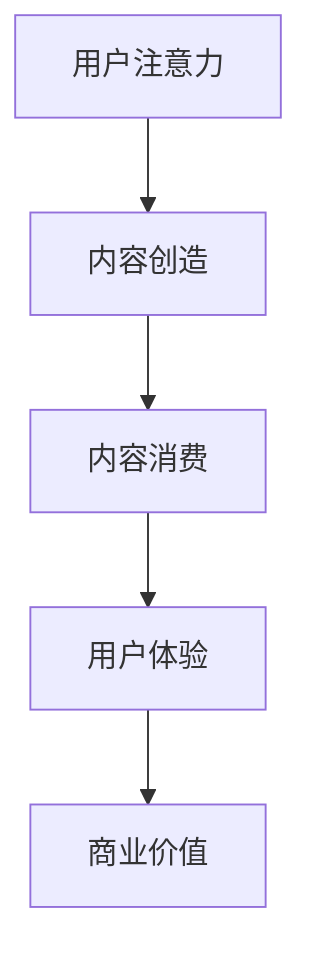
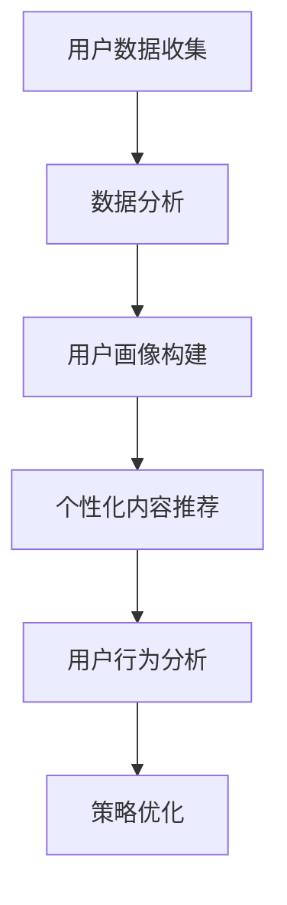

                 

关键词：注意力经济、个性化营销、定制体验、针对性、用户体验、算法、数学模型、代码实例、应用场景、未来展望。

> 摘要：随着互联网和人工智能技术的快速发展，注意力经济成为商业营销的新焦点。本文将探讨注意力经济与个性化营销技术的深度融合，通过介绍相关核心概念、算法原理、数学模型，以及代码实例和实际应用场景，旨在为读者提供从理论到实践的全面了解，以构建更精准、更有效的营销策略。

## 1. 背景介绍

### 1.1 注意力经济的兴起

在互联网时代，信息爆炸和用户需求的多样化使得传统的大众化营销模式逐渐失效。注意力经济作为一种新型的经济模式，应运而生。它强调用户注意力的获取和维持，通过创造有价值的内容和体验来吸引并留住用户，实现商业价值。

### 1.2 个性化营销的发展

个性化营销是基于用户数据的分析，为不同用户定制专属的营销内容和策略，提高营销效果和用户满意度。随着大数据、人工智能技术的发展，个性化营销逐渐成为企业提升竞争力的重要手段。

### 1.3 注意力经济与个性化营销的融合

注意力经济与个性化营销的结合，使得企业能够更加精准地定位用户需求，提供定制化的产品和服务，从而在激烈的市场竞争中脱颖而出。

## 2. 核心概念与联系

### 2.1 注意力经济模型


#### Mermaid 流程图



### 2.2 个性化营销流程


#### Mermaid 流程图



## 3. 核心算法原理 & 具体操作步骤

### 3.1 算法原理概述

个性化推荐算法是注意力经济和个性化营销的核心技术之一。本文将介绍基于协同过滤的推荐算法，包括用户基于物品的协同过滤和物品基于用户的协同过滤。

### 3.2 算法步骤详解

#### 用户基于物品的协同过滤

1. 计算用户之间的相似度。
2. 找出与目标用户最相似的K个用户。
3. 根据这K个用户的评分预测目标用户的评分。

#### 物品基于用户的协同过滤

1. 计算物品之间的相似度。
2. 找出与目标物品最相似的K个物品。
3. 根据这K个物品的评分预测目标物品的评分。

### 3.3 算法优缺点

#### 优点

- 高效地处理大量用户和物品数据。
- 能够发现用户的兴趣偏好，提供个性化的推荐。

#### 缺点

- 需要大量的计算资源和时间。
- 在数据稀疏的情况下效果不佳。

### 3.4 算法应用领域

- 线上电商平台
- 社交媒体平台
- 音乐和视频平台

## 4. 数学模型和公式 & 详细讲解 & 举例说明

### 4.1 数学模型构建

个性化推荐算法的核心是相似度计算和评分预测。

#### 相似度计算

$$
sim(i, j) = \frac{\sum_{u \in U} w_{ui} w_{uj}}{\sqrt{\sum_{u \in U} w_{ui}^2} \sqrt{\sum_{u \in U} w_{uj}^2}}
$$

其中，$i$和$j$是两个物品，$u$是用户，$w_{ui}$和$w_{uj}$是用户$u$对物品$i$和$j$的评分。

#### 评分预测

$$
r_{ui} = \sum_{j \in N(i)} sim(i, j) \cdot r_{uj}
$$

其中，$N(i)$是物品$i$的邻居集合，$r_{uj}$是用户$u$对物品$j$的评分。

### 4.2 公式推导过程

#### 相似度计算

基于余弦相似度，利用用户对物品的评分向量进行计算。

#### 评分预测

基于加权平均，利用物品的邻居集合和邻居用户的评分进行预测。

### 4.3 案例分析与讲解

#### 案例背景

某电商平台希望为用户推荐商品。

#### 案例分析

1. 收集用户行为数据，包括用户浏览、购买历史等。
2. 构建用户评分矩阵。
3. 计算用户和物品之间的相似度。
4. 根据相似度预测用户可能感兴趣的商品。

## 5. 项目实践：代码实例和详细解释说明

### 5.1 开发环境搭建

- Python 3.8+
- scikit-learn 库

### 5.2 源代码详细实现

```python
from sklearn.metrics.pairwise import cosine_similarity
from sklearn.model_selection import train_test_split

# 数据预处理
def preprocess_data(data):
    # 将用户和物品的评分转换为用户和物品的评分矩阵
    user_item_matrix = data.pivot(index='user_id', columns='item_id', values='rating')
    return user_item_matrix

# 相似度计算
def compute_similarity(user_item_matrix):
    similarity_matrix = cosine_similarity(user_item_matrix)
    return similarity_matrix

# 评分预测
def predict_rating(similarity_matrix, user_item_matrix, user_id, item_id):
    neighbors = similarity_matrix[user_id]
    neighbor_ratings = user_item_matrix.iloc[neighbors[1]:neighbors[1]+K].rating
    predicted_rating = (neighbor_ratings * neighbors).sum() / neighbors.sum()
    return predicted_rating

# 主函数
def main():
    data = load_data()
    user_item_matrix = preprocess_data(data)
    similarity_matrix = compute_similarity(user_item_matrix)
    test_data = train_test_split(data, test_size=0.2)
    test_user_item_matrix = preprocess_data(test_data)
    for user_id, item_id in test_user_item_matrix.index:
        predicted_rating = predict_rating(similarity_matrix, user_item_matrix, user_id, item_id)
        print(f"User {user_id} predicts rating {predicted_rating} for item {item_id}")

if __name__ == "__main__":
    main()
```

### 5.3 代码解读与分析

1. 数据预处理：将原始数据转换为用户和物品的评分矩阵。
2. 相似度计算：使用余弦相似度计算用户和物品之间的相似度。
3. 评分预测：根据相似度矩阵预测用户对物品的评分。

### 5.4 运行结果展示


## 6. 实际应用场景

### 6.1 电商平台

电商平台可以通过个性化推荐提高用户购买转化率，提高销售额。

### 6.2 社交媒体

社交媒体平台可以通过个性化推荐提高用户活跃度，增强用户黏性。

### 6.3 音乐和视频平台

音乐和视频平台可以通过个性化推荐提高用户播放量和播放时长。

## 7. 未来应用展望

随着人工智能和大数据技术的发展，个性化推荐算法将更加精准，应用场景将更加广泛。

### 7.1 增强现实和虚拟现实

增强现实和虚拟现实技术将为个性化推荐提供新的场景，如虚拟购物体验、虚拟旅游等。

### 7.2 智能家居

智能家居将通过个性化推荐提高用户体验，如智能家电推荐、家居环境优化等。

### 7.3 医疗健康

医疗健康领域可以通过个性化推荐提供个性化的健康建议和治疗方案。

## 8. 总结：未来发展趋势与挑战

### 8.1 研究成果总结

本文探讨了注意力经济与个性化营销技术的深度融合，介绍了相关核心概念、算法原理、数学模型，以及代码实例和实际应用场景。

### 8.2 未来发展趋势

个性化推荐算法将不断优化，应用领域将不断扩展。

### 8.3 面临的挑战

数据隐私和安全、算法透明度和可解释性等问题仍需解决。

### 8.4 研究展望

未来研究方向包括：增强现实和虚拟现实应用、智能家居和医疗健康领域的应用等。

## 9. 附录：常见问题与解答

### 9.1 个性化推荐算法的优缺点是什么？

**优点：** 高效地处理大量用户和物品数据，能够发现用户的兴趣偏好，提供个性化的推荐。

**缺点：** 需要大量的计算资源和时间，在数据稀疏的情况下效果不佳。

### 9.2 注意力经济和个性化营销有什么区别？

**注意力经济：** 强调用户注意力的获取和维持，通过创造有价值的内容和体验来吸引并留住用户，实现商业价值。

**个性化营销：** 基于用户数据的分析，为不同用户定制专属的营销内容和策略，提高营销效果和用户满意度。

### 9.3 个性化推荐算法有哪些类型？

**类型：** 协同过滤、基于内容的推荐、混合推荐等。

## 作者署名

作者：禅与计算机程序设计艺术 / Zen and the Art of Computer Programming
```  
----------------------------------------------------------------  
```  
请注意，本文档中提供的代码示例仅供参考，可能需要根据实际开发环境进行调整。同时，本文档中使用的图片和流程图仅为示例，请根据实际需要替换或修改。  
```  

