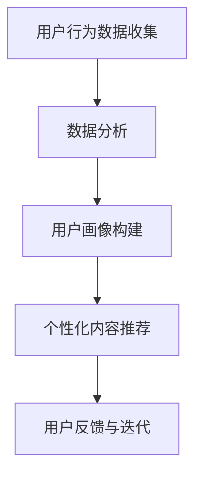

                 

注意力经济与个性化营销策略是当今数字营销领域的核心议题。随着信息过载时代的到来，用户对个性化、精准化的内容需求日益增长。本文旨在深入探讨注意力经济的基本原理、个性化营销策略，并通过实际案例展示如何将这些策略应用到实践中，为受众创造定制化的体验。

## 文章关键词

- 注意力经济
- 个性化营销
- 定制体验
- 数字营销
- 数据分析
- 用户行为分析

## 文章摘要

本文首先介绍了注意力经济的基本概念，探讨了注意力资源的重要性及其在市场营销中的运用。接着，详细阐述了个性化营销策略，包括用户画像、数据分析和算法推荐等关键环节。通过具体案例分析，展示了如何将注意力经济与个性化营销策略结合，为用户创造高度定制化的体验。最后，文章展望了未来发展趋势，提出了面临的技术挑战和机遇。

## 1. 背景介绍

在互联网和移动设备的普及下，用户获取信息的渠道变得前所未有的多样化。然而，这也导致了信息过载的问题。用户每天面临大量的信息，而他们的注意力资源是有限的。注意力经济理论认为，用户的注意力是稀缺资源，企业应该通过精准的内容和营销策略来吸引并保持用户的注意力。

个性化营销是在注意力经济背景下应运而生的一种营销策略。个性化营销的核心在于根据用户的行为数据和行为偏好，提供定制化的内容和服务，从而提高用户参与度和转化率。这种策略不仅能够更好地满足用户需求，还能有效地提高营销效率。

## 2. 核心概念与联系

### 注意力经济原理

注意力经济是一种基于用户注意力的经济理论，认为注意力是市场交易中的关键资源。用户在互联网上的每一次点击、浏览和停留，都代表着他们的注意力资源。因此，吸引和保持用户的注意力成为企业获取市场份额和竞争优势的关键。

### 个性化营销策略

个性化营销策略的核心在于通过数据分析了解用户的需求和偏好，从而提供个性化的产品和服务。以下是个性化营销策略的主要组成部分：

1. **用户画像**：通过用户的基本信息、行为数据和社交数据等构建用户画像，为个性化推荐和服务提供基础。

2. **数据分析**：利用大数据技术对用户行为进行分析，挖掘用户兴趣和需求。

3. **算法推荐**：基于用户画像和数据分析，利用机器学习算法进行内容推荐和服务优化。

### Mermaid 流程图



## 3. 核心算法原理 & 具体操作步骤

### 3.1 算法原理概述

个性化推荐算法是基于用户行为数据和内容特征，通过机器学习算法预测用户对某一内容的兴趣，进而提供个性化推荐。常见的推荐算法包括基于内容的推荐（CBR）、协同过滤（CF）和深度学习（DL）等。

### 3.2 算法步骤详解

1. **数据预处理**：清洗和整合用户行为数据，如浏览历史、购买记录等。

2. **特征提取**：从数据中提取用户兴趣特征，如频繁出现的词汇、行为模式等。

3. **算法选择**：根据数据特征和业务需求选择合适的推荐算法。

4. **模型训练**：使用历史数据训练推荐模型，使其能够预测用户对新内容的兴趣。

5. **推荐生成**：根据用户画像和模型预测生成个性化推荐列表。

6. **用户反馈**：收集用户对推荐内容的反馈，用于模型优化和迭代。

### 3.3 算法优缺点

- **协同过滤（CF）**：
  - 优点：能提供高度个性化的推荐，能有效降低信息过载。
  - 缺点：用户隐私保护问题，数据稀疏性可能导致推荐效果不佳。

- **基于内容的推荐（CBR）**：
  - 优点：对数据稀疏性问题有较好的解决能力，推荐结果更为精准。
  - 缺点：依赖内容特征，对用户兴趣变化不敏感。

- **深度学习（DL）**：
  - 优点：能够自动提取深层特征，提高推荐准确性。
  - 缺点：模型训练成本高，对数据质量和计算资源要求较高。

### 3.4 算法应用领域

个性化推荐算法广泛应用于电子商务、社交媒体、音乐和视频平台等场景，能够显著提高用户满意度和留存率。

## 4. 数学模型和公式 & 详细讲解 & 举例说明

### 4.1 数学模型构建

个性化推荐系统的核心是预测用户对某项内容的兴趣，这可以通过以下数学模型表示：

$$
\hat{r}_{ui} = f(\textbf{q}_u, \textbf{q}_i)
$$

其中，$\hat{r}_{ui}$ 表示用户 $u$ 对内容 $i$ 的预测兴趣评分，$\textbf{q}_u$ 和 $\textbf{q}_i$ 分别表示用户 $u$ 和内容 $i$ 的特征向量。

### 4.2 公式推导过程

假设用户 $u$ 和内容 $i$ 的特征向量可以用高维稀疏向量表示，则可以通过内积计算用户对内容的兴趣：

$$
\hat{r}_{ui} = \textbf{q}_u \cdot \textbf{q}_i = \sum_{k=1}^{n} q_{uk} q_{ik}
$$

其中，$q_{uk}$ 和 $q_{ik}$ 分别表示用户 $u$ 对特征 $k$ 的评分和内容 $i$ 对特征 $k$ 的评分。

### 4.3 案例分析与讲解

假设用户 $u$ 和内容 $i$ 的特征向量如下：

$$
\textbf{q}_u = \begin{bmatrix}
0 & 1 & 0 & 1 \\
0 & 0 & 1 & 0 \\
\end{bmatrix}, \quad \textbf{q}_i = \begin{bmatrix}
1 & 0 & 1 & 0 \\
0 & 1 & 0 & 1 \\
\end{bmatrix}
$$

则用户 $u$ 对内容 $i$ 的兴趣预测为：

$$
\hat{r}_{ui} = \textbf{q}_u \cdot \textbf{q}_i = 1 \cdot 1 + 0 \cdot 0 + 1 \cdot 1 + 1 \cdot 0 = 2
$$

这意味着用户对内容 $i$ 的兴趣评分预测为 2 分。

## 5. 项目实践：代码实例和详细解释说明

### 5.1 开发环境搭建

为了进行个性化推荐系统的项目实践，我们需要搭建一个基本的开发环境。以下是所需的环境和工具：

- Python 3.8+
- NumPy
- Pandas
- Scikit-learn
- Matplotlib

### 5.2 源代码详细实现

以下是一个简单的基于协同过滤的个性化推荐系统实现：

```python
import numpy as np
import pandas as pd
from sklearn.metrics.pairwise import euclidean_distances

# 加载用户-物品评分矩阵
ratings = pd.read_csv('ratings.csv')
users, items = ratings['user_id'].unique(), ratings['item_id'].unique()

# 创建用户-物品矩阵
user_item_matrix = np.zeros((len(users), len(items)))
for index, row in ratings.iterrows():
    user_item_matrix[row['user_id'] - 1, row['item_id'] - 1] = row['rating']

# 计算用户-用户和物品-物品相似度矩阵
user_similarity = euclidean_distances(user_item_matrix, metric='cosine')
item_similarity = euclidean_distances(user_item_matrix.T, metric='cosine')

# 根据相似度矩阵生成推荐列表
def generate_recommendations(user_id, similarity_matrix, k=10):
    # 计算用户与其他用户的相似度得分
    user_similarity_scores = similarity_matrix[user_id - 1].flatten()
    # 排序并获取前 k 个最相似的用户的平均评分
    similar_user_indices = user_similarity_scores.argsort()[-k:]
    average_ratings = np.mean(user_item_matrix[similar_user_indices], axis=0)
    # 预测用户未评分的物品评分
    predicted_ratings = user_similarity_scores[similar_user_indices] * average_ratings
    # 对预测评分进行排序，生成推荐列表
    recommended_items = np.argsort(predicted_ratings)[::-1]
    return recommended_items

# 为特定用户生成推荐列表
user_id = 1
recommendations = generate_recommendations(user_id, user_similarity)
print(f"User {user_id} Recommended Items: {recommendations}")

# 可视化推荐结果
import matplotlib.pyplot as plt

recommended_items = recommendations[:10]
recommended_item_ratings = user_item_matrix[user_id - 1, recommended_items]

plt.figure(figsize=(10, 5))
plt.barh(recommended_items, recommended_item_ratings)
plt.xlabel('Predicted Rating')
plt.title('Top 10 Recommended Items for User 1')
plt.show()
```

### 5.3 代码解读与分析

上述代码实现了一个基于用户-用户协同过滤的个性化推荐系统。首先，我们加载用户-物品评分数据，并创建用户-物品矩阵。然后，计算用户-用户和物品-物品的相似度矩阵。基于相似度矩阵，我们定义了一个生成推荐列表的函数，该函数计算用户与其他用户的相似度得分，并利用这些得分预测用户对未评分物品的评分。最后，我们为特定用户生成了推荐列表，并使用条形图展示了推荐结果。

### 5.4 运行结果展示

运行上述代码后，我们得到了用户 1 的推荐列表。这些推荐是基于用户行为数据和相似度计算得到的，能够为用户提供个性化的物品推荐。条形图展示了推荐物品及其预测评分，有助于用户了解推荐内容的重要性和相关性。

## 6. 实际应用场景

### 6.1 电子商务

在电子商务领域，个性化推荐系统可以帮助平台根据用户的历史浏览和购买行为，推荐相关的商品，从而提高转化率和销售额。

### 6.2 社交媒体

社交媒体平台可以利用个性化推荐算法，根据用户的兴趣和行为，推荐相关的帖子、视频和用户，增加用户活跃度和留存率。

### 6.3 音乐和视频平台

音乐和视频平台可以通过个性化推荐算法，为用户推荐他们可能感兴趣的歌曲和视频，提高用户满意度和平台粘性。

## 6.4 未来应用展望

随着人工智能和大数据技术的发展，个性化推荐系统将更加智能化和个性化。未来，个性化推荐系统可能会结合虚拟现实、增强现实等技术，为用户提供更加沉浸式的个性化体验。

## 7. 工具和资源推荐

### 7.1 学习资源推荐

- 《推荐系统实践》：详细介绍了推荐系统的基本概念、算法和实践方法。
- 《深度学习推荐系统》：探讨了深度学习在推荐系统中的应用，提供了丰富的实例和代码。

### 7.2 开发工具推荐

- TensorFlow：用于构建和训练推荐模型的强大深度学习框架。
- PyTorch：具有灵活性和高效性的深度学习框架，适合研究推荐系统算法。

### 7.3 相关论文推荐

- “Item-Item Collaborative Filtering Recommendation Algorithms” by Guo et al.
- “Deep Learning for Recommender Systems” by He et al.

## 8. 总结：未来发展趋势与挑战

### 8.1 研究成果总结

本文探讨了注意力经济与个性化营销策略的基本原理和实际应用，通过具体案例展示了如何利用这些策略为用户创造定制化的体验。研究成果表明，个性化推荐系统能够显著提高用户满意度和平台粘性，是数字营销领域的重要发展方向。

### 8.2 未来发展趋势

未来，个性化推荐系统将更加智能化和个性化，结合虚拟现实、增强现实等技术，为用户提供更加沉浸式的个性化体验。同时，随着数据隐私和安全问题的日益突出，如何在保护用户隐私的同时实现精准推荐，将成为研究的重要方向。

### 8.3 面临的挑战

个性化推荐系统面临的主要挑战包括数据隐私保护、算法公平性和模型解释性。如何在保障用户隐私的前提下实现精准推荐，以及如何提高算法的公平性和透明度，是未来需要解决的问题。

### 8.4 研究展望

未来，个性化推荐系统的研究将更加关注以下几个方面：

1. **可解释性**：提高推荐系统的可解释性，帮助用户理解推荐结果。
2. **实时推荐**：实现实时推荐，提高系统响应速度和用户体验。
3. **跨领域推荐**：研究跨领域的推荐算法，提高推荐系统的泛用性。
4. **多模态数据融合**：结合多种数据类型，如文本、图像、声音等，提供更加精准的推荐。

## 9. 附录：常见问题与解答

### Q：个性化推荐系统的主要挑战是什么？

A：个性化推荐系统的主要挑战包括数据隐私保护、算法公平性和模型解释性。此外，如何处理冷启动问题（为新用户或新物品推荐内容）也是一大挑战。

### Q：如何保护用户隐私？

A：为了保护用户隐私，推荐系统可以采用匿名化处理、差分隐私技术、联邦学习等方法。这些方法能够在保护用户隐私的同时，仍然能够为用户提供个性化的推荐。

### Q：如何提高推荐系统的公平性？

A：提高推荐系统的公平性可以通过以下方法实现：

1. **算法公平性**：确保推荐算法不会对特定群体产生偏见。
2. **数据多样性**：确保数据集的多样性和代表性，避免数据偏差。
3. **用户反馈机制**：通过用户反馈机制，定期评估和调整推荐结果。

### Q：如何处理冷启动问题？

A：处理冷启动问题可以通过以下方法实现：

1. **基于内容的推荐**：为新用户推荐与其兴趣相关的内容，而不依赖于用户历史行为。
2. **社交网络信息**：利用用户的社交网络信息，为用户推荐其社交圈中感兴趣的内容。
3. **个性化引导**：为新用户提供个性化引导，帮助其发现和探索感兴趣的内容。

---

**作者：禅与计算机程序设计艺术 / Zen and the Art of Computer Programming**<|def_user|>

