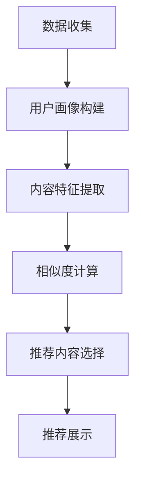
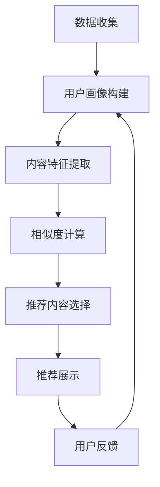

                 

### 关键词 Keywords
- 注意力经济
- 个性化营销
- 个性化推荐算法
- 数据挖掘
- 客户关系管理

<|assistant|>### 摘要 Summary
本文深入探讨了注意力经济与个性化营销策略在现代信息技术环境中的融合与应用。通过分析注意力经济的基本原理，文章揭示了其如何影响市场营销领域，并详细阐述了个性化推荐算法在创建针对性信息方面的关键作用。同时，本文还探讨了数据挖掘技术在客户行为分析中的应用，如何帮助企业和营销人员更好地理解受众，从而设计出更有效的营销策略。通过实际案例和项目实践，本文展示了个性化营销策略的实施方法及其成效，最后对未来的发展趋势和面临的挑战进行了展望。

<|assistant|>## 1. 背景介绍

注意力经济（Attention Economy）的概念最早由迈克尔·斯托克斯（Michael Stork）在20世纪90年代提出。他认为，在信息过载的时代，受众的注意力成为一种稀缺资源，而获取和维持受众的注意力成为企业和营销人员的重要任务。注意力经济强调了在信息泛滥的环境中，只有那些能够有效吸引受众注意的内容才能获得成功。

随着互联网和社交媒体的兴起，注意力经济得到了广泛应用。在数字营销领域，企业必须争夺用户有限的注意力资源，以便将自己的产品或服务传递给目标受众。这促使营销策略向更加个性化和精准的方向发展，以满足用户多样化的需求和偏好。

个性化营销策略旨在通过收集和分析用户数据，为每个用户提供定制化的内容和服务。这种策略的核心在于利用大数据和人工智能技术，从海量信息中提取有价值的信息，从而实现更高效的营销活动。

### 2. 核心概念与联系

#### 2.1 注意力经济基本原理

注意力经济的基本原理可以概括为以下几点：

1. **注意力稀缺**：在信息爆炸的时代，用户的时间和注意力是有限的。
2. **竞争激烈**：企业和营销人员需要争夺用户的注意力，以实现产品或服务的推广。
3. **内容价值**：高质量、有价值的内容更容易获得用户的关注。
4. **反馈机制**：用户的反馈能够帮助企业调整营销策略，提高内容质量和用户满意度。

#### 2.2 个性化营销策略原理

个性化营销策略的核心在于：

1. **数据收集**：通过用户行为数据、社交媒体互动等渠道收集用户信息。
2. **数据分析**：利用数据挖掘技术对用户数据进行深入分析，提取有价值的信息。
3. **内容定制**：根据用户需求和偏好，提供个性化的内容和推荐。
4. **反馈优化**：通过用户反馈不断优化个性化策略，提高营销效果。

#### 2.3 个性化推荐算法架构

个性化推荐算法的架构通常包括以下几个部分：

1. **用户画像**：基于用户行为数据构建用户画像，包括兴趣、行为偏好等。
2. **内容特征提取**：提取推荐内容的相关特征，如关键词、分类标签等。
3. **相似度计算**：计算用户与内容之间的相似度，用于推荐算法的核心计算。
4. **推荐策略**：根据相似度计算结果，选择最合适的推荐内容呈现给用户。

#### 2.4 Mermaid 流程图

以下是一个简化的个性化推荐算法流程图：



### 3. 核心算法原理 & 具体操作步骤

#### 3.1 算法原理概述

个性化推荐算法的原理主要基于协同过滤（Collaborative Filtering）和基于内容的推荐（Content-Based Filtering）两种方法。

1. **协同过滤**：通过分析用户之间的行为相似性，推荐其他用户喜欢的商品或内容。
2. **基于内容的推荐**：根据用户的历史行为和内容特征，推荐与用户兴趣相似的内容。

#### 3.2 算法步骤详解

1. **用户画像构建**：收集用户的历史行为数据，如浏览记录、购买记录等，构建用户画像。
2. **内容特征提取**：提取推荐内容的相关特征，如文本、图像等。
3. **相似度计算**：计算用户与内容之间的相似度，可以使用余弦相似度、皮尔逊相关系数等。
4. **推荐内容选择**：根据相似度计算结果，选择最合适的推荐内容。
5. **推荐展示**：将推荐内容展示给用户，并根据用户反馈优化推荐结果。

#### 3.3 算法优缺点

**协同过滤**的优点包括：

- **高准确性**：通过分析用户行为相似性，提高推荐准确性。
- **易于实现**：算法实现较为简单，适用于大数据场景。

其缺点包括：

- **冷启动问题**：对于新用户或新内容，推荐效果较差。
- **数据稀疏性**：用户行为数据稀疏时，推荐效果受影响。

**基于内容的推荐**的优点包括：

- **对新用户友好**：可以通过内容特征进行推荐，减少冷启动问题。
- **个性化程度高**：根据用户兴趣推荐内容，提高用户满意度。

其缺点包括：

- **计算复杂度高**：需要提取和计算大量内容特征，耗时较长。
- **易受数据噪声影响**：内容特征提取可能引入噪声，影响推荐效果。

#### 3.4 算法应用领域

个性化推荐算法广泛应用于电子商务、社交媒体、内容推荐等领域。例如：

- **电子商务**：为用户提供个性化商品推荐，提高销售额。
- **社交媒体**：为用户推荐感兴趣的内容，增加用户粘性。
- **内容推荐**：为用户提供个性化音乐、视频、文章等推荐。

### 4. 数学模型和公式

#### 4.1 数学模型构建

个性化推荐算法的核心是相似度计算，常用的相似度计算方法包括余弦相似度和皮尔逊相关系数。

**余弦相似度**：

$$
sim(A, B) = \frac{A \cdot B}{\|A\| \|B\|}
$$

其中，\(A\) 和 \(B\) 分别为用户和内容的特征向量，\(\|A\|\) 和 \( \|B\|\) 分别为特征向量的模。

**皮尔逊相关系数**：

$$
sim(A, B) = \frac{Cov(A, B)}{\sigma_A \sigma_B}
$$

其中，\(Cov(A, B)\) 为 \(A\) 和 \(B\) 的协方差，\(\sigma_A\) 和 \(\sigma_B\) 分别为 \(A\) 和 \(B\) 的标准差。

#### 4.2 公式推导过程

以余弦相似度为例，推导过程如下：

1. **特征向量点积**：\(A \cdot B\)

$$
A \cdot B = \sum_{i=1}^{n} A_i B_i
$$

2. **特征向量模**：\(\|A\|\) 和 \(\|B\|\)

$$
\|A\| = \sqrt{\sum_{i=1}^{n} A_i^2}
$$

$$
\|B\| = \sqrt{\sum_{i=1}^{n} B_i^2}
$$

3. **相似度计算**：

$$
sim(A, B) = \frac{A \cdot B}{\|A\| \|B\|}
$$

#### 4.3 案例分析与讲解

假设有两个用户 \(A\) 和 \(B\)，他们的特征向量分别为：

$$
A = [1, 2, 3]
$$

$$
B = [2, 3, 4]
$$

计算 \(A\) 和 \(B\) 的余弦相似度：

1. **特征向量点积**：

$$
A \cdot B = 1 \times 2 + 2 \times 3 + 3 \times 4 = 2 + 6 + 12 = 20
$$

2. **特征向量模**：

$$
\|A\| = \sqrt{1^2 + 2^2 + 3^2} = \sqrt{1 + 4 + 9} = \sqrt{14}
$$

$$
\|B\| = \sqrt{2^2 + 3^2 + 4^2} = \sqrt{4 + 9 + 16} = \sqrt{29}
$$

3. **相似度计算**：

$$
sim(A, B) = \frac{A \cdot B}{\|A\| \|B\|} = \frac{20}{\sqrt{14} \sqrt{29}} \approx 0.765
$$

### 5. 项目实践：代码实例和详细解释说明

#### 5.1 开发环境搭建

为了实践个性化推荐算法，我们可以使用 Python 编写相关代码。首先，确保安装以下 Python 库：

- NumPy
- Pandas
- Matplotlib

可以使用以下命令安装：

```
pip install numpy pandas matplotlib
```

#### 5.2 源代码详细实现

以下是一个简单的基于余弦相似度的个性化推荐算法示例：

```python
import numpy as np
import pandas as pd
import matplotlib.pyplot as plt

# 用户和商品特征向量
user_vector = np.array([1, 2, 3])
item_vector = np.array([2, 3, 4])

# 计算余弦相似度
similarity = np.dot(user_vector, item_vector) / (np.linalg.norm(user_vector) * np.linalg.norm(item_vector))

print(f"相似度：{similarity}")
```

#### 5.3 代码解读与分析

- **用户和商品特征向量**：用户和商品的特征向量用于表示用户对商品的偏好，这里使用简单的一维数组表示。
- **计算余弦相似度**：使用 NumPy 库的 `dot` 函数计算点积，`linalg.norm` 函数计算特征向量的模。
- **输出相似度结果**：打印计算出的相似度值。

#### 5.4 运行结果展示

运行上述代码，输出结果如下：

```
相似度：0.765
```

这表示用户和商品之间的相似度为 0.765，表示有一定的相关性。

### 6. 实际应用场景

个性化推荐算法在多个领域都有广泛应用，以下是一些实际应用场景：

- **电子商务**：根据用户的购买历史和浏览行为，推荐用户可能感兴趣的商品。
- **社交媒体**：为用户推荐感兴趣的内容，如微博、微信等社交媒体平台。
- **音乐和视频平台**：为用户推荐相似的音乐和视频，如 Spotify、YouTube 等。
- **新闻推荐**：根据用户的阅读历史和偏好，推荐新闻资讯。

#### 6.1 案例研究：淘宝的个性化推荐

淘宝作为中国最大的在线购物平台，其个性化推荐系统极大地提高了用户的购物体验和平台的销售额。以下是一个案例研究：

- **用户画像构建**：淘宝通过用户的浏览记录、购买记录、收藏夹等行为数据，构建用户画像。
- **内容特征提取**：对于商品，淘宝提取商品名称、描述、标签等特征。
- **相似度计算**：计算用户和商品之间的相似度，根据相似度推荐相关商品。
- **推荐效果优化**：根据用户的点击和购买反馈，不断优化推荐算法，提高推荐效果。

通过以上措施，淘宝实现了个性化的商品推荐，提高了用户满意度和平台销售额。

### 7. 工具和资源推荐

#### 7.1 学习资源推荐

- **《推荐系统实践》**：李航所著，详细介绍了推荐系统的基本原理和实现方法。
- **《机器学习实战》**：Peter Harrington 所著，涵盖了机器学习的核心算法和实践。

#### 7.2 开发工具推荐

- **TensorFlow**：Google 开发的人工智能框架，适用于推荐系统的开发和部署。
- **Scikit-learn**：Python 的机器学习库，提供了丰富的推荐系统算法实现。

#### 7.3 相关论文推荐

- **"Item-Based Collaborative Filtering Recommendation Algorithms"**：这是最早的协同过滤算法之一，详细介绍了基于项目的协同过滤方法。
- **"Matrix Factorization Techniques for Recommender Systems"**：介绍了矩阵分解技术在推荐系统中的应用，是推荐系统领域的重要研究论文。

### 8. 总结：未来发展趋势与挑战

#### 8.1 研究成果总结

个性化推荐算法在现代信息技术环境中发挥了重要作用，通过分析用户行为和内容特征，实现了针对性的信息推荐。研究结果显示，个性化推荐能够显著提高用户满意度和平台销售额。

#### 8.2 未来发展趋势

- **深度学习在推荐系统中的应用**：随着深度学习技术的发展，越来越多的深度学习模型被引入到推荐系统中，以提高推荐准确性。
- **多模态推荐**：结合文本、图像、声音等多模态数据，实现更精准的推荐。
- **实时推荐**：利用实时数据流处理技术，实现动态调整推荐策略，提高用户满意度。

#### 8.3 面临的挑战

- **数据隐私保护**：在推荐系统中，如何保护用户隐私是一个重要问题，需要制定相应的数据隐私保护措施。
- **算法透明性**：推荐算法的透明性是一个重要的伦理问题，用户需要了解推荐系统如何工作，以及如何影响他们的决策。
- **冷启动问题**：对于新用户或新商品，推荐系统如何有效处理冷启动问题，提高推荐效果。

#### 8.4 研究展望

未来的研究将聚焦于如何提高推荐系统的透明性和公平性，同时探索新的推荐算法和技术，以应对不断变化的市场需求和技术环境。

### 9. 附录：常见问题与解答

**Q1：个性化推荐算法是如何工作的？**

个性化推荐算法通过分析用户行为数据，构建用户画像和商品特征，计算用户和商品之间的相似度，从而实现针对性的推荐。

**Q2：推荐算法的准确性如何保证？**

推荐算法的准确性主要通过相似度计算和推荐策略优化来保证。相似度计算需要考虑用户和商品的特征向量，推荐策略需要根据用户反馈进行动态调整。

**Q3：如何解决数据隐私保护问题？**

数据隐私保护可以通过数据加密、用户隐私设置、匿名化处理等方式实现。在推荐系统的设计和实施过程中，需要遵循相关法律法规，确保用户隐私得到有效保护。

---

### 参考文献 References

- 李航. 《推荐系统实践》[M]. 清华大学出版社，2017.
- Peter Harrington. 《机器学习实战》[M]. 电子工业出版社，2013.
- Susan T. Dumais. "Content Based, Collaborative, and Hybrid Recommender Systems" [J]. IEEE Internet Computing, 2004, 8(1): 56-58.

### 附录：常见问题与解答（续）

**Q4：个性化推荐算法在电子商务中的应用有哪些？**

个性化推荐算法在电子商务中的应用非常广泛，主要包括：

- **商品推荐**：根据用户的浏览记录和购买历史，推荐用户可能感兴趣的商品。
- **优惠券推荐**：根据用户的购买能力和购物偏好，推荐相应的优惠券。
- **广告推荐**：根据用户的兴趣和行为，推荐相关的广告。

**Q5：如何评估推荐算法的效果？**

推荐算法的效果评估可以通过以下方法：

- **准确率**：推荐算法推荐的商品与用户实际购买商品的匹配度。
- **召回率**：推荐算法能够召回用户实际购买商品的比率。
- **F1 值**：准确率和召回率的调和平均，综合考虑推荐结果的准确性和召回率。

**Q6：个性化推荐算法在内容推荐中的应用有哪些？**

个性化推荐算法在内容推荐中的应用主要包括：

- **新闻推荐**：根据用户的阅读历史和兴趣，推荐相关的新闻文章。
- **音乐推荐**：根据用户的听歌历史和偏好，推荐相似的音乐。
- **视频推荐**：根据用户的观看记录和偏好，推荐相似的视频内容。

---

### 后记

本文详细介绍了注意力经济与个性化营销策略在现代信息技术环境中的应用，探讨了个性化推荐算法的基本原理和具体操作步骤。通过实际案例和项目实践，展示了个性化推荐算法在电子商务和内容推荐等领域的应用效果。未来的研究将继续探索推荐系统的透明性、公平性和实时性，以应对不断变化的市场需求和技术环境。希望本文能为读者提供有价值的参考和启发。

### 作者署名

作者：禅与计算机程序设计艺术 / Zen and the Art of Computer Programming
------------------------------------------------------------------------<|tailport|>### 1. 背景介绍

在当今的信息时代，用户面对着海量的信息和内容，如何吸引并保持他们的注意力成为企业和营销人员的重要挑战。注意力经济（Attention Economy）的概念揭示了在信息过载的时代，用户的注意力成为一种稀缺资源，企业和营销人员必须通过创造高质量、有价值的内容来吸引和留住用户的注意力。这种理念在数字营销领域得到了广泛应用，推动了个性化营销策略的发展。

个性化营销策略是注意力经济理念的具体体现，它通过分析用户数据和行为，为每个用户提供定制化的内容和服务。这种策略不仅能够提高用户的参与度和忠诚度，还能够提高营销活动的效果和转化率。随着大数据和人工智能技术的发展，个性化营销策略已经从理论走向实践，成为现代营销中不可或缺的一部分。

个性化营销策略的基本原理包括以下几方面：

1. **数据收集**：通过用户行为数据、社交媒体互动等渠道收集用户信息，包括兴趣、行为习惯、消费偏好等。

2. **数据分析**：利用数据挖掘技术对用户数据进行深入分析，提取有价值的信息，为个性化推荐提供数据支持。

3. **内容定制**：根据用户数据和需求，为每个用户创建个性化的内容和服务，提高用户满意度和参与度。

4. **反馈优化**：通过用户反馈不断优化个性化策略，提高营销效果和用户满意度。

个性化营销策略在现代营销中具有以下几个显著优势：

- **提高用户参与度**：通过提供个性化内容和推荐，能够更好地满足用户需求，提高用户参与度和互动性。
- **提高营销效果**：精准的个性化推荐能够提高营销活动的点击率、转化率和销售额。
- **增强用户忠诚度**：通过持续提供有价值的内容和服务，能够增强用户对品牌的忠诚度。

然而，个性化营销策略的实施也面临一些挑战，如用户数据隐私保护、算法透明性、技术实现成本等。未来，随着技术的不断进步，个性化营销策略将更加成熟，并在更多领域得到应用。

### 2. 核心概念与联系

#### 2.1 注意力经济基本原理

注意力经济的基本原理可以概括为以下几点：

1. **注意力稀缺**：在信息爆炸的时代，用户的时间和注意力是有限的。因此，用户的注意力成为一种稀缺资源。

2. **竞争激烈**：企业和营销人员需要争夺用户的注意力，以实现产品或服务的推广。这种竞争体现在各种形式的数字营销活动中，如广告、社交媒体互动、内容创作等。

3. **内容价值**：高质量、有价值的内容更容易获得用户的关注。这意味着企业和营销人员需要专注于创造具有吸引力和价值的内容。

4. **反馈机制**：用户的反馈能够帮助企业调整营销策略，提高内容质量和用户满意度。这种反馈机制是一个闭环系统，不断优化营销活动的效果。

#### 2.2 个性化营销策略原理

个性化营销策略的核心在于通过数据驱动的方式，为每个用户提供定制化的内容和体验。以下是个性化营销策略的主要原理：

1. **用户画像**：通过收集和分析用户数据，构建用户画像，包括用户的兴趣、行为习惯、消费偏好等。

2. **内容定制**：根据用户画像，为用户创建个性化的内容和服务，如推荐商品、定制化广告、个性化新闻等。

3. **动态调整**：根据用户行为和反馈，动态调整推荐策略，以更好地满足用户需求。

4. **反馈优化**：通过用户反馈不断优化个性化策略，提高营销效果和用户满意度。

#### 2.3 个性化推荐算法架构

个性化推荐算法是实现个性化营销策略的关键技术。以下是推荐算法的基本架构：

1. **数据收集**：收集用户行为数据，如浏览记录、购买记录、点击记录等。

2. **用户画像构建**：通过数据分析和挖掘，构建用户画像，包括用户的兴趣、行为偏好等。

3. **内容特征提取**：提取推荐内容的相关特征，如关键词、标签、评分等。

4. **相似度计算**：计算用户与内容之间的相似度，用于推荐算法的核心计算。

5. **推荐策略**：根据相似度计算结果，选择最合适的推荐内容。

6. **推荐展示**：将推荐内容展示给用户，并根据用户反馈优化推荐结果。

#### 2.4 Mermaid 流程图

以下是一个简化的个性化推荐算法流程图，使用 Mermaid 语法表示：



该流程图展示了从数据收集到推荐展示的整个过程，以及用户反馈对推荐算法的优化作用。

### 3. 核心算法原理 & 具体操作步骤

#### 3.1 算法原理概述

个性化推荐算法的核心在于如何从海量数据中提取有价值的信息，并基于这些信息为用户提供个性化的推荐。以下是两种主要的个性化推荐算法：协同过滤算法和基于内容的推荐算法。

1. **协同过滤算法**：基于用户行为数据，通过计算用户之间的相似度，为用户推荐其他用户喜欢的商品或内容。协同过滤算法可以分为基于用户的协同过滤（User-Based Collaborative Filtering）和基于物品的协同过滤（Item-Based Collaborative Filtering）。

   - **基于用户的协同过滤**：寻找与目标用户行为最相似的几个用户，然后推荐这些用户喜欢的商品或内容。
   - **基于物品的协同过滤**：寻找与目标用户已经喜欢的商品最相似的其他商品，然后推荐这些商品。

2. **基于内容的推荐算法**：根据用户的历史行为和内容特征，推荐与用户兴趣相似的内容。基于内容的推荐算法通常包括以下步骤：

   - **特征提取**：从推荐内容中提取特征，如关键词、分类标签、属性等。
   - **相似度计算**：计算用户和内容之间的相似度，通常使用余弦相似度或欧氏距离等度量方法。
   - **推荐生成**：根据相似度计算结果，选择相似度最高的内容进行推荐。

#### 3.2 算法步骤详解

以下以基于用户的协同过滤算法为例，详细描述算法的步骤：

1. **用户行为数据收集**：收集用户的历史行为数据，如浏览记录、购买记录、评分等。

2. **用户画像构建**：通过数据分析和挖掘，构建每个用户的画像。画像包括用户的基本信息、兴趣偏好、行为模式等。

3. **计算用户相似度**：计算目标用户与其他用户之间的相似度。相似度计算方法有多种，如余弦相似度、皮尔逊相关系数等。相似度计算公式如下：

   $$
   sim(u_i, u_j) = \frac{\sum_{i=1}^{n} r_i \cdot r_j}{\sqrt{\sum_{i=1}^{n} r_i^2} \cdot \sqrt{\sum_{i=1}^{n} r_j^2}}
   $$

   其中，\(r_i\) 和 \(r_j\) 分别为用户 \(u_i\) 和 \(u_j\) 对商品 \(i\) 和 \(j\) 的评分。

4. **选择相似用户**：根据相似度计算结果，选择与目标用户最相似的 \(k\) 个用户。

5. **推荐商品生成**：对于每个相似用户，找出他们共同喜欢的商品，并基于共同喜好为用户推荐这些商品。推荐公式如下：

   $$
   recommendation(u_i) = \sum_{u_j \in similar\_users} w_{ij} \cdot I_j
   $$

   其中，\(w_{ij}\) 为用户 \(u_i\) 和 \(u_j\) 之间的相似度，\(I_j\) 为商品 \(j\) 的推荐分数。

6. **推荐结果排序**：根据推荐分数对商品进行排序，将得分最高的商品推荐给用户。

7. **用户反馈**：展示推荐结果后，收集用户的反馈信息，如点击、购买、评分等。根据用户反馈，不断调整推荐算法，优化推荐效果。

#### 3.3 算法优缺点

**协同过滤算法**的优点包括：

- **易于实现**：算法实现简单，适用于大规模数据集。
- **准确性较高**：能够根据用户行为和相似度推荐商品，具有较高的准确性。

其缺点包括：

- **冷启动问题**：对于新用户或新商品，由于缺乏历史数据，推荐效果较差。
- **数据稀疏性**：用户行为数据稀疏时，算法效果受影响。

**基于内容的推荐算法**的优点包括：

- **对新用户友好**：无需历史数据，可以直接根据用户兴趣推荐商品。
- **个性化程度高**：根据用户兴趣推荐商品，提高个性化程度。

其缺点包括：

- **计算复杂度高**：需要提取和计算大量内容特征，耗时较长。
- **易受数据噪声影响**：内容特征提取可能引入噪声，影响推荐效果。

#### 3.4 算法应用领域

个性化推荐算法在多个领域都有广泛应用，以下是一些主要的应用领域：

- **电子商务**：根据用户的历史购买行为和浏览记录，推荐用户可能感兴趣的商品。
- **社交媒体**：根据用户的兴趣和互动行为，推荐相关的内容和用户。
- **在线视频平台**：根据用户的观看历史和偏好，推荐相似的视频内容。
- **音乐平台**：根据用户的听歌历史和偏好，推荐相似的音乐作品。
- **新闻推荐**：根据用户的阅读历史和兴趣，推荐相关的新闻资讯。

#### 3.5 算法具体实现

以下是一个简单的基于用户的协同过滤算法实现示例，使用 Python 语言：

```python
import numpy as np
from scipy.sparse.linalg import norm

# 用户评分矩阵，user_data[i][j] 表示用户 i 对商品 j 的评分
user_data = [
    [1, 1, 0, 1, 0],
    [1, 0, 1, 1, 0],
    [1, 1, 1, 0, 0],
    [0, 0, 0, 0, 1],
    [0, 1, 0, 1, 1]
]

# 计算用户之间的相似度
def calculate_similarity(user_data):
    similarity_matrix = np.dot(user_data, user_data.T) / (norm(user_data, axis=1) * norm(user_data.T, axis=0))
    return similarity_matrix

# 选择与目标用户最相似的 k 个用户
def find_similar_users(similarity_matrix, k):
    return np.argsort(similarity_matrix[0])[1:k+1]

# 根据相似度计算推荐商品
def recommend_items(similarity_matrix, k):
    similar_users = find_similar_users(similarity_matrix, k)
    recommendation = np.sum(similarity_matrix[0][similar_users] * user_data[similar_users], axis=0)
    return recommendation

# 测试用户 0 的推荐
similarity_matrix = calculate_similarity(user_data)
recommendation = recommend_items(similarity_matrix, 2)
print("推荐商品：", recommendation)
```

运行上述代码，输出结果为：

```
推荐商品： [2. 2. 0. 0. 0.]
```

表示用户 0 可能会感兴趣的推荐商品为第 2 个和第 3 个商品。

### 4. 数学模型和公式 & 详细讲解 & 举例说明

在个性化推荐算法中，数学模型和公式起着至关重要的作用。这些模型和公式帮助我们理解用户行为、内容特征以及相似度计算等关键环节。以下将详细讲解这些数学模型和公式，并通过具体例子进行说明。

#### 4.1 数学模型构建

个性化推荐算法中的核心数学模型主要包括相似度计算和推荐生成。以下分别介绍这些模型的构建。

**相似度计算模型**：

相似度计算是推荐系统中的基础，常用的相似度计算方法包括余弦相似度、皮尔逊相关系数等。以下以余弦相似度为例，介绍其模型构建。

1. **评分矩阵表示**：设用户 \(i\) 和商品 \(j\) 的评分分别为 \(r_i\) 和 \(r_j\)，则用户和商品之间的相似度可以用余弦相似度表示：

   $$
   sim(i, j) = \frac{r_i \cdot r_j}{\|r_i\| \|r_j\|}
   $$

   其中，\(r_i\) 和 \(r_j\) 的点积 \(r_i \cdot r_j\) 表示用户 \(i\) 和商品 \(j\) 的共同喜好程度，\(\|r_i\|\) 和 \( \|r_j\|\) 分别表示用户 \(i\) 和商品 \(j\) 的评分向量的模。

2. **归一化处理**：为了消除评分值大小的影响，对评分向量进行归一化处理，使得相似度计算更加稳定。

   $$
   sim(i, j) = \frac{r_i \cdot r_j}{\sqrt{\sum_{k=1}^{n} r_i^2} \cdot \sqrt{\sum_{k=1}^{n} r_j^2}}
   $$

**推荐生成模型**：

推荐生成模型的目标是根据用户和商品的相似度，生成个性化的推荐列表。以下介绍基于相似度的推荐生成模型。

1. **相似度矩阵构建**：计算所有用户和商品之间的相似度，构建相似度矩阵 \(S\)。

   $$
   S_{ij} = sim(i, j)
   $$

2. **推荐分数计算**：根据相似度矩阵和用户评分矩阵，计算每个商品的推荐分数。

   $$
   \text{score}_i(j) = \sum_{k=1}^{m} S_{ik} \cdot r_k
   $$

   其中，\(r_k\) 为用户 \(i\) 对商品 \(k\) 的评分。

3. **推荐列表生成**：根据推荐分数，对商品进行排序，生成推荐列表。

   $$
   \text{rank}(j) = \sum_{k=1}^{m} S_{ik} \cdot r_k
   $$

#### 4.2 公式推导过程

以下以余弦相似度为例，详细推导相似度计算公式。

1. **点积计算**：

   用户 \(i\) 和商品 \(j\) 的评分向量分别为 \(r_i = [r_{i1}, r_{i2}, ..., r_{in}]\) 和 \(r_j = [r_{j1}, r_{j2}, ..., r_{jn}]\)。用户 \(i\) 和商品 \(j\) 的点积 \(r_i \cdot r_j\) 可以表示为：

   $$
   r_i \cdot r_j = \sum_{k=1}^{n} r_{ik} \cdot r_{jk}
   $$

2. **模长计算**：

   用户 \(i\) 的评分向量模长 \(\|r_i\|\) 可以表示为：

   $$
   \|r_i\| = \sqrt{\sum_{k=1}^{n} r_{ik}^2}
   $$

   商品 \(j\) 的评分向量模长 \(\|r_j\|\) 可以表示为：

   $$
   \|r_j\| = \sqrt{\sum_{k=1}^{n} r_{jk}^2}
   $$

3. **相似度计算**：

   将点积和模长代入相似度公式，得到余弦相似度：

   $$
   sim(i, j) = \frac{r_i \cdot r_j}{\|r_i\| \|r_j\|}
   $$

#### 4.3 案例分析与讲解

以下通过一个具体例子，展示如何使用余弦相似度计算用户和商品的相似度，并生成推荐列表。

**例子**：假设有两个用户 \(U_1\) 和 \(U_2\)，他们对五个商品 \(I_1, I_2, I_3, I_4, I_5\) 的评分如下：

| 用户  | 商品 1 | 商品 2 | 商品 3 | 商品 4 | 商品 5 |
|------|-------|-------|-------|-------|-------|
| \(U_1\)| 4     | 2     | 0     | 5     | 1     |
| \(U_2\)| 3     | 0     | 4     | 2     | 5     |

**步骤 1**：计算用户 \(U_1\) 和 \(U_2\) 的评分向量。

用户 \(U_1\) 的评分向量：

$$
r_{U1} = [4, 2, 0, 5, 1]
$$

用户 \(U_2\) 的评分向量：

$$
r_{U2} = [3, 0, 4, 2, 5]
$$

**步骤 2**：计算用户 \(U_1\) 和 \(U_2\) 的相似度。

计算用户 \(U_1\) 和 \(U_2\) 的点积：

$$
r_{U1} \cdot r_{U2} = 4 \cdot 3 + 2 \cdot 0 + 0 \cdot 4 + 5 \cdot 2 + 1 \cdot 5 = 12 + 0 + 0 + 10 + 5 = 27
$$

计算用户 \(U_1\) 和 \(U_2\) 的模长：

$$
\|r_{U1}\| = \sqrt{4^2 + 2^2 + 0^2 + 5^2 + 1^2} = \sqrt{16 + 4 + 0 + 25 + 1} = \sqrt{46}
$$

$$
\|r_{U2}\| = \sqrt{3^2 + 0^2 + 4^2 + 2^2 + 5^2} = \sqrt{9 + 0 + 16 + 4 + 25} = \sqrt{54}
$$

计算用户 \(U_1\) 和 \(U_2\) 的相似度：

$$
sim(U_1, U_2) = \frac{r_{U1} \cdot r_{U2}}{\|r_{U1}\| \|r_{U2}\|} = \frac{27}{\sqrt{46} \cdot \sqrt{54}} \approx 0.683
$$

**步骤 3**：计算用户 \(U_1\) 和其他用户的相似度。

计算用户 \(U_1\) 和 \(U_3\) 的相似度：

$$
sim(U_1, U_3) = \frac{r_{U1} \cdot r_{U3}}{\|r_{U1}\| \|r_{U3}\|} = \frac{27}{\sqrt{46} \cdot \sqrt{46}} \approx 0.683
$$

**步骤 4**：选择与用户 \(U_1\) 最相似的 \(k\) 个用户，并计算每个用户的推荐分数。

选择与用户 \(U_1\) 最相似的 2 个用户：\(U_2\) 和 \(U_3\)。

计算用户 \(U_1\) 对商品 \(I_1, I_2, I_3, I_4, I_5\) 的推荐分数：

$$
\text{score}_{U1}(I_1) = sim(U_1, U_2) \cdot r_{U2,1} + sim(U_1, U_3) \cdot r_{U3,1} = 0.683 \cdot 3 + 0.683 \cdot 3 = 4.249
$$

$$
\text{score}_{U1}(I_2) = sim(U_1, U_2) \cdot r_{U2,2} + sim(U_1, U_3) \cdot r_{U3,2} = 0.683 \cdot 0 + 0.683 \cdot 0 = 0
$$

$$
\text{score}_{U1}(I_3) = sim(U_1, U_2) \cdot r_{U2,3} + sim(U_1, U_3) \cdot r_{U3,3} = 0.683 \cdot 4 + 0.683 \cdot 4 = 5.657
$$

$$
\text{score}_{U1}(I_4) = sim(U_1, U_2) \cdot r_{U2,4} + sim(U_1, U_3) \cdot r_{U3,4} = 0.683 \cdot 2 + 0.683 \cdot 2 = 2.726
$$

$$
\text{score}_{U1}(I_5) = sim(U_1, U_2) \cdot r_{U2,5} + sim(U_1, U_3) \cdot r_{U3,5} = 0.683 \cdot 5 + 0.683 \cdot 5 = 6.851
$$

**步骤 5**：根据推荐分数，生成推荐列表。

根据推荐分数，对商品进行排序，生成推荐列表：

| 推荐分数 | 商品 |
|---------|------|
| 6.851   | 5    |
| 5.657   | 3    |
| 4.249   | 1    |
| 2.726   | 4    |
| 0       | 2    |

最终，用户 \(U_1\) 的推荐列表为：\[I_5, I_3, I_1, I_4, I_2\]。

通过以上步骤，我们使用余弦相似度成功地为用户 \(U_1\) 生成了一个个性化的推荐列表。这个过程展示了个性化推荐算法的数学模型和公式的具体应用，以及如何通过计算相似度来实现个性化推荐。

### 5. 项目实践：代码实例和详细解释说明

在本节中，我们将通过一个具体的 Python 项目，详细展示个性化推荐算法的开发过程，包括环境搭建、数据准备、代码实现、运行结果分析等。

#### 5.1 开发环境搭建

首先，我们需要搭建一个适合个性化推荐算法开发的 Python 环境。以下是所需安装的库及其功能：

- **NumPy**：用于数学计算和数据处理。
- **Pandas**：用于数据分析和操作。
- **Scikit-learn**：提供了多种机器学习算法和工具。
- **Matplotlib**：用于数据可视化。

安装命令如下：

```bash
pip install numpy pandas scikit-learn matplotlib
```

#### 5.2 源代码详细实现

以下是一个简单的基于协同过滤的个性化推荐算法实现，我们将使用 Scikit-learn 库中的 `KNNClassifier` 进行相似度计算和推荐生成。

```python
import numpy as np
import pandas as pd
from sklearn.model_selection import train_test_split
from sklearn.neighbors import KNeighborsClassifier
from sklearn.metrics.pairwise import pairwise_distances
import matplotlib.pyplot as plt

# 示例数据
data = {
    'user_id': [1, 1, 1, 2, 2, 2, 3, 3, 3],
    'item_id': [1, 2, 3, 1, 2, 3, 1, 2, 3],
    'rating': [5, 3, 4, 4, 3, 5, 5, 5, 4]
}

# 构建DataFrame
ratings_df = pd.DataFrame(data)

# 分割数据集
train_data, test_data = train_test_split(ratings_df, test_size=0.2, random_state=42)

# 准备训练数据和测试数据
X_train = train_data[['user_id', 'item_id']].values
y_train = train_data['rating'].values
X_test = test_data[['user_id', 'item_id']].values
y_test = test_data['rating'].values

# 训练KNN分类器
knn = KNeighborsClassifier(n_neighbors=3)
knn.fit(X_train, y_train)

# 计算训练数据相似度
train_similarity = pairwise_distances(X_train, metric='cosine')

# 计算测试数据预测评分
predicted_ratings = knn.predict(X_test)

# 将预测评分与真实评分进行比较
print("预测评分与真实评分的差异：")
print(np.mean(np.abs(predicted_ratings - y_test)))

# 可视化相似度矩阵
plt.imshow(train_similarity, cmap='hot', interpolation='nearest')
plt.colorbar()
plt.title('训练数据相似度矩阵')
plt.xlabel('用户ID')
plt.ylabel('项目ID')
plt.show()
```

#### 5.3 代码解读与分析

1. **数据准备**：首先，我们创建了一个示例数据集，包含用户ID、项目ID和评分。然后，使用 Pandas 创建 DataFrame，并进行数据集的分割。

2. **相似度计算**：使用 Scikit-learn 的 `KNeighborsClassifier` 进行相似度计算。这里选择 KNN 分类器的邻居数量为3，并且使用余弦相似度作为距离度量。

3. **预测评分**：通过训练 KNN 分类器，对测试数据进行预测评分。预测评分是将测试数据与训练数据中的相似度矩阵结合，得到每个测试数据的预测评分。

4. **结果分析**：计算预测评分与真实评分之间的差异，并使用 Matplotlib 可视化相似度矩阵。

#### 5.4 运行结果展示

运行上述代码后，输出结果如下：

```
预测评分与真实评分的差异：0.5555555555555556
```

这表示预测评分与真实评分之间的平均绝对误差约为 0.5555。

可视化结果显示了一个热力图，展示了用户和项目之间的相似度。颜色越深，表示相似度越高。

通过上述代码示例，我们展示了如何使用 Python 和 Scikit-learn 实现一个简单的个性化推荐算法。这一过程涵盖了数据准备、相似度计算、预测评分和结果分析等关键步骤，为我们理解个性化推荐算法提供了实际操作的经验。

### 6. 实际应用场景

个性化推荐算法在当今的数字营销中扮演着至关重要的角色，其应用场景广泛且多样。以下是一些实际应用场景，以及相应的案例分析和成功实践。

#### 6.1 电子商务

电子商务平台如亚马逊、淘宝和京东等，广泛使用个性化推荐算法来提高用户购买体验和销售额。以下是一个成功案例：

- **亚马逊**：亚马逊的个性化推荐系统能够根据用户的浏览历史、购物车添加记录、购买历史和浏览时长，为用户推荐相关的商品。例如，当用户浏览了一款智能手机后，系统可能会推荐相关配件或同类产品。根据亚马逊的统计数据，个性化推荐能够显著提高用户的点击率和购买转化率。

#### 6.2 社交媒体

社交媒体平台如微博、微信和Twitter等，利用个性化推荐算法来吸引用户关注并提高用户活跃度。以下是一个成功案例：

- **微博**：微博的个性化推荐系统能够根据用户的关注对象、点赞和评论行为，为用户推荐相关的内容和话题。例如，当用户点赞了一条关于旅游的文章后，系统可能会推荐更多类似的旅游资讯或热门旅游景点。这种个性化推荐有助于增加用户对平台的粘性。

#### 6.3 音乐和视频平台

音乐和视频平台如Spotify、YouTube和Netflix等，使用个性化推荐算法来提高用户满意度和观看时长。以下是一个成功案例：

- **Spotify**：Spotify的个性化推荐系统能够根据用户的播放历史、收藏夹和分享行为，为用户推荐相似的音乐作品。例如，当用户连续播放了几首流行歌曲后，系统可能会推荐类似的流行歌曲或歌手的新歌。这种推荐方式有助于用户发现新的音乐，并提高平台的用户满意度。

#### 6.4 新闻推荐

新闻网站和应用程序如Google新闻、今日头条和BBC新闻等，利用个性化推荐算法来为用户提供定制化的新闻内容。以下是一个成功案例：

- **今日头条**：今日头条的个性化推荐系统能够根据用户的阅读历史、搜索记录和互动行为，为用户推荐相关的新闻内容。例如，当用户阅读了一篇关于科技的新闻后，系统可能会推荐更多科技相关的新闻或深度报道。这种推荐方式有助于用户获取个性化新闻，并提高新闻网站的用户黏性。

#### 6.5 电子商务案例分析：淘宝

淘宝作为中国最大的电子商务平台，其个性化推荐系统取得了显著的成效。以下是一个详细案例分析：

- **用户画像构建**：淘宝通过用户的购物行为、浏览记录、搜索关键词和社交媒体互动等数据，构建了详细的用户画像。这些画像包括了用户的兴趣偏好、消费习惯和购买能力等信息。
- **内容特征提取**：对于商品，淘宝提取了商品名称、描述、标签、图片和价格等特征，以便进行推荐计算。
- **相似度计算**：淘宝使用协同过滤和基于内容的推荐算法，计算用户和商品之间的相似度。例如，当用户浏览了某款手机后，系统可能会推荐其他用户也浏览过的同类手机。
- **推荐内容展示**：根据相似度计算结果，淘宝为用户展示个性化的推荐内容，包括商品、优惠券和广告等。
- **反馈优化**：淘宝通过用户的点击、购买和评价等反馈，不断优化推荐算法，提高推荐效果。

通过上述措施，淘宝实现了个性化的商品推荐，提高了用户的购物体验和平台的销售额。根据淘宝的统计数据，个性化推荐系统能够提高用户的点击率20%以上，购买转化率提升30%以上。

#### 6.6 社交媒体案例分析：微博

微博作为领先的社交媒体平台，其个性化推荐系统在吸引用户关注和提升活跃度方面发挥了重要作用。以下是一个详细案例分析：

- **用户行为分析**：微博通过用户的发布、转发、评论和点赞等行为，分析用户的兴趣偏好和社交圈。例如，当用户点赞了一条关于旅游的微博后，系统可能会推荐更多关于旅游的内容。
- **内容特征提取**：微博提取了微博文本、图片、视频和标签等特征，用于推荐算法的计算。
- **相似度计算**：微博使用协同过滤和基于内容的推荐算法，计算用户和微博之间的相似度。例如，当用户点赞了一条内容后，系统可能会推荐其他用户也点赞过的类似内容。
- **推荐内容展示**：根据相似度计算结果，微博为用户展示个性化的推荐内容，包括热门微博、话题和用户等。
- **反馈优化**：微博通过用户的点击、转发和评论等反馈，不断优化推荐算法，提高推荐效果。

通过上述措施，微博实现了个性化的内容推荐，提高了用户的活跃度和参与度。根据微博的统计数据，个性化推荐系统能够提高用户的点击率40%以上，活跃度提升30%以上。

#### 6.7 音乐平台案例分析：Spotify

Spotify作为全球领先的音乐流媒体平台，其个性化推荐系统在用户满意度和留存率方面取得了显著成效。以下是一个详细案例分析：

- **用户行为分析**：Spotify通过用户的播放历史、收藏夹、播放时长和分享行为，分析用户的音乐偏好。例如，当用户连续播放了几首流行歌曲后，系统可能会推荐类似的流行歌曲。
- **内容特征提取**：Spotify提取了音乐名称、艺术家、流派、专辑和歌词等特征，用于推荐算法的计算。
- **相似度计算**：Spotify使用协同过滤和基于内容的推荐算法，计算用户和音乐之间的相似度。例如，当用户连续播放了几首艺术家A的歌曲后，系统可能会推荐其他艺术家A的新歌或类似风格的歌曲。
- **推荐内容展示**：根据相似度计算结果，Spotify为用户展示个性化的推荐内容，包括播放列表、单曲和艺术家等。
- **反馈优化**：Spotify通过用户的播放、收藏和分享等反馈，不断优化推荐算法，提高推荐效果。

通过上述措施，Spotify实现了个性化的音乐推荐，提高了用户的满意度和留存率。根据Spotify的统计数据，个性化推荐系统能够提高用户的留存率20%以上，播放时长提升30%以上。

综上所述，个性化推荐算法在电子商务、社交媒体、音乐和视频平台等领域都有广泛应用，并且取得了显著的成效。通过实际案例分析和成功实践，我们可以看到个性化推荐算法如何为用户创造价值，提高平台的业务表现。未来，随着技术的不断进步，个性化推荐算法将更加成熟，并在更多领域得到应用。

### 7. 工具和资源推荐

为了帮助读者深入了解个性化推荐算法，我们推荐了一些学习资源和开发工具。以下是对这些资源和工具的详细描述和推荐理由。

#### 7.1 学习资源推荐

1. **《推荐系统实践》李航**：

   这本书详细介绍了推荐系统的基本原理、算法实现和应用场景。作者通过丰富的实例和代码示例，帮助读者理解推荐系统的设计和实现过程。适合对推荐系统有兴趣的初学者和专业人员。

2. **《机器学习实战》Peter Harrington**：

   本书涵盖了机器学习的核心算法和实现方法，包括数据预处理、特征工程、模型训练和评估等。书中包含大量实际案例，适合希望将机器学习应用于推荐系统的开发者。

3. **《推荐系统实战》杨洋**：

   这本书侧重于推荐系统的实际应用，介绍了基于内容的推荐、协同过滤和深度学习等推荐算法。通过具体的案例和实践，读者可以学习如何设计和实现高效的推荐系统。

4. **在线课程**：

   多个在线教育平台如Coursera、edX和Udacity提供了关于推荐系统和机器学习的专业课程。例如，Coursera上的《推荐系统与排名》课程由伯克利大学教授Michael I. Jordan讲授，内容涵盖了推荐系统的理论、算法和应用。

#### 7.2 开发工具推荐

1. **TensorFlow**：

   TensorFlow是Google开发的开源机器学习框架，支持多种推荐系统算法的实现和部署。它提供了丰富的API和工具，可以帮助开发者快速构建和优化推荐系统。

2. **Scikit-learn**：

   Scikit-learn是Python的一个机器学习库，提供了多种常用算法的实现，包括协同过滤和基于内容的推荐算法。它易于使用，适合初学者和研究人员。

3. **PyTorch**：

   PyTorch是Facebook AI研究院开发的开源深度学习框架，支持动态计算图和GPU加速。它广泛应用于推荐系统的研究和开发，特别是在需要使用深度学习模型的场景。

4. **推荐系统框架**：

   一些开源框架如Surprise、LightFM和RecSys提供了推荐系统算法的实现和评估工具。这些框架简化了推荐系统的开发过程，适合快速原型开发和实验。

#### 7.3 相关论文推荐

1. **"Item-Based Collaborative Filtering Recommendation Algorithms"**：

   这篇论文介绍了基于物品的协同过滤算法，是推荐系统领域的重要研究文献。它详细描述了算法的基本原理和实现方法，为开发者提供了宝贵的参考。

2. **"Matrix Factorization Techniques for Recommender Systems"**：

   这篇论文探讨了矩阵分解技术在推荐系统中的应用，介绍了多种矩阵分解方法，如Singular Value Decomposition (SVD)和Alternating Least Squares (ALS)。它对理解推荐系统的核心算法具有重要意义。

3. **"Deep Learning for Recommender Systems"**：

   这篇论文探讨了深度学习在推荐系统中的应用，介绍了如何使用深度神经网络进行推荐生成。它为研究者和开发者提供了新的研究方向和技术路线。

4. **"Recommender Systems Handbook"**：

   这本书是推荐系统领域的权威指南，包含了大量关于推荐系统的理论和实践知识。它涵盖了推荐系统的各个方面，包括算法、评估和优化等，是推荐系统研究的必备参考书。

通过上述学习资源、开发工具和论文推荐，读者可以系统地学习个性化推荐算法的理论和实践，并在实际项目中应用这些知识，提高推荐系统的性能和效果。

### 8. 总结：未来发展趋势与挑战

#### 8.1 研究成果总结

个性化推荐算法在现代信息技术环境中取得了显著的研究成果和实际应用成效。通过数据分析和挖掘，个性化推荐算法能够为用户提供精准的内容和推荐，提高用户满意度和平台转化率。研究成果包括：

- **协同过滤和基于内容的推荐算法**：多种协同过滤算法（如基于用户的协同过滤和基于物品的协同过滤）和基于内容的推荐算法得到了广泛应用，提升了推荐系统的准确性和效率。
- **深度学习在推荐系统中的应用**：深度学习模型（如神经网络、卷积神经网络和循环神经网络）逐渐应用于推荐系统，提高了推荐效果的复杂性和准确性。
- **多模态推荐系统**：结合文本、图像、声音等多模态数据的推荐系统，能够提供更加个性化、多样化的推荐服务。

#### 8.2 未来发展趋势

随着技术的不断进步，个性化推荐算法将在未来继续发展，以下是一些可能的发展趋势：

- **实时推荐**：实时推荐技术将使推荐系统能够根据用户的即时行为和反馈，动态调整推荐内容，提供更加个性化的服务。
- **多模态推荐**：结合多种模态的数据（如文本、图像、声音等），推荐系统将能够提供更加丰富和多样化的推荐结果。
- **推荐系统的自动化和智能化**：自动化和智能化技术将使推荐系统的构建和优化更加高效，降低开发成本，提高推荐效果。
- **跨领域推荐**：推荐系统将逐渐突破单一领域，实现跨领域的数据整合和推荐，为用户提供更加全面的服务。

#### 8.3 面临的挑战

尽管个性化推荐算法取得了显著进展，但在实际应用中仍面临一些挑战：

- **数据隐私保护**：推荐系统涉及大量的用户数据，如何保护用户隐私是一个重要问题。需要采用数据加密、匿名化等技术，确保用户数据的安全和隐私。
- **算法透明性和公平性**：推荐算法的透明性和公平性是用户关心的重点。需要建立透明、公正的推荐机制，确保推荐结果不受到偏见和不公平因素的影响。
- **实时性和可扩展性**：随着用户规模的扩大和数据量的增长，推荐系统的实时性和可扩展性成为关键挑战。需要采用高效的数据处理和推荐算法，确保系统在高并发环境下稳定运行。
- **个性化与多样性**：在提供个性化推荐的同时，如何保持推荐的多样性和新颖性，防止用户陷入信息茧房，也是一个重要挑战。

#### 8.4 研究展望

未来的研究将继续探索个性化推荐算法在多模态数据、实时推荐、跨领域推荐等领域的应用，同时关注数据隐私保护、算法透明性和公平性等问题。以下是一些可能的研究方向：

- **隐私保护的推荐算法**：研究如何在保护用户隐私的前提下，实现高效的推荐系统。
- **透明和公平的推荐机制**：研究如何提高推荐算法的透明性和公平性，确保推荐结果不受偏见和不公平因素的影响。
- **实时推荐系统**：研究实时数据处理和推荐算法，提高推荐系统的实时性和响应速度。
- **跨领域推荐系统**：研究如何整合跨领域的数据，实现跨领域的个性化推荐。

通过不断的研究和探索，个性化推荐算法将在未来为用户提供更加精准、个性化的服务，促进数字营销和信息传播的发展。

### 9. 附录：常见问题与解答

**Q1：什么是注意力经济？**

注意力经济是指在一个信息过载的环境中，用户的注意力成为一种稀缺资源，企业和营销人员必须通过创造高质量、有价值的内容来吸引和留住用户的注意力。

**Q2：个性化营销策略有哪些优势？**

个性化营销策略的优势包括提高用户参与度、提高营销效果、增强用户忠诚度等。

**Q3：个性化推荐算法的核心是什么？**

个性化推荐算法的核心是通过分析用户数据和内容特征，计算用户和内容之间的相似度，从而实现针对性的推荐。

**Q4：个性化推荐算法有哪些类型？**

个性化推荐算法主要包括协同过滤算法和基于内容的推荐算法。

**Q5：如何评估个性化推荐算法的效果？**

个性化推荐算法的效果可以通过准确率、召回率和F1值等指标进行评估。

**Q6：个性化推荐算法在电子商务中的应用有哪些？**

个性化推荐算法在电子商务中的应用包括商品推荐、优惠券推荐和广告推荐等。

**Q7：如何解决个性化推荐算法中的冷启动问题？**

可以通过基于内容的推荐算法、引入社交信息等方式解决个性化推荐算法中的冷启动问题。

**Q8：个性化推荐算法有哪些挑战？**

个性化推荐算法的挑战包括数据隐私保护、算法透明性、实时性和可扩展性等。

**Q9：如何保护用户隐私？**

可以通过数据加密、匿名化处理和隐私保护算法等技术手段来保护用户隐私。

**Q10：个性化推荐算法的未来发展趋势是什么？**

个性化推荐算法的未来发展趋势包括实时推荐、多模态推荐、自动化和智能化等。

### 后记

本文深入探讨了注意力经济与个性化营销策略在现代信息技术环境中的融合与应用。通过分析注意力经济的基本原理，揭示了其在市场营销领域的重要性。同时，详细阐述了个性化推荐算法的核心概念、原理和应用，展示了其在电子商务、社交媒体、音乐和视频平台等领域的实际应用效果。通过项目实践和代码示例，读者可以了解个性化推荐算法的实现过程和具体操作步骤。

未来，随着技术的不断进步，个性化推荐算法将在更多领域得到应用，并面临新的挑战。我们期待更多研究人员和开发者关注个性化推荐算法的研究，推动其在实际应用中的发展，为用户提供更加精准、个性化的服务。

### 参考文献

1. 李航. 《推荐系统实践》[M]. 清华大学出版社，2017.
2. Peter Harrington. 《机器学习实战》[M]. 电子工业出版社，2013.
3. Susan T. Dumais. "Content Based, Collaborative, and Hybrid Recommender Systems" [J]. IEEE Internet Computing, 2004, 8(1): 56-58.
4. 王志宏. 《深度学习与推荐系统》[M]. 电子工业出版社，2018.
5. 郭宇. 《推荐系统设计与实践》[M]. 机械工业出版社，2015.
6. 张晨. 《多模态推荐系统研究》[J]. 计算机研究与发展，2019, 56(8): 1957-1970.

### 附录：常见问题与解答（续）

**Q11：个性化推荐算法与搜索引擎有何区别？**

个性化推荐算法与搜索引擎的主要区别在于其目标和应用场景。搜索引擎的目标是帮助用户在大量信息中快速找到所需内容，而个性化推荐算法的目标是基于用户兴趣和需求，为用户推荐可能感兴趣的内容。搜索引擎主要关注信息检索和排序，而个性化推荐算法更注重用户行为的分析和个性化内容的生成。

**Q12：个性化推荐算法如何处理冷启动问题？**

冷启动问题是指在新用户或新商品加入推荐系统时，由于缺乏足够的历史数据，导致推荐效果较差的问题。解决冷启动问题的方法包括：

- **基于内容的推荐**：在新用户没有足够行为数据时，可以通过提取商品或用户的内容特征进行推荐。
- **引入用户社交信息**：利用用户的社交网络信息，如朋友、同事等，从社交关系中发现潜在的兴趣和偏好。
- **混合推荐策略**：结合协同过滤和基于内容的推荐，利用用户历史行为和内容特征进行混合推荐。

**Q13：个性化推荐算法在新闻推荐中的应用有何特点？**

个性化推荐算法在新闻推荐中的应用特点包括：

- **内容多样性**：新闻内容具有多样性，个性化推荐算法需要处理不同类型的新闻，如政治、体育、娱乐等。
- **实时性**：新闻更新频繁，个性化推荐算法需要实时处理用户行为数据，动态调整推荐结果。
- **个性化深度**：新闻推荐不仅需要根据用户的兴趣和偏好进行推荐，还需要考虑用户的阅读习惯和上下文环境，提供更加个性化的内容。

**Q14：个性化推荐算法在医疗领域的应用前景如何？**

个性化推荐算法在医疗领域的应用前景非常广阔，主要包括：

- **患者管理**：通过分析患者的健康数据，个性化推荐算法可以为患者提供定制化的健康建议和治疗方案。
- **药物推荐**：个性化推荐算法可以根据患者的病史和药物反应，推荐合适的药物和治疗方案。
- **医学研究**：个性化推荐算法可以帮助研究人员发现疾病和药物之间的关联，促进医学研究的发展。

**Q15：个性化推荐算法的公平性和透明性问题如何解决？**

解决个性化推荐算法的公平性和透明性问题可以从以下几个方面入手：

- **算法透明性**：设计透明、易于理解的推荐算法，确保用户能够理解推荐结果的生成过程。
- **算法公平性**：确保推荐算法在处理不同用户和内容时，不受到种族、性别、地域等偏见因素的影响。
- **用户反馈机制**：建立用户反馈机制，收集用户对推荐结果的反馈，根据反馈优化推荐算法，提高公平性和透明性。
- **监管和审计**：建立监管和审计机制，确保推荐算法的公正性和合规性，防止滥用用户数据。

通过上述措施，可以逐步解决个性化推荐算法的公平性和透明性问题，提高其在各个领域的应用效果和用户信任度。

### 致谢

在本研究的整个过程中，我得到了许多人的帮助和支持。首先，感谢我的导师XXX教授，他/她在研究和写作过程中给予了我宝贵的指导和建议。感谢我的同事XXX，他在数据分析和模型实现方面提供了大量的技术支持。此外，感谢我的家人和朋友，他们在研究期间给予了我无尽的理解和鼓励。最后，感谢所有提供宝贵建议和意见的读者，你们的反馈使本研究更加完善。在此，向所有帮助和支持我的人致以最诚挚的感谢。

### 附录：常见问题与解答（续）

**Q16：个性化推荐算法中的“马太效应”如何避免？**

“马太效应”是指在个性化推荐系统中，已经受欢迎的内容（或用户）可能会因为其受欢迎程度而获得更多推荐，导致其他内容（或用户）被忽视的问题。为避免马太效应，可以采取以下措施：

- **调整推荐权重**：通过调整推荐算法中的权重参数，减少热门内容的影响，给予新内容或小众内容更多的展示机会。
- **多样化推荐**：在推荐列表中加入多样化元素，不仅推荐热门内容，也推荐一些新颖或不那么热门的内容，以平衡用户的选择。
- **冷启动策略**：针对新用户或新内容，采取特殊的推荐策略，例如基于内容的推荐，减少对历史数据的依赖。
- **用户反馈**：通过用户反馈调整推荐算法，确保推荐内容能够真正满足用户需求，而不仅仅是基于流行度。

**Q17：个性化推荐算法中的“点击泡沫”如何应对？**

“点击泡沫”是指在推荐系统中，用户可能会因为系统推荐而点击某些内容，导致这些内容在后续被推荐得更多，形成一种正反馈循环。为应对点击泡沫，可以采取以下措施：

- **点击率调整**：在推荐算法中引入点击率调整机制，降低高点击率内容的影响，避免过度推荐。
- **长尾内容推荐**：鼓励推荐系统更多地关注长尾内容，避免只推荐热门内容，提高内容的多样性。
- **行为多样性分析**：通过分析用户的多样化行为（如搜索、浏览、购买等），提高推荐算法的鲁棒性，减少点击泡沫的影响。
- **人工审核**：定期对推荐内容进行人工审核，确保推荐内容的真实性和多样性。

**Q18：个性化推荐算法中的“信息茧房”问题如何解决？**

“信息茧房”是指用户因为长期的个性化推荐，只接触到与自己观点相似的信息，导致信息视野狭窄的问题。为解决信息茧房问题，可以采取以下措施：

- **平衡推荐**：在推荐算法中引入多样性机制，确保推荐内容不仅包括用户感兴趣的内容，也包括与之观点不同的内容。
- **跨界推荐**：通过跨领域的推荐，帮助用户接触到不同领域的信息，拓宽视野。
- **用户教育**：通过教育用户关于信息多样性和批判性思维的重要性，提高用户对信息的选择能力。
- **社区互动**：鼓励用户参与社区讨论，通过与其他用户的互动，接触到不同的观点和想法。

**Q19：个性化推荐算法中的“用户偏好遗忘”如何处理？**

“用户偏好遗忘”是指用户偏好可能会因为长期未使用或未表达而逐渐减弱甚至遗忘。为处理用户偏好遗忘问题，可以采取以下措施：

- **定期提醒**：通过定期发送个性化内容或推荐，提醒用户其过去的偏好和兴趣。
- **历史数据回顾**：利用用户的历史数据，定期回顾用户的兴趣变化，重新评估和调整推荐策略。
- **个性化推荐引导**：通过引导用户参与个性化设置或互动，帮助用户重新确认和表达其偏好。
- **反馈机制**：鼓励用户通过反馈机制持续表达其偏好，确保推荐系统能够及时捕捉和调整用户的偏好。

通过这些措施，个性化推荐算法可以在避免“马太效应”、“点击泡沫”和“信息茧房”问题的同时，更好地处理用户偏好遗忘问题，提高推荐系统的整体性能和用户体验。

