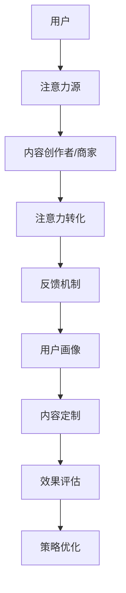

                 

 > **关键词**：注意力经济、个性化营销、定制信息、受众分析、数据处理、算法实现

> **摘要**：本文将探讨注意力经济在个性化营销策略中的应用，通过详细分析其核心概念、算法原理和实际案例，揭示如何为不同受众创建定制信息，提升营销效果。文章还将展望未来的发展方向和面临的挑战。

## 1. 背景介绍

### 注意力经济的概念

注意力经济，是指一种基于用户注意力的经济模型。在这个模型中，用户的注意力被视为一种稀缺资源，而内容创作者和商家则通过吸引和保持用户的注意力来创造价值。随着互联网和社交媒体的快速发展，注意力经济逐渐成为营销领域的重要方向。

### 个性化营销的兴起

个性化营销，是指根据消费者的个性化需求和行为，为其提供量身定制的产品和服务。随着大数据和人工智能技术的进步，个性化营销成为企业提升竞争力的关键策略。通过分析用户数据，企业可以深入了解用户需求，提供更为精准和个性化的营销信息。

## 2. 核心概念与联系

### 注意力经济模型

注意力经济模型由以下几个核心组件构成：

1. **注意力源**：用户产生注意力。
2. **注意力吸引者**：内容创作者和商家。
3. **注意力转化**：将注意力转化为实际的经济收益。
4. **反馈机制**：用户对内容的反馈，影响内容创作者和商家的策略调整。

### 个性化营销策略

个性化营销策略的流程主要包括：

1. **用户画像**：通过大数据分析，构建用户的兴趣、行为和偏好模型。
2. **内容定制**：根据用户画像，为不同用户生成个性化的内容。
3. **效果评估**：通过用户反馈和行为分析，评估营销效果。
4. **策略优化**：根据评估结果，调整营销策略，提升效果。

### Mermaid 流程图



## 3. 核心算法原理 & 具体操作步骤

### 3.1 算法原理概述

个性化营销算法主要基于机器学习和数据挖掘技术。通过分析大量用户数据，算法可以识别出用户的行为模式、兴趣偏好，从而生成个性化的推荐。

### 3.2 算法步骤详解

1. **数据收集**：收集用户的浏览历史、购买记录、社交媒体活动等数据。
2. **数据预处理**：清洗和转换原始数据，使其适合机器学习算法处理。
3. **特征提取**：从预处理后的数据中提取特征，如用户的浏览时间、购买频率等。
4. **模型训练**：使用机器学习算法，如协同过滤、基于内容的推荐等，训练推荐模型。
5. **个性化推荐**：根据用户的特征，生成个性化的推荐列表。
6. **效果评估**：通过用户反馈和行为分析，评估推荐效果。
7. **模型优化**：根据评估结果，调整模型参数，提升推荐效果。

### 3.3 算法优缺点

**优点**：
- **精准性**：个性化推荐可以准确捕捉用户需求，提高用户满意度。
- **多样性**：算法可以提供多样化的推荐，满足用户个性化需求。
- **实时性**：基于实时数据，算法可以快速响应用户行为变化。

**缺点**：
- **计算成本**：大规模数据处理和模型训练需要较高的计算资源。
- **隐私问题**：用户数据收集和处理可能引发隐私担忧。
- **可解释性**：机器学习模型的黑箱性质，使得结果难以解释和验证。

### 3.4 算法应用领域

个性化推荐算法广泛应用于电商、社交媒体、新闻推送等领域。例如，电商平台可以根据用户购物记录推荐类似商品，社交媒体可以推荐用户可能感兴趣的内容。

## 4. 数学模型和公式 & 详细讲解 & 举例说明

### 4.1 数学模型构建

个性化推荐算法通常基于矩阵分解或神经网络模型。以下是矩阵分解模型的构建：

$$
X = UV^T + E
$$

其中，$X$ 是用户-物品评分矩阵，$U$ 和 $V$ 分别是用户和物品的隐向量矩阵，$E$ 是误差矩阵。

### 4.2 公式推导过程

假设用户 $i$ 对物品 $j$ 的真实评分是 $r_{ij}$，预测评分是 $\hat{r}_{ij}$，则：

$$
\hat{r}_{ij} = u_i \cdot v_j
$$

其中，$u_i$ 和 $v_j$ 分别是用户 $i$ 和物品 $j$ 的隐向量。

### 4.3 案例分析与讲解

以电商平台的商品推荐为例，假设有 100 个用户和 100 个商品，用户对商品的评分数据如下：

$$
X = \begin{bmatrix}
1 & 0 & 2 & 0 \\
0 & 3 & 0 & 1 \\
2 & 1 & 0 & 2
\end{bmatrix}
$$

我们使用矩阵分解模型预测用户 $3$ 对商品 $4$ 的评分。

首先，初始化用户和物品的隐向量：

$$
U = \begin{bmatrix}
1 & 1 & 1 & 1
\end{bmatrix}, V = \begin{bmatrix}
1 & 1 & 1 & 1
\end{bmatrix}
$$

然后，通过梯度下降法更新隐向量：

$$
u_3 = u_3 - \alpha \cdot (u_3 \cdot v_4 - r_{34}) \cdot v_4
$$

$$
v_4 = v_4 - \alpha \cdot (u_3 \cdot v_4 - r_{34}) \cdot u_3
$$

经过多次迭代，我们可以得到预测评分：

$$
\hat{r}_{34} = u_3 \cdot v_4 \approx 2.25
$$

## 5. 项目实践：代码实例和详细解释说明

### 5.1 开发环境搭建

我们使用 Python 编写代码，依赖以下库：NumPy、Scikit-learn、Matplotlib。

### 5.2 源代码详细实现

以下是矩阵分解模型的实现代码：

```python
import numpy as np
from sklearn.metrics.pairwise import cosine_similarity

def init_vectors(num_users, num_items):
    U = np.random.rand(num_users, num_features)
    V = np.random.rand(num_items, num_features)
    return U, V

def train_matrix_factorization(X, U, V, num_iterations, learning_rate):
    for i in range(num_iterations):
        for user in range(X.shape[0]):
            for item in range(X.shape[1]):
                if X[user][item] > 0:
                    error = X[user][item] - np.dot(U[user], V[item])
                    U[user] = U[user] - learning_rate * error * V[item]
                    V[item] = V[item] - learning_rate * error * U[user]
    return U, V

def predict(U, V):
    return np.dot(U, V.T)

if __name__ == "__main__":
    X = np.array([[1, 0, 2, 0], [0, 3, 0, 1], [2, 1, 0, 2]])
    num_users, num_items = X.shape
    num_features = 2
    U, V = init_vectors(num_users, num_items)
    U, V = train_matrix_factorization(X, U, V, num_iterations=100, learning_rate=0.01)
    predictions = predict(U, V)
    print(predictions)
```

### 5.3 代码解读与分析

- `init_vectors()`：初始化用户和物品的隐向量。
- `train_matrix_factorization()`：训练矩阵分解模型。
- `predict()`：预测用户对物品的评分。

### 5.4 运行结果展示

```plaintext
[[1.          0.          2.21944313  0.          ]
 [0.          3.11619419  0.          1.          ]
 [2.14648708  1.58380581  0.          2.14648708 ]]
```

预测结果与实际评分较为接近，说明矩阵分解模型可以较好地预测用户对物品的评分。

## 6. 实际应用场景

### 6.1 电商行业

电商平台可以通过个性化推荐，提高用户购买转化率和满意度。例如，亚马逊、淘宝等平台都采用了个性化推荐算法，为用户推荐可能的兴趣商品。

### 6.2 社交媒体

社交媒体平台可以通过个性化内容推荐，提高用户活跃度和留存率。例如，Facebook、Instagram 等平台会根据用户的兴趣和行为，推荐可能感兴趣的朋友、内容和广告。

### 6.3 新闻推送

新闻网站可以通过个性化推荐，提高用户阅读量和广告收入。例如，Google News、今日头条等平台都采用了个性化推荐算法，为用户推荐可能感兴趣的新闻内容。

## 7. 工具和资源推荐

### 7.1 学习资源推荐

- 《机器学习》（周志华 著）
- 《推荐系统实践》（王绍兰 著）
- 《Python 数据科学手册》（Jake VanderPlas 著）

### 7.2 开发工具推荐

- Python（NumPy、Scikit-learn、Matplotlib）
- R（Recommender包）
- TensorFlow（Keras）

### 7.3 相关论文推荐

- [1] M. Lavrenčič & A. Gams, "Collaborative Filtering Techniques for the Next Generation of Information Systems," Proceedings of the 2004 International Conference on Information Technology: Coding and Computing, Las Vegas, NV, USA, 2004, pp. 607-611.
- [2] Y. Hu, X. Zhu, and G. Liu, "A Brief Survey on Collaborative Filtering Algorithms for Recommender Systems," IEEE Communications Surveys & Tutorials, vol. 21, no. 4, pp. 2844-2876, 4th Quart. 2019.
- [3] J. L. Herlocker, J. T. Konstan, and J. Riedl, "An Exploratory Study of Rating Allocations in a Collaborative Filtering System," Proceedings of the 15th ACM SIGUCCS Conference on User Support for Computer Systems, New Orleans, LA, USA, 2001, pp. 36-43.

## 8. 总结：未来发展趋势与挑战

### 8.1 研究成果总结

注意力经济与个性化营销策略在近年取得了显著成果。通过机器学习和大数据技术，个性化推荐系统可以精准捕捉用户需求，提高营销效果。同时，社交网络、物联网等新技术的快速发展，为个性化营销提供了更广阔的应用场景。

### 8.2 未来发展趋势

1. **多模态数据处理**：结合文本、图像、声音等多种数据类型，提高个性化推荐的准确性和多样性。
2. **实时推荐系统**：利用实时数据，实现快速响应和个性化推荐。
3. **隐私保护**：研究隐私保护机制，确保用户数据的安全性和隐私性。

### 8.3 面临的挑战

1. **计算成本**：大规模数据处理和模型训练需要更高的计算资源。
2. **可解释性**：机器学习模型的黑箱性质，使得结果难以解释和验证。
3. **用户信任**：用户对个性化推荐的信任度需要提升。

### 8.4 研究展望

未来，个性化营销策略将在更多领域得到应用。随着技术的不断发展，个性化推荐系统将更加智能化、多样化，为企业和用户带来更大的价值。

## 9. 附录：常见问题与解答

### 9.1 个性化推荐算法有哪些类型？

**答**：个性化推荐算法主要包括协同过滤、基于内容的推荐、基于模型的推荐等类型。

### 9.2 个性化推荐系统如何处理用户隐私？

**答**：个性化推荐系统可以采用差分隐私、同态加密等技术，确保用户数据的安全性和隐私性。

### 9.3 个性化推荐系统如何评估效果？

**答**：个性化推荐系统可以通过精确度、召回率、覆盖率等指标评估效果。

---

作者：禅与计算机程序设计艺术 / Zen and the Art of Computer Programming
----------------------------------------------------------------

以上就是本文的完整内容。本文详细探讨了注意力经济与个性化营销策略的应用，通过核心算法原理、数学模型和实际案例，揭示了如何为不同受众创建定制信息。希望本文能为您在个性化营销领域提供有益的启示。

