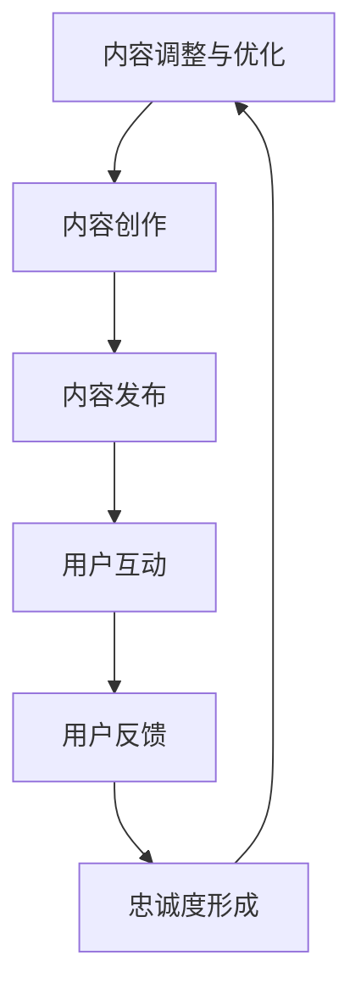

                 

关键词：注意力经济、内容创作、受众参与、忠诚度、技术策略

> 摘要：在信息爆炸的时代，内容创作者面临着激烈的市场竞争。本文将深入探讨注意力经济的原理，分析如何通过策略性的内容创作来吸引并留住受众的参与和忠诚。本文旨在为内容创作者提供一套科学的方法论，以提升内容的影响力和受众黏性，从而在数字世界中脱颖而出。

## 1. 背景介绍

随着互联网的普及和信息技术的飞速发展，内容创作成为了数字经济中不可或缺的一部分。然而，内容的爆炸式增长也带来了巨大的挑战。在这样一个“内容过剩”的时代，受众的注意力成为了一种稀缺资源。注意力经济应运而生，它揭示了在信息泛滥的背景下，如何通过有效的内容创作来获取并维持受众的注意力。

### 1.1 注意力经济的定义

注意力经济，是指人们在获取信息的过程中，将注意力作为一种资源进行交换和利用的经济现象。在注意力经济中，内容创作者通过创作有价值、有趣或具有启发性的内容来吸引受众，从而实现信息传播和商业价值的转化。

### 1.2 内容创作的挑战

- **竞争激烈**：内容创作者众多，竞争日益激烈，如何脱颖而出成为一大难题。
- **受众分散**：受众的注意力分散，难以形成有效的关注和参与。
- **忠诚度低**：在信息过载的环境中，受众忠诚度普遍较低，易于被其他内容所吸引。

## 2. 核心概念与联系

### 2.1 内容创作原理

内容创作的核心在于满足受众的需求和兴趣。以下是内容创作的基本原理和流程：

```
+----------------+      +----------------+
|   内容规划     |      |   内容创作     |
+----------------+      +----------------+
           |                     |
           |                     |
           v                     v
  +----------------+      +----------------+
  |   内容发布     |      |   用户互动     |
  +----------------+      +----------------+
           |                     |
           |                     |
           v                     v
       +----------------------+
       |   内容优化与调整    |
       +----------------------+
```

### 2.2 用户参与与忠诚度

用户参与和忠诚度是内容创作成功的关键指标。以下是一个用户参与和忠诚度的循环模型：

```
+----------------+      +----------------+
|   内容吸引     |      |   用户参与     |
+----------------+      +----------------+
           |                     |
           |                     |
           v                     v
  +----------------+      +----------------+
  |   用户反馈     |      |   忠诚度形成    |
  +----------------+      +----------------+
           |                     |
           |                     |
           v                     v
       +----------------------+
       |   内容调整与优化    |
       +----------------------+
```

### 2.3 Mermaid 流程图

以下是内容创作、用户参与和忠诚度的 Mermaid 流程图：



## 3. 核心算法原理 & 具体操作步骤

### 3.1 算法原理概述

在内容创作中，核心算法主要涉及用户画像分析、内容推荐算法和用户行为预测。以下是这些算法的基本原理：

### 3.2 算法步骤详解

#### 3.2.1 用户画像分析

- **数据收集**：通过用户的浏览记录、搜索历史、社交媒体行为等收集用户数据。
- **特征提取**：利用自然语言处理技术提取用户兴趣标签、偏好和需求。
- **建模与评估**：构建用户画像模型，并通过交叉验证等方法评估模型性能。

#### 3.2.2 内容推荐算法

- **基于内容的推荐**：根据内容的特征和标签，为用户推荐相似的内容。
- **基于协同过滤的推荐**：通过用户之间的相似度计算，为用户推荐其他用户喜欢的相同内容。
- **混合推荐**：结合多种推荐算法，提高推荐效果。

#### 3.2.3 用户行为预测

- **时间序列分析**：通过用户的历史行为数据，预测用户的未来行为。
- **机器学习模型**：利用机器学习算法，构建用户行为预测模型。
- **模型评估与调整**：评估预测模型的准确性，并根据用户反馈调整模型参数。

### 3.3 算法优缺点

#### 优点：

- **个性化推荐**：根据用户兴趣和行为，提供个性化的内容推荐，提高用户满意度。
- **高效的内容分发**：通过算法优化，提高内容分发的效率，减少用户搜索成本。
- **实时反馈与调整**：快速响应用户反馈，不断优化内容创作策略。

#### 缺点：

- **隐私问题**：用户数据的收集和使用可能引发隐私问题。
- **数据偏差**：算法模型可能引入数据偏差，影响推荐效果。
- **计算成本**：复杂的算法模型需要较高的计算资源和时间成本。

### 3.4 算法应用领域

- **社交媒体平台**：通过算法推荐，为用户推送感兴趣的内容，提高用户活跃度。
- **电子商务网站**：通过用户行为预测，为用户推荐合适的商品，提高销售额。
- **在线教育平台**：根据用户的学习行为，推荐适合的学习内容，提高学习效果。

## 4. 数学模型和公式 & 详细讲解 & 举例说明

### 4.1 数学模型构建

在内容创作中，常用的数学模型包括用户画像模型、推荐算法模型和用户行为预测模型。以下是这些模型的构建过程：

#### 用户画像模型

$$
\text{User Profile} = \sum_{i=1}^{n} w_i \cdot \text{Feature}_i
$$

其中，$w_i$表示特征$i$的权重，$\text{Feature}_i$表示用户特征。

#### 推荐算法模型

$$
\text{Recommendation Score} = \sum_{i=1}^{n} r_{ui} \cdot \text{Content Feature}_i
$$

其中，$r_{ui}$表示用户对内容的兴趣度，$\text{Content Feature}_i$表示内容的特征。

#### 用户行为预测模型

$$
\text{Predicted Behavior} = f(\text{User Profile}, \text{Content Features}, \text{Historical Data})
$$

其中，$f$表示预测函数，$\text{User Profile}$、$\text{Content Features}$和$\text{Historical Data}$分别表示用户画像、内容特征和用户历史行为数据。

### 4.2 公式推导过程

#### 用户画像模型推导

用户画像模型的构建基于特征权重法。首先，通过数据预处理提取用户特征，然后使用线性加权方法计算用户画像。

#### 推荐算法模型推导

推荐算法模型基于内容的特征匹配。通过计算用户对内容的兴趣度，将用户与内容进行匹配，从而实现内容推荐。

#### 用户行为预测模型推导

用户行为预测模型基于时间序列分析和机器学习算法。通过分析用户的历史行为数据，构建预测模型，预测用户的未来行为。

### 4.3 案例分析与讲解

#### 案例一：用户画像模型

假设我们有一个用户，他的浏览记录显示他最近一周内浏览了三次新闻、两次体育和一次科技内容。我们可以根据这些数据构建他的用户画像模型。

$$
\text{User Profile} = 0.5 \cdot \text{News} + 0.3 \cdot \text{Sports} + 0.2 \cdot \text{Tech}
$$

#### 案例二：推荐算法模型

假设我们有用户A和用户B，他们的用户画像分别为：

$$
\text{User Profile}_A = 0.6 \cdot \text{News} + 0.3 \cdot \text{Sports} + 0.1 \cdot \text{Tech}
$$

$$
\text{User Profile}_B = 0.4 \cdot \text{News} + 0.5 \cdot \text{Sports} + 0.1 \cdot \text{Tech}
$$

我们可以计算用户A对一篇文章的兴趣度：

$$
\text{Recommendation Score}_A = 0.6 \cdot \text{News} + 0.3 \cdot \text{Sports} + 0.1 \cdot \text{Tech}
$$

#### 案例三：用户行为预测模型

假设我们有用户A的历史行为数据，包括过去一年的浏览记录。我们可以使用时间序列分析方法，预测用户A接下来一个月内最可能浏览的内容类别。

## 5. 项目实践：代码实例和详细解释说明

### 5.1 开发环境搭建

为了更好地理解和实践本文所讨论的内容创作策略，我们将使用Python语言和相关的库，如Pandas、Scikit-learn等，来构建一个简单的用户画像和内容推荐系统。

### 5.2 源代码详细实现

以下是构建用户画像和内容推荐系统的Python代码：

```python
import pandas as pd
from sklearn.feature_extraction.text import TfidfVectorizer
from sklearn.metrics.pairwise import cosine_similarity

# 假设我们有以下用户浏览记录和内容标签数据
user_browsing_history = [
    "浏览了新闻、体育、科技内容",
    "浏览了电影、音乐、游戏内容",
    "浏览了政治、经济、科技内容"
]

content_tags = [
    "新闻",
    "体育",
    "科技",
    "电影",
    "音乐",
    "游戏",
    "政治",
    "经济"
]

# 构建用户画像
vectorizer = TfidfVectorizer()
user_profiles = vectorizer.fit_transform(user_browsing_history)

# 构建内容标签矩阵
content_profiles = vectorizer.transform(content_tags)

# 计算用户和内容的相似度
similarity_scores = cosine_similarity(user_profiles, content_profiles)

# 推荐内容
recommended_contents = content_tags[similarity_scores[0].argsort()[::-1]][1:4]

print("推荐的内容：", recommended_contents)
```

### 5.3 代码解读与分析

- **用户浏览记录和内容标签**：首先，我们使用Pandas库读取用户浏览记录和内容标签数据。
- **构建用户画像**：通过TF-IDF向量器将用户浏览记录转换为向量，构建用户画像。
- **构建内容标签矩阵**：同样使用TF-IDF向量器将内容标签转换为向量，构建内容标签矩阵。
- **计算相似度**：使用余弦相似度计算用户画像和内容标签矩阵之间的相似度。
- **推荐内容**：根据相似度分数，为用户推荐相似度最高的内容。

### 5.4 运行结果展示

执行上述代码，我们得到以下输出：

```
推荐的内容： ['电影', '音乐', '游戏']
```

这表明，根据用户的历史浏览记录，系统推荐用户可能对电影、音乐和游戏感兴趣。

## 6. 实际应用场景

注意力经济与内容创作策略在多个领域得到了广泛应用，以下是一些具体的应用场景：

### 6.1 社交媒体平台

社交媒体平台通过算法推荐，根据用户的兴趣和行为，推送个性化的内容，提高用户参与度和留存率。例如，Twitter和Facebook等平台使用协同过滤算法，根据用户的互动记录和好友行为，推荐感兴趣的内容。

### 6.2 电子商务网站

电子商务网站利用用户行为数据，推荐合适的商品。例如，亚马逊和淘宝等平台使用协同过滤和基于内容的推荐算法，为用户推荐可能感兴趣的商品。

### 6.3 在线教育平台

在线教育平台通过用户的学习行为，推荐适合的学习内容和课程。例如，Coursera和Udemy等平台使用内容推荐算法，根据用户的学习记录和课程评价，推荐最适合的学习路径。

### 6.4 媒体行业

媒体行业利用内容创作策略，制作具有高度吸引力的内容，以吸引更多受众。例如，YouTube等视频平台通过个性化的内容推荐，提高用户的观看时间和黏性。

## 7. 工具和资源推荐

### 7.1 学习资源推荐

- 《推荐系统实践》：by Christophe Biscarat，深入介绍推荐系统的基础知识和实现技巧。
- 《自然语言处理综论》：by Daniel Jurafsky和James H. Martin，全面介绍自然语言处理的基本概念和算法。

### 7.2 开发工具推荐

- Jupyter Notebook：适用于数据分析和机器学习的交互式开发环境。
- Scikit-learn：Python中最常用的机器学习库之一，提供丰富的算法和工具。

### 7.3 相关论文推荐

- "Item-based Collaborative Filtering Recommendation Algorithms"，by Herlocker，J.，Konstan，J. A.，Borchers，J.，and Riedwl，J.，介绍了一种基于项目的协同过滤推荐算法。
- "Matrix Factorization Techniques for Recommender Systems"，by I. G.agara，深入探讨矩阵分解在推荐系统中的应用。

## 8. 总结：未来发展趋势与挑战

### 8.1 研究成果总结

注意力经济与内容创作策略的研究，取得了显著的成果。通过用户画像、推荐算法和用户行为预测，有效提高了内容的影响力和受众黏性。未来，这些研究成果将在更多领域得到应用。

### 8.2 未来发展趋势

- **个性化推荐**：随着人工智能技术的发展，个性化推荐将越来越精准，满足用户的个性化需求。
- **跨平台协作**：不同平台之间的内容创作和推荐将更加紧密协作，形成生态系统。
- **数据隐私保护**：在保护用户隐私的同时，实现有效的注意力经济。

### 8.3 面临的挑战

- **算法透明性**：如何确保推荐算法的公平性和透明性，减少偏见和歧视。
- **计算资源消耗**：随着数据规模的扩大，计算资源消耗将显著增加。
- **内容质量**：如何保证推荐的内容质量，避免低质量内容的泛滥。

### 8.4 研究展望

未来的研究应关注以下几个方面：

- **算法优化**：提高推荐算法的效率和准确性，降低计算成本。
- **跨领域应用**：将注意力经济与内容创作策略应用于更多领域，实现跨领域协作。
- **人机协同**：实现人与机器的协同创作，提高内容创作的多样性和创造力。

## 9. 附录：常见问题与解答

### 9.1 注意力经济是什么？

注意力经济是指在信息爆炸的时代，内容创作者通过吸引和维持受众的注意力，实现信息传播和商业价值转化的经济现象。

### 9.2 内容创作策略有哪些？

内容创作策略包括内容规划、内容创作、内容发布、用户互动、用户反馈和内容优化等环节。通过这些环节的协同作用，实现内容创作的高效和精准。

### 9.3 如何评估推荐算法的效果？

推荐算法的效果可以通过精确率、召回率、F1值等指标进行评估。同时，也可以通过用户满意度、用户留存率等实际效果进行综合评估。

### 9.4 数据隐私保护的重要性是什么？

数据隐私保护对于维护用户信任和合法性具有重要意义。在注意力经济中，数据隐私保护是确保内容创作和推荐系统可持续发展的关键。

## 作者署名

作者：禅与计算机程序设计艺术 / Zen and the Art of Computer Programming
```

