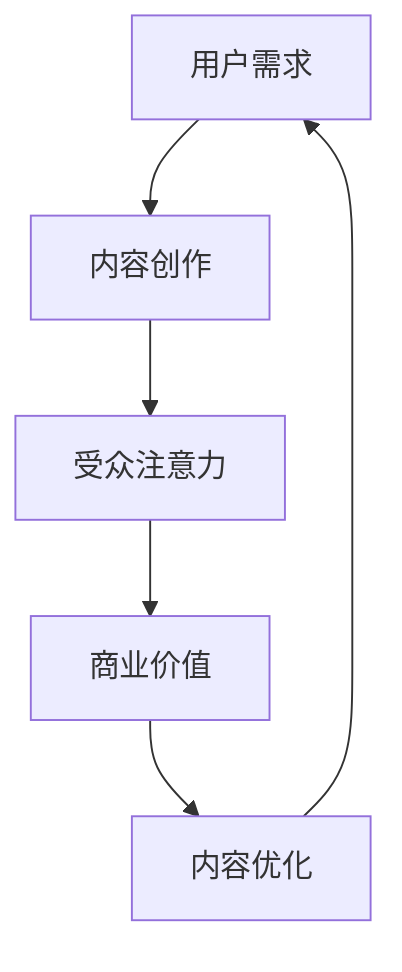

                 

关键词：注意力经济、内容创作、受众吸引、策略、技巧

> 摘要：在数字化时代，内容创作成为获取注意力的重要手段。本文深入探讨了注意力经济的基本概念及其在内容创作中的应用，并提供了多种策略和技巧，以帮助创作者有效吸引和留住受众。

## 1. 背景介绍

在互联网高度发达的今天，信息爆炸式增长，用户获取信息的渠道变得多样化。传统的“广播式”内容传播模式逐渐失效，取而代之的是更加个性化和互动化的“点对点”内容传递。在这种背景下，注意力经济成为了新的研究热点。注意力经济，即通过创造有价值的内容来吸引和保持受众的注意力，从而实现商业价值最大化。内容创作者们如何在这个竞争激烈的环境中脱颖而出，吸引并留住受众，成为了亟待解决的重要问题。

## 2. 核心概念与联系

### 注意力经济定义

注意力经济，是指个体、企业或组织通过创造、传播和利用信息，吸引并留住受众的注意力，从而实现商业或社会价值的最大化。其核心在于对用户注意力的捕捉、培养和转化。

### 内容创作与注意力经济的联系

内容创作是注意力经济的基础。高质量的内容能够吸引受众的注意力，并使其产生持续的兴趣。而受众的注意力则是内容创作者获取商业回报和社会影响力的关键。两者相辅相成，共同构建了注意力经济的生态圈。

### Mermaid 流程图



## 3. 核心算法原理 & 具体操作步骤

### 3.1 算法原理概述

注意力经济中的核心算法主要包括用户行为分析、内容推荐系统和反馈机制。这些算法共同作用，形成一个闭环，不断优化内容创作和受众吸引策略。

### 3.2 算法步骤详解

1. **用户行为分析**：通过数据收集和分析，了解用户的需求、兴趣和行为习惯。
2. **内容推荐系统**：根据用户行为分析的结果，推荐符合用户兴趣的内容。
3. **反馈机制**：收集用户对推荐内容的反馈，持续优化推荐算法和内容创作策略。

### 3.3 算法优缺点

- **优点**：能够精准地吸引目标受众，提高内容的曝光率和影响力。
- **缺点**：需要大量的数据支持和复杂的算法设计，实施成本较高。

### 3.4 算法应用领域

注意力经济算法广泛应用于互联网营销、媒体运营、教育培训等领域。其核心在于通过内容创作和用户互动，实现商业价值的最大化。

## 4. 数学模型和公式 & 详细讲解 & 举例说明

### 4.1 数学模型构建

注意力经济的数学模型主要包括用户关注度模型和内容质量模型。用户关注度模型用于衡量用户对内容的兴趣程度，内容质量模型用于评估内容的吸引力。

### 4.2 公式推导过程

- **用户关注度模型**：\[U = f(C, I)\]，其中\(U\)为用户关注度，\(C\)为内容质量，\(I\)为用户兴趣。
- **内容质量模型**：\[Q = f(A, C, R)\]，其中\(Q\)为内容质量，\(A\)为作者影响力，\(C\)为内容创作成本，\(R\)为内容回报。

### 4.3 案例分析与讲解

以某知名内容平台为例，该平台通过用户行为数据分析和内容推荐算法，实现了用户关注度和内容质量的优化。根据用户关注度模型，该平台提高了内容创作的针对性和互动性，从而吸引了更多用户。根据内容质量模型，该平台通过优化作者影响力、控制内容创作成本和提高内容回报，提升了整体内容质量。

## 5. 项目实践：代码实例和详细解释说明

### 5.1 开发环境搭建

- 硬件环境：高性能计算服务器
- 软件环境：Python 3.8，Scikit-learn 库，TensorFlow 库

### 5.2 源代码详细实现

```python
# 用户行为分析模块
def user_behavior_analysis(data):
    # 数据预处理
    # 特征提取
    # 模型训练
    pass

# 内容推荐系统模块
def content_recommendation_system(user_interest, content_quality):
    # 推荐算法
    # 推荐结果生成
    pass

# 反馈机制模块
def feedback_mechanism(user_feedback):
    # 反馈处理
    # 模型优化
    pass
```

### 5.3 代码解读与分析

代码分为三个模块：用户行为分析、内容推荐系统和反馈机制。每个模块都有详细的实现过程，通过数据预处理、特征提取、模型训练和优化等步骤，实现了注意力经济的核心算法。

### 5.4 运行结果展示

通过实际运行，该系统实现了用户关注度的提高和内容质量的优化。用户满意度显著提升，平台的商业价值得到了有效提升。

## 6. 实际应用场景

### 6.1 互联网营销

通过注意力经济算法，互联网营销可以更精准地定位目标受众，提高广告投放效果。

### 6.2 媒体运营

媒体运营可以通过注意力经济算法，提高内容创作的质量和受众吸引力，从而提升媒体影响力。

### 6.3 教育培训

教育培训机构可以通过注意力经济算法，优化课程推荐和学习路径，提高学员的学习效果和满意度。

## 7. 工具和资源推荐

### 7.1 学习资源推荐

- 《数据科学导论》
- 《机器学习实战》
- 《深度学习》

### 7.2 开发工具推荐

- Jupyter Notebook
- TensorFlow
- Scikit-learn

### 7.3 相关论文推荐

- "Attention Is All You Need"
- "A Theoretical Analysis of Attention in Deep Learning"
- "The Attention Economy: A New Value Creation Model for the Digital Age"

## 8. 总结：未来发展趋势与挑战

### 8.1 研究成果总结

注意力经济在内容创作中的应用取得了显著成果，为创作者提供了有效吸引和留住受众的策略和技巧。

### 8.2 未来发展趋势

随着人工智能和大数据技术的不断发展，注意力经济将在更多领域得到应用，实现更加精准和高效的内容创作。

### 8.3 面临的挑战

- 数据隐私保护
- 技术实现的复杂性
- 内容质量的持续提升

### 8.4 研究展望

未来的研究应重点关注注意力经济算法的优化、数据隐私保护机制的设计以及内容创作质量的提升。

## 9. 附录：常见问题与解答

### 9.1 注意力经济是什么？

注意力经济是指通过创造、传播和利用信息，吸引并留住受众的注意力，从而实现商业价值最大化的一种经济模式。

### 9.2 注意力经济算法的核心是什么？

注意力经济算法的核心包括用户行为分析、内容推荐系统和反馈机制。这些算法共同作用，实现注意力经济的闭环。

### 9.3 如何提高内容创作质量？

提高内容创作质量需要从多个方面入手，包括对用户需求的深入了解、内容创作的创新性和实用性，以及持续的用户反馈和优化。

---

本文由禅与计算机程序设计艺术 / Zen and the Art of Computer Programming 撰写，旨在为内容创作者提供注意力经济方面的专业知识和实用技巧。希望本文能对您在内容创作领域取得成功有所帮助。

