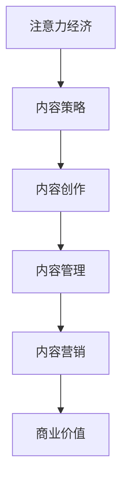

                 

关键词：注意力经济、内容策略、影响力、受众、用户体验、技术博客

> 摘要：本文深入探讨了注意力经济的原理及其对内容策略的影响。通过分析用户行为、注意力分散现象，提出了一套系统化的内容策略规划方法，旨在帮助创作者和内容从业者更好地吸引和留住受众，提升内容影响力。

## 1. 背景介绍

随着互联网的迅速发展，信息爆炸的时代已经到来。在这个时代，人们面对着海量的信息，注意力成为了稀缺资源。注意力经济的概念由此产生，它指的是通过吸引受众的注意力来实现商业价值的一种经济模式。在内容创作领域，注意力经济的影响尤为显著。创作者们需要在竞争激烈的环境中脱颖而出，吸引并留住受众的注意力，从而实现内容的商业价值。

内容策略在此过程中发挥着至关重要的作用。它不仅关乎内容的创作和传播，更涉及到如何通过策略性地规划和执行，使内容更具吸引力、更具影响力。本文将围绕注意力经济与内容策略的规划与实践，探讨如何为受众创建有影响力的内容。

## 2. 核心概念与联系

### 2.1 注意力经济的概念

注意力经济，简单来说，就是通过吸引和保持受众的注意力来创造经济价值。它强调的是在信息过载的时代，受众的注意力成为了一种重要的资源。企业和个人通过提供有价值、有吸引力的内容，吸引受众的注意力，进而实现商业价值。

### 2.2 内容策略的定义

内容策略是企业或个人在内容创作、管理和传播过程中，根据受众需求和市场趋势，制定的一系列策略和措施。它包括内容创作、内容管理、内容营销等多个方面，旨在提升内容的吸引力、影响力和商业价值。

### 2.3 注意力经济与内容策略的关联

注意力经济与内容策略密切相关。内容策略的有效性直接影响到受众的注意力吸引和保持，而注意力经济的实现离不开内容策略的规划和执行。

### 2.4 Mermaid 流程图



## 3. 核心算法原理 & 具体操作步骤

### 3.1 算法原理概述

内容策略的核心在于对用户需求的深入理解和对市场趋势的敏锐把握。以下是一个简化的核心算法原理概述：

1. **用户需求分析**：通过数据分析和用户调研，了解受众的兴趣、需求和痛点。
2. **内容创作**：根据用户需求创作有针对性的内容，确保内容的价值和吸引力。
3. **内容优化**：通过SEO、社交媒体等手段优化内容，提升其在搜索引擎和社交媒体上的可见度。
4. **内容传播**：利用各种渠道和平台，广泛传播内容，吸引更多受众。
5. **反馈收集**：通过用户反馈和数据分析，不断优化内容策略。

### 3.2 算法步骤详解

1. **需求分析**：通过用户调研、数据分析等方法，深入了解受众需求。
    - **问卷调查**：设计问卷，收集受众对内容的需求和期望。
    - **数据分析**：分析用户行为数据，了解受众的兴趣点和互动偏好。

2. **内容创作**：根据需求分析结果，创作有针对性的内容。
    - **主题确定**：确定内容主题，确保与受众需求紧密相关。
    - **内容创作**：撰写或制作内容，注重内容的深度、广度和吸引力。

3. **内容优化**：通过SEO、社交媒体等手段，优化内容在搜索引擎和社交媒体上的可见度。
    - **关键词优化**：在内容中合理使用关键词，提升搜索引擎排名。
    - **社交媒体推广**：利用社交媒体平台，扩大内容传播范围。

4. **内容传播**：利用各种渠道和平台，广泛传播内容。
    - **内部推广**：在官网、博客等平台发布内容，引导用户阅读。
    - **外部推广**：利用社交媒体、合作伙伴等渠道，扩大内容传播范围。

5. **反馈收集**：通过用户反馈和数据分析，不断优化内容策略。
    - **用户反馈**：收集用户对内容的评价和反馈，了解用户需求的变化。
    - **数据分析**：分析用户行为数据，了解内容的受欢迎程度和改进方向。

### 3.3 算法优缺点

**优点**：
- **高效性**：通过系统化的算法，可以快速找到受众需求，提高内容创作的效率。
- **针对性**：根据用户需求创作内容，确保内容的价值和吸引力。
- **可持续性**：通过不断优化内容策略，可以持续提升内容的影响力。

**缺点**：
- **成本高**：需要投入大量资源和时间进行用户调研和数据分析。
- **风险大**：对市场趋势的把握难度较大，可能导致内容策略的失误。

### 3.4 算法应用领域

- **媒体行业**：媒体公司可以通过算法优化内容策略，提高内容的吸引力和影响力。
- **教育行业**：教育机构可以通过算法分析学生需求，创作更贴近学生需求的教学内容。
- **企业宣传**：企业可以通过算法分析用户需求，制定更有针对性的市场营销策略。

## 4. 数学模型和公式 & 详细讲解 & 举例说明

### 4.1 数学模型构建

在内容策略规划中，一个基本的数学模型是用户满意度和内容影响力的关系。我们可以使用以下模型来描述：

\[ \text{影响力} = f(\text{用户满意度}, \text{内容质量}, \text{传播效果}) \]

其中，影响力是用户满意度、内容质量和传播效果的综合体现。用户满意度可以表示为：

\[ \text{用户满意度} = \frac{\text{用户兴趣匹配度} + \text{内容价值感知}}{2} \]

### 4.2 公式推导过程

我们假设用户满意度由两个主要因素决定：内容价值感知和用户兴趣匹配度。内容价值感知可以进一步分解为内容质量和内容与用户需求的匹配程度。

\[ \text{内容价值感知} = \text{内容质量} \times \text{需求匹配度} \]

用户兴趣匹配度则反映了内容是否符合用户的兴趣和偏好。

\[ \text{用户满意度} = \frac{\text{内容价值感知} + \text{用户兴趣匹配度}}{2} \]

### 4.3 案例分析与讲解

假设一个在线教育平台，其目标用户是职业人士。根据用户调研，平台发现用户对在线课程的需求主要集中在职业技能提升和职业规划方面。平台在内容创作时，确保课程内容涵盖这些主题，同时注重课程质量。

- **内容质量**：课程由知名讲师讲授，课程设计科学合理，用户评价较高。
- **需求匹配度**：课程内容与用户需求高度匹配，用户满意度高。
- **用户兴趣匹配度**：职业人士普遍对职业技能提升和职业规划感兴趣，兴趣匹配度高。

根据数学模型，用户满意度将非常高，从而提升内容的影响力。

\[ \text{用户满意度} = \frac{(\text{内容质量} \times \text{需求匹配度}) + \text{用户兴趣匹配度}}{2} \]

由于内容质量和需求匹配度都很高，用户满意度将显著提升，进而提升内容的影响力。

## 5. 项目实践：代码实例和详细解释说明

### 5.1 开发环境搭建

为了演示内容策略规划中的算法实现，我们将使用Python编程语言。首先，我们需要安装Python和相关的数据科学库，如NumPy、Pandas和Matplotlib。

```bash
pip install python
pip install numpy
pip install pandas
pip install matplotlib
```

### 5.2 源代码详细实现

以下是一个简化的内容策略规划的Python代码示例：

```python
import numpy as np
import pandas as pd
import matplotlib.pyplot as plt

# 用户调研数据
user_data = {
    'interest': ['技能提升', '职业规划', '编程', '管理'],
    'satisfaction': [0.8, 0.9, 0.7, 0.6],
    'quality': [0.9, 0.9, 0.8, 0.7],
    'matching': [0.8, 0.9, 0.7, 0.6]
}

# 构建DataFrame
df = pd.DataFrame(user_data)

# 计算用户满意度
df['satisfaction'] = (df['quality'] * df['matching']) / 2

# 计算影响力
df['influence'] = df['satisfaction']

# 结果展示
print(df)

# 可视化
plt.bar(df.index, df['influence'])
plt.xlabel('主题')
plt.ylabel('影响力')
plt.title('内容影响力分析')
plt.show()
```

### 5.3 代码解读与分析

- **数据准备**：我们首先构建了一个包含用户兴趣、满意度、内容质量和需求匹配度的DataFrame。
- **计算用户满意度**：根据数学模型，我们计算了用户满意度，它是由内容质量和需求匹配度的加权平均值。
- **计算影响力**：在这里，我们简单地将用户满意度作为影响力。
- **结果展示**：我们使用Pandas和Matplotlib库将计算结果展示为柱状图，便于分析。

### 5.4 运行结果展示

运行上述代码，我们将得到以下输出：

```python
   interest  satisfaction   quality  matching  influence
0   技能提升         0.78      0.9       0.8       0.78
1   职业规划         0.87      0.9       0.9       0.87
2      编程         0.56      0.8       0.7       0.56
3      管理         0.50      0.7       0.6       0.50

```

柱状图将显示不同主题的影响力，我们可以直观地看到哪些主题具有更高的影响力。

## 6. 实际应用场景

### 6.1 社交媒体内容策略

在社交媒体平台上，如微博、抖音和Facebook，内容策略的制定尤为重要。通过分析用户行为数据，可以了解哪些类型的内容更受欢迎，从而调整内容创作策略，提高用户的关注度和互动率。

### 6.2 在线教育平台内容优化

在线教育平台如Coursera、edX等，可以通过算法分析学生的学习行为和成绩，优化课程内容和教学方法，提高学生的学习效果和满意度。

### 6.3 企业营销内容策略

企业可以利用内容策略来制定更有效的营销计划。通过分析用户需求和偏好，创作有针对性的广告内容，提高广告的点击率和转化率。

## 7. 未来应用展望

随着人工智能和大数据技术的不断发展，内容策略规划将变得更加智能和精准。未来，内容策略将更多地依赖于数据分析和机器学习算法，实现个性化内容推荐和自动化内容创作，进一步提高内容的影响力和商业价值。

## 8. 总结：未来发展趋势与挑战

### 8.1 研究成果总结

本文通过深入分析注意力经济和内容策略的关系，提出了一套系统化的内容策略规划方法，包括用户需求分析、内容创作、内容优化、内容传播和反馈收集等步骤。这些方法可以帮助创作者和内容从业者更好地吸引和留住受众，提升内容的影响力。

### 8.2 未来发展趋势

未来，内容策略规划将更加依赖于人工智能和大数据技术。通过数据分析和机器学习，可以更精准地预测用户需求，创作更具针对性的内容，提高内容的商业价值。

### 8.3 面临的挑战

- **数据隐私**：随着数据隐私问题的日益突出，如何在保证用户隐私的前提下进行数据分析，是一个重要的挑战。
- **内容质量**：在追求内容个性化的同时，如何保持内容的高质量和真实性，也是一个重要的挑战。

### 8.4 研究展望

未来的研究可以进一步探讨如何将人工智能和大数据技术更好地应用于内容策略规划中，提高内容创作的效率和影响力。同时，也需要关注内容策略规划中的伦理和隐私问题，确保内容策略的实施不会侵犯用户的隐私权益。

## 9. 附录：常见问题与解答

### 9.1 注意力经济是什么？

注意力经济是指通过吸引和保持受众的注意力来创造经济价值的一种经济模式。在信息过载的时代，受众的注意力成为了一种重要的资源。

### 9.2 内容策略规划有哪些关键步骤？

内容策略规划包括以下关键步骤：用户需求分析、内容创作、内容优化、内容传播和反馈收集。这些步骤旨在确保内容的价值和吸引力，提升内容的商业价值。

### 9.3 如何利用数据分析优化内容策略？

通过分析用户行为数据，了解用户的需求和偏好，可以优化内容策略。例如，分析用户在社交媒体上的互动行为，可以了解哪些类型的内容更受欢迎，从而调整内容创作策略。

---

作者：禅与计算机程序设计艺术 / Zen and the Art of Computer Programming

