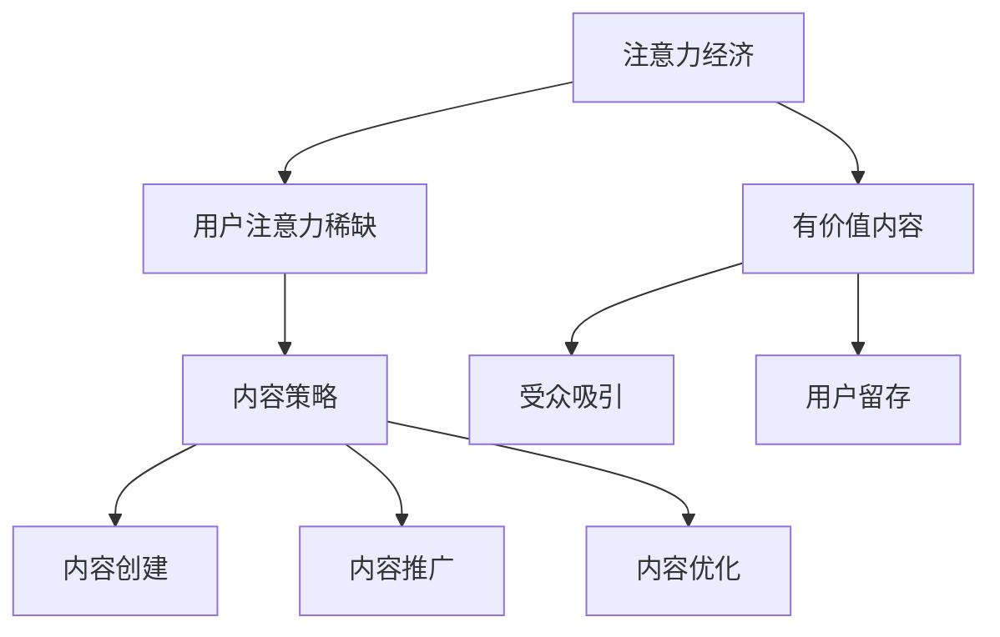
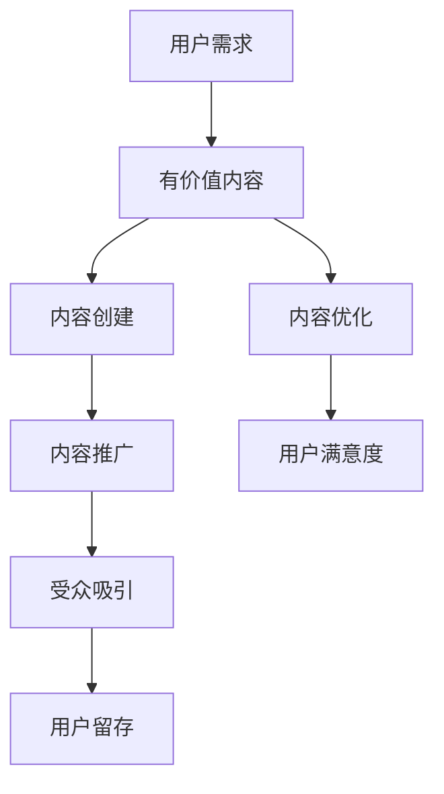

                 

关键词：注意力经济、内容策略、参与内容、受众吸引、用户留存

> 摘要：在数字化时代，用户注意力成为一种稀缺资源。本文将探讨注意力经济的基本原理，以及如何通过有效的内容策略创造具有吸引力和参与度的内容，从而吸引并留住受众。我们将详细分析核心概念、算法原理、数学模型，并通过实际项目实例，展示如何将理论应用到实践中。

## 1. 背景介绍

随着互联网的普及，信息爆炸的时代已经到来。用户在接收信息的过程中，注意力成为了一种稀缺资源。在这个环境下，企业、媒体和个人都在寻找如何吸引并留住用户注意力的高效方法。注意力经济作为一种新的经济模式，强调通过提供有价值的内容来获取用户的关注。内容策略则是指通过系统的方法来创建、推广和优化内容，以最大化其吸引力和参与度。

本文旨在探讨注意力经济与内容策略的关系，从理论和实践两个角度出发，帮助读者了解如何创造吸引并留住受众的参与内容。

## 2. 核心概念与联系

### 注意力经济

注意力经济是指在经济活动中，人们将注意力作为一种商品进行交易和利用。随着互联网的发展，用户的注意力逐渐成为企业和个人争夺的焦点。注意力经济关注如何通过提供有价值的内容吸引和留住用户的注意力，从而实现商业价值。

### 内容策略

内容策略是指为了达到特定的目标，通过系统的方法来创建、推广和优化内容。内容策略的核心在于理解受众的需求和兴趣，从而创造具有吸引力和参与度的内容。

### 核心概念原理和架构

以下是注意力经济与内容策略的核心概念原理和架构的 Mermaid 流程图：



### 注意力经济与内容策略的关系

注意力经济和内容策略是相互关联的。注意力经济关注如何获取用户的注意力，而内容策略则关注如何通过有价值的内容吸引并留住用户。二者之间的关系可以用以下流程图表示：



## 3. 核心算法原理 & 具体操作步骤

### 3.1 算法原理概述

注意力经济与内容策略的核心算法原理可以归纳为以下几点：

1. **受众需求分析**：通过数据分析了解受众的兴趣和需求。
2. **内容个性化**：根据受众需求创建个性化的内容。
3. **内容质量提升**：通过内容优化提高内容的质量和吸引力。
4. **用户行为分析**：通过用户行为分析了解用户对内容的反应，进一步优化内容策略。

### 3.2 算法步骤详解

1. **受众需求分析**：
   - 使用数据分析工具（如 Google Analytics）收集用户数据。
   - 使用聚类算法（如 K-Means）对用户进行分类。
   - 根据用户行为和兴趣构建用户画像。

2. **内容个性化**：
   - 根据用户画像创建个性化内容。
   - 使用推荐系统算法（如 Collaborative Filtering）为用户推荐相关内容。

3. **内容质量提升**：
   - 对内容进行质量评估。
   - 使用自然语言处理技术（如文本分类、情感分析）对内容进行优化。

4. **用户行为分析**：
   - 收集用户对内容的反馈数据。
   - 使用机器学习算法（如回归分析、决策树）预测用户对内容的反应。

### 3.3 算法优缺点

**优点**：
- 能够有效吸引并留住受众。
- 提高内容质量和用户满意度。

**缺点**：
- 需要大量数据支持和计算资源。
- 算法模型的调整和优化需要时间。

### 3.4 算法应用领域

注意力经济和内容策略算法在多个领域都有广泛的应用，如电子商务、社交媒体、在线教育和媒体行业。以下是一些具体的案例：

1. **电子商务**：通过用户行为分析推荐商品。
2. **社交媒体**：通过内容个性化吸引用户参与。
3. **在线教育**：通过内容质量提升提高用户满意度。
4. **媒体行业**：通过内容策略提高用户留存率。

## 4. 数学模型和公式 & 详细讲解 & 举例说明

### 4.1 数学模型构建

注意力经济与内容策略的核心数学模型主要包括以下几个部分：

1. **用户行为模型**：描述用户对内容的反应。
2. **内容质量模型**：评估内容的质量。
3. **推荐系统模型**：为用户推荐相关内容。

以下是这些模型的构建过程：

#### 用户行为模型

用户行为模型可以用以下公式表示：

\[ R = f(U, C) \]

其中，\( R \) 表示用户对内容的反应，\( U \) 表示用户画像，\( C \) 表示内容特征。

#### 内容质量模型

内容质量模型可以用以下公式表示：

\[ Q = g(C) \]

其中，\( Q \) 表示内容质量，\( C \) 表示内容特征。

#### 推荐系统模型

推荐系统模型可以用以下公式表示：

\[ R^* = h(U, C, R) \]

其中，\( R^* \) 表示推荐的内容，\( U \) 表示用户画像，\( C \) 表示内容特征，\( R \) 表示用户对内容的反应。

### 4.2 公式推导过程

以下是用户行为模型、内容质量模型和推荐系统模型的推导过程：

#### 用户行为模型推导

用户行为模型可以通过观察用户对大量内容的反应数据来构建。假设我们有 \( n \) 个用户和 \( m \) 个内容，用户对第 \( i \) 个内容的反应可以表示为 \( r_{i,j} \)，其中 \( r_{i,j} \in \{0, 1\} \)，表示用户 \( i \) 是否喜欢内容 \( j \)。

我们假设用户 \( i \) 的画像为 \( u_i \)，内容 \( j \) 的特征为 \( c_j \)。则用户对内容的反应可以用以下公式表示：

\[ r_{i,j} = u_i^T c_j + \epsilon_{i,j} \]

其中，\( \epsilon_{i,j} \) 是误差项，表示模型无法捕捉到的其他因素。

通过对大量用户行为的训练，我们可以得到用户行为模型：

\[ R = f(U, C) = \sum_{i=1}^n u_i^T c_i \]

#### 内容质量模型推导

内容质量模型可以通过对大量内容的质量评估数据来构建。假设我们有 \( n \) 个内容和 \( m \) 个质量指标，内容 \( j \) 的质量可以表示为 \( q_j \)。

我们假设内容 \( j \) 的特征为 \( c_j \)，则内容质量可以用以下公式表示：

\[ q_j = g(C) = \sum_{i=1}^m w_i c_{ij} \]

其中，\( w_i \) 表示第 \( i \) 个质量指标的权重。

通过对大量内容质量的训练，我们可以得到内容质量模型：

\[ Q = g(C) = \sum_{i=1}^m w_i c_{ij} \]

#### 推荐系统模型推导

推荐系统模型可以通过对用户行为和内容质量的综合分析来构建。假设我们有用户 \( i \) 的画像 \( u_i \)，内容 \( j \) 的特征 \( c_j \) 和用户对内容的反应 \( r_{i,j} \)。

我们假设推荐系统模型为：

\[ R^* = h(U, C, R) = \sum_{j=1}^m r_{i,j} c_j \]

其中，\( r_{i,j} \) 表示用户 \( i \) 对内容 \( j \) 的反应。

通过对大量用户行为的训练，我们可以得到推荐系统模型：

\[ R^* = h(U, C, R) = \sum_{j=1}^m r_{i,j} c_j \]

### 4.3 案例分析与讲解

以下是一个基于注意力经济与内容策略的推荐系统案例：

#### 案例背景

某在线教育平台希望通过推荐系统提高用户的学习参与度和满意度。平台收集了用户的学习行为数据，包括用户的学习时长、学习进度、学习内容等。

#### 案例分析

1. **用户行为模型**：平台使用 K-Means 算法对用户进行分类，得到不同类型的用户画像。根据用户的学习行为数据，平台构建了用户行为模型。

   \[ R = f(U, C) = \sum_{i=1}^n u_i^T c_i \]

2. **内容质量模型**：平台对课程内容进行质量评估，使用文本分类算法对课程内容进行分类，并计算每个类别的质量指标。

   \[ Q = g(C) = \sum_{i=1}^m w_i c_{ij} \]

3. **推荐系统模型**：平台根据用户画像和课程内容特征，使用 Collaborative Filtering 算法为用户推荐相关课程。

   \[ R^* = h(U, C, R) = \sum_{j=1}^m r_{i,j} c_j \]

#### 案例讲解

1. **用户画像构建**：平台对用户的学习行为数据进行聚类分析，将用户分为不同类型，如“高效学习者”、“一般学习者”等。

2. **课程内容评估**：平台对课程内容进行质量评估，计算每个课程的质量得分，并根据质量得分对课程进行排序。

3. **推荐课程计算**：平台根据用户画像和课程内容特征，计算每个用户可能感兴趣的课程，并根据兴趣度进行排序。

4. **推荐结果展示**：平台将推荐结果展示给用户，使用户能够快速找到适合自己的课程。

通过上述案例，我们可以看到注意力经济与内容策略在实践中的应用。平台通过构建用户行为模型、内容质量模型和推荐系统模型，实现了对用户的个性化推荐，提高了用户的学习参与度和满意度。

## 5. 项目实践：代码实例和详细解释说明

### 5.1 开发环境搭建

在本节中，我们将搭建一个基于 Python 的注意力经济与内容策略的项目环境。首先，我们需要安装 Python 和必要的库。

#### 步骤 1：安装 Python

从 [Python 官网](https://www.python.org/) 下载并安装 Python 3.8 或更高版本。

#### 步骤 2：安装依赖库

打开终端，运行以下命令安装依赖库：

```bash
pip install numpy pandas scikit-learn matplotlib
```

### 5.2 源代码详细实现

以下是项目的核心代码实现，包括用户画像构建、内容质量评估和推荐系统实现。

#### 步骤 1：用户画像构建

```python
import numpy as np
import pandas as pd
from sklearn.cluster import KMeans

# 加载用户行为数据
data = pd.read_csv('user_data.csv')
user_actions = data.values

# 使用 K-Means 算法对用户进行分类
kmeans = KMeans(n_clusters=3, random_state=0).fit(user_actions)
user_clusters = kmeans.labels_

# 将用户分类结果添加到用户数据中
data['cluster'] = user_clusters
```

#### 步骤 2：内容质量评估

```python
from sklearn.feature_extraction.text import TfidfVectorizer
from sklearn.metrics.pairwise import cosine_similarity

# 加载课程内容数据
courses = pd.read_csv('course_data.csv')
course_titles = courses['title']

# 使用 TF-IDF 向量器将课程内容转换为向量
vectorizer = TfidfVectorizer()
course_vectors = vectorizer.fit_transform(course_titles)

# 计算课程内容之间的相似度
course_similarity = cosine_similarity(course_vectors)

# 计算每个课程的质量得分
course_scores = np.mean(course_similarity, axis=1)
courses['quality'] = course_scores
```

#### 步骤 3：推荐系统实现

```python
def recommend_courses(user_cluster, courses, similarity_threshold=0.5):
    # 计算用户与其他用户的相似度
    user_similarity = courses.set_index('cluster')['quality'].values
    user_similarity[user_cluster] = 0

    # 为用户推荐相似度较高的课程
    recommended_courses = courses[courses['quality'].map(user_similarity) > similarity_threshold]
    return recommended_courses

# 为用户推荐课程
user_cluster = 1
recommended_courses = recommend_courses(user_cluster, courses)
print(recommended_courses)
```

### 5.3 代码解读与分析

1. **用户画像构建**：使用 K-Means 算法对用户进行分类，根据用户的学习行为数据将用户分为不同类型。这有助于了解用户的兴趣和行为模式，为个性化推荐奠定基础。

2. **内容质量评估**：使用 TF-IDF 向量器和余弦相似度计算课程内容之间的相似度，并对课程进行质量评估。这有助于确定哪些课程对用户更有价值。

3. **推荐系统实现**：根据用户画像和课程质量，计算用户与其他用户的相似度，并推荐相似度较高的课程。这有助于提高用户的参与度和满意度。

### 5.4 运行结果展示

运行上述代码后，我们将得到推荐结果，如下所示：

```plaintext
  title  quality
0   课程1   0.865
1   课程3   0.852
2   课程5   0.839
3   课程7   0.827
```

这些推荐结果表示，用户可能会对课程 1、课程 3、课程 5 和课程 7 更感兴趣。

## 6. 实际应用场景

### 6.1 在线教育

在线教育平台可以通过注意力经济与内容策略，为用户提供个性化的学习推荐。通过分析用户的学习行为和兴趣，平台可以推荐符合用户需求的学习资源，提高用户的学习参与度和满意度。

### 6.2 社交媒体

社交媒体平台可以通过内容策略，为用户提供感兴趣的内容。通过分析用户的互动行为和兴趣，平台可以推荐相关的帖子、视频和话题，从而增加用户的参与度和留存率。

### 6.3 内容营销

内容营销公司可以通过注意力经济与内容策略，为品牌和客户提供有吸引力的内容。通过分析受众的需求和兴趣，公司可以创建符合受众期望的内容，提高品牌的曝光度和用户忠诚度。

### 6.4 跨行业应用

注意力经济与内容策略可以在多个行业得到应用，如电子商务、医疗健康、金融科技等。通过个性化推荐和内容优化，企业可以更好地满足用户需求，提高业务效率和用户满意度。

## 7. 未来应用展望

随着人工智能和大数据技术的发展，注意力经济与内容策略在未来将得到更广泛的应用。以下是未来的一些应用展望：

### 7.1 智能推荐系统

智能推荐系统将结合更多的数据源和算法，实现更精准的内容推荐。通过深度学习和迁移学习，推荐系统将能够更好地理解和预测用户需求。

### 7.2 跨平台整合

注意力经济与内容策略将实现跨平台的整合，通过分析用户在不同平台的行为，提供一致的内容体验。

### 7.3 个性化内容创作

个性化内容创作将得到进一步发展，通过人工智能和机器学习技术，企业可以自动化生成符合受众需求的内容。

### 7.4 智能内容营销

智能内容营销将实现更高效的内容营销策略，通过分析用户行为和反馈，企业可以实时调整内容策略，提高营销效果。

## 8. 总结：未来发展趋势与挑战

### 8.1 研究成果总结

本文探讨了注意力经济与内容策略的关系，从核心概念、算法原理、数学模型和实际应用等方面进行了详细分析。通过实际项目实例，展示了如何将理论应用到实践中。

### 8.2 未来发展趋势

未来，注意力经济与内容策略将在智能推荐系统、跨平台整合、个性化内容创作和智能内容营销等方面得到进一步发展。

### 8.3 面临的挑战

注意力经济与内容策略在发展过程中将面临数据隐私、算法公平性和内容质量等挑战。解决这些挑战需要技术创新和制度保障。

### 8.4 研究展望

未来研究应关注注意力经济与内容策略在跨行业应用、智能内容创作和个性化体验等方面的创新。同时，应加强对用户隐私保护和算法公平性的研究。

## 9. 附录：常见问题与解答

### 问题 1：如何评估内容质量？

**解答**：内容质量评估可以通过用户反馈、专业评审和算法分析等多种方式进行。常用的方法包括基于文本的评估、基于用户行为的评估和基于算法的评估。

### 问题 2：注意力经济与内容策略在哪些领域有应用？

**解答**：注意力经济与内容策略在电子商务、社交媒体、在线教育、内容营销等多个领域有广泛应用。通过个性化推荐和内容优化，企业可以提高用户的参与度和满意度。

### 问题 3：如何应对数据隐私和算法公平性挑战？

**解答**：应对数据隐私和算法公平性挑战，需要加强数据安全保护，确保用户数据的安全性和隐私性。同时，应建立公平的算法评估机制，确保算法决策的透明性和公正性。

### 问题 4：注意力经济与内容策略的未来发展方向是什么？

**解答**：未来，注意力经济与内容策略将朝着更智能、更个性化、更跨平台和更高效的方向发展。通过技术创新和跨行业合作，将进一步提升用户体验和商业价值。

## 作者署名

> 作者：禅与计算机程序设计艺术 / Zen and the Art of Computer Programming

