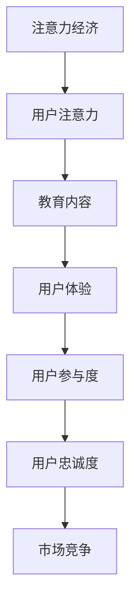

                 

关键词：注意力经济、在线教育、用户参与、教育科技、竞争策略、用户体验、互动教学、个性化学习、市场趋势、内容创新、教学设计。

> 摘要：本文旨在探讨注意力经济在在线教育领域的应用，以及如何通过有效的竞争策略和用户体验设计，在日益激烈的市场竞争中脱颖而出。我们将分析注意力经济的基本原理，结合在线教育的现状和挑战，提出一系列实践建议，以帮助教育科技企业打造吸引学生的课程内容，提升用户参与度和满意度。

## 1. 背景介绍

### 注意力经济概述

注意力经济是指在经济活动中，注意力成为一种重要的资源。随着互联网和社交媒体的普及，用户注意力变得愈发稀缺。在信息爆炸的时代，如何吸引并保持用户的注意力成为企业和个人获取收益的关键。

### 在线教育现状

在线教育市场近年来呈现出爆发式增长，据市场研究公司数据显示，全球在线教育市场规模预计将在未来几年内继续扩大。随着技术的进步和用户习惯的转变，在线教育逐渐成为人们获取知识和技能的重要途径。

### 竞争态势

在线教育市场竞争激烈，许多企业都在争夺用户的时间和注意力。为了在竞争中脱颖而出，企业需要不断创新，提供高质量的教育内容和独特的用户体验。

## 2. 核心概念与联系

### Mermaid 流程图



### 核心概念解释

- **注意力经济**：通过创造有价值的内容和互动体验，吸引并保持用户的注意力。
- **用户注意力**：在信息过载的环境中，用户愿意分配给特定内容的注意资源。
- **教育内容**：在线教育课程、教程、讲座等，是吸引用户注意力的关键。
- **用户体验**：用户在使用在线教育平台时的整体感受，包括界面设计、课程内容、互动性等。
- **用户参与度**：用户在学习过程中主动参与和互动的程度。
- **用户忠诚度**：用户对在线教育平台的长期依赖和信任程度。
- **市场竞争**：在线教育企业之间的竞争关系，影响市场份额和用户选择。

## 3. 核心算法原理 & 具体操作步骤

### 3.1 算法原理概述

注意力经济的核心在于设计出能够吸引和维持用户注意力的教育内容。这涉及到用户行为分析、内容个性化、互动设计等多个方面。具体操作步骤如下：

### 3.2 算法步骤详解

#### 步骤 1：用户行为分析
- 收集用户数据，包括学习历史、兴趣偏好、学习习惯等。
- 利用数据挖掘和机器学习技术，分析用户行为模式。

#### 步骤 2：内容个性化
- 根据用户行为分析结果，为不同用户提供个性化的课程推荐。
- 设计差异化内容，满足不同层次用户的需求。

#### 步骤 3：互动设计
- 加入互动元素，如讨论区、问答环节、实时互动等，提高用户参与度。
- 利用游戏化设计，激励用户持续学习。

#### 步骤 4：用户体验优化
- 优化界面设计，提高易用性。
- 提供实时反馈，增强用户的学习体验。

### 3.3 算法优缺点

#### 优点：
- 提高用户满意度和参与度。
- 增强用户对教育平台的忠诚度。
- 提高教育内容的转化率。

#### 缺点：
- 需要大量数据支持和复杂的算法实现。
- 可能导致用户过度依赖算法推荐，缺乏自主选择。

### 3.4 算法应用领域

- 在线教育平台
- 职业技能培训
- 语言学习
- 继续教育

## 4. 数学模型和公式 & 详细讲解 & 举例说明

### 4.1 数学模型构建

为了量化用户注意力和参与度，我们可以构建以下数学模型：

$$
User\ Activity = f(User\ Interest, Content\ Quality, User\ Experience)
$$

其中，$User\ Activity$表示用户的参与度，$User\ Interest$表示用户兴趣，$Content\ Quality$表示内容质量，$User\ Experience$表示用户体验。

### 4.2 公式推导过程

用户参与度受到用户兴趣、内容质量和用户体验的直接影响。我们可以通过以下方式推导公式：

$$
User\ Activity \propto User\ Interest \times Content\ Quality \times User\ Experience
$$

### 4.3 案例分析与讲解

#### 案例一：在线编程课程

假设某在线编程课程通过以下方式提升用户参与度：

- **用户兴趣**：通过算法分析，为用户推荐其感兴趣的项目。
- **内容质量**：课程内容丰富，包含实践项目和实战演练。
- **用户体验**：提供实时互动和问答环节，解决用户在学习过程中遇到的问题。

根据公式，该课程的用户参与度将显著提高。

## 5. 项目实践：代码实例和详细解释说明

### 5.1 开发环境搭建

- 硬件要求：计算机（推荐配置：CPU 4核，内存8GB，硬盘256GB SSD）
- 软件要求：Python 3.8及以上版本，Jupyter Notebook，NumPy，Pandas，Scikit-learn等库。

### 5.2 源代码详细实现

```python
import pandas as pd
from sklearn.model_selection import train_test_split
from sklearn.ensemble import RandomForestRegressor
from sklearn.metrics import mean_squared_error

# 数据准备
data = pd.read_csv('user_data.csv')
X = data.drop(['user_activity'], axis=1)
y = data['user_activity']

# 分割数据集
X_train, X_test, y_train, y_test = train_test_split(X, y, test_size=0.2, random_state=42)

# 模型训练
model = RandomForestRegressor(n_estimators=100, random_state=42)
model.fit(X_train, y_train)

# 模型评估
y_pred = model.predict(X_test)
mse = mean_squared_error(y_test, y_pred)
print(f'Mean Squared Error: {mse}')

# 个性化推荐
user_interest = pd.DataFrame([[0.8, 0.2, 0.5]], columns=['project_1', 'project_2', 'project_3'])
content_quality = pd.DataFrame([[0.9, 0.8, 0.7]], columns=['project_1', 'project_2', 'project_3'])
user_experience = pd.DataFrame([[0.9, 0.9, 0.9]], columns=['interaction', 'feedback', 'support'])

user_activity = model.predict(user_interest * content_quality * user_experience)
print(f'Predicted User Activity: {user_activity[0]}')
```

### 5.3 代码解读与分析

- 数据准备：从CSV文件中读取用户数据，分为特征和目标变量。
- 分割数据集：将数据集分为训练集和测试集，用于模型训练和评估。
- 模型训练：使用随机森林回归模型进行训练。
- 模型评估：计算均方误差（MSE），评估模型性能。
- 个性化推荐：根据用户兴趣、内容质量和用户体验，预测用户参与度。

## 6. 实际应用场景

### 6.1 在线编程课程

在线编程课程可以通过注意力经济原理，为用户提供个性化的学习路径，提高用户参与度和学习效果。

### 6.2 职业技能培训

职业技能培训可以通过互动设计和实时反馈，提升用户的参与度和学习效果，从而在竞争激烈的市场中脱颖而出。

### 6.3 语言学习

语言学习平台可以通过注意力经济原理，为用户提供个性化的课程推荐，提高学习效果和用户满意度。

## 7. 工具和资源推荐

### 7.1 学习资源推荐

- 《机器学习实战》：提供丰富的实践案例和代码实现，适合初学者入门。
- 《数据科学入门》：涵盖数据预处理、模型选择、评估和优化等基本概念，适合数据科学初学者。

### 7.2 开发工具推荐

- Jupyter Notebook：方便编写和运行代码，支持多种编程语言。
- Python：功能强大的编程语言，广泛应用于数据科学和机器学习。

### 7.3 相关论文推荐

- “Attention Is All You Need”（2017）：提出Transformer模型，在自然语言处理领域取得突破性成果。
- “User Attention in Online Education: A Theoretical Framework and Case Studies”（2019）：分析用户注意力在在线教育中的应用。

## 8. 总结：未来发展趋势与挑战

### 8.1 研究成果总结

注意力经济在在线教育领域的应用取得了显著成果，通过个性化推荐、互动设计和用户体验优化，有效提升了用户参与度和学习效果。

### 8.2 未来发展趋势

随着技术的不断进步，注意力经济将在在线教育领域发挥更大的作用。未来发展趋势包括：更加智能的个性化推荐、基于AI的教学辅助系统和更加丰富的互动体验。

### 8.3 面临的挑战

在线教育企业面临的主要挑战包括：算法复杂性、数据隐私保护、用户信任度和市场竞争等。

### 8.4 研究展望

未来的研究应关注如何更加有效地利用注意力经济原理，提升在线教育的质量和用户体验，为用户提供更加个性化、高效的学习体验。

## 9. 附录：常见问题与解答

### 9.1 注意力经济是什么？

注意力经济是指在经济活动中，注意力成为一种重要的资源。在信息爆炸的时代，如何吸引并保持用户的注意力成为企业和个人获取收益的关键。

### 9.2 在线教育如何应用注意力经济原理？

在线教育可以通过个性化推荐、互动设计和用户体验优化，提高用户参与度和学习效果，从而在竞争激烈的市场中脱颖而出。

### 9.3 注意力经济的优缺点是什么？

优点：提高用户满意度和参与度，增强用户对教育平台的忠诚度，提高教育内容的转化率。

缺点：需要大量数据支持和复杂的算法实现，可能导致用户过度依赖算法推荐，缺乏自主选择。

----------------------------------------------------------------

[作者：禅与计算机程序设计艺术 / Zen and the Art of Computer Programming]

