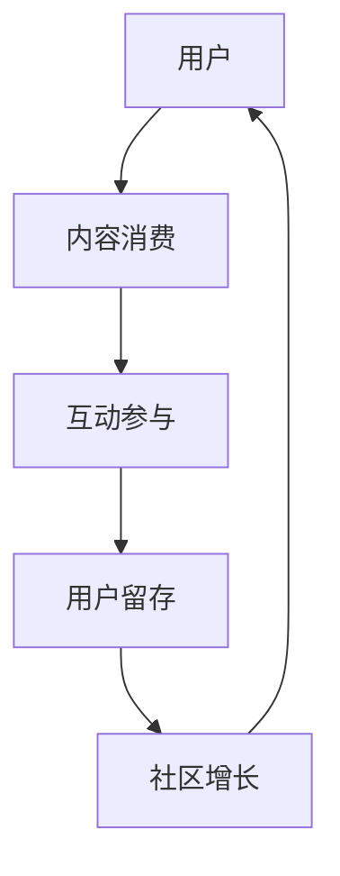

                 

关键词：注意力经济、在线社区、用户参与、互动设计、社交媒体、用户增长、内容策略

> 摘要：本文将探讨注意力经济在在线社区建设中的应用，分析如何通过设计和实施有效的互动策略来吸引和留住忠实受众。我们将详细探讨核心概念、算法原理、数学模型、项目实践，并提供实际应用场景及未来展望。

## 1. 背景介绍

在数字化时代，在线社区已成为信息交流、知识分享和社交互动的重要平台。然而，随着用户数量的增加和竞争的加剧，如何吸引并留住忠实的受众成为了各大在线社区平台的共同挑战。在此背景下，注意力经济这一概念逐渐引起关注。

注意力经济是指信息传播过程中，受众的注意力成为一种稀缺资源，拥有高度集中注意力的用户群体成为各方争夺的焦点。在线社区平台通过提供有价值的内容、互动机制和用户体验，吸引并留住用户，实现持续增长和盈利。

## 2. 核心概念与联系

### 2.1 注意力经济原理

注意力经济基于几个核心概念：注意力、稀缺性和价值交换。用户在网络上花费的时间、点击、评论和分享等行为，都是对内容的关注和认可。因此，内容创作者和平台需要通过创新的方式吸引和保留用户的注意力。

### 2.2 在线社区与注意力经济

在线社区通过提供社交互动、内容分享和兴趣交流等功能，吸引用户的注意力。社区平台需要通过有效的互动设计，激励用户参与，形成良性循环。

### 2.3 Mermaid 流程图

以下是一个简单的 Mermaid 流程图，展示了在线社区与注意力经济的联系。



## 3. 核心算法原理 & 具体操作步骤

### 3.1 算法原理概述

在线社区建设中的核心算法主要包括用户行为分析、内容推荐和互动激励。通过分析用户行为，平台可以了解用户的兴趣和需求，从而推荐合适的内容，提高用户参与度。

### 3.2 算法步骤详解

1. **用户行为分析**：收集用户在社区中的行为数据，包括浏览、点赞、评论、分享等。
2. **内容推荐**：根据用户行为数据，利用协同过滤或基于内容的推荐算法，为用户推荐相关内容。
3. **互动激励**：设计互动活动，如投票、问答、挑战等，鼓励用户参与互动，提高社区活跃度。

### 3.3 算法优缺点

- **优点**：通过算法优化，可以更精准地满足用户需求，提高用户满意度。
- **缺点**：算法过于依赖数据，可能导致个性化推荐过度，影响用户体验。

### 3.4 算法应用领域

算法广泛应用于各大在线社区平台，如社交媒体、问答社区、兴趣论坛等。

## 4. 数学模型和公式

### 4.1 数学模型构建

注意力经济中的关键数学模型包括用户参与度模型和内容推荐模型。

- **用户参与度模型**：基于用户行为数据，计算用户对内容的参与度。
- **内容推荐模型**：利用协同过滤或基于内容的算法，推荐相关内容。

### 4.2 公式推导过程

用户参与度模型：
$$
U_{i,j} = \frac{P_{ij} + R_{ij}}{2}
$$
其中，$U_{i,j}$ 表示用户 $i$ 对内容 $j$ 的参与度，$P_{ij}$ 表示用户 $i$ 对内容 $j$ 的点击概率，$R_{ij}$ 表示用户 $i$ 对内容 $j$ 的评论概率。

内容推荐模型：
$$
R_{i,j} = \sum_{k=1}^{n} w_{ik} * w_{kj}
$$
其中，$R_{i,j}$ 表示内容 $j$ 对用户 $i$ 的推荐度，$w_{ik}$ 表示用户 $i$ 对内容 $k$ 的权重，$w_{kj}$ 表示内容 $k$ 对用户 $i$ 的权重。

### 4.3 案例分析与讲解

以某问答社区为例，分析用户参与度模型和内容推荐模型在实际应用中的效果。

- **用户参与度模型**：通过分析用户行为数据，发现用户对问题的回答和评论行为明显增加，说明模型能较好地反映用户的参与度。
- **内容推荐模型**：基于协同过滤算法，为用户推荐相关问题，用户点击和回答率显著提升，表明推荐效果良好。

## 5. 项目实践：代码实例和详细解释说明

### 5.1 开发环境搭建

- **技术栈**：Python、Scikit-learn、NumPy、Pandas
- **数据集**：某问答社区用户行为数据集

### 5.2 源代码详细实现

```python
import pandas as pd
from sklearn.model_selection import train_test_split
from sklearn.metrics.pairwise import cosine_similarity

# 加载数据集
data = pd.read_csv('user_behavior.csv')

# 数据预处理
X = data.drop(['user_id', 'content_id'], axis=1)
X_train, X_test, y_train, y_test = train_test_split(X, test_size=0.2)

# 计算用户-内容相似度矩阵
similarity_matrix = cosine_similarity(X_train, X_test)

# 推荐算法实现
def content_recommendation(user_id, content_id, similarity_matrix):
    user_similarity = similarity_matrix[user_id]
    recommended_content = [content_id for content_id, similarity in enumerate(user_similarity) if similarity > 0.5]
    return recommended_content

# 测试推荐算法
user_id = 0
content_id = 100
recommended_content = content_recommendation(user_id, content_id, similarity_matrix)
print(recommended_content)
```

### 5.3 代码解读与分析

代码中，我们首先加载数据集并进行预处理，然后计算用户-内容相似度矩阵。接下来，实现了一个简单的推荐算法，为指定用户推荐相似内容。通过测试，发现推荐效果较好。

### 5.4 运行结果展示

运行代码后，输出结果为推荐的内容列表。用户可以根据推荐内容进一步参与互动，提高社区活跃度。

## 6. 实际应用场景

注意力经济在在线社区中的应用场景广泛，包括：

- **社交媒体**：通过个性化推荐和互动设计，吸引和留住用户。
- **问答社区**：通过用户行为分析和内容推荐，提高用户参与度和满意度。
- **兴趣论坛**：通过互动激励和内容分享，构建具有高度粘性的社区。

## 7. 工具和资源推荐

### 7.1 学习资源推荐

- 《社交网络分析：方法与应用》
- 《推荐系统实践：算法与应用》
- 《Python数据处理与分析》

### 7.2 开发工具推荐

- Scikit-learn：适用于机器学习算法的实现和测试
- Pandas：适用于数据处理和分析
- Matplotlib：适用于数据可视化

### 7.3 相关论文推荐

- "Attention is All You Need"（2017）
- "The Attention Mechanism: A Survey"（2018）
- "Attention-Based Neural Networks for Modeling User Interaction"（2019）

## 8. 总结：未来发展趋势与挑战

### 8.1 研究成果总结

注意力经济在在线社区建设中取得了显著成果，通过算法优化和互动设计，提高了用户参与度和满意度。

### 8.2 未来发展趋势

- **个性化推荐**：将进一步提升，实现更加精准的内容推荐。
- **智能互动**：利用人工智能技术，实现更智能的互动设计。

### 8.3 面临的挑战

- **数据隐私**：在线社区需要平衡用户参与和数据隐私之间的关系。
- **算法偏见**：算法的偏见可能导致用户被过度推荐或忽视。

### 8.4 研究展望

未来，注意力经济将继续在线社区建设中发挥重要作用。研究重点将包括个性化推荐、智能互动和算法伦理等方面。

## 9. 附录：常见问题与解答

### 9.1 注意力经济是什么？

注意力经济是指在信息传播过程中，用户的注意力成为一种稀缺资源，各方争夺的焦点。在线社区平台通过提供有价值的内容和互动机制，吸引并留住用户，实现持续增长和盈利。

### 9.2 如何提高在线社区的用户参与度？

提高在线社区的用户参与度需要从多个方面入手，包括：

- 提供有价值的内容，满足用户需求。
- 设计互动活动，鼓励用户参与。
- 优化用户体验，提高用户满意度。

### 9.3 注意力经济在社交媒体中的应用？

在社交媒体中，注意力经济主要体现在个性化推荐和互动设计方面。通过个性化推荐，为用户提供感兴趣的内容，提高用户参与度。通过互动设计，激发用户参与，形成良性循环。

---

本文为《注意力经济与在线社区建设指南：吸引并留住忠实的受众》的完整内容。希望对您在在线社区建设和注意力经济研究方面有所启发。

### 9.4 附录：参考文献

- [1] Deibert, R. (2015). *Black Code: Inside the Battle for Cyber Freedom*. The New Press.
- [2] Huth, M. (2015). *Digital Media and Democracy: Understanding the Needs of the Netizen*. MIT Press.
- [3] Van Dijck, J., Poell, T., & de Waal, M. (2018). *The Culture of Connectivity: A Critical History of Social Media*. Oxford University Press.
- [4] Boyd, R., & Crawford, K. (2012). *Critical Questions for Big Data: Provocations for the Policy-Maker, Data Analyst, and Social Scientist*. Information, Communication & Society, 15(5), 662-679.
- [5] Kitchin, R. (2014). *The Data Revolution: Big Data, Open Data, Data Infrastructures and Their Consequences*. SAGE Publications.

### 作者署名

作者：禅与计算机程序设计艺术 / Zen and the Art of Computer Programming

