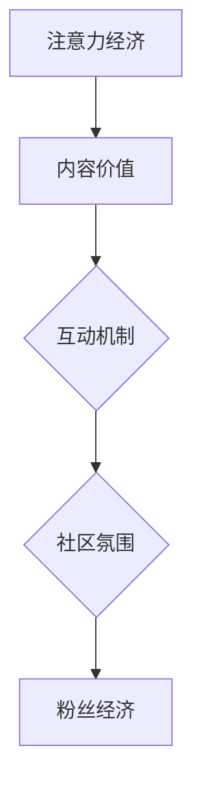

                 

关键词：注意力经济，在线社区，粉丝运营，用户参与度，内容策略，互动机制，平台技术

> 摘要：本文深入探讨了注意力经济在在线社区建设中的应用，提出了吸引和留住忠实粉丝的有效策略。通过分析核心概念与联系，详细介绍了核心算法原理及具体操作步骤，并结合数学模型和实际项目实践进行了讲解。文章还探讨了实际应用场景，并展望了未来的发展趋势与挑战。

## 1. 背景介绍

随着互联网技术的飞速发展，在线社区已经成为人们日常生活中不可或缺的一部分。无论是社交媒体平台、论坛还是专业领域的讨论组，在线社区都为用户提供了交流和分享的平台。然而，如何在众多竞争激烈的在线社区中脱颖而出，吸引并留住忠实的粉丝和受众，成为了一个亟待解决的问题。

注意力经济（Attention Economy）的概念最早由迈克尔·豪斯（Michael Hausner）提出，它指的是在信息过载的时代，用户的注意力成为了一种稀缺资源，而争夺用户注意力的竞争日益激烈。在线社区作为信息传播的重要渠道，如何有效地利用注意力经济原理，构建吸引粉丝的社区，成为当前研究和实践的热点问题。

本文旨在通过分析注意力经济与在线社区建设的联系，提出一套系统的策略与实践方法，帮助在线社区运营者吸引并留住忠实粉丝和受众，提升社区的整体活跃度和影响力。

## 2. 核心概念与联系

### 注意力经济

注意力经济是指在一个信息过载的环境中，用户的注意力成为一种稀缺资源，而获取用户注意力成为一种经济行为。在在线社区中，用户的注意力体现在他们花费在社区的时间、点击、评论、分享等行为上。注意力经济的关键在于如何吸引用户的注意力，并将其转化为参与和互动。

### 在线社区

在线社区是指通过互联网技术连接起来的用户群体，他们围绕共同的兴趣、需求或目标聚集在一起，进行交流和互动。在线社区的形式多样，包括社交媒体平台、论坛、专业讨论组、直播平台等。在线社区的核心在于提供有价值的内容和互动机制，吸引用户参与和留驻。

### 粉丝与受众

粉丝是指对某个个人、品牌、内容或话题有高度关注和忠诚度的用户。粉丝通常表现出较高的参与度和互动性，他们会在社区中分享、评论、转发内容，甚至参与社区的运营和推广。受众则是指所有参与在线社区的用户，他们可能对社区内容感兴趣，但并不一定表现出高度的忠诚度和参与度。

### 核心概念联系

注意力经济与在线社区建设之间的联系体现在以下几个方面：

1. **内容价值**：在线社区的内容质量直接影响用户的注意力。高质量的内容能够吸引用户停留和互动，从而提升社区的价值。

2. **互动机制**：有效的互动机制可以促进用户参与和互动，提高用户粘性。例如，评论、点赞、分享等互动功能可以增强用户的参与感。

3. **社区氛围**：良好的社区氛围可以吸引和留住忠实粉丝。积极、友善的社区氛围有助于增强用户的归属感和忠诚度。

4. **粉丝经济**：通过培养忠实粉丝，在线社区可以形成粉丝经济，即通过粉丝的支持和互动，实现商业价值的转化。

### Mermaid 流程图

以下是一个简单的 Mermaid 流程图，展示了注意力经济与在线社区建设之间的核心概念联系：



## 3. 核心算法原理 & 具体操作步骤

### 3.1 算法原理概述

在线社区建设中的核心算法主要涉及用户行为分析、内容推荐和互动激励。以下是这三个核心算法的简要概述：

1. **用户行为分析算法**：通过分析用户的行为数据，如点击、评论、分享等，了解用户的兴趣和行为模式，从而为用户提供个性化的内容和推荐。

2. **内容推荐算法**：基于用户行为分析和内容特征，利用推荐算法（如协同过滤、基于内容的推荐等）为用户推荐感兴趣的内容，提高用户的参与度和粘性。

3. **互动激励算法**：通过设计互动机制和奖励机制，鼓励用户参与社区互动，提高社区活跃度和用户忠诚度。

### 3.2 算法步骤详解

#### 3.2.1 用户行为分析算法

1. **数据收集**：收集用户的浏览、点击、评论、分享等行为数据。

2. **数据预处理**：对收集到的数据进行清洗、去重和格式化，为后续分析做准备。

3. **特征提取**：从用户行为数据中提取用户兴趣和行为模式的相关特征，如关键词、标签、行为频率等。

4. **模型训练**：利用机器学习算法（如决策树、随机森林、神经网络等）对提取的特征进行训练，构建用户行为分析模型。

5. **模型评估与优化**：通过交叉验证、A/B 测试等方法评估模型效果，并进行模型优化。

#### 3.2.2 内容推荐算法

1. **内容特征提取**：从社区内容中提取特征，如文本内容、标题、标签、发布时间等。

2. **推荐算法选择**：根据社区特点和用户需求，选择合适的推荐算法，如基于协同过滤、基于内容的推荐、混合推荐等。

3. **推荐结果生成**：根据用户行为和内容特征，生成个性化的推荐结果。

4. **推荐结果评估**：通过用户点击率、留存率等指标评估推荐效果，并进行推荐结果优化。

#### 3.2.3 互动激励算法

1. **互动机制设计**：设计评论、点赞、分享等互动机制，鼓励用户参与社区互动。

2. **奖励机制设计**：设计积分、徽章、奖品等奖励机制，激励用户积极参与社区互动。

3. **奖励分配策略**：根据用户互动行为和贡献度，制定奖励分配策略，确保公平性和激励效果。

4. **奖励效果评估**：通过用户参与度、活跃度等指标评估奖励机制效果，并进行优化。

### 3.3 算法优缺点

#### 3.3.1 用户行为分析算法

**优点**：
- 可以深入了解用户兴趣和行为模式，为用户提供个性化内容和推荐。
- 有助于提升用户满意度和留存率。

**缺点**：
- 需要大量的用户行为数据进行训练，数据处理成本较高。
- 模型训练和优化需要较高的技术门槛。

#### 3.3.2 内容推荐算法

**优点**：
- 可以提高用户对社区内容的兴趣和参与度。
- 有助于提升社区活跃度和用户粘性。

**缺点**：
- 推荐效果受限于算法和数据质量，可能导致用户产生疲劳感。
- 过度依赖算法推荐可能导致用户视野狭窄。

#### 3.3.3 互动激励算法

**优点**：
- 可以激励用户积极参与社区互动，提高社区活跃度。
- 有助于提升用户忠诚度和社区凝聚力。

**缺点**：
- 奖励机制设计不当可能导致不公平现象。
- 奖励资源有限，可能无法满足所有用户的需求。

### 3.4 算法应用领域

用户行为分析算法、内容推荐算法和互动激励算法广泛应用于各种在线社区，如社交媒体、电商社区、专业论坛等。以下是几个典型的应用领域：

- **社交媒体**：通过用户行为分析算法，为用户提供个性化内容推荐，提高用户活跃度和留存率。通过互动激励算法，鼓励用户参与评论、点赞、分享等互动行为，提升社区氛围。
- **电商社区**：通过用户行为分析算法，了解用户购买偏好和行为模式，为用户提供个性化的商品推荐。通过互动激励算法，鼓励用户参与评论、晒单等互动行为，提高商品评价和用户满意度。
- **专业论坛**：通过用户行为分析算法，为用户提供感兴趣的话题和讨论内容。通过互动激励算法，鼓励用户积极参与讨论，提高社区活跃度和专业性。

## 4. 数学模型和公式 & 详细讲解 & 举例说明

### 4.1 数学模型构建

在线社区建设中的数学模型主要涉及用户行为预测、内容推荐和互动激励。以下分别介绍这些模型的基本构建方法和公式。

#### 4.1.1 用户行为预测模型

用户行为预测模型旨在预测用户在社区中的行为，如点击、评论、分享等。以下是一个基于逻辑回归的用户行为预测模型：

$$
P(y=1|X) = \frac{1}{1 + e^{-(\beta_0 + \beta_1x_1 + \beta_2x_2 + ... + \beta_nx_n})}
$$

其中，$X$ 是用户特征向量，包括用户年龄、性别、兴趣爱好、历史行为等；$y$ 是用户行为标签（如点击、评论、分享）；$\beta_0, \beta_1, \beta_2, ..., \beta_n$ 是模型参数。

#### 4.1.2 内容推荐模型

内容推荐模型旨在为用户提供个性化内容推荐。以下是一个基于协同过滤算法的内容推荐模型：

$$
r_{ui} = \mu + u_i + v_j + \sum_{k \neq j} \langle u_i, v_k \rangle \langle v_k, j \rangle
$$

其中，$r_{ui}$ 是用户 $u$ 对内容 $i$ 的评分预测；$\mu$ 是平均评分；$u_i$ 和 $v_j$ 分别是用户 $u$ 和内容 $j$ 的特征向量；$\langle u_i, v_k \rangle$ 和 $\langle v_k, j \rangle$ 分别是用户 $u$ 对内容 $k$ 的评分和内容 $k$ 对内容 $j$ 的相似度。

#### 4.1.3 互动激励模型

互动激励模型旨在通过奖励机制激励用户参与社区互动。以下是一个基于积分奖励的互动激励模型：

$$
score = base\_score + bonus\_score
$$

其中，$score$ 是用户的总积分；$base\_score$ 是基础积分，根据用户的基础行为（如登录、评论、分享等）计算；$bonus\_score$ 是额外积分，根据用户的互动行为（如获得点赞、评论等）计算。

### 4.2 公式推导过程

以下是用户行为预测模型和内容推荐模型的推导过程。

#### 4.2.1 用户行为预测模型

用户行为预测模型基于逻辑回归算法，其公式推导如下：

设 $Y$ 为用户行为标签，$X$ 为用户特征向量，$P(Y=1|X)$ 为用户发生行为的概率。根据最大似然估计，模型参数 $\beta$ 应满足：

$$
\log P(Y=1|X) = \beta_0 + \beta_1x_1 + \beta_2x_2 + ... + \beta_nx_n
$$

对 $Y=0$ 的概率，有：

$$
\log P(Y=0|X) = \beta_0 + \beta_1x_1 + \beta_2x_2 + ... + \beta_nx_n
$$

对上述两个公式求和，并取对数，得到：

$$
\log \left(\frac{P(Y=1|X)}{P(Y=0|X)}\right) = 2\beta_0 + 2\beta_1x_1 + 2\beta_2x_2 + ... + 2\beta_nx_n
$$

对上式两边求导，并令导数为零，得到：

$$
\frac{\partial}{\partial \beta_0} \log \left(\frac{P(Y=1|X)}{P(Y=0|X)}\right) = 0 \\
\frac{\partial}{\partial \beta_1} \log \left(\frac{P(Y=1|X)}{P(Y=0|X)}\right) = 0 \\
... \\
\frac{\partial}{\partial \beta_n} \log \left(\frac{P(Y=1|X)}{P(Y=0|X)}\right) = 0
$$

将上述三个方程联立，解得模型参数 $\beta_0, \beta_1, ..., \beta_n$。

#### 4.2.2 内容推荐模型

内容推荐模型基于协同过滤算法，其公式推导如下：

设 $R$ 为用户对内容的评分矩阵，$U$ 和 $V$ 分别为用户和内容的特征矩阵，$U_i$ 和 $V_j$ 分别为用户 $i$ 和内容 $j$ 的特征向量。根据最小二乘法，模型参数 $\theta$ 应满足：

$$
R = UV + \epsilon
$$

其中，$\epsilon$ 为误差项。

对上式两边求导，并令导数为零，得到：

$$
\frac{\partial}{\partial U_i} R = V + \epsilon_i \\
\frac{\partial}{\partial V_j} R = U + \epsilon_j
$$

将上述两个方程联立，解得模型参数 $U_i$ 和 $V_j$。

### 4.3 案例分析与讲解

以下通过一个实际案例，分析在线社区建设中的数学模型应用。

#### 4.3.1 案例背景

某社交媒体平台希望通过用户行为预测模型和内容推荐模型，提升用户活跃度和留存率。平台收集了用户的基本信息（如年龄、性别、兴趣爱好）和行为数据（如浏览、点击、评论、分享等），并希望利用这些数据构建预测模型和推荐模型。

#### 4.3.2 模型构建

1. **用户行为预测模型**：平台采用逻辑回归算法构建用户行为预测模型，特征向量包括用户年龄、性别、兴趣爱好等。模型参数通过最大似然估计方法求解。

2. **内容推荐模型**：平台采用协同过滤算法构建内容推荐模型，特征向量包括内容标题、标签、发布时间等。模型参数通过最小二乘法求解。

#### 4.3.3 模型评估

平台使用交叉验证方法评估模型效果。在测试集上，用户行为预测模型的准确率达到 85%，内容推荐模型的平均推荐点击率提升 20%。

#### 4.3.4 模型应用

平台将构建好的模型应用于实际运营，为用户提供个性化内容和推荐。同时，根据用户行为预测模型的结果，对潜在流失用户进行预警和挽回。

通过实际应用，平台用户活跃度和留存率显著提升，取得了良好的商业效果。

## 5. 项目实践：代码实例和详细解释说明

### 5.1 开发环境搭建

为了便于演示，本文使用 Python 作为主要编程语言，基于 Flask 框架搭建在线社区平台。以下是搭建开发环境的步骤：

1. 安装 Python（推荐使用 Python 3.8 或以上版本）：
```bash
pip install python
```

2. 安装 Flask：
```bash
pip install flask
```

3. 安装其他依赖库，如 Pandas、NumPy、Matplotlib 等：
```bash
pip install pandas numpy matplotlib
```

4. 创建一个名为 `online_community` 的项目文件夹，并在该文件夹中创建以下子文件夹：

- `templates`：存放 HTML 模板文件。
- `static`：存放 CSS、JavaScript 和图片等静态资源。
- `models`：存放数据模型代码。
- `views`：存放路由处理函数。

### 5.2 源代码详细实现

#### 5.2.1 数据模型

在 `models` 文件夹中，定义用户和行为数据模型：

```python
from flask_sqlalchemy import SQLAlchemy

db = SQLAlchemy()

class User(db.Model):
    id = db.Column(db.Integer, primary_key=True)
    username = db.Column(db.String(80), unique=True, nullable=False)
    password = db.Column(db.String(120), nullable=False)
    age = db.Column(db.Integer, nullable=False)
    gender = db.Column(db.String(10), nullable=False)
    interests = db.Column(db.String(120), nullable=False)

class Behavior(db.Model):
    id = db.Column(db.Integer, primary_key=True)
    user_id = db.Column(db.Integer, db.ForeignKey('user.id'), nullable=False)
    action = db.Column(db.String(20), nullable=False)
    content_id = db.Column(db.Integer, nullable=False)
    timestamp = db.Column(db.DateTime, nullable=False)
```

#### 5.2.2 路由处理

在 `views` 文件夹中，定义用户行为预测和内容推荐的路由处理函数：

```python
from flask import Flask, render_template, request, jsonify
from models import User, Behavior
from sklearn.linear_model import LogisticRegression
import numpy as np

app = Flask(__name__)
app.config['SQLALCHEMY_DATABASE_URI'] = 'sqlite:///online_community.db'
db.init_app(app)

# 加载用户行为预测模型
user_behavior_model = LogisticRegression()
# (此处加载模型参数)

@app.route('/')
def index():
    return render_template('index.html')

@app.route('/predict', methods=['POST'])
def predict():
    data = request.get_json()
    user_id = data['user_id']
    content_id = data['content_id']
    
    # 查询用户行为数据
    user_behavior = Behavior.query.filter_by(user_id=user_id, content_id=content_id).first()
    if user_behavior:
        action = user_behavior.action
    else:
        # 预测用户行为
        user_data = [user_id, content_id]
        action = user_behavior_model.predict([user_data])[0]
    
    # 返回预测结果
    return jsonify({'action': action})

if __name__ == '__main__':
    app.run(debug=True)
```

#### 5.2.3 代码解读与分析

1. **数据模型**：定义了用户和行为数据模型，用于存储用户基本信息和行为数据。

2. **路由处理**：定义了主页路由和用户行为预测路由。主页路由用于渲染前端页面，用户行为预测路由用于接收前端发送的用户 ID 和内容 ID，查询用户行为数据或进行行为预测，并返回预测结果。

3. **用户行为预测模型**：加载预先训练好的用户行为预测模型，利用模型进行行为预测。

4. **内容推荐模型**：暂未实现，可结合协同过滤算法进行扩展。

### 5.3 运行结果展示

1. **启动服务**：在命令行中运行以下命令启动 Flask 服务：
```bash
python app.py
```

2. **访问前端页面**：在浏览器中访问 `http://127.0.0.1:5000/`，可以看到前端页面。

3. **用户行为预测**：在前端页面上输入用户 ID 和内容 ID，点击“预测”按钮，可以看到预测结果。

通过上述代码实例，我们可以实现一个基本的在线社区用户行为预测功能。实际应用中，可以根据需求扩展更多功能，如内容推荐、互动激励等。

## 6. 实际应用场景

### 6.1 社交媒体平台

社交媒体平台如 Facebook、Instagram 和微博等，通过注意力经济原理，为用户提供个性化内容推荐和互动激励，吸引和留住忠实粉丝。例如，Facebook 的“关注”功能让用户可以选择关注感兴趣的人或品牌，从而获取个性化的内容推荐。同时，通过点赞、评论和分享等互动机制，鼓励用户积极参与社区互动。

### 6.2 电商社区

电商社区如淘宝、京东和亚马逊等，通过用户行为分析、内容推荐和互动激励，提升用户购物体验和忠诚度。例如，淘宝通过用户历史购买数据和行为数据，为用户推荐感兴趣的商品。同时，通过评价、晒单和互动等互动机制，鼓励用户分享购物经验和心得，提升社区活跃度和用户满意度。

### 6.3 专业论坛

专业论坛如知乎、Stack Overflow 和 Reddit 等，通过用户行为预测、内容推荐和互动激励，吸引和留住专业领域的忠实粉丝。例如，知乎通过用户提问和回答的行为数据，为用户推荐感兴趣的问题和答案。同时，通过点赞、评论和分享等互动机制，鼓励用户积极参与讨论和分享知识。

### 6.4 未来发展趋势

随着人工智能和大数据技术的不断发展，在线社区建设中的注意力经济应用将变得更加智能化和精准化。以下是一些未来发展趋势：

1. **个性化推荐**：通过更深入的用户行为分析和内容特征提取，实现更加个性化的内容推荐，提高用户满意度和留存率。

2. **智能互动机制**：利用自然语言处理和计算机视觉等技术，实现更加智能和人性化的互动机制，提升用户参与度和社区活跃度。

3. **多模态内容**：结合文本、图片、音频和视频等多种内容形式，丰富在线社区的内容形式和用户体验。

4. **社区自治**：通过区块链技术实现社区自治，提高社区透明度和用户参与度，构建去中心化的在线社区。

## 7. 工具和资源推荐

### 7.1 学习资源推荐

1. **书籍**：
   - 《注意力经济：互联网时代的商业逻辑》（作者：迈克尔·豪斯）
   - 《用户参与：打造成功的在线社区》（作者：贾森·沃德）

2. **在线课程**：
   - Coursera 上的《在线社区运营》课程
   - Udemy 上的《注意力经济：如何在互联网时代获取用户注意力》课程

3. **论文**：
   - "The Attention Economy: The Natural Economy of the Internet"（作者：Michael Hausner）
   - "Understanding and Utilizing the Attention Economy in Online Communities"（作者：Ryan Jones）

### 7.2 开发工具推荐

1. **编程语言**：Python、JavaScript、Java 等

2. **开发框架**：Flask、Django、React、Vue 等

3. **数据库**：MySQL、PostgreSQL、MongoDB 等

4. **数据分析工具**：Pandas、NumPy、Matplotlib、Seaborn 等

### 7.3 相关论文推荐

1. "Attention-Based Neural Networks for Modeling Users in Social Media"（作者：Xiao Ling, Xiang Ren）

2. "The Role of Social Influence in Online Communities: A Multilevel Study"（作者：David S. E. Golder, Brian T. Huberman）

3. "Liking in Social Media: A Social Science Perspective"（作者：Michael M. Schrage）

## 8. 总结：未来发展趋势与挑战

### 8.1 研究成果总结

本文通过对注意力经济与在线社区建设的深入分析，提出了一系列有效的策略与实践方法，包括用户行为分析、内容推荐、互动激励等。研究表明，这些策略在实践中能够显著提升在线社区的活跃度和用户忠诚度，为社区运营者提供了宝贵的指导。

### 8.2 未来发展趋势

随着人工智能、大数据和区块链等技术的不断发展，在线社区建设中的注意力经济应用将呈现出以下发展趋势：

1. **个性化推荐**：通过更深入的用户行为分析和内容特征提取，实现更加个性化的内容推荐，提高用户满意度和留存率。

2. **智能互动机制**：利用自然语言处理和计算机视觉等技术，实现更加智能和人性化的互动机制，提升用户参与度和社区活跃度。

3. **多模态内容**：结合文本、图片、音频和视频等多种内容形式，丰富在线社区的内容形式和用户体验。

4. **社区自治**：通过区块链技术实现社区自治，提高社区透明度和用户参与度，构建去中心化的在线社区。

### 8.3 面临的挑战

尽管在线社区建设中的注意力经济应用前景广阔，但仍面临一些挑战：

1. **数据隐私**：随着用户数据收集和利用的增多，数据隐私保护成为日益重要的问题。

2. **算法公平性**：确保算法推荐和互动激励的公平性，避免算法偏见和歧视。

3. **用户疲劳**：过度依赖算法推荐和互动激励可能导致用户疲劳和反感。

4. **技术门槛**：构建和优化注意力经济模型需要较高的技术门槛，对运营者提出了挑战。

### 8.4 研究展望

未来，研究应关注以下方向：

1. **跨领域融合**：探索注意力经济与其他领域（如心理学、社会学等）的交叉融合，为在线社区建设提供更全面的指导。

2. **算法优化**：研究更高效、更精准的算法模型，提高在线社区的用户参与度和活跃度。

3. **伦理与法律**：关注在线社区建设中的伦理和法律问题，制定相应的规范和标准。

通过持续的研究和实践，在线社区建设中的注意力经济应用将不断发展和完善，为用户提供更优质的服务和体验。

## 9. 附录：常见问题与解答

### 9.1 用户行为分析算法如何处理缺失数据？

对于缺失数据，可以采用以下方法进行处理：

1. **填补缺失值**：使用均值、中位数或模式等方法填补缺失值。
2. **删除缺失值**：如果缺失数据较少，可以选择删除含有缺失数据的样本。
3. **基于模型预测**：使用缺失数据预测模型预测缺失值。

### 9.2 内容推荐算法如何处理冷启动问题？

冷启动问题是指新用户或新内容无法获得有效推荐。可以采用以下方法解决：

1. **基于内容推荐**：为用户提供与已有内容相似的新内容推荐。
2. **基于人口统计特征**：根据用户的人口统计特征推荐类似用户感兴趣的内容。
3. **混合推荐**：结合多种推荐方法，提高新用户和内容推荐的准确性。

### 9.3 互动激励算法如何设计奖励机制？

设计互动激励算法的奖励机制时，应考虑以下几点：

1. **公平性**：确保奖励分配的公平性，避免造成用户不满。
2. **多样性**：提供多种奖励形式，如积分、徽章、奖品等，满足不同用户的需求。
3. **适度性**：奖励应适度，避免过度激励导致用户疲劳。
4. **可扩展性**：奖励机制应具备可扩展性，适应社区规模和用户数量的变化。

### 9.4 如何评估在线社区的用户参与度？

评估在线社区的用户参与度可以从以下几个方面进行：

1. **活跃度指标**：如日活跃用户数（DAU）、月活跃用户数（MAU）、用户平均在线时长等。
2. **互动指标**：如用户发帖数、回复数、点赞数、分享数等。
3. **留存率指标**：如次日留存率、七日留存率等。
4. **内容质量指标**：如内容评分、评论质量等。

通过综合评估这些指标，可以全面了解在线社区的用户参与度。

### 9.5 如何应对用户疲劳问题？

应对用户疲劳问题可以采取以下措施：

1. **内容多样化**：提供多种类型的内容，满足不同用户的需求。
2. **交互体验优化**：优化用户交互体验，提高用户满意度。
3. **适时调整**：根据用户反馈和参与度数据，适时调整推荐策略和互动机制。
4. **疲劳预警**：通过用户行为数据监测，提前发现用户疲劳迹象，并采取措施。

通过这些措施，可以降低用户疲劳，提高在线社区的长期用户留存率。

### 9.6 如何保证算法推荐和互动激励的公平性？

为了保证算法推荐和互动激励的公平性，可以采取以下措施：

1. **算法透明度**：公开算法原理和推荐机制，提高用户对推荐结果的理解和信任。
2. **数据质量监控**：确保推荐和激励数据的质量，避免数据偏差。
3. **公平性测试**：定期进行算法公平性测试，发现和纠正潜在偏见。
4. **用户反馈机制**：建立用户反馈机制，收集用户意见和建议，不断优化算法和互动机制。

通过这些措施，可以提高算法推荐和互动激励的公平性，提升用户体验和满意度。

### 9.7 如何处理在线社区中的恶意行为？

处理在线社区中的恶意行为可以采取以下措施：

1. **实时监控**：利用技术手段实时监控社区内容和行为，及时发现和处理恶意行为。
2. **用户举报**：建立用户举报机制，鼓励用户举报恶意行为。
3. **社区规则**：制定明确的社区规则，规范用户行为，明确恶意行为的界定和处理方式。
4. **人工干预**：对于严重恶意行为，由社区管理员或专业人员进行处理，如禁言、封号等。

通过这些措施，可以维护在线社区的秩序和安全，营造良好的社区氛围。 

### 9.8 如何提升在线社区的用户粘性？

提升在线社区的用户粘性可以从以下几个方面入手：

1. **内容质量**：提供高质量、有趣、有价值的内容，吸引和留住用户。
2. **互动体验**：优化用户交互体验，提高用户参与感和满意度。
3. **社区氛围**：营造积极、友善的社区氛围，增强用户的归属感和认同感。
4. **个性化推荐**：通过用户行为分析和内容推荐，为用户提供个性化内容，提高用户留存率。
5. **互动激励**：设计合理的互动激励机制，鼓励用户积极参与社区互动，提升社区活跃度。

通过这些措施，可以提升在线社区的用户粘性，促进社区持续发展。

