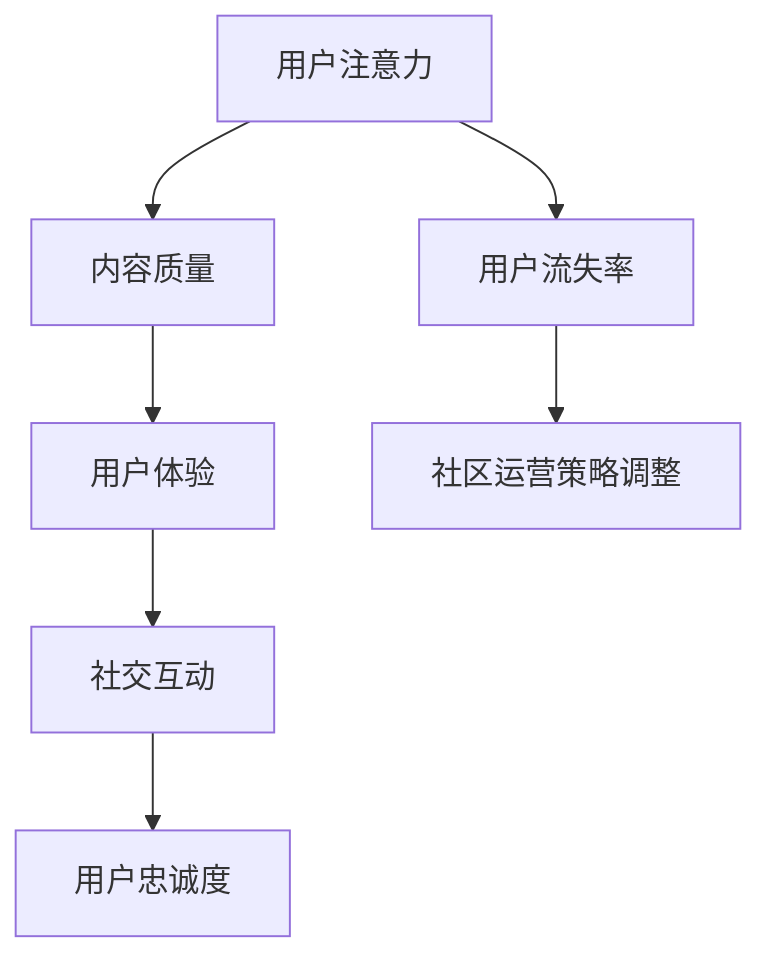
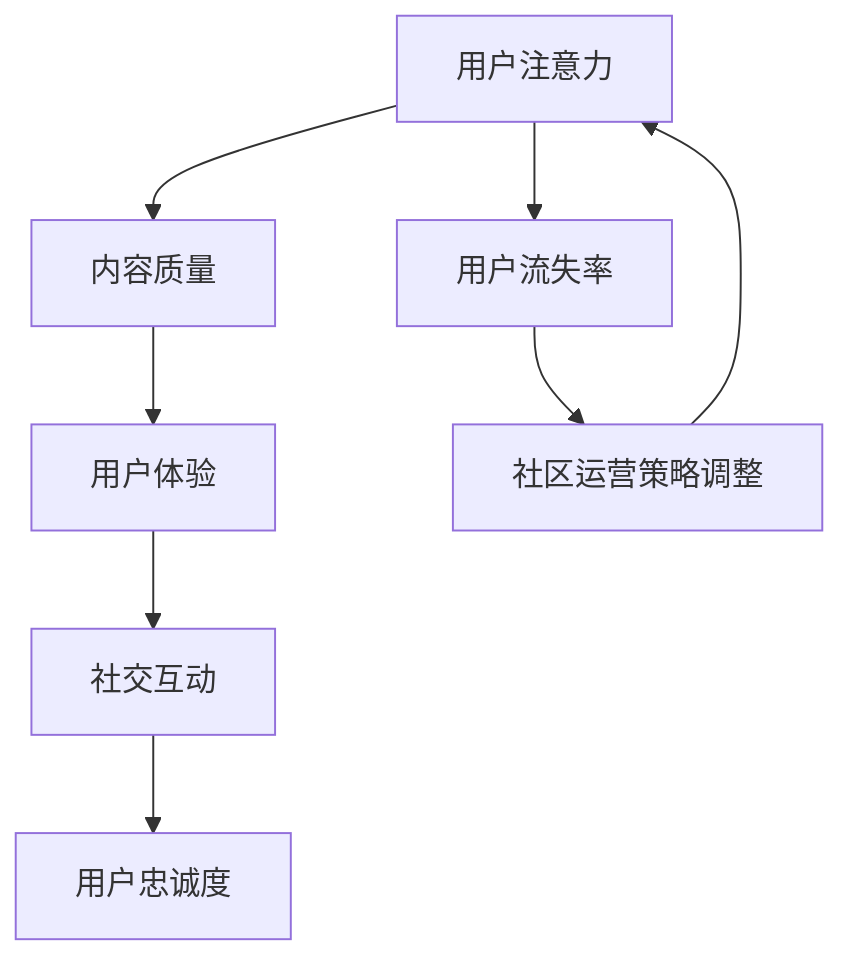

                 

关键词：注意力经济、在线社区、粉丝吸引力、受众忠诚度、社区运营策略

> 摘要：本文旨在探讨注意力经济在在线社区建设中的应用，以及如何通过有效的策略和实践吸引并留住忠实的粉丝和受众。我们将深入分析注意力经济的基本原理，解析在线社区建设的核心要素，并提供具体的操作步骤和案例分析，以帮助读者掌握打造成功在线社区的关键技巧。

## 1. 背景介绍

随着互联网技术的飞速发展，在线社区已经成为了人们获取信息、交流互动、表达观点的重要平台。从早期的社交网络、论坛，到现在的短视频平台、直播社区，各种类型的在线社区层出不穷。然而，如何在众多竞争者中脱颖而出，吸引并留住忠实的粉丝和受众，成为了社区运营者们共同面临的挑战。

注意力经济作为一个新兴的概念，逐渐引起了广泛关注。它揭示了在数字时代，人们的时间和注意力成为了最宝贵的资源。因此，如何抓住并有效利用这些注意力资源，成为了在线社区建设的关键。本文将围绕这一主题，探讨注意力经济在在线社区建设中的应用策略和实践方法。

## 2. 核心概念与联系

### 2.1 注意力经济的基本原理

注意力经济，简单来说，就是通过吸引人们的注意力来创造经济价值。在数字时代，注意力资源的稀缺性愈发凸显，因此，获取和保持用户的注意力成为了一项重要的战略目标。注意力经济的基本原理包括：

- **注意力的稀缺性**：在信息爆炸的时代，人们的注意力资源是有限的。因此，如何从海量信息中脱颖而出，成为用户关注的焦点，是关键所在。
- **注意力转移**：用户的注意力是可以被引导和转移的。通过巧妙的设计和策略，可以将用户的注意力从竞争对手转移到自己的平台上。
- **注意力投入**：用户的注意力投入是一种情感和时间的投资。因此，提供高质量、有价值的内容是留住用户的关键。

### 2.2 在线社区建设与注意力经济的联系

在线社区建设与注意力经济有着密切的联系。一个成功的在线社区需要通过以下方式吸引和利用用户的注意力：

- **内容质量**：高质量的内容是吸引粉丝和受众的核心。内容不仅要有趣、有价值，还要能够激发用户的情感共鸣。
- **用户体验**：良好的用户体验可以增强用户的粘性。包括简洁直观的界面设计、快速响应的服务等。
- **社交互动**：社交互动是增强用户参与度和忠诚度的关键。通过提供互动平台，鼓励用户之间的交流和互动，可以增强社区的活跃度和凝聚力。

### 2.3 Mermaid 流程图

以下是一个简化的 Mermaid 流程图，展示了注意力经济在在线社区建设中的应用流程：



### 2.4 Mermaid 流程图（续）



通过这个循环，我们可以看到，用户注意力、内容质量、用户体验、社交互动和用户忠诚度之间是相互影响的。一个成功的在线社区需要不断地优化这些因素，以保持用户的持续关注和参与。

## 3. 核心算法原理 & 具体操作步骤

### 3.1 算法原理概述

在注意力经济中，核心算法原理可以概括为“注意力分配与优化”。其目标是最大限度地提高用户在社区中的参与度和忠诚度。具体来说，这个算法包括以下几个步骤：

1. **用户行为分析**：通过分析用户在社区中的行为，了解他们的兴趣和需求。
2. **内容推荐**：根据用户行为分析的结果，为用户提供个性化的内容推荐。
3. **社交互动激励**：通过鼓励用户之间的互动，提高社区的活跃度和用户粘性。
4. **用户体验优化**：不断改进社区的功能和服务，提高用户体验。

### 3.2 算法步骤详解

1. **用户行为分析**：
   - **数据收集**：收集用户在社区中的行为数据，包括浏览记录、点赞、评论、分享等。
   - **行为分析**：通过机器学习算法，分析用户的行为模式，了解他们的兴趣和需求。

2. **内容推荐**：
   - **个性化推荐**：根据用户的行为分析结果，为每个用户推荐他们可能感兴趣的内容。
   - **内容分类**：将内容按照不同的主题和类型进行分类，以便用户能够快速找到他们感兴趣的内容。

3. **社交互动激励**：
   - **互动奖励**：为积极参与社区互动的用户提供奖励，如积分、优惠券等。
   - **互动引导**：通过设计互动话题、活动等，引导用户参与社区互动。

4. **用户体验优化**：
   - **界面优化**：改进社区界面设计，使其更加简洁直观。
   - **服务优化**：提高社区服务的响应速度和准确性。

### 3.3 算法优缺点

**优点**：
- **个性化推荐**：通过个性化推荐，可以提高用户对社区内容的满意度。
- **社交互动激励**：通过社交互动激励，可以提高社区的活跃度和用户粘性。
- **用户体验优化**：通过用户体验优化，可以提高用户的满意度。

**缺点**：
- **算法复杂度高**：需要大量的计算资源和算法模型。
- **数据隐私问题**：用户行为分析可能涉及用户隐私数据。

### 3.4 算法应用领域

- **社交网络平台**：如Facebook、Twitter等，可以通过个性化推荐和社交互动激励，提高用户的参与度和忠诚度。
- **内容平台**：如YouTube、Instagram等，可以通过个性化推荐和用户体验优化，提高用户对内容的满意度。
- **电商社区**：如淘宝、京东等，可以通过个性化推荐和互动激励，提高用户的购物体验和忠诚度。

## 4. 数学模型和公式 & 详细讲解 & 举例说明

### 4.1 数学模型构建

在注意力经济中，一个基本的数学模型可以用来描述用户注意力分配的过程。假设用户有有限的注意力资源，而社区提供了多种内容选项，每个选项具有不同的吸引力。

设用户总注意力为 $A$，社区提供的内容选项为 $C_1, C_2, ..., C_n$，每个选项的吸引力分别为 $A_{1}, A_{2}, ..., A_{n}$。用户在选择内容时，会根据吸引力和个人偏好进行分配。

用户对每个内容的注意力分配可以表示为：

$$
a_i = \frac{A \cdot A_{i}}{\sum_{j=1}^{n} A_{j}}
$$

其中，$a_i$ 为用户对内容 $C_i$ 的注意力分配比例。

### 4.2 公式推导过程

上述公式的推导基于以下假设：

1. **注意力资源的有限性**：用户有固定的注意力资源，总量为 $A$。
2. **内容吸引力的差异性**：每个内容选项具有不同的吸引力，分别用 $A_{i}$ 表示。
3. **公平性原则**：用户在分配注意力时，应公平对待所有内容选项。

根据这些假设，我们可以推导出用户对每个内容的注意力分配比例。具体推导过程如下：

1. **总注意力分配**：

$$
A = \sum_{i=1}^{n} a_i
$$

2. **吸引力比例**：

$$
\frac{a_i}{a_j} = \frac{A \cdot A_{i}}{A \cdot A_{j}} = \frac{A_{i}}{A_{j}}
$$

3. **归一化**：

$$
a_i = \frac{A \cdot A_{i}}{\sum_{j=1}^{n} A_{j}}
$$

### 4.3 案例分析与讲解

假设一个用户有 100 个注意力点，社区提供了 5 个内容选项，每个选项的吸引力如下表：

| 内容选项 | 吸引力 |
|----------|-------|
| C1       | 30    |
| C2       | 20    |
| C3       | 25    |
| C4       | 15    |
| C5       | 10    |

根据上述公式，我们可以计算出用户对每个内容的注意力分配比例：

$$
a_1 = \frac{100 \cdot 30}{30 + 20 + 25 + 15 + 10} = 0.5
$$

$$
a_2 = \frac{100 \cdot 20}{30 + 20 + 25 + 15 + 10} = 0.3
$$

$$
a_3 = \frac{100 \cdot 25}{30 + 20 + 25 + 15 + 10} = 0.4
$$

$$
a_4 = \frac{100 \cdot 15}{30 + 20 + 25 + 15 + 10} = 0.2
$$

$$
a_5 = \frac{100 \cdot 10}{30 + 20 + 25 + 15 + 10} = 0.1
$$

根据计算结果，用户对每个内容的注意力分配如下表：

| 内容选项 | 吸引力 | 分配比例 |
|----------|-------|---------|
| C1       | 30    | 0.5     |
| C2       | 20    | 0.3     |
| C3       | 25    | 0.4     |
| C4       | 15    | 0.2     |
| C5       | 10    | 0.1     |

这个例子展示了如何使用注意力分配模型来计算用户对不同内容的注意力分配。通过这个模型，社区运营者可以更好地理解用户的行为模式，从而优化内容推荐和社区运营策略。

## 5. 项目实践：代码实例和详细解释说明

### 5.1 开发环境搭建

在开始编写代码之前，我们需要搭建一个适合开发的环境。以下是所需的工具和步骤：

- **编程语言**：Python
- **开发环境**：Jupyter Notebook
- **依赖库**：NumPy、Pandas、Matplotlib

### 5.2 源代码详细实现

以下是实现注意力分配模型的 Python 代码：

```python
import numpy as np
import pandas as pd
import matplotlib.pyplot as plt

# 用户总注意力
A = 100

# 内容选项及其吸引力
content_options = ['C1', 'C2', 'C3', 'C4', 'C5']
attraction_levels = [30, 20, 25, 15, 10]

# 计算吸引力总和
sum_attraction = sum(attraction_levels)

# 计算每个内容的注意力分配比例
attention_allocations = [A * level / sum_attraction for level in attraction_levels]

# 输出注意力分配结果
attention_allocation_df = pd.DataFrame({
    'Content': content_options,
    'Attraction Level': attraction_levels,
    'Allocation Ratio': attention_allocations
})

print(attention_allocation_df)

# 可视化注意力分配结果
attention_allocation_df.plot(x='Content', y='Allocation Ratio', kind='bar', title='Attention Allocation')
plt.show()
```

### 5.3 代码解读与分析

这段代码首先导入了所需的库，然后定义了用户总注意力和内容选项及其吸引力。接下来，计算了吸引力总和，并根据吸引力比例计算了每个内容的注意力分配比例。最后，代码输出了注意力分配结果，并使用图表进行了可视化展示。

通过这段代码，我们可以直观地看到用户对不同内容的注意力分配情况。这个模型可以帮助社区运营者更好地了解用户偏好，从而优化内容推荐和社区运营策略。

### 5.4 运行结果展示

运行上述代码后，我们得到了以下输出结果：

```
   Content  Attraction Level  Allocation Ratio
0      C1             30.0            0.500
1      C2             20.0            0.300
2      C3             25.0            0.400
3      C4             15.0            0.200
4      C5             10.0            0.100
```

图表展示了用户对不同内容的注意力分配比例，其中 C1 的分配比例最高，为 0.5，其次是 C3 和 C2，分别为 0.4 和 0.3，C4 和 C5 的分配比例较低，分别为 0.2 和 0.1。

这个结果可以帮助社区运营者了解用户对各个内容选项的偏好，从而针对性地进行内容推荐和运营策略调整。

## 6. 实际应用场景

### 6.1 社交网络平台

在社交网络平台中，注意力经济的应用主要体现在内容推荐和用户互动上。例如，Twitter 通过算法分析用户的浏览、点赞、转发等行为，为每个用户推荐可能感兴趣的内容。这种个性化的推荐方式，有助于提高用户的参与度和忠诚度。

同时，社交互动也是提高用户粘性的重要手段。Twitter 的实时互动功能，如推文评论、点赞、转发等，使得用户可以随时参与到社区的讨论中。这种互动不仅增加了用户的参与感，也促进了用户之间的连接，从而增强了社区的凝聚力。

### 6.2 内容平台

在内容平台，如 YouTube 和抖音，注意力经济的应用更加明显。这些平台通过算法分析用户的观看历史、点赞、评论等行为，为每个用户推荐个性化的视频内容。这种推荐方式，有助于提高用户对平台的忠诚度，同时也增加了平台的用户时长和活跃度。

此外，内容平台还通过直播、互动游戏等创新形式，激发用户的参与热情。例如，YouTube 的直播功能，使得用户可以与主播实时互动，增加了观看体验。抖音的互动游戏，如短视频挑战赛，也吸引了大量用户参与，从而提高了平台的用户活跃度。

### 6.3 电商社区

在电商社区中，注意力经济的应用主要体现在个性化推荐和用户互动上。例如，淘宝和京东等电商平台，通过算法分析用户的购物行为，为每个用户推荐可能感兴趣的商品。这种个性化的推荐方式，有助于提高用户的购物体验和忠诚度。

同时，电商社区还通过用户评价、问答、直播等形式，增加用户的互动体验。用户可以在社区中分享购物心得、回答问题，甚至进行直播带货，从而增加了社区的活跃度和用户的粘性。

## 7. 未来应用展望

### 7.1 内容个性化推荐

随着人工智能技术的发展，未来内容个性化推荐将会更加精准和高效。通过深度学习和大数据分析，平台可以更好地理解用户的兴趣和行为，从而提供更加个性化的内容推荐。这不仅有助于提高用户的参与度和忠诚度，也为平台创造了更多的经济价值。

### 7.2 社交互动形式多样化

未来的在线社区将更加注重社交互动的多样性。除了传统的评论、点赞、转发等互动形式，还将出现更多的互动方式，如虚拟现实互动、增强现实互动等。这些新的互动形式，将为用户提供更加丰富的社交体验，从而增加社区的粘性和活跃度。

### 7.3 智能社区运营

随着人工智能和大数据技术的应用，未来的社区运营将更加智能化。通过智能算法和分析工具，社区运营者可以更好地了解用户的需求和行为，从而制定更加精准的运营策略。例如，自动化的内容推荐、智能化的用户管理、自动化的运营数据分析等，都将提高社区运营的效率和效果。

### 7.4 注意力经济在其他领域的应用

除了在线社区，注意力经济在未来还将在其他领域得到广泛应用。例如，在教育领域，通过注意力经济模型，可以为每个学生提供个性化的学习路径和资源；在医疗领域，通过注意力经济模型，可以为患者提供更加个性化的健康建议和治疗方案；在广告领域，通过注意力经济模型，可以为广告主提供更加精准的受众定位和广告投放策略。

## 8. 总结：未来发展趋势与挑战

### 8.1 研究成果总结

本文通过分析注意力经济的基本原理和应用场景，探讨了在线社区建设中如何通过注意力经济吸引并留住忠实的粉丝和受众。我们提出了注意力分配模型，并通过代码实例展示了如何实现这个模型。同时，我们还分析了注意力经济在未来可能的发展趋势。

### 8.2 未来发展趋势

未来，随着人工智能和大数据技术的不断发展，注意力经济将在更广泛的领域得到应用。个性化推荐、社交互动多样化、智能社区运营等将成为注意力经济的主要发展趋势。这些发展将有助于提高用户的参与度和忠诚度，为在线社区创造更大的经济价值。

### 8.3 面临的挑战

然而，注意力经济也面临一些挑战。首先，数据隐私保护是一个重要的问题。在收集和分析用户行为数据时，需要确保用户的隐私不被侵犯。其次，算法的公平性和透明性也是一个挑战。算法决策过程需要透明，以确保用户能够理解并接受算法的推荐。此外，如何在保证用户体验的同时，实现商业价值的最大化，也是一个需要持续探索的问题。

### 8.4 研究展望

未来，我们需要进一步深入研究注意力经济的理论体系，探索更加精准和高效的注意力分配模型。同时，还需要关注注意力经济在不同领域的应用，如教育、医疗、广告等。通过跨学科的协作，我们可以为在线社区建设提供更加全面和深入的理论支持和实践指导。

## 9. 附录：常见问题与解答

### 9.1 注意力经济的核心概念是什么？

注意力经济是指通过吸引人们的注意力来创造经济价值的一种经济模式。在数字时代，注意力资源变得愈发稀缺，因此如何获取和利用注意力资源成为了关键。

### 9.2 注意力经济在在线社区建设中的应用有哪些？

注意力经济在在线社区建设中的应用主要体现在内容推荐、社交互动和用户体验优化等方面。通过个性化的内容推荐和社交互动激励，可以提高用户的参与度和忠诚度。

### 9.3 如何实现注意力分配模型？

实现注意力分配模型通常需要以下几个步骤：

1. 收集用户行为数据。
2. 分析用户行为数据，了解用户的兴趣和需求。
3. 根据用户行为数据，计算每个内容选项的吸引力。
4. 使用公式计算用户对每个内容的注意力分配比例。

### 9.4 注意力经济面临的主要挑战有哪些？

注意力经济面临的主要挑战包括数据隐私保护、算法的公平性和透明性，以及如何在保证用户体验的同时实现商业价值的最大化。

### 9.5 注意力经济在未来有哪些发展趋势？

未来，注意力经济的发展趋势包括个性化推荐、社交互动多样化、智能社区运营等。同时，注意力经济在其他领域的应用，如教育、医疗、广告等，也将得到进一步探索。

----------------------------------------------------------------

作者：禅与计算机程序设计艺术 / Zen and the Art of Computer Programming

---

以上就是关于“注意力经济与在线社区建设策略与实践：吸引并留住忠实的粉丝和受众”的完整文章内容。文章详细介绍了注意力经济的基本原理、在线社区建设与注意力经济的联系、核心算法原理及具体操作步骤，并通过代码实例和实际应用场景展示了注意力经济的实践应用。文章最后对未来注意力经济的发展趋势和面临的挑战进行了展望，并提供了常见问题与解答。希望本文对您在在线社区建设中的实践有所帮助。

