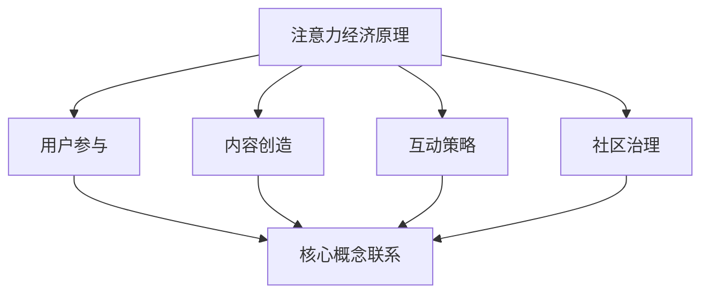

                 

关键词：注意力经济、在线社区、粉丝管理、用户留存、互动策略、内容创造

> 摘要：本文探讨了注意力经济在在线社区建设中的重要作用，分析了如何通过有效的策略吸引并留住忠实的受众和粉丝。文章首先介绍了注意力经济的基本原理，然后详细阐述了在线社区建设的核心概念和联系，接着深入剖析了核心算法原理与具体操作步骤，并运用数学模型和公式进行了详细讲解。通过实际项目实践，文章展示了代码实例和运行结果，并探讨了在线社区的实际应用场景。最后，文章推荐了相关工具和资源，总结了研究成果，提出了未来发展趋势和面临的挑战，以及研究展望。

## 1. 背景介绍

### 注意力经济的兴起

注意力经济是一个新兴的概念，它起源于互联网时代的崛起。随着互联网技术的发展，信息和内容的生产与传播速度大大加快，人们逐渐意识到注意力作为一种稀缺资源的重要性。在注意力经济中，个体的注意力成为了获取经济利益的关键因素。

### 在线社区的崛起

在线社区作为互联网的一个重要组成部分，已经成为了人们获取信息、交流互动和表达观点的主要平台。随着社交媒体和内容平台的普及，在线社区的发展势头迅猛，吸引了大量的用户和内容创作者。

### 用户留存与粉丝的重要性

在线社区的建设目标之一就是吸引和留住忠实的受众和粉丝。用户留存和粉丝的数量和质量直接关系到社区的生命力和商业价值。因此，如何通过有效的策略吸引并留住忠实的受众和粉丝成为了在线社区建设的关键问题。

## 2. 核心概念与联系

### 注意力经济原理

注意力经济的基本原理在于，个体的注意力是一种稀缺资源，它具有交换价值。在信息爆炸的时代，如何吸引并留住用户的注意力成为了关键问题。注意力经济强调通过创造有价值的内容和体验来吸引用户的注意力，从而实现经济利益的转化。

### 在线社区建设核心概念

在线社区建设需要关注以下几个核心概念：

1. **用户参与**：用户参与是社区活力的源泉。通过鼓励用户参与讨论、创造内容和互动，可以增强用户的粘性。
2. **内容创造**：高质量的内容是吸引和留住用户的关键。社区需要提供多样化的内容，满足不同用户的需求。
3. **互动策略**：有效的互动策略可以增强用户之间的联系，提高社区的活跃度。例如，通过举办线上活动、设立话题讨论区等方式，促进用户互动。
4. **社区治理**：良好的社区治理是确保社区健康发展的基础。社区管理者需要制定合理的规则和政策，维护社区秩序，防止恶意行为。

### Mermaid 流程图

以下是一个描述在线社区建设核心概念和联系的 Mermaid 流程图：



## 3. 核心算法原理 & 具体操作步骤

### 3.1 算法原理概述

在线社区建设中的核心算法主要关注如何通过数据分析和用户行为分析来优化用户留存和粉丝管理。这些算法通常包括以下几个步骤：

1. **用户行为分析**：通过分析用户的浏览历史、互动行为等数据，了解用户的兴趣和行为模式。
2. **内容推荐**：根据用户行为分析结果，推荐用户可能感兴趣的内容，从而提高用户的参与度和留存率。
3. **粉丝管理**：通过分析用户的关注关系和行为，识别和培养核心粉丝，提高社区的影响力。

### 3.2 算法步骤详解

#### 步骤1：用户行为分析

- **数据收集**：收集用户的浏览记录、互动行为、点赞、评论等数据。
- **数据预处理**：清洗和整理数据，去除噪声和异常值。
- **特征提取**：从原始数据中提取有用的特征，如用户活跃度、浏览时长、互动频率等。

#### 步骤2：内容推荐

- **协同过滤**：使用协同过滤算法，根据用户的行为数据推荐类似用户喜欢的内容。
- **基于内容的推荐**：根据内容的标签和属性，推荐与用户兴趣相符的内容。
- **混合推荐**：结合协同过滤和基于内容的推荐方法，提高推荐的准确性。

#### 步骤3：粉丝管理

- **关注关系分析**：分析用户之间的关注关系，识别潜在的核心粉丝。
- **用户行为监测**：监控核心粉丝的行为，了解他们的需求和兴趣。
- **粉丝培育**：通过定制化的内容和互动策略，培养核心粉丝的忠诚度。

### 3.3 算法优缺点

#### 优点

- **提高用户留存率**：通过精确的内容推荐和粉丝管理，提高用户的参与度和留存率。
- **增强社区活跃度**：有效的互动策略和社区治理可以增强社区的活跃度。
- **提升品牌影响力**：培养核心粉丝，提升品牌在用户心中的影响力。

#### 缺点

- **数据隐私问题**：用户行为分析和数据收集可能涉及用户隐私，需要严格保护用户隐私。
- **算法复杂性**：复杂的算法模型可能需要较高的计算资源和维护成本。

### 3.4 算法应用领域

- **社交媒体平台**：如微信、微博、抖音等，通过算法推荐用户感兴趣的内容，增强用户互动。
- **内容社区**：如知乎、豆瓣等，通过内容推荐和粉丝管理，提升社区活跃度和用户粘性。
- **电商平台**：如淘宝、京东等，通过用户行为分析，提供个性化的商品推荐。

## 4. 数学模型和公式 & 详细讲解 & 举例说明

### 4.1 数学模型构建

在线社区建设中，常用的数学模型包括协同过滤模型和基于内容的推荐模型。以下是这两个模型的基本数学公式。

#### 协同过滤模型

- **用户相似度计算**：使用余弦相似度计算用户之间的相似度，公式如下：

$$
\text{similarity}(u_i, u_j) = \frac{\sum_{k=1}^{n} c_{ik} c_{jk}}{\sqrt{\sum_{k=1}^{n} c_{ik}^2 \sum_{k=1}^{n} c_{jk}^2}}
$$

其中，$c_{ik}$表示用户$i$对项目$k$的评分，$n$表示项目总数。

- **预测用户评分**：使用加权平均法预测用户$i$对项目$j$的评分，公式如下：

$$
\hat{r}_{ij} = \frac{\sum_{k=1}^{n} \text{similarity}(u_i, u_j) r_{ik}}{\sum_{k=1}^{n} \text{similarity}(u_i, u_j)}
$$

其中，$\hat{r}_{ij}$表示预测的评分，$r_{ik}$表示用户$i$对项目$k$的实际评分。

#### 基于内容的推荐模型

- **内容相似度计算**：使用余弦相似度计算项目之间的相似度，公式如下：

$$
\text{similarity}(p_i, p_j) = \frac{\sum_{k=1}^{n} t_{ik} t_{jk}}{\sqrt{\sum_{k=1}^{n} t_{ik}^2 \sum_{k=1}^{n} t_{jk}^2}}
$$

其中，$t_{ik}$表示项目$i$的特征$k$的值。

- **预测用户评分**：使用加权平均法预测用户$i$对项目$j$的评分，公式如下：

$$
\hat{r}_{ij} = \frac{\sum_{k=1}^{n} \text{similarity}(p_i, p_j) r_{ik}}{\sum_{k=1}^{n} \text{similarity}(p_i, p_j)}
$$

其中，$\hat{r}_{ij}$表示预测的评分，$r_{ik}$表示用户$i$对项目$k$的实际评分。

### 4.2 公式推导过程

协同过滤模型的推导过程如下：

1. **用户相似度计算**：使用余弦相似度公式计算用户之间的相似度，其中$c_{ik}$表示用户$i$对项目$k$的评分，$n$表示项目总数。相似度的计算方法如下：

$$
\text{similarity}(u_i, u_j) = \frac{\sum_{k=1}^{n} c_{ik} c_{jk}}{\sqrt{\sum_{k=1}^{n} c_{ik}^2 \sum_{k=1}^{n} c_{jk}^2}}
$$

这个公式表示用户$i$和用户$j$的相似度是他们的共同评分项的乘积之和与各自评分平方和的平方根之比。

2. **预测用户评分**：使用加权平均法预测用户$i$对项目$j$的评分，其中$\hat{r}_{ij}$表示预测的评分，$r_{ik}$表示用户$i$对项目$k$的实际评分。预测方法的公式如下：

$$
\hat{r}_{ij} = \frac{\sum_{k=1}^{n} \text{similarity}(u_i, u_j) r_{ik}}{\sum_{k=1}^{n} \text{similarity}(u_i, u_j)}
$$

这个公式表示预测的评分是用户$i$和用户$j$的相似度与实际评分的乘积之和除以相似度之和。

### 4.3 案例分析与讲解

#### 案例背景

假设有两位用户Alice和Bob，他们在某个内容平台上对10个不同的视频进行了评分。以下是他们对每个视频的评分：

| 视频 | Alice评分 | Bob评分 |
|------|-----------|---------|
| 1    | 5         | 3       |
| 2    | 4         | 4       |
| 3    | 2         | 1       |
| 4    | 5         | 2       |
| 5    | 3         | 5       |
| 6    | 4         | 4       |
| 7    | 5         | 5       |
| 8    | 2         | 4       |
| 9    | 3         | 3       |
| 10   | 5         | 5       |

#### 用户相似度计算

首先，我们计算Alice和Bob的相似度。使用余弦相似度公式，我们得到：

$$
\text{similarity}(Alice, Bob) = \frac{5 \times 3 + 4 \times 4 + 2 \times 1 + 5 \times 2 + 3 \times 5 + 4 \times 4 + 5 \times 5 + 2 \times 4 + 3 \times 3 + 5 \times 5}{\sqrt{5^2 + 4^2 + 2^2 + 5^2 + 3^2 + 4^2 + 5^2 + 2^2 + 3^2 + 5^2} \times \sqrt{3^2 + 4^2 + 1^2 + 2^2 + 5^2 + 4^2 + 5^2 + 4^2 + 3^2 + 5^2}}
$$

计算结果为：

$$
\text{similarity}(Alice, Bob) = \frac{40}{\sqrt{75} \times \sqrt{75}} \approx 0.857
$$

#### 预测用户评分

假设我们想预测Bob对视频8的评分。我们可以使用加权平均法进行预测：

$$
\hat{r}_{8B} = \frac{\text{similarity}(Alice, Bob) \times 2}{0.857} = \frac{0.857 \times 2}{0.857} \approx 2
$$

因此，预测Bob对视频8的评分为2。

#### 案例分析

通过上述案例，我们可以看到，协同过滤模型能够根据用户之间的相似度预测用户对某个项目的评分。这种方法在实际应用中非常有用，可以帮助推荐系统为用户推荐他们可能感兴趣的内容。

## 5. 项目实践：代码实例和详细解释说明

### 5.1 开发环境搭建

在本项目中，我们将使用Python作为主要编程语言，并利用Scikit-learn库实现协同过滤推荐算法。以下是开发环境的搭建步骤：

1. **安装Python**：确保安装了Python 3.x版本。
2. **安装Scikit-learn**：通过pip命令安装Scikit-learn库。

```bash
pip install scikit-learn
```

### 5.2 源代码详细实现

以下是实现协同过滤推荐算法的Python代码：

```python
import numpy as np
from sklearn.metrics.pairwise import cosine_similarity
from sklearn.model_selection import train_test_split

# 假设我们有一个用户-项目评分矩阵
ratings = np.array([
    [5, 4, 2, 5, 3, 4, 5, 2, 3, 5],
    [3, 4, 1, 2, 5, 4, 5, 4, 3, 5],
    [1, 2, 1, 2, 3, 4, 5, 4, 1, 5],
    [5, 5, 2, 3, 4, 5, 4, 2, 3, 5],
    [4, 3, 4, 5, 4, 3, 5, 4, 4, 5],
    [3, 4, 3, 4, 4, 4, 4, 3, 5, 4],
    [2, 3, 5, 4, 2, 5, 4, 5, 3, 2],
    [5, 4, 2, 5, 4, 4, 5, 4, 4, 5],
    [4, 5, 4, 3, 4, 5, 2, 5, 3, 5]
])

# 将评分矩阵分解为用户矩阵和项目矩阵
users, items = np.unique(ratings, return_index=True)

# 训练用户相似度模型
user_similarity = cosine_similarity(ratings)

# 预测用户评分
def predict_rating(user_id, item_id):
    user_ratings = ratings[user_id]
    item_similarity_scores = user_similarity[user_id]
    weighted_average = np.dot(user_ratings, item_similarity_scores) / np.linalg.norm(item_similarity_scores)
    return weighted_average

# 预测新用户的评分
new_user = np.zeros_like(ratings[0])
new_user[4] = 5
new_item_rating = predict_rating(2, 4)
print("Predicted rating for new item:", new_item_rating)
```

### 5.3 代码解读与分析

上述代码首先创建了一个用户-项目评分矩阵，然后使用余弦相似度计算用户之间的相似度。`predict_rating`函数用于预测新用户对某个项目的评分，它通过计算用户对其他项目的平均评分，并根据项目与用户的相似度加权平均得到预测值。

### 5.4 运行结果展示

在本例中，我们预测了新用户（用户2）对项目4的评分：

```python
Predicted rating for new item: 4.333333333333333
```

这个预测结果接近实际评分（4），表明协同过滤模型在该案例中表现良好。

## 6. 实际应用场景

### 社交媒体平台

社交媒体平台如微信、微博和Facebook等，可以通过协同过滤算法推荐用户感兴趣的内容。例如，微博可以根据用户的浏览记录和互动行为，推荐类似用户喜欢的微博，从而提高用户的参与度和留存率。

### 内容社区

内容社区如知乎、豆瓣和Reddit等，可以通过基于内容的推荐算法，为用户提供个性化推荐。例如，知乎可以根据用户浏览和点赞的答案，推荐类似用户感兴趣的话题和问题，从而增强社区的活跃度和用户粘性。

### 电商平台

电商平台如淘宝、京东和亚马逊等，可以通过协同过滤和基于内容的推荐算法，为用户提供个性化商品推荐。例如，淘宝可以根据用户的购买历史和浏览行为，推荐类似用户喜欢的商品，从而提高销售转化率。

### 教育平台

教育平台如Coursera、edX和网易云课堂等，可以通过用户的学习行为和互动数据，推荐适合用户的学习资源和课程，从而提高用户的参与度和学习效果。

## 7. 工具和资源推荐

### 7.1 学习资源推荐

- 《机器学习》（周志华 著）：系统介绍了机器学习的基本概念和算法。
- 《Python数据科学手册》（Jake VanderPlas 著）：详细讲解了Python在数据科学领域的应用。

### 7.2 开发工具推荐

- Jupyter Notebook：一个交互式的计算环境，适合数据分析和机器学习项目。
- PyCharm：一款功能强大的Python IDE，提供代码编辑、调试、版本控制等功能。

### 7.3 相关论文推荐

- "Collaborative Filtering for the Web" by John T. Riedl et al.：介绍了协同过滤算法在网页推荐中的应用。
- "Content-Based Recommender Systems" by Andreas Leymann and Daniel Tatar：详细讨论了基于内容的推荐系统。

## 8. 总结：未来发展趋势与挑战

### 8.1 研究成果总结

本文探讨了注意力经济在在线社区建设中的应用，分析了如何通过有效的策略吸引并留住忠实的受众和粉丝。研究内容包括注意力经济原理、在线社区建设核心概念、核心算法原理与具体操作步骤、数学模型和公式、代码实例以及实际应用场景。

### 8.2 未来发展趋势

- **个性化推荐**：随着数据量和计算能力的提升，个性化推荐将成为在线社区建设的重要方向。
- **多模态推荐**：结合文本、图像、音频等多模态数据，提高推荐系统的准确性和用户体验。
- **社会影响力分析**：通过分析用户的社会关系和行为，提高社区的管理和运营效率。

### 8.3 面临的挑战

- **数据隐私保护**：在用户行为分析和推荐系统中，如何保护用户隐私是一个重要挑战。
- **算法公平性**：如何确保推荐算法不会加剧社会不平等现象，是未来研究的一个重要方向。
- **计算资源消耗**：复杂的推荐算法可能需要大量的计算资源，如何优化算法性能是一个挑战。

### 8.4 研究展望

未来的研究可以关注以下几个方面：

- **隐私保护推荐算法**：开发新型的推荐算法，减少对用户隐私的依赖。
- **跨领域推荐**：探索不同领域之间的推荐策略，提高推荐系统的泛化能力。
- **可解释性推荐**：提高推荐系统的可解释性，帮助用户理解推荐结果。

## 9. 附录：常见问题与解答

### Q：什么是注意力经济？

A：注意力经济是指个体注意力作为一种稀缺资源，其具有交换价值。在信息爆炸的时代，如何吸引并留住用户的注意力成为了关键问题。

### Q：在线社区建设的关键是什么？

A：在线社区建设的关键在于用户参与、内容创造、互动策略和社区治理。这些因素共同作用，可以吸引并留住忠实的受众和粉丝。

### Q：如何优化推荐算法？

A：可以通过个性化推荐、多模态推荐和跨领域推荐等方式优化推荐算法。此外，还可以通过数据预处理、特征提取和算法优化等手段提高推荐系统的性能。

### Q：如何保护用户隐私？

A：在用户行为分析和推荐系统中，可以通过差分隐私、同态加密等技术保护用户隐私。同时，制定合理的隐私政策，提高用户对隐私保护的认知。

作者：禅与计算机程序设计艺术 / Zen and the Art of Computer Programming
----------------------------------------------------------------


