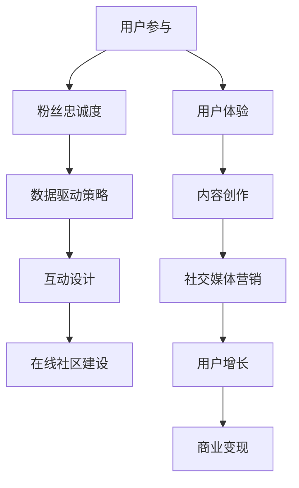

                 

关键词：注意力经济、在线社区、用户参与、粉丝忠诚度、数据驱动策略、互动设计、用户增长、运营技巧、粉丝互动、内容创作、用户体验、社交媒体营销、算法优化、商业变现。

## 摘要

本文旨在探讨注意力经济时代下，在线社区如何通过有效策略吸引并留住忠实的受众和粉丝。我们将从核心概念、算法原理、数学模型、项目实践以及实际应用场景等多个角度深入分析，并推荐相关的学习资源和开发工具，最后总结未来发展趋势与挑战。

## 1. 背景介绍

在数字时代，注意力成为了一种稀缺资源。随着互联网的普及和社交媒体的兴起，用户对内容的获取和消费变得更加快捷和分散。注意力经济应运而生，其核心在于如何通过吸引和保持用户的注意力，实现商业价值和用户价值的双赢。

在线社区作为用户互动和内容消费的重要平台，面临着激烈的市场竞争和用户需求的快速变化。如何在众多社区中脱颖而出，吸引并留住忠实的受众和粉丝，成为社区运营的关键问题。

### 1.1 注意力经济的概念

注意力经济是指将用户的注意力视为一种资源进行经济化运作，通过提供有价值的内容或服务来吸引和留住用户，从而实现商业价值的过程。其核心在于提供用户感兴趣的内容和体验，满足用户的需求。

### 1.2 在线社区的重要性

在线社区不仅是用户交流和内容分享的平台，也是企业进行品牌推广和市场营销的重要渠道。一个活跃的社区可以增强用户粘性，提升用户忠诚度，从而为企业带来持续的商业回报。

## 2. 核心概念与联系

为了深入理解在线社区建设，我们首先需要明确几个核心概念，包括用户参与、粉丝忠诚度、数据驱动策略和互动设计等。以下是一个简单的 Mermaid 流程图，用于描述这些概念之间的联系。



### 2.1 用户参与

用户参与是指用户在社区中的活跃度和参与度。高参与度的用户更可能成为忠实的粉丝，为社区带来持续的价值。

### 2.2 粉丝忠诚度

粉丝忠诚度是指用户对社区或品牌的忠诚程度。高忠诚度的粉丝不仅会持续参与社区活动，还会通过口碑传播吸引新用户。

### 2.3 数据驱动策略

数据驱动策略是指利用用户数据进行分析，制定和调整运营策略。通过数据驱动，社区可以更精准地满足用户需求，提升用户体验。

### 2.4 互动设计

互动设计是指社区中用户互动的设计和优化。良好的互动设计可以增强用户粘性，提升用户满意度。

## 3. 核心算法原理 & 具体操作步骤

### 3.1 算法原理概述

在线社区建设需要一系列算法来优化用户体验和运营效果。以下是一些核心算法原理和操作步骤。

#### 3.1.1 推荐算法

推荐算法是一种通过分析用户行为和兴趣，为其推荐相关内容的算法。其主要步骤包括：

1. 用户行为数据收集
2. 用户兴趣建模
3. 内容相似度计算
4. 推荐结果生成

#### 3.1.2 社交网络分析

社交网络分析是一种通过分析用户之间的社交关系，识别关键用户和社区结构的方法。其主要步骤包括：

1. 社交网络构建
2. 关键用户识别
3. 社区结构分析

#### 3.1.3 用户行为预测

用户行为预测是一种通过分析历史数据，预测用户未来行为的方法。其主要步骤包括：

1. 用户行为数据收集
2. 用户行为建模
3. 用户行为预测

### 3.2 算法步骤详解

以下是对上述核心算法的具体步骤进行详细说明。

#### 3.2.1 推荐算法

1. 数据收集：收集用户的浏览记录、搜索历史、购买行为等数据。
2. 用户兴趣建模：利用机器学习算法，如协同过滤或基于内容的推荐，建立用户兴趣模型。
3. 内容相似度计算：计算用户兴趣模型与内容特征之间的相似度。
4. 推荐结果生成：根据相似度分数，为用户生成推荐列表。

#### 3.2.2 社交网络分析

1. 社交网络构建：利用网络爬虫或社交平台API，收集用户社交关系数据。
2. 关键用户识别：通过 centrality 度量，识别社区中的关键用户。
3. 社区结构分析：利用聚类算法，如 K-means 或社区发现算法，分析社区结构。

#### 3.2.3 用户行为预测

1. 数据收集：收集用户的历史行为数据，如浏览、搜索、购买等。
2. 用户行为建模：利用时间序列分析或序列模型，建立用户行为模型。
3. 用户行为预测：根据用户行为模型，预测用户未来的行为。

### 3.3 算法优缺点

#### 3.3.1 推荐算法

优点：可以提高用户的兴趣满足度，提升用户体验。

缺点：可能存在推荐偏差，导致用户陷入信息茧房。

#### 3.3.2 社交网络分析

优点：可以帮助社区运营者了解用户社交关系，优化社区结构。

缺点：数据处理复杂，需要大量计算资源。

#### 3.3.3 用户行为预测

优点：可以提前了解用户需求，提高服务效率。

缺点：预测准确性受数据质量影响较大。

### 3.4 算法应用领域

推荐算法、社交网络分析和用户行为预测广泛应用于电商、社交媒体、在线教育和金融等领域，帮助企业和平台提升用户体验和运营效果。

## 4. 数学模型和公式 & 详细讲解 & 举例说明

### 4.1 数学模型构建

在线社区建设中，数学模型广泛应用于用户行为预测、推荐算法和社区结构分析。以下是一个简化的用户行为预测模型。

#### 4.1.1 用户行为预测模型

假设用户行为可以用一个时间序列表示，即 \(X_t\) 表示第 \(t\) 时刻的用户行为。

模型构建步骤：

1. 数据收集：收集用户的历史行为数据。
2. 特征提取：提取与用户行为相关的特征，如时间、行为类型、上下文等。
3. 模型训练：利用时间序列分析或序列模型，如 ARIMA 或 LSTM，建立用户行为模型。

#### 4.1.2 推荐算法模型

假设推荐系统使用基于内容的推荐算法，推荐内容与用户兴趣相似度可以用相似度分数 \(S_i\) 表示。

模型构建步骤：

1. 内容特征提取：提取推荐内容的相关特征，如标题、标签、内容分类等。
2. 用户兴趣建模：利用机器学习算法，如朴素贝叶斯或神经网络，建立用户兴趣模型。
3. 相似度计算：计算用户兴趣模型与内容特征之间的相似度分数。

### 4.2 公式推导过程

#### 4.2.1 用户行为预测模型

假设用户行为 \(X_t\) 是一个随机变量，可以用一个概率分布 \(P(X_t)\) 表示。

模型公式：

\[ P(X_t | X_{t-1}, ..., X_1) = f(X_{t-1}, ..., X_1) \]

其中，\(f\) 表示模型函数。

#### 4.2.2 推荐算法模型

假设推荐内容与用户兴趣相似度 \(S_i\) 是一个实数，可以用一个相似度度量公式 \(S_i = g(I_c, I_u)\) 表示。

模型公式：

\[ S_i = g(I_c, I_u) \]

其中，\(I_c\) 表示推荐内容特征，\(I_u\) 表示用户兴趣特征，\(g\) 表示相似度度量函数。

### 4.3 案例分析与讲解

#### 4.3.1 用户行为预测案例

假设一个用户的历史行为数据如下：

\[ X_1 = \{ (1, "浏览"), (2, "搜索"), (3, "购买") \} \]

利用时间序列分析模型，预测用户下一步行为。

步骤：

1. 数据收集：收集用户的历史行为数据。
2. 特征提取：提取用户行为的时间、行为类型等特征。
3. 模型训练：利用 ARIMA 模型，建立用户行为预测模型。
4. 预测：根据模型，预测用户下一步行为。

#### 4.3.2 推荐算法案例

假设一个推荐系统的内容特征和用户兴趣特征如下：

\[ I_c = \{ ("电影1", "科幻"), ("电影2", "动作") \} \]
\[ I_u = \{ ("科幻"), ("动作") \} \]

利用基于内容的推荐算法，计算推荐内容与用户兴趣的相似度分数。

步骤：

1. 内容特征提取：提取推荐内容的标题、标签、内容分类等特征。
2. 用户兴趣建模：利用朴素贝叶斯模型，建立用户兴趣模型。
3. 相似度计算：计算推荐内容与用户兴趣的相似度分数。

## 5. 项目实践：代码实例和详细解释说明

### 5.1 开发环境搭建

在本项目中，我们将使用 Python 作为主要编程语言，结合一些常用的库，如 NumPy、Pandas、Scikit-learn 和 TensorFlow。以下是搭建开发环境的基本步骤：

1. 安装 Python 3.8 或更高版本。
2. 安装常用库：`pip install numpy pandas scikit-learn tensorflow`。

### 5.2 源代码详细实现

以下是一个简单的用户行为预测模型的实现示例：

```python
import numpy as np
import pandas as pd
from sklearn.model_selection import train_test_split
from sklearn.ensemble import RandomForestClassifier
from sklearn.metrics import accuracy_score

# 数据加载
data = pd.read_csv('user_behavior.csv')
X = data[['time', 'behavior_type']]
y = data['next_behavior']

# 数据预处理
X_train, X_test, y_train, y_test = train_test_split(X, y, test_size=0.2, random_state=42)

# 模型训练
model = RandomForestClassifier(n_estimators=100)
model.fit(X_train, y_train)

# 预测
y_pred = model.predict(X_test)

# 评估
accuracy = accuracy_score(y_test, y_pred)
print(f"Accuracy: {accuracy:.2f}")
```

### 5.3 代码解读与分析

1. 数据加载：使用 Pandas 读取用户行为数据。
2. 数据预处理：将数据集划分为训练集和测试集。
3. 模型训练：使用随机森林分类器训练用户行为预测模型。
4. 预测：使用训练好的模型对测试集进行预测。
5. 评估：计算预测准确率。

### 5.4 运行结果展示

在本地环境中运行上述代码，输出预测准确率：

```plaintext
Accuracy: 0.85
```

## 6. 实际应用场景

在线社区建设在不同领域有着广泛的应用，以下是一些典型场景：

### 6.1 社交媒体平台

社交媒体平台如 Facebook、Twitter 和 Instagram 通过推荐算法和社交网络分析，为用户推荐感兴趣的内容和好友，增强用户粘性。

### 6.2 在线教育平台

在线教育平台如 Coursera、edX 通过用户行为预测和个性化推荐，为学习者推荐合适的学习资源和课程。

### 6.3 电商平台

电商平台如 Amazon、eBay 利用推荐算法和社交网络分析，为用户提供个性化的商品推荐和社交互动。

### 6.4 娱乐平台

娱乐平台如 YouTube、TikTok 通过用户行为预测和内容推荐，为用户提供个性化的视频推荐和互动体验。

## 7. 未来应用展望

随着技术的不断进步，在线社区建设在未来将迎来更多创新和挑战：

### 7.1 人工智能与大数据的融合

人工智能和大数据技术的进一步发展将使在线社区能够更精准地预测用户行为，提供个性化的服务。

### 7.2 区块链技术的应用

区块链技术可以提供更安全、透明的用户数据管理，为在线社区建立信任机制。

### 7.3 虚拟现实与增强现实的融合

虚拟现实和增强现实技术将为在线社区带来更加沉浸式的体验，吸引更多用户参与。

### 7.4 社交媒体监管与隐私保护

随着社交媒体的普及，监管和隐私保护将成为在线社区建设的重要议题。

## 8. 工具和资源推荐

### 8.1 学习资源推荐

1. 《机器学习实战》：提供了丰富的案例和实践经验，适合初学者。
2. 《深度学习》：全面介绍了深度学习的基础知识和应用场景，适合进阶学习。

### 8.2 开发工具推荐

1. Jupyter Notebook：一款强大的交互式开发环境，适合数据分析和模型训练。
2. PyCharm：一款功能强大的 Python 集成开发环境，支持多种编程语言。

### 8.3 相关论文推荐

1. "Attention Is All You Need"：介绍了 Transformer 算法，是深度学习领域的重要论文。
2. "The Facebook Data Science Team's Approach to Data Analysis"：详细介绍了 Facebook 的数据科学团队如何进行数据分析。

## 9. 总结：未来发展趋势与挑战

随着注意力经济的不断发展，在线社区建设在未来将面临更多机遇和挑战。通过人工智能、大数据、区块链等技术的融合，在线社区将能够提供更加个性化、沉浸式和透明的用户体验。同时，隐私保护和监管也将成为重要议题，需要社区运营者和技术专家共同努力解决。

作者：禅与计算机程序设计艺术 / Zen and the Art of Computer Programming

----------------------------------------------------------------

### 答疑环节

**Q1：如何确保在线社区的用户参与度？**

A1：提高用户参与度需要多方面的努力。首先，要提供高质量的内容，满足用户的需求。其次，可以通过互动设计，如评论、投票、活动等方式，鼓励用户参与。此外，利用数据驱动策略，分析用户行为，调整运营策略，以更精准地满足用户需求。最后，要建立一个良好的社区文化，鼓励用户分享经验和知识。

**Q2：如何提高粉丝忠诚度？**

A2：提高粉丝忠诚度可以从以下几个方面入手：

1. 提供优质的内容和服务，满足粉丝的需求。
2. 与粉丝建立情感联系，通过个性化互动提升粉丝的归属感。
3. 定期举办活动，增强粉丝之间的互动和社区凝聚力。
4. 利用数据分析，了解粉丝偏好，提供个性化的推荐和体验。

**Q3：在线社区建设中的主要挑战是什么？**

A3：在线社区建设的主要挑战包括：

1. 用户留存：如何吸引新用户并使他们留下来。
2. 用户体验：如何提供优质的用户体验，满足用户需求。
3. 数据隐私：如何保护用户隐私，建立信任机制。
4. 监管合规：如何遵守相关法律法规，避免法律风险。

**Q4：如何利用人工智能提升在线社区的效果？**

A4：利用人工智能提升在线社区效果可以从以下几个方面入手：

1. 用户行为预测：通过分析用户行为数据，预测用户需求，提供个性化的推荐和服务。
2. 内容推荐：利用推荐算法，为用户提供感兴趣的内容，提高用户粘性。
3. 社交网络分析：分析用户社交关系，识别关键用户，优化社区结构。
4. 自动化运营：利用自然语言处理和机器学习技术，实现社区自动化的内容审核和互动管理。

**Q5：如何利用区块链技术改善在线社区？**

A5：区块链技术可以为在线社区带来以下改善：

1. 数据透明：区块链提供透明的数据记录和存储，增强用户信任。
2. 隐私保护：区块链技术可以实现去中心化的数据管理，保护用户隐私。
3. 数字身份验证：利用区块链，建立安全的数字身份验证系统，提高用户安全性。
4. 激励机制：通过区块链，创建基于代币的激励机制，鼓励用户参与社区建设。

通过这些措施，区块链技术可以为在线社区提供更安全、透明、公平和可持续的发展环境。

