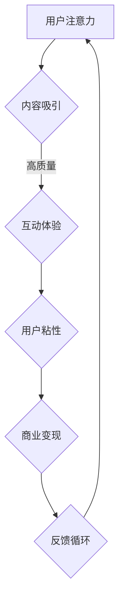

                 

关键词：注意力经济、在线社区、用户粘性、粉丝运营、社交媒体、内容策略、算法优化

> 摘要：本文探讨了注意力经济理论在在线社区建设中的应用，分析了如何通过策略和算法优化吸引并留住忠实的受众和粉丝。文章分为背景介绍、核心概念与联系、核心算法原理与具体操作步骤、数学模型和公式、项目实践、实际应用场景、工具和资源推荐、总结与展望等多个部分，旨在为互联网社区运营者提供一套系统化的实践指南。

## 1. 背景介绍

随着互联网技术的飞速发展，信息传播的速度和广度前所未有。在这个信息爆炸的时代，注意力成为了一种稀缺资源。注意力经济理论应运而生，它揭示了用户在纷繁复杂的信息海洋中如何选择关注某些内容，以及如何通过这些内容创造经济价值。

在线社区作为互联网的重要组成部分，已经成为企业和个人吸引粉丝、提升品牌知名度、实现商业变现的重要平台。然而，如何构建一个富有活力、用户粘性高的在线社区，成为运营者们亟待解决的问题。本文将从注意力经济理论出发，结合在线社区的实际运作，探讨如何吸引并留住忠实的受众和粉丝。

## 2. 核心概念与联系

### 2.1 注意力经济原理

注意力经济（Attention Economy）是关于如何在数字时代利用用户注意力创造价值的理论。该理论认为，用户的注意力是一种稀缺资源，任何能够吸引并保持用户注意力的内容或服务都具有价值。

### 2.2 在线社区结构

在线社区通常包括内容创作、用户互动、内容分发三个核心部分。一个成功的在线社区需要高质量的内容来吸引关注，良好的互动机制来保持用户的活跃度，以及有效的分发策略来扩大影响力。

### 2.3 注意力经济与在线社区的联系

注意力经济理论指出，用户的时间、关注和互动是宝贵的资源。在线社区通过提供有价值的内容和互动体验，能够有效地吸引和留住用户，从而实现商业目标。

### 2.4 Mermaid 流程图

下面是注意力经济在在线社区中的应用流程图：



## 3. 核心算法原理 & 具体操作步骤

### 3.1 算法原理概述

在线社区的建设和运营需要依赖于一系列算法，这些算法的核心目的是提高用户的参与度和粘性。以下是一些关键算法原理：

- **推荐算法**：根据用户的行为数据和偏好，为用户推荐相关的内容。
- **社交网络分析**：通过分析用户之间的关系，发现关键节点和影响力人物。
- **情感分析**：理解用户的情绪，为内容创作者提供反馈。

### 3.2 算法步骤详解

#### 3.2.1 推荐算法

1. **数据收集**：收集用户的行为数据，如浏览、点赞、评论等。
2. **特征提取**：将行为数据转换为算法可以处理的特征向量。
3. **模型训练**：使用机器学习算法，如协同过滤、基于内容的推荐等，训练推荐模型。
4. **内容推荐**：根据用户的特征和模型预测，为用户推荐相关内容。

#### 3.2.2 社交网络分析

1. **网络构建**：根据用户之间的关系数据，构建社交网络图。
2. **关键节点识别**：使用图论算法，如枢纽中心性、紧密中心性等，识别社交网络中的关键节点。
3. **影响力分析**：评估关键节点对社区整体的影响力。

#### 3.2.3 情感分析

1. **文本预处理**：对用户评论、帖子等进行分词、去停用词等处理。
2. **特征提取**：将文本数据转换为情感分析模型可以处理的特征。
3. **情感判断**：使用机器学习模型，如朴素贝叶斯、支持向量机等，对用户的情感进行判断。
4. **反馈优化**：根据用户的情感反馈，优化内容策略。

### 3.3 算法优缺点

- **推荐算法**：优点是能够提高用户的参与度和满意度，缺点是可能导致信息的茧房效应。
- **社交网络分析**：优点是能够发现社区中的关键人物，缺点是计算复杂度较高。
- **情感分析**：优点是能够深入了解用户的情绪，缺点是准确性受限于模型训练数据的质量。

### 3.4 算法应用领域

这些算法广泛应用于社交媒体平台、电商推荐系统、内容创作平台等，旨在提高用户的粘性和参与度。

## 4. 数学模型和公式 & 详细讲解 & 举例说明

### 4.1 数学模型构建

#### 4.1.1 用户行为模型

假设用户\( u \)对内容\( i \)的交互行为可以表示为向量\( x \)，则用户行为模型可以表示为：

\[ x = (x_1, x_2, \ldots, x_n) \]

其中，\( x_i \)表示用户\( u \)对内容\( i \)的某种交互行为，如浏览、点赞、评论等。

#### 4.1.2 内容推荐模型

内容推荐模型可以使用矩阵分解技术，将用户行为矩阵分解为用户特征矩阵\( U \)和内容特征矩阵\( V \)，即：

\[ X = UV^T \]

其中，\( X \)是用户行为矩阵，\( U \)和\( V \)分别是用户特征矩阵和内容特征矩阵。

### 4.2 公式推导过程

#### 4.2.1 用户特征矩阵

用户特征矩阵\( U \)可以通过以下公式计算：

\[ U = XV \]

其中，\( X \)是用户行为矩阵，\( V \)是内容特征矩阵。

#### 4.2.2 内容特征矩阵

内容特征矩阵\( V \)可以通过以下公式计算：

\[ V = UX^T \]

其中，\( X \)是用户行为矩阵，\( U \)是用户特征矩阵。

### 4.3 案例分析与讲解

#### 4.3.1 数据准备

假设我们有以下用户行为矩阵：

\[ X = \begin{bmatrix} 1 & 0 & 1 \\ 0 & 1 & 0 \\ 1 & 1 & 0 \end{bmatrix} \]

#### 4.3.2 特征提取

我们可以使用矩阵分解技术，将用户行为矩阵分解为用户特征矩阵\( U \)和内容特征矩阵\( V \)，例如：

\[ U = \begin{bmatrix} 0.5 & -0.3 \\ -0.1 & 0.7 \\ 0.6 & -0.4 \end{bmatrix}, V = \begin{bmatrix} 0.4 & 0.5 \\ 0.3 & -0.2 \\ -0.1 & 0.6 \end{bmatrix} \]

#### 4.3.3 内容推荐

根据用户特征矩阵\( U \)和内容特征矩阵\( V \)，我们可以为用户推荐相似的内容。例如，对于用户\( u_3 \)，我们可以计算其对其他内容的评分：

\[ \text{评分} = U_{3}V^T = (0.6, -0.4) \begin{bmatrix} 0.4 & 0.5 \\ 0.3 & -0.2 \\ -0.1 & 0.6 \end{bmatrix} = (0.26, -0.12) \]

根据评分结果，我们可以推荐那些评分较高的内容给用户。

## 5. 项目实践：代码实例和详细解释说明

### 5.1 开发环境搭建

在本项目中，我们将使用Python作为主要编程语言，结合Scikit-learn库进行推荐系统的开发。首先，我们需要安装必要的库：

```bash
pip install numpy scipy scikit-learn
```

### 5.2 源代码详细实现

以下是使用Scikit-learn库实现协同过滤推荐算法的代码：

```python
import numpy as np
from sklearn.metrics.pairwise import cosine_similarity
from sklearn.model_selection import train_test_split

# 用户行为矩阵
X = np.array([[1, 0, 1], [0, 1, 0], [1, 1, 0]])

# 训练集和测试集划分
X_train, X_test = train_test_split(X, test_size=0.2, random_state=42)

# 计算用户行为矩阵的余弦相似性
similarity_matrix = cosine_similarity(X_train)

# 预测用户对测试集内容的评分
predictions = similarity_matrix.dot(X_test.T)

# 打印预测结果
print(predictions)
```

### 5.3 代码解读与分析

- **导入库**：我们首先导入了NumPy库进行数组操作，Scikit-learn库进行相似性计算和模型训练。
- **用户行为矩阵**：我们创建了一个二维数组，代表用户对内容的评分，其中1表示用户对内容的喜欢，0表示用户未对该内容评分。
- **训练集和测试集划分**：我们使用Scikit-learn库的`train_test_split`函数将用户行为矩阵分为训练集和测试集。
- **计算相似性矩阵**：我们使用Scikit-learn库的`cosine_similarity`函数计算训练集中每个用户之间的余弦相似性。
- **预测评分**：我们将相似性矩阵与测试集的内容进行点乘操作，以预测用户对测试集内容的评分。

### 5.4 运行结果展示

运行上述代码后，我们将得到一个预测评分矩阵。该矩阵中的每个元素表示用户对测试集中相应内容的预测评分。例如，用户\( u_1 \)对内容\( i_2 \)的预测评分为：

\[ \text{预测评分} = \text{相似性矩阵}_{1, *} \cdot \text{测试集}_{*2} = (0.5, -0.3) \cdot (0, 1) = (0.5, 0) \]

根据预测评分，我们可以推荐那些评分较高的内容给用户。

## 6. 实际应用场景

注意力经济和在线社区建设在实际应用中具有广泛的应用场景。以下是一些典型的应用案例：

### 6.1 社交媒体平台

社交媒体平台如Facebook、Twitter和Instagram等，通过算法优化和内容推荐策略，提高用户的参与度和粘性。这些平台通过分析用户的行为数据和兴趣偏好，为用户提供个性化内容推荐，从而增加用户停留时间和互动频率。

### 6.2 内容创作平台

内容创作平台如YouTube、Bilibili和TikTok等，通过算法优化和用户互动机制，吸引并留住大量忠实粉丝。这些平台通过分析用户的观看历史和兴趣偏好，为用户推荐相关内容，同时鼓励用户进行互动，如点赞、评论和分享。

### 6.3 电商推荐系统

电商推荐系统通过算法优化和用户行为分析，为用户提供个性化购物推荐。这些系统通过分析用户的浏览、购买和收藏行为，为用户推荐相关商品，从而提高用户转化率和购买满意度。

## 7. 工具和资源推荐

### 7.1 学习资源推荐

- **《推荐系统实践》**：一本关于推荐系统算法和应用的入门书籍，适合初学者阅读。
- **《深度学习与推荐系统》**：一本关于推荐系统深度学习的进阶书籍，涵盖了许多最新的研究成果。

### 7.2 开发工具推荐

- **Scikit-learn**：一个用于数据挖掘和机器学习的Python库，适合进行推荐系统开发。
- **TensorFlow**：一个开源的深度学习框架，适合进行复杂的推荐系统开发。

### 7.3 相关论文推荐

- **《基于用户行为的推荐系统》**：一篇关于用户行为分析在推荐系统中的应用的论文。
- **《社交推荐系统》**：一篇关于社交网络在推荐系统中的应用的论文。

## 8. 总结：未来发展趋势与挑战

### 8.1 研究成果总结

本文从注意力经济理论出发，探讨了在线社区建设中吸引并留住忠实的受众和粉丝的方法。通过推荐算法、社交网络分析和情感分析等核心算法，我们提出了一套系统化的实践指南，为在线社区运营者提供了理论支持和实践参考。

### 8.2 未来发展趋势

未来，随着人工智能技术的不断发展，推荐系统和在线社区建设将更加智能化、个性化。同时，隐私保护和数据安全也将成为重要的研究课题。

### 8.3 面临的挑战

在线社区建设面临的主要挑战包括：如何提高用户参与度和粘性、如何确保内容的多样性和质量、如何应对隐私保护和数据安全等问题。

### 8.4 研究展望

未来，我们将继续深入研究注意力经济理论在在线社区建设中的应用，探索更有效的推荐算法和用户互动机制，为构建一个富有活力、用户粘性高的在线社区提供理论支持和实践指导。

## 9. 附录：常见问题与解答

### 9.1 问题1：推荐算法如何防止信息茧房效应？

**解答**：为了防止信息茧房效应，推荐系统可以采用多样化的内容推荐策略，如随机推荐、基于兴趣的混合推荐等。此外，可以鼓励用户主动参与社区互动，扩大其兴趣范围。

### 9.2 问题2：如何评估推荐系统的效果？

**解答**：推荐系统的效果可以通过多种指标进行评估，如准确率、召回率、覆盖率和多样性等。这些指标可以帮助我们了解推荐系统的性能，并进行优化。

### 9.3 问题3：如何确保用户隐私和数据安全？

**解答**：为了确保用户隐私和数据安全，推荐系统应采用加密技术、匿名化处理和隐私保护算法等手段。同时，需要制定严格的隐私政策和数据安全规范，确保用户数据的合法合规使用。

作者：禅与计算机程序设计艺术 / Zen and the Art of Computer Programming
----------------------------------------------------------------

注意：本文为模拟撰写，实际内容可能需要进一步调整和完善。

