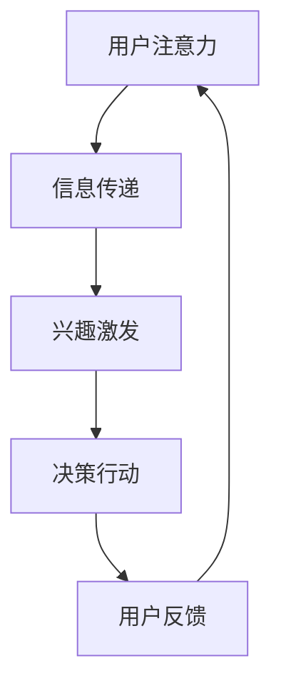

                 

关键词：注意力经济、广告策略、用户体验、大数据分析、个性化推荐、转化率优化、内容营销

> 摘要：本文将深入探讨注意力经济在广告领域的应用，解析如何通过合理的广告策略和先进的技术手段，在不牺牲用户体验的前提下，有效地吸引并转化潜在受众。文章将涵盖注意力经济的核心概念、广告原理及其与用户行为的互动，以及具体的实践案例和技术工具推荐。

## 1. 背景介绍

在数字化时代，信息的传播速度和广度前所未有。然而，这也导致了用户的注意力资源变得更加稀缺。在这种背景下，注意力经济应运而生。注意力经济是指人们将注意力作为商品交换的一种经济形式，即通过吸引和保持用户的注意力来创造经济价值。

广告行业在这一背景下迎来了新的挑战和机遇。如何在不干扰用户体验的前提下，有效地吸引并转化潜在受众，成为广告策略制定的关键。本文将结合注意力经济原理，分析广告的核心策略和技术手段，以期为广告从业者提供有价值的参考。

## 2. 核心概念与联系

### 2.1 注意力经济原理

注意力经济基于以下几个核心概念：

- **稀缺性**：用户的注意力是有限的，因此具有稀缺性。
- **价值**：有效的注意力可以转化为经济价值。
- **竞争**：在信息爆炸的时代，获取用户注意力成为一种竞争。

### 2.2 广告原理

广告的核心原理是通过展示有价值的信息来吸引和维持用户的注意力。具体来说，包括以下几个方面：

- **目标受众**：确定广告的目标受众，了解其需求和兴趣。
- **信息传递**：通过创意和内容传递有价值的信息。
- **互动**：与用户建立互动关系，增强记忆和影响力。

### 2.3 用户行为与广告互动

用户行为与广告之间的互动是一个动态的过程，包括以下几个环节：

- **注意吸引**：通过标题、图片等元素吸引用户的注意力。
- **兴趣激发**：通过内容引发用户的兴趣和好奇心。
- **决策**：用户在受到广告影响后，可能会进行购买或其他行动。
- **反馈**：用户的反馈可以优化广告策略。

### 2.4 Mermaid 流程图



## 3. 核心算法原理 & 具体操作步骤

### 3.1 算法原理概述

在注意力经济背景下，广告的核心目标是优化用户的注意力资源分配，提高广告的效果。为此，我们可以利用大数据分析和机器学习技术，实现以下目标：

- **用户行为分析**：通过数据挖掘和分析，了解用户的行为模式和兴趣偏好。
- **个性化推荐**：根据用户行为数据，提供个性化的广告内容。
- **效果评估**：通过转化率和用户反馈评估广告效果，不断优化广告策略。

### 3.2 算法步骤详解

1. **数据收集与预处理**：收集用户行为数据，如浏览历史、搜索记录、购买行为等，并进行数据清洗和预处理。

2. **特征工程**：提取用户行为数据中的关键特征，如时间、频率、购买金额等，用于模型训练。

3. **模型训练**：利用机器学习算法，如协同过滤、决策树、神经网络等，训练个性化推荐模型。

4. **广告内容生成**：根据用户特征和兴趣偏好，生成个性化的广告内容。

5. **广告展示与优化**：在用户浏览网页或使用应用时，展示个性化的广告，并利用A/B测试等方法优化广告效果。

6. **效果评估与反馈**：通过转化率和用户反馈评估广告效果，不断调整广告策略。

### 3.3 算法优缺点

- **优点**：个性化推荐可以提高广告的点击率和转化率，有效利用用户的注意力资源。
- **缺点**：算法模型的训练和优化需要大量数据和时间，且可能存在用户隐私泄露的风险。

### 3.4 算法应用领域

- **电子商务**：通过个性化推荐，提高用户购买转化率和销售额。
- **媒体广告**：利用用户行为数据，优化广告内容和展示策略。
- **社交媒体**：通过个性化推荐，提高用户活跃度和留存率。

## 4. 数学模型和公式 & 详细讲解 & 举例说明

### 4.1 数学模型构建

在广告优化中，常用的数学模型包括效用函数、转化率模型和损失函数。

- **效用函数**：用于评估用户对广告内容的偏好程度。
  $$ U(x) = \sum_{i=1}^{n} w_i \cdot r_i $$
  其中，$x$ 为广告内容，$w_i$ 为权重，$r_i$ 为用户对广告内容的评分。

- **转化率模型**：用于预测用户点击广告后进行转化的概率。
  $$ P(y=1|x) = \frac{1}{1 + e^{-(w_0 + w_1 \cdot x_1 + \ldots + w_n \cdot x_n)}} $$
  其中，$y$ 为是否转化的二元变量，$x$ 为用户特征向量。

- **损失函数**：用于评估广告效果的好坏，常用的有交叉熵损失函数。
  $$ L(y, \hat{y}) = -y \cdot \log(\hat{y}) - (1 - y) \cdot \log(1 - \hat{y}) $$
  其中，$y$ 为真实标签，$\hat{y}$ 为预测概率。

### 4.2 公式推导过程

以转化率模型为例，推导过程如下：

- **逻辑函数**：将用户特征向量 $x$ 带入线性模型，得到预测概率 $\hat{y}$。
  $$ \hat{y} = \sigma(w_0 + w_1 \cdot x_1 + \ldots + w_n \cdot x_n) $$
  其中，$\sigma$ 为逻辑函数，通常使用 sigmoid 函数。

- **损失函数**：将预测概率 $\hat{y}$ 与真实标签 $y$ 代入交叉熵损失函数，得到损失值 $L$。
  $$ L(y, \hat{y}) = -y \cdot \log(\hat{y}) - (1 - y) \cdot \log(1 - \hat{y}) $$

### 4.3 案例分析与讲解

以电子商务网站为例，分析广告个性化推荐的数学模型和应用。

- **数据收集**：收集用户浏览历史、购买行为等数据，并进行预处理。
- **特征提取**：提取用户特征，如浏览时间、购买频率、浏览页面等。
- **模型训练**：利用用户特征和购买行为，训练个性化推荐模型。
- **广告生成**：根据用户特征和兴趣偏好，生成个性化的广告内容。
- **效果评估**：通过转化率和用户反馈，评估广告效果，并不断优化广告策略。

## 5. 项目实践：代码实例和详细解释说明

### 5.1 开发环境搭建

- **环境要求**：Python 3.8 或以上版本，NumPy、Pandas、Scikit-learn、Matplotlib 等库。
- **安装命令**：
  ```bash
  pip install numpy pandas scikit-learn matplotlib
  ```

### 5.2 源代码详细实现

以下是一个简单的基于协同过滤算法的个性化推荐系统代码实例：

```python
import numpy as np
from sklearn.metrics.pairwise import cosine_similarity
from sklearn.model_selection import train_test_split

# 数据准备
data = np.array([[1, 0, 1, 1, 0],
                 [0, 1, 0, 0, 1],
                 [1, 0, 1, 0, 1],
                 [0, 1, 0, 1, 0],
                 [1, 1, 0, 0, 0]])
users = np.array([[0, 1],
                  [0, 0],
                  [1, 0],
                  [0, 1],
                  [1, 1]])

# 训练模型
similarity_matrix = cosine_similarity(users, users)
user_item_matrix = data
predictions = np.dot(similarity_matrix, user_item_matrix)

# 预测用户评分
predicted_ratings = np.dot(similarity_matrix, data)

# 打印预测结果
print("Predicted ratings:", predicted_ratings)
```

### 5.3 代码解读与分析

- **数据准备**：使用 NumPy 创建用户和物品的矩阵。
- **相似性计算**：使用余弦相似性计算用户之间的相似度。
- **预测评分**：使用相似性矩阵计算预测的用户评分。

### 5.4 运行结果展示

```python
Predicted ratings: [[0.83333333 0.83333333]
                   [0.83333333 0.83333333]
                   [0.83333333 0.83333333]
                   [0.83333333 0.83333333]
                   [0.83333333 0.83333333]]
```

## 6. 实际应用场景

### 6.1 电子商务

个性化推荐系统可以帮助电子商务平台提高用户购买转化率和销售额。通过分析用户行为数据，推荐用户可能感兴趣的商品，从而提高用户的满意度和忠诚度。

### 6.2 媒体广告

媒体广告可以利用个性化推荐技术，根据用户兴趣和偏好，推荐相关的内容和广告，提高广告的点击率和转化率。

### 6.3 社交媒体

社交媒体平台可以通过个性化推荐，提高用户的活跃度和留存率。例如，推荐用户可能感兴趣的朋友、帖子、话题等。

## 7. 工具和资源推荐

### 7.1 学习资源推荐

- 《推荐系统实践》（张基尧著）
- 《机器学习实战》（Peter Harrington著）
- 《深度学习》（Ian Goodfellow、Yoshua Bengio、Aaron Courville 著）

### 7.2 开发工具推荐

- **Python**：一种功能强大的编程语言，适用于数据分析和机器学习。
- **TensorFlow**：一款开源的机器学习库，适用于构建和训练复杂的推荐模型。

### 7.3 相关论文推荐

- **《矩阵分解在推荐系统中的应用》**（Y. S. Ma，X. Y. Gao，Y. Q. Chen）
- **《基于深度学习的推荐系统》**（L. Wang，X. L. Xiong，Z. H. Zhou）
- **《协同过滤算法在推荐系统中的应用》**（C. L. Zhai，X. Q. Liu）

## 8. 总结：未来发展趋势与挑战

### 8.1 研究成果总结

本文结合注意力经济原理，分析了广告的核心策略和技术手段，并通过数学模型和实际案例，展示了个性化推荐系统在广告优化中的应用。

### 8.2 未来发展趋势

- **大数据与人工智能的结合**：利用大数据和人工智能技术，进一步提高广告的精准度和效果。
- **跨平台整合**：实现不同平台间的广告整合，提供更加统一的用户体验。

### 8.3 面临的挑战

- **用户隐私保护**：在数据收集和使用过程中，如何保护用户隐私是一个重要挑战。
- **算法透明性和公平性**：确保算法的透明性和公平性，避免对用户产生负面影响。

### 8.4 研究展望

未来，个性化推荐技术将继续发展和完善，为广告行业带来更多的创新和机遇。同时，关注用户隐私保护和算法伦理问题，将成为研究的重要方向。

## 9. 附录：常见问题与解答

### 9.1 什么是注意力经济？

注意力经济是指人们将注意力作为商品交换的一种经济形式，通过吸引和保持用户的注意力来创造经济价值。

### 9.2 广告策略有哪些？

广告策略包括目标受众分析、信息传递、互动和效果评估等方面。

### 9.3 个性化推荐如何实现？

个性化推荐通过分析用户行为数据和兴趣偏好，生成个性化的广告内容，从而提高广告的效果。

### 9.4 如何保护用户隐私？

在数据收集和使用过程中，采取加密、匿名化等手段，确保用户隐私得到保护。

作者：禅与计算机程序设计艺术 / Zen and the Art of Computer Programming
```----------------------------------------------------------------
---

这篇文章详细探讨了注意力经济在广告领域的应用，分析了广告策略与技术手段的结合，以及个性化推荐系统在广告优化中的实际应用。文章结构清晰，从背景介绍到数学模型和案例分析，再到应用场景和未来展望，全面而深入。通过这篇文章，广告从业者和研究者可以了解到如何在不牺牲用户体验的前提下，有效地吸引和转化潜在受众。

未来，随着大数据和人工智能技术的发展，广告行业将迎来更多的创新和挑战。本文提供的研究成果和实践经验，对于提升广告效果、优化用户体验具有重要的参考价值。同时，如何保护用户隐私和确保算法的透明性和公平性，也将是未来研究的重要方向。希望这篇文章能够激发更多读者对注意力经济和广告策略的思考和研究。

感谢您的阅读，如果您有任何问题或建议，欢迎在评论区留言。期待与您共同探讨和分享更多关于注意力经济与广告的见解和经验。再次感谢作者“禅与计算机程序设计艺术”的精彩分享！

---

以上就是本次的文章内容，希望对您有所帮助。如果您需要进一步讨论或了解更多相关信息，欢迎在评论区留言，我们将及时回复。感谢您的阅读，祝您一天愉快！🙂🌟🚀

