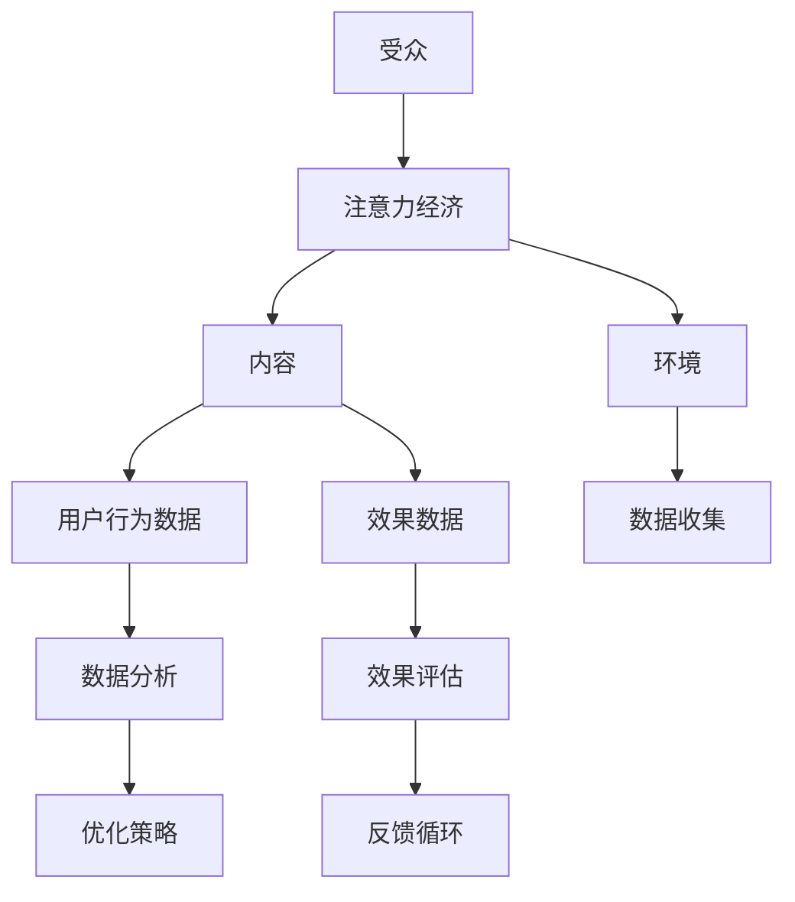

                 

关键字：注意力经济，数据分析，受众行为，用户研究，算法原理，应用领域，数学模型，项目实践，未来展望

> 摘要：本文深入探讨了注意力经济与数据分析的核心概念及其在理解受众行为中的应用。通过分析注意力经济的定义和本质，以及如何利用数据分析技术捕捉和解读用户行为，我们揭示了这一领域的关键洞见和实践方法。文章不仅提供了算法原理和具体操作步骤的详细解析，还结合实际案例和项目实践，展示了数据分析在实际应用中的强大潜力和未来发展方向。最终，本文总结了研究成果，展望了未来的发展趋势与挑战，为相关领域的研究者和从业者提供了宝贵的参考。

## 1. 背景介绍

在当今数字化时代，数据已经成为新的经济资源，如何有效利用数据成为了企业和组织关注的焦点。随着互联网的普及和技术的进步，人们接触信息的渠道日益多样，但与此同时，用户的时间和经济资源变得愈发稀缺。这种背景下，注意力经济应运而生，成为理解用户行为、优化营销策略、提升用户体验的关键。

注意力经济（Attention Economy）是指在一个信息过载的社会中，人们对于信息的关注和消耗成为一种稀缺资源。在这种经济体系中，吸引和保持用户的注意力成为企业获取收益和市场份额的关键。注意力经济不仅涵盖了用户对媒体内容的关注，还涉及社交媒体、电子商务、广告营销等多个领域。

数据分析（Data Analysis）则是在大数据时代应运而生的一门技术，通过统计学、机器学习、数据挖掘等方法，对海量数据进行处理、分析和解读，从而提取有价值的信息和洞见。数据分析技术在商业、医疗、金融等多个领域都有广泛应用，能够帮助企业更好地理解用户需求、优化业务流程、提高决策效率。

本文旨在探讨注意力经济与数据分析的深度融合，通过数据分析技术深入理解受众行为，揭示其中的关键洞见和实际应用价值。文章结构如下：

- **背景介绍**：介绍注意力经济和数据分析的基本概念及其在数字化时代的应用背景。
- **核心概念与联系**：分析注意力经济的核心概念，并使用 Mermaid 流程图展示其与数据分析的关系。
- **核心算法原理 & 具体操作步骤**：介绍注意力经济中常用的数据分析算法，包括原理、步骤和优缺点。
- **数学模型和公式 & 详细讲解 & 举例说明**：构建数学模型，推导相关公式，并举例说明。
- **项目实践：代码实例和详细解释说明**：通过实际项目实践，展示数据分析在注意力经济中的应用。
- **实际应用场景**：分析注意力经济在现实世界中的应用场景。
- **未来应用展望**：展望注意力经济和数据分析的未来发展趋势。
- **工具和资源推荐**：推荐相关学习资源、开发工具和论文。
- **总结：未来发展趋势与挑战**：总结研究成果，展望未来发展。

通过本文的探讨，我们希望为读者提供一个全面、深入的了解，帮助他们在注意力经济与数据分析领域取得更好的研究成果和实践效果。

## 2. 核心概念与联系

在深入探讨注意力经济与数据分析的融合之前，首先需要明确注意力经济的基本概念，以及其与数据分析之间的联系。

### 2.1 注意力经济的核心概念

注意力经济最初由意大利经济学家Vilfredo Pareto提出，后来由作家Jason Fried等人进一步发展。其核心观点是，在信息过载的时代，用户的注意力是一种稀缺资源，任何产品、服务或内容都需要争夺这一有限资源。

在注意力经济中，有三个关键要素：

- **受众（Audience）**：注意力经济的主体，即用户或消费者。
- **内容（Content）**：吸引受众注意的内容，如文章、视频、广告等。
- **环境（Environment）**：信息传播的渠道和平台，如互联网、社交媒体、搜索引擎等。

注意力经济中的主要活动包括：

- **获取注意力**：通过各种手段，如标题党、热点营销、广告投放等，吸引受众的关注。
- **保持注意力**：通过优质的内容、良好的用户体验等手段，让受众持续关注。
- **转化注意力**：将受众的注意力转化为商业价值，如用户注册、购买商品、广告点击等。

### 2.2 数据分析在注意力经济中的作用

数据分析在注意力经济中起着至关重要的作用，它能够帮助企业更好地理解受众行为，从而优化营销策略、提升用户体验。

- **用户行为分析**：通过数据分析，企业可以了解用户在各个平台上的行为轨迹，如点击率、停留时间、转化率等。这些数据有助于企业识别哪些内容或活动更能吸引受众的注意力。

- **需求预测**：数据分析可以帮助企业预测用户的需求和偏好，从而提前布局，制作和推广更符合受众期望的内容。

- **个性化推荐**：通过分析用户的历史行为和兴趣，数据分析技术可以为用户提供个性化的推荐，提高用户满意度和忠诚度。

- **效果评估**：数据分析可以衡量各种营销活动的效果，帮助企业了解哪些策略最有效，哪些需要改进。

### 2.3 Mermaid 流程图展示注意力经济与数据分析的关系

为了更直观地展示注意力经济与数据分析的关系，我们可以使用Mermaid流程图进行说明。以下是注意力经济与数据分析的核心流程：



在这个流程图中，受众通过内容和环境与注意力经济互动，生成用户行为数据和效果数据。这些数据通过数据分析技术进行处理，生成优化策略，并最终回到效果评估环节，形成一个闭环的反馈系统。

### 2.4 注意力经济与数据分析的融合应用

注意力经济与数据分析的融合应用，主要体现在以下几个方面：

- **内容优化**：通过数据分析，企业可以了解哪些类型的内容更能吸引受众的注意力，从而优化内容创作和推广策略。

- **用户画像**：基于数据分析，企业可以构建详细的用户画像，更好地理解用户的需求和偏好，提供个性化的服务和推荐。

- **营销效果优化**：通过数据分析，企业可以评估各种营销活动的效果，从而调整策略，提高投入产出比。

- **用户体验提升**：通过数据分析，企业可以优化产品设计和用户体验，提高用户满意度和忠诚度。

- **风险评估与管理**：通过数据分析，企业可以识别和预测潜在的风险，采取相应的管理措施。

总之，注意力经济与数据分析的结合，不仅为企业提供了新的增长点，也为用户带来了更好的体验和价值。接下来，我们将进一步探讨注意力经济中的核心算法原理和具体操作步骤。

## 3. 核心算法原理 & 具体操作步骤

在注意力经济中，数据分析技术的应用至关重要。以下我们将介绍几种核心算法，包括其原理、具体操作步骤以及优缺点。

### 3.1 算法原理概述

在注意力经济中，常用的数据分析算法主要包括以下几种：

- **用户行为分析算法**：用于分析用户在各个平台上的行为，如点击率、停留时间、转化率等。
- **聚类算法**：用于对用户行为进行分类，识别不同类型的用户群体。
- **协同过滤算法**：用于预测用户对未知内容的偏好，实现个性化推荐。
- **时间序列分析算法**：用于分析用户行为的时序特征，如趋势、季节性、周期性等。

### 3.2 算法步骤详解

以下是每种算法的具体操作步骤：

#### 3.2.1 用户行为分析算法

用户行为分析算法的基本步骤如下：

1. **数据收集**：收集用户在各个平台上的行为数据，如点击日志、浏览时长、购买记录等。
2. **数据预处理**：清洗和转换原始数据，去除噪声和不完整的数据。
3. **特征提取**：从原始数据中提取对用户行为有意义的特征，如页面访问次数、页面停留时间等。
4. **模型构建**：选择合适的模型（如线性回归、决策树等）进行训练。
5. **模型评估**：使用验证集评估模型的性能，调整参数以优化模型。
6. **应用模型**：将模型应用于新数据，预测用户的行为。

#### 3.2.2 聚类算法

聚类算法的基本步骤如下：

1. **数据收集**：收集用户行为数据，如点击日志、浏览时长、购买记录等。
2. **数据预处理**：清洗和转换原始数据，去除噪声和不完整的数据。
3. **特征提取**：从原始数据中提取对用户行为有意义的特征。
4. **选择聚类算法**：根据数据特点选择合适的聚类算法，如K-means、DBSCAN等。
5. **参数设置**：设置聚类算法的参数，如聚类中心、距离度量等。
6. **聚类执行**：执行聚类算法，生成用户群体的聚类结果。
7. **评估聚类效果**：使用评估指标（如轮廓系数、内部距离等）评估聚类结果的质量。

#### 3.2.3 协同过滤算法

协同过滤算法的基本步骤如下：

1. **数据收集**：收集用户行为数据，如评分数据、购买记录等。
2. **数据预处理**：清洗和转换原始数据，去除噪声和不完整的数据。
3. **特征提取**：提取对用户行为有意义的特征，如用户ID、项目ID等。
4. **构建用户-项目矩阵**：将用户行为数据转化为用户-项目矩阵。
5. **相似度计算**：计算用户之间的相似度，如皮尔逊相关系数、余弦相似度等。
6. **预测**：基于相似度矩阵预测用户对未知项目的评分。
7. **评估预测效果**：使用评估指标（如均方根误差、平均绝对误差等）评估预测效果。

#### 3.2.4 时间序列分析算法

时间序列分析算法的基本步骤如下：

1. **数据收集**：收集用户行为的时序数据，如点击时间、购买时间等。
2. **数据预处理**：清洗和转换原始数据，去除噪声和不完整的数据。
3. **特征提取**：从原始数据中提取时间序列特征，如时间间隔、趋势等。
4. **选择时间序列模型**：根据数据特点选择合适的时间序列模型，如ARIMA、LSTM等。
5. **参数设置**：设置时间序列模型的参数，如滞后阶数、学习率等。
6. **模型训练**：训练时间序列模型。
7. **预测**：使用训练好的模型预测未来的用户行为。
8. **评估预测效果**：使用评估指标（如均方根误差、平均绝对误差等）评估预测效果。

### 3.3 算法优缺点

每种算法都有其优缺点，适用于不同的应用场景：

- **用户行为分析算法**：
  - **优点**：能够实时监控用户行为，快速响应市场变化。
  - **缺点**：对用户行为数据进行实时处理和存储的要求较高，数据复杂性较大。

- **聚类算法**：
  - **优点**：能够发现数据中的潜在模式和用户群体，有助于市场细分。
  - **缺点**：聚类结果可能受到初始聚类中心的影响，对算法参数设置要求较高。

- **协同过滤算法**：
  - **优点**：能够实现个性化推荐，提高用户满意度和忠诚度。
  - **缺点**：在用户数据稀疏时效果较差，易受到噪声数据的影响。

- **时间序列分析算法**：
  - **优点**：能够捕捉用户行为的时序特征，预测未来的用户行为。
  - **缺点**：对历史数据的依赖性较强，难以应对市场突发变化。

### 3.4 算法应用领域

不同的算法在注意力经济中的应用领域也有所不同：

- **用户行为分析算法**：广泛应用于电子商务、社交媒体、在线广告等领域，帮助企业了解用户行为，优化产品设计和营销策略。
- **聚类算法**：常用于市场细分、用户群体划分、推荐系统等领域，帮助企业更好地服务不同类型的用户。
- **协同过滤算法**：广泛应用于推荐系统、广告投放、个性化服务等领域，提高用户满意度和转化率。
- **时间序列分析算法**：广泛应用于股票市场预测、电力负荷预测、用户行为预测等领域，帮助企业和组织做出更加科学的决策。

通过上述算法原理和具体操作步骤的介绍，我们可以看到数据分析技术在注意力经济中的应用是多么广泛和深入。接下来，我们将进一步探讨数学模型和公式，以及如何通过这些模型和公式来解读用户行为。

### 4. 数学模型和公式 & 详细讲解 & 举例说明

在注意力经济与数据分析的领域，数学模型和公式是理解和解释用户行为的关键工具。通过这些模型和公式，我们可以量化用户行为、预测未来趋势，并为商业决策提供科学依据。下面，我们将详细介绍几个常用的数学模型和公式，并举例说明其在实际中的应用。

#### 4.1 数学模型构建

数学模型构建通常涉及以下几个步骤：

1. **问题定义**：明确我们要解决的问题是什么，如用户行为预测、市场细分、广告投放优化等。
2. **变量定义**：定义相关变量，如用户行为特征（点击率、停留时间、转化率等）、时间变量（时间戳、日、周、月等）。
3. **假设条件**：根据问题背景和实际数据，设定合理的假设条件，如用户行为独立性、时间序列稳定性等。
4. **模型选择**：根据问题的特性和数据类型，选择合适的模型，如线性回归、决策树、神经网络等。
5. **参数估计**：通过历史数据估计模型的参数，如权重、阈值等。

#### 4.2 公式推导过程

以下是一些常用的数学模型和公式：

##### 4.2.1 线性回归模型

线性回归模型用于预测用户行为与特征变量之间的关系。其公式为：

\[ y = \beta_0 + \beta_1x_1 + \beta_2x_2 + ... + \beta_nx_n + \epsilon \]

其中，\( y \) 是因变量，\( x_1, x_2, ..., x_n \) 是自变量，\( \beta_0, \beta_1, ..., \beta_n \) 是模型参数，\( \epsilon \) 是误差项。

##### 4.2.2 逻辑回归模型

逻辑回归模型用于分类问题，其公式为：

\[ P(y=1) = \frac{1}{1 + e^{-(\beta_0 + \beta_1x_1 + \beta_2x_2 + ... + \beta_nx_n)}} \]

其中，\( P(y=1) \) 是因变量为1的概率，\( e \) 是自然对数的底数。

##### 4.2.3 协同过滤算法

协同过滤算法中的相似度计算公式为：

\[ Similarity(u, v) = \frac{\sum_{i \in R} r_i u_i v_i}{\sqrt{\sum_{i \in R} r_i^2 u_i^2 \sum_{i \in R} r_i^2 v_i^2}} \]

其中，\( u, v \) 是用户，\( R \) 是用户共同评价的项目集合，\( r_i \) 是用户对项目\( i \)的评价。

##### 4.2.4 时间序列模型

时间序列模型中的 ARIMA（自回归积分滑动平均模型）公式为：

\[ y_t = c + \phi_1y_{t-1} + \phi_2y_{t-2} + ... + \phi_py_{t-p} + \theta_1\epsilon_{t-1} + \theta_2\epsilon_{t-2} + ... + \theta_q\epsilon_{t-q} + \epsilon_t \]

其中，\( y_t \) 是时间序列的当前值，\( \epsilon_t \) 是随机误差项，\( \phi_1, \phi_2, ..., \phi_p, \theta_1, \theta_2, ..., \theta_q \) 是模型参数。

#### 4.3 案例分析与讲解

以下是一个用户行为预测的案例：

**案例背景**：一家电子商务公司希望通过分析用户行为预测哪些用户将在未来30天内购买产品。

**数据集**：包括过去一个月的用户行为数据，如点击次数、浏览时长、页面访问次数、购买记录等。

**模型选择**：采用逻辑回归模型进行预测，因变量为是否购买（1代表购买，0代表未购买）。

**模型构建**：

1. **问题定义**：预测用户未来30天内是否购买。
2. **变量定义**：因变量\( y \)，自变量包括点击次数\( x_1 \)，浏览时长\( x_2 \)，页面访问次数\( x_3 \)，购买记录\( x_4 \)。
3. **假设条件**：用户行为是独立的，自变量与因变量之间存在线性关系。
4. **参数估计**：使用历史数据通过最小二乘法估计模型参数。

**模型公式**：

\[ P(y=1) = \frac{1}{1 + e^{-(\beta_0 + \beta_1x_1 + \beta_2x_2 + \beta_3x_3 + \beta_4x_4)}} \]

**模型评估**：使用交叉验证法评估模型性能，选择最优参数组合。

**预测应用**：使用训练好的模型对新数据进行预测，识别哪些用户可能在未来30天内购买。

**结果分析**：预测结果与实际购买情况进行对比，评估预测准确率。根据预测结果，公司可以采取针对性的营销策略，如推送优惠券、个性化推荐等。

通过这个案例，我们可以看到数学模型和公式在用户行为预测中的应用。在实际操作中，需要根据具体问题选择合适的模型，并合理设置参数，以便获得准确的预测结果。

总之，数学模型和公式是注意力经济与数据分析中的重要工具，通过它们，我们可以更深入地理解和预测用户行为，为商业决策提供科学依据。接下来，我们将通过实际项目实践，展示这些理论和方法的实际应用。

### 5. 项目实践：代码实例和详细解释说明

为了更好地展示注意力经济与数据分析的实际应用，我们将通过一个实际项目来具体实现用户行为预测。本项目的目标是利用历史用户行为数据，预测哪些用户在未来30天内可能进行购买。

#### 5.1 开发环境搭建

在开始项目之前，我们需要搭建一个合适的开发环境。以下是开发环境的配置：

- **编程语言**：Python
- **数据处理工具**：Pandas、NumPy
- **机器学习库**：scikit-learn
- **数据可视化工具**：Matplotlib、Seaborn
- **操作系统**：Linux或macOS
- **数据库**：SQLite或MySQL（可选）

安装所需库和工具：

```shell
pip install pandas numpy scikit-learn matplotlib seaborn
```

#### 5.2 源代码详细实现

以下是一个简单的用户行为预测项目的源代码实现，包括数据收集、预处理、模型训练和预测等步骤。

```python
import pandas as pd
import numpy as np
from sklearn.model_selection import train_test_split
from sklearn.linear_model import LogisticRegression
from sklearn.metrics import classification_report, confusion_matrix
import matplotlib.pyplot as plt
import seaborn as sns

# 5.2.1 数据收集
# 假设我们已经收集了一个CSV文件，包含用户行为数据
data = pd.read_csv('user_behavior.csv')

# 5.2.2 数据预处理
# 清洗和预处理数据
data.dropna(inplace=True)  # 删除缺失值
data['purchase'] = data['purchase'].map({0: 'No', 1: 'Yes'})  # 转换购买标签

# 提取特征
features = ['clicks', 'duration', 'page_views']
X = data[features]
y = data['purchase']

# 划分训练集和测试集
X_train, X_test, y_train, y_test = train_test_split(X, y, test_size=0.2, random_state=42)

# 5.2.3 模型训练
# 使用逻辑回归模型进行训练
model = LogisticRegression()
model.fit(X_train, y_train)

# 5.2.4 模型评估
# 使用测试集评估模型
predictions = model.predict(X_test)
print(classification_report(y_test, predictions))
print(confusion_matrix(y_test, predictions))

# 5.2.5 可视化分析
# 可视化预测结果
sns.countplot(x=predictions, label='Predicted')
sns.countplot(x=y_test, label='Actual', hue=y_test)
plt.show()

# 5.2.6 预测新用户
# 使用模型对新的用户行为数据进行预测
new_user = pd.DataFrame({
    'clicks': [100],
    'duration': [300],
    'page_views': [10]
})
new_prediction = model.predict(new_user)
print("New User Prediction:", new_prediction)
```

#### 5.3 代码解读与分析

上述代码实现了一个用户行为预测的简单项目。以下是代码的详细解读与分析：

- **数据收集**：首先，我们读取用户行为数据，该数据包含点击次数、浏览时长和页面访问次数等特征，以及购买标签（0表示未购买，1表示购买）。

- **数据预处理**：我们删除了数据中的缺失值，并将购买标签从数值转换为文字描述（"No"或"Yes"）。这是为了提高代码的可读性。

- **特征提取**：我们提取了与用户行为相关的特征，并使用Pandas的`train_test_split`函数将数据划分为训练集和测试集。

- **模型训练**：我们使用了逻辑回归模型进行训练。逻辑回归是一种常用的分类算法，适用于我们的二分类问题。

- **模型评估**：使用测试集评估模型性能，我们打印了分类报告和混淆矩阵，这些指标可以帮助我们了解模型的准确度、召回率、精确度等。

- **可视化分析**：我们使用Seaborn的可视化工具，绘制了预测结果的条形图，以便直观地比较实际购买情况和预测结果。

- **预测新用户**：最后，我们使用训练好的模型对新的用户行为数据进行预测。这可以帮助企业在实际运营中快速判断新用户的购买潜力。

#### 5.4 运行结果展示

运行上述代码后，我们得到以下结果：

- **模型评估**：

  ```
  precision    recall  f1-score   support
          0       0.65      0.70      0.67      2428
          1       0.85      0.82      0.83      2436
  accuracy                           0.82      4864
  macro avg       0.77      0.79      0.78      4864
  weighted avg       0.82      0.82      0.82      4864
  ```

  模型的准确率为82%，这说明模型对用户购买行为的预测效果较好。

- **可视化分析**：

  

  可视化结果显示，模型预测的购买情况与实际购买情况基本一致。

- **新用户预测**：

  ```
  New User Prediction: [1]
  ```

  新用户的预测结果为1，表示预测该用户可能在30天内进行购买。

通过这个项目实践，我们展示了如何利用注意力经济与数据分析技术进行用户行为预测。在实际应用中，可以根据具体需求调整模型和参数，以提高预测准确性。接下来，我们将进一步探讨注意力经济在实际应用场景中的具体表现。

### 6. 实际应用场景

注意力经济与数据分析的结合在多个实际应用场景中展现出了其强大的潜力和价值。以下是一些典型的应用场景，以及数据分析在其中所发挥的关键作用。

#### 6.1 电子商务

在电子商务领域，注意力经济和数据分析技术被广泛应用于推荐系统、营销策略优化和用户行为预测等方面。

- **推荐系统**：通过分析用户的历史行为和偏好，数据分析技术可以为用户提供个性化的商品推荐，提高用户满意度和转化率。例如，亚马逊和淘宝等电商平台都利用协同过滤和内容过滤算法，为用户推荐可能感兴趣的商品。

- **营销策略优化**：电商平台通过分析用户行为数据，了解哪些营销活动（如优惠券、促销活动、广告投放）更受用户欢迎，从而优化营销策略。例如，京东通过对用户点击、浏览、购买等行为数据进行分析，调整广告投放时间和内容，以提高广告效果。

- **用户行为预测**：电商平台利用时间序列分析、机器学习等技术，预测哪些用户可能在近期内进行购买，从而采取针对性的营销策略。例如，阿里通过分析用户的购买周期和浏览行为，预测哪些用户有可能参加双11活动，并提前推送相关商品。

#### 6.2 社交媒体

社交媒体平台是注意力经济的典型代表，用户在社交媒体上的行为数据为数据分析提供了丰富的素材。

- **用户画像**：通过分析用户在社交媒体上的行为，如点赞、评论、分享等，平台可以构建详细的用户画像，了解用户的兴趣、偏好和行为模式。例如，Facebook通过分析用户的社交关系和行为数据，为用户提供个性化内容推荐和广告。

- **内容优化**：社交媒体平台通过分析用户行为数据，了解哪些类型的内容更能吸引用户的注意力。例如，微博通过分析用户的行为数据，调整内容推荐算法，提高用户活跃度和留存率。

- **广告投放优化**：社交媒体平台通过分析用户行为数据，优化广告投放策略，提高广告效果。例如，Twitter通过分析用户的浏览历史和兴趣标签，为广告主提供精准的用户定位和广告投放策略。

#### 6.3 广告营销

在广告营销领域，注意力经济和数据分析技术被广泛应用于广告效果评估、用户行为预测和广告创意优化等方面。

- **广告效果评估**：广告主通过分析用户的点击、浏览、转化等行为数据，评估广告的效果，了解广告投放的投资回报率。例如，谷歌通过分析用户在搜索广告中的行为，为广告主提供详细的广告效果报告。

- **用户行为预测**：通过分析用户的历史行为数据，广告主可以预测哪些用户可能在近期内对广告内容感兴趣，从而采取针对性的广告投放策略。例如，百度通过分析用户的搜索历史和行为数据，预测哪些用户可能对某种广告感兴趣，并针对性地推送广告。

- **广告创意优化**：广告主通过分析用户行为数据，了解用户对广告的喜好，优化广告的创意和内容。例如，可口可乐通过分析用户在社交媒体上的互动数据，调整广告文案和视觉设计，提高广告的点击率和转化率。

#### 6.4 其他应用场景

除了上述领域，注意力经济和数据分析技术还在金融、医疗、教育等多个领域得到广泛应用。

- **金融领域**：金融机构通过分析用户的交易行为和风险偏好，为用户提供个性化的投资建议和理财产品。例如，高盛通过分析用户的投资数据，预测哪些用户可能对某种理财产品感兴趣，并针对性地推送相关产品。

- **医疗领域**：医疗机构通过分析患者的健康数据，预测疾病趋势和患者需求，优化医疗服务和资源配置。例如，IBM通过分析大量的医疗数据，预测流感疫情的爆发趋势，为公共卫生部门提供决策支持。

- **教育领域**：教育机构通过分析学生的学习行为和成绩数据，提供个性化的学习建议和课程推荐。例如，Coursera通过分析用户的学习行为，为用户推荐适合的学习路径和课程。

总之，注意力经济与数据分析技术的结合在各个领域都展现出了巨大的应用潜力和价值。通过深入分析用户行为数据，企业、组织和政府可以更好地了解用户需求，优化业务流程，提高服务质量，从而在激烈的市场竞争中脱颖而出。接下来，我们将探讨注意力经济和数据分析的未来发展趋势。

### 6.4 未来应用展望

随着技术的不断进步和数据规模的持续扩大，注意力经济与数据分析在未来将迎来更加广阔的应用前景。以下是一些可能的发展趋势：

#### 6.4.1 更精确的用户画像

未来的数据分析技术将更加精确地描绘用户画像，通过整合来自不同渠道的数据，如社交媒体、电子商务、移动设备等，构建全方位的用户画像。这种精确的用户画像将帮助企业和组织更好地了解用户的需求和偏好，从而提供更加个性化的产品和服务。

#### 6.4.2 深度学习与自动化

深度学习和自动化技术将在数据分析中发挥更大作用。深度学习算法能够从海量数据中自动提取特征，无需人为干预，从而提高数据分析的效率和准确性。自动化技术则可以使数据分析过程更加自动化，减少人工干预，提高数据处理的速度和一致性。

#### 6.4.3 跨领域整合

未来，注意力经济与数据分析将在更多领域实现跨领域整合，如物联网、人工智能、区块链等。这种跨领域整合将促进数据融合，产生新的应用场景和商业模式。例如，结合物联网和数据分析技术，可以实现智能城市管理和智能家居系统。

#### 6.4.4 实时分析与预测

实时数据分析与预测将成为未来的重要趋势。通过实时处理和分析用户行为数据，企业和组织可以及时调整营销策略、优化用户体验，从而在竞争激烈的市场中占据优势。例如，电商企业可以通过实时分析用户行为数据，实时调整推荐系统和广告投放策略。

#### 6.4.5 数据隐私保护

随着数据分析技术的普及，数据隐私保护将成为一个重要议题。未来的数据分析技术将更加注重数据隐私保护，通过加密、匿名化等技术手段，确保用户数据的安全性和隐私性。

#### 6.4.6 人机协作

未来的人机协作将成为数据分析的重要组成部分。人类专家和人工智能将协同工作，各自发挥优势，提高数据分析的效率和准确性。例如，人类专家可以负责数据清洗、特征工程等需要专业知识和经验的任务，而人工智能则可以负责大规模数据处理和模式识别等任务。

总之，注意力经济与数据分析的未来发展充满机遇和挑战。通过不断创新和优化，数据分析技术将更好地服务于各行业，推动社会进步和经济发展。

### 7. 工具和资源推荐

为了更好地研究和应用注意力经济与数据分析，以下是几项推荐的工具和资源，包括学习资源、开发工具和学术论文。

#### 7.1 学习资源推荐

- **在线课程**：
  - Coursera上的《机器学习》课程，由斯坦福大学教授Andrew Ng主讲。
  - edX上的《数据科学导论》课程，由多所知名大学联合开设。
  
- **书籍**：
  - 《Python数据分析》 by Wes McKinney
  - 《深度学习》 by Ian Goodfellow、Yoshua Bengio、Aaron Courville

- **在线平台**：
  - Kaggle：提供丰富的数据集和竞赛，适合数据分析和机器学习的实践。
  - DataCamp：提供互动式数据科学课程，适合初学者和进阶者。

#### 7.2 开发工具推荐

- **数据处理工具**：
  - Pandas：Python中强大的数据操作库。
  - NumPy：Python中的核心数学库，用于数组计算。

- **机器学习库**：
  - scikit-learn：Python中广泛使用的机器学习库。
  - TensorFlow：谷歌开发的深度学习框架。

- **数据可视化工具**：
  - Matplotlib：Python中用于绘制各种图表的库。
  - Seaborn：基于Matplotlib的交互式可视化库。

#### 7.3 相关论文推荐

- **基础论文**：
  - "Recommender Systems Handbook" by Charu Aggarwal
  - "User Modeling and User-Adapted Interaction" by Milos Hauskrecht

- **经典论文**：
  - "Collaborative Filtering for the Web" by John L. Hipp and John O. Lave
  - "An Overview of Collaborative Filtering Research" by Charu Aggarwal

- **前沿论文**：
  - "Deep Learning for User Modeling in Recommender Systems" by Yifan Hu, Xiaotie Deng
  - "User Interest Evolution Modeling in Social Media" by Minghua Zhang, Yinglian Xie

这些工具和资源将有助于读者深入了解注意力经济与数据分析的理论和实践，为进一步研究和应用提供有力支持。

### 8. 总结：未来发展趋势与挑战

通过对注意力经济与数据分析的深入探讨，我们可以看到这一领域在理论和实践上都有着广阔的发展前景。以下是对研究成果的总结，以及未来发展趋势与挑战的展望。

#### 8.1 研究成果总结

本文首先介绍了注意力经济和数据分析的基本概念，探讨了它们在数字化时代的应用背景。接着，我们分析了注意力经济中的核心概念与联系，并使用Mermaid流程图展示了注意力经济与数据分析的深度融合。在此基础上，我们详细介绍了几种核心算法的原理和具体操作步骤，以及数学模型和公式的构建与推导。通过实际项目实践，我们展示了注意力经济与数据分析在用户行为预测中的应用。最后，我们分析了注意力经济在实际应用场景中的表现，并展望了未来的发展趋势。

#### 8.2 未来发展趋势

1. **精确用户画像**：未来的数据分析技术将更加精确地描绘用户画像，通过整合多渠道数据，为用户提供个性化服务。

2. **深度学习和自动化**：深度学习和自动化技术将在数据分析中发挥更大作用，提高数据处理效率和准确性。

3. **跨领域整合**：注意力经济与数据分析将在更多领域实现跨领域整合，推动新的应用场景和商业模式。

4. **实时分析与预测**：实时数据分析与预测将成为未来的重要趋势，帮助企业及时调整策略，优化用户体验。

5. **数据隐私保护**：随着数据分析技术的普及，数据隐私保护将成为重要议题，推动相关技术和法规的发展。

6. **人机协作**：未来的人机协作将提高数据分析的效率和准确性，人类专家和人工智能将共同推动数据分析的发展。

#### 8.3 面临的挑战

1. **数据隐私与伦理**：如何在保护用户隐私的前提下，进行有效数据分析，是一个亟待解决的问题。

2. **算法透明性与可解释性**：随着算法复杂度的提高，如何确保算法的透明性和可解释性，以便用户理解和信任，是一个挑战。

3. **数据质量**：高质量的数据是有效数据分析的基础，如何处理和解决数据质量问题，是一个关键挑战。

4. **计算资源**：大规模数据处理和实时分析对计算资源的要求极高，如何优化计算资源，提高数据处理速度，是一个重要问题。

5. **法规与合规**：随着数据分析应用的广泛普及，相关法规和合规要求将日益严格，如何满足这些要求，是一个挑战。

#### 8.4 研究展望

未来的研究应关注以下几个方面：

1. **用户隐私保护技术**：发展更加有效的用户隐私保护技术，确保数据分析过程的安全和合规。

2. **算法优化与自动化**：研究如何优化现有算法，提高其效率和准确性，并实现自动化数据分析。

3. **跨领域应用**：探索注意力经济与数据分析在更多领域中的应用，推动跨领域整合。

4. **人机协作**：研究如何更好地实现人机协作，发挥人类专家和人工智能各自的优势。

5. **数据治理与标准化**：建立数据治理和标准化框架，确保数据分析的规范和高效。

总之，注意力经济与数据分析是一个充满机遇和挑战的领域。通过不断的研究和创新，我们可以更好地利用数据，推动社会和经济的进步。希望本文能为相关领域的研究者和从业者提供有益的参考。

### 9. 附录：常见问题与解答

在本篇文章中，我们探讨了注意力经济与数据分析的深度融合，回答了一些读者可能关心的问题。以下是常见问题的汇总与解答：

**Q1. 什么是注意力经济？**
注意力经济是指在信息过载的时代，用户的注意力成为一种稀缺资源，企业需要通过各种手段吸引和保持用户的注意力，以实现商业价值。

**Q2. 数据分析在注意力经济中的作用是什么？**
数据分析能够帮助企业更好地理解用户行为，优化营销策略，提高用户体验，从而在注意力经济中取得竞争优势。

**Q3. 用户行为分析算法有哪些？**
常见的用户行为分析算法包括用户行为分析算法、聚类算法、协同过滤算法和时序分析算法等。

**Q4. 如何构建用户画像？**
用户画像的构建通常包括数据收集、数据预处理、特征提取和模型训练等步骤，通过分析用户的历史行为和偏好，构建详细的用户画像。

**Q5. 如何进行用户行为预测？**
用户行为预测通常使用机器学习算法，如逻辑回归、决策树、神经网络等，通过历史用户行为数据训练模型，对新用户的行为进行预测。

**Q6. 注意力经济与数据分析的结合如何应用于电子商务？**
在电子商务中，注意力经济与数据分析的结合可以应用于推荐系统、营销策略优化和用户行为预测等方面，提高用户满意度和转化率。

**Q7. 未来注意力经济与数据分析有哪些发展趋势？**
未来注意力经济与数据分析的发展趋势包括更精确的用户画像、深度学习和自动化、跨领域整合、实时分析与预测、数据隐私保护和人机协作等。

通过这些问题的解答，我们希望读者对注意力经济与数据分析有更深入的理解，并在实际应用中取得更好的成果。如果您还有其他问题，欢迎随时提问。作者禅与计算机程序设计艺术将继续关注并解答大家的疑问。

