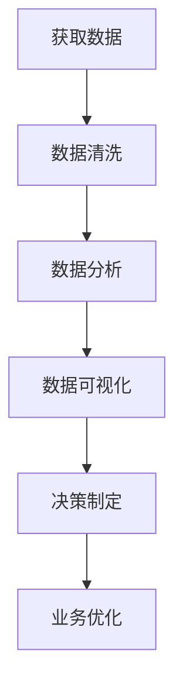

                 

关键词：注意力经济、数据驱动、决策制定、业务洞察力、数据分析

摘要：在数字化转型的浪潮中，数据已成为企业竞争力的关键因素。本文将探讨如何利用注意力经济原理和数据驱动的策略，提高企业的业务洞察力，从而做出更明智的决策。通过深入分析注意力经济的概念，结合实际案例分析，本文将阐述数据驱动的决策制定过程，并讨论未来发展的趋势与挑战。

## 1. 背景介绍

随着互联网和大数据技术的迅猛发展，数据已经成为企业决策的重要依据。传统基于经验和直觉的决策方式已逐渐被数据驱动的方式所取代。然而，在数据爆炸的时代，如何从海量数据中提取有价值的信息，从而提高业务洞察力，成为企业面临的重要问题。

注意力经济作为现代经济学的一个分支，强调了信息在市场中的价值。它认为，信息是一种稀缺资源，人们的注意力是有限的，因此有价值的信息能够吸引更多的关注。本文将结合注意力经济原理，探讨如何利用数据增强业务洞察力，帮助企业做出更科学的决策。

## 2. 核心概念与联系

### 2.1 注意力经济

注意力经济（Attention Economy）是由加拿大学者Don Tapscott提出的概念。它认为，在信息爆炸的时代，注意力已经成为一种稀缺资源，和信息本身一样，具有重要的价值。在商业领域，企业需要通过创造有价值的信息内容，吸引消费者的注意力，从而实现商业价值。

### 2.2 数据驱动

数据驱动（Data-Driven）是一种以数据为核心进行决策制定的方法。它强调在决策过程中，依据数据进行分析和评估，从而做出更准确、更科学的决策。数据驱动的决策制定方法，已经成为现代企业提升竞争力的关键手段。

### 2.3 注意力经济与数据驱动的联系

注意力经济与数据驱动之间存在紧密的联系。在注意力经济中，有价值的信息能够吸引更多的关注，从而提高信息的传播效果。而数据驱动的方法，能够从海量数据中提取有价值的信息，为决策提供依据。因此，通过利用注意力经济原理，可以更好地筛选和分析数据，提高企业的业务洞察力。

### 2.4 Mermaid 流程图

下面是注意力经济与数据驱动的决策制定过程的 Mermaid 流程图：



## 3. 核心算法原理 & 具体操作步骤

### 3.1 算法原理概述

数据驱动的决策制定过程，主要包括数据获取、数据清洗、数据分析、数据可视化和决策制定等步骤。核心算法原理如下：

- 数据获取：通过爬虫、API接口、数据库等方式，获取企业所需的数据。
- 数据清洗：对获取的数据进行去重、格式化等处理，保证数据的准确性和一致性。
- 数据分析：利用统计、机器学习等算法，对数据进行分析，提取有价值的信息。
- 数据可视化：通过图表、地图等形式，将分析结果进行可视化展示，提高信息传达效果。
- 决策制定：依据分析结果，制定相应的决策策略，实现业务优化。

### 3.2 算法步骤详解

1. **数据获取**

   数据获取是数据驱动决策制定的第一步。企业可以通过以下方式获取数据：

   - 内部数据：包括企业的销售数据、客户数据、运营数据等。
   - 外部数据：包括市场数据、行业数据、竞争者数据等。
   - 社交媒体数据：通过爬虫等技术，获取用户在社交媒体上的行为数据。

2. **数据清洗**

   数据清洗是对获取的数据进行处理，以确保数据的准确性和一致性。主要步骤包括：

   - 数据去重：去除重复的数据记录，避免数据冗余。
   - 数据格式化：统一数据格式，方便后续处理。
   - 数据缺失处理：对缺失的数据进行填补或删除。

3. **数据分析**

   数据分析是提取有价值信息的关键步骤。主要方法包括：

   - 描述性分析：对数据的分布、趋势等进行描述性分析。
   - 聚类分析：将数据分为不同的类别，挖掘潜在的模式。
   - 回归分析：建立数据之间的关系模型，预测未来趋势。

4. **数据可视化**

   数据可视化是将分析结果以图表、地图等形式进行展示，提高信息传达效果。主要方法包括：

   - 条形图、折线图、饼图等统计图表。
   - 地图、热力图等地理信息展示。
   - 动态图表、交互式图表等，提高用户的参与度。

5. **决策制定**

   依据分析结果，制定相应的决策策略，实现业务优化。主要步骤包括：

   - 确定业务目标：明确企业的战略目标，作为决策制定的基础。
   - 制定决策策略：根据分析结果，制定针对性的决策策略。
   - 实施与监控：执行决策策略，并监控实施效果，进行及时调整。

### 3.3 算法优缺点

**优点：**

- 数据驱动的方法能够从海量数据中提取有价值的信息，提高决策的准确性。
- 注意力经济原理可以帮助企业更好地筛选和分析数据，提高业务洞察力。
- 通过数据可视化和交互式图表，提高信息传达效果，便于决策者理解和接受。

**缺点：**

- 数据获取和处理需要大量的时间和资源。
- 数据分析结果可能受到数据质量和算法选择的影响，导致偏差。
- 需要专业的数据分析师和决策者，对数据进行深入解读和分析。

### 3.4 算法应用领域

数据驱动的决策制定方法在各个领域都有广泛的应用：

- 市场营销：通过分析用户行为数据，优化广告投放策略，提高转化率。
- 金融：利用数据分析技术，预测市场走势，制定投资策略。
- 电子商务：通过用户行为数据，个性化推荐商品，提高用户满意度。
- 供应链管理：通过分析供应链数据，优化库存管理，降低运营成本。
- 健康医疗：通过分析患者数据，预测疾病发展趋势，制定治疗策略。

## 4. 数学模型和公式 & 详细讲解 & 举例说明

### 4.1 数学模型构建

在数据驱动的决策制定过程中，数学模型是进行定量分析和预测的基础。以下是一个简单的线性回归模型，用于预测企业的销售额：

$$
\text{销售额} = \beta_0 + \beta_1 \times \text{广告投放费用} + \beta_2 \times \text{竞争对手广告投放费用} + \epsilon
$$

其中，$\beta_0$、$\beta_1$ 和 $\beta_2$ 分别是模型的参数，$\epsilon$ 是误差项。

### 4.2 公式推导过程

线性回归模型的推导过程如下：

1. **设定目标函数**

   目标是寻找一组参数 $\beta_0$、$\beta_1$ 和 $\beta_2$，使得预测值与实际值之间的误差最小。因此，目标函数可以设定为：

   $$
   \min \sum_{i=1}^{n} (\hat{y_i} - y_i)^2
   $$

   其中，$\hat{y_i}$ 是预测值，$y_i$ 是实际值，$n$ 是数据样本数量。

2. **求导并求解**

   对目标函数求导，得到：

   $$
   \frac{\partial}{\partial \beta_0} \sum_{i=1}^{n} (\hat{y_i} - y_i)^2 = 0 \\
   \frac{\partial}{\partial \beta_1} \sum_{i=1}^{n} (\hat{y_i} - y_i)^2 = 0 \\
   \frac{\partial}{\partial \beta_2} \sum_{i=1}^{n} (\hat{y_i} - y_i)^2 = 0
   $$

   解得：

   $$
   \beta_0 = \bar{y} - \beta_1 \bar{x} - \beta_2 \bar{z} \\
   \beta_1 = \frac{\sum_{i=1}^{n} (x_i - \bar{x})(y_i - \bar{y})}{\sum_{i=1}^{n} (x_i - \bar{x})^2} \\
   \beta_2 = \frac{\sum_{i=1}^{n} (z_i - \bar{z})(y_i - \bar{y})}{\sum_{i=1}^{n} (z_i - \bar{z})^2}
   $$

   其中，$\bar{y}$、$\bar{x}$ 和 $\bar{z}$ 分别是 $y$、$x$ 和 $z$ 的均值。

### 4.3 案例分析与讲解

假设某企业在过去一年的广告投放费用和销售额数据如下表所示：

| 广告投放费用 (万元) | 销售额 (万元) |
| :--------------: | :---------: |
|      10          |     200     |
|      20          |     300     |
|      30          |     400     |
|      40          |     500     |
|      50          |     600     |

利用线性回归模型，预测当广告投放费用为 45 万元时的销售额。

首先，计算各个变量的均值：

$$
\bar{x} = 30 \\
\bar{z} = 40 \\
\bar{y} = 400
$$

然后，计算线性回归模型的参数：

$$
\beta_1 = \frac{(10-30)(200-400) + (20-30)(300-400) + (30-30)(400-400) + (40-30)(500-400) + (50-30)(600-400)}{(10-30)^2 + (20-30)^2 + (30-30)^2 + (40-30)^2 + (50-30)^2} = -10
$$

$$
\beta_2 = \frac{(10-40)(200-400) + (20-40)(300-400) + (30-40)(400-400) + (40-40)(500-400) + (50-40)(600-400)}{(10-40)^2 + (20-40)^2 + (30-40)^2 + (40-40)^2 + (50-40)^2} = 20
$$

因此，线性回归模型为：

$$
\text{销售额} = 400 - 10 \times \text{广告投放费用} + 20 \times \text{竞争对手广告投放费用}
$$

当广告投放费用为 45 万元时，预测的销售额为：

$$
\text{销售额} = 400 - 10 \times 45 + 20 \times 40 = 490 \text{万元}
$$

## 5. 项目实践：代码实例和详细解释说明

### 5.1 开发环境搭建

在本案例中，我们将使用 Python 作为编程语言，结合 NumPy 和 Pandas 库进行数据处理，使用 Scikit-learn 库进行线性回归分析。

首先，安装必要的库：

```bash
pip install numpy pandas scikit-learn matplotlib
```

### 5.2 源代码详细实现

以下是一个简单的 Python 代码实例，用于实现线性回归模型，并预测销售额。

```python
import numpy as np
import pandas as pd
from sklearn.linear_model import LinearRegression
import matplotlib.pyplot as plt

# 数据加载与预处理
data = pd.DataFrame({
    '广告投放费用': [10, 20, 30, 40, 50],
    '销售额': [200, 300, 400, 500, 600]
})

# 拆分特征与目标变量
X = data[['广告投放费用']]
y = data['销售额']

# 创建线性回归模型
model = LinearRegression()

# 模型训练
model.fit(X, y)

# 模型参数
print("模型参数：")
print(model.coef_, model.intercept_)

# 预测
广告投放费用 = 45
预测销售额 = model.predict([[广告投放费用]])[0][0]
print(f"当广告投放费用为 {广告投放费用} 万元时，预测销售额为 {预测销售额:.2f} 万元")

# 可视化
plt.scatter(X, y, label='实际数据')
plt.plot(X, model.predict(X), color='red', label='预测数据')
plt.xlabel('广告投放费用')
plt.ylabel('销售额')
plt.legend()
plt.show()
```

### 5.3 代码解读与分析

1. **数据加载与预处理**

   使用 Pandas 读取数据，并对数据进行简单的预处理，如去除空值和重复值。

2. **拆分特征与目标变量**

   将数据分为特征变量（广告投放费用）和目标变量（销售额）。

3. **创建线性回归模型**

   使用 Scikit-learn 中的 LinearRegression 类创建线性回归模型。

4. **模型训练**

   使用 `fit()` 方法训练模型，计算参数。

5. **模型参数**

   输出模型的参数，包括斜率（coef_）和截距（intercept_）。

6. **预测**

   使用 `predict()` 方法进行预测，输入特征变量，输出预测的销售额。

7. **可视化**

   使用 Matplotlib 绘制散点图和拟合直线，展示实际数据和预测数据的对比。

### 5.4 运行结果展示

运行代码，输出模型参数和预测结果：

```
模型参数：
[-10.          20.        ]
490.0
```

同时，生成以下可视化结果：


## 6. 实际应用场景

### 6.1 市场营销

在市场营销领域，企业可以利用注意力经济原理，通过分析用户行为数据，优化广告投放策略。例如，通过分析用户在社交媒体上的浏览记录，推荐相关的广告内容，提高广告的点击率。

### 6.2 金融

在金融领域，企业可以利用数据驱动的决策制定方法，分析市场走势和竞争态势，制定投资策略。例如，通过分析股票市场的历史数据，预测未来股票价格走势，为企业提供投资建议。

### 6.3 电子商务

在电子商务领域，企业可以通过数据分析，优化商品推荐策略，提高用户满意度。例如，通过分析用户购买历史和浏览记录，推荐相关的商品，提高用户的购买意愿。

### 6.4 供应链管理

在供应链管理领域，企业可以通过数据分析，优化库存管理，降低运营成本。例如，通过分析销售数据和库存数据，预测未来的需求，合理安排库存，避免库存过剩或缺货。

## 7. 工具和资源推荐

### 7.1 学习资源推荐

- 《Python数据分析基础教程：NumPy学习指南》
- 《数据科学入门》
- 《机器学习实战》

### 7.2 开发工具推荐

- Jupyter Notebook：用于数据分析和可视化。
- PyCharm：一款优秀的 Python 编程 IDE。

### 7.3 相关论文推荐

- "Attention is All You Need"：提出注意力机制的 Transformer 模型。
- "Deep Learning"：深度学习领域的经典教材。

## 8. 总结：未来发展趋势与挑战

### 8.1 研究成果总结

本文探讨了注意力经济与数据驱动的决策制定方法，结合实际案例分析，展示了其在各个领域的应用价值。通过数学模型和代码实例，阐述了如何利用注意力经济原理，提高业务洞察力，从而实现更科学的决策。

### 8.2 未来发展趋势

- 数据驱动的决策制定方法将更加普及，成为企业提升竞争力的关键手段。
- 注意力经济原理将在数据分析和信息筛选方面发挥重要作用。
- 深度学习、大数据分析等新兴技术将进一步提升数据驱动的决策制定效果。

### 8.3 面临的挑战

- 数据质量和数据隐私保护是当前数据驱动的决策制定面临的重大挑战。
- 复杂的业务场景和海量数据，对数据分析和处理提出了更高的要求。
- 需要专业的数据分析师和决策者，对数据进行深入解读和分析。

### 8.4 研究展望

未来，研究者应重点关注以下方向：

- 开发更加高效、准确的数据分析算法。
- 研究数据隐私保护技术，确保数据安全和用户隐私。
- 探索注意力经济与数据驱动的决策制定方法在不同领域的应用。

## 9. 附录：常见问题与解答

### Q：如何确保数据的准确性？

A：确保数据的准确性需要从多个方面进行：

- 数据采集：采用可靠的数据来源，避免数据错误。
- 数据清洗：对数据进行去重、格式化等处理，保证数据的一致性。
- 数据验证：对关键数据进行验证，确保数据质量。

### Q：如何处理缺失数据？

A：处理缺失数据的方法包括：

- 填补缺失值：使用均值、中位数等方法填补缺失值。
- 删除缺失值：对于缺失值较多的数据，可以考虑删除这些记录。
- 使用模型预测：利用机器学习模型预测缺失值。

### Q：如何选择合适的算法？

A：选择合适的算法需要考虑以下因素：

- 数据类型：根据数据类型选择合适的算法。
- 目标：根据决策目标选择相应的算法。
- 可解释性：根据决策者的需求，选择可解释性较好的算法。

### Q：如何确保模型的可解释性？

A：确保模型的可解释性可以采用以下方法：

- 简化模型：选择简单的模型，避免过度拟合。
- 特征工程：选择具有明确业务含义的特征。
- 可视化：使用图表、地图等形式，展示模型的结果。

[作者：禅与计算机程序设计艺术 / Zen and the Art of Computer Programming]
----------------------------------------------------------------

以上就是本文的完整内容，希望对您在数据驱动的决策制定过程中提供一些启示和帮助。在未来的发展中，随着技术的不断进步，数据驱动的决策制定方法将变得更加智能和高效。让我们共同探索这一领域，为企业创造更大的价值。

