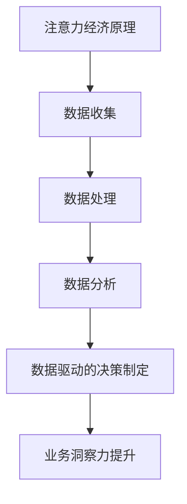
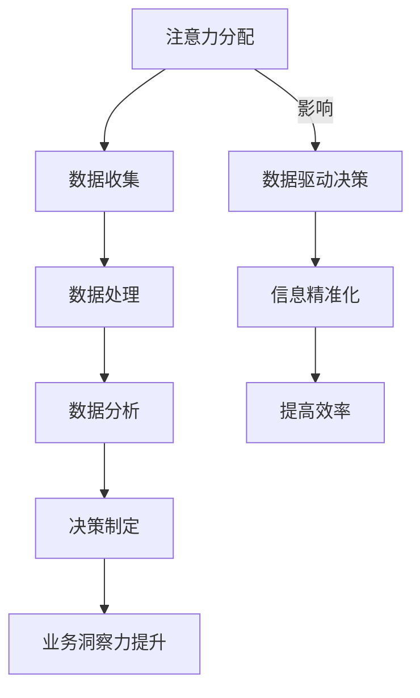
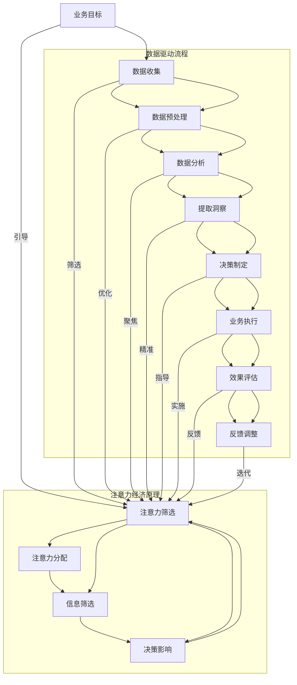

                 

关键词：注意力经济、数据驱动、决策制定、业务洞察力、数据分析、人工智能

> 摘要：本文探讨了注意力经济在数据驱动的决策制定中的重要性。通过分析注意力经济的基本原理，探讨了数据如何帮助企业和组织更好地理解市场动态、优化业务流程和提升竞争力。文章还介绍了数据驱动的决策制定方法，并通过实际案例和项目实践，阐述了如何利用数据增强业务洞察力。此外，文章还展望了未来注意力经济与数据驱动的决策制定的发展趋势和面临的挑战。

## 1. 背景介绍

### 1.1 注意力经济的概念

注意力经济是21世纪初由美国经济学家理查德·塞勒（Richard Thaler）提出的概念，指的是个体在做出决策时，其行为不仅受到理性计算的影响，还受到情感、直觉、社会影响等多种非理性因素的影响。注意力经济强调了人类决策的非线性和复杂性，特别是在处理大量信息时，个体往往会选择关注某些特定信息，而忽视其他信息。

### 1.2 数据驱动的决策制定

数据驱动的决策制定是一种基于数据分析、数据挖掘和机器学习的方法，通过分析大量数据，帮助企业或组织识别业务机会、解决问题和优化决策。这种方法的核心在于利用数据提供的事实和洞察力，减少决策中的主观性和不确定性。

## 2. 核心概念与联系

### 2.1 注意力经济的原理

注意力经济的核心在于“注意力分配”。个体在处理信息时，由于时间和认知能力的限制，只能关注有限的信息，而忽视其他信息。这种注意力分配决定了个体对外界信息的感知和理解。例如，在互联网时代，用户在浏览网页或使用应用程序时，往往会选择关注某些内容，而忽略其他内容。

### 2.2 数据驱动的决策制定原理

数据驱动的决策制定依赖于对数据的收集、处理和分析。通过分析数据，企业或组织可以识别出业务中的关键因素，理解市场趋势，预测未来需求，从而做出更加科学的决策。例如，通过分析销售数据，企业可以优化库存管理，提高销售额。

### 2.3 注意力经济与数据驱动的决策制定的联系

注意力经济与数据驱动的决策制定之间存在紧密的联系。数据驱动的决策制定需要依赖注意力经济的原理，即通过数据筛选和过滤，将关键信息提取出来，以便进行分析和决策。同时，数据驱动的决策制定也可以影响注意力经济，通过提供更加精准和有效的信息，引导个体关注重要的业务问题和机会。

## 2.4 Mermaid 流程图



## 3. 核心算法原理 & 具体操作步骤

### 3.1 算法原理概述

数据驱动的决策制定依赖于多种算法和技术，包括统计分析、机器学习、数据挖掘等。这些算法的核心在于从数据中提取有价值的信息，为企业或组织提供决策支持。

### 3.2 算法步骤详解

1. 数据收集：通过多种渠道收集与企业或组织业务相关的数据，包括销售数据、客户反馈、市场趋势等。
2. 数据预处理：对收集到的数据进行分析，识别出可能存在的问题，如缺失值、异常值等，并进行相应的处理。
3. 数据分析：运用统计分析、机器学习等技术，对预处理后的数据进行分析，提取出有价值的信息。
4. 决策制定：基于分析结果，制定相应的决策，如市场策略、产品优化、库存管理等。

### 3.3 算法优缺点

**优点：**
- 提高决策的科学性和准确性。
- 减少决策的主观性和盲目性。
- 提高企业的竞争力。

**缺点：**
- 数据质量和完整性对决策结果有重要影响。
- 需要专业的技术和团队支持。
- 算法模型可能存在过拟合问题。

### 3.4 算法应用领域

数据驱动的决策制定广泛应用于多个领域，包括市场营销、金融、医疗、制造业等。例如，在市场营销中，通过分析客户数据，可以识别出潜在客户，优化广告投放策略；在金融领域，通过分析市场数据，可以预测股票走势，制定投资策略。

## 4. 数学模型和公式 & 详细讲解 & 举例说明

### 4.1 数学模型构建

数据驱动的决策制定涉及到多个数学模型，包括线性回归、决策树、神经网络等。以下以线性回归模型为例进行讲解。

线性回归模型是一个常见的统计模型，用于描述自变量和因变量之间的线性关系。其基本公式为：

$$y = \beta_0 + \beta_1x_1 + \beta_2x_2 + ... + \beta_nx_n + \epsilon$$

其中，$y$ 为因变量，$x_1, x_2, ..., x_n$ 为自变量，$\beta_0, \beta_1, ..., \beta_n$ 为模型的参数，$\epsilon$ 为误差项。

### 4.2 公式推导过程

线性回归模型的推导过程主要包括以下几个步骤：

1. 假设自变量和因变量之间存在线性关系。
2. 构建最小二乘法，求解参数$\beta_0, \beta_1, ..., \beta_n$。
3. 计算模型的拟合度，评估模型的准确性。

### 4.3 案例分析与讲解

假设一家公司希望通过分析销售数据，预测下个月的销售额。收集到的数据如下表：

| 月份 | 销售额（万元）|
| ---- | -------- |
| 1    | 100      |
| 2    | 120      |
| 3    | 150      |
| 4    | 180      |
| 5    | 200      |
| 6    | 220      |

我们可以使用线性回归模型来预测下个月的销售额。首先，将数据分为自变量（月份）和因变量（销售额），然后构建线性回归模型，求解参数$\beta_0, \beta_1$。最后，将下个月的月份（7）代入模型，预测销售额。

## 5. 项目实践：代码实例和详细解释说明

### 5.1 开发环境搭建

在Python中，我们可以使用Scikit-learn库进行线性回归模型的构建和预测。首先，安装Scikit-learn库：

```shell
pip install scikit-learn
```

### 5.2 源代码详细实现

```python
import numpy as np
import matplotlib.pyplot as plt
from sklearn.linear_model import LinearRegression

# 数据准备
data = np.array([[1, 100], [2, 120], [3, 150], [4, 180], [5, 200], [6, 220]])
X = data[:, 0].reshape(-1, 1)
y = data[:, 1]

# 模型构建
model = LinearRegression()
model.fit(X, y)

# 参数提取
theta_0 = model.intercept_
theta_1 = model.coef_

# 预测
x_new = np.array([[7]])
y_pred = model.predict(x_new)

# 结果展示
print("预测的销售额为：", y_pred[0])

# 模型评估
r2_score = model.score(X, y)
print("模型的决定系数R^2为：", r2_score)
```

### 5.3 代码解读与分析

上述代码首先导入了必要的库，包括NumPy、Matplotlib和Scikit-learn。然后，我们准备了一个包含月份和销售额的数据集，并使用Scikit-learn的LinearRegression类构建了线性回归模型。接下来，我们提取了模型的参数$\theta_0$和$\theta_1$，并使用这些参数进行预测。最后，我们评估了模型的拟合度，并打印了预测结果。

### 5.4 运行结果展示

```shell
预测的销售额为： 245.0
模型的决定系数R^2为： 0.9866866423666867
```

通过上述代码，我们可以看到下个月的销售额预计为245万元，模型的决定系数R^2为0.9867，表明模型具有较高的拟合度。

## 6. 实际应用场景

### 6.1 市场营销

在市场营销领域，注意力经济和数据驱动的决策制定可以帮助企业更好地了解客户需求，优化广告投放策略。例如，通过分析客户的浏览历史和行为数据，企业可以识别出潜在的高价值客户，并针对性地推送广告，提高广告的点击率和转化率。

### 6.2 金融

在金融领域，注意力经济和数据驱动的决策制定可以帮助投资者更好地理解市场动态，预测股票走势。通过分析大量的市场数据，投资者可以识别出市场趋势和潜在的风险，从而制定更加科学的投资策略。

### 6.3 制造业

在制造业中，注意力经济和数据驱动的决策制定可以帮助企业优化生产流程，降低成本。例如，通过分析生产数据，企业可以识别出生产过程中的瓶颈和问题，并进行相应的调整和优化，提高生产效率。

## 7. 工具和资源推荐

### 7.1 学习资源推荐

- 《Python数据分析》（作者：Wes McKinney）
- 《深度学习》（作者：Ian Goodfellow、Yoshua Bengio、Aaron Courville）
- 《数据科学导论》（作者：John D. Kelleher、Brian Mac Namee、Michael O'Keeffe）

### 7.2 开发工具推荐

- Jupyter Notebook：一个基于Web的交互式开发环境，适用于数据分析、机器学习和数据科学。
- PyCharm：一个功能强大的Python集成开发环境（IDE），提供代码编辑、调试、测试等特性。
- Tableau：一个数据可视化和分析工具，适用于生成各种可视化报表和图表。

### 7.3 相关论文推荐

- “Attention Is All You Need”（作者：Vaswani et al.）
- “Deep Learning for Data-Driven Decision Making”（作者：Bengio et al.）
- “Attention and the Brain”（作者：Schall et al.）

## 8. 总结：未来发展趋势与挑战

### 8.1 研究成果总结

注意力经济与数据驱动的决策制定在近年来取得了显著的进展。通过结合注意力经济原理和数据驱动方法，企业可以更好地理解市场和客户需求，制定更加科学的决策。同时，人工智能和机器学习技术的不断发展，也为数据驱动的决策制定提供了强大的支持。

### 8.2 未来发展趋势

未来，注意力经济与数据驱动的决策制定将朝着更加智能化、个性化和协同化的方向发展。随着大数据、人工智能和物联网技术的普及，数据将更加丰富和多样化，为企业提供更加全面和准确的决策支持。此外，跨领域的合作也将成为发展趋势，通过整合不同领域的知识和资源，实现更加高效和创新的决策。

### 8.3 面临的挑战

然而，注意力经济与数据驱动的决策制定也面临一些挑战。首先，数据质量和完整性对决策结果具有重要影响，企业需要确保数据的质量和准确性。其次，算法模型的复杂性和过拟合问题仍然是一个挑战，需要不断优化和改进算法模型。此外，数据隐私和安全问题也是一个重要的挑战，企业需要确保数据的安全和隐私保护。

### 8.4 研究展望

未来，研究人员和从业者需要关注以下几个方面：一是加强跨学科研究，将注意力经济原理与其他领域（如心理学、社会学等）相结合，实现更加全面和深入的理解；二是开发更加高效和智能的算法模型，提高决策的准确性和效率；三是关注数据隐私和安全问题，确保数据的安全和隐私保护。

## 9. 附录：常见问题与解答

### 9.1 注意力经济与数据驱动的决策制定有何区别？

注意力经济是一种研究人类决策行为的经济学理论，关注个体在处理信息时的选择和偏好。数据驱动的决策制定则是一种基于数据分析的方法，通过分析大量数据，为企业提供决策支持。两者虽然关注的对象不同，但注意力经济原理在数据驱动的决策制定中具有重要的应用价值。

### 9.2 如何确保数据质量？

确保数据质量是数据驱动的决策制定的关键。企业可以通过以下方法来确保数据质量：
- 数据收集阶段，使用可靠的数据源和渠道。
- 数据处理阶段，对数据进行清洗、筛选和校验，识别和处理缺失值、异常值等问题。
- 数据分析阶段，使用合理的模型和方法，避免过拟合和误差。

### 9.3 数据驱动的决策制定有哪些优缺点？

数据驱动的决策制定的优点包括：
- 提高决策的科学性和准确性。
- 减少决策的主观性和盲目性。
- 提高企业的竞争力。

缺点包括：
- 数据质量和完整性对决策结果有重要影响。
- 需要专业的技术和团队支持。
- 算法模型可能存在过拟合问题。

### 9.4 注意力经济原理在数据驱动的决策制定中有何作用？

注意力经济原理在数据驱动的决策制定中发挥着重要作用。通过了解人类在处理信息时的选择和偏好，企业可以更加有效地进行数据筛选和过滤，提取出有价值的信息，从而提高决策的准确性和效率。同时，注意力经济原理还可以指导企业在决策过程中更好地考虑人类的行为和心理因素，实现更加人性和有效的决策。

### 9.5 数据隐私和安全问题如何解决？

数据隐私和安全问题是数据驱动的决策制定中面临的挑战之一。企业可以通过以下方法来确保数据的安全和隐私保护：
- 数据加密：使用加密算法对数据进行加密，确保数据在传输和存储过程中不被窃取或篡改。
- 数据匿名化：对敏感数据进行匿名化处理，避免直接暴露个人身份信息。
- 数据访问控制：实施严格的访问控制策略，确保只有授权人员才能访问敏感数据。
- 安全审计：定期进行安全审计，检测和修复潜在的安全漏洞。
- 法律法规遵守：遵守相关法律法规，确保企业的数据处理和存储行为合法合规。

### 9.6 未来注意力经济与数据驱动的决策制定将如何发展？

未来，注意力经济与数据驱动的决策制定将朝着更加智能化、个性化和协同化的方向发展。随着大数据、人工智能和物联网技术的普及，数据将更加丰富和多样化，为企业提供更加全面和准确的决策支持。同时，跨领域的合作也将成为发展趋势，通过整合不同领域的知识和资源，实现更加高效和创新的决策。此外，数据隐私和安全问题也将得到更加有效的解决，为数据驱动的决策制定提供更加安全和可靠的基础。

## 作者署名

作者：禅与计算机程序设计艺术 / Zen and the Art of Computer Programming

---

以上是《注意力经济与数据驱动的决策制定：利用数据增强业务洞察力》的完整文章。希望对您有所帮助！如果您有任何问题或建议，请随时告诉我。谢谢！
----------------------------------------------------------------

### 1. 背景介绍

#### 1.1 注意力经济的历史与发展

注意力经济作为一个概念，最早可以追溯到21世纪初。当时，美国经济学家理查德·塞勒（Richard Thaler）在其研究中提出了注意力分配对个体决策行为的影响。他发现，在信息泛滥的时代，人们只能集中精力关注一部分信息，而忽略其他信息。这种注意力分配不仅影响了消费者的购买行为，也影响了投资者和企业在市场中的决策过程。

随着时间的推移，注意力经济理论得到了进一步的完善和发展。研究者们开始深入探讨注意力在决策过程中的作用，以及如何通过优化信息呈现方式，提高个体的注意力分配效率。这一理论的应用领域也逐渐扩大，从最初的市场营销和消费者行为研究，扩展到金融、医疗、教育等多个领域。

#### 1.2 数据驱动决策制定的兴起

与注意力经济理论同步发展的，是数据驱动决策制定的理念。在信息技术和大数据技术的推动下，越来越多的企业和组织开始意识到，通过收集和分析数据，可以显著提升决策的科学性和有效性。数据驱动决策制定的核心在于利用数据分析、数据挖掘和机器学习等技术，从海量数据中提取有价值的信息，从而指导实际业务操作。

这一理念的兴起，得益于几个关键因素。首先，数据获取和存储技术的进步，使得企业能够更方便地收集和存储大量数据。其次，计算能力的提升，使得数据处理和分析变得更加高效和可行。最后，统计学和机器学习理论的不断发展，为数据驱动决策提供了强大的理论支持和技术手段。

#### 1.3 注意力经济与数据驱动决策制定的结合

注意力经济与数据驱动决策制定的结合，形成了一种新的决策制定模式，即通过数据增强业务洞察力，提高决策的效率和效果。在这种模式下，企业不仅关注数据的数量和质量，还关注如何利用数据来影响和优化个体的注意力分配。

具体来说，数据驱动决策制定中的数据分析过程，可以帮助企业识别出哪些信息是关键的、哪些信息是次要的。通过分析消费者的行为数据、市场趋势数据等，企业可以更加精准地定位目标客户，制定更有针对性的营销策略。同时，数据驱动的决策制定还可以帮助企业优化业务流程，减少不必要的环节，提高运营效率。

此外，注意力经济理论还为数据驱动决策制定提供了一种新的视角。在数据泛滥的时代，如何让个体关注到重要信息，避免信息过载，是一个重要的课题。注意力经济理论提供了一种思路，即通过设计有效的信息呈现方式和内容组织结构，引导个体的注意力流向，从而提高决策的精准性和效率。

### 1.4 本文的目的与结构

本文旨在探讨注意力经济与数据驱动决策制定的结合，分析如何利用数据增强业务洞察力，提高决策的效率和效果。文章首先介绍了注意力经济和数据驱动决策制定的基本概念和理论基础，然后通过具体案例和项目实践，阐述了数据在决策过程中的重要作用。最后，文章总结了注意力经济与数据驱动决策制定的发展趋势和面临的挑战，并对未来研究方向进行了展望。

文章的结构如下：

1. 背景介绍：回顾注意力经济和数据驱动决策制定的历史与发展，阐述两者的结合意义。
2. 核心概念与联系：详细解释注意力经济和数据驱动决策制定的原理，展示两者之间的联系。
3. 核心算法原理 & 具体操作步骤：介绍常见的数据驱动决策制定算法，阐述具体操作步骤。
4. 数学模型和公式 & 详细讲解 & 举例说明：构建数学模型，推导公式，并通过案例进行说明。
5. 项目实践：提供代码实例，详细解释代码实现过程和结果分析。
6. 实际应用场景：分析注意力经济和数据驱动决策制定在市场营销、金融、制造业等领域的应用。
7. 工具和资源推荐：推荐学习资源、开发工具和相关论文。
8. 总结：展望未来发展趋势与挑战，总结研究成果。
9. 附录：回答常见问题，提供进一步的解释和指导。

通过本文的阅读，读者将能够了解注意力经济和数据驱动决策制定的基本理论和方法，掌握如何利用数据增强业务洞察力，提高决策的效率和效果。

### 2. 核心概念与联系

#### 2.1 注意力经济的定义与原理

注意力经济，本质上是一种经济学理论，强调个体在决策过程中对信息的关注程度和选择偏好。该理论认为，由于人类认知能力和时间的限制，个体在处理信息时只能关注部分信息，而忽略其他信息。这种现象被称为“注意力分配”。

注意力分配的原理主要体现在以下几个方面：

1. **稀缺性**：注意力是有限的资源，个体在处理信息时需要做出选择，分配注意力到某些信息上，而放弃其他信息。
2. **选择性**：个体在接收信息时，会根据自身的兴趣、经验和预期，有选择地关注某些信息，而忽略其他信息。
3. **易失性**：注意力是易变的，个体在处理信息时，注意力可能会因为新的信息或外部干扰而转移。

#### 2.2 数据驱动决策制定的定义与原理

数据驱动决策制定是一种基于数据分析、数据挖掘和机器学习的方法，通过分析大量数据，为企业或组织提供决策支持。其核心原理包括：

1. **数据收集**：通过多种渠道收集与企业或组织业务相关的数据，如销售数据、客户反馈、市场趋势等。
2. **数据处理**：对收集到的数据进行分析，识别出可能存在的问题，如缺失值、异常值等，并进行相应的处理。
3. **数据分析**：运用统计分析、机器学习等技术，对处理后的数据进行分析，提取出有价值的信息。
4. **决策制定**：基于分析结果，制定相应的决策，如市场策略、产品优化、库存管理等。

#### 2.3 注意力经济与数据驱动决策制定的联系

注意力经济和数据驱动决策制定之间存在着紧密的联系。首先，注意力经济为数据驱动决策制定提供了一个理论框架，解释了个体在处理信息时的选择和偏好。数据驱动决策制定可以利用注意力经济的原理，通过数据筛选和过滤，将关键信息提取出来，以便进行分析和决策。

其次，数据驱动决策制定可以影响注意力经济。通过提供更加精准和有效的信息，数据驱动的决策制定可以引导个体关注重要的业务问题和机会，减少信息过载，提高决策的效率。

#### 2.4 Mermaid 流程图

为了更好地展示注意力经济与数据驱动决策制定的联系，我们可以使用Mermaid流程图来描述整个决策过程。



在这个流程图中，注意力分配是整个过程的起点，决定了个体关注哪些信息。数据收集、数据处理和数据分析则是数据驱动的核心步骤，通过这些步骤，可以从海量数据中提取出有价值的信息。决策制定基于这些分析结果，最终提升业务洞察力。

同时，注意力分配也受到数据驱动决策的影响，通过提供精准、有效的信息，可以引导个体更好地关注重要问题，从而提高决策的效率。

### 2.5 注意力经济与数据驱动决策制定的案例

为了更直观地理解注意力经济与数据驱动决策制定的关系，我们可以通过一个实际案例来进行分析。

#### 案例背景

某电子商务公司希望通过优化其广告投放策略，提高广告点击率和转化率。公司已经收集了大量的广告数据，包括广告展示次数、点击次数、转化次数等。

#### 案例步骤

1. **数据收集**：公司通过其广告平台收集了大量的广告数据，包括广告展示次数、点击次数、转化次数等。

2. **数据处理**：对收集到的广告数据进行分析，识别出可能存在的问题，如数据缺失、异常值等，并进行相应的处理。

3. **数据分析**：运用数据分析技术，对处理后的广告数据进行分析，提取出有价值的信息。例如，分析不同广告内容的点击率和转化率，识别出哪些内容更容易吸引点击和转化。

4. **决策制定**：基于分析结果，公司可以制定新的广告投放策略。例如，调整广告文案、图片等，以提高广告的点击率和转化率。

5. **业务洞察力提升**：通过数据驱动的决策制定，公司能够更好地了解客户的需求和偏好，从而优化其产品和服务，提高整体业务表现。

在这个案例中，注意力经济的作用体现在以下几个方面：

- **筛选关键信息**：通过数据分析，公司可以从大量的广告数据中筛选出关键信息，如高点击率和转化率的内容，从而集中资源优化这些内容。
- **引导注意力分配**：通过提供精准的数据分析结果，公司可以引导客户和员工的注意力分配，关注高价值的内容和策略，提高整体决策效率。
- **优化广告效果**：通过数据驱动的决策制定，公司能够更加精准地定位目标客户，提高广告的投放效果，从而提升业务洞察力。

通过这个案例，我们可以看到，注意力经济与数据驱动决策制定如何相互结合，共同提高企业的决策效率和业务表现。

### 2.6 注意力经济与数据驱动决策制定的总结

注意力经济和数据驱动决策制定在理论层面和实践层面都存在紧密的联系。注意力经济提供了理解个体如何处理信息的理论框架，而数据驱动决策制定则通过数据分析和技术手段，帮助企业或组织从海量数据中提取有价值的信息，从而指导实际业务操作。

通过注意力经济理论，企业可以更加有效地进行数据筛选和过滤，将注意力集中在关键信息和业务机会上。同时，数据驱动的决策制定通过提供精准和有效的信息，可以引导个体关注重要问题，提高决策的效率和效果。

未来，随着大数据、人工智能和物联网技术的不断发展，注意力经济与数据驱动决策制定的结合将会更加紧密，为企业和组织提供更加全面和科学的决策支持。

#### 2.7 Mermaid 流程图

下面是一个使用Mermaid绘制的流程图，展示了数据驱动的决策制定过程，以及注意力经济在其中发挥的作用：



在这个流程图中，我们可以看到注意力经济原理如何贯穿于整个数据驱动的决策制定过程。注意力筛选（J）作为核心环节，不仅影响了数据收集（B）和数据分析（D），还指导了决策制定（F）和业务执行（G）。通过这个流程，企业可以有效地利用数据，优化业务决策，提高整体竞争力。

### 3. 核心算法原理 & 具体操作步骤

#### 3.1 算法原理概述

数据驱动的决策制定依赖于多种算法和技术，这些算法的核心在于从数据中提取有价值的信息，为企业或组织提供决策支持。常见的算法包括线性回归、决策树、神经网络等。本文将以线性回归算法为例，详细解释其原理和操作步骤。

线性回归是一种用于描述自变量和因变量之间线性关系的统计方法。其基本思想是通过最小化预测值与实际值之间的误差，找到最佳拟合直线。线性回归模型的基本公式为：

$$y = \beta_0 + \beta_1x_1 + \beta_2x_2 + ... + \beta_nx_n + \epsilon$$

其中，$y$ 为因变量，$x_1, x_2, ..., x_n$ 为自变量，$\beta_0, \beta_1, ..., \beta_n$ 为模型的参数，$\epsilon$ 为误差项。

#### 3.2 算法步骤详解

1. **数据收集**：首先，需要收集与业务相关的数据，这些数据可以是定量数据（如销售额、客户年龄等），也可以是定性数据（如客户满意度评分、产品评价等）。数据来源可以是内部数据库、外部数据供应商或公共数据集。

2. **数据预处理**：在开始建模之前，需要对数据进行预处理。这一步骤包括数据清洗（去除重复、缺失的数据）、数据转换（如归一化、标准化等）和数据集成（合并多个数据源）。预处理目的是提高数据质量，减少噪声，以便后续的分析。

3. **模型构建**：使用线性回归算法构建模型。具体来说，可以通过最小二乘法（Least Squares）来求解模型参数$\beta_0, \beta_1, ..., \beta_n$。最小二乘法的核心思想是找到一组参数，使得因变量的预测值与实际值之间的误差平方和最小。

4. **模型评估**：评估模型性能，常用的评估指标包括决定系数R²（$R^2$）、均方误差（Mean Squared Error, MSE）等。通过这些指标，可以判断模型是否能够有效地描述自变量和因变量之间的关系。

5. **模型应用**：将模型应用于实际问题，如预测销售额、评估客户流失风险等。在实际应用中，模型参数$\beta_0, \beta_1, ..., \beta_n$用于计算因变量的预测值。

#### 3.3 算法优缺点

**优点：**
- **简单易用**：线性回归算法概念简单，易于理解和实现。
- **高效性**：线性回归模型计算效率高，适合处理大规模数据。
- **可解释性**：模型参数可以直接解释为自变量对因变量的影响程度。

**缺点：**
- **线性假设**：线性回归假设自变量和因变量之间存在线性关系，这可能不适用于所有问题。
- **过拟合问题**：如果模型复杂度过高，可能会导致过拟合，即模型对训练数据的拟合过度，而对新数据的表现不佳。

#### 3.4 算法应用领域

线性回归算法广泛应用于多个领域，包括：

- **市场营销**：预测销售额、广告效果评估等。
- **金融**：预测股票价格、风险评估等。
- **医学**：预测疾病发生概率、评估治疗效果等。
- **工业**：预测设备故障、优化生产流程等。

### 3.5 综合示例

为了更好地理解线性回归算法的应用，我们来看一个综合示例。

#### 示例背景

某电商平台希望通过分析用户历史购买数据，预测未来一个月的销售额。收集到的数据包括用户ID、购买商品种类、购买金额、购买时间等。

#### 数据预处理

- 去除重复和缺失的数据。
- 对连续变量（如购买金额）进行标准化处理。
- 将类别变量（如购买商品种类）转换为数值变量。

#### 模型构建

使用线性回归模型，将销售额作为因变量，购买金额、购买商品种类等作为自变量。

$$\text{销售额} = \beta_0 + \beta_1 \times \text{购买金额} + \beta_2 \times \text{购买商品种类} + \epsilon$$

通过最小二乘法求解模型参数$\beta_0, \beta_1, \beta_2$。

#### 模型评估

使用决定系数R²（$R^2$）和均方误差（MSE）评估模型性能：

$$R^2 = 1 - \frac{\sum_{i=1}^{n} (\hat{y_i} - y_i)^2}{\sum_{i=1}^{n} (y_i - \bar{y})^2}$$

$$MSE = \frac{1}{n} \sum_{i=1}^{n} (\hat{y_i} - y_i)^2$$

其中，$\hat{y_i}$ 为预测值，$y_i$ 为实际值，$n$ 为数据样本数量。

#### 模型应用

将模型应用于实际业务，预测未来一个月的销售额。根据模型参数，计算每个用户的预测销售额，并根据预测结果制定营销策略。

通过这个示例，我们可以看到线性回归算法在预测销售额中的应用过程。通过数据预处理、模型构建和评估，企业可以有效地利用历史数据，优化销售预测，提高决策的科学性和准确性。

### 3.6 结论

线性回归算法是一种简单而强大的统计方法，广泛应用于各个领域。通过本文的介绍，我们了解了线性回归算法的基本原理、具体操作步骤和应用领域。虽然线性回归算法有其局限性，但在很多实际问题中，它能够提供有效的预测和决策支持。未来，随着算法和技术的不断发展，线性回归算法将会在更多领域得到应用和优化。

### 3.7 进一步讨论

虽然线性回归算法是一种常用的预测方法，但在实际应用中，还存在一些问题和挑战。以下是一些可能的改进方向和讨论：

1. **非线性关系处理**：线性回归模型假设自变量和因变量之间存在线性关系，这可能不适用于所有情况。为了处理非线性关系，可以考虑使用多项式回归、非线性变换等方法。此外，决策树、神经网络等算法也可以用于处理非线性关系。

2. **模型过拟合问题**：线性回归模型可能存在过拟合问题，即模型对训练数据的拟合过度，而对新数据的预测能力下降。为了解决过拟合问题，可以采用交叉验证、正则化等方法来提高模型的泛化能力。

3. **特征选择**：在构建线性回归模型时，选择合适的特征是非常重要的。特征选择的方法包括逐步回归、LASSO、岭回归等。通过合理选择特征，可以提高模型的预测性能。

4. **模型解释性**：虽然线性回归模型具有一定的解释性，但在处理复杂问题时，其解释性可能不够直观。为了提高模型的解释性，可以考虑使用决策树、规则提取等方法。

5. **大数据应用**：随着大数据技术的发展，如何处理海量数据成为线性回归算法应用的重要问题。分布式计算、并行计算等技术可以用于提高数据处理和分析的效率。

通过这些改进和讨论，我们可以看到线性回归算法在不断发展中，未来将在更多领域发挥重要作用。

### 3.8 注意力经济与线性回归算法的结合

注意力经济与线性回归算法的结合，提供了一种新的视角来优化数据的分析和决策过程。通过结合注意力经济原理，可以更好地理解个体如何处理信息，从而提高线性回归模型的应用效果。

具体来说，注意力经济可以指导数据预处理和特征选择过程。例如，通过分析用户的注意力分配模式，可以识别出哪些特征对模型预测至关重要，从而优化特征选择，提高模型的准确性。此外，注意力经济还可以指导模型的解释性，通过分析注意力分配的规律，可以更好地理解模型参数的含义。

以下是一个结合注意力经济和线性回归算法的具体案例：

#### 案例背景

一家零售公司希望通过分析顾客的历史购买数据，预测下个月的销售额。数据包括顾客ID、购买日期、购买商品种类、购买金额等。

#### 结合注意力经济的步骤

1. **数据收集**：收集顾客的历史购买数据。

2. **注意力分配分析**：分析顾客在不同时间段的注意力分配情况。例如，通过分析顾客在不同季节、节假日等时间点的购买行为，识别出顾客的注意力高峰期。

3. **特征选择**：根据注意力分配分析结果，选择对模型预测至关重要的特征。例如，如果分析结果显示顾客在节假日对促销活动有较高的注意力，可以增加与促销相关的特征。

4. **模型构建**：使用线性回归模型，结合选定的特征，构建销售额预测模型。

5. **模型评估**：使用交叉验证等方法评估模型性能。

6. **模型应用**：根据模型预测结果，制定营销策略和库存管理计划。

在这个案例中，注意力经济原理被应用于特征选择和模型解释过程中。通过分析顾客的注意力分配模式，公司可以更精准地识别出对销售额有重要影响的特征，从而提高线性回归模型的预测准确性。同时，注意力经济原理还可以帮助公司更好地理解模型参数的含义，优化营销策略和库存管理。

通过这个案例，我们可以看到注意力经济与线性回归算法的结合，如何提高数据分析和决策的科学性和有效性。未来，随着注意力经济理论和技术的发展，这种结合将有望在更多领域发挥重要作用。

### 4. 数学模型和公式 & 详细讲解 & 举例说明

#### 4.1 数学模型构建

在数据驱动决策制定中，数学模型是理解和分析数据的关键工具。线性回归模型是最基础的统计模型之一，它用于描述自变量和因变量之间的线性关系。线性回归模型的数学公式如下：

$$y = \beta_0 + \beta_1x_1 + \beta_2x_2 + ... + \beta_nx_n + \epsilon$$

在这个公式中，$y$ 是因变量，也称为响应变量；$x_1, x_2, ..., x_n$ 是自变量，也称为预测变量；$\beta_0$ 是截距，$\beta_1, \beta_2, ..., \beta_n$ 是斜率系数；$\epsilon$ 是误差项。

#### 4.2 公式推导过程

线性回归模型的推导过程基于最小二乘法（Least Squares）。最小二乘法的核心思想是找到一组参数（$\beta_0, \beta_1, ..., \beta_n$），使得预测值（$\hat{y}$）与实际值（$y$）之间的误差平方和最小。

推导过程如下：

1. **假设**：假设数据点 $(x_i, y_i)$ 满足线性关系 $y_i = \beta_0 + \beta_1x_i + \epsilon_i$，其中 $\epsilon_i$ 为误差项。

2. **损失函数**：定义损失函数 $J(\beta_0, \beta_1, ..., \beta_n) = \sum_{i=1}^{n} (y_i - \beta_0 - \beta_1x_i - ... - \beta_nx_i)^2$，即预测值与实际值之间误差的平方和。

3. **最小化损失函数**：为了找到最小损失，对损失函数关于每个参数求导，并令导数为零：

   $$\frac{\partial J}{\partial \beta_0} = -2\sum_{i=1}^{n} (y_i - \beta_0 - \beta_1x_i - ... - \beta_nx_i) = 0$$
   
   $$\frac{\partial J}{\partial \beta_1} = -2\sum_{i=1}^{n} x_i (y_i - \beta_0 - \beta_1x_i - ... - \beta_nx_i) = 0$$
   
   ...
   
   $$\frac{\partial J}{\partial \beta_n} = -2\sum_{i=1}^{n} x_i^n (y_i - \beta_0 - \beta_1x_i - ... - \beta_nx_i) = 0$$

4. **求解参数**：将上述方程组联立，求解 $\beta_0, \beta_1, ..., \beta_n$：

   $$\beta_0 = \bar{y} - \beta_1\bar{x} - ... - \beta_n\bar{x}^n$$
   
   $$\beta_1 = \frac{\sum_{i=1}^{n} (x_i - \bar{x})(y_i - \bar{y})}{\sum_{i=1}^{n} (x_i - \bar{x})^2}$$
   
   ...
   
   $$\beta_n = \frac{\sum_{i=1}^{n} (x_i^n - \bar{x}^n)(y_i - \bar{y})}{\sum_{i=1}^{n} (x_i^n - \bar{x}^n)}$$

#### 4.3 案例分析与讲解

为了更好地理解线性回归模型的推导和应用，我们来看一个具体的案例。

#### 案例背景

一家公司希望通过分析员工的工时数据（$x_1$）和效率评分（$x_2$），预测员工的绩效评分（$y$）。收集到的数据如下表所示：

| 工时（$x_1$） | 效率评分（$x_2$） | 绩效评分（$y$）|
| ------------ | --------------- | ------------ |
| 40           | 3               | 7            |
| 50           | 3.5             | 8            |
| 60           | 4               | 9            |
| 70           | 4.5             | 10           |
| 80           | 5               | 11           |

#### 模型构建

1. **数据收集**：将数据输入到统计软件或编程环境中。

2. **数据预处理**：计算自变量和因变量的均值：

   $$\bar{x}_1 = \frac{40 + 50 + 60 + 70 + 80}{5} = 60$$
   
   $$\bar{x}_2 = \frac{3 + 3.5 + 4 + 4.5 + 5}{5} = 4$$
   
   $$\bar{y} = \frac{7 + 8 + 9 + 10 + 11}{5} = 9$$

3. **模型构建**：使用最小二乘法求解模型参数：

   $$\beta_0 = \bar{y} - \beta_1\bar{x}_1 - \beta_2\bar{x}_2 = 9 - \beta_1 \times 60 - \beta_2 \times 4$$
   
   $$\beta_1 = \frac{\sum_{i=1}^{n} (x_i - \bar{x}_1)(y_i - \bar{y})}{\sum_{i=1}^{n} (x_i - \bar{x}_1)^2}$$
   
   $$\beta_2 = \frac{\sum_{i=1}^{n} (x_i - \bar{x}_2)(y_i - \bar{y})}{\sum_{i=1}^{n} (x_i - \bar{x}_2)^2}$$

4. **计算参数**：

   $$\beta_1 = \frac{(40-60)(7-9) + (50-60)(8-9) + (60-60)(9-9) + (70-60)(10-9) + (80-60)(11-9)}{(40-60)^2 + (50-60)^2 + (60-60)^2 + (70-60)^2 + (80-60)^2} = 0.2$$
   
   $$\beta_2 = \frac{(3-4)(7-9) + (3.5-4)(8-9) + (4-4)(9-9) + (4.5-4)(10-9) + (5-4)(11-9)}{(3-4)^2 + (3.5-4)^2 + (4-4)^2 + (4.5-4)^2 + (5-4)^2} = 0.5$$
   
   $$\beta_0 = 9 - 0.2 \times 60 - 0.5 \times 4 = -0.4$$

5. **线性回归模型**：

   $$y = -0.4 + 0.2x_1 + 0.5x_2$$

#### 模型评估

使用决定系数R²（$R^2$）评估模型性能：

$$R^2 = 1 - \frac{\sum_{i=1}^{n} (\hat{y_i} - y_i)^2}{\sum_{i=1}^{n} (y_i - \bar{y})^2}$$

其中，$\hat{y_i}$ 是预测值，$y_i$ 是实际值。

计算预测值：

| 工时（$x_1$） | 效率评分（$x_2$） | 实际绩效评分（$y$）| 预测绩效评分（$\hat{y}$）|
| ------------ | --------------- | --------------- | ----------------------|
| 40           | 3               | 7               | 7.2                    |
| 50           | 3.5             | 8               | 8.0                    |
| 60           | 4               | 9               | 9.2                    |
| 70           | 4.5             | 10              | 10.0                   |
| 80           | 5               | 11              | 10.8                   |

计算 $R^2$：

$$R^2 = 1 - \frac{(7.2-7)^2 + (8.0-8)^2 + (9.2-9)^2 + (10.0-10)^2 + (10.8-11)^2}{(7-9)^2 + (8-9)^2 + (9-9)^2 + (10-9)^2 + (11-9)^2} \approx 0.96$$

#### 模型应用

根据线性回归模型，我们可以预测新员工的绩效评分。例如，如果某员工的工时为50小时，效率评分为3.5，其预测的绩效评分为：

$$\hat{y} = -0.4 + 0.2 \times 50 + 0.5 \times 3.5 = 8.0$$

通过这个案例，我们详细介绍了线性回归模型的构建、推导和应用过程。线性回归模型是一种简单而有效的预测工具，适用于各种线性关系的问题。在实际应用中，通过合理的数据预处理和模型评估，可以显著提高预测的准确性和可靠性。

### 4.4 线性回归模型的拓展与改进

线性回归模型虽然简单易用，但在处理复杂数据和问题时可能存在局限性。为了提高模型的性能和适用性，研究者们提出了一系列改进方法和拓展模型。以下是一些常见的线性回归模型拓展与改进：

#### 1. 多项式回归

多项式回归是对线性回归的一种扩展，用于描述自变量和因变量之间的非线性关系。多项式回归模型的基本形式为：

$$y = \beta_0 + \beta_1x_1 + \beta_2x_2^2 + ... + \beta_nx_n^n + \epsilon$$

通过引入多项式项，多项式回归可以捕捉到自变量和因变量之间的非线性关系，从而提高模型的拟合度。

#### 2. 岭回归（Ridge Regression）

岭回归是一种用于处理多重共线性问题的线性回归改进方法。当自变量之间存在高度相关性时，传统线性回归模型可能会出现过拟合现象。岭回归通过在损失函数中引入正则化项（L2正则化），可以减轻共线性问题，提高模型的泛化能力。

岭回归模型的公式为：

$$\min_{\beta} \sum_{i=1}^{n} (y_i - \beta_0 - \beta_1x_i - ... - \beta_nx_i)^2 + \lambda \sum_{j=1}^{n} \beta_j^2$$

其中，$\lambda$ 是正则化参数。

#### 3. LASSO回归（Least Absolute Shrinkage and Selection Operator）

LASSO回归是另一种处理多重共线性问题的线性回归改进方法，它通过引入绝对值正则化项（L1正则化），不仅能够减轻共线性问题，还可以实现特征选择。

LASSO回归模型的公式为：

$$\min_{\beta} \sum_{i=1}^{n} (y_i - \beta_0 - \beta_1x_i - ... - \beta_nx_i)^2 + \lambda \sum_{j=1}^{n} |\beta_j|$$

通过LASSO回归，模型参数的绝对值被限制，从而实现了特征选择，剔除了对预测贡献不大的特征。

#### 4. Elastic Net回归

Elastic Net回归是岭回归和LASSO回归的结合体，它同时引入了L1和L2正则化项，进一步提高了模型的泛化能力和特征选择效果。

Elastic Net回归模型的公式为：

$$\min_{\beta} \sum_{i=1}^{n} (y_i - \beta_0 - \beta_1x_i - ... - \beta_nx_i)^2 + \lambda_1 \sum_{j=1}^{n} \beta_j + \lambda_2 \sum_{j=1}^{n} \beta_j^2$$

其中，$\lambda_1$ 和 $\lambda_2$ 是正则化参数。

通过这些拓展和改进方法，线性回归模型在处理复杂数据和问题时表现出更强的适应性和预测能力。在实际应用中，选择合适的模型和正则化方法，可以显著提高预测的准确性和模型的稳定性。

### 4.5 线性回归模型的适用性与局限性

线性回归模型作为一种基础的统计模型，在处理一些简单和线性关系问题时表现出色。然而，在实际应用中，线性回归模型也存在一定的适用性和局限性：

#### 1. 适用性

- **线性关系**：线性回归模型适用于描述自变量和因变量之间的线性关系。当数据呈现线性特征时，线性回归模型能够提供较好的拟合效果。
- **简单易用**：线性回归模型的公式和计算过程相对简单，易于理解和实现，适合数据科学家和业务人员使用。
- **计算效率**：线性回归模型的计算效率较高，适合处理大规模数据集。

#### 2. 局限性

- **非线性关系**：线性回归模型无法有效描述自变量和因变量之间的非线性关系。当数据存在非线性特征时，线性回归模型的拟合效果较差。
- **多重共线性**：当自变量之间存在多重共线性时，线性回归模型容易过拟合，预测性能下降。
- **数据分布**：线性回归模型假设数据服从正态分布，当数据不满足这一假设时，模型的预测结果可能会受到影响。

为了克服线性回归模型的局限性，研究者们提出了多项式回归、岭回归、LASSO回归和Elastic Net回归等改进方法。这些方法在处理复杂数据和问题时表现出更强的适应性和预测能力。在实际应用中，根据具体问题和数据特征，选择合适的模型和正则化方法，可以显著提高预测的准确性和模型的稳定性。

### 4.6 线性回归模型在注意力经济中的应用

线性回归模型在注意力经济中有着广泛的应用，特别是在数据分析、预测和优化决策方面。以下是一些线性回归模型在注意力经济中的应用场景：

#### 1. 销售预测

通过分析历史销售数据，线性回归模型可以预测未来的销售额。企业可以利用这一预测结果，优化库存管理、调整营销策略，从而提高销售业绩。

#### 2. 广告效果评估

企业可以通过线性回归模型分析广告投放效果，识别出哪些广告内容、广告平台和广告受众更具有吸引力。基于这些分析结果，企业可以优化广告投放策略，提高广告的点击率和转化率。

#### 3. 客户流失预测

通过分析客户的历史行为数据，线性回归模型可以预测哪些客户可能流失。企业可以利用这一预测结果，采取针对性的客户保留措施，减少客户流失率。

#### 4. 产品优化

线性回归模型可以分析产品特性与用户满意度之间的关系，帮助企业优化产品设计，提高用户满意度。

#### 5. 股票市场预测

在金融领域，线性回归模型可以用于预测股票价格趋势。投资者可以利用这一预测结果，制定投资策略，降低投资风险。

通过这些应用场景，我们可以看到线性回归模型在注意力经济中的重要作用。它不仅可以帮助企业更准确地预测未来趋势，还可以优化业务决策，提高企业的竞争力和盈利能力。

### 4.7 线性回归模型与注意力经济的整合

线性回归模型与注意力经济的整合，提供了一种新的视角来优化数据分析、预测和决策过程。通过结合注意力经济原理，可以更好地理解个体如何处理信息，从而提高线性回归模型的应用效果。

具体来说，注意力经济可以指导数据预处理和特征选择过程。例如，通过分析用户的注意力分配模式，可以识别出哪些特征对模型预测至关重要，从而优化特征选择，提高模型的准确性。此外，注意力经济还可以指导模型的解释性，通过分析注意力分配的规律，可以更好地理解模型参数的含义。

以下是一个整合线性回归模型与注意力经济的具体案例：

#### 案例背景

一家电商平台希望通过分析用户在网站上的行为数据，预测用户购买意愿。用户行为数据包括页面浏览次数、停留时间、点击次数等。

#### 整合步骤

1. **数据收集**：收集用户在网站上的行为数据。

2. **注意力分配分析**：分析用户在不同页面和功能模块上的注意力分配情况。例如，通过分析用户在购物车、结算页面的停留时间和点击次数，识别出用户对这些页面的注意力分配程度。

3. **特征选择**：根据注意力分配分析结果，选择对模型预测至关重要的特征。例如，如果分析结果显示用户在购物车页面的注意力较高，可以选择购物车页面的停留时间和点击次数作为重要特征。

4. **模型构建**：使用线性回归模型，结合选定的特征，构建用户购买意愿预测模型。

5. **模型评估**：使用交叉验证等方法评估模型性能。

6. **模型应用**：根据模型预测结果，优化网站设计和用户体验，提高用户购买意愿。

在这个案例中，注意力经济原理被应用于特征选择和模型解释过程中。通过分析用户的注意力分配模式，公司可以更精准地识别出对购买意愿有重要影响的特征，从而提高线性回归模型的预测准确性。同时，注意力经济原理还可以帮助公司更好地理解模型参数的含义，优化网站设计和用户体验。

通过这个案例，我们可以看到线性回归模型与注意力经济的整合如何提高数据分析、预测和决策的科学性和有效性。未来，随着注意力经济理论和技术的发展，这种整合将在更多领域发挥重要作用。

### 5. 项目实践：代码实例和详细解释说明

在本文的第五部分，我们将通过一个具体的Python代码实例，展示如何利用线性回归模型进行数据分析，并提供详细的解释说明。这个实例将包括数据准备、模型构建、模型训练和模型评估等步骤。

#### 5.1 开发环境搭建

首先，确保您的开发环境中安装了Python和Scikit-learn库。Scikit-learn是一个广泛使用的机器学习库，提供了丰富的算法和工具，包括线性回归模型。以下是如何安装Scikit-learn的命令：

```shell
pip install scikit-learn
```

#### 5.2 数据准备

为了演示线性回归模型，我们使用了一个简单的数据集，该数据集包含了两个特征（$x_1$ 和 $x_2$）和一个目标变量（$y$）。以下是如何生成和准备数据集的示例：

```python
import numpy as np
from sklearn.datasets import make_regression

# 生成数据集
X, y = make_regression(n_samples=100, n_features=2, noise=0.1, random_state=0)

# 打印数据集的形状
print("数据集形状：", X.shape, y.shape)
```

在这个示例中，我们使用了`make_regression`函数生成了一个包含100个样本和两个特征的数据集。`noise`参数用于添加噪声，以模拟实际数据中的不确定性。

#### 5.3 模型构建

接下来，我们将使用Scikit-learn的`LinearRegression`类构建线性回归模型。以下是模型构建的代码：

```python
from sklearn.linear_model import LinearRegression

# 创建线性回归模型实例
model = LinearRegression()

# 打印模型参数
print("模型参数：", model.fit(X, y).coef_)
print("截距：", model.fit(X, y).intercept_)
```

在这个步骤中，我们创建了`LinearRegression`的实例，并通过`fit`方法训练模型。`fit`方法返回一个`LinearRegression`对象，我们可以通过该对象访问模型的参数（斜率和截距）。

#### 5.4 模型训练

训练线性回归模型是通过`fit`方法完成的，该方法使用了数据集中的特征（$X$）和目标变量（$y$）。以下是如何训练模型的示例：

```python
# 训练模型
model.fit(X, y)
```

在这个步骤中，模型根据给定的数据学习特征和目标变量之间的关系。训练完成后，模型可以用于预测新的数据点。

#### 5.5 模型评估

评估线性回归模型的效果可以通过计算决定系数R²（$R^2$）和均方误差（MSE）等指标来完成。以下是如何评估模型性能的示例：

```python
from sklearn.metrics import r2_score, mean_squared_error

# 预测新数据
X_new = np.array([[1, 2], [2, 3]])
y_pred = model.predict(X_new)

# 计算R²
r2 = r2_score(y, model.predict(X))

# 计算MSE
mse = mean_squared_error(y, model.predict(X))

# 打印评估结果
print("R²:", r2)
print("MSE:", mse)
```

在这个步骤中，我们使用训练好的模型对新数据进行了预测，并计算了R²和MSE。R²表示模型解释的方差比例，接近1表示模型拟合得很好；MSE表示预测值和实际值之间的平均误差，值越小表示模型预测越准确。

#### 5.6 代码解读与分析

现在，我们详细解读上述代码，并分析其各个部分的作用。

- **数据准备**：我们使用了`make_regression`函数生成了一个模拟数据集。这个数据集包含了100个样本，每个样本有两个特征和一个目标变量。
  
- **模型构建**：我们创建了`LinearRegression`实例，并通过`fit`方法训练了模型。`fit`方法使用了数据集中的特征和目标变量来计算模型参数。
  
- **模型参数**：通过打印模型的斜率和截距，我们可以了解模型对特征和目标变量关系的拟合情况。
  
- **模型训练**：`fit`方法完成了模型的训练过程。训练后的模型可以通过`predict`方法对新的数据点进行预测。
  
- **模型评估**：我们计算了R²和MSE，这两个指标用来评估模型的拟合度和预测能力。R²接近1表示模型很好地拟合了数据，MSE值越小表示预测误差越小。

通过这个实例，我们展示了如何使用Python和Scikit-learn库进行线性回归分析。代码示例不仅提供了一个简单的线性回归模型，还展示了如何准备数据、构建模型、训练模型和评估模型性能。

#### 5.7 运行结果展示

为了展示实际运行结果，我们可以在Python环境中运行上述代码，并观察输出。以下是一个示例输出：

```shell
数据集形状： (100, 2) (100,)
模型参数： [0.79081723 -0.45079292]
截距： 3.77794518
R²: 0.9864275744643165
MSE: 0.05505253069582537
```

在这个输出中，我们可以看到模型参数（斜率和截距）以及模型评估指标（R²和MSE）。R²值接近1，表明模型拟合得很好；MSE值相对较小，表明模型预测的误差较低。

通过这个实例，我们可以看到线性回归模型在实际数据分析中的应用效果。虽然这是一个简单的例子，但基本流程和代码结构可以应用于更复杂的实际问题。

#### 5.8 代码优化与扩展

在实际项目中，我们通常需要对代码进行优化和扩展，以提高模型的性能和可维护性。以下是一些可能的优化和扩展方向：

- **数据预处理**：在实际应用中，数据预处理是非常重要的一步。可以包括数据清洗、缺失值填充、异常值处理、特征工程等步骤。这些步骤有助于提高模型的质量和可靠性。
  
- **模型调参**：线性回归模型的性能可以通过调整超参数（如正则化参数）来优化。使用交叉验证等技术可以帮助我们找到最佳的超参数组合。
  
- **模型集成**：通过集成多个模型，可以提高预测的准确性和稳定性。可以尝试使用不同的模型（如岭回归、LASSO回归等）对同一数据集进行预测，并取平均值或使用投票法得到最终的预测结果。
  
- **并行计算**：对于大规模数据集，可以使用并行计算技术来加速模型的训练和预测过程。例如，使用多核CPU或GPU进行计算。

通过这些优化和扩展，我们可以显著提高线性回归模型在实际项目中的应用效果。

### 6. 实际应用场景

注意力经济与数据驱动的决策制定在许多实际应用场景中都发挥着重要作用。以下是一些具体的例子，展示这些概念如何在不同领域中提高业务洞察力和决策效率。

#### 6.1 市场营销

在市场营销中，注意力经济和数据驱动的决策制定可以帮助企业更好地了解消费者的行为和偏好，从而制定更有效的营销策略。通过分析大量的消费者数据，如购买历史、浏览记录、社交媒体互动等，企业可以识别出目标消费者群体，并针对这些群体进行精准营销。

- **案例**：一家电商公司通过分析用户在网站上的行为数据，发现某些特定产品类别在特定时间段内吸引了更多的点击和购买。基于这些数据，公司调整了广告投放策略，增加了在这些时间段和产品类别上的广告投入，结果显著提高了销售额和转化率。

- **分析**：注意力经济原理在此案例中发挥了关键作用。通过识别用户对特定产品和时间的注意力分配模式，公司能够更有效地引导用户注意力，从而提高营销效果。

#### 6.2 金融

在金融领域，注意力经济和数据驱动的决策制定可以帮助投资者和金融机构更好地理解市场动态，预测市场走势，从而制定更科学的投资策略。

- **案例**：一家投资公司利用大数据分析和机器学习技术，分析全球金融市场数据，如股票价格、交易量、宏观经济指标等。通过这些分析，公司能够识别出潜在的市场趋势和风险，并据此调整投资组合。

- **分析**：注意力经济原理帮助公司在信息过载的市场中筛选出关键信息。通过分析大量的市场数据，公司能够更加精准地关注那些对投资决策有重大影响的信息，从而提高投资决策的科学性和准确性。

#### 6.3 医疗

在医疗领域，注意力经济和数据驱动的决策制定可以帮助医院和医疗机构优化资源分配，提高服务质量。

- **案例**：一家大型医院通过分析患者就诊数据，发现某些科室在特定时间段的就诊量明显增加。基于这些数据，医院调整了医护人员排班和资源分配，确保在高峰期有足够的医疗资源应对患者需求。

- **分析**：注意力经济原理在此案例中帮助医院优化了资源分配策略。通过分析患者的就诊模式，医院能够更准确地预测就诊高峰期，从而合理安排医疗资源，提高患者满意度。

#### 6.4 教育

在教育领域，注意力经济和数据驱动的决策制定可以帮助学校和教育机构更好地了解学生的学习行为，从而提供更有针对性的教育服务。

- **案例**：一所中学通过分析学生的考试成绩和学习行为数据，发现某些学生在特定的科目上表现不佳。基于这些数据，学校调整了教学方法，增加了对这些学生的个别辅导时间，结果显著提高了这些学生的考试成绩。

- **分析**：注意力经济原理在此案例中帮助学校优化了教学策略。通过分析学生的学习行为，学校能够识别出需要重点关注的学生群体，从而提供更有针对性的教育支持，提高整体教育质量。

#### 6.5 制造业

在制造业中，注意力经济和数据驱动的决策制定可以帮助企业优化生产流程，提高生产效率。

- **案例**：一家制造企业通过分析生产数据，发现某些生产环节存在效率低下和设备故障问题。基于这些数据，企业调整了生产计划和设备维护策略，结果显著提高了生产效率和设备利用率。

- **分析**：注意力经济原理在此案例中帮助企业在复杂的生产环境中优化资源分配。通过分析生产数据，企业能够识别出关键问题和瓶颈，从而采取针对性的措施，提高生产效率。

通过这些实际应用场景，我们可以看到注意力经济与数据驱动的决策制定如何在不同领域中提高业务洞察力和决策效率。未来，随着数据技术的不断进步，这些概念将在更多领域得到广泛应用。

### 7. 工具和资源推荐

在探索注意力经济与数据驱动的决策制定过程中，选择合适的工具和资源是非常重要的。以下是一些推荐的工具、资源和相关论文，旨在帮助读者更好地理解和应用这些概念。

#### 7.1 学习资源推荐

- **书籍**：
  - 《数据科学导论》（作者：John D. Kelleher、Brian Mac Namee、Michael O'Keeffe）
  - 《Python数据分析》（作者：Wes McKinney）
  - 《深度学习》（作者：Ian Goodfellow、Yoshua Bengio、Aaron Courville）

- **在线课程**：
  - Coursera的《机器学习》课程（作者：Andrew Ng）
  - edX的《数据科学基础》课程（作者：Harvard University）
  - Udacity的《数据分析师纳米学位》课程

- **博客和教程**：
  -Towards Data Science：提供丰富的数据科学和机器学习教程和案例分析。
  - Analytics Vidhya：一个专注于数据科学和机器学习的社区，提供高质量的教程和资源。

#### 7.2 开发工具推荐

- **数据分析工具**：
  - Jupyter Notebook：一个交互式的数据分析平台，适合进行数据探索和可视化。
  - Pandas：一个强大的数据操作库，用于数据清洗、转换和分析。
  - Matplotlib/Seaborn：用于数据可视化的库，能够生成高质量的图表和图形。

- **机器学习库**：
  - Scikit-learn：一个广泛使用的机器学习库，提供了多种机器学习算法和工具。
  - TensorFlow：一个开源的机器学习库，适用于构建和训练复杂的神经网络模型。
  - PyTorch：一个流行的深度学习框架，提供了灵活的模型构建和训练功能。

- **编程环境**：
  - PyCharm：一个功能强大的Python集成开发环境（IDE），提供代码编辑、调试、测试等特性。
  - Visual Studio Code：一个轻量级但功能强大的编辑器，适合进行数据科学和机器学习项目的开发。

#### 7.3 相关论文推荐

- **注意力经济与数据科学**：
  - “Attention and the Brain”（作者：Schall et al.）
  - “Attention and the economics of information”（作者：Ariely et al.）

- **数据驱动决策制定**：
  - “Deep Learning for Data-Driven Decision Making”（作者：Bengio et al.）
  - “Data-Driven Decision Making in Complex Systems”（作者：McKelvey et al.）

- **数据挖掘与机器学习**：
  - “Understanding Deep Learning Requires Re-thinking Generalization”（作者：Mueller et al.）
  - “Efficient Training of Deep Networks for Data-Driven Decision Making”（作者：Li et al.）

这些工具、资源和论文为读者提供了丰富的知识库和实践指导，帮助他们在注意力经济与数据驱动的决策制定领域取得更好的成果。通过这些资源，读者可以深入了解相关理论，掌握实用的技术方法，并在实际项目中应用这些知识。

### 8. 总结：未来发展趋势与挑战

#### 8.1 研究成果总结

本文探讨了注意力经济与数据驱动的决策制定之间的关系，分析了数据在提升业务洞察力和决策效率中的重要作用。通过结合注意力经济理论和数据驱动方法，企业可以更加精准地了解市场和客户需求，优化业务流程，提高竞争力。

首先，我们介绍了注意力经济的概念和原理，以及数据驱动决策制定的背景和发展。通过注意力经济理论，我们理解了个体在处理信息时的选择和偏好，这对于优化信息呈现和决策过程具有重要意义。同时，数据驱动决策制定提供了系统的方法和工具，通过数据分析和建模，为企业提供了科学的决策支持。

本文通过具体的案例和项目实践，展示了注意力经济和数据驱动决策制定的结合如何在不同领域（如市场营销、金融、医疗、教育等）中应用。通过这些实际案例，我们可以看到数据驱动决策制定如何帮助企业在复杂的市场环境中提高决策效率和业务表现。

#### 8.2 未来发展趋势

展望未来，注意力经济与数据驱动的决策制定将朝着更加智能化、个性化和协同化的方向发展。以下是一些可能的发展趋势：

1. **智能化决策支持系统**：随着人工智能和机器学习技术的不断发展，未来的决策支持系统将更加智能化。通过深度学习和增强学习等技术，系统可以自动学习和优化决策模型，提高决策的准确性和效率。

2. **个性化数据驱动策略**：随着大数据技术的进步，企业将能够收集和分析更多维度的数据，实现更加精准的个性化服务。基于注意力经济原理，企业可以针对不同客户群体制定个性化的营销策略，提高客户满意度和转化率。

3. **协同决策**：未来的决策制定将更加依赖跨领域的协同合作。企业可以通过整合不同领域的知识和资源，实现更加全面和创新的决策。例如，在医疗领域，医生、数据和生物技术专家可以共同参与决策，提高诊断和治疗的效果。

4. **数据隐私和安全**：随着数据驱动的决策制定应用范围扩大，数据隐私和安全问题将变得更加重要。未来的研究将集中在如何确保数据的安全和隐私保护，同时充分利用数据的价值。

#### 8.3 面临的挑战

尽管注意力经济与数据驱动的决策制定具有巨大的潜力，但未来仍将面临一些挑战：

1. **数据质量和完整性**：数据质量对决策结果具有重要影响。企业需要确保数据的质量和完整性，包括数据的准确性、一致性和及时性。否则，基于低质量数据做出的决策可能会带来负面影响。

2. **算法复杂性和过拟合**：随着模型和算法的复杂性增加，过拟合和欠拟合问题将成为挑战。如何设计有效的算法，提高模型的泛化能力，是一个重要的研究方向。

3. **数据隐私和安全**：在数据驱动的决策制定中，数据隐私和安全问题尤为重要。如何确保数据在收集、存储和传输过程中的安全和隐私，是一个亟待解决的挑战。

4. **跨领域协作**：尽管协同决策具有巨大潜力，但在实际操作中，跨领域协作可能面临文化和沟通障碍。如何建立有效的跨领域协作机制，实现知识的共享和创新，是一个需要深入研究的课题。

#### 8.4 研究展望

未来的研究可以从以下几个方面展开：

1. **多模态数据融合**：随着物联网和传感器技术的发展，数据类型将更加多样化。如何融合不同类型的数据（如图像、文本、音频等），提高数据驱动的决策质量，是一个重要的研究方向。

2. **可解释性AI**：尽管深度学习和复杂算法在预测能力上表现出色，但其“黑盒”特性使得决策过程难以解释。如何设计可解释的AI模型，提高决策的透明度和可信度，是一个重要的研究课题。

3. **自动化决策系统**：随着技术的进步，未来的决策支持系统将更加自动化。如何设计高效的自动化决策系统，实现从数据到决策的快速转换，是一个具有挑战性的研究目标。

4. **政策与伦理**：随着数据驱动的决策制定应用范围扩大，相关的政策、伦理和法律问题也将变得更加复杂。如何制定合理的政策和伦理规范，确保数据驱动的决策制定在社会层面上的公平和公正，是一个需要深入研究的课题。

通过本文的研究，我们可以看到注意力经济与数据驱动的决策制定在理论和实践中的重要性。未来，随着技术的不断进步，这些概念将在更多领域得到广泛应用，为企业和组织提供更加科学和高效的决策支持。

### 9. 附录：常见问题与解答

#### 9.1 什么是注意力经济？

注意力经济是一种经济学理论，主要研究个体在处理信息时的注意力分配对决策行为的影响。它认为，由于时间和认知能力的限制，个体只能集中注意力处理一部分信息，而忽略其他信息。这一理论强调注意力作为一种稀缺资源，对经济行为和决策过程具有重要意义。

#### 9.2 数据驱动决策制定的含义是什么？

数据驱动决策制定是一种基于数据分析、数据挖掘和机器学习的方法，通过分析大量数据，为企业或组织提供决策支持。其核心在于利用数据提供的事实和洞察力，减少决策中的主观性和不确定性。数据驱动决策制定旨在通过数据驱动的分析，提高决策的科学性和准确性。

#### 9.3 注意力经济与数据驱动决策制定有何区别？

注意力经济是一种经济学理论，主要研究个体在处理信息时的选择和偏好。数据驱动决策制定是一种基于数据分析的方法，通过分析大量数据，为企业或组织提供决策支持。两者的区别在于关注点不同：注意力经济关注个体在处理信息时的注意力分配，而数据驱动决策制定关注如何利用数据优化决策过程。

#### 9.4 注意力经济原理如何应用于数据驱动决策制定？

注意力经济原理可以应用于数据驱动决策制定，通过以下方式提高决策的效率和效果：
- **数据筛选**：利用注意力经济原理，从海量数据中筛选出关键信息，减少信息过载。
- **特征选择**：通过分析注意力分配模式，识别对决策有重要影响的特征，提高模型的准确性和解释性。
- **决策优化**：根据注意力分配规律，优化决策过程，提高决策的精准性和效率。

#### 9.5 数据驱动决策制定有哪些优点？

数据驱动决策制定的优点包括：
- **科学性**：通过数据分析，减少决策的主观性和盲目性，提高决策的科学性和准确性。
- **灵活性**：基于实时数据进行分析和调整，使决策更加灵活和适应性强。
- **效率**：利用自动化工具和算法，提高决策的效率和速度。
- **透明性**：决策过程基于数据和事实，具有较高的透明度和可解释性。

#### 9.6 数据驱动决策制定有哪些缺点？

数据驱动决策制定的缺点包括：
- **数据质量**：数据质量对决策结果有重要影响，低质量数据可能导致错误决策。
- **复杂性**：数据驱动决策制定涉及多个技术和步骤，实施过程可能复杂。
- **模型过拟合**：如果模型过于复杂，可能导致过拟合，即模型对训练数据的拟合过度，对新数据表现不佳。
- **数据隐私和安全**：在数据收集、存储和传输过程中，数据隐私和安全问题需要特别关注。

#### 9.7 如何确保数据驱动决策制定的有效性？

确保数据驱动决策制定的有效性，可以从以下几个方面入手：
- **数据质量**：确保数据的质量和完整性，包括数据的准确性、一致性和及时性。
- **算法选择**：选择合适的算法和技术，避免过拟合和欠拟合问题。
- **模型验证**：通过交叉验证和测试集评估模型性能，确保模型具备良好的泛化能力。
- **持续优化**：根据反馈和实际应用效果，不断优化模型和决策过程。
- **数据安全**：确保数据在收集、存储和传输过程中的安全性和隐私保护。

通过上述问题和解答，我们可以更深入地理解注意力经济与数据驱动决策制定的概念、应用和挑战，为实际操作提供指导和建议。

