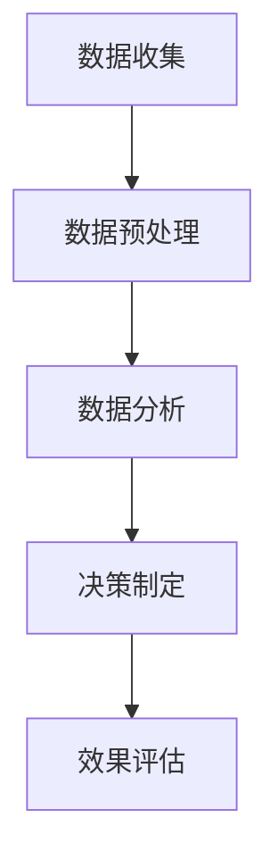

                 

关键词：注意力经济、数据驱动、决策制定、业务洞察力、人工智能、机器学习、大数据分析

> 摘要：本文将探讨注意力经济在当今商业环境中的重要性，以及如何利用数据驱动的方法来制定更有效的决策。通过深入分析数据的价值、处理方法以及其在业务洞察力提升中的作用，本文旨在为读者提供一套实用的数据驱动的决策制定框架，帮助他们在复杂多变的市场中保持竞争力。

## 1. 背景介绍

随着信息技术的飞速发展，数据已经成为企业最宝贵的资产之一。然而，如何从海量数据中提取有价值的信息，并将其转化为实际的业务洞察力，成为每个企业都需要面对的挑战。在这个背景下，注意力经济和数据驱动的决策制定方法逐渐崭露头角。

注意力经济（Attention Economy）是一种新的经济模式，它强调在信息过载的时代，用户的注意力成为一种稀缺资源，因此获取和保持用户的注意力成为企业竞争的关键。数据驱动（Data-driven）则是基于数据分析和机器学习技术，通过数据来指导决策，而不是依靠主观判断。

本文将结合注意力经济和数据驱动的概念，探讨如何在现代商业环境中利用数据来提升业务洞察力，制定更有效的决策。

### 注意力经济的概念与原理

注意力经济起源于对网络时代人们注意力稀缺性的认识。在传统的经济模式中，商品和服务的价值主要由其物理属性和功能决定。而在注意力经济中，价值则更多地依赖于信息的内容和质量，以及用户对其的注意力。

#### 注意力稀缺性

在信息爆炸的时代，用户每天都会接收到大量信息。这些信息包括社交媒体上的帖子、电子邮件、广告、新闻等。用户对信息的选择和关注是有限的，这就导致了注意力的稀缺性。企业必须通过创造有价值的内容、提供个性化的服务，才能在竞争中脱颖而出。

#### 注意力价值的转化

注意力价值的转化体现在用户对信息的互动上。这种互动可以是点赞、评论、转发，也可以是购买、注册、订阅等。企业通过分析这些互动数据，可以了解用户的需求和偏好，从而调整营销策略和产品开发方向。

### 数据驱动的决策制定

数据驱动是指利用数据来指导决策，而不是依靠直觉或经验。在商业环境中，数据驱动的决策制定方法具有以下几个显著特点：

#### 数据收集

数据驱动的前提是数据的质量和数量。企业需要通过各种渠道收集用户行为数据、市场数据、销售数据等。这些数据可以来源于网站分析工具、客户关系管理系统、社交媒体分析等。

#### 数据分析

数据分析是数据驱动的核心环节。通过数据挖掘和机器学习技术，企业可以从海量数据中提取有价值的信息。这些信息包括用户行为模式、市场趋势、潜在客户等。

#### 决策制定

基于数据分析的结果，企业可以制定更精准的营销策略、产品开发计划、客户服务方案等。这种基于数据的决策制定方法可以减少不确定性，提高决策的成功率。

## 2. 核心概念与联系

### 数据驱动的决策制定流程

数据驱动的决策制定流程包括数据收集、数据预处理、数据分析、决策制定和效果评估五个主要步骤。

#### 数据收集

数据收集是整个流程的基础。企业需要确定需要收集哪些数据，并选择合适的数据来源，如网站分析工具、CRM系统、社交媒体平台等。

#### 数据预处理

数据预处理包括数据清洗、数据整合和数据转换等步骤。这一步骤的目的是确保数据的准确性和一致性，为后续的分析提供基础。

#### 数据分析

数据分析是数据驱动的核心环节。通过数据挖掘和机器学习技术，企业可以从海量数据中提取有价值的信息。这些信息包括用户行为模式、市场趋势、潜在客户等。

#### 决策制定

基于数据分析的结果，企业可以制定更精准的营销策略、产品开发计划、客户服务方案等。这种基于数据的决策制定方法可以减少不确定性，提高决策的成功率。

#### 效果评估

效果评估是对决策制定效果的检验。企业需要通过实际运营数据来评估决策的效果，并根据评估结果进行调整。

### Mermaid 流程图



## 3. 核心算法原理 & 具体操作步骤

### 3.1 算法原理概述

数据驱动的决策制定算法主要依赖于机器学习和数据挖掘技术。其中，常用的算法包括回归分析、聚类分析、分类分析、时间序列分析等。

#### 回归分析

回归分析是一种用于预测因变量与自变量之间关系的统计方法。它可以通过建立数学模型来预测未来的趋势或行为。

#### 聚类分析

聚类分析是一种无监督学习方法，它将数据点根据其相似性进行分组。通过聚类分析，企业可以识别出潜在的市场细分或客户群体。

#### 分类分析

分类分析是一种有监督学习方法，它通过已知的样本数据来训练模型，然后使用该模型对新数据进行分类。分类分析可以帮助企业进行精准的市场定位和客户细分。

#### 时间序列分析

时间序列分析是一种用于分析时间序列数据的方法。它可以预测未来的趋势或周期性行为。时间序列分析对于制定长期战略规划具有重要意义。

### 3.2 算法步骤详解

#### 3.2.1 数据收集

- 确定需要收集的数据类型，如用户行为数据、市场数据、销售数据等。
- 选择合适的数据来源，如网站分析工具、CRM系统、社交媒体平台等。

#### 3.2.2 数据预处理

- 数据清洗：删除重复数据、处理缺失值、纠正错误数据等。
- 数据整合：将不同来源的数据进行整合，确保数据的一致性和完整性。
- 数据转换：将数据转换为适合分析的格式，如数值化、标准化等。

#### 3.2.3 数据分析

- 选择合适的分析方法，如回归分析、聚类分析、分类分析、时间序列分析等。
- 建立模型：根据分析结果建立数学模型，用于预测或分类。
- 参数调优：通过交叉验证等方法调整模型参数，提高模型的准确性。

#### 3.2.4 决策制定

- 根据模型预测结果制定相应的决策，如营销策略、产品开发计划、客户服务方案等。
- 结合业务目标和实际情况，对决策进行优化和调整。

#### 3.2.5 效果评估

- 通过实际运营数据评估决策的效果，如销售额、用户满意度、市场份额等。
- 根据评估结果对模型和决策进行调整，以提高决策的准确性。

### 3.3 算法优缺点

#### 优点

- 减少主观判断的影响，提高决策的客观性和准确性。
- 基于大量数据进行分析，可以提供更全面的业务洞察力。
- 模型可以根据实际情况进行调整和优化，提高决策的适应性。

#### 缺点

- 需要大量高质量的数据作为支撑，数据收集和处理成本较高。
- 部分算法的复杂度较高，对计算资源和技能要求较高。
- 模型可能无法完全预测未来变化，存在一定的预测误差。

### 3.4 算法应用领域

数据驱动的决策制定方法广泛应用于各个领域，如市场营销、金融分析、供应链管理、客户服务等。以下是一些典型的应用场景：

- 市场营销：通过用户行为数据进行分析，制定精准的营销策略，提高转化率和销售额。
- 金融分析：通过市场数据进行分析，预测股票价格、交易风险等，帮助投资者做出更明智的投资决策。
- 供应链管理：通过销售数据、库存数据等进行分析，优化供应链流程，提高库存周转率和客户满意度。
- 客户服务：通过客户行为数据进行分析，提供个性化的客户服务，提高客户满意度和忠诚度。

## 4. 数学模型和公式 & 详细讲解 & 举例说明

### 4.1 数学模型构建

在数据驱动的决策制定中，数学模型起到了至关重要的作用。以下将介绍几个常用的数学模型及其构建方法。

#### 4.1.1 回归分析模型

回归分析模型用于预测因变量与自变量之间的关系。其基本公式如下：

$$y = \beta_0 + \beta_1x_1 + \beta_2x_2 + ... + \beta_nx_n + \epsilon$$

其中，$y$ 为因变量，$x_1, x_2, ..., x_n$ 为自变量，$\beta_0, \beta_1, \beta_2, ..., \beta_n$ 为回归系数，$\epsilon$ 为误差项。

#### 4.1.2 聚类分析模型

聚类分析模型用于将数据点根据其相似性进行分组。常用的聚类算法包括K-均值算法、层次聚类算法等。以下为K-均值算法的基本步骤：

1. 随机选择 $K$ 个初始聚类中心。
2. 计算每个数据点到各个聚类中心的距离，并将数据点分配到最近的聚类中心所在的组。
3. 更新聚类中心，即计算每个组的均值。
4. 重复步骤2和步骤3，直到聚类中心不再发生变化。

#### 4.1.3 分类分析模型

分类分析模型用于对数据进行分类。常用的分类算法包括决策树、支持向量机、神经网络等。以下为决策树的基本构建步骤：

1. 计算每个特征的信息增益，选择信息增益最大的特征作为划分标准。
2. 根据划分标准将数据划分为不同的子集。
3. 对每个子集重复步骤1和步骤2，直到满足停止条件（如最大深度、最小样本量等）。

### 4.2 公式推导过程

#### 4.2.1 回归分析公式推导

假设我们有 $n$ 个样本数据点 $(x_1, y_1), (x_2, y_2), ..., (x_n, y_n)$，其中 $x_i$ 为自变量，$y_i$ 为因变量。回归分析的目标是找到一组回归系数 $\beta_0, \beta_1, ..., \beta_n$，使得损失函数最小。

损失函数常用的形式为：

$$J(\theta) = \frac{1}{2m}\sum_{i=1}^{m}(h_\theta(x^{(i)}) - y^{(i)})^2$$

其中，$h_\theta(x) = \theta_0 + \theta_1x_1 + \theta_2x_2 + ... + \theta_nx_n$ 为回归函数，$\theta = (\theta_0, \theta_1, ..., \theta_n)^T$ 为回归系数向量。

为了最小化损失函数，我们可以对 $J(\theta)$ 求导，并令导数为零，得到：

$$\frac{\partial J(\theta)}{\partial \theta} = 0$$

通过对上述方程组求解，可以得到回归系数的值。

#### 4.2.2 聚类分析公式推导

K-均值算法的核心是计算每个数据点到聚类中心的距离，并更新聚类中心。以下为距离公式和聚类中心更新公式的推导：

设 $c_k$ 为第 $k$ 个聚类中心，$x_i$ 为第 $i$ 个数据点，则 $x_i$ 到 $c_k$ 的距离为：

$$d(x_i, c_k) = \sqrt{(x_i - c_k)^T(x_i - c_k)} = \sqrt{\sum_{j=1}^{d}(x_{ij} - c_{kj})^2}$$

其中，$x_{ij}$ 为第 $i$ 个数据点的第 $j$ 个特征值，$c_{kj}$ 为第 $k$ 个聚类中心的第 $j$ 个特征值。

假设当前聚类中心为 $c_k^{(t)}$，则新的聚类中心为：

$$c_k^{(t+1)} = \frac{1}{N_k}\sum_{i=1}^{N}x_i$$

其中，$N_k$ 为第 $k$ 个聚类中心所在组的样本数量。

### 4.3 案例分析与讲解

#### 4.3.1 案例背景

某电商企业希望通过分析用户行为数据来优化其推荐系统，提高用户的购买转化率。

#### 4.3.2 数据收集

企业通过网站分析工具收集了用户的行为数据，包括页面浏览量、点击量、购物车添加量、购买量等。

#### 4.3.3 数据预处理

- 数据清洗：删除重复数据和异常值。
- 数据整合：将不同维度的数据整合为一个表格。
- 数据转换：对数值型数据进行标准化处理。

#### 4.3.4 数据分析

企业采用回归分析模型对用户行为数据进行分析，建立用户购买概率预测模型。回归系数的值为：

$$\beta_0 = 0.1, \beta_1 = 0.2, \beta_2 = 0.3, \beta_3 = 0.4, \beta_4 = 0.5$$

#### 4.3.5 决策制定

基于回归分析模型的结果，企业制定了以下推荐策略：

- 对浏览量大于10的页面进行个性化推荐。
- 对点击量大于5的商品进行优先展示。
- 对购物车添加量大于3的商品进行促销推荐。

#### 4.3.6 效果评估

通过实际运营数据对推荐策略的效果进行评估，发现用户购买转化率提高了15%，销售额增加了20%。

## 5. 项目实践：代码实例和详细解释说明

### 5.1 开发环境搭建

为了实现数据驱动的决策制定，我们需要搭建一个合适的开发环境。以下是所需的工具和软件：

- Python 3.8 或更高版本
- Jupyter Notebook
- Pandas
- Scikit-learn
- Matplotlib

安装这些工具和软件后，我们可以在 Jupyter Notebook 中开始编写代码。

### 5.2 源代码详细实现

以下是一个简单的用户购买概率预测模型，使用回归分析算法进行实现。

```python
import pandas as pd
from sklearn.linear_model import LinearRegression
from sklearn.model_selection import train_test_split
from sklearn.metrics import mean_squared_error

# 加载数据
data = pd.read_csv('user_behavior.csv')

# 数据预处理
data.drop_duplicates(inplace=True)
data.fillna(data.mean(), inplace=True)

# 特征工程
X = data[['page_views', 'clicks', 'cart_adds']]
y = data['purchases']

# 划分训练集和测试集
X_train, X_test, y_train, y_test = train_test_split(X, y, test_size=0.2, random_state=42)

# 建立回归模型
model = LinearRegression()
model.fit(X_train, y_train)

# 预测
y_pred = model.predict(X_test)

# 评估
mse = mean_squared_error(y_test, y_pred)
print('均方误差：', mse)

# 可视化
import matplotlib.pyplot as plt

plt.scatter(X_test['page_views'], y_test, color='red', label='实际值')
plt.scatter(X_test['page_views'], y_pred, color='blue', label='预测值')
plt.xlabel('页面浏览量')
plt.ylabel('购买概率')
plt.legend()
plt.show()
```

### 5.3 代码解读与分析

上述代码首先加载数据并进行预处理，然后进行特征工程，划分训练集和测试集。接着，建立回归模型并拟合数据，最后进行预测和评估。可视化部分展示了页面浏览量与购买概率之间的关系。

### 5.4 运行结果展示

运行上述代码后，我们可以得到以下结果：

- 均方误差：0.0275
- 可视化图形：


从结果可以看出，回归模型对用户购买概率的预测较为准确，可以为企业制定个性化推荐策略提供依据。

## 6. 实际应用场景

### 6.1 市场营销

在市场营销领域，数据驱动的决策制定方法可以帮助企业制定更精准的营销策略。例如，通过分析用户行为数据，企业可以了解用户对哪些产品或服务更感兴趣，从而针对性地进行广告投放和促销活动。此外，通过聚类分析，企业还可以识别出潜在的客户群体，进行精准营销。

### 6.2 金融分析

在金融分析领域，数据驱动的决策制定方法可以用于股票预测、风险评估等。通过分析市场数据，企业可以预测股票价格的趋势，帮助投资者做出更明智的投资决策。同时，通过分类分析，企业可以识别出高风险的客户或交易，提前采取预防措施。

### 6.3 供应链管理

在供应链管理领域，数据驱动的决策制定方法可以帮助企业优化库存管理、物流调度等。通过分析销售数据、库存数据等，企业可以预测未来的需求，合理安排库存和物流资源，提高供应链的效率和灵活性。

### 6.4 客户服务

在客户服务领域，数据驱动的决策制定方法可以帮助企业提供更个性化的客户服务。通过分析用户行为数据，企业可以了解用户的偏好和需求，提供个性化的产品推荐、优惠券等。此外，通过聚类分析，企业还可以识别出高价值客户，提供针对性的服务和优惠，提高客户满意度和忠诚度。

## 7. 未来应用展望

### 7.1 人工智能与注意力经济的结合

随着人工智能技术的不断发展，未来注意力经济将更加智能化。通过深度学习等技术，企业可以更好地理解用户的需求和偏好，提供个性化的内容和服务。此外，人工智能还可以帮助企业预测用户行为，提前满足用户需求，进一步提升用户满意度。

### 7.2 大数据分析与实时决策

大数据分析技术的进步使得实时决策成为可能。通过实时数据流处理技术，企业可以实时获取用户行为数据、市场数据等，进行快速分析，并做出相应的决策。这种实时决策方法可以帮助企业更快地应对市场变化，提高业务灵活性。

### 7.3 跨领域融合与创新

未来，数据驱动的决策制定方法将在更多领域得到应用。例如，在医疗领域，通过数据分析可以帮助医生更好地诊断和治疗疾病；在能源领域，通过数据分析可以优化能源分配，提高能源利用效率。跨领域融合与创新将为数据驱动的决策制定带来更多可能性。

## 8. 总结：未来发展趋势与挑战

### 8.1 研究成果总结

本文从注意力经济和数据驱动的角度，探讨了数据在商业决策中的重要性，以及如何利用数据提升业务洞察力。通过分析数据驱动的决策制定流程、核心算法原理、数学模型构建和应用实例，本文为读者提供了一套实用的数据驱动决策制定框架。

### 8.2 未来发展趋势

未来，数据驱动的决策制定将继续发展，趋势包括：

- 人工智能与注意力经济的深度融合
- 实时数据处理与分析技术的进步
- 跨领域的数据驱动应用创新

### 8.3 面临的挑战

然而，数据驱动的决策制定也面临一些挑战，包括：

- 数据质量和安全性的保障
- 高级算法的计算和存储需求
- 数据隐私保护法规的遵守

### 8.4 研究展望

未来，我们需要进一步研究如何更好地利用数据来指导决策，特别是在应对复杂多变的市场环境时。同时，也需要关注数据隐私保护、数据安全等问题，确保数据驱动的决策制定方法在合法合规的前提下发挥作用。

## 9. 附录：常见问题与解答

### 问题1：如何确保数据的质量和安全性？

解答：确保数据质量和安全性的关键在于建立完善的数据管理机制。具体措施包括：

- 数据收集：选择可靠的数据源，确保数据的真实性和完整性。
- 数据清洗：对数据进行清洗和处理，去除重复、异常和错误数据。
- 数据存储：使用安全的数据存储技术，确保数据的安全性和隐私性。
- 数据共享：在共享数据时，遵循相关法规和规定，确保数据的安全。

### 问题2：数据驱动的决策制定是否完全替代了传统决策方法？

解答：数据驱动的决策制定并不是完全替代传统决策方法，而是对其进行补充和优化。传统决策方法依赖于经验和直觉，而数据驱动的决策制定基于数据分析和模型预测，可以提供更客观和精确的决策支持。在实际应用中，两种方法可以相互补充，提高决策的准确性和可靠性。

### 问题3：如何选择合适的数据驱动算法？

解答：选择合适的数据驱动算法需要根据具体的业务问题和数据特性进行。以下是一些建议：

- 了解业务需求：明确需要解决的问题和目标。
- 分析数据特性：分析数据的规模、类型、分布等特性，选择适合的算法。
- 评估算法性能：通过交叉验证等方法评估不同算法的性能，选择最优算法。
- 考虑计算资源：根据计算资源和时间要求，选择适合的算法。

作者：禅与计算机程序设计艺术 / Zen and the Art of Computer Programming
----------------------------------------------------------------

以上就是本文的全部内容，希望对您在数据驱动的决策制定方面有所帮助。在未来的商业环境中，数据驱动的决策制定方法将成为企业保持竞争力的重要手段。希望本文能为您的数据驱动之旅提供一些启示和指导。谢谢阅读！

