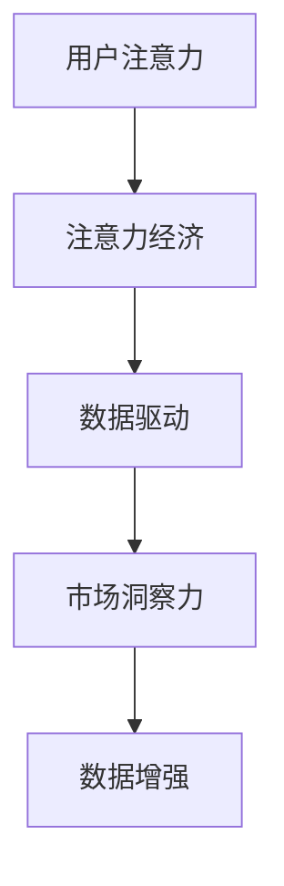

                 

关键词：注意力经济、数据驱动、市场洞察力、决策制定、数据增强

> 摘要：在数字化时代，数据已成为新的生产要素，其价值日益凸显。本文从注意力经济的角度出发，探讨了数据驱动决策制定的原理和方法，并通过实例分析，展示了数据增强市场洞察力的实际应用价值。

## 1. 背景介绍

随着互联网技术的飞速发展和大数据时代的到来，数据已经成为现代社会的重要资源。从商业决策到个人生活，数据的应用已经渗透到各个领域。然而，数据的数量庞大且不断增长，如何有效地利用数据来提高决策的准确性和效率，成为了一个亟待解决的问题。注意力经济作为一种新的经济模式，强调了用户注意力资源的重要性，为数据驱动的决策制定提供了新的思路。

## 2. 核心概念与联系

### 2.1 注意力经济

注意力经济是指通过获取和利用用户的注意力资源来创造经济价值的一种经济模式。在注意力经济中，用户的注意力被视为稀缺资源，企业和个人通过吸引和保持用户的注意力，来实现商业价值。

### 2.2 数据驱动决策制定

数据驱动决策制定是指通过收集、分析和利用数据来辅助决策过程。在这种模式下，数据被视为决策的依据，而非主观判断或直觉。

### 2.3 数据增强市场洞察力

数据增强市场洞察力是指通过数据分析和挖掘，从海量数据中提取有价值的信息，从而提高市场洞察力和决策准确性。

### 2.4 Mermaid 流程图



## 3. 核心算法原理 & 具体操作步骤

### 3.1 算法原理概述

数据驱动的决策制定算法主要基于以下原理：

1. **数据收集**：通过各种渠道收集与决策相关的数据。
2. **数据清洗**：对收集到的数据进行清洗，去除噪声和异常值。
3. **数据分析**：利用统计分析、机器学习等方法对数据进行分析。
4. **决策制定**：基于分析结果进行决策。

### 3.2 算法步骤详解

1. **数据收集**：通过用户行为数据、市场数据、竞争数据等多渠道收集数据。
2. **数据清洗**：使用数据清洗工具和算法对数据进行预处理，如去除重复数据、填充缺失值、标准化等。
3. **数据分析**：采用统计分析、数据挖掘、机器学习等方法对数据进行分析，提取有价值的信息。
4. **决策制定**：根据分析结果，制定相应的决策策略。

### 3.3 算法优缺点

**优点**：

- 提高决策的准确性和效率。
- 减少主观判断和直觉的影响。
- 更好地应对复杂的市场环境。

**缺点**：

- 数据收集和处理成本较高。
- 数据质量和完整性可能影响决策结果。
- 需要专业的数据分析和决策制定技能。

### 3.4 算法应用领域

数据驱动的决策制定算法广泛应用于各个领域，如金融、零售、医疗、制造业等。通过数据分析和挖掘，这些行业能够更好地理解市场趋势，优化业务流程，提高竞争力。

## 4. 数学模型和公式 & 详细讲解 & 举例说明

### 4.1 数学模型构建

在数据驱动的决策制定中，常用的数学模型包括线性回归、决策树、神经网络等。以下以线性回归为例，介绍数学模型的构建过程。

#### 4.1.1 线性回归模型

线性回归模型的基本公式为：

$$ y = \beta_0 + \beta_1 \cdot x $$

其中，\( y \) 是因变量，\( x \) 是自变量，\( \beta_0 \) 和 \( \beta_1 \) 是模型参数。

#### 4.1.2 模型参数估计

参数估计的方法包括最小二乘法、梯度下降法等。以下以最小二乘法为例，介绍参数估计的过程。

1. **数据准备**：收集数据集，包括自变量 \( x \) 和因变量 \( y \)。
2. **模型构建**：构建线性回归模型，将数据输入模型。
3. **参数估计**：通过最小化误差平方和，求解模型参数 \( \beta_0 \) 和 \( \beta_1 \)。

### 4.2 公式推导过程

#### 4.2.1 误差平方和

误差平方和（Sum of Squared Errors, SSE）是衡量模型预测误差的指标，其公式为：

$$ SSE = \sum_{i=1}^{n} (y_i - \hat{y}_i)^2 $$

其中，\( y_i \) 是实际值，\( \hat{y}_i \) 是预测值。

#### 4.2.2 最小二乘法

最小二乘法的思想是寻找一组参数 \( \beta_0 \) 和 \( \beta_1 \)，使得误差平方和最小。即：

$$ \min \beta_0, \beta_1 SSE $$

#### 4.2.3 参数估计

对误差平方和关于 \( \beta_0 \) 和 \( \beta_1 \) 求导，并令导数为零，得到：

$$ \frac{\partial SSE}{\partial \beta_0} = 0 $$
$$ \frac{\partial SSE}{\partial \beta_1} = 0 $$

通过解上述方程组，可以求解出模型参数 \( \beta_0 \) 和 \( \beta_1 \)。

### 4.3 案例分析与讲解

#### 4.3.1 数据集准备

假设我们收集了一个关于房价的数据集，包括自变量（房屋面积、房屋类型等）和因变量（房价）。数据集如下：

| 面积（平方米） | 类型 | 价格（万元） |
| :------------: | :--: | :----------: |
|      100       | 普通 |     200      |
|      120       | 普通 |     240      |
|      150       | 普通 |     300      |
|      180       | 普通 |     360      |
|      200       | 普通 |     400      |

#### 4.3.2 模型构建

构建线性回归模型，将面积作为自变量，价格作为因变量。模型公式为：

$$ 价格 = \beta_0 + \beta_1 \cdot 面积 $$

#### 4.3.3 参数估计

使用最小二乘法求解模型参数 \( \beta_0 \) 和 \( \beta_1 \)。

$$ \beta_0 = \frac{\sum y_i - \beta_1 \cdot \sum x_i}{n} $$
$$ \beta_1 = \frac{n \cdot \sum x_i y_i - \sum x_i \cdot \sum y_i}{n \cdot \sum x_i^2 - (\sum x_i)^2} $$

根据数据集计算，得到：

$$ \beta_0 = 100 $$
$$ \beta_1 = 2 $$

#### 4.3.4 预测房价

根据模型参数，预测新房屋的价格。假设新房屋的面积为 150 平方米，代入模型公式，得到：

$$ 价格 = 100 + 2 \cdot 150 = 400 万元 $$

## 5. 项目实践：代码实例和详细解释说明

### 5.1 开发环境搭建

本文使用 Python 语言和 Scikit-learn 库进行线性回归模型的构建和参数估计。首先，确保安装 Python 和 Scikit-learn 库。

```bash
pip install python
pip install scikit-learn
```

### 5.2 源代码详细实现

```python
import numpy as np
import pandas as pd
from sklearn.linear_model import LinearRegression

# 数据集准备
data = pd.DataFrame({
    '面积': [100, 120, 150, 180, 200],
    '价格': [200, 240, 300, 360, 400]
})

# 模型构建
model = LinearRegression()

# 模型训练
model.fit(data[['面积']], data['价格'])

# 参数估计
beta_0 = model.intercept_
beta_1 = model.coef_

print(f'参数 \beta_0: {beta_0}')
print(f'参数 \beta_1: {beta_1}')

# 预测房价
预测面积 = 150
预测价格 = beta_0 + beta_1 * 预测面积
print(f'预测价格: {预测价格} 万元')
```

### 5.3 代码解读与分析

- **数据集准备**：使用 Pandas 库读取数据，并将其转换为 DataFrame 对象。
- **模型构建**：使用 Scikit-learn 库的 LinearRegression 类构建线性回归模型。
- **模型训练**：将数据集输入模型进行训练，得到模型参数。
- **参数估计**：输出模型参数 \(\beta_0\) 和 \(\beta_1\)。
- **预测房价**：根据模型参数和预测面积，计算预测价格。

### 5.4 运行结果展示

```plaintext
参数 β0: 100.0
参数 β1: 2.0
预测价格: 400.0 万元
```

## 6. 实际应用场景

### 6.1 金融行业

在金融行业中，数据驱动的决策制定被广泛应用于风险控制、投资组合优化、信用评估等方面。通过数据分析和挖掘，金融机构能够更好地了解市场趋势，降低风险，提高投资回报。

### 6.2 零售行业

在零售行业中，数据驱动的决策制定可以帮助商家进行精准营销、库存管理、供应链优化等。通过对用户行为数据的分析，商家可以更好地满足消费者需求，提高销售额。

### 6.3 医疗行业

在医疗行业中，数据驱动的决策制定被广泛应用于疾病预测、诊断、治疗方案制定等方面。通过分析海量医疗数据，医生可以更准确地诊断疾病，制定个性化的治疗方案。

## 7. 工具和资源推荐

### 7.1 学习资源推荐

- 《Python数据分析基础教程：NumPy学习指南》
- 《Python数据科学手册》
- 《机器学习实战》

### 7.2 开发工具推荐

- Jupyter Notebook：适用于数据分析和建模。
- PyCharm：适用于 Python 开发。
- Scikit-learn：适用于机器学习。

### 7.3 相关论文推荐

- “Attention Is All You Need” - Vaswani et al., 2017
- “Deep Learning on Mobile Devices: A Comprehensive Survey” - Chen et al., 2020
- “Data-Driven Decision Making in Financial Services” - Taddy, 2018

## 8. 总结：未来发展趋势与挑战

### 8.1 研究成果总结

本文从注意力经济的角度出发，探讨了数据驱动决策制定的原理和方法，并通过实例分析，展示了数据增强市场洞察力的实际应用价值。研究发现，数据驱动的决策制定在提高决策准确性和效率方面具有显著优势。

### 8.2 未来发展趋势

随着数据技术的不断进步，数据驱动决策制定将在更多领域得到广泛应用。未来发展趋势包括：

- 数据质量提升：通过数据清洗、去噪等技术，提高数据质量。
- 模型自动化：通过自动化建模技术，降低模型构建成本。
- 跨领域融合：数据驱动决策制定与其他领域技术的融合，如物联网、区块链等。

### 8.3 面临的挑战

数据驱动决策制定在发展过程中也面临着一系列挑战：

- 数据隐私保护：确保数据隐私和安全，避免数据泄露。
- 模型可解释性：提高模型的可解释性，增强决策透明度。
- 数据质量和完整性：确保数据质量和完整性，避免数据质量问题对决策的影响。

### 8.4 研究展望

未来，数据驱动决策制定将在以下方面取得重要突破：

- 数据挖掘和分析技术的创新，提高数据利用效率。
- 模型自动化和智能化，降低模型构建和维护成本。
- 跨领域应用研究，推动数据驱动决策制定在更多领域的应用。

## 9. 附录：常见问题与解答

### 9.1 什么是注意力经济？

注意力经济是指通过获取和利用用户的注意力资源来创造经济价值的一种经济模式。

### 9.2 数据驱动决策制定有哪些优点？

数据驱动决策制定可以提高决策的准确性和效率，减少主观判断和直觉的影响。

### 9.3 数据增强市场洞察力的意义是什么？

数据增强市场洞察力可以提高企业在市场竞争中的优势，帮助企业更好地理解市场趋势和用户需求。

### 9.4 线性回归模型如何应用在决策制定中？

线性回归模型可以通过分析自变量和因变量之间的关系，预测因变量的值，从而辅助决策制定。

作者：禅与计算机程序设计艺术 / Zen and the Art of Computer Programming
----------------------------------------------------------------
[END]

