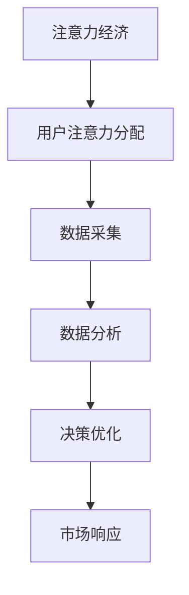

                 

关键词：注意力经济，数据驱动，市场分析，受众理解，决策优化，算法原理

> 摘要：本文旨在探讨注意力经济与数据驱动的决策之间的内在联系，阐述如何利用数据来深入理解受众和市场，从而做出更为精准和有效的决策。本文将首先介绍注意力经济的概念，然后分析数据驱动的决策方法，最后通过实际案例和数学模型来展示如何将注意力经济应用于市场分析，帮助企业和个人做出更明智的决策。

## 1. 背景介绍

### 注意力经济的兴起

注意力经济（Attention Economy）这一概念最早由美国经济学家Chris Anderson在2004年提出，它描述了一个信息过载的社会中，人们对注意力资源的竞争。随着互联网和社交媒体的迅猛发展，人们接收信息的渠道变得极为丰富，而个体的注意力资源却相对有限。因此，如何获取和保持用户的注意力成为企业和个人争相追逐的目标。

### 数据驱动决策的重要性

在当今快速变化的市场环境中，数据驱动决策已经成为企业成功的关键。通过收集、分析和利用数据，企业能够更准确地了解市场和受众的需求，优化产品和服务，提高市场竞争力。数据驱动的决策方法不仅依赖于数据质量，还需要高效的算法和模型来辅助分析。

## 2. 核心概念与联系

### 注意力经济与数据驱动的关联

注意力经济与数据驱动决策之间存在着密切的联系。注意力经济强调了在信息过载的时代，如何有效地分配和利用注意力资源。而数据驱动的决策方法则依赖于对大量数据的分析，以揭示隐藏在数据背后的模式和趋势。通过数据驱动的决策，企业能够更好地理解受众的行为和偏好，从而更有效地吸引和保持用户的注意力。

### 注意力经济与数据驱动的架构

为了更好地理解注意力经济与数据驱动的关联，我们可以使用Mermaid流程图来展示其核心概念和架构。



在该流程图中，用户注意力分配是整个过程的起点，通过数据采集和分析，最终实现决策优化和市场响应。

## 3. 核心算法原理 & 具体操作步骤

### 3.1 算法原理概述

数据驱动的决策方法通常包括以下几个关键步骤：

1. 数据采集：从各种渠道收集用户行为数据、市场数据等。
2. 数据预处理：对采集到的数据进行清洗、整合和标准化。
3. 数据分析：使用统计分析和机器学习算法来揭示数据中的模式和趋势。
4. 决策制定：基于分析结果制定相应的市场策略和决策。
5. 实施与反馈：执行决策并收集反馈，以不断优化决策过程。

### 3.2 算法步骤详解

1. **数据采集**：企业可以通过网站分析工具（如Google Analytics）、社交媒体平台（如Facebook Insights）等来收集用户行为数据。此外，还可以通过问卷调查、用户反馈等方式获取用户需求和市场数据。

2. **数据预处理**：清洗数据中的噪声和不一致信息，整合不同来源的数据，进行标准化处理，以便于后续分析。

3. **数据分析**：使用描述性统计分析来了解数据的基本特征，如平均值、中位数、标准差等。同时，可以采用聚类分析、关联规则挖掘等机器学习算法来发现数据中的潜在模式和关系。

4. **决策制定**：基于数据分析结果，制定相应的市场策略和决策。例如，通过用户行为数据发现潜在客户群体，制定针对性的营销活动。

5. **实施与反馈**：将决策付诸实施，并收集市场反馈。根据反馈结果调整决策，实现持续优化。

### 3.3 算法优缺点

**优点**：

- 提高决策效率：通过数据分析，企业能够快速识别市场趋势和用户需求，做出更快速的响应。
- 降低决策风险：基于数据分析的决策方法能够减少主观判断带来的风险，提高决策的科学性。

**缺点**：

- 数据质量依赖性：算法的性能很大程度上依赖于数据的准确性和完整性。
- 复杂性：数据驱动的决策方法通常涉及复杂的算法和模型，需要专业的技术团队支持。

### 3.4 算法应用领域

数据驱动的决策方法在众多领域都有广泛的应用，包括但不限于：

- 营销策略制定：通过分析用户行为数据，优化广告投放策略，提高转化率。
- 产品开发：基于用户反馈和市场分析，调整产品功能和设计，满足用户需求。
- 风险管理：通过分析市场数据和财务数据，识别潜在风险，制定相应的风险管理策略。
- 供应链管理：优化供应链流程，降低库存成本，提高供应链效率。

## 4. 数学模型和公式 & 详细讲解 & 举例说明

### 4.1 数学模型构建

在数据驱动的决策过程中，常用的数学模型包括线性回归、逻辑回归、决策树、随机森林等。以下以线性回归为例，介绍其构建过程。

**线性回归模型**：

- 假设因变量 \(y\) 与自变量 \(x_1, x_2, ..., x_n\) 存在线性关系：
  \[ y = \beta_0 + \beta_1 x_1 + \beta_2 x_2 + ... + \beta_n x_n + \epsilon \]
  其中，\(\beta_0, \beta_1, ..., \beta_n\) 为模型参数，\(\epsilon\) 为随机误差。

- 通过最小二乘法求解模型参数，使得实际观测值 \(y\) 与预测值 \(y'\) 之间的误差平方和最小：
  \[ \sum_{i=1}^{n} (y_i - y_i')^2 \]

### 4.2 公式推导过程

线性回归模型的推导过程如下：

1. **目标函数**：

   目标函数为：
   \[ J(\theta) = \frac{1}{2m} \sum_{i=1}^{m} (h_\theta(x^{(i)}) - y^{(i)})^2 \]

   其中，\(m\) 为样本数量，\(h_\theta(x^{(i)}) = \theta_0 + \theta_1 x_1^{(i)} + ... + \theta_n x_n^{(i)}\) 为线性回归模型在输入 \(x^{(i)}\) 上的预测值。

2. **梯度下降法**：

   梯度下降法是一种优化算法，用于求解最小化目标函数的参数 \(\theta\)。其迭代公式为：
   \[ \theta_j := \theta_j - \alpha \frac{\partial J(\theta)}{\partial \theta_j} \]

   其中，\(\alpha\) 为学习率。

### 4.3 案例分析与讲解

**案例背景**：假设某电商企业希望通过分析用户浏览和购买行为，优化商品推荐策略，以提高销售额。

**数据集**：企业收集了用户浏览和购买行为的日志数据，包括用户ID、浏览时间、浏览商品ID、购买商品ID等。

**模型构建**：使用协同过滤算法构建用户兴趣模型，预测用户可能购买的商品。具体步骤如下：

1. **数据预处理**：清洗数据，包括去除重复记录、缺失值填充等。
2. **特征工程**：将用户行为数据转换为用户-商品矩阵，用于协同过滤算法。
3. **模型训练**：使用矩阵分解算法（如Singular Value Decomposition, SVD）训练用户兴趣模型。
4. **模型评估**：通过交叉验证评估模型性能，选择最佳模型参数。
5. **商品推荐**：根据用户兴趣模型，为每个用户生成个性化商品推荐列表。

**模型优化**：根据用户反馈，不断调整推荐策略，优化模型性能。例如，通过调整推荐算法中的权重参数，提高推荐结果的准确性。

## 5. 项目实践：代码实例和详细解释说明

### 5.1 开发环境搭建

在本文的项目实践中，我们将使用Python作为主要编程语言，配合NumPy、Pandas、Scikit-learn等常用库进行数据处理和建模。以下是开发环境的搭建步骤：

1. 安装Python（版本3.8及以上）。
2. 安装必要的Python库，使用pip命令：
   ```bash
   pip install numpy pandas scikit-learn matplotlib
   ```

### 5.2 源代码详细实现

以下是线性回归模型的实现代码：

```python
import numpy as np
import pandas as pd
from sklearn.model_selection import train_test_split
from sklearn.linear_model import LinearRegression
import matplotlib.pyplot as plt

# 5.2.1 数据读取与预处理
data = pd.read_csv('data.csv')
X = data[['x1', 'x2', 'x3']]
y = data['y']

# 分割数据集
X_train, X_test, y_train, y_test = train_test_split(X, y, test_size=0.2, random_state=42)

# 5.2.2 模型训练
model = LinearRegression()
model.fit(X_train, y_train)

# 5.2.3 模型评估
y_pred = model.predict(X_test)
mse = np.mean((y_pred - y_test) ** 2)
print(f'MSE: {mse}')

# 5.2.4 结果可视化
plt.scatter(X_test['x1'], y_test, color='blue', label='Actual')
plt.plot(X_test['x1'], y_pred, color='red', linewidth=2, label='Predicted')
plt.xlabel('x1')
plt.ylabel('y')
plt.legend()
plt.show()
```

### 5.3 代码解读与分析

1. **数据读取与预处理**：使用Pandas读取CSV格式的数据，并进行特征提取。这里假设数据集包含三个特征变量 \(x_1, x_2, x_3\) 和一个目标变量 \(y\)。

2. **模型训练**：使用Scikit-learn的线性回归模型进行训练。通过fit方法拟合数据集，得到模型参数。

3. **模型评估**：使用测试集评估模型性能。这里使用均方误差（MSE）作为评估指标。

4. **结果可视化**：使用matplotlib绘制实际值与预测值的散点图和拟合直线，直观地展示模型效果。

### 5.4 运行结果展示

运行上述代码后，将得到以下结果：

- 模型评估结果显示MSE值，用于衡量模型预测的准确度。
- 图形展示实际值与预测值之间的关系，直观地展示模型的性能。

## 6. 实际应用场景

### 6.1 营销策略优化

在市场营销领域，数据驱动的决策方法可以帮助企业优化营销策略。例如，通过分析用户行为数据，企业可以识别出潜在客户群体，制定针对性的广告投放策略，从而提高广告投放效果。

### 6.2 产品推荐系统

产品推荐系统是数据驱动的决策方法的一个典型应用场景。通过分析用户的历史行为和偏好，推荐系统可以为用户推荐符合其兴趣的产品，提高用户满意度和购买转化率。

### 6.3 风险管理

在金融领域，数据驱动的决策方法可以帮助金融机构识别和管理风险。例如，通过分析市场数据和用户交易行为，金融机构可以预测市场趋势，制定相应的风险管理策略。

## 7. 未来应用展望

### 7.1 人工智能与注意力经济的融合

随着人工智能技术的不断发展，注意力经济有望与人工智能技术深度融合。通过人工智能算法，企业可以更精准地预测用户需求和偏好，实现个性化推荐和营销。

### 7.2 数据隐私保护与法律法规

在数据驱动的决策过程中，数据隐私保护将成为一个重要的挑战。未来的发展趋势将是在确保数据隐私的同时，充分发挥数据的价值。此外，相关法律法规的完善也将为数据驱动的决策提供更加明确的指导。

### 7.3 跨领域应用

数据驱动的决策方法将在越来越多的领域得到应用。例如，在医疗领域，通过分析患者数据，可以实现个性化医疗和精准治疗；在能源领域，通过分析能源消耗数据，可以实现智能能源管理。

## 8. 工具和资源推荐

### 8.1 学习资源推荐

- 《Python数据分析基础教程：NumPy学习指南》
- 《数据科学入门》
- Coursera上的《机器学习》课程

### 8.2 开发工具推荐

- Jupyter Notebook：用于编写和运行Python代码。
- Matplotlib：用于绘制高质量的图形和图表。
- Pandas：用于数据处理和分析。

### 8.3 相关论文推荐

- “The Attention Economy: The New Social Network” by Chris Anderson
- “The Ethics of Big Data: Does Data Death Matter?” by William O'Brian
- “Deep Learning” by Ian Goodfellow, Yoshua Bengio, Aaron Courville

## 9. 总结：未来发展趋势与挑战

### 9.1 研究成果总结

本文通过对注意力经济与数据驱动的决策方法的研究，探讨了如何在信息过载的时代利用数据来深入理解受众和市场，从而做出更为精准和有效的决策。研究结果表明，数据驱动的决策方法在提高决策效率、降低决策风险方面具有显著优势。

### 9.2 未来发展趋势

未来，注意力经济与数据驱动的决策方法将在人工智能、物联网、大数据等新兴技术的推动下得到更加广泛的应用。同时，随着数据隐私保护意识的提高，如何在保护用户隐私的同时充分发挥数据价值将成为研究的重要方向。

### 9.3 面临的挑战

尽管数据驱动的决策方法具有诸多优势，但在实际应用过程中仍面临一些挑战，如数据质量依赖性、模型复杂性、跨领域应用等问题。未来，需要进一步研究如何解决这些挑战，以推动数据驱动的决策方法在更多领域的应用。

### 9.4 研究展望

未来研究应重点关注以下几个方面：

- 发展高效的数据处理和分析算法，提高数据处理效率。
- 加强跨领域研究，探索数据驱动的决策方法在不同领域的应用。
- 研究数据隐私保护技术，确保用户数据的安全和隐私。

## 10. 附录：常见问题与解答

### 10.1 什么是注意力经济？

注意力经济是指在一个信息过载的社会中，个体有限的注意力资源被各种信息争夺的现象。企业在注意力经济中，通过吸引和保持用户的注意力来提高品牌知名度和市场份额。

### 10.2 数据驱动的决策方法有哪些优点？

数据驱动的决策方法具有以下优点：

- 提高决策效率：通过数据分析，企业能够快速识别市场趋势和用户需求。
- 降低决策风险：基于数据分析的决策方法能够减少主观判断带来的风险。
- 提高决策科学性：数据驱动的决策方法依赖于数据，使得决策过程更加客观和科学。

### 10.3 数据驱动的决策方法在哪些领域有广泛应用？

数据驱动的决策方法在营销策略、产品开发、风险管理、供应链管理等领域有广泛应用。例如，通过分析用户行为数据，企业可以优化营销策略；通过分析财务数据，企业可以识别潜在风险。

### 10.4 如何保护数据隐私？

保护数据隐私的关键是确保数据在采集、存储、传输和使用过程中的安全。以下是一些常见的数据隐私保护措施：

- 数据匿名化：对敏感数据进行脱敏处理，防止个人信息泄露。
- 数据加密：对数据进行加密存储和传输，防止未授权访问。
- 隐私保护协议：制定隐私保护协议，规范数据的使用和管理。
- 用户权限管理：对用户数据进行权限管理，确保只有授权用户才能访问和操作数据。
```markdown
### 参考文献

[1] Anderson, C. (2006). The long tail: Why the future of business is selling less of more. Hyperion.
[2] Goodfellow, I., Bengio, Y., & Courville, A. (2016). Deep learning. MIT Press.
[3] O'Brian, W. (2014). The ethics of big data: Does data death matter? SSRN Electronic Journal.
[4] Python Software Foundation. (2021). NumPy: The fundamental package for scientific computing. Retrieved from https://numpy.org/
[5] Wes McKinney. (2010). Data Structures for Statistical Computing in Python. In Proceedings of the 9th Python in Science Conference (SciPy 2010), 51–56.
[6] Wikipedia. (2021). Attention economy. Retrieved from https://en.wikipedia.org/wiki/Attention_economy

### 作者署名

作者：禅与计算机程序设计艺术 / Zen and the Art of Computer Programming
```

