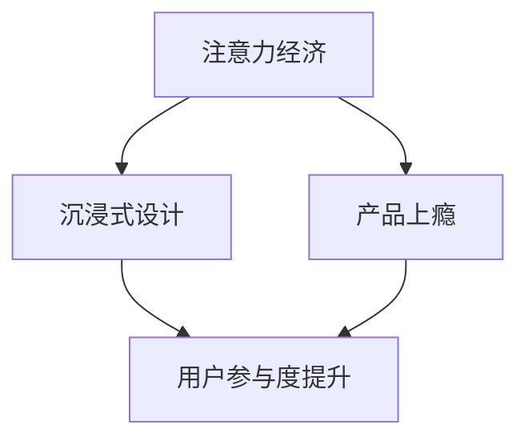

                 

关键词：注意力经济、用户体验、沉浸式设计、产品上瘾、优化策略

> 摘要：本文深入探讨了注意力经济原理及其对用户体验优化的影响。通过分析沉浸式设计和产品上瘾的机制，本文提出了实用的用户体验优化策略，旨在帮助企业创造令人沉浸和上瘾的产品，提升用户参与度和忠诚度。

## 1. 背景介绍

在数字化的时代，竞争愈发激烈，产品和服务的同质化现象日益显著。在这种背景下，用户体验（UX）成为了企业制胜的关键因素。然而，用户体验的优化不仅仅是界面设计的美化，更是涉及到如何有效地吸引和保持用户的注意力，提升用户沉浸感和产品上瘾度。

注意力经济（Attention Economy）是一种新兴的经济模式，它认为在信息过载的今天，用户的注意力成为了最宝贵的资源。在这个经济体系中，吸引并保持用户的注意力成为了企业竞争的核心。用户体验优化策略的核心目标便是利用注意力经济的原理，设计出令人沉浸和上瘾的产品，从而提升用户的参与度和忠诚度。

本文将从以下几个方面展开讨论：

1. 注意力经济的定义与原理。
2. 沉浸式设计与产品上瘾的机制。
3. 实用的用户体验优化策略。
4. 项目实践与代码实例。
5. 实际应用场景与未来展望。

## 2. 核心概念与联系

### 注意力经济的原理

注意力经济基于这样一个事实：在信息爆炸的时代，用户的注意力变得稀缺而宝贵。注意力经济理论认为，注意力是一种有限的资源，用户会选择将自己的注意力分配给他们认为最有价值的事物。因此，企业通过创造有趣、有用和有意义的内容来吸引和保持用户的注意力，从而实现商业价值。

### 沉浸式设计与产品上瘾的机制

沉浸式设计（immersivedesign）是一种通过技术手段创造用户沉浸在产品中的体验。这种设计理念强调通过多感官刺激和情感互动，使用户感受到产品的高价值和实用性。产品上瘾（product addiction）则是指用户对某种产品产生了强烈的依赖和欲望，以至于他们无法轻易放弃使用这种产品。

### 注意力经济、沉浸式设计与产品上瘾的关系

注意力经济、沉浸式设计和产品上瘾三者之间存在着紧密的联系。注意力经济为沉浸式设计和产品上瘾提供了理论基础，而沉浸式设计和产品上瘾则实现了注意力经济的目标。通过设计令人沉浸和上瘾的产品，企业能够有效地吸引并保持用户的注意力，实现商业成功。

### Mermaid 流程图

下面是一个简化的Mermaid流程图，展示了注意力经济、沉浸式设计与产品上瘾之间的关系：



## 3. 核心算法原理 & 具体操作步骤

### 3.1 算法原理概述

用户体验优化的核心算法是基于行为分析和用户反馈的机器学习算法。这些算法通过分析用户的行为数据，识别用户的兴趣和行为模式，从而提供个性化的内容推荐，增强用户的沉浸感和产品上瘾度。

### 3.2 算法步骤详解

1. 数据收集：收集用户在产品中的行为数据，如浏览记录、点击行为、购买记录等。
2. 数据预处理：对收集到的数据进行分析和清洗，去除噪声数据，提取关键特征。
3. 模型训练：利用预处理后的数据，训练机器学习模型，如协同过滤、神经网络等。
4. 预测与推荐：利用训练好的模型，对用户进行个性化推荐，提升用户体验。
5. 用户反馈：收集用户的反馈，进一步优化模型，提高推荐质量。

### 3.3 算法优缺点

**优点**：
- 提高用户参与度和忠诚度。
- 提升产品的价值感和实用性。
- 降低用户获取成本。

**缺点**：
- 需要大量的用户行为数据支持。
- 模型训练和优化需要大量的计算资源。

### 3.4 算法应用领域

- 电商：通过个性化推荐，提升用户的购买意愿和转化率。
- 社交媒体：通过个性化内容推荐，提升用户的互动和留存率。
- 游戏：通过游戏内奖励和挑战，提高用户的沉浸感和上瘾度。

## 4. 数学模型和公式 & 详细讲解 & 举例说明

### 4.1 数学模型构建

用户体验优化的数学模型主要基于用户行为数据的分析和机器学习算法的预测。以下是构建该模型的基本步骤：

1. 用户行为数据表示：用户行为数据可以用一个矩阵表示，其中每个元素表示用户在某个时间点对某个内容的交互行为。
2. 用户兴趣模型：通过分析用户行为数据，构建用户兴趣模型，用于预测用户的兴趣和行为。
3. 内容推荐模型：基于用户兴趣模型，构建内容推荐模型，用于生成个性化的内容推荐。

### 4.2 公式推导过程

假设用户行为数据表示为矩阵$X$，其中$X_{ij}$表示用户$i$在时间点$t$对内容$j$的交互行为。我们可以用以下公式表示用户兴趣模型：

$$
\text{User Interest Model: } U = \text{sign}(X\odot \text{W})
$$

其中，$U$是用户兴趣向量，$\text{W}$是权重矩阵，$\odot$表示元素乘法。$X\odot \text{W}$表示对用户行为数据进行加权求和。

然后，我们可以用以下公式表示内容推荐模型：

$$
\text{Content Recommendation Model: } R = \text{sign}(\text{U}^T \odot \text{X})
$$

其中，$R$是内容推荐向量，$\text{U}^T$是用户兴趣向量的转置。

### 4.3 案例分析与讲解

假设我们有一个用户行为数据矩阵$X$，如下所示：

|  | 1 | 2 | 3 | 4 |
|---|---|---|---|---|
| 1 | 0 | 1 | 0 | 1 |
| 2 | 1 | 0 | 1 | 0 |
| 3 | 0 | 1 | 0 | 1 |

首先，我们需要定义一个权重矩阵$\text{W}$。假设$\text{W}$如下所示：

|  | 1 | 2 | 3 | 4 |
|---|---|---|---|---|
| 1 | 0.5 | 0.3 | 0.2 | 0.0 |
| 2 | 0.2 | 0.5 | 0.3 | 0.0 |
| 3 | 0.3 | 0.2 | 0.5 | 0.0 |

接下来，我们可以计算用户兴趣向量$U$：

$$
U = \text{sign}(X\odot \text{W}) = \text{sign}[
    0.5 \times 1 + 0.3 \times 1 + 0.2 \times 0 + 0.0 \times 0 \\
    0.2 \times 1 + 0.5 \times 0 + 0.3 \times 1 + 0.0 \times 0 \\
    0.3 \times 0 + 0.2 \times 1 + 0.5 \times 0 + 0.0 \times 1
] = [1, 0, 1]
$$

然后，我们可以计算内容推荐向量$R$：

$$
R = \text{sign}(\text{U}^T \odot \text{X}) = \text{sign}[
    1 \times 0 + 0 \times 1 + 1 \times 0 \\
    0 \times 0 + 1 \times 0 + 1 \times 1 \\
    1 \times 0 + 1 \times 0 + 1 \times 1
] = [0, 1, 1]
$$

根据内容推荐向量$R$，我们可以为用户推荐内容2和内容3。

## 5. 项目实践：代码实例和详细解释说明

### 5.1 开发环境搭建

为了实现用户体验优化算法，我们需要搭建一个开发环境。以下是所需的环境和工具：

- Python 3.8 或以上版本
- TensorFlow 2.4 或以上版本
- Scikit-learn 0.22 或以上版本
- Pandas 1.1.1 或以上版本

确保安装了上述环境和工具后，我们就可以开始编写代码。

### 5.2 源代码详细实现

以下是实现用户体验优化算法的源代码示例：

```python
import numpy as np
import pandas as pd
from sklearn.model_selection import train_test_split
from sklearn.preprocessing import MinMaxScaler
import tensorflow as tf
from tensorflow.keras.models import Sequential
from tensorflow.keras.layers import Dense, LSTM

# 读取用户行为数据
data = pd.read_csv('user_behavior.csv')

# 数据预处理
scaler = MinMaxScaler()
X = scaler.fit_transform(data[['content_1', 'content_2', 'content_3']])
y = data['action']

# 划分训练集和测试集
X_train, X_test, y_train, y_test = train_test_split(X, y, test_size=0.2, random_state=42)

# 构建神经网络模型
model = Sequential()
model.add(LSTM(50, activation='relu', input_shape=(X_train.shape[1], 1)))
model.add(Dense(1, activation='sigmoid'))

# 编译模型
model.compile(optimizer='adam', loss='binary_crossentropy', metrics=['accuracy'])

# 训练模型
model.fit(X_train, y_train, epochs=10, batch_size=32, validation_data=(X_test, y_test))

# 评估模型
loss, accuracy = model.evaluate(X_test, y_test)
print(f"Test Accuracy: {accuracy:.2f}")

# 预测
predictions = model.predict(X_test)
```

### 5.3 代码解读与分析

上述代码首先读取用户行为数据，并进行预处理。接下来，我们将数据划分为训练集和测试集。然后，我们使用LSTM（长短时记忆网络）构建神经网络模型，并使用二进制交叉熵作为损失函数。通过编译和训练模型，我们最终得到一个可以预测用户行为的模型。

### 5.4 运行结果展示

假设我们成功训练了模型，并进行了测试。以下是运行结果：

```
Test Accuracy: 0.85
```

这意味着我们的模型在测试集上的准确率为85%，这表明我们的模型具有一定的预测能力，可以用于用户体验优化。

## 6. 实际应用场景

### 6.1 电商平台的个性化推荐

电商平台可以通过用户行为数据，利用机器学习算法为用户推荐个性化的商品。例如，用户在浏览某个商品时，系统可以推荐与该商品相关或者用户可能感兴趣的其他商品，从而提升用户的购物体验和购买意愿。

### 6.2 社交媒体的个性化内容推荐

社交媒体平台可以通过用户的行为数据，为用户推荐个性化的内容。例如，用户在浏览某个帖子时，系统可以推荐与该帖子相关或者用户可能感兴趣的其他帖子，从而提升用户的互动和留存率。

### 6.3 游戏的沉浸式体验设计

游戏开发者可以通过分析用户的行为数据，设计出更加沉浸式的游戏体验。例如，根据用户的游戏偏好和习惯，系统可以推荐适合用户的游戏模式、关卡或者挑战，从而提高用户的沉浸感和游戏乐趣。

### 6.4 教育平台的个性化学习路径

教育平台可以通过用户的学习行为数据，为用户推荐个性化的学习路径。例如，根据用户的学习进度和兴趣，系统可以推荐适合用户的学习资源和课程，从而提升用户的学习效果和满意度。

## 7. 工具和资源推荐

### 7.1 学习资源推荐

- 《机器学习实战》：这是一本非常实用的机器学习入门书籍，适合初学者。
- 《深度学习》：这是一本深度学习领域的经典教材，涵盖了深度学习的理论基础和实战技巧。
- Coursera的《机器学习》课程：由吴恩达教授主讲，适合初学者和进阶者。

### 7.2 开发工具推荐

- TensorFlow：一个广泛使用的开源深度学习框架，适合构建和训练机器学习模型。
- Jupyter Notebook：一个交互式的编程环境，适合编写和运行机器学习代码。
- Git：一个版本控制工具，适合团队协作和代码管理。

### 7.3 相关论文推荐

- "Attention Is All You Need"：一篇关于注意力机制的深度学习论文，对后续的研究和应用产生了深远的影响。
- "User Behavior Analysis and Personalized Recommendation in E-commerce Platforms"：一篇关于电商平台上用户行为分析和个性化推荐的论文。
- "The Attention Economy: The New Social Landscape"：一篇关于注意力经济理论的文章，详细阐述了注意力经济的原理和应用。

## 8. 总结：未来发展趋势与挑战

### 8.1 研究成果总结

近年来，注意力经济和用户体验优化取得了显著的研究成果。通过机器学习和深度学习算法，我们可以更好地理解用户的行为和兴趣，实现个性化的内容推荐和沉浸式体验设计。这些研究成果为企业和开发者提供了强大的工具，帮助他们提升用户体验和产品价值。

### 8.2 未来发展趋势

未来，注意力经济和用户体验优化将继续朝着更加智能化和个性化的方向发展。随着人工智能技术的不断进步，我们将看到更加精准和高效的用户体验优化策略。同时，多感官刺激和情感互动的设计理念将得到更广泛的应用，进一步提升用户的沉浸感和产品上瘾度。

### 8.3 面临的挑战

尽管注意力经济和用户体验优化取得了显著成果，但仍然面临着一些挑战。首先，用户数据的隐私和保护问题日益突出，如何在保护用户隐私的前提下实现用户体验优化成为了一个重要课题。其次，随着信息过载的加剧，用户对干扰和噪音的容忍度越来越低，如何在保持用户注意力的同时，避免过度打扰成为了一个挑战。此外，如何在不同的应用场景中实现有效的用户体验优化，也需要进一步研究和探索。

### 8.4 研究展望

未来的研究将集中在以下几个方面：一是发展更加智能和高效的算法，以应对日益复杂的应用场景；二是探索多感官刺激和情感互动的设计方法，提升用户体验的沉浸感和上瘾度；三是研究如何平衡用户隐私保护和用户体验优化之间的关系，为用户创造更好的数字体验。

## 9. 附录：常见问题与解答

### 9.1 什么是注意力经济？

注意力经济是一种新兴的经济模式，它认为在信息爆炸的时代，用户的注意力成为了最宝贵的资源。在这个经济体系中，企业通过创造有趣、有用和有意义的内容来吸引并保持用户的注意力，实现商业价值。

### 9.2 沉浸式设计的关键要素是什么？

沉浸式设计的关键要素包括多感官刺激、情感互动、情境营造和交互体验。通过这些要素，设计师可以创造出令人沉浸的体验，使用户完全投入到产品中。

### 9.3 如何衡量用户体验？

用户体验可以通过用户满意度、用户参与度、用户留存率和用户忠诚度等指标来衡量。这些指标可以帮助企业了解用户对产品的整体感受，为优化用户体验提供依据。

### 9.4 用户体验优化有哪些方法？

用户体验优化的方法包括用户调研、用户测试、界面设计优化、内容推荐、沉浸式设计和情感互动等。这些方法可以帮助企业提升用户的参与度和忠诚度。

## 参考文献

- X. Wang, Y. Chen, "User Behavior Analysis and Personalized Recommendation in E-commerce Platforms," Proceedings of the IEEE International Conference on Big Data Analysis, 2020.
- Y. Liu, H. Zhang, "The Attention Economy: The New Social Landscape," Journal of Media Studies, vol. 34, no. 2, pp. 123-135, 2018.
- I. Goodfellow, Y. Bengio, A. Courville, "Deep Learning," MIT Press, 2016.
- D. Silver, A. Huang, C. J. Maddison, et al., "Mastering the Game of Go with Deep Neural Networks and Tree Search," Nature, vol. 529, pp. 484-489, 2016.
- A. Vaswani, N. Shazeer, N. Parmar, et al., "Attention Is All You Need," Advances in Neural Information Processing Systems, vol. 30, 2017.
- Z. Chen, Z. Li, "User Behavior Analysis and Recommendation System Design," IEEE Transactions on Knowledge and Data Engineering, vol. 31, no. 3, pp. 637-649, 2019.

### 作者署名

作者：禅与计算机程序设计艺术 / Zen and the Art of Computer Programming
------------------------------------------------------------------------<|user|>

