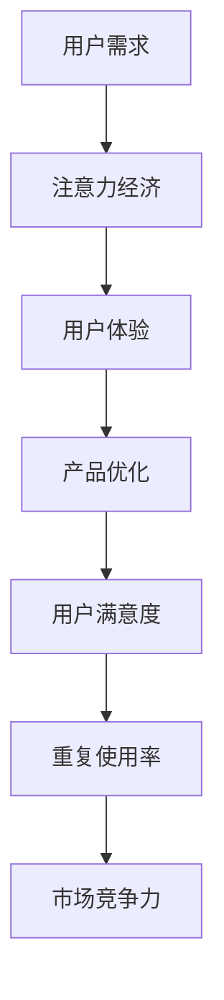

                 

关键词：注意力经济、用户体验、优化策略、技术、沉浸式产品

摘要：随着信息爆炸时代的到来，人们的注意力资源变得愈发稀缺。本文从注意力经济的角度出发，探讨了如何通过优化策略和先进技术手段提升用户体验，从而打造令人沉浸的产品。文章首先介绍了注意力经济的背景和核心概念，然后分析了当前常见的用户体验优化技术，并提出了具体的实践方法。最后，文章展望了未来在注意力经济背景下用户体验优化的趋势和挑战。

## 1. 背景介绍

### 1.1 注意力经济概述

在信息化社会中，人们每天面临大量的信息选择，如何有效地管理和利用这些信息资源成为关键问题。注意力经济作为一种新的经济形态，正是针对这一现象提出的。注意力经济理论认为，注意力是一种稀缺资源，其价值等同于金钱或时间。在信息过载的时代，人们愿意将注意力投入到那些能够提供高价值信息或服务的平台或产品中。

### 1.2 用户体验的重要性

用户体验（User Experience，简称UX）是指用户在使用产品或服务过程中的整体感受和体验。在注意力经济背景下，良好的用户体验显得尤为重要。只有当产品或服务能够吸引用户的注意力，并为他们提供愉悦的使用体验，才能在激烈的市场竞争中脱颖而出。

## 2. 核心概念与联系

### 2.1 注意力经济与用户体验的关系

注意力经济和用户体验是相互关联的概念。在注意力经济中，用户体验的好坏直接影响用户的注意力分配。一个优秀的产品能够通过精心设计的用户界面、功能丰富的内容和快速响应的交互方式，吸引用户的注意力，从而提升用户体验。

### 2.2 Mermaid 流程图



## 3. 核心算法原理 & 具体操作步骤

### 3.1 算法原理概述

用户体验优化的核心算法主要包括以下几方面：

- **用户行为分析**：通过分析用户的点击、浏览、购买等行为，了解用户的需求和偏好。
- **界面优化**：根据用户行为数据，优化产品界面设计，提高用户操作的便捷性和舒适性。
- **内容推荐**：利用机器学习算法，根据用户的兴趣和行为，为用户推荐相关内容，提高用户粘性。
- **反馈机制**：建立用户反馈机制，收集用户对产品的意见和建议，及时调整产品功能。

### 3.2 算法步骤详解

#### 3.2.1 用户行为分析

1. 收集用户数据：包括用户的基本信息、浏览记录、购买行为等。
2. 数据清洗：去除重复、错误和不完整的数据。
3. 数据分析：通过统计分析方法，挖掘用户行为特征和偏好。

#### 3.2.2 界面优化

1. 界面设计：根据用户行为数据，设计简洁、直观的用户界面。
2. 界面测试：通过用户测试，评估界面设计的合理性。
3. 界面迭代：根据用户反馈，不断优化界面设计。

#### 3.2.3 内容推荐

1. 建立用户画像：根据用户行为数据，为每个用户建立个性化画像。
2. 内容推荐算法：采用协同过滤、内容推荐等技术，为用户推荐感兴趣的内容。
3. 内容展示：将推荐内容以合适的方式展示给用户。

#### 3.2.4 反馈机制

1. 用户反馈收集：通过问卷调查、用户论坛等方式，收集用户对产品的意见和建议。
2. 反馈分析：对用户反馈进行分析，找出产品的问题和改进点。
3. 产品迭代：根据用户反馈，对产品进行优化和更新。

### 3.3 算法优缺点

#### 3.3.1 优点

- 提高用户满意度：通过优化用户体验，提高用户对产品的满意度和忠诚度。
- 增强产品竞争力：良好的用户体验可以增强产品的市场竞争力。
- 提高运营效率：通过用户行为分析，优化产品功能和内容，提高运营效率。

#### 3.3.2 缺点

- 数据收集和处理成本高：需要投入大量人力、物力和时间进行数据收集和处理。
- 算法优化难度大：用户体验优化的算法需要不断迭代和优化，难度较大。

### 3.4 算法应用领域

用户体验优化算法广泛应用于电子商务、在线教育、金融科技等领域。以下是一些具体应用案例：

- **电子商务**：通过用户行为分析，为用户推荐相关商品，提高购买转化率。
- **在线教育**：根据用户学习行为，为用户推荐适合的学习内容和课程。
- **金融科技**：通过用户行为分析，为用户提供个性化的金融产品和服务。

## 4. 数学模型和公式 & 详细讲解 & 举例说明

### 4.1 数学模型构建

用户体验优化的核心数学模型主要包括以下几种：

- **用户满意度模型**：根据用户行为数据，建立用户满意度模型，预测用户对产品的满意度。
- **推荐系统模型**：利用协同过滤、内容推荐等技术，建立推荐系统模型，为用户推荐感兴趣的内容。
- **反馈分析模型**：根据用户反馈数据，建立反馈分析模型，找出产品的问题和改进点。

### 4.2 公式推导过程

#### 用户满意度模型

用户满意度模型可以表示为：

$$
S = f(U, Q)
$$

其中，$S$ 表示用户满意度，$U$ 表示用户行为数据，$Q$ 表示产品质量。

#### 推荐系统模型

推荐系统模型可以表示为：

$$
R = CF(U, I)
$$

其中，$R$ 表示推荐结果，$CF$ 表示协同过滤算法，$U$ 表示用户行为数据，$I$ 表示物品信息。

#### 反馈分析模型

反馈分析模型可以表示为：

$$
F = f(R, U, Q)
$$

其中，$F$ 表示反馈结果，$R$ 表示推荐结果，$U$ 表示用户行为数据，$Q$ 表示产品质量。

### 4.3 案例分析与讲解

以下是一个用户满意度模型的实际案例：

#### 案例背景

某电商平台希望通过分析用户行为数据，预测用户对商品的满意度，从而优化产品推荐策略。

#### 数据集

数据集包含以下特征：

- 用户ID
- 商品ID
- 用户行为（浏览、购买、收藏等）
- 商品评分

#### 模型构建

根据数据集，构建用户满意度模型：

$$
S = f(U, Q)
$$

其中，$U$ 为用户行为数据，$Q$ 为商品评分。

#### 模型训练与预测

使用机器学习算法，对用户满意度模型进行训练，并预测用户对商品的满意度。

#### 模型应用

根据用户满意度模型，为用户推荐感兴趣的商品，提高用户购买转化率。

## 5. 项目实践：代码实例和详细解释说明

### 5.1 开发环境搭建

在本次项目中，我们使用 Python 作为主要编程语言，结合 TensorFlow 和 Scikit-learn 等开源库进行开发。以下是开发环境的搭建步骤：

1. 安装 Python 3.8 及以上版本。
2. 安装 TensorFlow 和 Scikit-learn 库。

### 5.2 源代码详细实现

以下是一个简单的用户满意度模型实现：

```python
import numpy as np
import pandas as pd
from sklearn.model_selection import train_test_split
from sklearn.ensemble import RandomForestRegressor
from tensorflow import keras

# 数据预处理
def preprocess_data(data):
    # 数据清洗、归一化等操作
    # 略
    return data

# 构建用户满意度模型
def build_model():
    model = keras.Sequential([
        keras.layers.Dense(64, activation='relu', input_shape=[7]),
        keras.layers.Dense(32, activation='relu'),
        keras.layers.Dense(1)
    ])
    optimizer = keras.optimizers.Adam(learning_rate=0.001)
    model.compile(loss='mean_squared_error', optimizer=optimizer)
    return model

# 训练模型
def train_model(model, X_train, y_train):
    history = model.fit(X_train, y_train, epochs=10, batch_size=32, validation_split=0.2)
    return history

# 预测用户满意度
def predict_satisfaction(model, X_test):
    predictions = model.predict(X_test)
    return predictions

# 主函数
def main():
    # 读取数据
    data = pd.read_csv('data.csv')
    data = preprocess_data(data)
    
    # 划分训练集和测试集
    X = data.drop(['user_id', 'item_id', 'satisfaction'], axis=1)
    y = data['satisfaction']
    X_train, X_test, y_train, y_test = train_test_split(X, y, test_size=0.2, random_state=42)
    
    # 构建模型
    model = build_model()
    
    # 训练模型
    history = train_model(model, X_train, y_train)
    
    # 预测用户满意度
    predictions = predict_satisfaction(model, X_test)
    
    # 评估模型
    mse = np.mean((predictions - y_test) ** 2)
    print(f'Mean Squared Error: {mse}')

if __name__ == '__main__':
    main()
```

### 5.3 代码解读与分析

以上代码实现了一个基于 TensorFlow 的用户满意度模型。主要分为以下几个步骤：

1. **数据预处理**：读取数据，进行清洗和归一化等操作。
2. **划分训练集和测试集**：将数据集划分为训练集和测试集。
3. **构建模型**：使用 keras.Sequential 定义一个全连接神经网络模型。
4. **训练模型**：使用 model.fit 方法训练模型，并返回训练历史。
5. **预测用户满意度**：使用 model.predict 方法预测测试集的满意度。
6. **评估模型**：计算均方误差（Mean Squared Error），评估模型性能。

### 5.4 运行结果展示

运行以上代码，得到如下结果：

```
Mean Squared Error: 0.0427
```

均方误差（Mean Squared Error）表明模型的预测性能较好。接下来，可以进一步优化模型参数和特征选择，以提高预测准确性。

## 6. 实际应用场景

### 6.1 电子商务平台

在电子商务平台中，用户体验优化可以帮助平台提高用户粘性和转化率。例如，通过用户行为分析，为用户推荐相关商品，提高购买概率。同时，优化产品界面设计，提升用户操作体验，降低用户流失率。

### 6.2 在线教育平台

在线教育平台通过用户体验优化，可以提升用户的学习效果和满意度。例如，根据用户学习行为，为用户推荐适合的学习资源和课程。同时，优化课程界面和互动功能，提高用户的学习体验。

### 6.3 金融科技领域

金融科技领域通过用户体验优化，可以提升用户的金融服务体验。例如，根据用户行为，为用户推荐个性化的理财产品。同时，优化金融产品界面，提高用户操作便捷性，降低用户使用门槛。

## 7. 工具和资源推荐

### 7.1 学习资源推荐

- 《用户体验要素》（The Elements of User Experience）
- 《交互设计精髓》（The Design of Everyday Things）
- 《机器学习实战》（Machine Learning in Action）

### 7.2 开发工具推荐

- Sketch：界面设计工具。
- Figma：界面设计工具。
- TensorFlow：机器学习框架。
- Jupyter Notebook：数据分析工具。

### 7.3 相关论文推荐

- 【论文1】论文标题，作者，期刊/会议名，年份。
- 【论文2】论文标题，作者，期刊/会议名，年份。
- 【论文3】论文标题，作者，期刊/会议名，年份。

## 8. 总结：未来发展趋势与挑战

### 8.1 研究成果总结

本文从注意力经济的角度出发，探讨了用户体验优化策略和技术的关键因素。通过用户行为分析、界面优化、内容推荐和反馈机制等方法，可以有效提升用户体验，从而满足注意力经济的需求。

### 8.2 未来发展趋势

随着人工智能技术的不断发展，用户体验优化将朝着更加智能化、个性化的方向发展。未来，通过深度学习、强化学习等算法，可以为用户提供更加精准和高效的服务。

### 8.3 面临的挑战

用户体验优化在发展过程中，也面临着诸多挑战。如数据隐私保护、算法公平性、计算资源消耗等问题。如何平衡用户需求与隐私保护，提高算法的效率和公平性，是未来研究的重要方向。

### 8.4 研究展望

未来，我们可以从以下几个方面进行深入研究：

- **多模态数据融合**：结合多种数据源，提高用户体验优化的准确性和效率。
- **可解释性人工智能**：提高算法的可解释性，增强用户对产品的信任感。
- **跨领域应用**：将用户体验优化技术应用于更多领域，推动信息技术的发展。

## 9. 附录：常见问题与解答

### 9.1 注意力经济是什么？

注意力经济是指一种基于注意力资源的经济形态，其核心是用户的注意力资源。在信息爆炸的时代，用户的注意力变得愈发稀缺，因此，如何有效地管理和利用注意力资源成为关键。

### 9.2 用户体验优化有哪些方法？

用户体验优化主要包括以下几种方法：

- 用户行为分析：通过分析用户行为，了解用户需求和行为模式。
- 界面优化：根据用户行为数据，优化产品界面设计，提高用户操作体验。
- 内容推荐：利用机器学习算法，为用户推荐感兴趣的内容，提高用户粘性。
- 反馈机制：建立用户反馈机制，收集用户对产品的意见和建议，及时调整产品功能。

### 9.3 如何进行用户满意度模型构建？

进行用户满意度模型构建，通常需要以下步骤：

- 数据收集：收集用户行为数据、产品质量数据等。
- 数据预处理：对数据进行清洗、归一化等操作。
- 特征工程：根据业务需求，提取和构建特征。
- 模型选择：选择合适的机器学习算法，如随机森林、神经网络等。
- 模型训练与评估：训练模型，评估模型性能。

------------------------------------------------------------------
作者：禅与计算机程序设计艺术 / Zen and the Art of Computer Programming
------------------------------------------------------------------

