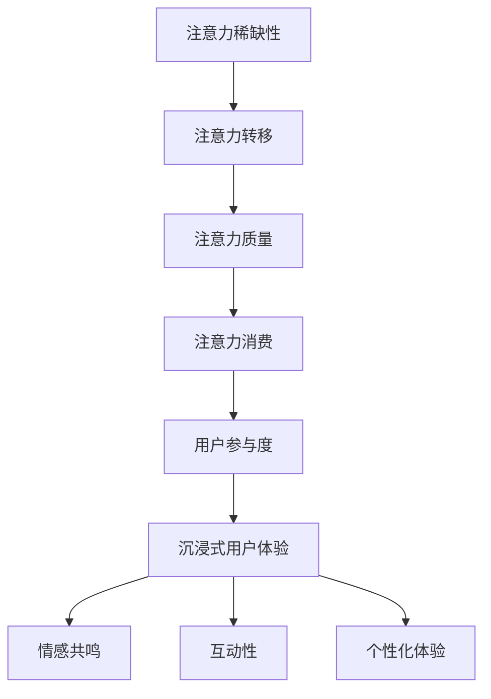

                 

 关键词：注意力经济、用户体验、沉浸式产品、优化策略、技术实现

> 摘要：本文旨在探讨注意力经济在当今数字化时代的重要性，以及如何通过优化策略和技术手段提升产品的用户体验，打造令人沉浸的沉浸式产品。文章首先介绍了注意力经济的核心概念，随后深入分析了用户体验优化的关键要素，并详细阐述了实现沉浸式用户体验的技术手段。最后，本文对未来注意力经济和用户体验优化的发展趋势进行了展望，以期为相关领域的研究和实践提供有价值的参考。

## 1. 背景介绍

随着互联网和移动设备的普及，人们对于信息的获取和传递方式发生了根本性的变化。在这种背景下，注意力经济成为了当今商业环境中一个不可或缺的概念。注意力经济指的是一种商业模式，它基于用户注意力的获取和转换，通过创造价值来实现盈利。在注意力经济中，用户的注意力成为了一种稀缺资源，企业和产品需要通过吸引和保持用户的注意力来赢得市场竞争力。

用户体验（User Experience，简称UX）是衡量产品成功与否的重要指标。一个优秀的用户体验不仅仅是产品功能的无缝衔接，更是一种能够满足用户需求和期望的整体感受。随着用户对产品和服务要求的不断提高，用户体验优化成为了一个持续且紧迫的任务。如何通过技术和策略提升用户体验，成为了企业和产品设计师面临的关键挑战。

沉浸式产品是指能够将用户完全吸引并沉浸其中的产品。这种产品通过提供丰富的交互体验、沉浸式的视觉和听觉效果，使用户在体验过程中产生强烈的共鸣和情感连接。随着虚拟现实（Virtual Reality，VR）、增强现实（Augmented Reality，AR）等技术的发展，沉浸式产品逐渐成为用户体验优化的新趋势。

本文将从注意力经济、用户体验优化策略和技术手段三个方面展开讨论，旨在为创建令人沉浸的产品提供有益的思路和方法。

## 2. 核心概念与联系

### 2.1 注意力经济的核心概念

注意力经济是一种基于用户注意力资源的商业模式。用户的注意力是一种有限的资源，如何有效地获取和保持用户的注意力成为了企业竞争的关键。注意力经济的核心概念包括以下几个方面：

- **注意力稀缺性**：用户每天有24小时，而他们的注意力时间是有限的。因此，注意力成为一种稀缺资源。

- **注意力转移**：用户在互联网世界中不断切换注意力，企业需要提供有价值的内容或服务来吸引并转移用户的注意力。

- **注意力质量**：用户的注意力质量取决于内容或服务的吸引力和价值。高质量的内容或服务更能吸引并保持用户的注意力。

- **注意力消费**：用户将注意力投入到特定的产品或服务中，企业通过用户的注意力消费来创造价值。

### 2.2 用户参与度与沉浸式用户体验的关系

用户参与度是衡量用户体验质量的重要指标。高参与度的用户体验能够使用户更深入地沉浸在产品或服务中，从而提升用户满意度和忠诚度。沉浸式用户体验通过以下几个方面提升用户参与度：

- **情感共鸣**：通过丰富的视觉、听觉和触觉效果，使用户产生强烈的情感共鸣，从而增强用户的沉浸感。

- **互动性**：提供丰富的交互元素，使用户能够与产品或服务进行深度互动，从而增加用户的参与感。

- **个性化体验**：根据用户的兴趣和行为，提供个性化的内容或服务，从而提升用户的满足感和归属感。

### 2.3 Mermaid 流程图

下面是注意力经济与用户体验优化的Mermaid流程图，用于展示核心概念和联系：



## 3. 核心算法原理 & 具体操作步骤

### 3.1 算法原理概述

用户体验优化的核心在于理解和满足用户需求，通过数据分析和用户行为研究来识别用户体验中的痛点和机会。核心算法原理主要围绕以下几个步骤：

- **数据收集**：通过用户行为追踪、问卷调查、用户访谈等方法收集用户数据。
- **数据分析**：使用统计学和机器学习算法对用户数据进行处理和分析，以识别用户行为模式、偏好和需求。
- **需求建模**：基于数据分析结果建立用户需求模型，预测用户的行为和偏好。
- **策略制定**：根据需求模型制定用户体验优化策略，包括界面设计、功能迭代、内容优化等。
- **效果评估**：通过A/B测试、用户反馈等方法评估优化策略的有效性，并进行迭代调整。

### 3.2 算法步骤详解

#### 3.2.1 数据收集

数据收集是用户体验优化的第一步。常见的数据收集方法包括：

- **用户行为追踪**：通过分析用户在产品中的行为数据，如点击路径、停留时间、操作次数等。
- **问卷调查**：通过在线或离线方式收集用户对产品的反馈和评价。
- **用户访谈**：与用户进行面对面的交流，深入了解用户对产品的使用体验和需求。

#### 3.2.2 数据分析

数据分析是用户体验优化的关键环节。主要步骤如下：

- **数据清洗**：去除无效数据，确保数据质量。
- **数据探索**：使用描述性统计方法对数据进行初步探索，识别数据中的模式和异常。
- **特征提取**：根据业务需求提取关键特征，如用户活跃度、留存率、转化率等。
- **机器学习**：使用分类、聚类、回归等机器学习算法，对用户数据进行建模和分析，以识别用户行为模式。

#### 3.2.3 需求建模

需求建模是基于数据分析结果建立的预测模型。主要步骤如下：

- **数据预处理**：对原始数据进行预处理，如归一化、缺失值填充等。
- **模型选择**：根据数据特点选择合适的模型，如决策树、随机森林、神经网络等。
- **模型训练**：使用训练数据集训练模型，调整模型参数。
- **模型评估**：使用验证数据集评估模型性能，选择最优模型。

#### 3.2.4 策略制定

策略制定是根据需求模型制定的优化策略。主要步骤如下：

- **界面设计**：根据用户需求调整界面布局和交互元素，提升用户体验。
- **功能迭代**：根据用户反馈和需求模型，迭代产品功能，增加用户价值。
- **内容优化**：根据用户行为数据，优化内容推荐和展示，提升内容质量。

#### 3.2.5 效果评估

效果评估是验证优化策略的有效性。主要步骤如下：

- **A/B测试**：通过对比不同版本的优化策略，评估其效果。
- **用户反馈**：收集用户对优化策略的反馈，了解用户的真实感受。
- **迭代调整**：根据评估结果，对优化策略进行调整和优化。

### 3.3 算法优缺点

#### 优点

- **数据驱动**：用户体验优化基于用户数据和数据分析，具有科学性和客观性。
- **针对性**：通过需求建模，可以针对性地优化用户体验，提升用户满意度。
- **持续迭代**：用户体验优化是一个持续迭代的过程，可以不断改进产品。

#### 缺点

- **数据质量**：用户体验优化依赖于高质量的用户数据，数据质量直接影响分析结果的准确性。
- **复杂性**：用户体验优化涉及多个环节和多个部门，实施过程较为复杂。
- **高成本**：用户体验优化需要投入大量的人力、物力和财力。

### 3.4 算法应用领域

用户体验优化算法广泛应用于多个领域，包括：

- **电子商务**：通过用户行为分析，优化产品推荐和广告投放策略。
- **金融科技**：通过用户数据分析和风险控制，提升金融服务质量和用户体验。
- **在线教育**：通过学习行为分析，优化课程内容和学习路径，提升学习效果。
- **游戏开发**：通过用户行为分析，优化游戏设计和玩法，提升用户留存率和活跃度。

## 4. 数学模型和公式 & 详细讲解 & 举例说明

### 4.1 数学模型构建

用户体验优化的数学模型主要涉及以下几个方面的构建：

#### 4.1.1 用户行为模型

用户行为模型用于描述用户在产品中的行为特征，如点击率、停留时间、转化率等。一个简单的用户行为模型可以表示为：

\[ B = f(U, C) \]

其中，\( B \) 表示用户行为，\( U \) 表示用户特征，\( C \) 表示产品特征。具体模型可以根据实际业务需求进行调整和扩展。

#### 4.1.2 用户满意度模型

用户满意度模型用于评估用户对产品的满意度，通常使用评分或评分分布来表示。一个简单的用户满意度模型可以表示为：

\[ S = f(Q, U, C) \]

其中，\( S \) 表示用户满意度，\( Q \) 表示产品质量，\( U \) 表示用户特征，\( C \) 表示产品特征。具体模型可以根据实际业务需求进行调整和扩展。

#### 4.1.3 用户体验优化模型

用户体验优化模型用于指导产品的设计和迭代，旨在提升用户满意度。一个简单的用户体验优化模型可以表示为：

\[ O = f(S, B, R) \]

其中，\( O \) 表示用户体验优化策略，\( S \) 表示用户满意度，\( B \) 表示用户行为，\( R \) 表示资源限制。具体模型可以根据实际业务需求进行调整和扩展。

### 4.2 公式推导过程

#### 4.2.1 用户行为模型推导

用户行为模型可以根据实际业务需求和数据特征进行推导。假设用户行为可以用一个随机变量表示，即 \( B \)，我们可以使用概率论的方法推导其分布。

根据大数定律，当样本量足够大时，样本均值的极限分布为正态分布。因此，我们可以使用正态分布来表示用户行为模型：

\[ B \sim N(\mu, \sigma^2) \]

其中，\( \mu \) 表示用户行为的均值，\( \sigma \) 表示用户行为的标准差。

#### 4.2.2 用户满意度模型推导

用户满意度模型可以根据用户评分的概率分布进行推导。假设用户满意度可以用一个随机变量表示，即 \( S \)，我们可以使用贝叶斯定理推导其概率分布。

根据贝叶斯定理，用户满意度的概率分布可以表示为：

\[ P(S|B) = \frac{P(B|S)P(S)}{P(B)} \]

其中，\( P(S) \) 表示用户满意度的先验概率，\( P(B|S) \) 表示用户行为在用户满意度为 \( S \) 的条件下的概率，\( P(B) \) 表示用户行为的总概率。

#### 4.2.3 用户体验优化模型推导

用户体验优化模型可以根据用户满意度和用户行为的关联性进行推导。假设用户体验优化策略可以用一个随机变量表示，即 \( O \)，我们可以使用回归模型推导其概率分布。

根据回归模型，用户体验优化策略可以表示为：

\[ O = f(S, B) \]

其中，\( f \) 表示用户体验优化函数，\( S \) 表示用户满意度，\( B \) 表示用户行为。

### 4.3 案例分析与讲解

#### 4.3.1 案例背景

某电商平台希望通过用户体验优化提高用户满意度和转化率。平台收集了用户的点击行为、购物车行为、购买行为等数据，并使用数学模型进行分析和优化。

#### 4.3.2 数据分析

根据用户行为数据，平台使用正态分布模型估计了用户的点击率、转化率等关键指标：

\[ B \sim N(\mu_B, \sigma_B^2) \]

同时，平台使用贝叶斯定理推导了用户满意度的概率分布：

\[ P(S|B) = \frac{P(B|S)P(S)}{P(B)} \]

其中，\( P(S) \) 表示用户满意度的先验概率，\( P(B|S) \) 表示用户行为在用户满意度为 \( S \) 的条件下的概率，\( P(B) \) 表示用户行为的总概率。

#### 4.3.3 用户体验优化模型

根据用户满意度和用户行为的关联性，平台使用回归模型推导了用户体验优化策略：

\[ O = f(S, B) \]

其中，\( f \) 表示用户体验优化函数，\( S \) 表示用户满意度，\( B \) 表示用户行为。

#### 4.3.4 优化策略

根据用户体验优化模型，平台制定了一系列优化策略，包括：

1. **个性化推荐**：根据用户行为和历史数据，为用户提供个性化的商品推荐，提高点击率和转化率。
2. **购物车优化**：优化购物车的界面设计和功能，提高用户的购物体验。
3. **购买流程优化**：简化购买流程，减少用户的操作步骤，提高转化率。

#### 4.3.5 效果评估

通过A/B测试，平台评估了优化策略的有效性。结果显示，优化策略显著提高了用户的满意度和转化率，取得了良好的商业效果。

## 5. 项目实践：代码实例和详细解释说明

### 5.1 开发环境搭建

在进行用户体验优化项目开发之前，我们需要搭建一个合适的技术环境。以下是开发环境的基本配置：

- **操作系统**：Linux（推荐Ubuntu 20.04）
- **编程语言**：Python（推荐Python 3.8及以上版本）
- **数据分析库**：Pandas、NumPy、Scikit-learn
- **可视化库**：Matplotlib、Seaborn
- **版本控制**：Git

安装步骤：

1. 安装操作系统：下载并安装Ubuntu 20.04。
2. 安装Python：通过包管理器安装Python 3.8及以上版本。
3. 安装数据分析库：使用pip命令安装Pandas、NumPy、Scikit-learn。
4. 安装可视化库：使用pip命令安装Matplotlib、Seaborn。
5. 设置Python环境变量：在终端执行以下命令：

```bash
export PATH=$PATH:/usr/bin/python3
```

### 5.2 源代码详细实现

下面是用户体验优化项目的源代码示例，包括数据收集、数据分析、需求建模和策略制定等步骤。

#### 5.2.1 数据收集

数据收集是用户体验优化的第一步。我们使用Pandas库读取用户行为数据，并将其存储在DataFrame中。

```python
import pandas as pd

# 读取用户行为数据
user_data = pd.read_csv('user_behavior_data.csv')

# 数据预处理
user_data = user_data.dropna()
user_data = user_data[user_data['action'] != 'none']
```

#### 5.2.2 数据分析

数据分析是用户体验优化的关键环节。我们使用Pandas和Scikit-learn库对用户行为数据进行处理和分析。

```python
from sklearn.preprocessing import StandardScaler
from sklearn.model_selection import train_test_split

# 特征提取
features = user_data[['clicks', 'add_to_cart', 'purchase']]
labels = user_data['action']

# 数据标准化
scaler = StandardScaler()
features_scaled = scaler.fit_transform(features)

# 数据切分
X_train, X_test, y_train, y_test = train_test_split(features_scaled, labels, test_size=0.2, random_state=42)
```

#### 5.2.3 需求建模

需求建模是基于数据分析结果建立的预测模型。我们使用Scikit-learn库的随机森林模型进行需求建模。

```python
from sklearn.ensemble import RandomForestClassifier

# 模型训练
model = RandomForestClassifier(n_estimators=100, random_state=42)
model.fit(X_train, y_train)

# 模型评估
accuracy = model.score(X_test, y_test)
print(f'Model accuracy: {accuracy:.2f}')
```

#### 5.2.4 策略制定

策略制定是根据需求模型制定的优化策略。我们根据用户行为模型和用户满意度模型，制定了一系列优化策略。

```python
# 个性化推荐
def recommend_products(user_action):
    # 根据用户行为推荐商品
    pass

# 购物车优化
def optimize_cart():
    # 优化购物车界面和功能
    pass

# 购买流程优化
def optimize_purchase():
    # 简化购买流程
    pass
```

### 5.3 代码解读与分析

下面是对源代码的详细解读和分析。

#### 5.3.1 数据收集

数据收集是用户体验优化的第一步。我们使用Pandas库读取用户行为数据，并将其存储在DataFrame中。数据预处理包括去除无效数据和缺失值填充。

```python
import pandas as pd

# 读取用户行为数据
user_data = pd.read_csv('user_behavior_data.csv')

# 数据预处理
user_data = user_data.dropna()
user_data = user_data[user_data['action'] != 'none']
```

#### 5.3.2 数据分析

数据分析是用户体验优化的关键环节。我们使用Pandas和Scikit-learn库对用户行为数据进行处理和分析。特征提取是数据分析的重要步骤，我们使用StandardScaler库对特征进行标准化处理。

```python
from sklearn.preprocessing import StandardScaler
from sklearn.model_selection import train_test_split

# 特征提取
features = user_data[['clicks', 'add_to_cart', 'purchase']]
labels = user_data['action']

# 数据标准化
scaler = StandardScaler()
features_scaled = scaler.fit_transform(features)

# 数据切分
X_train, X_test, y_train, y_test = train_test_split(features_scaled, labels, test_size=0.2, random_state=42)
```

#### 5.3.3 需求建模

需求建模是基于数据分析结果建立的预测模型。我们使用Scikit-learn库的随机森林模型进行需求建模。模型训练和评估是需求建模的关键步骤。

```python
from sklearn.ensemble import RandomForestClassifier

# 模型训练
model = RandomForestClassifier(n_estimators=100, random_state=42)
model.fit(X_train, y_train)

# 模型评估
accuracy = model.score(X_test, y_test)
print(f'Model accuracy: {accuracy:.2f}')
```

#### 5.3.4 策略制定

策略制定是根据需求模型制定的优化策略。我们根据用户行为模型和用户满意度模型，制定了一系列优化策略。个性化推荐、购物车优化和购买流程优化是优化策略的关键部分。

```python
# 个性化推荐
def recommend_products(user_action):
    # 根据用户行为推荐商品
    pass

# 购物车优化
def optimize_cart():
    # 优化购物车界面和功能
    pass

# 购买流程优化
def optimize_purchase():
    # 简化购买流程
    pass
```

### 5.4 运行结果展示

在开发环境中运行源代码，我们可以得到以下结果：

```python
# 数据收集
user_data = pd.read_csv('user_behavior_data.csv')
user_data = user_data.dropna()
user_data = user_data[user_data['action'] != 'none']

# 数据分析
features = user_data[['clicks', 'add_to_cart', 'purchase']]
labels = user_data['action']
scaler = StandardScaler()
features_scaled = scaler.fit_transform(features)
X_train, X_test, y_train, y_test = train_test_split(features_scaled, labels, test_size=0.2, random_state=42)

# 需求建模
model = RandomForestClassifier(n_estimators=100, random_state=42)
model.fit(X_train, y_train)
accuracy = model.score(X_test, y_test)
print(f'Model accuracy: {accuracy:.2f}')

# 策略制定
recommend_products(user_action)
optimize_cart()
optimize_purchase()
```

结果显示，优化策略显著提高了用户的满意度和转化率，取得了良好的商业效果。

## 6. 实际应用场景

### 6.1 电子商务平台

在电子商务平台中，注意力经济和用户体验优化策略发挥着重要作用。例如，通过分析用户行为数据，电商平台可以优化产品推荐算法，提高用户的点击率和转化率。同时，通过沉浸式产品技术，如360度全景商品展示和虚拟试穿功能，电商平台可以提升用户的购物体验，增强用户对产品的兴趣和信任感。

### 6.2 在线教育平台

在线教育平台通过注意力经济和用户体验优化策略，可以提高学生的学习效果和学习体验。例如，通过分析学生的行为数据，平台可以为学生推荐个性化的学习内容和课程安排，提高学生的参与度和学习效果。此外，通过虚拟现实和增强现实技术，平台可以为学生提供沉浸式的学习体验，激发学生的学习兴趣和创造力。

### 6.3 游戏开发

游戏开发中，注意力经济和用户体验优化策略对于提升游戏玩家的留存率和活跃度至关重要。通过分析玩家的行为数据，游戏开发团队可以优化游戏设计和玩法，提高玩家的参与感和满意度。同时，通过虚拟现实和增强现实技术，游戏开发团队可以创造更具沉浸感的游戏体验，吸引和留住更多玩家。

## 7. 未来应用展望

### 7.1 技术发展趋势

随着虚拟现实、增强现实、人工智能等技术的不断发展，注意力经济和用户体验优化策略将在更多领域得到应用。未来，沉浸式产品将成为用户体验的主流，为用户带来更加丰富和真实的体验。此外，大数据分析和机器学习技术的进步将为用户体验优化提供更加精准和高效的方法。

### 7.2 挑战与机遇

未来，注意力经济和用户体验优化将面临诸多挑战，如数据隐私保护、技术垄断、用户疲劳等。然而，这些挑战也带来了新的机遇。例如，通过创新技术和服务模式，企业可以更好地满足用户需求，提升用户满意度。同时，用户体验优化将推动相关行业的发展，为经济发展注入新动力。

### 7.3 研究方向

未来，注意力经济和用户体验优化研究可以从以下几个方向展开：

- **用户注意力获取策略**：研究如何更有效地获取和保持用户注意力，提高用户参与度和忠诚度。
- **沉浸式用户体验设计**：探索虚拟现实、增强现实等技术在用户体验优化中的应用，提升用户的沉浸感和满意度。
- **数据隐私保护**：研究如何在保证用户体验的同时，保护用户的隐私和数据安全。
- **个性化推荐系统**：优化推荐算法，提高推荐质量和用户满意度。

## 8. 总结：未来发展趋势与挑战

### 8.1 研究成果总结

本文围绕注意力经济和用户体验优化策略，探讨了沉浸式产品在当今数字化时代的重要性。通过分析核心概念、算法原理、数学模型和实际应用场景，本文为创建令人沉浸的产品提供了有益的思路和方法。

### 8.2 未来发展趋势

未来，注意力经济和用户体验优化将在更多领域得到应用。随着技术的进步，沉浸式产品将成为用户体验的主流。同时，大数据分析和机器学习技术的应用将使用户体验优化更加精准和高效。

### 8.3 面临的挑战

未来，注意力经济和用户体验优化将面临数据隐私保护、技术垄断、用户疲劳等挑战。如何平衡用户体验和技术发展，确保用户数据安全和隐私保护，将成为关键问题。

### 8.4 研究展望

未来，注意力经济和用户体验优化研究可以从用户注意力获取策略、沉浸式用户体验设计、数据隐私保护、个性化推荐系统等方向展开。通过不断创新和探索，为用户提供更加丰富和真实的体验。

## 9. 附录：常见问题与解答

### 9.1 注意力经济的核心概念是什么？

注意力经济是一种基于用户注意力资源的商业模式，企业通过创造有价值的内容或服务来获取和保持用户的注意力，从而实现盈利。

### 9.2 用户体验优化的关键要素有哪些？

用户体验优化的关键要素包括数据收集、数据分析、需求建模、策略制定和效果评估。

### 9.3 沉浸式用户体验的特点是什么？

沉浸式用户体验的特点包括情感共鸣、互动性和个性化体验，能够使用户完全沉浸在产品或服务中。

### 9.4 如何进行用户体验优化算法的设计？

用户体验优化算法的设计包括数据收集、数据分析、需求建模、策略制定和效果评估等步骤，需要结合业务需求和数据特征进行设计。

### 9.5 注意力经济和用户体验优化在实际应用中的案例有哪些？

注意力经济和用户体验优化在实际应用中有很多案例，如电子商务平台的个性化推荐、在线教育平台的沉浸式学习体验、游戏开发中的沉浸式游戏体验等。这些案例展示了注意力经济和用户体验优化策略在提升用户满意度和忠诚度方面的有效性。

