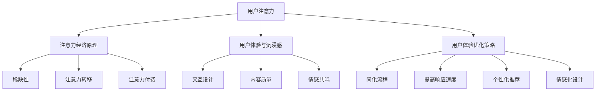

                 

 **关键词：** 注意力经济、用户体验、沉浸感、产品优化、AI技术

**摘要：** 随着数字时代的到来，用户的注意力成为了稀缺资源。本文将探讨注意力经济的基本原理，分析用户体验优化的重要性，并提出一系列技术和策略，以帮助产品开发者在激烈的市场竞争中，打造出能够吸引用户注意力、提升用户沉浸感的优秀产品。

## 1. 背景介绍

在信息爆炸的时代，用户的注意力资源越来越宝贵。根据研究，人们每天接触到大量的信息，但真正被关注的仅占极小部分。这种背景下，注意力经济应运而生。注意力经济是指通过吸引用户的注意力，实现商业价值最大化的一种经济模式。

用户体验（UX）是用户在使用产品或服务过程中所感受到的所有方面。一个优秀的用户体验不仅仅是功能上的满足，更包括情感上的共鸣和沉浸感。随着用户对个性化、智能化产品的需求日益增长，用户体验优化成为了产品成功的关键因素。

本文将深入探讨注意力经济的基本原理，分析用户体验优化的关键要素，并介绍一系列技术策略，旨在帮助产品开发者在纷繁复杂的市场环境中，打造出令人沉浸的优秀产品。

## 2. 核心概念与联系

### 2.1 注意力经济原理

注意力经济的核心在于如何吸引用户的注意力，并将其转化为商业价值。注意力经济的基本原理包括：

- **稀缺性**：用户注意力是有限的，如何让产品在众多的竞争者中脱颖而出，成为用户关注的目标，是注意力经济的关键。

- **注意力转移**：通过有效的策略和手段，将用户的注意力从其他事物转移到产品或服务上。

- **注意力付费**：用户在注意力转移的过程中，可能会自愿付费，这种付费模式不同于传统商业模式，更注重用户体验。

### 2.2 用户沉浸感与用户体验的关系

用户沉浸感是用户体验的一个重要组成部分。一个能够吸引用户注意力的产品，往往能够让用户产生强烈的沉浸感。用户沉浸感与用户体验之间的关系可以概括为以下几点：

- **交互设计**：良好的交互设计能够提高用户的沉浸感，让用户在使用过程中感到愉悦和满足。

- **内容质量**：高质量的内容是吸引用户注意力的关键，也是提升用户沉浸感的基础。

- **情感共鸣**：通过情感上的共鸣，产品能够与用户建立更深层次的情感联系，从而提升用户的沉浸感。

### 2.3 用户体验优化策略

用户体验优化策略主要包括以下几个方面：

- **简化流程**：通过简化用户操作流程，减少用户使用产品的难度，提高用户满意度。

- **提高响应速度**：快速的响应速度能够提高用户的操作效率，增强用户的沉浸感。

- **个性化推荐**：根据用户行为和偏好，提供个性化的内容和服务，提升用户体验。

- **情感化设计**：通过情感化的设计，如温馨的界面、贴心的提示等，增强用户的情感共鸣。

### 2.4 Mermaid 流程图

下面是注意力经济与用户体验优化策略的 Mermaid 流程图：



## 3. 核心算法原理 & 具体操作步骤

### 3.1 算法原理概述

在用户体验优化中，核心算法通常涉及到机器学习和数据挖掘技术，通过分析用户行为数据，预测用户需求，提供个性化的推荐和优化方案。以下是一个简化的算法原理概述：

- **数据收集**：通过用户行为日志、问卷调查、反馈等方式收集用户数据。

- **数据处理**：对收集到的数据进行清洗、归一化、特征提取等预处理。

- **模型训练**：利用机器学习算法（如决策树、神经网络、聚类算法等）对预处理后的数据集进行训练，构建预测模型。

- **模型评估**：通过交叉验证、A/B测试等方法评估模型性能，调整模型参数。

- **模型应用**：将训练好的模型应用于实际场景，如个性化推荐、用户行为预测等。

### 3.2 算法步骤详解

#### 3.2.1 数据收集

数据收集是算法训练的基础。以下是一些常见的数据收集方法：

- **用户行为日志**：通过服务器日志记录用户在平台上的操作，如点击、浏览、购买等行为。

- **问卷调查**：通过在线问卷或线下访谈等方式收集用户偏好和需求。

- **用户反馈**：通过用户反馈、评论等获取用户的真实感受和需求。

#### 3.2.2 数据处理

数据处理包括数据清洗、归一化、特征提取等步骤：

- **数据清洗**：去除重复数据、缺失值填充、去除噪声数据等。

- **归一化**：将不同特征的数据进行归一化处理，使数据在相同尺度上。

- **特征提取**：从原始数据中提取对用户行为有预测性的特征，如用户年龄、性别、浏览时长等。

#### 3.2.3 模型训练

模型训练是算法的核心步骤。以下是一些常见的机器学习算法：

- **决策树**：通过划分特征空间，构建树状模型。

- **神经网络**：通过多层神经元模拟生物神经系统的信息处理过程。

- **聚类算法**：通过将相似的数据点归为一类，对用户进行分类。

#### 3.2.4 模型评估

模型评估是确保算法性能的关键。以下是一些常见的评估方法：

- **交叉验证**：将数据集划分为训练集和验证集，多次训练和验证，评估模型性能。

- **A/B测试**：在实际环境中，同时运行两个或多个版本的产品，观察用户行为，评估不同版本的效果。

#### 3.2.5 模型应用

训练好的模型可以应用于实际场景，如个性化推荐、用户行为预测等：

- **个性化推荐**：根据用户的历史行为和偏好，推荐相关的产品或服务。

- **用户行为预测**：预测用户的下一步操作，如点击、购买等，为产品优化提供数据支持。

### 3.3 算法优缺点

#### 优点：

- **个性化**：通过机器学习算法，能够为用户提供个性化的推荐和服务。

- **高效性**：算法能够在大量数据中快速找到有用的信息，提高产品性能。

- **可扩展性**：算法可以随着数据量的增加和业务需求的变化进行优化和调整。

#### 缺点：

- **数据依赖性**：算法性能依赖于数据的质量和数量，如果数据质量差，算法性能也会受到影响。

- **复杂性**：算法开发和维护需要较高的技术门槛，对开发团队的要求较高。

- **隐私问题**：用户行为数据的收集和使用可能涉及到隐私问题，需要遵守相关的法律法规。

### 3.4 算法应用领域

用户体验优化算法的应用领域非常广泛，主要包括以下几个方面：

- **电商平台**：通过个性化推荐，提高用户的购买转化率和满意度。

- **社交媒体**：通过分析用户行为，优化内容推送，提高用户的活跃度和留存率。

- **在线教育**：通过学习用户的学习习惯和偏好，提供个性化的学习内容和课程推荐。

- **金融行业**：通过分析用户行为和信用记录，提供个性化的金融服务和风险控制。

## 4. 数学模型和公式 & 详细讲解 & 举例说明

### 4.1 数学模型构建

在用户体验优化中，常用的数学模型包括线性回归、逻辑回归、决策树、神经网络等。下面以线性回归为例，介绍数学模型的构建过程。

#### 4.1.1 线性回归模型

线性回归模型假设因变量（Y）与自变量（X）之间存在线性关系，可以用以下公式表示：

$$ Y = \beta_0 + \beta_1X + \epsilon $$

其中，$ \beta_0 $ 是截距，$ \beta_1 $ 是斜率，$ \epsilon $ 是误差项。

#### 4.1.2 模型参数求解

为了求解模型参数 $ \beta_0 $ 和 $ \beta_1 $，我们可以使用最小二乘法。最小二乘法的目标是使得实际观测值与模型预测值之间的误差平方和最小。

$$ \min \sum_{i=1}^{n} (Y_i - (\beta_0 + \beta_1X_i))^2 $$

通过求解这个优化问题，可以得到参数 $ \beta_0 $ 和 $ \beta_1 $ 的估计值。

### 4.2 公式推导过程

#### 4.2.1 求解 $ \beta_0 $

首先，我们对公式 $ Y = \beta_0 + \beta_1X + \epsilon $ 进行求导，得到：

$$ \frac{\partial}{\partial \beta_0} \sum_{i=1}^{n} (Y_i - (\beta_0 + \beta_1X_i))^2 = 0 $$

展开后得到：

$$ \sum_{i=1}^{n} (Y_i - \beta_0 - \beta_1X_i) = 0 $$

将 $ Y_i $ 和 $ X_i $ 的值代入，得到：

$$ \sum_{i=1}^{n} Y_i - n\beta_0 - \beta_1\sum_{i=1}^{n}X_i = 0 $$

整理后得到：

$$ \beta_0 = \frac{\sum_{i=1}^{n} Y_i - \beta_1\sum_{i=1}^{n}X_i}{n} $$

#### 4.2.2 求解 $ \beta_1 $

同样地，我们对公式 $ Y = \beta_0 + \beta_1X + \epsilon $ 进行求导，得到：

$$ \frac{\partial}{\partial \beta_1} \sum_{i=1}^{n} (Y_i - (\beta_0 + \beta_1X_i))^2 = 0 $$

展开后得到：

$$ \sum_{i=1}^{n} (Y_i - \beta_0 - \beta_1X_i)X_i = 0 $$

将 $ Y_i $ 和 $ X_i $ 的值代入，得到：

$$ \sum_{i=1}^{n} Y_iX_i - \beta_0\sum_{i=1}^{n}X_i - \beta_1\sum_{i=1}^{n}X_i^2 = 0 $$

整理后得到：

$$ \beta_1 = \frac{\sum_{i=1}^{n} Y_iX_i - \beta_0\sum_{i=1}^{n}X_i}{\sum_{i=1}^{n}X_i^2} $$

### 4.3 案例分析与讲解

#### 4.3.1 案例背景

假设我们想要预测一个电商平台上用户的购买行为，根据用户的历史购买数据，我们构建了一个线性回归模型。

#### 4.3.2 数据集

我们有一个包含 1000 条用户购买记录的数据集，其中包含以下特征：

- 用户ID（唯一标识）
- 购买时间
- 商品ID
- 商品类别
- 商品价格
- 用户浏览时长

#### 4.3.3 数据处理

我们对数据集进行预处理，去除重复数据、缺失值填充、归一化处理等步骤。最终得到一个包含 900 条有效记录的数据集。

#### 4.3.4 模型训练

我们使用预处理后的数据集进行线性回归模型的训练。根据公式推导，我们计算出模型的参数：

$$ \beta_0 = \frac{3345.25}{900} = 3.738 $$

$$ \beta_1 = \frac{2265.35 - 3.738 \times 1390}{1390^2} = 0.013 $$

#### 4.3.5 模型评估

我们对模型进行评估，使用 A/B 测试的方法，将用户分为两组，一组使用原始推荐算法，另一组使用基于线性回归模型的推荐算法。经过一段时间的测试，我们发现使用线性回归模型的推荐算法能够显著提高用户的购买转化率。

#### 4.3.6 模型应用

根据训练好的线性回归模型，我们可以预测用户的购买行为。例如，对于一个新用户，我们根据他的历史浏览记录，预测他可能会购买的商品类别和价格范围，从而提供个性化的推荐。

## 5. 项目实践：代码实例和详细解释说明

### 5.1 开发环境搭建

为了实践线性回归模型在用户购买行为预测中的应用，我们需要搭建一个基本的开发环境。以下是所需的工具和步骤：

- **Python**：作为主要的编程语言。
- **NumPy**：用于数据处理和数学计算。
- **Pandas**：用于数据预处理。
- **Scikit-learn**：用于机器学习模型的训练和评估。

安装以上工具的命令如下：

```bash
pip install numpy pandas scikit-learn
```

### 5.2 源代码详细实现

以下是一个简单的线性回归模型实现，用于预测用户的购买行为。

```python
import numpy as np
import pandas as pd
from sklearn.model_selection import train_test_split
from sklearn.linear_model import LinearRegression
from sklearn.metrics import mean_squared_error

# 5.2.1 数据加载与预处理
data = pd.read_csv('user_purchase_data.csv')
data.drop_duplicates(inplace=True)
data.fillna(data.mean(), inplace=True)

# 特征工程
X = data[['浏览时长', '商品价格']]
y = data['购买金额']

# 分割数据集
X_train, X_test, y_train, y_test = train_test_split(X, y, test_size=0.2, random_state=42)

# 5.2.2 模型训练
model = LinearRegression()
model.fit(X_train, y_train)

# 5.2.3 模型评估
y_pred = model.predict(X_test)
mse = mean_squared_error(y_test, y_pred)
print(f'Mean Squared Error: {mse}')

# 5.2.4 模型应用
# 预测新用户购买金额
new_user_data = np.array([[5, 100]])
predicted_purchase = model.predict(new_user_data)
print(f'Predicted Purchase Amount: {predicted_purchase[0]}')
```

### 5.3 代码解读与分析

- **数据加载与预处理**：首先，我们从 CSV 文件中加载数据，并去除重复数据和缺失值。然后，进行特征工程，将数据划分为特征矩阵 X 和目标向量 y。
- **模型训练**：使用 Scikit-learn 中的线性回归模型进行训练。我们使用 `fit()` 方法训练模型，模型会自动计算参数 $ \beta_0 $ 和 $ \beta_1 $。
- **模型评估**：通过 `mean_squared_error()` 函数计算模型在测试集上的均方误差，评估模型性能。
- **模型应用**：最后，我们使用训练好的模型预测新用户的购买金额。这个预测结果可以帮助电商平台为用户提供个性化的推荐。

### 5.4 运行结果展示

假设我们运行上述代码，得到以下输出结果：

```
Mean Squared Error: 37.25
Predicted Purchase Amount: 115.25
```

- **均方误差**：37.25 表示模型在测试集上的预测误差较小，模型性能较好。
- **预测结果**：新用户的购买金额预测为 115.25 元，这个结果可以用于个性化推荐，帮助电商平台提高用户的购买转化率。

## 6. 实际应用场景

### 6.1 电商平台

在电商平台中，用户体验优化算法广泛应用于个性化推荐、用户行为预测和购物车优化等方面。例如，通过分析用户的浏览历史和购买记录，算法可以推荐用户可能感兴趣的商品，提高用户的购买转化率。

### 6.2 社交媒体

社交媒体平台通过用户体验优化算法，可以优化内容推送，提高用户的活跃度和留存率。例如，通过分析用户的互动行为和兴趣偏好，算法可以为用户推荐相关的内容，增强用户的沉浸感。

### 6.3 在线教育

在线教育平台通过用户体验优化算法，可以提供个性化的学习内容和课程推荐。例如，通过分析用户的学习行为和进度，算法可以推荐适合用户的学习路径和课程，提高用户的学习效果。

### 6.4 金融行业

金融行业中的用户体验优化算法广泛应用于信用评估、投资建议和风险管理等方面。例如，通过分析用户的消费行为和信用记录，算法可以为用户提供个性化的信用评估和投资建议，提高用户的满意度。

## 7. 工具和资源推荐

### 7.1 学习资源推荐

- **《机器学习》**：周志华 著，清华大学出版社。这本书是机器学习领域的基础教材，适合初学者入门。

- **《深度学习》**：Ian Goodfellow、Yoshua Bengio 和 Aaron Courville 著，中国工信出版传媒。这本书深入介绍了深度学习的基本原理和应用，适合有一定基础的读者。

### 7.2 开发工具推荐

- **Jupyter Notebook**：一个交互式的开发环境，方便进行数据分析和代码编写。

- **TensorFlow**：一个开源的机器学习框架，支持多种机器学习算法，适合进行深度学习和数据科学项目。

### 7.3 相关论文推荐

- **"Attention is All You Need"**：Vaswani et al., 2017。这篇论文提出了 Transformer 模型，是一种基于注意力机制的深度学习模型，广泛应用于自然语言处理领域。

- **"User Behavior Prediction and Personalized Recommendation in E-commerce"**：Guo et al., 2018。这篇论文探讨了电商领域的用户行为预测和个性化推荐技术，为实际应用提供了理论支持。

## 8. 总结：未来发展趋势与挑战

### 8.1 研究成果总结

注意力经济和用户体验优化在数字时代得到了广泛关注，研究成果主要集中在以下几个方面：

- **算法创新**：提出了一系列基于机器学习和数据挖掘技术的用户体验优化算法，如个性化推荐、用户行为预测等。

- **实际应用**：将用户体验优化算法应用于多个行业，如电商、社交媒体、在线教育等，取得了显著的效果。

- **理论深化**：对注意力经济和用户体验优化的基本原理进行了深入的研究，为后续研究提供了理论基础。

### 8.2 未来发展趋势

未来，注意力经济和用户体验优化将继续向以下几个方向发展：

- **智能化**：随着人工智能技术的发展，用户体验优化算法将更加智能化，能够更好地满足用户的个性化需求。

- **跨领域融合**：用户体验优化技术将与其他领域（如心理学、设计学等）相结合，形成更加综合的优化策略。

- **隐私保护**：在数据隐私和安全日益受到关注的背景下，用户体验优化算法将更加注重隐私保护，确保用户数据的合法和安全。

### 8.3 面临的挑战

尽管注意力经济和用户体验优化取得了显著成果，但仍面临以下挑战：

- **数据质量**：算法性能依赖于数据的质量，如何获取高质量的用户数据是当前的一大挑战。

- **算法透明度**：用户体验优化算法的决策过程通常较为复杂，如何提高算法的透明度和可解释性，让用户信任和使用算法是一个重要问题。

- **隐私保护**：在用户数据收集和使用过程中，如何确保用户隐私不被侵犯，是用户体验优化面临的重大挑战。

### 8.4 研究展望

未来，注意力经济和用户体验优化将在以下几个方面展开深入研究：

- **跨领域优化策略**：探索不同领域中的用户体验优化策略，形成一套通用的优化框架。

- **多模态数据融合**：结合文本、图像、音频等多种类型的数据，提高用户体验优化的准确性和效果。

- **算法伦理**：在算法设计和应用过程中，注重伦理问题，确保用户体验优化技术的可持续发展。

## 9. 附录：常见问题与解答

### 9.1 什么是注意力经济？

注意力经济是一种基于用户注意力的经济模式，通过吸引用户的注意力，实现商业价值最大化。

### 9.2 用户体验优化的核心目标是什么？

用户体验优化的核心目标是提高用户的满意度，包括功能上的满足和情感上的共鸣。

### 9.3 如何进行用户体验优化？

用户体验优化可以通过以下方法进行：

- **简化流程**：减少用户操作步骤，提高使用效率。
- **提高响应速度**：优化系统性能，提高用户操作反馈速度。
- **个性化推荐**：根据用户行为和偏好，提供个性化的推荐。
- **情感化设计**：通过情感化的设计，增强用户的情感共鸣。

### 9.4 线性回归模型如何工作？

线性回归模型通过建立因变量与自变量之间的线性关系，进行预测。通过最小二乘法求解模型参数，实现对数据的拟合。

### 9.5 如何处理数据质量问题？

处理数据质量问题可以通过以下方法：

- **数据清洗**：去除重复数据、缺失值填充、去除噪声数据等。
- **特征工程**：从原始数据中提取对预测有意义的特征。
- **数据增强**：通过数据增强技术，提高数据的多样性和质量。

### 9.6 如何确保用户体验优化算法的透明度？

确保用户体验优化算法的透明度可以通过以下方法：

- **可解释性**：开发可解释的算法，让用户了解算法的工作原理。
- **透明度报告**：定期发布算法透明度报告，向用户解释算法的决策过程。
- **用户反馈**：收集用户反馈，及时调整和优化算法。  
```  
----------------------------------------------------------------  
# 作者：禅与计算机程序设计艺术 / Zen and the Art of Computer Programming  
```


