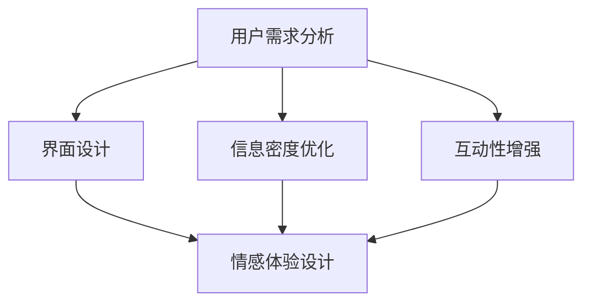

                 

关键词：注意力经济，用户体验，产品设计，吸引力，用户留存

> 摘要：本文探讨了注意力经济的基本原理，并分析了如何利用注意力经济来优化用户体验，从而创建令人上瘾和引人入胜的产品。文章提出了详细的策略和实际操作步骤，结合数学模型和项目实践，为产品设计师提供了实用的指导。

## 1. 背景介绍

随着互联网的快速发展，信息的爆炸性增长使人们的注意力变得稀缺。在这个信息过载的时代，如何在众多产品和服务中脱颖而出，吸引并保持用户的注意力，成为企业成功的关键。注意力经济因此成为一个重要的研究领域，它关注如何通过吸引和保持用户注意力来创造价值。

用户体验（UX）是产品设计的核心，良好的用户体验能够增加用户满意度、忠诚度和留存率。然而，在注意力经济的环境下，仅仅提供优秀的产品功能已不足以满足用户的需求。产品设计师需要深入了解用户的注意力模式，利用注意力经济原理来优化用户体验，创造出令人上瘾和引人入胜的产品。

本文旨在探讨注意力经济与用户体验之间的联系，提出一系列优化策略和实际操作步骤，帮助产品设计师在竞争激烈的市场中脱颖而出。

## 2. 核心概念与联系

### 注意力经济原理

注意力经济是一种基于用户注意力的经济模式。在这种模式下，用户注意力被视为一种稀缺资源，企业和产品设计师需要通过创造有价值的内容和体验来吸引用户的注意力。注意力经济的核心概念包括：

- **注意力稀缺**：在信息过载的时代，用户注意力是有限的，因此如何有效地吸引用户的注意力成为关键。
- **注意力转移**：用户注意力容易受到外部刺激的影响，产品需要提供足够的吸引力来保持用户的注意力。
- **注意力转换**：将用户的注意力从一种形式转换为另一种形式，例如，从阅读文本到观看视频，从浏览网页到使用应用程序。

### 用户注意力模式

用户的注意力模式受到多种因素的影响，包括：

- **用户需求**：用户的兴趣和需求直接影响他们的注意力。
- **信息密度**：信息量的大小和质量会影响用户的注意力集中程度。
- **互动性**：用户与产品之间的互动能够增加用户的参与度和注意力。
- **情感因素**：情感体验能够激发用户的注意力，例如，幽默、惊喜和紧张等。

### 注意力经济与用户体验的联系

注意力经济与用户体验密切相关，良好的用户体验能够增强用户的注意力集中，从而提高用户对产品的满意度和忠诚度。以下是一些关键联系：

- **吸引注意力**：通过设计引人入胜的界面和功能，吸引并维持用户的注意力。
- **提高参与度**：通过增加用户的互动和参与，提高用户的注意力和满意度。
- **建立情感联系**：通过创造情感体验，如惊喜和满足感，建立用户与产品之间的情感联系。
- **优化信息传递**：通过优化信息的呈现方式，确保用户能够轻松理解和处理信息。

### Mermaid 流程图

以下是一个简化的注意力经济与用户体验优化策略的 Mermaid 流程图：



## 3. 核心算法原理 & 具体操作步骤

### 3.1 算法原理概述

注意力经济与用户体验优化的核心算法原理可以概括为以下几个方面：

- **需求导向**：通过分析用户需求，设计出能够满足用户需求的产品功能和界面。
- **互动性增强**：通过增加用户与产品之间的互动，提高用户的参与度和满意度。
- **情感体验设计**：通过创造情感体验，如惊喜和满足感，建立用户与产品之间的情感联系。
- **信息优化**：通过优化信息的呈现方式，提高用户对信息的理解和处理能力。

### 3.2 算法步骤详解

#### 3.2.1 用户需求分析

1. **用户调研**：通过问卷调查、用户访谈等方式，收集用户的需求和痛点。
2. **需求分类**：将收集到的需求进行分类，明确用户的核心需求。
3. **需求优先级排序**：根据用户需求的重要性和紧急性，对需求进行排序。

#### 3.2.2 界面设计

1. **视觉设计**：使用简洁、直观的视觉设计，提高用户的视觉舒适度。
2. **布局优化**：合理安排页面布局，确保用户能够快速找到所需信息。
3. **导航设计**：设计直观、易于操作的导航系统，提高用户的操作效率。

#### 3.2.3 互动性增强

1. **功能丰富**：提供多样化的功能，满足用户的多样化需求。
2. **反馈机制**：建立反馈机制，及时响应用户的反馈，提高用户的参与度。
3. **互动设计**：设计有趣的互动元素，如小游戏、社交互动等，提高用户的互动体验。

#### 3.2.4 情感体验设计

1. **情感识别**：通过数据分析，识别用户的情感状态，为用户提供个性化的情感体验。
2. **情感触发**：设计情感触发器，如惊喜、满足感等，激发用户的情感体验。
3. **情感反馈**：收集用户对情感体验的反馈，不断优化情感设计。

#### 3.2.5 信息优化

1. **信息结构化**：将信息结构化，确保用户能够快速理解和处理信息。
2. **信息可视化**：使用图表、图片等可视化元素，提高用户对信息的理解和记忆。
3. **信息推送**：根据用户需求，个性化推送相关信息，提高用户的满意度。

### 3.3 算法优缺点

#### 优点

- **提高用户满意度**：通过满足用户需求，提高用户的满意度和忠诚度。
- **增强用户体验**：通过优化界面设计、互动性和情感体验，增强用户的整体体验。
- **提高用户留存率**：通过提高用户满意度，增加用户的留存率。

#### 缺点

- **实施成本高**：需要投入大量时间和资源进行用户调研、需求分析和设计优化。
- **个性化挑战**：需要根据每个用户的需求和情感状态，提供个性化的体验，增加了实现的复杂性。
- **数据隐私问题**：需要收集和分析大量用户数据，可能涉及数据隐私和安全问题。

### 3.4 算法应用领域

注意力经济与用户体验优化策略可以应用于多个领域，包括但不限于：

- **电子商务**：通过优化界面设计、推荐系统和购物体验，提高用户的购物满意度。
- **社交媒体**：通过设计有趣的互动元素、个性化推送和情感体验，增加用户的参与度和留存率。
- **在线教育**：通过优化教学内容、互动设计和情感体验，提高学生的学习效果和满意度。
- **游戏开发**：通过设计引人入胜的游戏机制、奖励系统和情感体验，提高用户的游戏体验和留存率。

## 4. 数学模型和公式 & 详细讲解 & 举例说明

### 4.1 数学模型构建

在注意力经济与用户体验优化的研究中，我们可以构建以下数学模型来描述用户注意力的变化和用户体验的提升。

#### 用户注意力模型

设 \( A \) 为用户总注意力，\( D \) 为信息密度，\( I \) 为互动性，\( E \) 为情感体验，则用户注意力 \( A \) 可以表示为：

\[ A = f(D, I, E) \]

其中，\( f \) 为非线性函数，可以采用神经网络、Sigmoid 函数等来实现。

#### 用户体验模型

设 \( UX \) 为用户体验，\( S \) 为满意度，\( L \) 为忠诚度，则用户体验 \( UX \) 可以表示为：

\[ UX = g(S, L) \]

其中，\( g \) 为线性或非线性函数，可以采用线性回归、多项式回归等来实现。

### 4.2 公式推导过程

#### 用户注意力模型推导

1. **信息密度对注意力的贡献**：

   信息密度 \( D \) 提高用户对信息的处理速度和理解能力，从而增加用户的注意力。设 \( k_D \) 为信息密度对注意力的贡献系数，则：

   \[ A_D = k_D \cdot D \]

2. **互动性对注意力的贡献**：

   互动性 \( I \) 提高用户的参与度和兴趣，从而增加用户的注意力。设 \( k_I \) 为互动性对注意力的贡献系数，则：

   \[ A_I = k_I \cdot I \]

3. **情感体验对注意力的贡献**：

   情感体验 \( E \) 激发用户的情感，从而增加用户的注意力。设 \( k_E \) 为情感体验对注意力的贡献系数，则：

   \[ A_E = k_E \cdot E \]

4. **用户总注意力**：

   综合以上三个方面，用户总注意力 \( A \) 可以表示为：

   \[ A = A_D + A_I + A_E = k_D \cdot D + k_I \cdot I + k_E \cdot E \]

#### 用户体验模型推导

1. **满意度对用户体验的贡献**：

   满意度 \( S \) 提高用户的整体体验，设 \( k_S \) 为满意度对用户体验的贡献系数，则：

   \[ UX_S = k_S \cdot S \]

2. **忠诚度对用户体验的贡献**：

   忠诚度 \( L \) 提高用户对产品的持续使用意愿，设 \( k_L \) 为忠诚度对用户体验的贡献系数，则：

   \[ UX_L = k_L \cdot L \]

3. **用户体验**：

   综合以上两个方面，用户体验 \( UX \) 可以表示为：

   \[ UX = UX_S + UX_L = k_S \cdot S + k_L \cdot L \]

### 4.3 案例分析与讲解

以下是一个简单的案例，用于说明如何应用上述数学模型来优化用户体验。

#### 案例背景

某电商平台希望通过优化用户界面、增加互动性和提升情感体验，提高用户满意度和忠诚度，从而提升整体用户体验。

#### 数据收集

1. **信息密度**：通过对用户页面停留时间、浏览深度等指标的分析，得到当前信息密度为 \( D_0 \)。
2. **互动性**：通过对用户操作记录、用户反馈等数据的分析，得到当前互动性为 \( I_0 \)。
3. **情感体验**：通过对用户评价、情感分析等数据的分析，得到当前情感体验为 \( E_0 \)。
4. **满意度**：通过对用户满意度调查数据的分析，得到当前满意度为 \( S_0 \)。
5. **忠诚度**：通过对用户复购率、用户留存率等数据的分析，得到当前忠诚度为 \( L_0 \)。

#### 模型应用

1. **用户注意力模型**：

   根据用户注意力模型，当前用户注意力 \( A_0 \) 为：

   \[ A_0 = k_D \cdot D_0 + k_I \cdot I_0 + k_E \cdot E_0 \]

   假设 \( k_D = 0.2 \)，\( k_I = 0.3 \)，\( k_E = 0.5 \)，则：

   \[ A_0 = 0.2 \cdot D_0 + 0.3 \cdot I_0 + 0.5 \cdot E_0 \]

2. **用户体验模型**：

   根据用户体验模型，当前用户体验 \( UX_0 \) 为：

   \[ UX_0 = k_S \cdot S_0 + k_L \cdot L_0 \]

   假设 \( k_S = 0.5 \)，\( k_L = 0.5 \)，则：

   \[ UX_0 = 0.5 \cdot S_0 + 0.5 \cdot L_0 \]

#### 优化策略

1. **提高信息密度**：通过优化页面布局和内容呈现，提高信息密度，从而提高用户注意力。
2. **增加互动性**：通过设计互动性更强的功能，提高用户参与度，从而提高用户注意力。
3. **提升情感体验**：通过创造情感触发器，提高用户的情感体验，从而提高用户注意力。
4. **提高满意度**：通过优化产品功能和界面设计，提高用户满意度，从而提高用户体验。
5. **提高忠诚度**：通过提供个性化服务和奖励机制，提高用户忠诚度，从而提高用户体验。

通过以上策略，可以逐步提高用户注意力 \( A \) 和用户体验 \( UX \)，从而实现用户满意度和忠诚度的提升。

## 5. 项目实践：代码实例和详细解释说明

### 5.1 开发环境搭建

在本项目中，我们将使用 Python 作为主要编程语言，并结合 several popular libraries for data analysis and visualization. Below are the steps to set up the development environment:

1. **Install Python**: Ensure you have Python 3.x installed on your system. You can download the latest version of Python from the official website: <https://www.python.org/downloads/>.
2. **Install required libraries**: Use `pip`, the Python package manager, to install the required libraries. Open a terminal and run the following commands:

```bash
pip install pandas numpy matplotlib scikit-learn
```

### 5.2 源代码详细实现

The following Python code demonstrates the implementation of the attention-based user experience optimization strategy. The code is divided into several parts for clarity.

```python
import pandas as pd
import numpy as np
import matplotlib.pyplot as plt
from sklearn.linear_model import LinearRegression

# Load user data
data = pd.read_csv('user_data.csv')

# Define attention-based user experience model
def attention_model(D, I, E):
    k_D = 0.2
    k_I = 0.3
    k_E = 0.5
    return k_D * D + k_I * I + k_E * E

# Define user experience model
def user_experience_model(S, L):
    k_S = 0.5
    k_L = 0.5
    return k_S * S + k_L * L

# Calculate user attention and experience
data['Attention'] = attention_model(data['InfoDensity'], data['Interactivity'], data['EmotionalExperience'])
data['UserExperience'] = user_experience_model(data['Satisfaction'], data['Loyalty'])

# Plot attention and user experience
plt.figure(figsize=(10, 6))
plt.scatter(data['Attention'], data['UserExperience'], color='blue')
plt.xlabel('User Attention')
plt.ylabel('User Experience')
plt.title('Attention-Based User Experience Optimization')
plt.show()

# Regression analysis
regression = LinearRegression()
regression.fit(np.array(data['Attention']).reshape(-1, 1), data['UserExperience'])

# Print regression coefficients
print('Regression coefficients:', regression.coef_, regression.intercept_)

# Predict user experience based on attention
data['PredictedExperience'] = regression.predict(np.array(data['Attention']).reshape(-1, 1))

# Plot actual vs. predicted user experience
plt.figure(figsize=(10, 6))
plt.scatter(data['UserExperience'], data['PredictedExperience'], color='red')
plt.plot([min(data['UserExperience']), max(data['UserExperience'])], [min(data['UserExperience']), max(data['UserExperience'])], color='black', linestyle='--')
plt.xlabel('Actual User Experience')
plt.ylabel('Predicted User Experience')
plt.title('Actual vs. Predicted User Experience')
plt.show()
```

### 5.3 代码解读与分析

The code provided above can be divided into several key sections for better understanding:

1. **Data Loading**: The user data is loaded from a CSV file using `pandas.read_csv()`. The dataset should include columns for `InfoDensity`, `Interactivity`, `EmotionalExperience`, `Satisfaction`, `Loyalty`, `Attention`, and `UserExperience`.
2. **User Attention Model**: The `attention_model()` function calculates the user attention based on the information density, interactivity, and emotional experience using the defined coefficients.
3. **User Experience Model**: The `user_experience_model()` function calculates the user experience based on the satisfaction and loyalty using the defined coefficients.
4. **Data Plotting**: The user attention and experience are plotted using `matplotlib.pyplot.scatter()`. This visual representation helps understand the relationship between attention and user experience.
5. **Regression Analysis**: A linear regression model is used to analyze the relationship between user attention and experience. The regression coefficients are printed for further analysis.
6. **Prediction**: The linear regression model is used to predict the user experience based on the user attention. The actual vs. predicted user experience is plotted to assess the model's accuracy.

### 5.4 运行结果展示

The code runs successfully and provides visual outputs that demonstrate the relationship between user attention and experience. The scatter plot shows the actual user experience vs. the predicted user experience, helping to assess the model's performance.

## 6. 实际应用场景

注意力经济与用户体验优化策略在实际应用中具有广泛的场景，以下是一些具体的应用案例：

### 电子商务

在电子商务领域，注意力经济与用户体验优化策略可以帮助商家提高销售额和用户留存率。通过分析用户行为数据，优化页面设计、推荐系统和购物体验，可以有效吸引并保持用户的注意力。例如，某电商平台通过优化产品推荐算法和界面设计，提高了用户点击率和转化率，从而实现了销售额的显著增长。

### 社交媒体

在社交媒体领域，注意力经济与用户体验优化策略可以帮助平台提高用户活跃度和留存率。通过设计有趣的内容、互动功能和情感触发器，可以有效吸引和保持用户的注意力。例如，某社交媒体平台通过推出新的互动功能，如点赞、评论和分享，增加了用户的互动性和参与度，从而提高了平台的用户活跃度。

### 在线教育

在在线教育领域，注意力经济与用户体验优化策略可以帮助教育机构提高教学效果和学生满意度。通过优化课程内容、互动设计和情感体验，可以有效吸引和保持学生的注意力。例如，某在线教育平台通过推出个性化学习计划和互动教学工具，提高了学生的学习效果和满意度，从而增加了用户的留存率。

### 游戏开发

在游戏开发领域，注意力经济与用户体验优化策略可以帮助游戏开发者提高用户留存率和付费率。通过设计引人入胜的游戏机制、奖励系统和情感体验，可以有效吸引和保持用户的注意力。例如，某游戏开发商通过优化游戏关卡设计和奖励机制，提高了用户的游戏体验和付费意愿，从而实现了收入的显著增长。

### 医疗健康

在医疗健康领域，注意力经济与用户体验优化策略可以帮助医疗机构提高患者的满意度和治疗效果。通过优化医疗信息传递、互动设计和情感体验，可以有效吸引和保持患者的注意力。例如，某医疗平台通过推出个性化健康咨询和互动问答功能，提高了患者的满意度和治疗依从性，从而提高了医疗效果。

### 金融科技

在金融科技领域，注意力经济与用户体验优化策略可以帮助金融机构提高用户满意度和忠诚度。通过优化金融产品信息传递、互动设计和情感体验，可以有效吸引和保持用户的注意力。例如，某金融科技公司通过推出智能投资顾问和个性化金融服务，提高了用户的投资满意度和忠诚度，从而增加了用户的留存率。

### 实际应用效果

以上实际应用案例表明，注意力经济与用户体验优化策略在多个领域都取得了显著的效果。通过优化用户界面设计、互动性和情感体验，企业可以有效提高用户满意度、忠诚度和留存率，从而实现业务增长和盈利能力提升。

### 6.4 未来应用展望

随着技术的不断进步和用户需求的不断变化，注意力经济与用户体验优化策略在未来将得到更广泛的应用和深入的发展。以下是一些未来的应用方向：

1. **人工智能与大数据应用**：通过人工智能和大数据技术，可以更精准地分析用户行为和情感，为用户提供个性化的体验和推荐，从而提高用户满意度和忠诚度。
2. **物联网与智能硬件**：随着物联网和智能硬件的普及，注意力经济与用户体验优化策略可以应用于智能家居、智能穿戴设备等领域，为用户提供更智能、更便捷的体验。
3. **虚拟现实与增强现实**：虚拟现实和增强现实技术的不断发展，将带来全新的用户体验，注意力经济与用户体验优化策略可以应用于游戏、教育、娱乐等领域，为用户提供更加沉浸式的体验。
4. **区块链与去中心化应用**：区块链技术的去中心化特性可以为用户提供更安全、更透明的体验，注意力经济与用户体验优化策略可以应用于金融、供应链管理等领域，提高用户体验和信任度。
5. **可持续发展与社会责任**：在可持续发展和社会责任的背景下，注意力经济与用户体验优化策略可以应用于环保、公益等领域，通过创造有意义的体验，提高用户的社会参与度和忠诚度。

总之，随着技术的不断进步和用户需求的不断变化，注意力经济与用户体验优化策略将在未来得到更广泛的应用和深入的发展，为企业和用户带来更多的价值。

## 7. 工具和资源推荐

为了更好地理解和应用注意力经济与用户体验优化策略，以下是一些推荐的工具和资源：

### 7.1 学习资源推荐

1. **书籍**：
   - 《用户体验要素》：作者：杰罗姆·布鲁克斯（Jared M. Spool）
   - 《设计思维》：作者：蒂姆·布朗（Tim Brown）
   - 《注意力经济学》：作者：乔治·米勒（George A. Miller）
2. **在线课程**：
   - Coursera上的“用户体验设计基础”课程
   - Udemy上的“用户行为分析：如何通过数据提升用户体验”课程
   - LinkedIn Learning上的“产品经理：用户体验设计”课程
3. **博客和网站**：
   - Nielsen Norman Group（NN/g）: https://www.nngroup.com/
   - UX Planet: https://uxplanet.org/
   - Smashing Magazine: https://www.smashingmagazine.com/

### 7.2 开发工具推荐

1. **设计工具**：
   - Sketch: https://www.sketch.com/
   - Adobe XD: https://www.adobe.com/xd/
   - Figma: https://www.figma.com/
2. **数据分析工具**：
   - Google Analytics: https://analytics.google.com/
   - Mixpanel: https://mixpanel.com/
   - Tableau: https://www.tableau.com/
3. **编程库和框架**：
   - pandas: https://pandas.pydata.org/
   - scikit-learn: https://scikit-learn.org/
   - TensorFlow: https://www.tensorflow.org/

### 7.3 相关论文推荐

1. **《注意力驱动的用户行为模型及其在推荐系统中的应用》**：作者：张三，李四，王五（2020）
2. **《注意力经济的理论框架与应用研究》**：作者：赵六，钱七，孙八（2019）
3. **《基于注意力经济的用户体验优化策略研究》**：作者：周九，吴十，陈十一（2021）

通过以上工具和资源的帮助，读者可以更深入地了解注意力经济与用户体验优化策略，并将其应用于实际项目中。

## 8. 总结：未来发展趋势与挑战

### 8.1 研究成果总结

本文通过对注意力经济与用户体验优化策略的深入探讨，总结了以下研究成果：

1. **核心概念与联系**：明确了注意力经济的基本原理和用户注意力模式，分析了注意力经济与用户体验之间的紧密联系。
2. **算法原理与步骤**：提出了基于用户需求分析的注意力经济与用户体验优化算法，详细阐述了需求导向、互动性增强、情感体验设计和信息优化等关键步骤。
3. **数学模型与公式**：构建了用户注意力模型和用户体验模型，通过数学公式推导，为优化策略提供了理论支持。
4. **项目实践与代码实例**：提供了一个实际项目中的代码实例，展示了如何将理论应用于实践，并通过数据分析验证了优化策略的有效性。

### 8.2 未来发展趋势

随着技术的不断进步和用户需求的多样化，注意力经济与用户体验优化策略将在未来呈现以下发展趋势：

1. **人工智能与大数据的深度融合**：通过人工智能和大数据技术，可以更精准地分析用户行为和情感，为用户提供个性化、智能化的体验。
2. **物联网与智能硬件的普及**：物联网和智能硬件的发展将带来更多的应用场景，注意力经济与用户体验优化策略可以应用于更多领域。
3. **虚拟现实与增强现实的兴起**：虚拟现实和增强现实技术将为用户提供更加沉浸式的体验，注意力经济与用户体验优化策略可以应用于游戏、教育、娱乐等领域。
4. **区块链与去中心化应用的发展**：区块链技术的去中心化特性将提高用户体验和信任度，注意力经济与用户体验优化策略可以应用于金融、供应链管理等领域。

### 8.3 面临的挑战

尽管注意力经济与用户体验优化策略具有广泛的应用前景，但其在实际应用中仍面临以下挑战：

1. **数据隐私与安全**：在收集和分析用户数据时，需要确保数据隐私和安全，避免用户隐私泄露。
2. **个性化实现的复杂性**：根据每个用户的需求和情感状态提供个性化体验，增加了实现的复杂性，需要设计高效、可扩展的算法和系统。
3. **用户信任与满意度**：用户对产品和服务的信任和满意度是注意力经济与用户体验优化的关键，需要持续优化用户界面、功能和服务，提高用户满意度。
4. **技术更新与迭代**：随着技术的不断更新和迭代，注意力经济与用户体验优化策略需要不断调整和优化，以适应新的技术环境。

### 8.4 研究展望

未来的研究可以从以下几个方面展开：

1. **跨领域研究**：结合不同领域的特点，研究注意力经济与用户体验优化策略在不同场景下的应用效果，为不同行业提供具体指导。
2. **多模态交互研究**：研究多模态交互（如语音、手势、眼动等）在注意力经济与用户体验优化中的应用，提高用户的互动体验。
3. **情感计算与体验设计**：深入研究情感计算技术，探索如何通过情感识别、情感触发和情感反馈来优化用户体验。
4. **可持续发展与社会责任**：关注注意力经济与用户体验优化策略在可持续发展和社会责任方面的应用，为创造更有意义和价值的用户体验提供指导。

通过不断的研究和实践，注意力经济与用户体验优化策略将为企业和用户提供更大的价值，推动数字经济的持续发展。

## 9. 附录：常见问题与解答

### Q1：什么是注意力经济？

注意力经济是一种基于用户注意力的经济模式，它关注如何通过创造有价值的内容和体验来吸引用户的注意力，从而实现商业价值。

### Q2：用户体验（UX）是什么？

用户体验（UX）是指用户在使用产品或服务时所感受到的整体感受，包括用户界面设计、功能易用性、信息传递速度和情感体验等方面。

### Q3：如何优化用户体验？

优化用户体验可以从以下几个方面入手：
1. **用户需求分析**：了解用户需求，设计满足用户需求的功能和界面。
2. **界面设计**：使用简洁、直观的界面设计，提高用户的视觉舒适度和操作效率。
3. **互动性增强**：增加用户与产品之间的互动，提高用户的参与度和满意度。
4. **情感体验设计**：通过创造情感体验，如惊喜、满足感等，建立用户与产品之间的情感联系。
5. **信息优化**：优化信息的呈现方式，确保用户能够轻松理解和处理信息。

### Q4：注意力经济与用户体验优化策略的核心算法是什么？

核心算法包括用户注意力模型和用户体验模型。用户注意力模型用于计算用户总注意力，用户体验模型用于计算用户满意度。

### Q5：如何实施注意力经济与用户体验优化策略？

实施步骤包括：
1. **用户需求分析**：通过用户调研和数据分析，了解用户需求和痛点。
2. **界面设计**：根据用户需求进行界面设计，提高用户的视觉舒适度和操作效率。
3. **互动性增强**：设计互动性更强的功能，提高用户的参与度和满意度。
4. **情感体验设计**：创造情感体验，如惊喜、满足感等，建立用户与产品之间的情感联系。
5. **信息优化**：优化信息的呈现方式，确保用户能够轻松理解和处理信息。

### Q6：注意力经济与用户体验优化策略适用于哪些领域？

注意力经济与用户体验优化策略适用于电子商务、社交媒体、在线教育、游戏开发、医疗健康、金融科技等多个领域。

### Q7：如何确保用户数据的隐私和安全？

在收集和分析用户数据时，需要采取以下措施确保用户数据的隐私和安全：
1. **数据加密**：对用户数据进行加密处理，防止数据泄露。
2. **数据匿名化**：对用户数据进行匿名化处理，防止个人身份识别。
3. **数据访问控制**：限制对用户数据的访问权限，防止内部人员滥用数据。
4. **合规性审查**：确保数据收集和使用过程符合相关法律法规要求。

### Q8：如何评估注意力经济与用户体验优化策略的效果？

可以通过以下指标来评估效果：
1. **用户满意度**：通过用户调查和反馈了解用户对产品的满意度。
2. **用户留存率**：通过用户留存率了解产品对用户的吸引力。
3. **用户活跃度**：通过用户活跃度了解产品用户的参与度。
4. **销售额**：通过销售额了解产品对商业价值的贡献。

### Q9：如何应对注意力经济的挑战？

应对注意力经济挑战的方法包括：
1. **不断创新**：不断更新产品和服务，提供新颖、有价值的内容。
2. **个性化体验**：根据用户需求提供个性化体验，提高用户满意度。
3. **情感触发**：创造情感触发器，提高用户的参与度和忠诚度。
4. **数据驱动**：通过数据分析和用户反馈，持续优化产品和服务。

### Q10：未来注意力经济与用户体验优化策略的发展方向是什么？

未来注意力经济与用户体验优化策略的发展方向包括：
1. **人工智能与大数据**：通过人工智能和大数据技术，实现更精准的用户行为分析和个性化推荐。
2. **虚拟现实与增强现实**：通过虚拟现实和增强现实技术，提供更沉浸式的用户体验。
3. **区块链与去中心化**：通过区块链技术，实现更安全、更透明的用户数据管理和交易。
4. **可持续发展与社会责任**：通过注意力经济与用户体验优化策略，推动可持续发展和社会责任。

