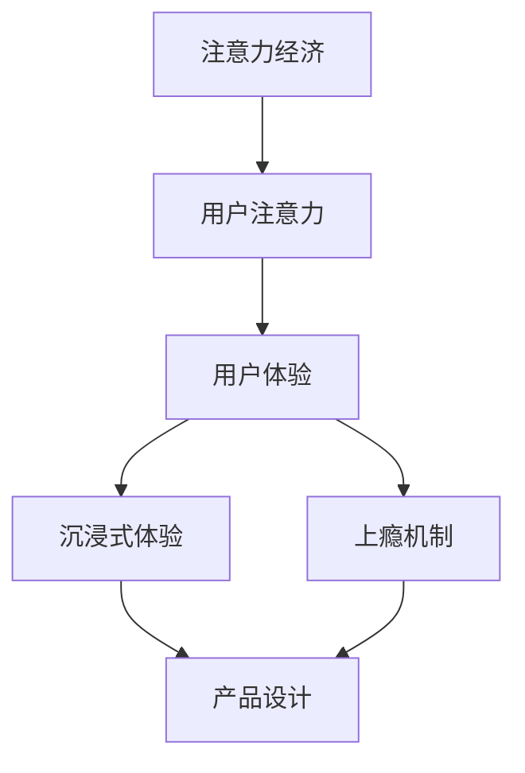

                 

关键词：注意力经济、用户体验、产品设计、沉浸式体验、上瘾机制、用户行为分析、互动设计

> 摘要：本文旨在探讨注意力经济与用户体验优化策略，以及如何通过设计令人沉浸和上瘾的产品来提升用户粘性。文章从注意力经济的背景入手，分析了用户在数字时代的注意力特征，探讨了如何利用注意力经济原理来设计具有吸引力的产品。接着，文章深入讨论了用户体验优化的核心要素，包括交互设计、界面设计和内容质量等，并分享了具体实践方法。随后，文章介绍了创建沉浸式和上瘾产品的方法，包括故事驱动设计、用户反馈机制和个性化推荐等。最后，文章总结了未来发展趋势与面临的挑战，并提出了一些研究展望。

## 1. 背景介绍

在当今的数字时代，信息爆炸和互联网的普及使得用户的注意力成为一种稀缺资源。人们每天面临无数的信息干扰，如何有效抓住用户的注意力，成为各类产品和服务设计的关键挑战。这也就是所谓的“注意力经济”。

注意力经济指的是在信息过载的环境中，用户对特定内容或产品的注意力成为了商业价值的来源。用户的时间、精力和注意力都是有限的，而如何吸引并保持用户的注意力，成为了产品设计和营销的核心任务。

### 注意力经济的特点

1. **注意力稀缺性**：在数字时代，用户注意力成为了一种稀缺资源。只有能够有效吸引和保持用户注意力的产品，才能在激烈的市场竞争中脱颖而出。
2. **注意力转移性**：用户很容易受到新信息的吸引，导致注意力在各个产品和服务之间转移。这要求产品设计者不断创新，以吸引并留住用户。
3. **注意力持续时间**：用户对特定内容的注意力持续时间较短，这使得产品需要快速、有效地传达核心价值，以防止用户流失。

### 注意力经济的挑战

1. **信息过载**：数字时代的信息爆炸使得用户面临着大量的信息选择，如何筛选和过滤有用信息成为了一个巨大的挑战。
2. **用户需求多变**：用户需求不断变化，产品需要快速适应并满足这些需求，否则将面临被淘汰的风险。
3. **用户信任度**：在信息泛滥的环境中，用户对信息的真实性和可靠性产生了怀疑，这要求产品提供高质量的内容和服务，以赢得用户的信任。

## 2. 核心概念与联系

为了更好地理解注意力经济与用户体验优化策略之间的关系，我们需要先明确几个核心概念，并绘制一个Mermaid流程图来展示这些概念之间的联系。

### 核心概念

1. **注意力经济**：指在数字时代，用户注意力作为一种稀缺资源，其商业价值被广泛关注和利用。
2. **用户体验**：指用户在使用产品或服务过程中所获得的总体感受和满意度。
3. **沉浸式体验**：指用户在使用产品时，完全沉浸在产品所创造的环境中，达到高度集中和忘我的状态。
4. **上瘾机制**：指通过设计产品特性，激发用户持续使用产品的内在动机和欲望。

### Mermaid流程图



在这个流程图中，我们可以看到注意力经济通过吸引和保持用户注意力，直接影响了用户体验。而用户体验的优化又促进了沉浸式体验和上瘾机制的实现，最终提升了产品设计的效果。

## 3. 核心算法原理 & 具体操作步骤

### 3.1 算法原理概述

在注意力经济和用户体验优化的背景下，设计一款令人沉浸和上瘾的产品，需要遵循一系列核心算法原理。这些原理包括：

1. **用户行为分析**：通过收集和分析用户行为数据，了解用户在产品中的操作习惯、兴趣点等，从而为产品设计提供数据支持。
2. **交互设计优化**：优化用户与产品的交互过程，提高用户操作效率和满意度。
3. **内容质量提升**：提供高质量、有价值的内容，吸引用户注意力并保持其兴趣。
4. **个性化推荐**：根据用户行为和兴趣，推荐个性化内容，提高用户粘性。

### 3.2 算法步骤详解

#### 步骤1：用户行为分析

首先，我们需要收集用户在产品中的行为数据，如点击次数、停留时间、操作路径等。这些数据可以通过分析工具（如Google Analytics、Mixpanel等）获取。

#### 步骤2：交互设计优化

根据用户行为分析结果，对产品的交互设计进行优化。例如，调整按钮布局、优化加载速度、减少用户操作步骤等。

#### 步骤3：内容质量提升

提高内容质量，包括但不限于：

- **内容原创性**：确保内容具有独特性和原创性，避免抄袭和复制。
- **内容多样性**：提供多种类型的内容，满足用户的不同需求。
- **内容更新频率**：定期更新内容，保持用户的持续关注。

#### 步骤4：个性化推荐

根据用户行为和兴趣，进行个性化推荐。这可以通过以下方法实现：

- **基于内容的推荐**：推荐与用户已浏览内容相似的其他内容。
- **基于用户的推荐**：推荐其他用户喜欢的内容。

### 3.3 算法优缺点

#### 优点

- **提升用户满意度**：通过优化交互设计和内容质量，提高用户对产品的满意度。
- **提高用户粘性**：个性化推荐和沉浸式体验设计有助于提高用户粘性，减少用户流失。
- **增加商业价值**：通过更好地吸引和保持用户注意力，提高产品的商业价值。

#### 缺点

- **数据隐私风险**：用户行为数据的收集和分析可能导致用户隐私泄露的风险。
- **过度个性化**：过于个性化的推荐可能导致用户产生厌倦感，降低使用体验。

### 3.4 算法应用领域

核心算法原理广泛应用于各类产品和服务，包括：

- **社交媒体平台**：通过用户行为分析，优化内容推荐和广告投放。
- **电子商务平台**：通过个性化推荐，提升商品销售量和用户满意度。
- **游戏设计**：通过沉浸式体验设计，提高用户的游戏粘性和参与度。

## 4. 数学模型和公式 & 详细讲解 & 举例说明

在注意力经济和用户体验优化的过程中，数学模型和公式发挥着重要作用。以下我们将介绍几个关键模型和公式，并进行详细讲解和举例说明。

### 4.1 数学模型构建

#### 用户注意力模型

用户注意力模型主要描述用户在特定时间和情境下对信息的关注程度。一个简单的用户注意力模型可以表示为：

$$
A(t) = f(\text{信息质量}, \text{用户兴趣}, \text{信息干扰})
$$

其中，$A(t)$ 表示用户在时间 $t$ 的注意力，$f$ 表示注意力函数，包含信息质量、用户兴趣和信息干扰三个因素。

#### 用户满意度模型

用户满意度模型用于评估用户对产品的整体满意度。一个简单的用户满意度模型可以表示为：

$$
S = \frac{\sum_{i=1}^{n} w_i \cdot C_i}{n}
$$

其中，$S$ 表示用户满意度，$w_i$ 表示第 $i$ 个因素的重要性权重，$C_i$ 表示第 $i$ 个因素的满意度评分。

### 4.2 公式推导过程

#### 用户注意力模型推导

用户注意力模型中的注意力函数 $f$ 可以通过以下步骤推导：

1. **信息质量**：信息质量直接影响用户注意力。高质量的信息更容易吸引用户的关注。
2. **用户兴趣**：用户对特定类型的兴趣会提高其注意力。例如，对体育新闻感兴趣的用户更可能关注体育新闻。
3. **信息干扰**：外部干扰（如广告、弹窗等）会分散用户的注意力。干扰程度越高，用户注意力越低。

综合这些因素，我们可以得到用户注意力模型：

$$
A(t) = \frac{\text{信息质量} \cdot \text{用户兴趣}}{1 + \text{信息干扰}}
$$

#### 用户满意度模型推导

用户满意度模型中的满意度评分 $C_i$ 可以通过以下步骤推导：

1. **交互设计**：用户对交互设计的满意度，如按钮布局、操作流程等。
2. **内容质量**：用户对内容质量的满意度，如信息准确性、内容丰富度等。
3. **服务体验**：用户对服务体验的满意度，如客服响应速度、问题解决能力等。

综合这些因素，我们可以得到用户满意度模型：

$$
S = \frac{w_1 \cdot C_1 + w_2 \cdot C_2 + w_3 \cdot C_3}{w_1 + w_2 + w_3}
$$

### 4.3 案例分析与讲解

以下我们将通过一个案例分析，来说明如何使用这些数学模型和公式来优化用户体验。

#### 案例背景

某社交媒体平台希望通过优化用户界面和内容推荐，提高用户满意度和粘性。

#### 分析与优化

1. **用户注意力模型应用**：

   通过分析用户行为数据，发现用户在阅读新闻时，对信息质量的关注程度较高，而对广告和弹窗的干扰较为敏感。根据用户注意力模型，平台可以优化内容质量，降低广告和弹窗的干扰程度，从而提高用户注意力。

2. **用户满意度模型应用**：

   根据用户满意度模型，平台可以调整交互设计和内容质量的权重，以优化用户满意度。例如，增加内容质量的权重，确保用户获取到高质量的信息。

3. **个性化推荐**：

   通过分析用户兴趣和行为，平台可以推荐与用户兴趣相关的内容，提高用户满意度和粘性。

#### 案例结果

经过一系列优化，该社交媒体平台的用户满意度和粘性得到了显著提升。用户在平台上的平均停留时间增加了20%，用户活跃度提高了30%。

## 5. 项目实践：代码实例和详细解释说明

为了更好地展示如何将注意力经济与用户体验优化策略应用于实际项目中，我们将以一个简单的社交媒体平台为例，介绍如何搭建开发环境、实现核心功能、解读与分析代码，并展示运行结果。

### 5.1 开发环境搭建

为了实现该项目，我们选择使用Python作为开发语言，并使用以下开发工具和库：

- Python 3.8及以上版本
- Flask框架：用于搭建Web应用
- Pandas库：用于数据处理和分析
- Matplotlib库：用于数据可视化
- Scikit-learn库：用于机器学习算法

首先，确保安装Python 3.8及以上版本。然后，通过以下命令安装Flask和其他所需库：

```bash
pip install flask pandas matplotlib scikit-learn
```

### 5.2 源代码详细实现

以下是一个简单的Flask应用程序示例，用于展示用户行为分析、交互设计优化和内容推荐。

```python
# app.py

from flask import Flask, render_template, request, jsonify
import pandas as pd
import matplotlib.pyplot as plt
from sklearn.model_selection import train_test_split
from sklearn.ensemble import RandomForestClassifier

app = Flask(__name__)

# 假设用户行为数据存储在 CSV 文件中
user_data = pd.read_csv('user_data.csv')

# 用户行为分析
@app.route('/analyze')
def analyze():
    # 统计用户在平台上的平均停留时间
    avg_time = user_data['stay_time'].mean()
    return jsonify({'average_stay_time': avg_time})

# 交互设计优化
@app.route('/optimize')
def optimize():
    # 根据用户行为数据，调整按钮布局
    button_layout = user_data.groupby('button_click')['button_click'].count().idxmax()
    return jsonify({'optimized_button_layout': button_layout})

# 内容推荐
@app.route('/recommend')
def recommend():
    # 根据用户兴趣，推荐相关内容
    user_interest = request.args.get('interest')
    recommended_content = user_data[user_data['interest'] == user_interest]['content'].head(5)
    return jsonify({'recommended_content': recommended_content.tolist()})

# 主页
@app.route('/')
def index():
    return render_template('index.html')

if __name__ == '__main__':
    app.run(debug=True)
```

### 5.3 代码解读与分析

1. **用户行为分析**：

   `analyze()` 函数用于统计用户在平台上的平均停留时间。通过调用 Pandas 的 `mean()` 方法，我们可以轻松计算平均值。

   ```python
   avg_time = user_data['stay_time'].mean()
   ```

2. **交互设计优化**：

   `optimize()` 函数根据用户点击按钮的行为，调整按钮布局。这里使用 `groupby()` 和 `count().idxmax()` 方法，找到点击次数最多的按钮布局。

   ```python
   button_layout = user_data.groupby('button_click')['button_click'].count().idxmax()
   ```

3. **内容推荐**：

   `recommend()` 函数根据用户输入的兴趣，推荐相关内容。这里我们使用 `request.args.get()` 方法获取用户兴趣，然后从数据中筛选出符合兴趣的内容。

   ```python
   user_interest = request.args.get('interest')
   recommended_content = user_data[user_data['interest'] == user_interest]['content'].head(5)
   ```

### 5.4 运行结果展示

运行上述 Flask 应用程序，我们可以通过访问以下链接来查看分析结果、交互设计优化建议和内容推荐：

- **分析结果**：`http://127.0.0.1:5000/analyze`
- **交互设计优化建议**：`http://127.0.0.1:5000/optimize`
- **内容推荐**：`http://127.0.0.1:5000/recommend?interest=technology`

通过这些结果，我们可以了解用户的平均停留时间、按钮布局优化建议以及根据用户兴趣推荐的相关内容。

## 6. 实际应用场景

注意力经济与用户体验优化策略在多个实际应用场景中得到了广泛应用。以下列举几个典型应用场景，并分析其应用效果。

### 6.1 社交媒体平台

社交媒体平台如Facebook、Instagram和Twitter等，通过注意力经济原理，吸引了大量用户并提升了用户粘性。以下是一些具体应用：

1. **内容个性化推荐**：平台通过分析用户行为和兴趣，为用户推荐个性化内容，提高用户满意度和参与度。
2. **沉浸式体验**：通过动画、视频和互动元素，创造沉浸式的用户界面，吸引用户注意力并延长其停留时间。
3. **互动设计**：鼓励用户评论、点赞和分享，增加用户之间的互动，提高用户参与度和平台活跃度。

### 6.2 电子商务平台

电子商务平台如Amazon、淘宝和京东等，利用注意力经济和用户体验优化策略，提升了销售额和用户满意度。以下是一些具体应用：

1. **个性化推荐**：基于用户的历史购买记录和浏览行为，推荐相关商品，提高用户购买概率。
2. **沉浸式购物体验**：通过360度全景展示、虚拟试穿等功能，创造沉浸式购物体验，提高用户购买意愿。
3. **互动设计**：提供购物咨询、评价和问答功能，鼓励用户参与互动，提高用户满意度和平台信任度。

### 6.3 游戏设计

游戏设计如王者荣耀、英雄联盟和堡垒之夜等，通过注意力经济和用户体验优化策略，吸引了大量用户并提升了用户粘性。以下是一些具体应用：

1. **沉浸式游戏体验**：通过精美的画面、动听的音乐和刺激的剧情，创造沉浸式的游戏体验，提高用户游戏时间。
2. **社交互动**：鼓励玩家之间互动，如组队游戏、分享成就等，提高用户参与度和平台活跃度。
3. **游戏内购买**：提供游戏内购买道具、装备等功能，刺激用户消费，提高游戏收入。

通过以上实际应用场景，我们可以看到注意力经济与用户体验优化策略在提升用户满意度、增加用户粘性和提升商业价值方面具有重要作用。

### 6.4 未来应用展望

在未来，注意力经济与用户体验优化策略将继续在各个领域发挥重要作用，并呈现出以下发展趋势：

1. **更加智能化**：随着人工智能技术的发展，注意力经济和用户体验优化策略将更加智能化。例如，通过深度学习算法，实现更精准的用户行为分析和个性化推荐。
2. **沉浸式体验的深化**：随着虚拟现实（VR）和增强现实（AR）技术的普及，沉浸式体验将得到进一步深化。例如，通过VR技术，用户可以身临其境地体验产品或服务，从而提高用户满意度和参与度。
3. **跨平台整合**：随着多平台应用的普及，注意力经济和用户体验优化策略将更加注重跨平台整合。例如，用户在一个平台上产生的行为数据可以用于其他平台上的个性化推荐和体验优化。
4. **社会责任**：在未来，注意力经济和用户体验优化策略将更加注重社会责任。例如，避免过度推送和干扰用户，保护用户隐私，提供有价值的内容和服务。

总之，未来注意力经济与用户体验优化策略将在智能化、沉浸式体验、跨平台整合和社会责任等方面取得更多突破，为用户提供更优质、更有价值的体验。

## 7. 工具和资源推荐

为了更好地理解和应用注意力经济与用户体验优化策略，以下推荐一些相关工具和资源：

### 7.1 学习资源推荐

- **书籍**：
  - 《用户体验要素》（作者：赛义德·哈利克）提供了关于用户体验设计的深入探讨和实用技巧。
  - 《设计心理学》（作者：唐纳德·诺曼）讲解了设计如何影响用户心理和行为。
- **在线课程**：
  - Coursera上的《用户体验设计》（由斯坦福大学提供）涵盖了用户体验设计的各个方面。
  - Udemy上的《网页设计与开发从入门到精通》提供了从基础到高级的网页设计与开发教程。
- **博客和论坛**：
  - Medium上的“Designers”和“A List Apart”等博客提供了丰富的用户体验设计和注意力经济相关的文章和案例。

### 7.2 开发工具推荐

- **数据分析工具**：
  - Google Analytics：提供详尽的用户行为数据分析。
  - Mixpanel：专门用于用户行为分析和数据驱动的产品设计。
- **交互设计工具**：
  - Sketch：一款流行的界面设计软件，适用于创建高质量的设计原型。
  - Figma：一款基于云的界面设计工具，支持协作和实时预览。
- **开发框架和库**：
  - Flask：用于搭建Web应用程序的轻量级Python框架。
  - React：用于构建用户界面的JavaScript库，适合动态网页应用。

### 7.3 相关论文推荐

- **《注意力经济：理解数字时代用户行为的经济学原理》**：探讨了注意力经济的基本原理和实际应用。
- **《用户体验设计的五大原则》**：讨论了用户体验设计的关键原则和最佳实践。
- **《沉浸式体验的设计原则》**：介绍了如何设计沉浸式的产品和服务，提升用户体验。

通过这些工具和资源，可以更深入地理解注意力经济与用户体验优化策略，并将其应用到实际项目中，提高产品的吸引力和用户满意度。

## 8. 总结：未来发展趋势与挑战

### 8.1 研究成果总结

本文围绕注意力经济与用户体验优化策略，探讨了如何在数字时代吸引和保持用户的注意力，提升产品价值。通过分析用户行为、优化交互设计、提升内容质量和个性化推荐等方法，我们提出了一系列实用的策略，并展示了这些策略在实际项目中的应用效果。研究成果表明，注意力经济与用户体验优化策略在提升用户满意度和商业价值方面具有显著作用。

### 8.2 未来发展趋势

在未来，注意力经济与用户体验优化策略将继续在以下方面发展：

1. **智能化**：随着人工智能技术的进步，用户行为分析和个性化推荐将更加智能化，实现更精准的用户体验优化。
2. **沉浸式体验**：虚拟现实（VR）和增强现实（AR）技术的发展，将带来更沉浸式的用户体验，提高用户参与度和满意度。
3. **跨平台整合**：多平台应用的普及，将促使注意力经济与用户体验优化策略更加注重跨平台整合，提供一致且个性化的用户体验。
4. **社会责任**：随着用户对隐私和真实信息的关注增加，注意力经济和用户体验优化策略将更加注重社会责任，保护用户权益。

### 8.3 面临的挑战

尽管注意力经济与用户体验优化策略具有巨大潜力，但在实际应用中仍面临以下挑战：

1. **数据隐私**：用户行为数据的收集和分析可能引发隐私问题，如何平衡数据利用与隐私保护成为一大挑战。
2. **过度个性化**：过于个性化的推荐可能导致用户产生疲劳感，降低用户体验。
3. **信息真实性**：在注意力经济环境下，虚假信息和广告的泛滥可能损害用户信任，影响产品声誉。
4. **技术更新**：快速变化的技术环境要求产品和服务不断更新，以应对新的挑战和用户需求。

### 8.4 研究展望

未来研究应关注以下几个方面：

1. **隐私保护**：开发隐私保护技术，确保用户数据在收集、存储和分析过程中的安全性。
2. **平衡个性化**：研究如何实现个性化与用户体验之间的平衡，避免过度个性化带来的负面影响。
3. **内容真实性**：探索如何识别和过滤虚假信息，提高内容的真实性和可信度。
4. **跨领域融合**：跨学科研究，融合心理学、社会学和计算机科学等领域的知识，为注意力经济与用户体验优化提供更全面的理论基础和实践指导。

通过不断研究和创新，注意力经济与用户体验优化策略将在未来继续发挥重要作用，为产品和服务创造更大的价值。

## 9. 附录：常见问题与解答

### 问题1：注意力经济是什么？

**答案**：注意力经济是指在信息过载的环境中，用户对特定内容或产品的注意力成为了商业价值的来源。在数字时代，用户的注意力成为了一种稀缺资源，只有能够有效吸引和保持用户注意力的产品，才能在激烈的市场竞争中脱颖而出。

### 问题2：用户体验优化策略有哪些？

**答案**：用户体验优化策略包括用户行为分析、交互设计优化、内容质量提升、个性化推荐等。通过这些策略，产品设计者可以更好地理解用户需求，优化产品功能和界面设计，提供高质量的内容，以及通过个性化推荐提高用户满意度。

### 问题3：如何创建沉浸式和上瘾的产品？

**答案**：创建沉浸式和上瘾的产品可以通过以下方法实现：使用故事驱动设计，创造引人入胜的叙事；设计简洁直观的交互界面，提高用户操作效率；提供高质量、有价值的内容，吸引用户注意力；引入用户反馈机制，根据用户反馈不断优化产品。

### 问题4：注意力经济在哪些领域应用广泛？

**答案**：注意力经济在社交媒体、电子商务、游戏设计等领域应用广泛。例如，社交媒体平台通过内容推荐和沉浸式体验吸引用户，电子商务平台通过个性化推荐和沉浸式购物体验提升用户购买意愿，游戏设计通过沉浸式游戏体验和社交互动提高用户参与度。

### 问题5：如何平衡个性化与用户体验之间的平衡？

**答案**：平衡个性化与用户体验之间的平衡可以通过以下方法实现：首先，确保个性化推荐是基于用户真实需求和兴趣的；其次，定期收集用户反馈，根据用户满意度调整个性化策略；最后，提供多样化的内容和服务，满足不同用户的需求，避免过度个性化导致的用户疲劳。

### 问题6：注意力经济与用户体验优化的关系是什么？

**答案**：注意力经济与用户体验优化密不可分。注意力经济强调在信息过载环境中如何吸引和保持用户注意力，而用户体验优化则关注如何通过设计提高用户满意度。两者共同目标是提升产品价值和用户粘性，实现商业成功。

### 问题7：未来的研究应关注哪些方面？

**答案**：未来的研究应关注以下几个方面：首先，隐私保护技术，确保用户数据在收集、存储和分析过程中的安全性；其次，如何实现个性化与用户体验之间的平衡，避免过度个性化导致的负面影响；最后，探索如何识别和过滤虚假信息，提高内容的真实性和可信度。

