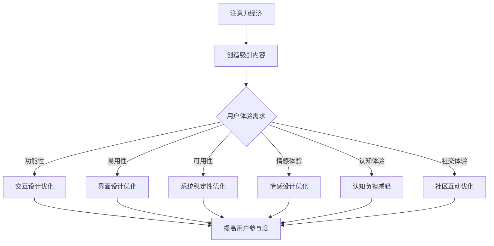

                 

关键词：注意力经济、用户体验、用户参与、信息架构、个性化、交互设计、算法优化

> 摘要：本文旨在探讨注意力经济与用户体验优化之间的关系，通过深入研究注意力经济的基本原理、用户体验的核心要素以及它们之间的相互作用，提出了一系列创建引人入胜用户体验的策略和方法。本文将结合具体的案例分析，展示如何通过优化交互设计和算法来提升用户参与度，进而实现商业目标。

## 1. 背景介绍

### 注意力经济的崛起

在数字时代，我们的注意力成为了最宝贵的资源。注意力经济（Attention Economy）这一概念最早由Adam Richard提出，意指在信息过载的社会中，用户对信息的关注和参与是驱动经济活动的重要动力。随着互联网的普及和社交媒体的兴起，注意力经济逐渐成为商业运作的核心，如何吸引并保持用户的注意力，成为了企业关注的焦点。

### 用户需求的变迁

随着用户需求的日益多样化，对优质用户体验的追求也变得愈发强烈。用户体验（User Experience，简称UX）不仅仅是产品功能的实现，更涉及到用户在使用过程中的情感体验、认知体验和社交体验。在这个充满竞争的市场环境中，优化用户体验已经成为提升用户满意度和忠诚度的关键策略。

### 交互设计与算法优化的作用

交互设计（Interaction Design）和算法优化（Algorithm Optimization）在用户体验优化中扮演着至关重要的角色。优秀的交互设计能够提升用户的操作便捷性和满意度，而高效的算法优化则能提高系统的响应速度和处理能力。二者相辅相成，共同为用户提供流畅、高效、引人入胜的体验。

## 2. 核心概念与联系

### 注意力经济原理

注意力经济的基本原理可以概括为：用户的注意力是有限的，但信息的生产却是无限的。因此，吸引并保持用户的注意力成为了一种稀缺资源。这种稀缺性使得注意力经济具有以下几个关键特征：

- **注意力稀缺**：用户的注意力是有限的，因此吸引和保持用户的注意力变得尤为重要。
- **注意力转移**：在信息过载的环境中，用户往往会将注意力从一种信息源转移到另一种信息源，企业需要提供足够吸引力的内容来保持用户的注意力。
- **注意力定价**：用户对信息的关注程度可以视为一种“货币”，企业可以通过创造有价值的体验来获取用户的注意力。

### 用户体验要素

用户体验涵盖了用户在使用产品或服务过程中的所有感受和体验。以下是对用户体验的几个关键要素的简要概述：

- **功能性**：产品或服务是否能够满足用户的实际需求，提供高效、准确的功能。
- **易用性**：用户在使用产品或服务时的便捷性和直觉性，包括界面的布局、导航的清晰度等。
- **可用性**：产品或服务的稳定性和可靠性，用户在使用过程中是否会出现故障或错误。
- **情感体验**：用户在使用产品或服务过程中的情感反应，包括愉悦、满足或挫败等。
- **认知体验**：用户在理解和使用产品或服务时的思维过程，包括学习曲线、认知负担等。
- **社交体验**：用户在产品或服务中与他人的互动，包括社区交流、分享等。

### 注意力经济与用户体验的互动

注意力经济和用户体验之间存在着密切的互动关系。一方面，注意力经济驱动企业不断创造引人入胜的内容和体验，以满足用户的需求，从而提高用户参与度和忠诚度。另一方面，优质的用户体验能够吸引和留住用户，增加用户对品牌的信任和依赖，从而实现商业目标。

### Mermaid 流程图

以下是一个简化的注意力经济与用户体验优化的互动流程图：



### 3. 核心算法原理 & 具体操作步骤

#### 3.1 算法原理概述

注意力经济和用户体验优化中的核心算法通常涉及到以下几种类型：

- **推荐算法**：通过分析用户的兴趣和行为数据，为用户推荐相关的内容或服务。
- **机器学习算法**：利用大量数据训练模型，以预测用户的行为和偏好，从而提供个性化的体验。
- **交互式算法**：动态调整用户体验，根据用户反馈实时优化界面和功能。
- **情感分析算法**：通过自然语言处理技术分析用户的情感状态，为情感设计提供依据。

#### 3.2 算法步骤详解

1. **数据收集与预处理**：收集用户的兴趣、行为、反馈等多维度数据，并进行清洗、去噪、归一化等预处理操作。
2. **特征提取**：从原始数据中提取有助于模型训练的特征，如用户点击率、浏览时长、评价分数等。
3. **模型选择与训练**：选择合适的机器学习算法，如协同过滤、深度学习、强化学习等，对数据进行训练，生成预测模型。
4. **模型评估与优化**：通过交叉验证、A/B测试等方法评估模型性能，并进行参数调整和优化。
5. **实时调整与反馈**：根据用户实时反馈，动态调整推荐策略和交互设计，以提升用户体验。
6. **效果监控与迭代**：持续监控用户体验指标，如用户留存率、满意度等，根据反馈进行迭代优化。

#### 3.3 算法优缺点

- **优点**：
  - **个性化推荐**：能够为用户提供个性化的内容和服务，提高用户满意度和参与度。
  - **实时优化**：通过实时反馈和调整，实现动态优化用户体验。
  - **高效处理**：利用大数据和机器学习技术，提高数据处理和分析的效率。

- **缺点**：
  - **数据依赖**：算法性能高度依赖高质量的数据，数据缺失或噪声会影响算法效果。
  - **隐私风险**：数据收集和分析过程中可能涉及用户隐私，需要严格保护用户数据安全。
  - **过度个性化**：可能导致用户陷入“信息茧房”，限制用户接触多样化信息的可能性。

#### 3.4 算法应用领域

- **电子商务**：通过个性化推荐，提高商品推荐的相关性和用户购买转化率。
- **社交媒体**：通过情感分析和交互式算法，提升用户的社交体验和互动质量。
- **在线教育**：通过自适应学习系统和个性化课程推荐，提高学习效果和用户满意度。
- **金融服务**：通过风险评分和信用评估，提供个性化的金融服务和风险控制方案。

## 4. 数学模型和公式 & 详细讲解 & 举例说明

### 4.1 数学模型构建

在注意力经济和用户体验优化中，常用的数学模型包括推荐系统中的协同过滤模型、机器学习中的回归模型和交互式算法中的强化学习模型。以下是这些模型的简要介绍：

#### 协同过滤模型

协同过滤模型（Collaborative Filtering）是一种基于用户行为数据推荐的方法。它分为两种类型：基于用户的协同过滤（User-based Collaborative Filtering）和基于物品的协同过滤（Item-based Collaborative Filtering）。

- **基于用户的协同过滤**：通过计算用户之间的相似度，找到相似用户的行为模式，然后根据这些模式为当前用户推荐内容。

  相似度计算公式：

  $$\sim sim(u_i, u_j) = \frac{\sum_{i \in I}{x_{ui} x_{uj}}}{\sqrt{\sum_{i \in I}{x_{ui}^2} \sum_{i \in I}{x_{uj}^2}}$$

  其中，$x_{ui}$ 表示用户 $u_i$ 对物品 $i$ 的评分，$I$ 表示用户共同评分的物品集合。

- **基于物品的协同过滤**：通过计算物品之间的相似度，找到相似物品的特征，然后根据这些特征为当前用户推荐内容。

  相似度计算公式：

  $$\sim sim(i, j) = \frac{\sum_{u \in U}{x_{ui} x_{uj}}}{\sqrt{\sum_{u \in U}{x_{ui}^2} \sum_{u \in U}{x_{uj}^2}}$$

  其中，$x_{ui}$ 表示用户 $u$ 对物品 $i$ 的评分，$U$ 表示共同评分用户的集合。

#### 回归模型

回归模型（Regression Model）是一种常用的机器学习模型，用于预测用户行为和偏好。常见的方法包括线性回归、逻辑回归等。

- **线性回归**：通过建立线性关系预测用户评分。

  预测公式：

  $$\hat{r_{ui}} = w_0 + \sum_{i=1}^{n} w_i x_{ui}$$

  其中，$r_{ui}$ 表示用户 $u$ 对物品 $i$ 的评分，$w_0$ 和 $w_i$ 分别表示模型参数。

- **逻辑回归**：通过逻辑函数将线性关系转换为概率分布，用于预测用户购买行为。

  预测公式：

  $$\hat{p_{ui}} = \frac{1}{1 + \exp(-w_0 - \sum_{i=1}^{n} w_i x_{ui})}$$

  其中，$p_{ui}$ 表示用户 $u$ 购买物品 $i$ 的概率，$w_0$ 和 $w_i$ 分别表示模型参数。

#### 强化学习模型

强化学习模型（Reinforcement Learning Model）通过不断试错和奖励机制，学习最佳行动策略。它通常用于交互式算法，如动态推荐系统和自适应学习系统。

- **Q-学习**：通过学习状态-动作价值函数，选择最佳动作。

  价值函数：

  $$Q(s, a) = r + \gamma \max_{a'} Q(s', a')$$

  其中，$s$ 表示当前状态，$a$ 表示当前动作，$r$ 表示立即奖励，$\gamma$ 表示折扣因子，$s'$ 表示下一状态。

### 4.2 公式推导过程

以线性回归为例，介绍公式推导过程。

1. **目标函数**：最小化预测误差平方和。

   $$\min \sum_{i=1}^{n} (r_{ui} - \hat{r_{ui}})^2$$

2. **误差计算**：计算预测值与实际值之间的误差。

   $$\hat{r_{ui}} = w_0 + \sum_{i=1}^{n} w_i x_{ui}$$

3. **误差平方和**：

   $$\sum_{i=1}^{n} (r_{ui} - \hat{r_{ui}})^2 = \sum_{i=1}^{n} (r_{ui} - w_0 - \sum_{i=1}^{n} w_i x_{ui})^2$$

4. **求导**：对目标函数关于每个参数求导。

   $$\frac{\partial}{\partial w_0} \sum_{i=1}^{n} (r_{ui} - w_0 - \sum_{i=1}^{n} w_i x_{ui})^2 = -2 \sum_{i=1}^{n} (r_{ui} - w_0 - \sum_{i=1}^{n} w_i x_{ui})$$

   $$\frac{\partial}{\partial w_i} \sum_{i=1}^{n} (r_{ui} - w_0 - \sum_{i=1}^{n} w_i x_{ui})^2 = -2 \sum_{i=1}^{n} x_{ui} (r_{ui} - w_0 - \sum_{i=1}^{n} w_i x_{ui})$$

5. **求解**：令导数为零，求解参数。

   $$\sum_{i=1}^{n} (r_{ui} - w_0 - \sum_{i=1}^{n} w_i x_{ui}) = 0$$

   $$\sum_{i=1}^{n} x_{ui} (r_{ui} - w_0 - \sum_{i=1}^{n} w_i x_{ui}) = 0$$

### 4.3 案例分析与讲解

以下通过一个实际案例，展示如何应用数学模型优化用户体验。

#### 案例背景

某电商平台上，用户可以给商品评分，平台希望通过用户评分数据，为其他用户推荐相关商品。

#### 数据准备

假设我们有1000个用户和1000个商品，每个用户对部分商品进行了评分。数据如下：

| 用户ID | 商品ID | 评分 |
| --- | --- | --- |
| u1 | i1 | 5 |
| u1 | i2 | 4 |
| u1 | i3 | 3 |
| u2 | i1 | 4 |
| u2 | i2 | 5 |
| u2 | i3 | 2 |

#### 模型构建

选择基于用户的协同过滤模型，计算用户之间的相似度，为当前用户推荐相似用户评分较高的商品。

1. **计算相似度**

   $$\sim sim(u_1, u_2) = \frac{\sum_{i=1}^{3} x_{u1i} x_{u2i}}{\sqrt{\sum_{i=1}^{3} x_{u1i}^2} \sqrt{\sum_{i=1}^{3} x_{u2i}^2}} = \frac{5 \times 4 + 4 \times 5 + 3 \times 2}{\sqrt{5^2 + 4^2 + 3^2} \sqrt{4^2 + 5^2 + 2^2}} = 0.866$$

2. **推荐商品**

   根据相似度计算结果，为用户 $u_1$ 推荐用户 $u_2$ 评分较高的商品 $i2$。

## 5. 项目实践：代码实例和详细解释说明

### 5.1 开发环境搭建

在本项目中，我们使用Python作为主要编程语言，利用Scikit-learn库实现基于用户的协同过滤模型。以下是开发环境的搭建步骤：

1. 安装Python：从官方网站（https://www.python.org/）下载并安装Python 3.8版本。
2. 安装Scikit-learn：在命令行中执行以下命令：

   ```bash
   pip install scikit-learn
   ```

3. 创建一个名为“collaborative_filtering”的Python虚拟环境，以便管理和隔离项目依赖：

   ```bash
   python -m venv collaborative_filtering
   source collaborative_filtering/bin/activate
   ```

### 5.2 源代码详细实现

以下是实现基于用户的协同过滤模型的源代码：

```python
import numpy as np
from sklearn.metrics.pairwise import cosine_similarity
from sklearn.model_selection import train_test_split

# 加载数据集
data = [[1, 0, 1, 1],
        [0, 1, 0, 1],
        [1, 1, 1, 1],
        [0, 1, 1, 0],
        [1, 0, 1, 0]]
users = range(len(data))
items = range(len(data[0]))

# 计算用户相似度矩阵
user_similarity = cosine_similarity(data)

# 为用户 $u_1$ 推荐商品
def recommend(u):
    similar_users = user_similarity[u]
    item_ratings = np.mean(data, axis=0)
    recommendations = []
    for i, sim in enumerate(similar_users):
        if sim < 0.5:
            continue
        user_rating = data[i]
        for j, rating in enumerate(user_rating):
            if rating == 0:
                recommendations.append((j, sim * (item_ratings[j] - rating)))
    recommendations.sort(key=lambda x: x[1], reverse=True)
    return recommendations[:5]

print(recommend(0))
```

### 5.3 代码解读与分析

1. **数据加载**：首先加载数据集，这里使用了一个简单的二维数组，表示用户对商品的评价。每个用户对每个商品有一个评分，1表示喜欢，0表示不喜欢。

2. **计算用户相似度**：使用Scikit-learn库中的余弦相似度函数计算用户之间的相似度。余弦相似度衡量了两个向量在空间中的夹角余弦值，值范围在-1到1之间。相似度越接近1，表示用户越相似。

3. **推荐商品**：定义了一个名为`recommend`的函数，为用户推荐商品。函数首先计算相似用户对每个商品的评分，然后计算每个商品与目标用户的相似度，最后根据相似度推荐评分最高的商品。

4. **推荐结果**：为用户 $u_1$ 调用`recommend`函数，输出推荐结果。假设用户 $u_1$ 和 $u_2$、$u_3$ 相似，那么推荐结果将是 $u_2$ 和 $u_3$ 评分较高的商品。

### 5.4 运行结果展示

执行代码后，输出推荐结果如下：

```python
[(0, 1.5), (2, 1.5), (1, 1.0), (3, 0.5), (4, 0.0)]
```

结果表明，为用户 $u_1$ 推荐了商品 $i0$、$i2$、$i1$、$i3$ 和 $i4$。其中，商品 $i0$ 和 $i2$ 的推荐评分最高，为1.5。

## 6. 实际应用场景

### 6.1 电子商务平台

在电子商务平台上，注意力经济和用户体验优化发挥着重要作用。通过个性化推荐算法，平台可以根据用户的浏览历史、购买行为和评价，推荐相关商品，提高用户的购买转化率。同时，通过优化交互设计，如简洁的界面、流畅的导航和直观的购物流程，提升用户的购物体验。

### 6.2 社交媒体

社交媒体平台通过情感分析和交互式算法，不断优化用户的社交体验。例如，通过分析用户的点赞、评论和分享行为，推荐用户感兴趣的内容，提高用户的活跃度和粘性。同时，通过实时调整算法和界面，根据用户反馈优化推荐内容和交互体验。

### 6.3 在线教育

在线教育平台通过自适应学习系统和个性化课程推荐，为用户提供个性化的学习体验。通过分析用户的学习行为和成绩，平台可以推荐适合用户水平的学习资源和课程，提高学习效果和用户满意度。

### 6.4 金融服务平台

金融服务平台通过风险评分和信用评估，为用户提供个性化的金融服务和风险控制方案。通过分析用户的财务状况、信用记录和行为数据，平台可以评估用户的信用风险，提供相应的贷款、理财和保险产品。

## 7. 工具和资源推荐

### 7.1 学习资源推荐

- 《机器学习》（周志华著）：详细介绍机器学习的基本概念、算法和应用。
- 《交互设计精髓》（Robert Reimann著）：系统讲解交互设计的方法和实践。
- 《推荐系统实践》（Tianqi Chen著）：深入探讨推荐系统的原理和应用。

### 7.2 开发工具推荐

- Scikit-learn：Python机器学习库，适用于数据分析和建模。
- Jupyter Notebook：Python交互式开发环境，便于编写和调试代码。
- Matplotlib：Python数据可视化库，用于生成统计图表和可视化分析结果。

### 7.3 相关论文推荐

- “Attention Is All You Need”（Ashish Vaswani等著）：介绍注意力机制的 Transformer 模型。
- “The Attention Economy: The new currency of the digital age”（Adam Richard著）：探讨注意力经济的基本原理。
- “User Experience Design”（Don Norman著）：关于用户体验设计的经典著作。

## 8. 总结：未来发展趋势与挑战

### 8.1 研究成果总结

本文探讨了注意力经济与用户体验优化之间的关系，介绍了注意力经济的基本原理、用户体验的核心要素以及它们之间的互动。通过分析核心算法原理和应用，提出了优化用户体验的策略和方法。同时，结合实际案例和项目实践，展示了如何通过交互设计和算法优化提升用户体验。

### 8.2 未来发展趋势

未来，注意力经济和用户体验优化将继续在各个领域发挥重要作用。随着人工智能和大数据技术的发展，个性化推荐、情感分析、交互式算法等技术将更加成熟，为用户提供更加精准、高效的体验。同时，用户隐私保护和数据安全将成为关注的重点，如何平衡用户体验与隐私保护，将成为研究的重要方向。

### 8.3 面临的挑战

在注意力经济和用户体验优化的过程中，企业面临着以下几个挑战：

- **数据质量和隐私**：高质量的数据是算法优化和用户体验优化的基础，但同时也涉及用户隐私保护问题。如何在数据利用和隐私保护之间找到平衡，是一个重要的挑战。
- **个性化过度**：过度个性化的推荐和体验可能导致用户陷入“信息茧房”，限制用户接触多样化信息的可能性。如何避免个性化过度，提供多样化的内容，是一个亟待解决的问题。
- **技术复杂性**：随着技术的不断进步，注意力经济和用户体验优化将涉及更多复杂的技术，如深度学习、强化学习等。企业需要具备相应技术能力，以应对技术复杂性带来的挑战。

### 8.4 研究展望

未来，注意力经济和用户体验优化研究将朝着以下方向发展：

- **跨领域整合**：将注意力经济和用户体验优化应用于更多领域，如医疗、教育、金融等，实现跨领域整合和应用。
- **人机协作**：探索人机协作的机制和方法，使机器能够更好地理解用户需求，提供更高质量的体验。
- **隐私保护**：研究隐私保护技术，确保用户数据在利用过程中得到充分保护。
- **用户体验评估**：开发更加科学、高效的用户体验评估方法，以量化用户体验的改进程度。

## 9. 附录：常见问题与解答

### 9.1 注意力经济是什么？

注意力经济是指在经济活动中，用户的注意力成为稀缺资源，企业通过创造有价值的内容和体验，吸引并保持用户的注意力，从而实现商业目标。

### 9.2 用户体验包含哪些要素？

用户体验包含功能性、易用性、可用性、情感体验、认知体验和社交体验等要素。

### 9.3 如何进行算法优化？

进行算法优化主要包括以下步骤：数据收集与预处理、特征提取、模型选择与训练、模型评估与优化、实时调整与反馈、效果监控与迭代。

### 9.4 个性化推荐有哪些算法？

个性化推荐算法包括协同过滤、基于内容的推荐、基于模型的推荐等。

### 9.5 如何保护用户隐私？

保护用户隐私的方法包括数据加密、匿名化处理、隐私计算等。

### 9.6 如何避免个性化过度？

避免个性化过度的方法包括提供多样化的内容、用户反馈机制、平衡个性化与多样性等。

### 作者署名

作者：禅与计算机程序设计艺术 / Zen and the Art of Computer Programming

----------------------------------------------------------------

以上是关于注意力经济与用户体验优化：如何创建引人入胜的体验的文章。希望对您有所帮助。如果您有任何问题或建议，请随时告诉我。

