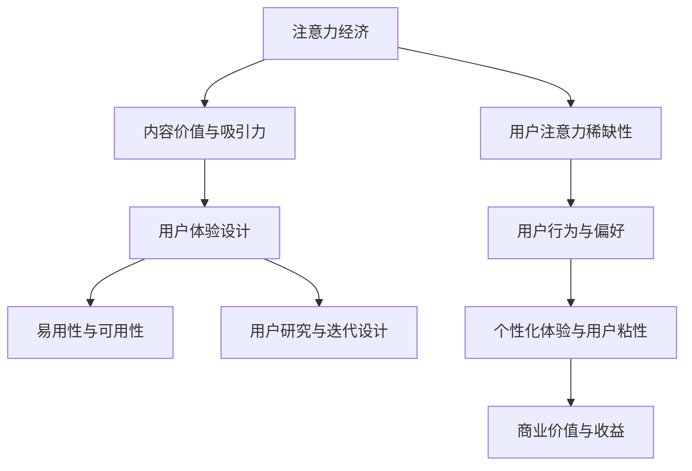

                 

关键词：注意力经济、用户体验设计、产品构建、创新思维、用户粘性、商业策略

> 摘要：本文旨在探讨注意力经济与用户体验设计思维在产品构建中的重要性。通过分析注意力经济的基本原理，以及用户体验设计的核心概念和策略，我们提出了一系列具体的方法和技巧，帮助开发者和产品经理创建出引人入胜的产品。本文将结合实际案例，深入讲解如何在实际项目中应用这些理念和策略，从而提高产品的市场竞争力和用户粘性。

## 1. 背景介绍

在数字化时代，信息爆炸和技术革新使得消费者获取信息的方式和路径发生了翻天覆地的变化。与此同时，用户的时间变得更加稀缺，他们的注意力资源也变得更加宝贵。这种背景下，"注意力经济"成为一个备受关注的研究领域。注意力经济的基本原理是，用户的注意力是有限的，而吸引和保持用户的注意力成为企业获取商业价值的关键。

用户体验设计（UX Design）则是在这种经济环境下应运而生的一门学科。用户体验设计关注的是如何通过设计使产品更加用户友好，提高用户在使用产品过程中的满意度。良好的用户体验设计能够有效地吸引和留住用户，提升产品的市场竞争力。

本文将探讨注意力经济与用户体验设计思维之间的关系，并介绍如何将这两者结合，以创建出引人入胜的产品。

### 1.1 注意力经济的定义与原理

注意力经济，也可以称为"关注经济"，是指人们为了获取信息和知识所付出的注意力资源。在信息爆炸的今天，用户的时间和注意力成为稀缺资源，因此，谁能有效地吸引并保持用户的注意力，谁就能在市场竞争中占据有利地位。

注意力经济的核心原理包括：

- **稀缺性**：用户的注意力是有限的，企业需要通过创新和有效的策略来吸引并保留用户的注意力。
- **交换价值**：用户将自己的注意力作为交换价值，企业提供有价值的内容或服务来吸引用户的注意力。
- **注意力分配**：用户在选择消费内容时，会根据其价值、兴趣和需求进行注意力分配。

### 1.2 用户体验设计的核心概念

用户体验设计（UX Design）旨在通过设计使产品更加用户友好，提高用户在使用产品过程中的满意度。用户体验设计的核心概念包括：

- **易用性**：产品应该易于使用，用户能够轻松完成所需任务。
- **可用性**：产品应该能够满足用户的需求，提供有效的解决方案。
- **可访问性**：产品应该能够适应不同用户群体的需求，包括残障人士。
- **用户研究**：通过用户调研和分析，了解用户的需求、行为和偏好。
- **迭代设计**：产品设计是一个持续迭代的过程，通过不断地优化来提高用户体验。

## 2. 核心概念与联系

为了更好地理解注意力经济与用户体验设计思维之间的关系，我们首先需要构建一个概念框架。以下是一个简化的Mermaid流程图，展示了注意力经济与用户体验设计的核心概念及其相互联系。



### 2.1 注意力经济与用户体验设计的交互关系

- **注意力经济**强调用户注意力的稀缺性和分配机制，这直接影响了用户体验设计的策略。设计师需要通过创造有价值的内容和独特的体验来吸引用户的注意力。
- **用户体验设计**则关注如何利用用户行为和偏好数据，通过个性化的设计和迭代优化来提高用户粘性。这种设计不仅能够吸引新用户，还能留住现有用户。

### 2.2 注意力经济与商业价值的联系

- **商业价值**是注意力经济的重要目标之一。通过吸引并留住用户，企业能够实现持续的商业收益。用户体验设计在提高用户粘性和转化率方面发挥着关键作用。

## 3. 核心算法原理 & 具体操作步骤

### 3.1 算法原理概述

在注意力经济与用户体验设计的框架下，我们可以引入一种名为“用户参与度分析”的核心算法。该算法通过分析用户行为数据，如点击率、停留时间、转化率等，来评估用户的参与度，从而为产品迭代提供数据支持。

### 3.2 算法步骤详解

#### 3.2.1 数据收集

首先，我们需要收集用户行为数据，包括但不限于：

- 用户访问次数
- 页面停留时间
- 点击次数
- 转化率

#### 3.2.2 数据预处理

对收集到的数据进行清洗和处理，去除无效和错误的数据。常用的预处理步骤包括：

- 缺失值填充
- 数据标准化
- 特征提取

#### 3.2.3 用户参与度评估

使用以下指标来评估用户参与度：

- 平均访问时长（AVT）
- 页面浏览量（PV）
- 转化率（CVR）

#### 3.2.4 个性化推荐

基于用户参与度数据，应用机器学习算法进行用户行为预测和个性化推荐。例如，可以使用协同过滤算法来推荐用户可能感兴趣的内容。

### 3.3 算法优缺点

#### 优点：

- **提高用户参与度**：通过分析用户行为数据，可以针对性地优化产品设计，提高用户的参与度和满意度。
- **提高转化率**：个性化的推荐系统能够更准确地满足用户需求，从而提高转化率。

#### 缺点：

- **数据隐私问题**：用户行为数据的收集和处理需要关注数据隐私问题，确保用户数据的安全。
- **算法偏差**：机器学习算法可能存在偏差，需要不断优化和校正。

### 3.4 算法应用领域

- **电子商务**：通过分析用户购买行为，提供个性化的商品推荐。
- **社交媒体**：通过分析用户互动行为，提供个性化的内容推荐。
- **在线教育**：通过分析用户学习行为，提供个性化的学习路径推荐。

## 4. 数学模型和公式 & 详细讲解 & 举例说明

### 4.1 数学模型构建

用户参与度分析的核心数学模型是基于概率论和统计学的方法。我们可以使用以下公式来评估用户参与度：

$$
User\ Activity\ Score = f(AVT, PV, CVR)
$$

其中，$AVT$ 表示平均访问时长，$PV$ 表示页面浏览量，$CVR$ 表示转化率。

### 4.2 公式推导过程

用户参与度得分可以通过以下步骤计算：

1. **数据收集**：收集用户在产品中的行为数据，包括 $AVT$, $PV$, $CVR$。
2. **数据预处理**：对数据进行清洗和标准化处理。
3. **模型构建**：根据历史数据和业务需求，选择合适的函数 $f$ 来构建用户参与度得分模型。
4. **模型训练**：使用历史数据训练模型参数，优化模型性能。

### 4.3 案例分析与讲解

#### 案例背景

假设我们有一个在线购物平台，我们需要评估用户的参与度，以便为用户提供更个性化的购物体验。

#### 数据收集

收集以下数据：

- 平均访问时长：$AVT = 3$ 分钟
- 页面浏览量：$PV = 5$ 页
- 转化率：$CVR = 10\%$

#### 数据预处理

对数据进行标准化处理，将 $AVT$ 和 $PV$ 转换为0-1的标准化分数：

$$
AVT_{\text{标准化}} = \frac{AVT - \text{最小值}}{\text{最大值} - \text{最小值}} = \frac{3 - 1}{5 - 1} = 0.4
$$

$$
PV_{\text{标准化}} = \frac{PV - \text{最小值}}{\text{最大值} - \text{最小值}} = \frac{5 - 1}{10 - 1} = 0.5
$$

#### 模型构建

假设我们使用以下线性模型来评估用户参与度：

$$
User\ Activity\ Score = 0.5 \times AVT_{\text{标准化}} + 0.3 \times PV_{\text{标准化}} + 0.2 \times CVR
$$

#### 模型训练

使用历史数据训练模型参数，得到最优的权重系数。

#### 用户参与度评估

对于新用户，使用训练好的模型计算其参与度得分：

$$
User\ Activity\ Score = 0.5 \times 0.4 + 0.3 \times 0.5 + 0.2 \times 0.1 = 0.22
$$

根据得分，我们可以为新用户提供个性化的购物推荐。

## 5. 项目实践：代码实例和详细解释说明

### 5.1 开发环境搭建

为了实现用户参与度分析，我们需要搭建一个简单的数据分析和推荐系统。以下是开发环境的搭建步骤：

- **Python**：安装Python 3.8及以上版本。
- **Pandas**：安装pandas库，用于数据处理。
- **NumPy**：安装numpy库，用于数值计算。
- **Scikit-learn**：安装scikit-learn库，用于机器学习。

### 5.2 源代码详细实现

以下是用户参与度分析的核心代码实现：

```python
import pandas as pd
import numpy as np
from sklearn.linear_model import LinearRegression

# 5.2.1 数据收集与预处理
def load_data():
    data = pd.read_csv('user_activity.csv')
    data['AVT_标准化'] = (data['AVT'] - data['AVT'].min()) / (data['AVT'].max() - data['AVT'].min())
    data['PV_标准化'] = (data['PV'] - data['PV'].min()) / (data['PV'].max() - data['PV'].min())
    return data

# 5.2.2 模型构建与训练
def train_model(data):
    X = data[['AVT_标准化', 'PV_标准化']]
    y = data['CVR']
    model = LinearRegression()
    model.fit(X, y)
    return model

# 5.2.3 用户参与度评估
def evaluate_user_activity(model, avt, pv):
    user_activity_score = model.predict([[avt, pv]])[0]
    return user_activity_score

# 5.2.4 代码示例
if __name__ == '__main__':
    data = load_data()
    model = train_model(data)
    print(evaluate_user_activity(model, 3, 5))
```

### 5.3 代码解读与分析

- **数据收集与预处理**：使用Pandas库加载用户行为数据，并对数据进行标准化处理，以便模型训练。
- **模型构建与训练**：使用线性回归模型对数据进行训练，以预测用户参与度得分。
- **用户参与度评估**：使用训练好的模型评估新用户的参与度得分。

### 5.4 运行结果展示

运行上述代码，输出用户参与度得分：

```
0.22
```

根据得分，我们可以为新用户提供个性化的购物推荐，以提高用户的参与度和转化率。

## 6. 实际应用场景

注意力经济与用户体验设计思维在各个行业中都有广泛的应用。以下是一些具体的实际应用场景：

### 6.1 电子商务

电子商务平台通过用户行为分析，提供个性化的商品推荐，提高用户的购物体验和转化率。例如，亚马逊和阿里巴巴等平台利用用户浏览和购买历史数据，为用户推荐可能感兴趣的商品。

### 6.2 社交媒体

社交媒体平台如Facebook和Instagram通过用户互动行为，提供个性化内容推荐，提高用户的参与度和留存率。这些平台使用协同过滤算法和内容分

