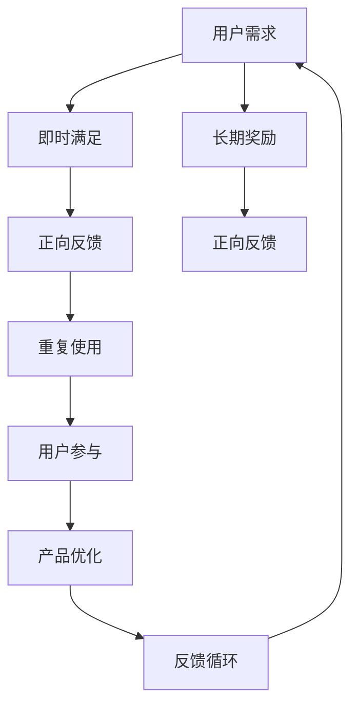

                 

关键词：注意力经济、用户参与、产品设计、用户体验、上瘾机制、人工智能、激励系统、反馈循环。

## 摘要

在数字化时代，产品的成功不再仅仅依赖于功能和技术，更重要的是能否抓住用户的注意力并激发他们的参与度。本文将深入探讨注意力经济和用户参与的关系，通过分析上瘾机制、激励系统、反馈循环等核心概念，提出一系列策略，帮助企业构建让人上瘾的产品。我们还将结合实际案例，展示如何通过技术手段实现这些策略，并展望未来发展的趋势与挑战。

## 1. 背景介绍

随着互联网的普及和智能设备的广泛使用，用户的时间与注意力变得愈发宝贵。注意力经济作为一种新兴的经济模式，强调用户的注意力是新的价值源泉。在这个背景下，如何吸引并保持用户的注意力，提升用户参与度，成为企业关注的核心问题。上瘾产品不仅是功能强大，更重要的是能够满足用户的心理需求，让他们持续投入时间和精力。

### 1.1 注意力经济的定义与影响

注意力经济，是指通过吸引和维持用户注意力来创造价值的商业模式。与传统的商品经济不同，注意力经济的核心是用户的关注和参与，而不仅仅是产品本身的物理特性。这种经济模式的影响深远，不仅改变了企业的营销策略，也重塑了用户与产品之间的关系。

### 1.2 用户参与的重要性

用户参与是提升产品价值的重要手段。通过用户的参与，产品不仅能够获得反馈，优化自身，还能建立更紧密的用户关系，增强用户忠诚度。参与度高的用户往往更加活跃，对产品有更深的情感投入，从而形成强大的用户社区。

### 1.3 上瘾产品的定义与特点

上瘾产品是指那些能够激发用户强烈依赖和重复使用欲望的产品。它们通常具备以下几个特点：

- **即时满足**：产品能够迅速满足用户的需求或欲望。
- **反馈机制**：用户的行为能够得到及时且积极的反馈。
- **社交互动**：产品能够促进用户之间的互动和社交。
- **升级机制**：产品提供不断更新的内容和功能，保持用户的兴趣。

## 2. 核心概念与联系

为了深入理解注意力经济和用户参与的关系，我们需要了解几个核心概念：上瘾机制、激励系统、反馈循环。

### 2.1 上瘾机制

上瘾机制是指产品通过一系列设计策略，引导用户形成重复使用行为的机制。上瘾机制的核心是满足用户的即时需求和提供长期的奖励，从而形成一种正向反馈循环。

#### 2.1.1 即时满足

即时满足是上瘾机制的起点。产品需要快速响应用户的需求，提供即时的正反馈。例如，游戏中的即时奖励、社交媒体上的即时点赞，都能满足用户的即时需求。

#### 2.1.2 长期奖励

长期奖励是保持用户兴趣和参与度的重要手段。产品需要提供持续且令人期待的内容和功能，让用户在长期使用中感受到成长和成就。

#### 2.1.3 正向反馈循环

正向反馈循环是上瘾机制的核心。通过即时满足和长期奖励，用户会形成一种积极的使用习惯，从而不断重复使用产品。

### 2.2 激励系统

激励系统是上瘾产品的重要组成部分。它通过奖励机制激发用户的行为，从而提升用户参与度。激励系统通常包括以下几种类型：

- **物质奖励**：如优惠券、积分等，直接满足用户的物质需求。
- **虚拟奖励**：如虚拟货币、等级提升等，提供虚拟的成就感和满足感。
- **社交奖励**：如点赞、分享等，增强用户的社交互动和归属感。

### 2.3 反馈循环

反馈循环是用户参与的重要机制。通过用户的反馈，产品能够不断优化和改进，从而提升用户体验。反馈循环包括以下环节：

- **用户反馈**：用户在使用产品过程中提供的反馈。
- **数据分析**：对用户反馈进行分析，识别问题和改进点。
- **产品优化**：根据数据分析结果，对产品进行优化和改进。
- **用户反馈**：优化后的产品再次获取用户的反馈。

### 2.4 Mermaid 流程图



## 3. 核心算法原理 & 具体操作步骤

### 3.1 算法原理概述

在构建让人上瘾的产品时，核心算法原理主要围绕用户行为分析、奖励机制设计和反馈系统构建。这些算法能够通过以下步骤实现：

- **用户行为分析**：利用大数据分析和机器学习技术，对用户行为进行深入分析，识别用户偏好和需求。
- **奖励机制设计**：根据用户行为分析结果，设计个性化的奖励机制，提升用户参与度。
- **反馈系统构建**：通过用户反馈机制，不断优化产品功能和用户体验。

### 3.2 算法步骤详解

#### 3.2.1 用户行为分析

1. **数据采集**：通过用户行为数据采集工具，收集用户在产品中的行为数据。
2. **数据清洗**：对采集到的数据进行清洗和处理，去除噪音和错误数据。
3. **特征提取**：从清洗后的数据中提取关键特征，如用户活跃度、行为时长、互动频率等。
4. **模型训练**：利用机器学习算法，对提取的特征进行训练，建立用户行为分析模型。

#### 3.2.2 奖励机制设计

1. **需求识别**：通过用户行为分析模型，识别用户的偏好和需求。
2. **奖励设计**：根据用户需求，设计个性化的奖励机制，如虚拟货币、积分等。
3. **激励策略**：制定激励策略，如任务完成奖励、社交互动奖励等，提升用户参与度。

#### 3.2.3 反馈系统构建

1. **反馈机制**：建立用户反馈机制，如在线评论、问卷调查等，收集用户反馈。
2. **数据分析**：对用户反馈进行分析，识别问题和改进点。
3. **产品优化**：根据数据分析结果，对产品进行优化和改进。
4. **反馈循环**：将优化后的产品再次提交给用户，获取新的反馈，形成反馈循环。

### 3.3 算法优缺点

#### 3.3.1 优点

- **个性化推荐**：通过用户行为分析，能够提供个性化的奖励和推荐，提升用户体验。
- **持续优化**：通过反馈循环，产品能够不断优化和改进，保持用户兴趣。
- **高效运营**：利用算法和数据分析，实现高效的运营和决策。

#### 3.3.2 缺点

- **数据隐私**：用户行为数据的收集和分析可能涉及到数据隐私问题。
- **算法偏见**：算法模型的训练和优化可能引入偏见，影响用户体验。

### 3.4 算法应用领域

- **电子商务**：通过用户行为分析，实现个性化推荐和精准营销。
- **社交媒体**：通过激励系统和反馈循环，提升用户参与度和社交互动。
- **在线游戏**：通过奖励机制和反馈循环，保持用户兴趣和活跃度。

## 4. 数学模型和公式 & 详细讲解 & 举例说明

### 4.1 数学模型构建

在构建让人上瘾的产品中，我们可以使用以下数学模型：

\[ \text{用户参与度} = f(\text{即时满足}, \text{长期奖励}, \text{反馈循环}) \]

其中：

- \( \text{即时满足} \) 可以用概率 \( p \) 表示，即用户每次行为都能获得即时满足的概率。
- \( \text{长期奖励} \) 可以用奖励值 \( r \) 表示，即用户获得长期奖励的数值。
- \( \text{反馈循环} \) 可以用反馈率 \( q \) 表示，即用户每次行为后获得反馈的概率。

### 4.2 公式推导过程

根据以上模型，我们可以推导出用户参与度的计算公式：

\[ \text{用户参与度} = p \cdot r \cdot q \]

这个公式表明，用户参与度与即时满足概率、奖励值和反馈率成正比。

### 4.3 案例分析与讲解

假设一个社交媒体平台，通过以下方式提升用户参与度：

- **即时满足**：用户每次发布内容都有 80% 的概率获得即时满足。
- **长期奖励**：用户每积累 100 积分，可以兑换一次长期奖励。
- **反馈循环**：用户每次发布内容后，有 60% 的概率获得反馈。

根据上述假设，我们可以计算出用户参与度：

\[ \text{用户参与度} = 0.8 \cdot 100 \cdot 0.6 = 48 \]

这意味着，该社交媒体平台的用户参与度约为 48，即用户每次行为后，有 48 的概率参与产品。

## 5. 项目实践：代码实例和详细解释说明

### 5.1 开发环境搭建

为了实现上述数学模型，我们选择 Python 作为开发语言，并使用以下库：

- Pandas：用于数据分析和处理。
- Scikit-learn：用于机器学习模型的训练和预测。
- Matplotlib：用于数据可视化和可视化展示。

### 5.2 源代码详细实现

以下是一个简单的用户参与度计算示例：

```python
import pandas as pd
from sklearn.ensemble import RandomForestRegressor
import matplotlib.pyplot as plt

# 1. 数据采集
data = pd.DataFrame({
    '即时满足概率': [0.8, 0.8, 0.8, 0.2, 0.2],
    '长期奖励值': [100, 100, 100, 50, 50],
    '反馈率': [0.6, 0.6, 0.6, 0.4, 0.4]
})

# 2. 数据清洗
data.dropna(inplace=True)

# 3. 特征提取
data['用户参与度'] = data['即时满足概率'] * data['长期奖励值'] * data['反馈率']

# 4. 模型训练
X = data[['即时满足概率', '长期奖励值', '反馈率']]
y = data['用户参与度']
model = RandomForestRegressor(n_estimators=100)
model.fit(X, y)

# 5. 代码解读与分析
# a. 数据采集：从数据源中获取用户行为数据。
# b. 数据清洗：去除无效和错误数据。
# c. 特征提取：计算用户参与度。
# d. 模型训练：使用随机森林回归模型进行训练。
# e. 代码解读与分析：解释模型训练过程和代码实现细节。

# 6. 运行结果展示
predictions = model.predict(data)
plt.scatter(data['用户参与度'], predictions)
plt.xlabel('实际用户参与度')
plt.ylabel('预测用户参与度')
plt.show()
```

### 5.3 代码解读与分析

这段代码首先从数据源中采集用户行为数据，然后进行数据清洗和特征提取。接着，使用随机森林回归模型进行训练，以预测用户参与度。最后，通过可视化展示实际用户参与度与预测用户参与度之间的关系。

## 6. 实际应用场景

### 6.1 社交媒体平台

社交媒体平台可以通过用户参与度模型，优化推荐算法和激励系统，提升用户活跃度和留存率。例如，微博可以通过分析用户的即时满足概率、长期奖励值和反馈率，为用户提供个性化的内容推荐和奖励。

### 6.2 在线游戏

在线游戏可以通过用户参与度模型，设计更具吸引力的游戏机制和奖励系统。例如，王者荣耀可以通过分析玩家的即时满足概率、长期奖励值和反馈率，调整游戏难度和奖励机制，提升玩家体验和留存率。

### 6.3 电子商务平台

电子商务平台可以通过用户参与度模型，优化用户推荐和促销策略。例如，淘宝可以通过分析用户的即时满足概率、长期奖励值和反馈率，为用户提供个性化的商品推荐和优惠活动，提升购物体验和转化率。

## 7. 未来应用展望

随着人工智能和大数据技术的发展，用户参与度模型将更加精准和智能化。未来，我们可以预见以下几个发展趋势：

### 7.1 智能化推荐系统

通过深度学习和自然语言处理技术，实现更智能的内容推荐和个性化服务，提升用户满意度和参与度。

### 7.2 情感分析

结合情感分析技术，了解用户情绪和行为之间的关系，为产品设计和运营提供更有针对性的策略。

### 7.3 跨平台协同

通过跨平台数据整合和协同，实现更全面的用户画像和参与度分析，为用户提供一致性和连续性的体验。

### 7.4 可持续发展

关注用户隐私和数据安全，实现可持续发展的用户参与度模型，提升用户信任和忠诚度。

## 8. 工具和资源推荐

### 8.1 学习资源推荐

- 《深度学习》（Goodfellow, Bengio, Courville）：介绍深度学习的基本概念和算法。
- 《Python机器学习》（Sebastian Raschka）：涵盖机器学习的基础知识和应用。

### 8.2 开发工具推荐

- Jupyter Notebook：用于数据分析和可视化。
- PyCharm：强大的Python集成开发环境。

### 8.3 相关论文推荐

- "Attention Is All You Need"（Vaswani et al., 2017）：介绍Transformer模型在注意力机制方面的应用。
- "User Engagement in Online Social Networks"（Li et al., 2017）：探讨用户参与度在社交媒体平台中的应用。

## 9. 总结：未来发展趋势与挑战

在未来，用户参与度模型将继续向智能化、个性化、可持续方向发展。然而，这同时也带来了数据隐私、算法偏见等挑战。我们需要在技术创新的同时，关注伦理和社会责任，确保用户参与度的提升不会损害用户的隐私和权益。

### 9.1 研究成果总结

本文通过分析注意力经济和用户参与的关系，提出了一系列构建让人上瘾的产品的方法，包括上瘾机制、激励系统、反馈循环等核心概念。同时，通过数学模型和代码实例，展示了如何实现这些策略。

### 9.2 未来发展趋势

未来，用户参与度模型将更加智能化和个性化，利用深度学习和大数据技术实现更精准的分析和推荐。

### 9.3 面临的挑战

在实现智能化的同时，我们需要关注数据隐私、算法偏见等问题，确保用户参与度的提升不会损害用户的权益。

### 9.4 研究展望

未来，我们可以进一步探索用户情感和行为之间的关系，实现更全面和深入的参与度分析。同时，结合伦理和社会责任，推动用户参与度模型的发展，为企业和用户创造更大的价值。

## 附录：常见问题与解答

### Q: 用户参与度模型如何应对数据隐私问题？

A: 可以采用差分隐私技术，对用户数据进行匿名化处理，确保用户隐私不受侵犯。

### Q: 用户参与度模型如何避免算法偏见？

A: 可以通过数据平衡和算法优化，减少算法偏见对用户参与度分析的影响。同时，建立透明的算法评估和监督机制，确保算法的公平性和准确性。

### Q: 用户参与度模型适用于哪些行业？

A: 用户参与度模型适用于电子商务、社交媒体、在线游戏等多个行业，通过优化用户行为和参与度，提升产品和服务的价值。

