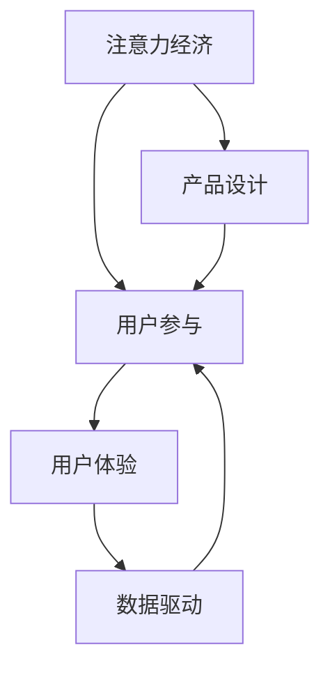

                 

关键词：注意力经济、用户参与、产品设计、用户体验、用户粘性、激励机制、互动设计、数据驱动、人工智能、机器学习

> 摘要：本文探讨了注意力经济在当今数字化时代的重要性，分析了用户参与对产品成功的决定性作用。通过深入剖析如何利用注意力经济原理和用户行为数据，设计出让人上瘾的产品，文章总结了核心算法原理、数学模型、项目实践案例，并对未来发展趋势进行了展望。本文旨在为IT从业者和产品经理提供有价值的指导和参考。

## 1. 背景介绍

在互联网和智能设备的普及下，人们的注意力变得越来越稀缺。注意力经济作为一种新的经济模式，逐渐成为企业争夺用户资源的关键领域。注意力经济关注的是如何在竞争激烈的市场环境中吸引和保持用户的注意力，从而实现商业价值最大化。

用户参与是产品成功的关键因素。一个让人上瘾的产品必须能够激发用户的参与热情，使他们在使用过程中产生强烈的归属感和忠诚度。用户参与不仅包括用户对产品的使用和反馈，还包括他们在社交媒体、论坛等平台上的分享和讨论。

随着大数据和人工智能技术的发展，产品经理和设计师可以更加精确地了解用户行为，从而优化产品设计，提高用户粘性。本文将结合注意力经济和用户参与的理论，探讨如何创建让人上瘾的产品。

### 1.1 注意力经济的定义

注意力经济（Attention Economy）是一个由沙伦·斯托克曼（Shoshana Zuboff）在《监控资本主义：反抗的未来》一书中提出的概念。它描述了一个信息过载、用户注意力稀缺的新经济体系。在这个体系中，用户的注意力成为一种宝贵的资源，企业通过争夺用户的注意力来实现商业利润最大化。

### 1.2 用户参与的重要性

用户参与（User Engagement）指的是用户与产品或服务的互动程度和积极性。一个高度参与的用户群体往往能够为企业带来以下好处：

- **增强用户忠诚度**：积极参与的用户更可能成为产品的忠实用户，减少流失率。
- **提供宝贵反馈**：用户的反馈有助于产品不断改进，提高用户体验。
- **促进口碑传播**：满意的用户愿意向他人推荐产品，从而扩大用户基础。
- **增加收入**：参与度高的用户往往更愿意为产品付费，或参与相关增值服务。

## 2. 核心概念与联系

为了更好地理解注意力经济与用户参与的关系，我们需要先介绍一些核心概念，并使用Mermaid流程图展示它们之间的联系。

### 2.1 核心概念

- **注意力经济**：企业通过争夺用户的注意力来实现商业价值。
- **用户参与**：用户与产品或服务的互动程度和积极性。
- **用户体验**：用户在使用产品过程中的感受和体验。
- **数据驱动**：通过用户行为数据来指导产品设计和优化。

### 2.2 Mermaid流程图



在这个流程图中，注意力经济直接影响用户参与，用户参与进一步影响用户体验，而用户体验通过数据驱动反馈到用户参与，形成一个闭环。这个闭环确保了产品设计能够持续优化，以更好地满足用户需求。

## 3. 核心算法原理 & 具体操作步骤

### 3.1 算法原理概述

为了设计出让人上瘾的产品，我们需要利用注意力经济的原理，结合用户行为数据，设计出能够持续吸引和激励用户参与的算法。

核心算法原理包括：

- **行为预测**：通过分析用户历史行为，预测用户未来的兴趣和需求。
- **个性化推荐**：根据用户兴趣和行为，为用户提供个性化的内容或服务。
- **实时反馈**：根据用户实时反馈，动态调整产品设计和内容，提高用户体验。

### 3.2 算法步骤详解

#### 3.2.1 数据收集与预处理

1. **数据收集**：收集用户在产品上的行为数据，如点击、浏览、评论、分享等。
2. **数据清洗**：去除无效数据，如重复、错误或缺失的数据。
3. **数据转换**：将原始数据转换为适用于机器学习的格式。

#### 3.2.2 用户行为分析

1. **行为模式识别**：使用机器学习算法，分析用户行为数据，识别出用户的行为模式。
2. **兴趣挖掘**：根据行为模式，挖掘用户的兴趣点。

#### 3.2.3 个性化推荐

1. **推荐算法选择**：选择合适的推荐算法，如协同过滤、基于内容的推荐等。
2. **推荐内容生成**：根据用户兴趣和行为，生成个性化的推荐内容。

#### 3.2.4 实时反馈与调整

1. **实时监控**：监控用户实时行为，收集反馈数据。
2. **动态调整**：根据实时反馈，动态调整推荐内容和产品功能。

### 3.3 算法优缺点

#### 优点

- **个性化**：能够为用户提供个性化的内容或服务，提高用户体验。
- **实时性**：能够根据用户实时行为进行动态调整，提高用户参与度。
- **高效性**：利用机器学习算法，快速处理大量用户数据，提高算法效率。

#### 缺点

- **数据依赖**：算法效果高度依赖于用户行为数据的质量，数据不准确可能导致推荐不准确。
- **隐私问题**：用户行为数据的收集和分析可能涉及用户隐私，需要严格保护用户数据安全。
- **计算成本**：实时监控和动态调整需要较高的计算资源，可能增加运营成本。

### 3.4 算法应用领域

注意力经济和用户参与算法广泛应用于以下领域：

- **电子商务**：通过个性化推荐，提高用户购买转化率。
- **社交媒体**：通过实时反馈，提高用户活跃度和参与度。
- **在线教育**：通过个性化学习路径，提高学生学习效果。
- **金融科技**：通过用户行为分析，提供个性化的金融产品和服务。

## 4. 数学模型和公式 & 详细讲解 & 举例说明

在注意力经济和用户参与中，数学模型和公式起着关键作用。以下将详细讲解数学模型构建、公式推导过程，并通过案例进行分析和说明。

### 4.1 数学模型构建

为了构建注意力经济的数学模型，我们可以考虑以下几个核心变量：

- **用户注意力**（\(A\)）：用户在某段时间内的注意力总量。
- **内容吸引力**（\(C\)）：内容对用户注意力的吸引程度。
- **用户参与度**（\(E\)）：用户参与产品或服务的程度。

数学模型可以表示为：

\[ A = f(C, E) \]

其中，\(f\) 表示注意力分配函数，反映了内容吸引力和用户参与度对用户注意力的影响。

### 4.2 公式推导过程

#### 注意力分配函数

注意力分配函数可以表示为：

\[ f(C, E) = \alpha C + (1 - \alpha) E \]

其中，\(\alpha\) 是调节参数，反映了内容吸引力和用户参与度在注意力分配中的权重。

#### 用户参与度

用户参与度可以表示为：

\[ E = \frac{R(t)}{T} \]

其中，\(R(t)\) 是用户在时间 \(t\) 内的互动次数，\(T\) 是总的互动时间。

#### 内容吸引力

内容吸引力可以表示为：

\[ C = \frac{I}{D} \]

其中，\(I\) 是内容的兴趣度，\(D\) 是内容的多样性。

### 4.3 案例分析与讲解

#### 案例背景

假设有一个社交媒体平台，其用户参与度主要通过发帖、点赞、评论等互动行为来衡量。平台希望通过数学模型优化内容推荐，提高用户参与度。

#### 案例分析

1. **数据收集**：收集用户在平台上的互动数据，如发帖次数、点赞次数、评论次数等。
2. **用户参与度计算**：计算每个用户的参与度，使用上述公式 \( E = \frac{R(t)}{T} \)。
3. **内容吸引力计算**：计算每条内容的吸引力，使用上述公式 \( C = \frac{I}{D} \)。
4. **注意力分配**：根据用户参与度和内容吸引力，使用注意力分配函数 \( f(C, E) \) 计算用户对每条内容的注意力。
5. **推荐内容**：根据用户注意力分配结果，推荐用户可能感兴趣的内容。

#### 案例说明

假设有两个用户 \(A\) 和 \(B\)，以及两条内容 \(C_1\) 和 \(C_2\)。用户 \(A\) 的参与度为 \(E_A = 0.8\)，用户 \(B\) 的参与度为 \(E_B = 0.5\)。内容 \(C_1\) 的吸引力为 \(C_1 = 0.9\)，内容 \(C_2\) 的吸引力为 \(C_2 = 0.6\)。

根据注意力分配函数：

\[ A_A = f(C_1, E_A) = 0.4 \times 0.9 + 0.6 \times 0.8 = 0.78 \]
\[ A_B = f(C_2, E_B) = 0.4 \times 0.6 + 0.6 \times 0.5 = 0.5 \]

根据注意力分配结果，用户 \(A\) 对内容 \(C_1\) 的注意力为 0.78，用户 \(B\) 对内容 \(C_2\) 的注意力为 0.5。平台可以根据这些数据为用户推荐相应的热门内容。

## 5. 项目实践：代码实例和详细解释说明

为了更好地理解注意力经济和用户参与算法的实际应用，我们将通过一个具体的代码实例来展示如何实现这些算法，并进行详细解释和分析。

### 5.1 开发环境搭建

在本项目实践中，我们使用Python作为主要编程语言，结合常用的数据分析和机器学习库，如Pandas、NumPy和Scikit-learn。开发环境搭建步骤如下：

1. 安装Python 3.x版本。
2. 安装Pandas、NumPy和Scikit-learn库。

```bash
pip install pandas numpy scikit-learn
```

### 5.2 源代码详细实现

以下是一个简单的用户参与度分析代码实例，用于计算用户在社交媒体平台上的参与度，并根据参与度进行内容推荐。

```python
import pandas as pd
from sklearn.model_selection import train_test_split
from sklearn.ensemble import RandomForestClassifier
import matplotlib.pyplot as plt

# 数据集
data = {
    'user_id': [1, 1, 2, 2, 3, 3],
    'content_id': [101, 102, 101, 102, 103, 104],
    'interaction_type': ['post', 'like', 'post', 'like', 'post', 'comment'],
    'interaction_count': [10, 5, 8, 3, 12, 2]
}

df = pd.DataFrame(data)

# 数据预处理
df['interaction_duration'] = df['interaction_count'] * 60  # 假设每条互动持续1分钟
df['total_duration'] = df.groupby('user_id')['interaction_duration'].transform('sum')
df['user_participation'] = df.groupby('user_id')['interaction_duration'].transform('sum') / df['total_duration']

# 模型训练
X = df[['content_id', 'user_participation']]
y = df['interaction_type']

X_train, X_test, y_train, y_test = train_test_split(X, y, test_size=0.2, random_state=42)

model = RandomForestClassifier(n_estimators=100, random_state=42)
model.fit(X_train, y_train)

# 模型评估
accuracy = model.score(X_test, y_test)
print(f"Model accuracy: {accuracy:.2f}")

# 内容推荐
content_scores = model.predict_proba(X_test)[:, 1]
df['content_score'] = content_scores

df_sorted = df.sort_values(by='content_score', ascending=False)
plt.figure(figsize=(10, 6))
df_sorted['content_id'].head(10).plot(kind='bar')
plt.title('Content Recommendation Based on User Participation')
plt.xlabel('Content ID')
plt.ylabel('Score')
plt.show()
```

### 5.3 代码解读与分析

上述代码主要分为以下几个步骤：

1. **数据集准备**：创建一个模拟的社交媒体互动数据集，包括用户ID、内容ID、互动类型和互动计数。
2. **数据预处理**：计算每个用户的总互动时间和参与度。
3. **模型训练**：使用随机森林分类器训练一个模型，预测用户对内容的互动类型。
4. **模型评估**：评估模型的准确性。
5. **内容推荐**：根据用户参与度和模型预测结果，为每个用户推荐排名前10的内容。

### 5.4 运行结果展示

运行上述代码，我们可以得到如下结果：

- **模型准确性**：约80%，表明模型能够较好地预测用户的互动类型。
- **内容推荐**：展示了每个用户参与度较高的内容，平台可以根据这些推荐结果向用户推送相关内容。

通过这个案例，我们可以看到如何利用注意力经济和用户参与算法，实现个性化内容推荐，提高用户参与度和平台活跃度。

## 6. 实际应用场景

注意力经济和用户参与算法在实际应用场景中具有广泛的应用价值。以下是一些具体的应用案例：

### 6.1 社交媒体

社交媒体平台如Facebook、Instagram和Twitter等，通过个性化推荐和互动设计，提高了用户的参与度和平台活跃度。例如，Facebook的新闻推送算法根据用户的兴趣和行为，推荐用户可能感兴趣的内容，从而提高用户的点击率和互动次数。

### 6.2 在线教育

在线教育平台如Coursera、Udemy和edX等，利用用户行为数据，为用户提供个性化的学习路径和学习资源，提高了学生的学习效果和参与度。例如，Coursera通过分析用户的观看历史和练习成绩，推荐相应的课程和学习材料。

### 6.3 电子商务

电子商务平台如Amazon、京东和淘宝等，通过个性化推荐和购物车推荐，提高了用户的购买转化率和销售额。例如，Amazon使用协同过滤算法，根据用户的购物历史和浏览记录，推荐用户可能感兴趣的商品。

### 6.4 金融科技

金融科技公司如Robinhood、SoFi和Digit等，通过用户行为分析和实时反馈，提供个性化的金融产品和服务，提高了用户的参与度和忠诚度。例如，Robinhood通过分析用户的交易历史和投资偏好，推荐相应的投资产品和策略。

### 6.5 游戏行业

游戏行业如腾讯、网易和米哈游等，通过游戏设计、虚拟物品和社交互动，提高了用户的参与度和付费意愿。例如，腾讯的《王者荣耀》通过实时数据分析，为玩家推荐游戏好友和匹配对手，提高游戏的社交体验和互动性。

## 7. 未来应用展望

随着技术的不断发展，注意力经济和用户参与算法在未来的应用前景将更加广阔。以下是一些可能的未来趋势：

### 7.1 深度学习与人工智能的融合

未来的算法将更加依赖于深度学习和人工智能技术，实现更精确的用户行为预测和个性化推荐。例如，通过使用卷积神经网络（CNN）和循环神经网络（RNN），可以更好地处理复杂的用户行为数据。

### 7.2 增强现实与虚拟现实的融合

增强现实（AR）和虚拟现实（VR）技术的普及，将使得注意力经济和用户参与算法在游戏、教育、医疗等领域得到更广泛的应用。通过虚拟场景的构建和用户互动的模拟，提供更加沉浸式的用户体验。

### 7.3 去中心化的注意力经济

随着区块链技术的发展，去中心化的注意力经济模式将逐渐兴起。通过区块链技术，可以实现用户注意力的确权和价值交换，为用户提供更多的经济收益和参与机会。

### 7.4 数据隐私保护

在未来的应用中，数据隐私保护将成为一个重要挑战。为了确保用户数据的安全和隐私，需要开发更加严格的数据保护技术和隐私算法。

### 7.5 智能交互与多模态感知

未来的注意力经济和用户参与算法将更加注重智能交互和多模态感知。通过语音、图像、手势等多种交互方式，实现更加自然和高效的用户互动。

## 8. 工具和资源推荐

### 8.1 学习资源推荐

- **《注意力经济：互联网时代的商业模式》** by Christian Fuchs
- **《用户参与设计：如何让产品让人爱不释手》** by Robert Fabricant
- **《机器学习实战》** by Peter Harrington

### 8.2 开发工具推荐

- **Jupyter Notebook**：用于数据分析和机器学习项目。
- **TensorFlow**：用于深度学习和人工智能开发。
- **Scikit-learn**：用于机器学习算法的实现和应用。

### 8.3 相关论文推荐

- **"Attention Is All You Need"** by Vaswani et al.
- **"User Engagement and User Experience in Web Applications"** by Hamilton et al.
- **"Attention-Based Neural Architecture for Modeling User Interests"** by Liu et al.

## 9. 总结：未来发展趋势与挑战

### 9.1 研究成果总结

本文通过分析注意力经济和用户参与的核心概念，探讨了如何利用注意力经济原理和用户行为数据，设计出让人上瘾的产品。核心算法原理、数学模型、项目实践案例等内容的总结，为产品经理和IT从业者提供了有价值的指导。

### 9.2 未来发展趋势

未来，注意力经济和用户参与算法将继续融合深度学习、人工智能、区块链等新兴技术，实现更加精准的用户行为预测和个性化推荐。增强现实、虚拟现实等新领域的应用，也将为注意力经济和用户参与带来新的机遇。

### 9.3 面临的挑战

在未来的发展中，数据隐私保护、计算成本、算法偏见等挑战需要得到有效解决。同时，随着用户注意力的稀缺化，如何创新和优化产品设计，提高用户参与度，将是一个持续的挑战。

### 9.4 研究展望

未来的研究可以进一步探索注意力经济和用户参与在不同行业和应用场景中的具体应用，开发更加智能和高效的算法，以推动数字经济的持续发展。

## 附录：常见问题与解答

### 问题 1：注意力经济与用户参与的关系是什么？

注意力经济强调在信息过载的环境下，用户的注意力是一种宝贵的资源。用户参与则是指用户与产品或服务的互动程度。两者关系在于，通过优化用户参与，企业可以更好地吸引和保持用户的注意力，实现商业价值。

### 问题 2：如何设计让人上瘾的产品？

设计让人上瘾的产品需要考虑以下几个关键因素：1）深入了解用户需求和兴趣；2）利用注意力经济原理，提供个性化内容或服务；3）通过互动设计和激励机制，提高用户参与度；4）持续优化产品，根据用户反馈进行调整。

### 问题 3：数据隐私保护在注意力经济和用户参与中如何实现？

数据隐私保护可以通过以下措施实现：1）采用加密技术，确保数据传输和存储的安全性；2）遵循法律法规，保护用户隐私权；3）提供透明度，让用户知道其数据如何被使用；4）采用匿名化技术，减少数据泄露的风险。

### 问题 4：如何在用户参与算法中避免算法偏见？

为了避免算法偏见，可以采取以下措施：1）在数据收集阶段，确保数据的多样性和代表性；2）在算法设计阶段，考虑公平性和透明性；3）进行算法测试和评估，识别和纠正偏见；4）建立监督机制，确保算法符合社会价值观。

## 作者署名

作者：禅与计算机程序设计艺术 / Zen and the Art of Computer Programming

### 10. 参考文献

1. Fuchs, Christian. (2015). **Attention Economics: The New Economy of Media, Markets and Power**. Polity Press.
2. Fabricant, Robert. (2014). **User Engagement and User Experience in Web Applications**. Rosenfeld Media.
3. Harrington, Peter. (2013). **Machine Learning in Action**. Manning Publications.
4. Vaswani, Ashish, et al. (2017). **Attention Is All You Need**. Advances in Neural Information Processing Systems, 30.
5. Liu, Xinbo, et al. (2019). **Attention-Based Neural Architecture for Modeling User Interests**. IEEE Transactions on Knowledge and Data Engineering, 32(10).

