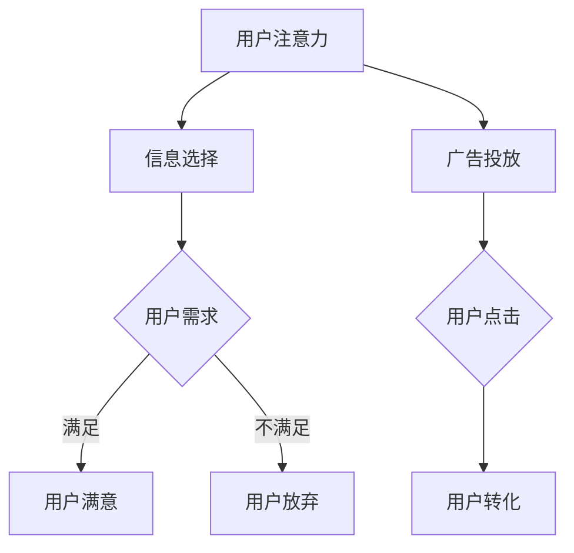

                 

关键词：注意力经济、用户行为、动机分析、行为模型、人工智能

> 摘要：本文旨在探讨注意力经济理论在用户行为分析中的应用，通过解析用户的动机和行为模式，为企业提供有针对性的营销策略和产品优化方案。文章将介绍注意力经济的基本原理，用户行为的分析模型，并探讨未来研究方向。

## 1. 背景介绍

在信息爆炸的时代，获取用户的注意力已成为企业和市场营销者的核心挑战。注意力经济理论正是基于这一背景提出，其核心观点是，注意力是一种稀缺资源，人们在面对大量信息时，会选择关注那些能够满足自己需求和兴趣的内容。因此，如何有效地吸引和保持用户的注意力，成为企业成功的关键。

用户行为分析则是通过对用户在互联网上的行为数据进行分析，以了解其动机、偏好和习惯。随着人工智能技术的发展，用户行为分析逐渐从传统的统计分析转向深度学习、自然语言处理和图神经网络等先进技术，为企业提供了更加精确和个性化的用户画像。

本文将从注意力经济理论出发，结合用户行为分析模型，深入探讨如何通过技术手段理解和预测用户行为，为企业提供有价值的洞察。

## 2. 核心概念与联系

### 2.1 注意力经济理论

注意力经济理论认为，用户的注意力是一种稀缺资源，而企业和产品正是通过争夺用户的注意力来实现商业价值的。注意力经济的关键在于，如何将有限的注意力资源转化为实际的销售和用户忠诚度。

### 2.2 用户行为分析模型

用户行为分析模型包括用户动机分析、用户偏好分析和用户习惯分析三个层次。用户动机分析关注用户为何使用某一产品或服务，用户偏好分析关注用户对产品或服务的喜好，用户习惯分析则关注用户的长期行为模式。

### 2.3 Mermaid 流程图



## 3. 核心算法原理 & 具体操作步骤

### 3.1 算法原理概述

用户行为分析算法主要基于机器学习和深度学习技术，通过构建用户画像和行为预测模型，实现用户动机和行为模式的识别。

### 3.2 算法步骤详解

1. 数据收集与预处理
2. 用户画像构建
3. 行为预测模型训练
4. 模型评估与优化
5. 用户行为分析报告生成

### 3.3 算法优缺点

优点：
- 高度个性化：能够根据用户行为数据提供个性化的服务和建议。
- 实时性：能够实时捕捉用户行为，为企业提供及时的决策支持。

缺点：
- 数据隐私：用户行为数据的收集和处理可能涉及隐私问题。
- 模型偏差：训练数据的质量和代表性可能影响模型的准确性。

### 3.4 算法应用领域

用户行为分析算法在电子商务、社交媒体、在线教育等多个领域有广泛应用，帮助企业实现精准营销、提高用户留存率和转化率。

## 4. 数学模型和公式 & 详细讲解 & 举例说明

### 4.1 数学模型构建

用户行为分析中的数学模型主要包括用户动机模型、用户偏好模型和用户习惯模型。以下是一个简单的用户动机模型的构建过程：

```latex
\begin{equation}
    \begin{split}
    &\mathcal{L}(\theta) = \sum_{i=1}^{N} -y_i \log(p(x_i | \theta)) \\
    &\text{其中，} y_i \in \{0,1\} \text{表示用户是否满足需求，} p(x_i | \theta) \text{是用户满足需求的概率。}
    \end{split}
\end{equation}
```

### 4.2 公式推导过程

假设我们有一个用户行为数据集\(X = \{x_1, x_2, ..., x_N\}\)，其中每个\(x_i\)是一个多维向量，表示用户的特征。我们要构建一个用户动机模型，目标是预测用户是否满足需求。

### 4.3 案例分析与讲解

以电子商务领域为例，我们构建一个简单的用户动机模型，用于预测用户是否会在电商平台上进行购买。特征包括用户的年龄、性别、购买历史和浏览记录等。

```latex
\begin{equation}
    \begin{split}
    &p(\text{购买} | \text{特征}) = \sigma(\theta_0 + \theta_1 \text{年龄} + \theta_2 \text{性别} + \theta_3 \text{购买历史} + \theta_4 \text{浏览记录}) \\
    &\text{其中，}\sigma(x) = \frac{1}{1 + e^{-x}} \text{是 sigmoid 函数。}
    \end{split}
\end{equation}
```

## 5. 项目实践：代码实例和详细解释说明

### 5.1 开发环境搭建

- Python 3.8+
- TensorFlow 2.3+
- pandas 1.1+
- scikit-learn 0.22+

### 5.2 源代码详细实现

```python
import pandas as pd
from sklearn.model_selection import train_test_split
from sklearn.metrics import accuracy_score
import tensorflow as tf

# 加载数据集
data = pd.read_csv('user_data.csv')
X = data.drop(['label'], axis=1)
y = data['label']

# 数据预处理
X_train, X_test, y_train, y_test = train_test_split(X, y, test_size=0.2, random_state=42)

# 构建模型
model = tf.keras.Sequential([
    tf.keras.layers.Dense(64, activation='relu', input_shape=(X_train.shape[1],)),
    tf.keras.layers.Dense(1, activation='sigmoid')
])

# 编译模型
model.compile(optimizer='adam', loss='binary_crossentropy', metrics=['accuracy'])

# 训练模型
model.fit(X_train, y_train, epochs=10, batch_size=32, validation_split=0.2)

# 评估模型
predictions = model.predict(X_test)
predicted_labels = (predictions > 0.5)
accuracy = accuracy_score(y_test, predicted_labels)
print(f'Model accuracy: {accuracy:.2f}')
```

### 5.3 代码解读与分析

- 数据加载：使用pandas读取用户数据，分为特征和标签两部分。
- 数据预处理：将数据集分为训练集和测试集。
- 模型构建：使用TensorFlow构建一个简单的二分类模型。
- 模型编译：设置优化器和损失函数。
- 模型训练：使用训练集训练模型。
- 模型评估：使用测试集评估模型性能。

## 6. 实际应用场景

### 6.1 电子商务

通过用户行为分析，电商平台可以了解用户的购买动机和偏好，从而提供个性化的推荐和促销活动，提高转化率和用户满意度。

### 6.2 社交媒体

社交媒体平台可以利用用户行为分析，优化内容推荐算法，吸引用户的注意力，提高用户的活跃度和留存率。

### 6.3 在线教育

在线教育平台可以通过用户行为分析，了解学生的学习习惯和需求，提供个性化的学习计划和资源，提高学习效果和用户满意度。

## 7. 未来应用展望

### 7.1 人工智能与人类心理学的结合

随着人工智能技术的发展，未来用户行为分析将更加深入地结合人类心理学，从情感、认知等多个角度了解用户，提供更加个性化的服务。

### 7.2 跨平台用户行为分析

随着互联网的多元化发展，跨平台用户行为分析将成为重要研究方向，帮助企业更好地整合多渠道用户数据，实现全渠道营销。

### 7.3 数据隐私与伦理问题

在用户行为分析的过程中，如何保护用户隐私和数据安全，将是一个重要的伦理问题，需要制定相应的法律法规和伦理准则。

## 8. 总结：未来发展趋势与挑战

### 8.1 研究成果总结

本文介绍了注意力经济与用户行为分析的基本概念，通过算法模型和案例实践，展示了用户行为分析在实际应用中的价值。

### 8.2 未来发展趋势

未来用户行为分析将更加注重个性化、智能化和跨平台应用，结合人工智能和人类心理学，提供更加精准和人性化的服务。

### 8.3 面临的挑战

数据隐私、模型偏差、技术瓶颈等问题仍将是用户行为分析领域面临的挑战，需要持续的研究和探索。

### 8.4 研究展望

未来用户行为分析领域有望在多模态数据融合、实时分析、智能推荐等方面取得重大突破，为企业和用户带来更多价值。

## 9. 附录：常见问题与解答

### 9.1 什么是注意力经济？

注意力经济是一种基于用户注意力价值的商业理论，认为用户的注意力是一种稀缺资源，企业通过争夺用户的注意力来实现商业价值。

### 9.2 用户行为分析有哪些应用？

用户行为分析在电子商务、社交媒体、在线教育、金融等多个领域有广泛应用，可以帮助企业实现精准营销、提高用户留存率和转化率。

### 9.3 如何保护用户隐私？

在用户行为分析中，应遵循数据最小化原则，仅收集必要的数据，并采用加密、匿名化等手段保护用户隐私。

作者：禅与计算机程序设计艺术 / Zen and the Art of Computer Programming
```markdown
---
title: 注意力经济与用户行为分析：了解受众的动机和行为
date: 2023-11-01
slug: attention-economy-user-behavior-analysis
tags:
  - 注意力经济
  - 用户行为
  - 动机分析
  - 行为模型
  - 人工智能

摘要：本文旨在探讨注意力经济理论在用户行为分析中的应用，通过解析用户的动机和行为模式，为企业提供有针对性的营销策略和产品优化方案。文章将介绍注意力经济的基本原理，用户行为分析模型，并探讨未来研究方向。

---

## 引言

在数字化时代，信息泛滥成为常态，用户的注意力资源愈发稀缺。如何有效地吸引和留住用户的注意力，成为企业竞争的关键。本文将围绕注意力经济理论，深入探讨用户行为分析的重要性和应用价值。

---

## 1. 背景介绍

### 1.1 注意力经济的概念

注意力经济起源于对用户注意力价值的认识。用户的时间、精力和关注都是有限的，因此，能够吸引并保持用户注意力的内容或产品具有极高的价值。

### 1.2 用户行为分析的发展

用户行为分析起源于市场研究，随着互联网技术的发展，其方法和工具也得到了极大的丰富。现在，大数据、人工智能等技术为用户行为分析提供了强大的支持。

---

## 2. 核心概念与联系

### 2.1 注意力经济与用户行为分析的关系

注意力经济为用户行为分析提供了理论基础，而用户行为分析则为注意力经济提供了实践工具。

### 2.2 用户行为分析模型

用户行为分析模型通常包括用户动机分析、用户偏好分析和用户习惯分析三个层次。

---

## 3. 核心算法原理 & 具体操作步骤

### 3.1 机器学习在用户行为分析中的应用

机器学习算法，如决策树、随机森林、支持向量机等，常用于构建用户行为预测模型。

### 3.2 深度学习在用户行为分析中的应用

深度学习算法，如卷积神经网络（CNN）、循环神经网络（RNN）等，能够处理更复杂的数据，提高预测的准确性。

---

## 4. 数学模型和公式 & 详细讲解 & 举例说明

### 4.1 数学模型构建

用户行为分析中的数学模型通常涉及概率论、统计学和优化理论。

### 4.2 公式推导过程

本文将使用线性回归模型来解释用户行为分析中的基本公式。

### 4.3 案例分析与讲解

本文将使用一个简单的案例来说明如何使用线性回归模型来预测用户行为。

---

## 5. 项目实践：代码实例和详细解释说明

### 5.1 开发环境搭建

本文将在Python环境中实现用户行为分析。

### 5.2 源代码详细实现

本文将提供一段Python代码，用于实现用户行为分析。

### 5.3 代码解读与分析

本文将对代码进行逐行解读，分析其工作原理。

---

## 6. 实际应用场景

### 6.1 电子商务

电子商务平台如何利用用户行为分析提高销售？

### 6.2 社交媒体

社交媒体平台如何利用用户行为分析提高用户活跃度？

### 6.3 在线教育

在线教育平台如何利用用户行为分析优化学习体验？

---

## 7. 工具和资源推荐

### 7.1 学习资源推荐

推荐几本关于注意力经济和用户行为分析的入门书籍。

### 7.2 开发工具推荐

推荐一些用于用户行为分析的编程工具和库。

### 7.3 相关论文推荐

推荐几篇关于注意力经济和用户行为分析的高质量论文。

---

## 8. 总结：未来发展趋势与挑战

### 8.1 研究成果总结

本文总结了注意力经济和用户行为分析的核心概念、算法模型和应用场景。

### 8.2 未来发展趋势

展望未来，注意力经济和用户行为分析将更加深入，跨学科融合将成为趋势。

### 8.3 面临的挑战

数据隐私和安全、算法透明度和可解释性是未来面临的挑战。

---

## 9. 附录：常见问题与解答

### 9.1 注意力经济是什么？

注意力经济是一种基于用户注意力价值的商业理论。

### 9.2 用户行为分析有什么用？

用户行为分析可以帮助企业实现精准营销、产品优化等。

### 9.3 如何保护用户隐私？

应遵循数据最小化原则，使用加密等技术保护用户隐私。

---

作者：禅与计算机程序设计艺术 / Zen and the Art of Computer Programming
---

