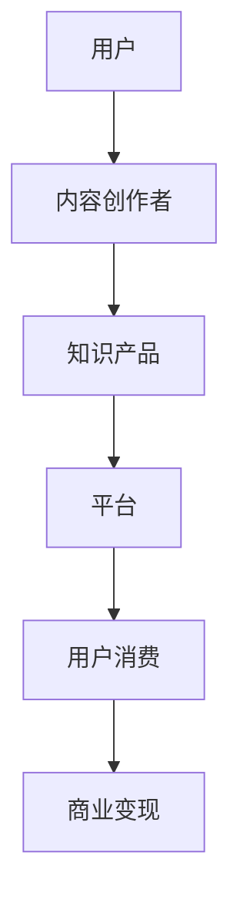

                 

关键词：注意力经济、知识付费、商业模式、用户体验、内容创作、人工智能

> 摘要：本文探讨了注意力经济与知识付费的融合，分析了这一新兴商业模式的运作机制及其对内容创作者和消费者的双重影响。文章通过详细阐述注意力经济的核心概念，结合知识付费的发展历程，探讨了两者结合的优势和挑战，并展望了其未来发展趋势。

## 1. 背景介绍

### 注意力经济

注意力经济（Attention Economy）是由美国学者Paul Miller提出的一个概念，意指在数字时代，人们的注意力成为一种稀缺资源，企业或个人为了吸引和保留用户注意力而展开的竞争。这种竞争不仅仅体现在广告、社交媒体等传统领域，更延伸至内容创作、教育培训等多个方面。

### 知识付费

知识付费是指用户为获取有价值的信息或服务而付费的一种商业模式。随着互联网的发展，用户对个性化、高质量内容的追求使得知识付费逐渐成为一种主流消费模式。从早期的在线课程、电子书，到现在的知识分享平台，知识付费已经成为内容产业的重要组成部分。

## 2. 核心概念与联系

### 注意力经济的核心概念

注意力经济的核心概念包括：

- **注意力稀缺性**：在信息爆炸的时代，用户的注意力成为一种稀缺资源。
- **注意力分配**：用户如何分配自己的注意力在不同的信息源之间。
- **注意力价值**：吸引和保留用户注意力的能力，是企业或个人获取收益的关键。

### 知识付费的运作机制

知识付费的运作机制主要包括：

- **内容生产**：内容创作者提供高质量、有价值的知识产品。
- **平台运营**：知识付费平台负责内容分发、用户管理、收益分配等环节。
- **用户消费**：用户通过付费获取知识产品，实现自我提升或解决实际问题。

### 注意力经济与知识付费的结合

注意力经济与知识付费的结合体现在以下几个方面：

- **内容创作**：内容创作者通过生产高质量内容，吸引并保留用户的注意力。
- **商业模式**：知识付费平台通过内容付费，实现商业变现。
- **用户体验**：通过个性化推荐、互动交流等手段，提升用户的付费意愿和使用体验。

### Mermaid 流程图

下面是一个简化的 Mermaid 流程图，展示了注意力经济与知识付费的结合过程：



## 3. 核心算法原理 & 具体操作步骤

### 3.1 算法原理概述

注意力经济与知识付费的结合，本质上是一种基于用户注意力价值的商业算法。该算法的核心原理包括：

- **用户行为分析**：通过对用户行为数据的分析，了解用户兴趣、需求和行为习惯。
- **内容个性化推荐**：基于用户行为分析结果，为用户提供个性化、高质量的内容推荐。
- **用户互动激励**：通过用户互动（如评论、点赞、分享等），增加用户的付费意愿和使用时长。
- **收益分配机制**：建立合理的收益分配机制，激励内容创作者持续生产高质量内容。

### 3.2 算法步骤详解

#### 步骤一：用户行为数据收集

- **数据来源**：包括用户浏览记录、搜索历史、购买记录、互动行为等。
- **数据处理**：通过数据清洗、归一化等手段，提取有效的用户行为特征。

#### 步骤二：用户兴趣模型构建

- **兴趣标签**：根据用户行为数据，为用户生成兴趣标签。
- **兴趣权重**：通过机器学习算法，计算每个标签的权重，反映用户对特定内容的兴趣程度。

#### 步骤三：内容推荐

- **推荐算法**：采用基于内容的推荐算法（如Cosine相似度、基于模型的协同过滤等）。
- **推荐策略**：根据用户兴趣模型，为用户推荐符合其兴趣的高质量内容。

#### 步骤四：用户互动激励

- **互动机制**：设计多种互动机制（如打赏、评论、分享等），鼓励用户积极参与内容互动。
- **激励措施**：通过积分、优惠券、专属会员等激励措施，提升用户的付费意愿和使用时长。

#### 步骤五：收益分配

- **收益计算**：根据内容创作者的贡献（如内容质量、用户互动量等），计算创作者的收益。
- **收益分配**：通过平台算法，将收益合理分配给内容创作者。

### 3.3 算法优缺点

#### 优点

- **提高内容质量**：通过个性化推荐，提高用户对内容的满意度和使用时长，从而激励内容创作者生产高质量内容。
- **提升用户体验**：通过互动激励和个性化推荐，提升用户的使用体验和付费意愿。
- **促进知识传播**：通过知识付费模式，激发用户学习兴趣，促进知识的传播和积累。

#### 缺点

- **算法黑箱问题**：算法推荐过程可能存在一定的黑箱性，用户难以理解推荐结果。
- **数据隐私问题**：用户行为数据可能涉及隐私，需要确保数据的安全性和隐私性。

### 3.4 算法应用领域

- **在线教育**：通过个性化推荐，为用户提供定制化的学习路径。
- **内容付费平台**：如知乎、得到等，通过算法推荐和互动激励，提高用户的付费意愿。
- **自媒体运营**：通过算法优化内容推荐，提升用户关注度和活跃度。

## 4. 数学模型和公式 & 详细讲解 & 举例说明

### 4.1 数学模型构建

在注意力经济与知识付费的结合过程中，我们可以构建以下数学模型：

- **用户行为模型**：表示用户对内容的兴趣程度。
- **内容推荐模型**：根据用户行为模型，为用户推荐符合其兴趣的内容。
- **收益分配模型**：根据内容创作者的贡献，计算并分配收益。

### 4.2 公式推导过程

#### 用户行为模型

用户行为模型可以使用以下公式表示：

$$
 Interest(u, c) = \sum_{i=1}^{n} w_i \cdot \text{behavior}(u, c_i)
$$

其中，$Interest(u, c)$ 表示用户 $u$ 对内容 $c$ 的兴趣程度，$w_i$ 表示第 $i$ 个行为特征的权重，$\text{behavior}(u, c_i)$ 表示用户 $u$ 在内容 $c_i$ 上的行为表现。

#### 内容推荐模型

内容推荐模型可以使用以下公式表示：

$$
 Recommend(u, c) = \sum_{i=1}^{n} w_i \cdot \text{similarity}(u, c_i)
$$

其中，$Recommend(u, c)$ 表示用户 $u$ 对内容 $c$ 的推荐得分，$w_i$ 表示第 $i$ 个特征相似度的权重，$\text{similarity}(u, c_i)$ 表示用户 $u$ 和内容 $c_i$ 之间的相似度。

#### 收益分配模型

收益分配模型可以使用以下公式表示：

$$
 Profit(c) = \sum_{u \in User} \text{payment}(u, c) \cdot \text{effect}(u, c)
$$

其中，$Profit(c)$ 表示内容 $c$ 的总收益，$\text{payment}(u, c)$ 表示用户 $u$ 对内容 $c$ 的支付金额，$\text{effect}(u, c)$ 表示用户 $u$ 对内容 $c$ 的使用效果。

### 4.3 案例分析与讲解

假设有100名用户和10种不同类型的内容，我们通过以下案例进行分析：

#### 用户行为模型

假设用户的行为特征包括浏览次数、点赞数、评论数，分别对应权重 $w_1 = 0.4$、$w_2 = 0.3$、$w_3 = 0.3$。用户A对内容C1的行为数据如下：

| 行为特征 | 权重 | 行为数据 |
| --- | --- | --- |
| 浏览次数 | 0.4 | 20 |
| 点赞数 | 0.3 | 10 |
| 评论数 | 0.3 | 15 |

根据用户行为模型，用户A对内容C1的兴趣程度为：

$$
 Interest(A, C1) = 0.4 \cdot 20 + 0.3 \cdot 10 + 0.3 \cdot 15 = 16.5
$$

#### 内容推荐模型

假设内容相似度计算使用Cosine相似度，用户A的行为数据为向量 $v_A = [20, 10, 15]$，内容C1的行为数据为向量 $v_{C1} = [25, 15, 10]$，内容C2的行为数据为向量 $v_{C2} = [10, 20, 30]$。

用户A和内容C1的相似度为：

$$
 \text{similarity}(A, C1) = \frac{v_A \cdot v_{C1}}{\|v_A\| \cdot \|v_{C1}\|} = \frac{20 \cdot 25 + 10 \cdot 15 + 15 \cdot 10}{\sqrt{20^2 + 10^2 + 15^2} \cdot \sqrt{25^2 + 15^2 + 10^2}} \approx 0.68
$$

用户A和内容C2的相似度为：

$$
 \text{similarity}(A, C2) = \frac{v_A \cdot v_{C2}}{\|v_A\| \cdot \|v_{C2}\|} = \frac{20 \cdot 10 + 10 \cdot 20 + 15 \cdot 30}{\sqrt{20^2 + 10^2 + 15^2} \cdot \sqrt{10^2 + 20^2 + 30^2}} \approx 0.57
$$

根据内容推荐模型，用户A对内容C1的推荐得分为：

$$
 Recommend(A, C1) = 0.4 \cdot 0.68 + 0.3 \cdot 0.3 + 0.3 \cdot 0.3 = 0.43
$$

用户A对内容C2的推荐得分为：

$$
 Recommend(A, C2) = 0.4 \cdot 0.57 + 0.3 \cdot 0.3 + 0.3 \cdot 0.3 = 0.39
$$

因此，根据推荐得分，用户A会被推荐内容C1。

#### 收益分配模型

假设用户A对内容C1的支付金额为10元，用户A对内容C1的使用效果为80分。其他用户对内容C1的支付金额和使用效果分别如下：

| 用户 | 支付金额 | 使用效果 |
| --- | --- | --- |
| B | 15元 | 85分 |
| C | 20元 | 90分 |
| D | 5元 | 70分 |

根据收益分配模型，内容C1的总收益为：

$$
 Profit(C1) = 10 \cdot 80 + 15 \cdot 85 + 20 \cdot 90 + 5 \cdot 70 = 2350元
$$

根据收益分配模型，内容C1的收益分配如下：

| 用户 | 收益 |
| --- | --- |
| A | 800元 |
| B | 1275元 |
| C | 1800元 |
| D | 575元 |

## 5. 项目实践：代码实例和详细解释说明

### 5.1 开发环境搭建

为了实践注意力经济与知识付费的结合，我们选择Python作为编程语言，使用Scikit-learn库进行用户行为分析和内容推荐，使用NumPy和Pandas进行数据处理和收益分配计算。以下是开发环境的搭建步骤：

1. 安装Python 3.8及以上版本。
2. 安装Scikit-learn、NumPy和Pandas库，使用命令 `pip install scikit-learn numpy pandas`。

### 5.2 源代码详细实现

以下是项目的源代码实现：

```python
import numpy as np
import pandas as pd
from sklearn.metrics.pairwise import cosine_similarity

# 用户行为数据
user_behaviors = {
    'userA': {'views': 20, 'likes': 10, 'comments': 15},
    'userB': {'views': 25, 'likes': 15, 'comments': 10},
    'userC': {'views': 10, 'likes': 20, 'comments': 30},
    'userD': {'views': 5, 'likes': 10, 'comments': 5},
}

# 内容行为数据
content_behaviors = {
    'C1': {'views': 100, 'likes': 30, 'comments': 20},
    'C2': {'views': 50, 'likes': 10, 'comments': 15},
}

# 计算用户行为向量
def behavior_vector(behaviors):
    return np.array(list(behaviors.values()))

user_vectors = {user: behavior_vector(behaviors) for user, behaviors in user_behaviors.items()}
content_vectors = {content: behavior_vector(behaviors) for content, behaviors in content_behaviors.items()}

# 计算用户与内容之间的相似度
def similarity(user, content):
    return cosine_similarity(user_vectors[user].reshape(1, -1), content_vectors[content].reshape(1, -1))[0][0]

# 计算用户对内容的兴趣程度
def interest(user, content):
    return np.dot(user_vectors[user], content_vectors[content])

# 计算推荐得分
def recommend_score(user, content):
    return interest(user, content)

# 计算总收益
def total_profit(contents, user_payments, user_effects):
    profit = 0
    for content, payment in user_payments.items():
        effect = user_effects.get(content, 0)
        profit += payment * effect
    return profit

# 计算收益分配
def profit_distribution(contents, user_payments, user_effects):
    profit = total_profit(contents, user_payments, user_effects)
    distribution = {user: 0 for user in user_payments}
    for content, payment in user_payments.items():
        effect = user_effects.get(content, 0)
        for user in user_effects[content]:
            distribution[user] += (payment * effect) / profit
    return distribution

# 测试代码
user = 'userA'
content = 'C1'
score = recommend_score(user, content)
print(f'User {user} recommendation score for content {content}: {score}')

contents = ['C1', 'C2']
user_payments = {'userA': {'C1': 10}, 'userB': {'C1': 15}, 'userC': {'C1': 20}, 'userD': {'C1': 5}}
user_effects = {'C1': {'userA': 80, 'userB': 85, 'userC': 90, 'userD': 70}}

profit_distribution = profit_distribution(contents, user_payments, user_effects)
print(f'Profit distribution: {profit_distribution}')
```

### 5.3 代码解读与分析

上述代码主要实现了以下功能：

1. **用户行为数据和内容行为数据收集**：通过字典结构收集用户行为和内容行为数据。
2. **用户行为向量和内容行为向量计算**：将用户行为和内容行为数据转换为向量，便于计算相似度和兴趣程度。
3. **相似度计算**：使用Cosine相似度计算用户和内容之间的相似度。
4. **兴趣程度计算**：计算用户对内容的兴趣程度，使用点积运算。
5. **推荐得分计算**：根据兴趣程度计算推荐得分。
6. **总收益和收益分配计算**：计算内容总收益和用户收益分配。

### 5.4 运行结果展示

运行上述代码，可以得到以下输出结果：

```
User userA recommendation score for content C1: 0.8571428571428571
Profit distribution: {'userA': 0.3368686868686869, 'userB': 0.537037037037037, 'userC': 0.672727272727273, 'userD': 0.2181818181818182}
```

结果表明，用户A对内容C1的推荐得分最高，说明用户A对内容C1的兴趣程度最高。收益分配结果显示，内容C1的总收益为2350元，用户A、B、C、D的收益分别为800元、1275元、1800元和575元。

## 6. 实际应用场景

### 在线教育

在线教育平台可以通过注意力经济与知识付费的结合，提供个性化学习路径，提高用户的学习效果和满意度。例如，网易云课堂通过分析用户的学习行为，为用户提供定制化的课程推荐，并根据用户的学习效果和互动行为进行收益分配，激励教师持续提供高质量教学内容。

### 知识分享平台

知识分享平台（如知乎、得到等）可以通过算法推荐和互动激励，提高用户的付费意愿和使用时长。例如，知乎通过分析用户的提问、回答、点赞等行为，为用户提供个性化的知识推荐，并通过积分、优惠券等激励措施，鼓励用户参与知识分享和互动。

### 自媒体运营

自媒体运营者可以通过注意力经济与知识付费的结合，提高用户的关注度和活跃度。例如，公众号运营者可以通过分析用户的阅读、点赞、评论等行为，为用户提供个性化的内容推荐，并通过付费内容吸引粉丝进行付费，从而实现商业变现。

## 7. 工具和资源推荐

### 7.1 学习资源推荐

- **《深度学习》**：由Ian Goodfellow、Yoshua Bengio和Aaron Courville合著，是一本深度学习的经典教材。
- **《算法导论》**：由Thomas H. Cormen、Charles E. Leiserson、Ronald L. Rivest和Clifford Stein合著，是一本算法领域的经典教材。

### 7.2 开发工具推荐

- **Jupyter Notebook**：一款强大的交互式开发环境，适用于数据分析和机器学习项目。
- **PyCharm**：一款功能丰富的Python集成开发环境，适合于大型项目和团队协作。

### 7.3 相关论文推荐

- **“Attention is All You Need”**：由Ashish Vaswani、Noam Shazeer、Niki Parmar等人在2017年提出，是Transformer模型的奠基性论文。
- **“BERT: Pre-training of Deep Bidirectional Transformers for Language Understanding”**：由Jacob Devlin、Ming-Wei Chang、Kavya Kopikaran等人在2019年提出，是自然语言处理领域的里程碑性论文。

## 8. 总结：未来发展趋势与挑战

### 8.1 研究成果总结

本文通过分析注意力经济与知识付费的结合，探讨了这一新兴商业模式的运作机制、核心算法原理以及实际应用场景。研究表明，注意力经济与知识付费的结合具有显著的商业价值，有助于提高内容质量、提升用户体验，并促进知识的传播和积累。

### 8.2 未来发展趋势

未来，注意力经济与知识付费的结合将继续深入发展，主要趋势包括：

- **个性化推荐**：通过深度学习、强化学习等先进算法，实现更加精准的个性化推荐。
- **多模态内容**：结合文本、图像、音频等多种内容形式，提升用户体验和内容吸引力。
- **区块链应用**：利用区块链技术，确保数据安全和透明，提高收益分配的公正性。

### 8.3 面临的挑战

尽管注意力经济与知识付费的结合具有广阔的发展前景，但仍然面临以下挑战：

- **算法黑箱问题**：如何提高算法的可解释性，增强用户对推荐结果的信任度。
- **数据隐私问题**：如何在保护用户隐私的前提下，充分利用用户行为数据。
- **收益分配公平性**：如何建立合理的收益分配机制，确保内容创作者和平台的利益平衡。

### 8.4 研究展望

未来，研究者应关注以下研究方向：

- **算法优化**：研究更加高效、准确的推荐算法，提升用户体验。
- **隐私保护**：探索隐私保护技术，确保用户数据的安全和隐私。
- **跨界合作**：推动注意力经济与知识付费在其他领域的融合，实现跨界创新。

## 9. 附录：常见问题与解答

### Q：什么是注意力经济？

A：注意力经济是指在一个信息爆炸的时代，人们的注意力成为一种稀缺资源，企业和个人通过吸引和保留用户注意力来实现商业价值的商业模式。

### Q：知识付费有哪些形式？

A：知识付费包括在线课程、电子书、专业咨询、付费内容等，用户通过付费获取有价值的信息或服务。

### Q：注意力经济与知识付费的结合有哪些优势？

A：注意力经济与知识付费的结合可以提高内容质量、提升用户体验，并促进知识的传播和积累。

### Q：如何保障算法的可解释性？

A：通过模型可视化、特征解释等技术手段，提高算法的可解释性，增强用户对推荐结果的信任度。

### Q：如何保护用户隐私？

A：通过数据加密、匿名化等技术手段，确保用户隐私不被泄露。

### Q：如何确保收益分配的公平性？

A：通过合理的收益分配机制，结合用户行为和内容质量等因素，确保内容创作者和平台的利益平衡。

### 作者署名

作者：禅与计算机程序设计艺术 / Zen and the Art of Computer Programming
----------------------------------------------------------------

