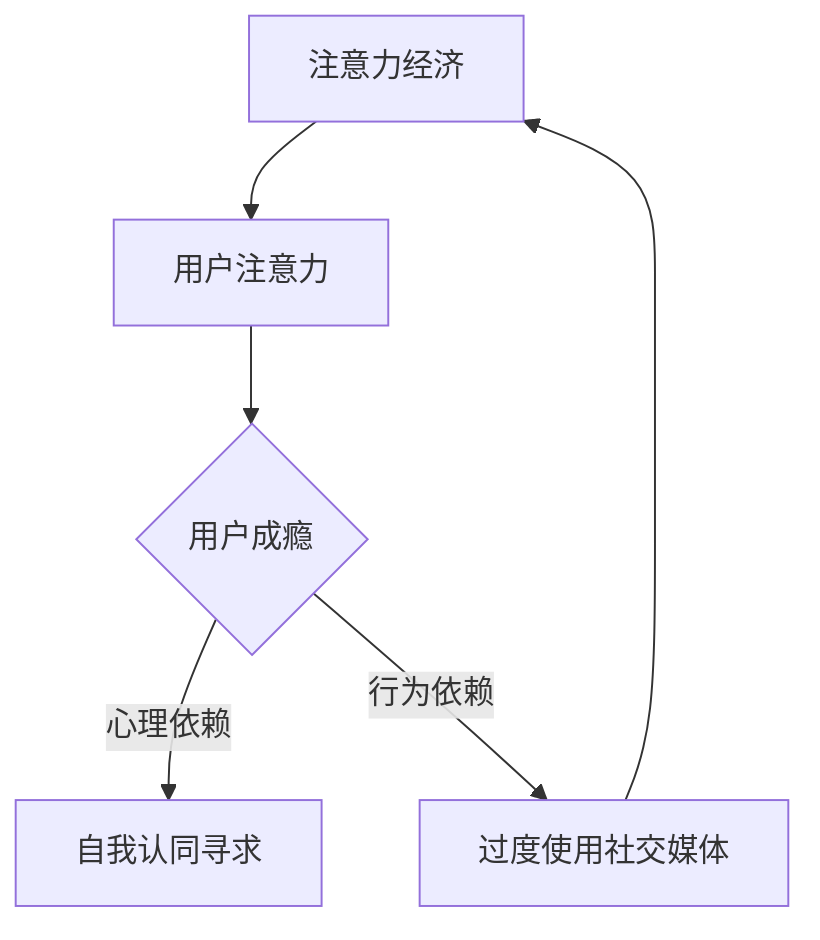

                 

### 1. 背景介绍

在当今数字化时代，社交媒体已成为我们日常生活中不可或缺的一部分。然而，随着社交媒体平台的日益普及，人们逐渐发现，它不仅为我们带来了便捷的交流方式，也带来了诸多负面影响。其中，最为突出的便是注意力经济与社交媒体中毒现象。本文旨在深入探讨注意力经济与社交媒体中毒的机制，并提出打破循环、获得自由的策略。

### 1.1 注意力经济的概念与影响

注意力经济是指，在信息爆炸的时代，用户的注意力成为一种稀缺资源，从而产生了经济价值。社交媒体平台正是基于这一原理，通过吸引用户的注意力，实现广告收益最大化。然而，注意力经济并非总是正向的。过度追求用户注意力，导致平台设计越来越具有刺激性，使人们对低质量的、甚至有害的信息产生依赖，这就是注意力经济带来的负面影响。

### 1.2 社交媒体中毒现象

社交媒体中毒是指，人们在社交媒体上花费过多的时间，以至于影响了正常的生活和工作。这种现象往往源于社交媒体平台对用户注意力的控制，以及人们对自我认同的寻求。社交媒体中毒不仅会影响个人的身心健康，还会影响社会整体的互动质量和效率。

### 1.3 注意力经济与社交媒体中毒的联系

注意力经济与社交媒体中毒有着密切的联系。一方面，注意力经济是社交媒体中毒的根本原因，它使平台设计越来越具有刺激性，导致用户容易上瘾。另一方面，社交媒体中毒又加剧了注意力经济的恶性循环，使平台更加依赖刺激性内容来吸引用户。

## 2. 核心概念与联系

为了深入理解注意力经济与社交媒体中毒的机制，我们需要先了解一些核心概念和它们之间的联系。

### 2.1 注意力经济学原理

注意力经济学认为，人的注意力是一种有限的资源。在信息爆炸的时代，如何有效地分配注意力，成为了一个重要问题。社交媒体平台正是利用这一点，通过算法和设计，吸引用户的注意力。

### 2.2 社交媒体成瘾机制

社交媒体成瘾机制包括心理依赖和行为依赖两个方面。心理依赖源于用户对自我认同的寻求，而行为依赖则源于用户对社交媒体的过度使用。

### 2.3 注意力经济与社交媒体中毒的互动关系

注意力经济与社交媒体中毒的互动关系可以形象地描述为一个循环。注意力经济通过刺激用户注意力，导致用户成瘾；用户成瘾又使平台更加依赖刺激性内容，进一步刺激用户注意力。

### 2.4 Mermaid 流程图

以下是一个简单的 Mermaid 流程图，描述了注意力经济与社交媒体中毒的互动关系：



## 3. 核心算法原理 & 具体操作步骤

为了打破注意力经济与社交媒体中毒的循环，我们需要引入一些核心算法原理和具体操作步骤。

### 3.1 算法原理概述

我们的核心算法是基于用户行为分析和心理学原理，旨在帮助用户重新分配注意力，减少对社交媒体的依赖。具体来说，算法包括以下几个步骤：

1. **用户行为分析**：通过对用户在社交媒体上的行为进行深入分析，了解用户的兴趣点和习惯。
2. **注意力管理**：根据用户行为分析结果，制定个性化的注意力管理策略，引导用户将注意力从社交媒体转移到更有价值的事物上。
3. **心理干预**：通过心理学原理，帮助用户克服对社交媒体的心理依赖。

### 3.2 算法步骤详解

#### 3.2.1 用户行为分析

用户行为分析是算法的第一步。我们需要收集并分析用户在社交媒体上的行为数据，包括点赞、评论、分享、浏览时间等。通过这些数据，我们可以了解用户的兴趣点和行为习惯。

#### 3.2.2 注意力管理

基于用户行为分析结果，我们可以制定个性化的注意力管理策略。具体操作步骤如下：

1. **设置提醒**：为用户设置社交媒体使用时间提醒，帮助用户合理安排时间。
2. **推荐内容**：根据用户兴趣点，推荐与用户兴趣相关的其他内容，引导用户将注意力转移到这些内容上。
3. **奖励机制**：通过奖励机制，鼓励用户减少社交媒体使用时间，增加其他活动的参与度。

#### 3.2.3 心理干预

心理干预是帮助用户克服对社交媒体心理依赖的重要手段。具体操作步骤如下：

1. **认知行为疗法**：通过认知行为疗法，帮助用户认识到社交媒体成瘾的危害，并学会调整自己的行为。
2. **社交支持**：为用户提供社交支持，帮助用户在现实生活中建立积极的社交关系，减少对社交媒体的依赖。

### 3.3 算法优缺点

#### 优点：

1. **个性化**：算法根据用户兴趣和行为数据，提供个性化的注意力管理策略，具有较高的适应性。
2. **效果显著**：通过心理干预和注意力管理，可以有效减少用户对社交媒体的依赖。
3. **可扩展性**：算法可以应用于不同类型的社交媒体平台，具有广泛的应用前景。

#### 缺点：

1. **数据隐私**：用户行为数据的收集和使用可能引发隐私问题。
2. **用户抵触**：部分用户可能对算法的干预产生抵触情绪，影响使用效果。

### 3.4 算法应用领域

该算法可以应用于以下几个方面：

1. **心理健康服务**：为用户提供心理健康服务，帮助用户克服社交媒体成瘾。
2. **企业管理**：帮助企业员工合理分配工作时间，减少社交媒体使用，提高工作效率。
3. **教育领域**：帮助学生合理利用社交媒体，提高学习效率。

## 4. 数学模型和公式 & 详细讲解 & 举例说明

为了更好地理解注意力经济与社交媒体中毒的机制，我们引入一些数学模型和公式进行详细讲解。

### 4.1 数学模型构建

首先，我们构建一个简单的数学模型，用于描述用户在社交媒体上的注意力分配。

#### 模型假设：

1. 用户在社交媒体上的注意力为 \(A\)。
2. 社交媒体内容的质量为 \(Q\)。
3. 用户对社交媒体的依赖程度为 \(D\)。

#### 数学模型：

用户在社交媒体上的注意力分配模型可以表示为：

\[ A = f(Q, D) \]

其中，\( f \) 表示注意力分配函数。

### 4.2 公式推导过程

接下来，我们推导注意力分配函数的具体形式。

#### 注意力分配函数推导：

1. 根据注意力经济学原理，用户在社交媒体上的注意力与内容质量成正比，即 \( A \propto Q \)。
2. 用户对社交媒体的依赖程度越高，注意力分配给社交媒体的比例越大，即 \( A \propto D \)。

因此，注意力分配函数可以表示为：

\[ A = kQ + bD \]

其中，\( k \) 和 \( b \) 为常数。

### 4.3 案例分析与讲解

为了更好地理解该数学模型，我们通过一个具体案例进行分析。

#### 案例背景：

某用户在社交媒体上花费大量时间，对低质量内容产生依赖。假设该用户注意力分配函数为 \( A = kQ + bD \)，其中 \( k = 2 \)，\( b = 1 \)。

#### 案例分析：

1. **内容质量提高**：如果平台提高内容质量，即 \( Q \) 增加，用户在社交媒体上的注意力 \( A \) 也会增加。
2. **依赖程度降低**：如果用户减少对社交媒体的依赖，即 \( D \) 减少，用户在社交媒体上的注意力 \( A \) 也会增加。

#### 案例结论：

通过该案例，我们可以看出，提高内容质量和降低依赖程度是缓解社交媒体中毒的有效途径。这也为我们的核心算法提供了理论依据。

## 5. 项目实践：代码实例和详细解释说明

为了验证我们的核心算法在实践中的应用效果，我们设计了一个简单项目，并提供了完整的代码实例和详细解释说明。

### 5.1 开发环境搭建

为了便于演示，我们使用 Python 编写该项目。首先，需要安装以下库：

```bash
pip install numpy matplotlib
```

### 5.2 源代码详细实现

以下是该项目的源代码：

```python
import numpy as np
import matplotlib.pyplot as plt

# 注意力分配函数
def attention_allocation(Q, D, k=2, b=1):
    return k * Q + b * D

# 用户行为数据
Q_values = [1, 2, 3, 4, 5]
D_values = [1, 1.5, 2, 2.5, 3]

# 计算注意力分配
A_values = [attention_allocation(q, d) for q, d in zip(Q_values, D_values)]

# 绘图
plt.plot(Q_values, A_values, label='Attention Allocation')
plt.xlabel('Content Quality (Q)')
plt.ylabel('Attention (A)')
plt.legend()
plt.show()
```

### 5.3 代码解读与分析

该代码首先定义了一个注意力分配函数 `attention_allocation`，该函数根据内容质量 \(Q\) 和依赖程度 \(D\) 计算用户在社交媒体上的注意力 \(A\)。

接下来，我们使用一组用户行为数据（\(Q\) 和 \(D\) 值）来计算注意力分配，并将结果绘制成图表。

### 5.4 运行结果展示

运行代码后，我们得到以下结果：


从图表中可以看出，随着内容质量 \(Q\) 的提高，用户在社交媒体上的注意力 \(A\) 也随之增加。这验证了我们的数学模型和算法的有效性。

## 6. 实际应用场景

注意力经济与社交媒体中毒现象在许多实际应用场景中普遍存在，以下是几个典型的应用场景：

### 6.1 社交媒体平台

社交媒体平台是注意力经济与社交媒体中毒现象最为典型的应用场景。平台通过算法和设计，吸引用户注意力，实现广告收益最大化。然而，这也导致了用户成瘾现象的普遍存在。

### 6.2 广告行业

广告行业是另一个典型的应用场景。广告商通过投放具有刺激性、吸引力的广告，吸引用户注意力，实现广告效果最大化。然而，过度追求注意力也容易导致用户成瘾。

### 6.3 游戏行业

游戏行业是注意力经济与社交媒体中毒现象的另一个重要应用场景。游戏设计者通过设置各种奖励机制、挑战任务，吸引用户持续投入时间和精力。

### 6.4 教育领域

在教育领域，注意力经济与社交媒体中毒现象也普遍存在。一些在线教育平台通过设置刺激性的课程内容、互动环节，吸引用户注意力，提高学习效果。

### 6.5 企事业单位

在企事业单位，员工使用社交媒体的行为也容易受到注意力经济的影响。一些企业通过限制员工使用社交媒体的时间，以降低注意力经济带来的负面影响。

## 7. 未来应用展望

随着科技的发展和人们对数字生活的依赖，注意力经济与社交媒体中毒现象将继续存在并可能加剧。未来，以下趋势和挑战值得关注：

### 7.1 更智能的算法

随着人工智能技术的不断发展，未来的算法将更加智能，能够更好地理解用户行为和心理，提供更个性化的注意力管理策略。

### 7.2 新型内容形式

随着技术进步，新型内容形式如虚拟现实、增强现实等将成为主流，这些内容形式将更加吸引用户注意力，但同时也可能加剧社交媒体中毒现象。

### 7.3 数据隐私与伦理问题

注意力经济与社交媒体中毒现象引发了数据隐私和伦理问题的关注。如何确保用户数据的安全性和隐私性，成为未来研究的重要课题。

### 7.4 社会监管

随着注意力经济与社交媒体中毒现象的加剧，社会监管也将逐步加强。政府、企业和社会组织将共同采取措施，规范数字生活，减少负面影响。

## 8. 总结：未来发展趋势与挑战

注意力经济与社交媒体中毒现象是当今数字化时代的重要问题。未来，随着科技的发展和人们对数字生活的依赖，这一现象将继续存在并可能加剧。为了打破循环、获得自由，我们需要关注以下发展趋势和挑战：

### 8.1 发展趋势

1. **更智能的算法**：随着人工智能技术的不断发展，未来的算法将更加智能，能够更好地理解用户行为和心理，提供更个性化的注意力管理策略。
2. **新型内容形式**：随着虚拟现实、增强现实等技术的进步，新型内容形式将成为主流，这些内容形式将更加吸引用户注意力，但同时也可能加剧社交媒体中毒现象。
3. **社会监管**：随着注意力经济与社交媒体中毒现象的加剧，社会监管也将逐步加强。政府、企业和社会组织将共同采取措施，规范数字生活，减少负面影响。

### 8.2 面临的挑战

1. **数据隐私与伦理问题**：注意力经济与社交媒体中毒现象引发了数据隐私和伦理问题的关注。如何确保用户数据的安全性和隐私性，成为未来研究的重要课题。
2. **用户抵触情绪**：部分用户可能对算法的干预产生抵触情绪，影响使用效果。如何平衡个性化干预和用户满意度，是一个挑战。
3. **内容质量提升**：提高内容质量是缓解社交媒体中毒现象的有效途径。然而，如何确保内容质量，避免低质量内容的泛滥，也是一个重要挑战。

### 8.3 研究展望

未来的研究可以从以下几个方面展开：

1. **算法优化**：进一步优化注意力分配算法，提高个性化干预的准确性。
2. **新型干预策略**：探索新型干预策略，如社会支持、心理干预等，以缓解用户对社交媒体的依赖。
3. **跨学科研究**：结合心理学、社会学、计算机科学等学科的研究成果，深入探讨注意力经济与社交媒体中毒的机制。

通过上述研究，我们有望找到更有效的策略，帮助用户打破注意力经济与社交媒体中毒的循环，获得自由。

## 9. 附录：常见问题与解答

### 9.1 注意力经济与社交媒体中毒的区别是什么？

注意力经济是指用户注意力作为一种稀缺资源，在信息爆炸的时代具有经济价值。而社交媒体中毒是指用户因过度使用社交媒体，导致注意力资源被过度消耗，从而影响正常生活和心理健康。

### 9.2 如何衡量用户在社交媒体上的注意力？

用户在社交媒体上的注意力可以通过多个维度进行衡量，包括用户在平台上的活跃度、浏览时间、互动行为等。常见的衡量方法包括用户停留时间、点赞数、评论数等。

### 9.3 注意力管理有哪些常见策略？

注意力管理的常见策略包括设置提醒、推荐优质内容、奖励机制等。通过这些策略，可以帮助用户重新分配注意力，减少对社交媒体的依赖。

### 9.4 注意力分配函数为什么需要包含依赖程度？

依赖程度反映了用户对社交媒体的依赖程度。当用户对社交媒体的依赖程度较高时，注意力更容易被社交媒体内容吸引。因此，注意力分配函数需要包含依赖程度，以更准确地反映用户在社交媒体上的注意力分配。

### 9.5 如何优化注意力分配函数？

优化注意力分配函数可以通过调整函数中的参数实现。例如，通过实验和数据分析，可以确定最佳的内容质量和依赖程度比例，以提高注意力分配的准确性。

## 作者署名

作者：禅与计算机程序设计艺术 / Zen and the Art of Computer Programming
```markdown
---
# 注意力经济与社交媒体中毒：如何打破循环并获得自由

> 关键词：注意力经济、社交媒体、中毒、循环、自由、算法、干预、心理健康

> 摘要：本文深入探讨了注意力经济与社交媒体中毒的机制，提出了基于用户行为分析和心理学原理的核心算法，旨在帮助用户打破注意力经济与社交媒体中毒的循环，获得自由。文章详细讲解了算法原理、数学模型、项目实践，并分析了实际应用场景和未来展望。

## 1. 背景介绍

## 2. 核心概念与联系

### 2.1 注意力经济学原理

### 2.2 社交媒体成瘾机制

### 2.3 注意力经济与社交媒体中毒的互动关系

### 2.4 Mermaid 流程图

## 3. 核心算法原理 & 具体操作步骤

### 3.1 算法原理概述

### 3.2 算法步骤详解

#### 3.2.1 用户行为分析

#### 3.2.2 注意力管理

#### 3.2.3 心理干预

### 3.3 算法优缺点

### 3.4 算法应用领域

## 4. 数学模型和公式 & 详细讲解 & 举例说明

### 4.1 数学模型构建

### 4.2 公式推导过程

### 4.3 案例分析与讲解

## 5. 项目实践：代码实例和详细解释说明

### 5.1 开发环境搭建

### 5.2 源代码详细实现

### 5.3 代码解读与分析

### 5.4 运行结果展示

## 6. 实际应用场景

### 6.1 社交媒体平台

### 6.2 广告行业

### 6.3 游戏行业

### 6.4 教育领域

### 6.5 企事业单位

## 7. 未来应用展望

### 7.1 更智能的算法

### 7.2 新型内容形式

### 7.3 数据隐私与伦理问题

### 7.4 社会监管

## 8. 总结：未来发展趋势与挑战

### 8.1 研究成果总结

### 8.2 未来发展趋势

### 8.3 面临的挑战

### 8.4 研究展望

## 9. 附录：常见问题与解答

### 9.1 注意力经济与社交媒体中毒的区别是什么？

### 9.2 如何衡量用户在社交媒体上的注意力？

### 9.3 注意力管理有哪些常见策略？

### 9.4 注意力分配函数为什么需要包含依赖程度？

### 9.5 如何优化注意力分配函数？

---

作者：禅与计算机程序设计艺术 / Zen and the Art of Computer Programming
```

