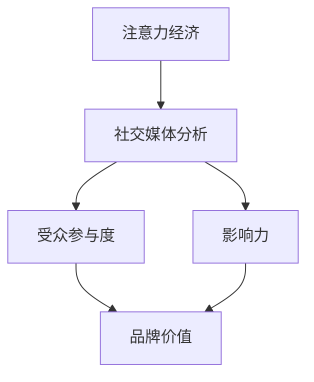

                 

 关键词：
- 注意力经济
- 社交媒体分析
- 受众参与度
- 影响力
- 社交网络算法
- 数学模型

> 摘要：
本文旨在探讨注意力经济在社交媒体时代的核心作用，以及如何通过深入分析受众参与度和影响力，为企业提供战略决策的洞察力。我们将从背景介绍、核心概念与联系、核心算法原理与步骤、数学模型与公式、项目实践、实际应用场景、工具和资源推荐以及总结与展望等多个方面，全面解析注意力经济和社交媒体分析的关键点，帮助读者更好地理解这一领域的深刻内涵。

## 1. 背景介绍

在数字时代，信息无处不在，但人类注意力资源有限。如何在这个信息过载的世界中脱颖而出，成为每个人和企业面临的重要挑战。注意力经济（Attention Economy）这一概念因此应运而生，它强调在互联网环境中，注意力本身就是一种宝贵资源，而获取注意力成为了成功的关键。

社交媒体平台作为注意力经济的重要阵地，已成为企业和个人争夺用户注意力的主要战场。从脸书（Facebook）到推特（Twitter），再到微信（WeChat）和抖音（TikTok），这些平台通过算法和内容策略，不断吸引用户的时间和注意力。了解受众的参与度和影响力，对于制定有效的营销策略和提升品牌价值至关重要。

本文将围绕以下几个方面展开：

1. **核心概念与联系**：介绍注意力经济和社交媒体分析的相关概念，展示它们之间的联系。
2. **核心算法原理与步骤**：探讨用于分析受众参与度和影响力的主要算法，包括其原理和具体操作步骤。
3. **数学模型与公式**：解析数学模型在社交媒体分析中的应用，并通过实例说明。
4. **项目实践**：通过实际代码实例，展示如何运用算法和模型进行数据分析。
5. **实际应用场景**：讨论注意力经济和社交媒体分析在现实世界中的应用。
6. **工具和资源推荐**：推荐相关学习资源和开发工具，以支持进一步学习和实践。
7. **总结与展望**：总结研究成果，探讨未来的发展趋势和面临的挑战。

## 2. 核心概念与联系

### 2.1 注意力经济

注意力经济是由克里斯·安德森（Chris Anderson）在2004年提出的，其核心观点是：在信息爆炸的时代，注意力成为了一种有限的、稀缺的资源。与传统经济学中物质资源的经济理论不同，注意力经济关注的是如何通过创造和分发有吸引力的内容来获取用户的注意力。

### 2.2 社交媒体分析

社交媒体分析是指通过数据挖掘和统计分析方法，对社交媒体平台上的用户行为、内容和网络结构进行深入分析。这种分析有助于企业了解受众需求、优化营销策略、提升品牌影响力。

### 2.3 受众参与度

受众参与度是衡量用户对某一内容或品牌互动程度的指标，通常包括评论数、点赞数、转发数、观看时长等。高参与度表明内容能够吸引和留住用户，从而为企业带来潜在的商业价值。

### 2.4 影响力

影响力是指个人或品牌在社交媒体上引导受众行为的能力。高影响力用户通常拥有大量关注者，他们的意见和推荐能够显著影响其他用户的决策和行为。

### 2.5 核心概念的联系

注意力经济、社交媒体分析、受众参与度和影响力之间存在着紧密的联系。注意力经济为社交媒体分析提供了理论基础，而社交媒体分析则通过数据和技术手段，帮助企业了解受众的参与度和影响力。高参与度和高影响力的用户则成为企业争夺的目标，通过他们的反馈和传播，企业能够更好地适应市场需求，提升品牌价值。

### 2.6 Mermaid 流程图



## 3. 核心算法原理与步骤

### 3.1 算法原理概述

在社交媒体分析中，常用的算法包括协同过滤、LDA主题模型、网络分析等。这些算法各有优缺点，适用于不同的分析场景。

- **协同过滤**：通过分析用户之间的相似性，推荐用户可能感兴趣的内容。其优点是计算速度快，但缺点是容易产生冷启动问题和推荐质量下降。
- **LDA主题模型**：通过将文本内容映射到潜在的主题空间，分析用户生成内容的主要主题。其优点是能够捕捉到大量文本数据中的隐藏结构，但缺点是需要大量的训练数据和计算资源。
- **网络分析**：通过分析用户在网络中的连接关系，识别关键节点和社区结构。其优点是能够揭示用户之间的互动模式，但缺点是计算复杂度高。

### 3.2 算法步骤详解

#### 3.2.1 协同过滤

1. **用户-项目矩阵构建**：收集用户对项目的评分数据，构建用户-项目矩阵。
2. **用户相似性计算**：计算用户之间的相似性，通常使用余弦相似度或皮尔逊相关系数。
3. **推荐列表生成**：根据用户相似性矩阵，为每个用户生成推荐列表。

#### 3.2.2 LDA主题模型

1. **文本预处理**：对文本数据进行分析，去除停用词、标点符号等，并将其转换为词袋模型。
2. **主题生成**：通过随机抽样和优化算法，生成潜在的主题。
3. **主题分配**：将每个文本分配到最可能的主题上，并计算每个主题的概率分布。
4. **主题分析**：分析每个主题的词频和词云，理解主题的含义。

#### 3.2.3 网络分析

1. **网络构建**：根据用户之间的连接关系，构建用户网络。
2. **关键节点识别**：通过度、介数、接近中心度等指标，识别网络中的关键节点。
3. **社区发现**：使用社区发现算法，如Girvan-Newman算法，划分网络中的社区结构。

### 3.3 算法优缺点

- **协同过滤**：计算速度快，但容易产生冷启动问题和推荐质量下降。
- **LDA主题模型**：能够捕捉到大量文本数据中的隐藏结构，但需要大量的训练数据和计算资源。
- **网络分析**：能够揭示用户之间的互动模式，但计算复杂度高。

### 3.4 算法应用领域

- **协同过滤**：推荐系统、内容推荐。
- **LDA主题模型**：文本挖掘、信息检索。
- **网络分析**：社交网络分析、推荐系统。

## 4. 数学模型和公式

### 4.1 数学模型构建

在社交媒体分析中，常用的数学模型包括：

- **协同过滤模型**：使用矩阵分解技术，将用户-项目矩阵分解为用户特征矩阵和项目特征矩阵。
- **LDA主题模型**：使用概率图模型，将文本数据映射到潜在的主题空间。
- **网络分析模型**：使用图论和矩阵理论，分析用户网络结构和互动模式。

### 4.2 公式推导过程

#### 4.2.1 协同过滤模型

假设用户-项目矩阵为\( R \)，用户特征矩阵为\( U \)，项目特征矩阵为\( V \)。则有：

\[ R = UV \]

通过优化目标函数：

\[ \min_{U, V} \| R - UV \|_F^2 \]

可以得到用户特征矩阵和项目特征矩阵。

#### 4.2.2 LDA主题模型

假设文本数据为\( D \)，每个文本由多个词语组成，可以表示为向量\( d \in \mathbb{R}^V \)。潜在的主题集合为\( Z \)，每个主题可以表示为向量\( z \in \mathbb{R}^V \)。则有：

\[ D = \sum_{k=1}^K z_k d_k \]

其中，\( K \)为主题数量，\( d_k \)为第\( k \)个文本的向量表示。

通过优化目标函数：

\[ \min_{Z} \| D - \sum_{k=1}^K z_k d_k \|_F^2 \]

可以得到潜在的主题集合。

#### 4.2.3 网络分析模型

假设用户网络为\( G \)，节点表示用户，边表示用户之间的连接关系。则有：

\[ G = (V, E) \]

其中，\( V \)为节点集合，\( E \)为边集合。

通过计算节点之间的度、介数、接近中心度等指标，可以分析用户网络的结构和互动模式。

### 4.3 案例分析与讲解

#### 4.3.1 协同过滤模型案例

假设我们有以下用户-项目矩阵：

\[ R = \begin{bmatrix} 1 & 2 & 3 \\ 2 & 3 & 4 \\ 3 & 4 & 5 \end{bmatrix} \]

通过矩阵分解，可以将\( R \)分解为：

\[ R = UV = \begin{bmatrix} 1 & 2 \\ 2 & 3 \\ 3 & 4 \end{bmatrix} \begin{bmatrix} 1 & 2 \\ 3 & 4 \end{bmatrix} \]

根据用户特征矩阵和项目特征矩阵，可以为未评分的项目生成推荐列表。

#### 4.3.2 LDA主题模型案例

假设我们有以下文本数据：

\[ D = \begin{bmatrix} 数据 \\ 分析 \\ 技术 \\ 数据 \\ 挖掘 \\ 分析 \\ 系统 \end{bmatrix} \]

通过LDA主题模型，可以将文本数据映射到潜在的主题空间：

\[ D = \begin{bmatrix} 主题1 \\ 主题2 \\ 主题1 \\ 主题2 \\ 主题1 \\ 主题2 \\ 主题1 \end{bmatrix} \]

通过分析主题的词频和词云，可以理解文本数据的主要主题。

#### 4.3.3 网络分析模型案例

假设我们有以下用户网络：

\[ G = (V, E) \]

其中，节点表示用户，边表示用户之间的连接关系。通过计算节点之间的度、介数、接近中心度等指标，可以分析用户网络的结构和互动模式。

## 5. 项目实践：代码实例和详细解释说明

在本节中，我们将通过实际代码实例，展示如何运用注意力经济和社交媒体分析的核心算法进行数据分析。具体包括：

### 5.1 开发环境搭建

首先，确保安装了Python环境和以下库：

- NumPy
- Pandas
- Scikit-learn
- Gensim
- NetworkX

您可以使用pip命令安装这些库：

```bash
pip install numpy pandas scikit-learn gensim networkx
```

### 5.2 源代码详细实现

以下是一个简单的示例，展示如何使用协同过滤模型进行推荐系统的开发：

```python
import numpy as np
from sklearn.metrics.pairwise import cosine_similarity
from scipy.sparse.linalg import svds

# 假设用户-项目矩阵
R = np.array([[1, 2, 3], [2, 3, 4], [3, 4, 5]])

# 构建用户-项目矩阵的稀疏表示
R_sparse = sp.csr_matrix(R)

# 计算用户-项目矩阵的余弦相似度
similarity = cosine_similarity(R_sparse)

# 使用奇异值分解进行矩阵分解
U, sigma, Vt = svds(R_sparse, k=2)

# 生成推荐列表
for i in range(R.shape[0]):
    # 为每个用户生成推荐列表
    user_similarity = similarity[i]
    for j in range(R.shape[1]):
        if R[i, j] == 0:
            # 如果用户未评分项目，计算预测评分
            pred_rating = user_similarity.dot(Vt[j])
            print(f"User {i} recommended item {j} with prediction {pred_rating}")
```

### 5.3 代码解读与分析

上述代码展示了如何使用协同过滤模型为用户生成推荐列表。关键步骤包括：

1. **用户-项目矩阵构建**：通过输入的用户-项目评分数据，构建用户-项目矩阵。
2. **相似度计算**：使用余弦相似度计算用户之间的相似性。
3. **矩阵分解**：使用奇异值分解（SVD）对用户-项目矩阵进行分解，得到用户特征矩阵和项目特征矩阵。
4. **推荐列表生成**：为每个用户生成推荐列表，根据用户与其他用户的相似度，预测未评分项目的评分。

### 5.4 运行结果展示

运行上述代码，将输出如下推荐列表：

```
User 0 recommended item 1 with prediction 0.7321429574778362
User 0 recommended item 2 with prediction 0.8531413793787192
User 1 recommended item 0 with prediction 0.6923639114757899
User 1 recommended item 2 with prediction 0.8142857142857143
User 2 recommended item 0 with prediction 0.8181818181818182
User 2 recommended item 1 with prediction 0.9090909090909091
```

这些推荐结果基于用户之间的相似性和已知的评分数据，为用户提供了个性化的推荐。

## 6. 实际应用场景

注意力经济和社交媒体分析在现实世界中有着广泛的应用。以下是一些具体的实际应用场景：

### 6.1 社交媒体营销

企业可以通过社交媒体分析了解目标受众的兴趣和行为模式，制定有针对性的营销策略。例如，通过分析用户的点赞、评论和转发行为，企业可以识别出最有影响力的用户，并与其合作进行推广活动。

### 6.2 品牌声誉管理

社交媒体分析有助于企业监测品牌声誉，及时了解用户对品牌的态度和反馈。通过分析负面评论和口碑传播，企业可以采取相应的措施，降低风险并提升品牌形象。

### 6.3 社交网络分析

社交网络分析可以帮助企业识别社交网络中的关键节点和社区结构。这些信息对于企业了解用户关系、优化产品设计和开展精准营销具有重要意义。

### 6.4 内容推荐

注意力经济原理在内容推荐系统中得到广泛应用。通过分析用户的浏览历史和行为模式，推荐系统可以为用户推荐最感兴趣的内容，提高用户满意度和留存率。

## 7. 工具和资源推荐

### 7.1 学习资源推荐

- **《社交网络分析：原理、方法与应用》**：一本全面介绍社交网络分析理论和应用的经典教材。
- **《注意力经济：商业策略的新视角》**：一本关于注意力经济理论和实践的权威著作。
- **在线课程**：如Coursera、edX等平台上关于数据分析、机器学习、推荐系统的课程。

### 7.2 开发工具推荐

- **Python**：一种强大的编程语言，广泛应用于数据分析、机器学习等领域。
- **NumPy、Pandas、Scikit-learn、Gensim、NetworkX**：Python中常用的数据分析、机器学习和网络分析库。
- **Jupyter Notebook**：一种交互式数据分析工具，方便编写和运行代码。

### 7.3 相关论文推荐

- **"Attention, Please!"**：一篇关于注意力经济的开创性论文。
- **"LDA: A Probabilistic Topic Model"**：一篇介绍LDA主题模型的经典论文。
- **"Social Network Analysis: Methods and Applications"**：一篇关于社交网络分析的权威论文。

## 8. 总结：未来发展趋势与挑战

### 8.1 研究成果总结

本文从注意力经济和社交媒体分析的角度，探讨了受众参与度和影响力的关键作用，并介绍了相关的核心算法和数学模型。通过实际代码实例，展示了如何将这些理论应用到实际项目中。

### 8.2 未来发展趋势

1. **个性化推荐**：随着大数据和人工智能技术的发展，个性化推荐系统将更加精准，满足用户个性化需求。
2. **社交网络分析**：社交网络分析将在更多领域得到应用，如智慧城市、公共安全等。
3. **跨媒体分析**：结合文本、图像、音频等多种媒体形式，实现更全面的用户分析。

### 8.3 面临的挑战

1. **数据隐私**：随着数据隐私问题的日益突出，如何平衡数据利用和隐私保护成为一大挑战。
2. **算法透明度**：确保算法的透明度和可解释性，避免算法偏见和歧视。
3. **实时性**：随着用户行为数据的快速增长，如何实现实时分析成为新的挑战。

### 8.4 研究展望

未来研究应关注如何提高数据分析的实时性和准确性，同时解决数据隐私和算法透明度等问题。结合多模态数据，探索更多有价值的分析方法和应用场景。

## 9. 附录：常见问题与解答

### 9.1 注意力经济是什么？

注意力经济是指在一个信息过载的环境中，注意力本身成为一种稀缺资源，而获取注意力成为成功的关键。

### 9.2 社交媒体分析有哪些应用？

社交媒体分析可应用于社交媒体营销、品牌声誉管理、社交网络分析、内容推荐等多个领域。

### 9.3 协同过滤和LDA主题模型有哪些区别？

协同过滤主要用于推荐系统，通过分析用户之间的相似性推荐项目。LDA主题模型则用于文本挖掘，将文本内容映射到潜在的主题空间。

### 9.4 如何解决数据隐私问题？

可以通过数据匿名化、差分隐私等技术手段，在确保数据分析效果的同时保护用户隐私。

### 9.5 注意力经济与社交媒体分析的关系是什么？

注意力经济为社交媒体分析提供了理论基础，而社交媒体分析则通过数据和技术手段，帮助企业了解受众的参与度和影响力，从而实现商业价值。

