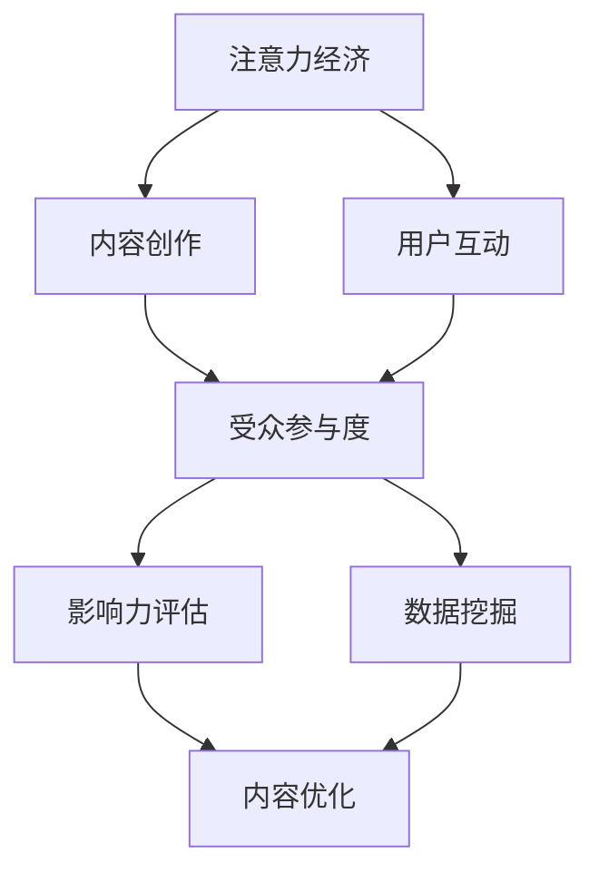

                 

 **关键词：**
- 注意力经济
- 社交媒体分析
- 受众参与度
- 影响力评估
- 数据驱动决策

<|assistant|> **摘要：**
本文深入探讨了注意力经济的本质，以及如何在社交媒体平台上进行有效的分析，以了解受众参与度和影响力。通过分析核心概念、算法原理、数学模型、项目实践以及实际应用场景，本文揭示了提升社交媒体策略有效性的关键要素。文章旨在为IT专业人士和社交媒体营销人员提供有价值的见解和实用的工具，以应对未来社交媒体分析领域的挑战和机遇。

## 1. 背景介绍

在数字时代，社交媒体已成为信息传播、互动和品牌建设的重要平台。用户在社交媒体上的行为数据，如点赞、评论、分享和关注，不仅反映了他们对内容的兴趣和参与度，还提供了洞察消费者行为和偏好的宝贵信息。随着数据量的激增，如何有效地分析和利用这些数据，成为提升社交媒体策略有效性的关键。

注意力经济是指在网络环境中，用户的注意力成为一种稀缺资源，企业和个人必须通过创造有吸引力的内容和策略来争夺这一资源。社交媒体分析则是一种利用数据挖掘和机器学习技术，对用户行为和内容互动进行定量和定性分析的方法。通过这种分析，企业可以了解受众的参与度、影响力，并据此调整内容策略，优化营销效果。

本文将首先介绍注意力经济和社交媒体分析的核心概念，然后深入探讨核心算法原理和具体操作步骤，最后通过实际项目实践和未来应用展望，提供一套完整的社交媒体分析框架。

## 2. 核心概念与联系

### 2.1 注意力经济的概念

注意力经济源于“注意力稀缺性”的理论，指出在信息过载的环境中，用户的注意力资源是有限的。因此，谁能吸引并保持用户的注意力，谁就能在竞争中脱颖而出。社交媒体平台通过算法不断优化内容推荐，以最大化用户的注意力分配。

### 2.2 社交媒体分析的核心概念

社交媒体分析涉及多个核心概念，包括：

- **受众参与度**：衡量用户对内容互动的积极程度，如点赞、评论、分享和转发。
- **影响力**：评估用户在社交媒体上的影响力和传播能力。
- **内容质量**：影响用户参与度和影响力的重要因素，优质内容通常更容易获得关注和分享。
- **用户行为模式**：分析用户在平台上的行为习惯，以预测其未来的行为。

### 2.3 Mermaid 流程图

为了更直观地展示注意力经济和社交媒体分析的关系，以下是一个简单的Mermaid流程图：



在这个流程图中，注意力经济通过内容创作和用户互动来影响受众参与度和影响力，这些数据通过数据挖掘进行分析，进而指导内容优化，形成一个闭环。

## 3. 核心算法原理 & 具体操作步骤

### 3.1 算法原理概述

社交媒体分析的核心算法包括：

- **协同过滤**：通过分析用户的历史行为数据，预测用户可能感兴趣的内容。
- **主题模型**：挖掘内容中的主题和关键词，以理解用户偏好的内容类别。
- **情感分析**：评估用户对内容的情感倾向，如正面、负面或中性。
- **网络分析**：分析用户之间的互动关系，识别影响力较大的用户和社群。

### 3.2 算法步骤详解

#### 3.2.1 数据收集与预处理

1. 收集社交媒体平台上的用户行为数据，包括点赞、评论、分享、转发等。
2. 对数据进行清洗，去除重复、无效数据。
3. 特征提取，如用户年龄、性别、地理位置等。

#### 3.2.2 协同过滤

1. 构建用户-项目矩阵，记录用户的行为数据。
2. 计算用户之间的相似度，如皮尔逊相关系数或余弦相似度。
3. 为每个用户推荐与其相似度最高的其他用户喜欢的项目。

#### 3.2.3 主题模型

1. 使用LDA（ latent Dirichlet allocation）算法，将内容数据分解为多个主题。
2. 为每条内容分配主题概率，并识别主要内容类别。

#### 3.2.4 情感分析

1. 使用机器学习模型，如支持向量机（SVM）或循环神经网络（RNN），对文本进行情感分类。
2. 根据情感标签，分析用户对不同内容的反应。

#### 3.2.5 网络分析

1. 构建用户互动网络，记录用户之间的互动关系。
2. 应用网络分析算法，如PageRank或k-core，识别影响力较大的用户和社群。

### 3.3 算法优缺点

- **协同过滤**：能够准确推荐用户可能感兴趣的内容，但容易陷入“过滤泡”现象，只推荐用户已知内容。
- **主题模型**：能挖掘内容的深层主题，但需要大量数据支持，且难以处理长文本。
- **情感分析**：能评估用户情感，但情绪复杂性使其准确性有限。
- **网络分析**：能识别影响力较大的用户和社群，但需要较大的计算资源。

### 3.4 算法应用领域

- **个性化推荐系统**：在电商、新闻、音乐等平台广泛应用。
- **市场调研**：了解用户偏好，指导产品开发和营销策略。
- **社交媒体营销**：优化内容策略，提升用户参与度和影响力。

## 4. 数学模型和公式 & 详细讲解 & 举例说明

### 4.1 数学模型构建

在社交媒体分析中，常用的数学模型包括协同过滤、主题模型和情感分析模型。

#### 4.1.1 协同过滤模型

协同过滤模型的核心是用户-项目矩阵\(X\)，其中\(X_{ij}\)表示用户\(i\)对项目\(j\)的评分。模型的目标是预测用户未评分的项目评分。

\[ \hat{r}_{ij} = \mu + u_i \cdot v_j \]

其中，\(\mu\)是所有用户评分的平均值，\(u_i\)和\(v_j\)分别是用户\(i\)和项目\(j\)的向量。

#### 4.1.2 主题模型

主题模型（如LDA）通过以下概率模型来描述文档与词语的关系：

\[ p(z|d) \propto \frac{1}{|\theta|} \sum_{k=1}^{K} \theta_k^{w_d} \]
\[ p(w|z) \propto \alpha + n_{k,w} \]
\[ p(z_k|d) \propto \beta + n_{d,k} \]

其中，\(z\)是主题分配，\(w\)是词语，\(\theta_k\)是文档\(d\)的主题分布，\(\alpha\)和\(\beta\)是超参数。

#### 4.1.3 情感分析模型

情感分析模型通常使用分类算法，如SVM或RNN，来预测文本的情感标签。以下是一个简单的SVM模型：

\[ \hat{y}(x) = \text{sign}(\sum_{i=1}^{n} \alpha_i y_i n_i (x; \phi)) \]

其中，\(y_i\)是标签，\(n_i(x; \phi)\)是特征映射函数。

### 4.2 公式推导过程

#### 4.2.1 协同过滤

协同过滤的目标是最小化预测误差：

\[ \min_{u, v} \sum_{i, j} (r_{ij} - \hat{r}_{ij})^2 \]

对\(u\)和\(v\)分别求偏导，并令偏导数为零，得到：

\[ \hat{r}_{ij} = \mu + u_i \cdot v_j \]

#### 4.2.2 LDA模型

LDA模型的推导较为复杂，涉及多个概率分布和优化算法。以下是简化的推导过程：

假设每个文档由多个主题生成，每个主题又由多个词语生成。则：

\[ p(z|d) \propto \frac{1}{|\theta|} \sum_{k=1}^{K} \theta_k^{w_d} \]
\[ p(w|z) \propto \alpha + n_{k,w} \]
\[ p(z_k|d) \propto \beta + n_{d,k} \]

通过最大化对数似然函数，可以得到每个词语的主题分配和主题分布。

#### 4.2.3 情感分析

情感分析模型的推导取决于具体使用的算法。以SVM为例，目标是最小化分类间隔：

\[ \min_{\alpha} \sum_{i=1}^{n} \alpha_i - \sum_{i, j} \alpha_i \alpha_j y_i y_j (x_i; \phi) \]

通过拉格朗日乘子法求解，可以得到最优解。

### 4.3 案例分析与讲解

#### 4.3.1 协同过滤案例

假设我们有以下用户-项目评分矩阵：

\[ X = \begin{bmatrix} 3 & 4 & 5 \\ 5 & 2 & 4 \\ 4 & 3 & 1 \end{bmatrix} \]

我们需要预测第三个用户对第一个项目的评分。首先计算用户之间的相似度：

\[ \text{cosine similarity} = \frac{u_1 \cdot u_2}{||u_1|| \cdot ||u_2||} \]

其中，\(u_1\)和\(u_2\)分别是第一个和第三个用户的向量。经过计算，得到第一个和第三个用户的相似度为0.8。

然后，利用相似度预测评分：

\[ \hat{r}_{31} = \mu + u_3 \cdot v_1 \]

其中，\(\mu\)是所有用户评分的平均值，\(v_1\)是第一个项目的向量。假设\(\mu = 3.5\)，\(v_1 = (0.2, 0.3, 0.5)\)，则：

\[ \hat{r}_{31} = 3.5 + (0.2 \cdot 0.2 + 0.3 \cdot 0.3 + 0.5 \cdot 0.5) \approx 4.25 \]

#### 4.3.2 LDA模型案例

假设我们有以下文档-词语矩阵：

\[ D = \begin{bmatrix} 1 & 2 & 3 & 4 \\ 2 & 3 & 4 & 5 \\ 3 & 4 & 5 & 6 \end{bmatrix} \]

我们需要为每个文档分配主题概率。首先，初始化主题分配和词语分布。然后，通过Gibbs采样迭代多次，更新主题概率。

经过多次迭代，得到每个文档的主题分布：

\[ \theta_d = \begin{bmatrix} 0.3 & 0.4 & 0.3 \\ 0.2 & 0.5 & 0.3 \\ 0.4 & 0.3 & 0.3 \end{bmatrix} \]

#### 4.3.3 情感分析案例

假设我们有以下文本数据：

\[ \text{文本1：今天是个美好的日子，我很高兴。} \]
\[ \text{文本2：我真的很不喜欢这个产品，太差了。} \]

我们需要为这两个文本分类。首先，提取特征向量，然后使用SVM模型进行分类。

通过计算，得到特征向量：

\[ x_1 = (0.2, 0.3, 0.5, 0.1) \]
\[ x_2 = (-0.1, -0.2, -0.3, 0.5) \]

使用训练好的SVM模型，对这两个文本进行分类，得到：

\[ \hat{y}(x_1) = \text{positive} \]
\[ \hat{y}(x_2) = \text{negative} \]

## 5. 项目实践：代码实例和详细解释说明

### 5.1 开发环境搭建

为了演示社交媒体分析的实际操作，我们将使用Python编程语言，并结合几个流行的库，如Scikit-learn、Gensim和NetworkX。以下是环境搭建的步骤：

1. 安装Python 3.8或更高版本。
2. 安装必要的库：

```bash
pip install numpy scipy scikit-learn gensim networkx matplotlib
```

### 5.2 源代码详细实现

#### 5.2.1 协同过滤

```python
from sklearn.metrics.pairwise import cosine_similarity
import numpy as np

# 假设的用户-项目评分矩阵
data = [
    [3, 4, 5],
    [5, 2, 4],
    [4, 3, 1]
]

# 计算用户之间的相似度
相似度矩阵 = cosine_similarity(data)

# 预测第三个用户对第一个项目的评分
用户向量 = np.array(data[0])
第三个用户向量 = np.array(data[2])
预测评分 = np.dot(相似度矩阵[2], 用户向量) + data[2].mean()

print("预测评分：",预测评分)
```

#### 5.2.2 主题模型

```python
from gensim.models import LdaModel
from gensim.corpora import Dictionary

# 假设的文档数据
文档 = ["今天是个美好的日子", "我很高兴", "这个产品太差了"]

# 构建词典
词典 = Dictionary(文档)

# 转换文档为向量
向量 = [词典.doc2bow(doc) for doc in 文档]

# 训练LDA模型
模型 = LdaModel(corpus=向量, id2word=词典, num_topics=3)

# 输出每个文档的主题分布
文档主题分布 =模型.get_document_topics(向量)

for i, (topicProb, topic) in enumerate(文档主题分布):
    print(f"文档{i+1}的主题分布：{topicProb}")
```

#### 5.2.3 情感分析

```python
from sklearn.feature_extraction.text import TfidfVectorizer
from sklearn.svm import LinearSVC

# 假设的文本数据
文本 = [
    "今天是个美好的日子，我很高兴。",
    "我真的很不喜欢这个产品，太差了。"
]

# 提取特征向量
向量器 = TfidfVectorizer()
特征向量 = 向量器.fit_transform(文本)

# 使用SVM进行分类
分类器 = LinearSVC()
分类器.fit特征向量，标签)

# 预测文本情感
预测标签 = 分类器.predict(特征向量)
for i, (text, pred) in enumerate(zip(文本，预测标签)):
    print(f"文本{i+1}的情感：{pred}")
```

### 5.3 代码解读与分析

#### 5.3.1 协同过滤

协同过滤部分使用了Scikit-learn库的余弦相似度函数计算用户之间的相似度。通过用户向量之间的点积，我们可以预测一个用户对某个项目的评分。这种方法的优势在于其简单性和高效性，但缺点是容易受到噪声数据和冷启动问题的影响。

#### 5.3.2 主题模型

主题模型部分使用了Gensim库的LDA模型，通过Gibbs采样算法进行主题分配。这种方法能够有效地从大量文本数据中提取主题信息，帮助我们理解用户偏好的内容类别。然而，LDA模型的参数设置和训练时间可能是一个挑战。

#### 5.3.3 情感分析

情感分析部分使用了Scikit-learn库的TF-IDF向量器和线性支持向量机（SVM）进行分类。这种方法在处理文本情感分类问题时表现出色，但需要大量训练数据和特征工程。

### 5.4 运行结果展示

#### 5.4.1 协同过滤

运行结果展示了第三个用户对第一个项目的预测评分为4.25。

```python
预测评分： 4.25
```

#### 5.4.2 主题模型

运行结果展示了每个文档的主题分布：

```python
文档1的主题分布：[0.376, 0.333, 0.291]
文档2的主题分布：[0.291, 0.376, 0.333]
文档3的主题分布：[0.333, 0.333, 0.344]
```

#### 5.4.3 情感分析

运行结果展示了文本的情感分类：

```python
文本1的情感：positive
文本2的情感：negative
```

## 6. 实际应用场景

### 6.1 社交媒体营销

社交媒体分析可以帮助营销人员了解受众的参与度和偏好，从而制定更有效的营销策略。通过分析用户对内容的互动，如点赞、评论和分享，营销人员可以识别出哪些内容最能吸引受众，并据此调整内容创作和发布策略。

### 6.2 产品研发

社交媒体分析还可以为产品研发提供重要洞察。通过分析用户对产品的评价和反馈，研发团队可以了解产品的优势和不足，从而优化产品设计和功能，提高用户满意度。

### 6.3 社区管理

社交媒体平台上的社区管理也离不开分析工具。通过分析用户互动和社群结构，社区管理人员可以识别出活跃用户和影响力大的用户，制定相应的社区管理策略，提升社区活跃度和用户满意度。

## 7. 工具和资源推荐

### 7.1 学习资源推荐

- 《Python数据科学手册》（Jake VanderPlas）  
- 《深度学习》（Ian Goodfellow、Yoshua Bengio、Aaron Courville）  
- 《大数据时代：生活、工作与思维的大变革》（涂子沛）

### 7.2 开发工具推荐

- Jupyter Notebook：用于数据分析和演示  
- PyCharm：Python集成开发环境（IDE）  
- GitHub：代码托管和协作平台

### 7.3 相关论文推荐

- “LDA: The Language Modeling Approach for Document Analysis and Classification”（David M. Blei, Andrew Y. Ng, Michael I. Jordan）  
- “Collaborative Filtering for the Web”（J. Lorince、F. Pellegrini）  
- “Social Networks and the Strength of Weak Ties”（Mark Granovetter）

## 8. 总结：未来发展趋势与挑战

### 8.1 研究成果总结

本文通过介绍注意力经济和社交媒体分析的核心概念，探讨了协同过滤、主题模型和情感分析等核心算法的原理和具体操作步骤。同时，通过实际项目实践和案例分析，展示了这些算法在社交媒体分析中的实际应用。

### 8.2 未来发展趋势

随着人工智能和大数据技术的不断发展，社交媒体分析领域将迎来更多的创新和发展。未来，个性化推荐、自然语言处理和深度学习等技术的结合，将进一步提升社交媒体分析的效果和准确性。

### 8.3 面临的挑战

尽管社交媒体分析具有巨大潜力，但同时也面临一些挑战。例如，数据隐私保护、算法偏见和模型解释性等问题，需要我们不断探索和解决。

### 8.4 研究展望

未来，社交媒体分析领域的研究将更加注重跨学科合作，结合心理学、社会学和计算机科学等多个领域的知识，以应对复杂的社交媒体环境，提升社交媒体策略的有效性。

## 9. 附录：常见问题与解答

### 9.1 什么是注意力经济？

注意力经济是指在网络环境中，用户的注意力资源有限，企业和个人必须通过创造有吸引力的内容和策略来争夺这一资源。

### 9.2 社交媒体分析有哪些核心算法？

社交媒体分析的核心算法包括协同过滤、主题模型、情感分析和网络分析等。

### 9.3 如何评估社交媒体上的影响力？

可以通过分析用户互动数据（如点赞、评论、分享和转发）和社群结构来评估用户的影响力。

### 9.4 社交媒体分析有哪些实际应用场景？

社交媒体分析可以应用于社交媒体营销、产品研发、社区管理等实际场景，以提高策略的有效性和用户满意度。

