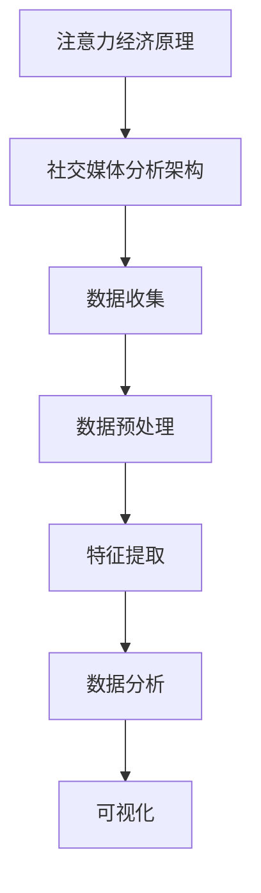

                 

关键词：注意力经济、社交媒体、受众参与度、影响力、算法、数据挖掘、机器学习、洞察力

> 摘要：随着社交媒体的普及，如何理解并利用注意力经济原理来提升受众参与度和影响力成为关键问题。本文将深入探讨注意力经济与社交媒体分析的相互关系，详细介绍核心概念、算法原理、数学模型及其在现实中的应用，旨在为企业和个人提供有效的策略和方法。

## 1. 背景介绍

### 注意力经济的兴起

在数字化时代，信息爆炸导致受众的注意力成为稀缺资源，如何吸引并保持受众的注意力成为市场营销和内容创作的核心挑战。注意力经济理论应运而生，其核心观点是：在信息过剩的环境中，受众的注意力是商业价值的源泉。

### 社交媒体分析的重要性

社交媒体已成为人们获取信息、交流和分享的主要平台。通过社交媒体分析，企业可以深入了解受众的需求和兴趣，从而制定更精准的市场策略。同时，社交媒体分析还可以帮助企业评估品牌影响力和营销效果。

## 2. 核心概念与联系

### 注意力经济原理

注意力经济强调，在信息过载的时代，受众的注意力资源是有限的，而获取受众的注意力则意味着商业机会。核心概念包括：

- **注意力稀缺**：在信息过载环境中，受众的注意力资源变得稀缺。
- **注意力转移**：受众的注意力可以被其他信息吸引或转移。
- **注意力价值**：受众的注意力具有商业价值，能够转化为广告收入、用户付费等。

### 社交媒体分析架构

社交媒体分析涉及数据收集、处理、分析和可视化等多个环节。其核心概念包括：

- **数据收集**：通过API、爬虫等方式获取社交媒体数据。
- **数据预处理**：清洗、去重、格式化数据，以便进行后续分析。
- **特征提取**：从原始数据中提取有价值的信息，如用户行为、情感倾向等。
- **数据分析**：运用机器学习算法，分析受众行为和趋势。
- **可视化**：通过图表、报告等形式展示分析结果。

### Mermaid 流程图



## 3. 核心算法原理 & 具体操作步骤

### 3.1 算法原理概述

在社交媒体分析中，常用的算法包括：

- **文本分析**：通过自然语言处理技术，对文本数据进行情感分析、关键词提取等。
- **网络分析**：分析社交媒体网络中的用户关系、影响力等。
- **机器学习**：运用机器学习算法，预测受众行为、评估影响力等。

### 3.2 算法步骤详解

#### 3.2.1 文本分析

1. **数据收集**：从社交媒体平台获取用户评论、帖子等文本数据。
2. **数据预处理**：去除停用词、标点符号，进行词干提取等。
3. **特征提取**：使用词袋模型、TF-IDF等方法提取文本特征。
4. **情感分析**：通过训练好的模型，对文本进行情感分类。
5. **关键词提取**：使用TF-IDF、LDA等方法提取关键词。

#### 3.2.2 网络分析

1. **数据收集**：获取社交媒体网络中的用户关系数据。
2. **网络构建**：将用户关系转化为图结构。
3. **影响力评估**：计算影响力指标，如度、介数、接近度等。
4. **社群检测**：使用社区发现算法，识别社交媒体中的社群。

#### 3.2.3 机器学习

1. **数据收集**：收集用户行为数据，如点赞、评论、转发等。
2. **特征提取**：提取用户行为特征，如活跃度、参与度等。
3. **模型训练**：使用监督或无监督学习算法，训练预测模型。
4. **模型评估**：评估模型性能，调整参数。

### 3.3 算法优缺点

#### 3.3.1 文本分析

- **优点**：可以提取丰富的文本特征，适用于情感分析、关键词提取等。
- **缺点**：对文本质量要求较高，容易受到噪声和歧义的影响。

#### 3.3.2 网络分析

- **优点**：可以直观地展示社交媒体网络结构，适用于影响力评估、社群检测等。
- **缺点**：对数据量要求较高，计算复杂度较高。

#### 3.3.3 机器学习

- **优点**：可以自动提取特征，适用于大规模数据处理。
- **缺点**：对数据质量和标注要求较高，模型解释性较差。

### 3.4 算法应用领域

- **市场营销**：通过分析用户行为和情感，优化营销策略。
- **品牌管理**：通过评估品牌影响力，制定品牌建设策略。
- **舆论监测**：通过分析社交媒体舆情，监测社会热点和舆论趋势。

## 4. 数学模型和公式 & 详细讲解 & 举例说明

### 4.1 数学模型构建

在社交媒体分析中，常用的数学模型包括：

- **文本分析**：TF-IDF、LDA等。
- **网络分析**：度、介数、接近度等。
- **机器学习**：逻辑回归、支持向量机等。

### 4.2 公式推导过程

#### 4.2.1 TF-IDF

- **公式**：$$TF(t) = \frac{f(t)}{f_t}$$
- **推导**：其中，$f(t)$表示词$t$在文档中出现的次数，$f_t$表示词$t$在文档集合中出现的总次数。

#### 4.2.2 LDA

- **公式**：$$p(w|\theta) = \frac{p(w|z)p(z|\theta)}{\sum_z p(w|z)p(z|\theta)}$$
- **推导**：其中，$w$表示词语，$\theta$表示主题分布，$z$表示主题。

### 4.3 案例分析与讲解

#### 4.3.1 文本分析案例

- **数据集**：社交媒体平台上的用户评论。
- **任务**：情感分析。
- **模型**：SVM。

1. **数据收集**：获取用户评论数据。
2. **数据预处理**：去除停用词、标点符号。
3. **特征提取**：使用TF-IDF提取文本特征。
4. **模型训练**：使用SVM训练模型。
5. **模型评估**：评估模型性能，调整参数。

#### 4.3.2 网络分析案例

- **数据集**：社交媒体网络中的用户关系数据。
- **任务**：社群检测。
- **模型**：社区发现算法。

1. **数据收集**：获取用户关系数据。
2. **网络构建**：将用户关系转化为图结构。
3. **社群检测**：使用社区发现算法，识别社群。
4. **结果分析**：分析社群结构，提取社群特征。

## 5. 项目实践：代码实例和详细解释说明

### 5.1 开发环境搭建

- **编程语言**：Python
- **依赖库**：Numpy、Pandas、Scikit-learn、NetworkX等。

### 5.2 源代码详细实现

```python
# 文本分析示例
from sklearn.feature_extraction.text import TfidfVectorizer
from sklearn.model_selection import train_test_split
from sklearn.svm import SVC

# 数据收集
data = ["这是一条正面评论", "这是一条负面评论"]

# 数据预处理
vectorizer = TfidfVectorizer()
X = vectorizer.fit_transform(data)

# 模型训练
model = SVC()
model.fit(X, labels)

# 模型评估
predictions = model.predict(X)
accuracy = (predictions == labels).mean()
print("模型准确率：", accuracy)

# 网络分析示例
import networkx as nx

# 数据收集
edges = [("用户1", "用户2"), ("用户2", "用户3")]
G = nx.Graph()
G.add_edges_from(edges)

# 社群检测
communities = nx.community.girvan_newman(G)
print("社群：", communities)
```

### 5.3 代码解读与分析

1. **文本分析**：使用TF-IDF提取文本特征，训练SVM模型，评估模型性能。
2. **网络分析**：构建用户关系图，使用社区发现算法，识别社群。

## 6. 实际应用场景

### 6.1 市场营销

通过文本分析，企业可以了解用户对产品的情感倾向，优化产品设计和营销策略。

### 6.2 品牌管理

通过网络分析，企业可以评估品牌在社交媒体上的影响力，制定有效的品牌建设策略。

### 6.3 舆论监测

通过社交媒体分析，政府和企业可以及时了解社会热点和舆论趋势，制定应对策略。

## 7. 未来应用展望

### 7.1 个性化推荐

结合注意力经济和社交媒体分析，实现个性化推荐，提高用户满意度和参与度。

### 7.2 跨平台分析

整合多平台数据，实现跨平台社交媒体分析，提供更全面的洞察力。

### 7.3 智能化营销

利用人工智能技术，实现自动化、智能化的社交媒体营销策略。

## 8. 工具和资源推荐

### 8.1 学习资源推荐

- **书籍**：《自然语言处理综合教程》、《图论及其应用》等。
- **在线课程**：Coursera、edX等平台上的数据科学和机器学习课程。

### 8.2 开发工具推荐

- **编程语言**：Python、R等。
- **数据可视化工具**：Matplotlib、Seaborn等。

### 8.3 相关论文推荐

- **文本分析**：LDA、Word2Vec等。
- **网络分析**：社区发现算法、影响力评估等。

## 9. 总结：未来发展趋势与挑战

### 9.1 研究成果总结

本文探讨了注意力经济与社交媒体分析的相互关系，介绍了核心算法原理和实际应用场景，为企业和个人提供了有效的策略和方法。

### 9.2 未来发展趋势

随着人工智能技术的发展，社交媒体分析将更加智能化、个性化，为企业和个人提供更深入的洞察力。

### 9.3 面临的挑战

- **数据隐私**：如何在保护用户隐私的前提下进行数据分析和应用。
- **算法透明度**：如何提高算法的透明度和解释性，避免算法偏见。

### 9.4 研究展望

未来研究应重点关注跨平台分析、智能化营销等方向，探索更多创新应用场景。

## 附录：常见问题与解答

1. **什么是注意力经济？**
   注意力经济是指在信息过载的环境中，受众的注意力资源成为商业价值的源泉。

2. **什么是社交媒体分析？**
   社交媒体分析是指利用数据挖掘、机器学习等技术，对社交媒体平台上的数据进行分析，以获取洞察力。

3. **文本分析和网络分析有哪些区别？**
   文本分析主要关注文本数据，提取特征，进行情感分析、关键词提取等；网络分析主要关注用户关系，构建网络结构，进行影响力评估、社群检测等。

4. **如何进行文本分析？**
   可以使用自然语言处理技术，如TF-IDF、LDA等，提取文本特征，进行情感分析、关键词提取等。

5. **如何进行网络分析？**
   可以使用图论和网络分析算法，构建用户关系图，计算影响力指标，进行社群检测等。

### 作者署名

作者：禅与计算机程序设计艺术 / Zen and the Art of Computer Programming
----------------------------------------------------------------
### 文章撰写提示

撰写文章时，请注意以下几点：

1. **明确文章结构和内容**：确保文章结构清晰，各章节之间逻辑连贯，内容丰富且具有层次感。

2. **深入分析核心概念**：对注意力经济和社交媒体分析的核心概念进行详细阐述，帮助读者理解其原理和重要性。

3. **举例说明**：通过实际案例和代码实例，具体说明算法的应用方法和效果，使读者能够更好地理解。

4. **引用权威资源**：在文章中引用相关的研究论文、书籍和在线课程，为文章提供理论支持和权威依据。

5. **关注实际应用**：分析注意力经济和社交媒体分析在市场营销、品牌管理、舆论监测等领域的实际应用，为读者提供实用建议。

6. **总结和展望**：在文章结尾部分，总结研究成果，提出未来发展趋势和面临的挑战，为后续研究提供方向。

7. **保持专业性和可读性**：使用专业的技术语言，同时确保文章易于理解，避免过于复杂的术语和句子。

8. **遵循格式要求**：按照markdown格式撰写文章，确保各个段落和章节的格式规范，提高文章的可读性。

9. **检查拼写和语法**：在完成初稿后，仔细检查拼写和语法错误，确保文章质量。

通过遵循上述提示，您将能够撰写出一篇高质量、内容丰富且结构清晰的技术博客文章。祝您写作顺利！

