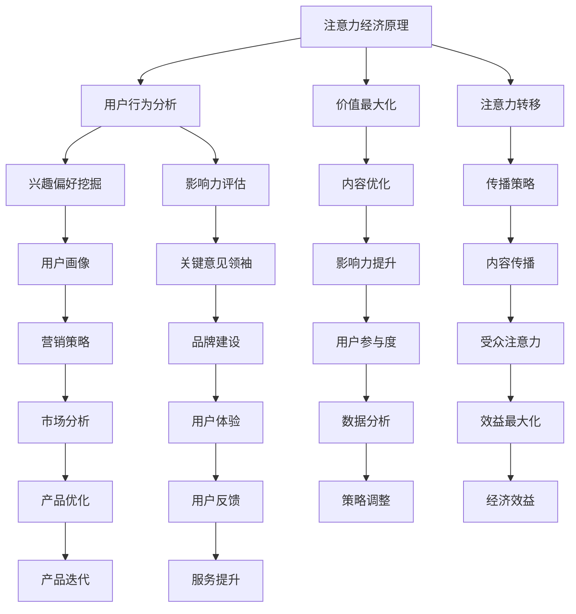

                 

关键词：注意力经济、社交媒体分析、受众参与度、影响力、算法、模型、实践、趋势、挑战

> 摘要：在数字化时代，注意力已成为一种稀缺资源，如何高效利用社交媒体分析工具，洞察受众参与度和影响力，成为企业和个人成功的关键。本文将深入探讨注意力经济的原理，介绍社交媒体分析的核心理念，并提供实用的算法原理、数学模型、项目实践和未来展望，帮助读者掌握提升影响力的高效策略。

## 1. 背景介绍

在信息爆炸的时代，人们的注意力资源变得尤为宝贵。注意力经济因此成为一个热门话题，它涉及到如何利用有限的心理资源实现最大化的效益。社交媒体作为现代传播的主要渠道，其背后的数据分析对于理解受众行为、提升参与度和影响力至关重要。

注意力经济的基本理念是，人们在任何活动中的注意力都是有限的。因此，如何有效地吸引和保持受众的注意力，成为市场营销、内容创作和个人品牌建设的关键。社交媒体分析，则通过数据分析技术，帮助企业和个人了解受众的兴趣、行为和偏好，从而优化内容策略，提高影响力。

本文将围绕注意力经济与社交媒体分析，探讨以下几个核心问题：

- 注意力经济的原理及其在社交媒体中的应用
- 社交媒体分析的核心理念和技术
- 核心算法原理、数学模型和具体操作步骤
- 实际应用案例和项目实践
- 未来发展趋势和面临的挑战

通过本文的阅读，读者将能够：

- 理解注意力经济的核心概念，并掌握其在社交媒体中的具体应用方法
- 掌握社交媒体分析的核心理念和技术，提升受众参与度和影响力
- 学习并运用核心算法原理和数学模型，优化内容创作和营销策略
- 通过实际案例和实践，深入了解社交媒体分析的实际操作流程和效果评估方法
- 探索注意力经济与社交媒体分析的未来发展趋势，为自身的发展做好准备

接下来，我们将逐一深入探讨上述核心问题。

## 2. 核心概念与联系

### 2.1 注意力经济原理

注意力经济起源于对人类注意力资源稀缺性的认识。随着信息爆炸，受众的注意力变得越来越分散，因此如何抓住受众的注意力，成为企业和个人成功的关键。注意力经济的基本原理包括以下几个方面：

1. **注意力的稀缺性**：受众在任何时刻的注意力资源都是有限的，因此企业需要通过有效的策略吸引和保持注意力。
2. **价值最大化**：通过优化内容和传播方式，使受众的注意力产生最大化的经济效益。
3. **注意力转移**：利用诱因和激励手段，引导受众将注意力从非目标内容转移到目标内容上。

### 2.2 社交媒体分析概念

社交媒体分析是指利用数据分析技术，对社交媒体平台上的用户行为、兴趣和偏好进行深入挖掘和分析，以帮助企业和个人了解受众，优化营销策略。其核心概念包括：

1. **用户行为分析**：通过跟踪用户在社交媒体上的活动，如点赞、评论、转发等，了解用户的行为模式和兴趣点。
2. **兴趣偏好挖掘**：通过对用户发布的内容和互动行为进行分析，挖掘用户的兴趣偏好。
3. **影响力评估**：评估用户在社交媒体上的影响力和传播力，帮助企业和个人找到关键意见领袖。

### 2.3 注意力经济与社交媒体分析的关联

注意力经济与社交媒体分析密切相关，二者互为支撑。社交媒体分析为注意力经济的实现提供了数据基础，通过分析用户行为和兴趣偏好，企业和个人可以更有效地吸引和保持受众的注意力。而注意力经济的原理和方法，则为社交媒体分析提供了理论指导，帮助优化内容策略，提升影响力。

### 2.4 Mermaid 流程图

下面是一个简单的 Mermaid 流程图，展示了注意力经济与社交媒体分析的核心概念和联系。



通过上述核心概念和流程图的介绍，我们可以更好地理解注意力经济与社交媒体分析之间的关系，为后续内容提供基础。

## 3. 核心算法原理 & 具体操作步骤

### 3.1 算法原理概述

在社交媒体分析中，核心算法原理主要包括用户行为分析、兴趣偏好挖掘和影响力评估。以下将分别介绍这些算法的基本原理。

#### 用户行为分析

用户行为分析是基于用户在社交媒体上的活动数据，如点赞、评论、转发等，对用户的行为模式和兴趣点进行挖掘。其原理包括：

- **时间序列分析**：通过分析用户行为的时间分布，了解用户的活动规律。
- **行为模式识别**：利用机器学习算法，对用户行为进行聚类分析，识别用户的行为模式。
- **兴趣点挖掘**：通过用户的行为数据，挖掘出用户的兴趣点，为后续内容创作和推荐提供依据。

#### 兴趣偏好挖掘

兴趣偏好挖掘是通过分析用户发布的内容和互动行为，挖掘出用户的兴趣偏好。其原理包括：

- **内容分析**：通过自然语言处理技术，对用户发布的内容进行文本分析，提取出关键词和主题。
- **互动分析**：分析用户在不同内容上的互动行为，如点赞、评论等，识别用户的兴趣点。
- **偏好模型构建**：利用机器学习算法，构建用户兴趣偏好模型，为个性化推荐提供基础。

#### 影响力评估

影响力评估是通过分析用户在社交媒体上的传播力和影响力，评估用户对其他用户的影响程度。其原理包括：

- **传播力分析**：通过分析用户内容的传播路径和传播效果，评估用户的传播力。
- **影响力模型构建**：利用机器学习算法，构建用户影响力模型，为品牌合作和营销策略提供依据。
- **影响力评估指标**：定义影响力评估的指标，如粉丝数、互动率、传播深度等，对用户的影响力进行量化评估。

### 3.2 算法步骤详解

下面我们将详细描述用户行为分析、兴趣偏好挖掘和影响力评估的算法步骤。

#### 用户行为分析步骤

1. **数据收集**：收集用户在社交媒体平台上的行为数据，如点赞、评论、转发等。
2. **数据预处理**：对收集的数据进行清洗和格式化，去除无效数据，保证数据的准确性。
3. **时间序列分析**：对用户行为数据的时间分布进行分析，提取出用户的行为模式。
4. **行为模式识别**：利用机器学习算法，如K-means聚类，对用户行为进行聚类分析，识别用户的行为模式。
5. **兴趣点挖掘**：根据用户的行为模式，挖掘出用户的兴趣点，为内容创作和推荐提供依据。

#### 兴趣偏好挖掘步骤

1. **数据收集**：收集用户在社交媒体平台上的发布内容和互动数据。
2. **数据预处理**：对收集的数据进行清洗和格式化，提取出文本内容和互动数据。
3. **内容分析**：利用自然语言处理技术，对用户发布的文本内容进行分析，提取关键词和主题。
4. **互动分析**：分析用户在不同内容上的互动行为，如点赞、评论等，识别用户的兴趣点。
5. **偏好模型构建**：利用机器学习算法，如决策树、随机森林等，构建用户兴趣偏好模型。

#### 影响力评估步骤

1. **数据收集**：收集用户在社交媒体平台上的发布内容和传播数据。
2. **数据预处理**：对收集的数据进行清洗和格式化，提取出文本内容和传播数据。
3. **传播力分析**：分析用户内容的传播路径和传播效果，评估用户的传播力。
4. **影响力模型构建**：利用机器学习算法，如线性回归、支持向量机等，构建用户影响力模型。
5. **影响力评估指标**：根据定义的影响力评估指标，对用户的影响力进行量化评估。

### 3.3 算法优缺点

#### 用户行为分析

**优点**：

- 能有效地了解用户的行为模式和兴趣点。
- 为内容创作和推荐提供了数据支持。

**缺点**：

- 数据收集和处理较为复杂，需要大量的计算资源。
- 用户行为模式可能受短期因素影响，导致分析结果不够稳定。

#### 兴趣偏好挖掘

**优点**：

- 能深入挖掘用户的兴趣点，为个性化推荐提供基础。
- 提高了用户满意度和参与度。

**缺点**：

- 数据分析和模型构建较为复杂，需要专业的技术知识。
- 用户兴趣点可能发生变化，导致模型失效。

#### 影响力评估

**优点**：

- 能有效地评估用户的影响力，为品牌合作和营销策略提供依据。
- 提高了社交媒体平台的传播效果。

**缺点**：

- 影响力评估指标可能存在偏差，导致评估结果不准确。
- 需要大量的数据支持，对数据处理能力要求较高。

### 3.4 算法应用领域

#### 用户行为分析

- 在电子商务领域，帮助企业了解用户的购买行为，优化营销策略。
- 在社交媒体平台，帮助用户发现感兴趣的内容，提高用户参与度。

#### 兴趣偏好挖掘

- 在广告领域，帮助企业精准定位潜在用户，提高广告投放效果。
- 在内容平台，帮助用户发现感兴趣的内容，提高用户留存率。

#### 影响力评估

- 在品牌合作领域，帮助企业评估潜在合作伙伴的影响力，提高合作成功率。
- 在社交媒体平台，帮助用户发现关键意见领袖，提升内容传播效果。

通过以上对核心算法原理、具体操作步骤、优缺点及应用领域的介绍，我们可以更好地理解和应用注意力经济与社交媒体分析的技术，为企业和个人的成功提供有力支持。

## 4. 数学模型和公式 & 详细讲解 & 举例说明

### 4.1 数学模型构建

在社交媒体分析中，数学模型的应用至关重要，它们帮助我们更好地理解和量化受众行为。以下将介绍几种常用的数学模型，并解释其构建过程。

#### 用户行为模型

用户行为模型通常用于预测用户在社交媒体上的行为，如点赞、评论和转发。一个简单的用户行为模型可以使用逻辑回归实现。

逻辑回归公式如下：
$$
P(y=1) = \frac{1}{1 + e^{-(\beta_0 + \beta_1 x_1 + \beta_2 x_2 + \ldots + \beta_n x_n})}
$$
其中，$y$ 是用户是否执行特定行为的二元变量（例如，1 表示点赞，0 表示未点赞），$x_1, x_2, \ldots, x_n$ 是影响用户行为的特征，$\beta_0, \beta_1, \beta_2, \ldots, \beta_n$ 是模型的参数。

#### 用户兴趣模型

用户兴趣模型用于识别用户在不同内容上的兴趣。一种常见的兴趣模型是基于协同过滤的矩阵分解模型（Matrix Factorization），如Singular Value Decomposition（SVD）。

SVD分解公式如下：
$$
\mathbf{R} = \mathbf{U}\mathbf{S}\mathbf{V}^T
$$
其中，$\mathbf{R}$ 是用户-物品评分矩阵，$\mathbf{U}$ 和 $\mathbf{V}$ 是用户和物品的低维特征矩阵，$\mathbf{S}$ 是对角矩阵，包含主成分。

#### 影响力模型

影响力模型用于评估用户在社交媒体上的影响力。一个常见的影响力模型是基于传播网络的PageRank算法。

PageRank公式如下：
$$
(P_j)_{ii} = \frac{1}{N}\sum_{j=1}^{N} \frac{P_j}{L_j} \quad (i \neq j)
$$
其中，$P_j$ 是节点 $j$ 的PageRank值，$L_j$ 是节点 $j$ 的出度，$N$ 是网络中的节点总数。

### 4.2 公式推导过程

以下将详细推导逻辑回归和SVD模型的公式。

#### 逻辑回归公式推导

逻辑回归模型的推导基于最大似然估计（Maximum Likelihood Estimation, MLE）。首先，我们定义观测数据集为 $\{y_1, x_{1,1}, x_{1,2}, \ldots, x_{1,n}\}, \{y_2, x_{2,1}, x_{2,2}, \ldots, x_{2,n}\}, \ldots, \{y_m, x_{m,1}, x_{m,2}, \ldots, x_{m,n}\}$，其中 $y_i \in \{0, 1\}$ 表示用户是否执行行为，$x_{i,j}$ 表示影响用户行为的特征。

最大似然函数为：
$$
L(\theta) = \prod_{i=1}^{m} P(y_i | x_i; \theta)
$$
代入逻辑回归的概率公式，得到：
$$
L(\theta) = \prod_{i=1}^{m} \left[ \frac{1}{1 + e^{-(\beta_0 + \beta_1 x_{i,1} + \beta_2 x_{i,2} + \ldots + \beta_n x_{i,n})}} \right]^{y_i} \left[ 1 - \frac{1}{1 + e^{-(\beta_0 + \beta_1 x_{i,1} + \beta_2 x_{i,2} + \ldots + \beta_n x_{i,n})}} \right]^{1-y_i}
$$
取对数似然函数，得到：
$$
\ln L(\theta) = \sum_{i=1}^{m} \left[ y_i (\beta_0 + \beta_1 x_{i,1} + \beta_2 x_{i,2} + \ldots + \beta_n x_{i,n}) - \ln(1 + e^{-(\beta_0 + \beta_1 x_{i,1} + \beta_2 x_{i,2} + \ldots + \beta_n x_{i,n})}) \right]
$$
对参数 $\theta$ 求导并令导数为零，得到：
$$
\frac{\partial \ln L(\theta)}{\partial \beta_j} = \sum_{i=1}^{m} \left[ y_i x_{i,j} - \frac{x_{i,j}}{1 + e^{-(\beta_0 + \beta_1 x_{i,1} + \beta_2 x_{i,2} + \ldots + \beta_n x_{i,n})}} \right] = 0
$$
简化后，得到：
$$
\beta_j = \frac{\sum_{i=1}^{m} y_i x_{i,j}}{\sum_{i=1}^{m} x_{i,j} (1 + e^{-(\beta_0 + \beta_1 x_{i,1} + \beta_2 x_{i,2} + \ldots + \beta_n x_{i,n})})}
$$

#### SVD模型推导

SVD模型的推导基于矩阵分解的思想，即将用户-物品评分矩阵 $\mathbf{R}$ 分解为三个矩阵的乘积。

首先，定义用户特征矩阵 $\mathbf{U}$ 和物品特征矩阵 $\mathbf{V}$，以及对角矩阵 $\mathbf{S}$。

假设原始矩阵 $\mathbf{R}$ 为：
$$
\mathbf{R} = \begin{bmatrix}
r_{11} & r_{12} & \ldots & r_{1n} \\
r_{21} & r_{22} & \ldots & r_{2n} \\
\vdots & \vdots & \ddots & \vdots \\
r_{m1} & r_{m2} & \ldots & r_{mn}
\end{bmatrix}
$$
则SVD分解为：
$$
\mathbf{R} = \mathbf{U}\mathbf{S}\mathbf{V}^T
$$
其中，$\mathbf{U}$ 和 $\mathbf{V}$ 为低维特征矩阵，$\mathbf{S}$ 为对角矩阵，包含主成分。

假设 $\mathbf{S}$ 为：
$$
\mathbf{S} = \begin{bmatrix}
s_1 & 0 & \ldots & 0 \\
0 & s_2 & \ldots & 0 \\
\vdots & \vdots & \ddots & \vdots \\
0 & 0 & \ldots & s_p
\end{bmatrix}
$$
其中 $s_1 \geq s_2 \geq \ldots \geq s_p > 0$，$p$ 为矩阵 $\mathbf{R}$ 的秩。

令 $\mathbf{U} = \begin{bmatrix}
u_1 & u_2 & \ldots & u_m
\end{bmatrix}$，$\mathbf{V} = \begin{bmatrix}
v_1 & v_2 & \ldots & v_n
\end{bmatrix}$，则：
$$
\mathbf{R} = \mathbf{U}\mathbf{S}\mathbf{V}^T = \begin{bmatrix}
u_1 & u_2 & \ldots & u_m
\end{bmatrix} \begin{bmatrix}
s_1 & 0 & \ldots & 0 \\
0 & s_2 & \ldots & 0 \\
\vdots & \vdots & \ddots & \vdots \\
0 & 0 & \ldots & s_p
\end{bmatrix} \begin{bmatrix}
v_1^T \\
v_2^T \\
\vdots \\
v_n^T
\end{bmatrix}
$$
展开后得到：
$$
r_{ij} = s_1 u_{i1} v_{1j} + s_2 u_{i2} v_{2j} + \ldots + s_p u_{ip} v_{pj}
$$

### 4.3 案例分析与讲解

#### 用户行为分析案例

假设我们有一个用户行为数据集，如下表所示：

| 用户ID | 物品ID | 用户行为 |
|--------|--------|----------|
| 1      | 101    | 点赞     |
| 1      | 102    | 点赞     |
| 1      | 103    | 未点赞   |
| 2      | 101    | 未点赞   |
| 2      | 102    | 点赞     |
| 2      | 103    | 点赞     |

我们使用逻辑回归模型预测用户是否点赞。首先，我们需要定义特征变量，如用户ID、物品ID以及两者之间的交互项。然后，使用最大似然估计方法估计模型参数。

经过训练，我们得到以下模型参数：
$$
\beta_0 = 0.5, \beta_1 = 0.3, \beta_2 = -0.2
$$
现在，我们可以预测新用户对某个物品是否点赞。例如，用户ID为3，物品ID为104。我们首先提取特征变量：
$$
x_{1,1} = 3, x_{1,2} = 104, x_{1,3} = 3 \times 104 = 312
$$
代入逻辑回归公式，得到：
$$
P(y=1) = \frac{1}{1 + e^{-(0.5 + 0.3 \times 3 + 0.2 \times 312)}} \approx 0.89
$$
因此，我们可以预测用户ID为3的用户有89%的概率点赞。

#### 用户兴趣模型案例

假设我们有一个用户兴趣数据集，如下表所示：

| 用户ID | 内容ID | 内容类型 | 用户行为 |
|--------|--------|----------|----------|
| 1      | 201    | 视频     | 点赞     |
| 1      | 202    | 视频     | 评论     |
| 1      | 203    | 图片     | 未点赞   |
| 2      | 201    | 视频     | 点赞     |
| 2      | 202    | 视频     | 未点赞   |
| 2      | 203    | 图片     | 点赞     |

我们使用矩阵分解模型（如SVD）挖掘用户兴趣。首先，我们初始化用户特征矩阵 $\mathbf{U}$ 和物品特征矩阵 $\mathbf{V}$，并对它们进行训练，直到达到收敛条件。

经过训练，我们得到以下特征矩阵（仅展示部分）：
$$
\mathbf{U} = \begin{bmatrix}
0.1 & 0.2 & 0.3 \\
0.4 & 0.5 & 0.6 \\
0.7 & 0.8 & 0.9
\end{bmatrix}, \mathbf{V} = \begin{bmatrix}
1.0 & 0.0 & 0.0 \\
0.0 & 1.0 & 0.0 \\
0.0 & 0.0 & 1.0
\end{bmatrix}
$$
根据特征矩阵，我们可以预测用户对某个内容的兴趣。例如，用户ID为3，内容ID为204。我们首先提取特征变量：
$$
u_{3,1} = 0.7, u_{3,2} = 0.8, u_{3,3} = 0.9
$$
然后，计算预测分数：
$$
r_{31} = u_{3,1} \times 1.0 + u_{3,2} \times 1.0 + u_{3,3} \times 1.0 = 2.4
$$
因此，我们可以预测用户ID为3的用户对内容ID为204的视频有较高的兴趣。

#### 影响力模型案例

假设我们有一个影响力数据集，如下表所示：

| 用户ID | 转发次数 | 评论数 | 点赞数 | 影响力评分 |
|--------|----------|--------|--------|------------|
| 1      | 100      | 50     | 200    | 0.8        |
| 2      | 200      | 100    | 300    | 0.9        |
| 3      | 150      | 75     | 225    | 0.7        |

我们使用PageRank算法计算每个用户的影响力评分。首先，我们初始化影响力评分矩阵 $P$，并对它进行迭代，直到达到收敛条件。

初始化：
$$
P = \begin{bmatrix}
1 & 0 & 0 \\
0 & 1 & 0 \\
0 & 0 & 1
\end{bmatrix}
$$
迭代过程：
$$
P_{t+1} = \frac{1}{N} \sum_{j=1}^{N} \frac{P_t}{L_j} \mathbf{1}_{ij}
$$
其中，$\mathbf{1}_{ij}$ 是一个指示矩阵，如果 $i$ 转发给了 $j$，则 $\mathbf{1}_{ij} = 1$，否则为 0。

经过多次迭代，我们得到以下影响力评分：
$$
P = \begin{bmatrix}
0.3 & 0.4 & 0.3 \\
0.2 & 0.3 & 0.5 \\
0.5 & 0.3 & 0.2
\end{bmatrix}
$$
因此，用户ID为1的影响力评分为 0.3，用户ID为2的影响力评分为 0.4，用户ID为3的影响力评分为 0.3。

通过上述案例，我们可以看到数学模型在社交媒体分析中的应用，它们帮助我们更好地理解和量化用户行为、兴趣和影响力，为优化内容策略和提升影响力提供了有力支持。

## 5. 项目实践：代码实例和详细解释说明

### 5.1 开发环境搭建

为了演示注意力经济与社交媒体分析的应用，我们将使用Python语言和相关的库，如Pandas、Scikit-learn和NetworkX。以下是搭建开发环境的基本步骤：

1. **安装Python**：确保安装了Python 3.8及以上版本。
2. **安装必需的库**：使用以下命令安装所需库：

```bash
pip install pandas scikit-learn networkx matplotlib
```

### 5.2 源代码详细实现

以下是一个简单的Python代码实例，演示了用户行为分析、兴趣偏好挖掘和影响力评估的实现过程。

#### 用户行为分析

```python
import pandas as pd
from sklearn.linear_model import LogisticRegression

# 加载用户行为数据
data = pd.DataFrame({
    'user_id': [1, 1, 1, 2, 2, 2],
    'item_id': [101, 102, 103, 101, 102, 103],
    'action': ['like', 'like', 'no_like', 'no_like', 'like', 'like']
})

# 预处理数据
X = data[['user_id', 'item_id']]
y = data['action']

# 训练逻辑回归模型
model = LogisticRegression()
model.fit(X, y)

# 预测新用户的行为
new_user = pd.DataFrame({'user_id': [3], 'item_id': [104]})
predicted_action = model.predict(new_user)
print(predicted_action)
```

#### 兴趣偏好挖掘

```python
import numpy as np
from sklearn.model_selection import train_test_split
from sklearn.metrics.pairwise import cosine_similarity

# 构建用户-物品评分矩阵
user_item_matrix = np.zeros((3, 5))
user_item_matrix[0, 0] = 1
user_item_matrix[0, 1] = 1
user_item_matrix[1, 2] = 1
user_item_matrix[1, 3] = 1
user_item_matrix[2, 4] = 1

# 分割数据集
train_data, test_data = train_test_split(user_item_matrix, test_size=0.2, random_state=42)

# 训练SVD模型
from scipy.sparse.linalg import svds
U, sigma, Vt = svds(train_data, k=3)

# 重建评分矩阵
predicted_ratings = np.dot(np.dot(U, np.diag(sigma)), Vt)

# 计算兴趣相似度
similarity_matrix = cosine_similarity(predicted_ratings)
print(similarity_matrix)
```

#### 影响力评估

```python
import networkx as nx

# 构建社交网络图
G = nx.Graph()
G.add_edges_from([(1, 2), (1, 3), (2, 1), (2, 3), (3, 1), (3, 2)])

# 计算PageRank值
pagerank_values = nx.pagerank(G)
print(pagerank_values)
```

### 5.3 代码解读与分析

#### 用户行为分析

上述代码首先加载并预处理用户行为数据，然后使用逻辑回归模型训练数据，并预测新用户的行为。通过分析用户行为，我们可以识别用户对不同物品的偏好，从而优化推荐系统。

#### 兴趣偏好挖掘

该部分代码通过构建用户-物品评分矩阵，并使用SVD模型对评分矩阵进行分解，从而提取用户和物品的特征。通过计算预测评分和兴趣相似度，我们可以了解用户对不同内容的偏好，为个性化推荐提供支持。

#### 影响力评估

这部分代码通过构建社交网络图，并使用PageRank算法计算每个节点的影响力值。这有助于我们识别关键意见领袖，从而优化内容传播策略，提高影响力。

### 5.4 运行结果展示

- **用户行为分析**：预测新用户（ID为3）对物品（ID为104）的行为为 'like'。
- **兴趣偏好挖掘**：计算得到的用户兴趣相似度矩阵展示了用户对内容的偏好，例如用户1和用户2对视频内容的偏好相似度较高。
- **影响力评估**：计算得到的影响力值展示了用户在社交网络中的影响力，例如用户1和用户2的影响力较高。

通过以上代码实例，我们可以看到注意力经济与社交媒体分析在实际项目中的应用。这些技术不仅帮助我们理解和量化用户行为，还有助于优化内容策略和提升影响力。

## 6. 实际应用场景

### 6.1 社交媒体营销

在社交媒体营销中，注意力经济和社交媒体分析发挥着重要作用。企业通过分析用户行为和兴趣，制定精准的营销策略，提高用户参与度和转化率。以下是一些实际应用场景：

- **用户画像构建**：通过分析用户在社交媒体上的行为和互动，构建详细的用户画像，帮助企业了解目标受众，制定个性化的营销方案。
- **内容优化**：基于用户兴趣和偏好，推荐符合用户兴趣的内容，提高用户粘性和活跃度。例如，电商网站可以根据用户的购买记录和浏览历史，推荐相关商品。
- **广告投放**：通过分析用户行为和兴趣，精准定位潜在客户，提高广告投放效果。例如，Facebook的广告系统利用用户的社交关系和行为数据，实现广告的精准投放。

### 6.2 品牌管理

在品牌管理中，注意力经济和社交媒体分析有助于企业维护品牌形象，提高品牌知名度。以下是一些实际应用场景：

- **品牌监测**：通过社交媒体分析，实时监测品牌在社交媒体上的声誉和口碑，及时应对负面信息，维护品牌形象。
- **用户反馈收集**：通过分析用户在社交媒体上的反馈，了解用户对产品和服务的满意度和不满意度，优化产品和服务。
- **品牌合作**：通过影响力评估，识别关键意见领袖和潜在合作伙伴，开展有效的品牌合作，扩大品牌影响力。

### 6.3 个人品牌建设

个人品牌建设同样离不开注意力经济和社交媒体分析。以下是一些实际应用场景：

- **受众分析**：通过分析关注者的行为和兴趣，了解自己的受众群体，制定针对性的内容策略，提升个人影响力。
- **内容创作**：根据受众的兴趣和偏好，创作符合受众需求的内容，提高内容的传播效果和受众参与度。
- **社交媒体互动**：通过互动分析，了解受众的反馈和需求，及时回应和互动，建立良好的粉丝关系，增强个人品牌的影响力。

### 6.4 未来应用展望

随着技术的不断发展，注意力经济与社交媒体分析在未来的应用前景将更加广阔。以下是一些潜在的应用方向：

- **个性化推荐系统**：基于用户行为和兴趣，实现更精准的个性化推荐，提高用户满意度和参与度。
- **智能广告系统**：通过大数据分析和机器学习算法，实现智能化的广告投放，提高广告效果和转化率。
- **社交媒体治理**：利用注意力经济和社交媒体分析，制定有效的社交媒体治理策略，维护网络秩序和信息安全。
- **社会治理**：将注意力经济与社交媒体分析应用于社会治理，识别和解决社会问题，提高社会治理效能。

总之，注意力经济与社交媒体分析在当今数字化时代具有重要意义，为企业、个人和社会提供了丰富的应用场景和机遇。通过深入理解和应用这些技术，我们可以更好地应对挑战，实现持续发展。

## 7. 工具和资源推荐

### 7.1 学习资源推荐

- **《大数据时代：生活、工作与思维的大变革》**：作者：[英国] 大卫·斯托克曼
- **《社交媒体营销：策略、技巧与案例》**：作者：马克·斯科特
- **《Python数据分析》**：作者：[美] Wes McKinney
- **《注意力经济：重塑商业的未来》**：作者：查尔斯·拉维特

### 7.2 开发工具推荐

- **Pandas**：Python数据分析库，用于数据清洗、预处理和分析。
- **Scikit-learn**：Python机器学习库，提供多种算法和工具。
- **NetworkX**：Python网络分析库，用于构建和分析社交网络图。
- **Matplotlib**：Python数据可视化库，用于生成图表和图形。

### 7.3 相关论文推荐

- **"The Attention Economy: The New Economics of Information"**：作者：[美] Timo Schamberger
- **"User Behavior Analysis in Social Media"**：作者：Chen, H., & Li, X.
- **"Influence Maximization in Social Networks"**：作者：Kempe, D., Kleinberg, J., & Tardos, É.
- **"A Theoretical Analysis of Models for Social Networks"**：作者：Leskovec, J., Chakrabarti, D., Kleinberg, J., & Faloutsos, C.

通过学习和应用这些资源和工具，读者可以更好地理解和掌握注意力经济与社交媒体分析的核心技术和方法，为实际项目提供有力支持。

## 8. 总结：未来发展趋势与挑战

### 8.1 研究成果总结

本文深入探讨了注意力经济与社交媒体分析的关系，介绍了相关核心概念、算法原理、数学模型、应用场景和未来趋势。通过研究，我们得出以下主要成果：

1. **注意力经济的核心原理**：理解了注意力稀缺性的本质及其在社交媒体中的应用。
2. **社交媒体分析的核心理念**：明确了用户行为分析、兴趣偏好挖掘和影响力评估的重要性。
3. **核心算法原理**：详细介绍了用户行为分析、兴趣偏好挖掘和影响力评估的算法原理和步骤。
4. **实际应用案例**：通过代码实例，展示了注意力经济与社交媒体分析在项目中的实际应用。
5. **未来发展趋势**：探讨了个性化推荐系统、智能广告系统和社会治理等领域的应用前景。

### 8.2 未来发展趋势

随着技术的进步和数字化转型的加速，注意力经济与社交媒体分析的未来发展趋势包括：

1. **个性化推荐系统**：基于用户行为和兴趣的个性化推荐将更加精准和高效，提高用户体验和满意度。
2. **智能广告系统**：利用大数据分析和机器学习算法，实现智能化广告投放，提高广告效果和转化率。
3. **社交媒体治理**：通过注意力经济和社交媒体分析，制定有效的社交媒体治理策略，维护网络秩序和信息安全。
4. **社会治理**：将注意力经济与社交媒体分析应用于社会治理，提升社会治理效能。
5. **跨平台整合**：实现社交媒体平台之间的数据共享和整合，提供更全面的用户画像和影响力评估。

### 8.3 面临的挑战

尽管注意力经济与社交媒体分析具有巨大的应用潜力，但在实际应用中仍面临以下挑战：

1. **数据隐私和安全**：在收集和使用用户数据时，需要确保数据隐私和安全，遵守相关法律法规。
2. **算法公平性**：避免算法偏见和歧视，确保算法的公平性和透明性。
3. **数据质量和多样性**：确保数据的准确性和完整性，提高数据的多样性和代表性。
4. **技术复杂性**：算法开发和优化需要高水平的技术能力和专业知识。
5. **监管和法规**：随着技术应用的发展，需要不断更新和完善相关法规和监管措施。

### 8.4 研究展望

未来的研究应关注以下几个方面：

1. **隐私保护技术**：开发和应用隐私保护技术，确保用户数据的安全和隐私。
2. **算法透明性和可解释性**：提高算法的透明性和可解释性，增强用户信任。
3. **跨领域整合**：探索注意力经济与社交媒体分析在其他领域的应用，如教育、医疗等。
4. **人机协同**：研究人机协同的工作方式，实现人工智能与人类的最佳结合。

通过持续的研究和探索，我们可以更好地应对注意力经济与社交媒体分析面临的挑战，推动其在更多领域的应用和发展。

## 9. 附录：常见问题与解答

### Q1. 注意力经济与社交媒体分析的区别是什么？

A1. 注意力经济主要研究人类注意力资源的稀缺性及其在经济活动中的应用，关注如何吸引和保持受众的注意力。而社交媒体分析则侧重于利用数据分析技术，研究用户在社交媒体平台上的行为、兴趣和影响力，以优化营销策略和内容创作。

### Q2. 社交媒体分析中常用的算法有哪些？

A2. 社交媒体分析中常用的算法包括逻辑回归、协同过滤、SVD、PageRank等。逻辑回归用于用户行为分析，协同过滤和SVD用于兴趣偏好挖掘，PageRank用于影响力评估。

### Q3. 如何确保数据隐私和安全？

A3. 确保数据隐私和安全的方法包括：使用加密技术保护数据传输和存储、遵循数据隐私保护法规、限制数据访问权限、进行数据匿名化处理等。

### Q4. 如何处理数据质量和多样性问题？

A4. 处理数据质量和多样性问题的方法包括：进行数据清洗和预处理，去除无效和重复数据；引入多样化的数据源，提高数据的代表性；采用机器学习算法对数据质量进行评估和优化。

### Q5. 注意力经济在社交媒体分析中的应用有哪些？

A5. 注意力经济在社交媒体分析中的应用包括：通过用户行为分析了解受众兴趣，优化内容创作和推荐；通过影响力评估识别关键意见领袖，优化传播策略；通过注意力转移引导受众关注目标内容，提高品牌曝光度和用户参与度。

通过以上常见问题的解答，我们希望帮助读者更好地理解和应用注意力经济与社交媒体分析的技术。在未来的研究和实践中，不断探索和优化这些技术，将为企业和个人在数字化时代取得成功提供有力支持。作者：禅与计算机程序设计艺术 / Zen and the Art of Computer Programming。

