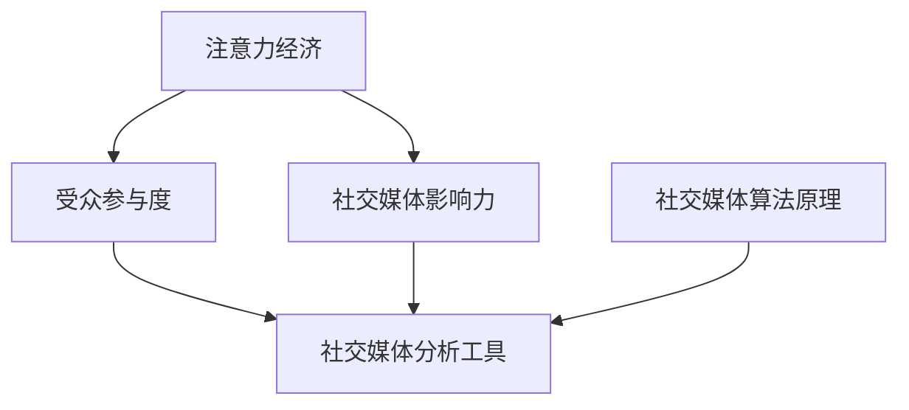

                 

关键词：注意力经济，社交媒体分析，受众参与度，影响力评估，算法原理

> 摘要：本文深入探讨了注意力经济的本质及其在社交媒体分析中的应用。通过分析受众参与度和影响力评估的关键算法原理和步骤，本文揭示了如何利用这些技术来提升个人或品牌的社交媒体表现。同时，文章还对未来发展的趋势和面临的挑战进行了展望，为读者提供了丰富的实践资源和工具推荐。

## 1. 背景介绍

在数字时代，社交媒体已经成为了人们生活中不可或缺的一部分。从个人用户到企业品牌，都渴望在社交媒体上获得更大的影响力，吸引更多的关注和参与。然而，如何在这个竞争激烈的平台上脱颖而出，成为了许多人关注的问题。

注意力经济，作为现代社交媒体的核心概念，指的是人们将有限的时间和精力投入到某些信息、产品或服务中的现象。在这个背景下，社交媒体分析成为了一种重要的工具，可以帮助我们了解受众的参与度和影响力，从而制定更有效的策略。

本文将围绕注意力经济和社交媒体分析进行深入探讨，介绍相关的核心概念、算法原理及其应用场景。通过本文的阅读，读者将能够了解如何利用技术手段提升个人或品牌的社交媒体表现，以及面对未来发展的挑战和机遇。

### 注意力经济的起源与发展

注意力经济这一概念最早由美国经济学家舒尔茨（Richard A. Schuetz）于20世纪70年代提出。他指出，注意力是一种稀缺资源，类似于金钱和时间。在一个充满信息过载的世界里，能够吸引并保持受众的注意力成为一种重要的竞争力。

随着互联网的普及和社交媒体的兴起，注意力经济逐渐成为学术界和商业界关注的热点。在社交媒体平台上，个人的注意力成为了一种可以交易的商品，吸引了广告商、品牌和内容创作者的广泛关注。因此，如何提高内容的质量和吸引力，从而获取更多的关注和参与，成为了关键问题。

### 社交媒体分析的重要性

社交媒体分析是指利用数据分析和人工智能技术，对社交媒体平台上的信息、用户行为和互动进行深入分析，以获取有价值的信息和洞察。随着社交媒体用户数量的爆发式增长，社交媒体分析的重要性愈发凸显。

首先，社交媒体分析可以帮助我们了解受众的参与度。通过分析用户在社交媒体平台上的互动行为，如点赞、评论、分享和转发等，我们可以评估受众对内容的兴趣和参与程度。这有助于我们制定更符合受众需求的内容策略。

其次，社交媒体分析有助于评估个人或品牌的影响力。影响力评估通常基于一系列指标，如粉丝数、点赞数、评论数、分享数和提及频率等。通过这些指标，我们可以评估个人或品牌在社交媒体上的影响力和知名度。

最后，社交媒体分析还可以为营销策略提供重要的参考。通过分析用户数据，我们可以了解受众的兴趣偏好和行为习惯，从而制定更精准的营销策略，提高营销效果。

### 注意力经济与社交媒体分析的关系

注意力经济与社交媒体分析密切相关。注意力经济强调受众的注意力和时间的价值，而社交媒体分析则为评估和提升这种价值提供了有效手段。

在社交媒体上，受众的注意力是有限的，如何吸引并保持他们的注意力成为关键问题。通过社交媒体分析，我们可以了解受众的兴趣偏好和行为模式，从而制定更具针对性的内容策略。例如，如果分析显示某个话题或类型的内容更受受众欢迎，我们可以增加相关内容的发布频率和数量，从而提高受众的参与度。

此外，社交媒体分析还可以帮助我们识别和评估个人或品牌的影响力。影响力不仅体现在粉丝数量上，更重要的是受众对内容的反馈和互动。通过分析这些数据，我们可以了解个人或品牌在社交媒体上的影响范围和深度，从而制定更有效的推广策略。

总之，注意力经济与社交媒体分析相辅相成，为个人和品牌在社交媒体上的成功提供了重要支撑。接下来，我们将进一步探讨注意力经济和社交媒体分析的核心概念，以及它们在现实世界中的应用。

## 2. 核心概念与联系

在深入了解注意力经济和社交媒体分析之前，我们需要明确一些关键概念，并理解它们之间的联系。以下是本文将涉及的核心概念及其定义：

### 2.1 受众参与度

受众参与度是指受众对社交媒体内容进行互动的程度。互动行为包括点赞、评论、分享、转发、观看时长、点击率等。受众参与度是衡量内容质量和吸引力的重要指标，也是评估个人或品牌影响力的重要依据。

### 2.2 社交媒体影响力

社交媒体影响力是指个人或品牌在社交媒体上吸引受众注意力和引导行为的能力。影响力通常通过一系列指标来评估，如粉丝数、点赞数、评论数、分享数、提及频率等。

### 2.3 社交媒体分析工具

社交媒体分析工具是指用于收集、分析和可视化社交媒体数据的软件或平台。这些工具可以帮助我们深入了解受众行为、内容效果和推广效果。

### 2.4 注意力经济原理

注意力经济是指受众将有限的时间和精力投入到某些信息、产品或服务中的现象。其核心在于如何吸引和保持受众的注意力，从而实现商业价值。

### 2.5 注意力分配模型

注意力分配模型是一种用于预测和优化受众注意力的方法。它基于受众的兴趣偏好和行为模式，将注意力分配到最有价值的内容上，以提高参与度和影响力。

### 2.6 社交媒体算法原理

社交媒体算法是指用于分析和推荐内容的算法。这些算法通常基于用户行为、兴趣和关系网络，通过数据挖掘和机器学习技术，为用户提供个性化的内容推荐。

### 2.7 关键概念联系

注意力经济与社交媒体分析的核心概念紧密相连。注意力经济关注受众的注意力和时间价值，而社交媒体分析则通过数据和技术手段来评估和提升这种价值。具体来说，以下概念之间的联系可以进一步解释：

- 受众参与度是注意力经济的基础指标，直接影响个人或品牌的影响力。
- 社交媒体影响力是受众参与度的结果和表现，反映了个人或品牌在社交媒体上的成功程度。
- 社交媒体分析工具和算法可以帮助我们理解和优化受众参与度，从而提高个人或品牌的影响力。

### 2.8 Mermaid 流程图

为了更好地理解这些概念之间的联系，我们可以使用 Mermaid 流程图来展示它们之间的关系：



在这个流程图中，注意力经济作为核心概念，通过受众参与度和社交媒体影响力与社交媒体分析工具和算法相连接。受众参与度是连接注意力经济和影响力评估的桥梁，而社交媒体分析工具和算法则为提升参与度和影响力提供了技术支持。

通过以上核心概念与联系的分析，我们可以更清晰地理解注意力经济和社交媒体分析的基本原理及其应用。接下来，我们将深入探讨注意力经济和社交媒体分析的核心算法原理，帮助读者更好地掌握这些技术。

### 2.9 核心算法原理 & 具体操作步骤

在深入了解注意力经济和社交媒体分析的核心算法原理之前，我们需要明确一些关键算法，这些算法在提升受众参与度和评估社交媒体影响力方面发挥着重要作用。以下是本文将介绍的核心算法及其基本原理和具体操作步骤。

#### 3.1 算法原理概述

**1. K-均值聚类算法（K-Means Clustering）**

K-均值聚类算法是一种无监督学习方法，用于将数据集分成K个簇，使每个簇内的数据点尽可能接近，而簇间的数据点尽可能远离。该算法在社交媒体分析中，用于用户分群和内容推荐。

**2. PageRank算法**

PageRank算法是由Google创始人拉里·佩奇和谢尔盖·布林提出的，用于评估网页的重要性和排名。在社交媒体分析中，PageRank可以用于评估用户的影响力。

**3. LDA主题模型（Latent Dirichlet Allocation）**

LDA主题模型是一种概率主题模型，用于从大量文本数据中提取潜在的主题。在社交媒体分析中，LDA可以帮助我们了解用户关注的热点话题和内容。

**4. 转化率优化算法（Conversion Rate Optimization）**

转化率优化算法是一种通过调整页面设计和内容，提高用户转化的方法。在社交媒体营销中，转化率优化算法可以帮助我们提高内容的参与度和购买转化率。

#### 3.2 算法步骤详解

**3.1 K-均值聚类算法**

**步骤1：初始化**
- 随机选择K个初始中心点。
- 通常K值可以根据数据集的大小和用户群体特征进行选择。

**步骤2：分配数据点**
- 对于每个数据点，计算其与K个中心点的距离。
- 将数据点分配到距离最近的中心点所在的簇。

**步骤3：更新中心点**
- 计算每个簇的新中心点，即簇内所有数据点的均值。
- 重复步骤2和步骤3，直到中心点不再变化或达到最大迭代次数。

**步骤4：分析结果**
- 分析各簇的特征和用户行为，为内容推荐和用户分群提供依据。

**3.2 PageRank算法**

**步骤1：初始化**
- 初始化每个网页的PageRank值，通常设置为1/N（N为网页总数）。

**步骤2：迭代计算**
- 对于每个网页，计算其邻居网页的PageRank值。
- 根据邻居网页的PageRank值和链接权重，更新当前网页的PageRank值。

**步骤3：收敛判断**
- 重复迭代计算，直到PageRank值的变化小于某个阈值或达到最大迭代次数。

**步骤4：分析结果**
- 分析网页的PageRank值，评估用户的影响力。

**3.3 LDA主题模型**

**步骤1：数据预处理**
- 对文本数据进行清洗和预处理，去除停用词、标点符号等。

**步骤2：构建词袋模型**
- 将文本数据转换为词袋模型，表示为词汇和词频的矩阵。

**步骤3：训练LDA模型**
- 使用LDA算法，从词袋模型中提取潜在主题。
- 调整超参数，如主题数和词语分布，优化模型效果。

**步骤4：分析结果**
- 分析提取的主题，了解用户关注的热点话题和内容。

**3.4 转化率优化算法**

**步骤1：数据收集**
- 收集用户的点击、浏览、购买等行为数据。

**步骤2：A/B测试**
- 设计不同的页面版本，进行A/B测试，比较转化率。
- 调整页面元素，如标题、图片、按钮等，优化用户体验。

**步骤3：分析结果**
- 分析A/B测试的结果，确定最佳页面版本。

#### 3.3 算法优缺点

**K-均值聚类算法**

**优点：**
- 算法简单，易于实现。
- 可以处理高维数据。

**缺点：**
- 对初始中心点的选择敏感，可能导致局部最优解。
- 需要提前确定K值，否则可能导致簇数过多或过少。

**PageRank算法**

**优点：**
- 适用于大规模网络数据。
- 可以评估网页的重要性和影响力。

**缺点：**
- 对链接结构变化敏感，可能导致不公平的评估结果。
- 不能直接处理无链接的网页。

**LDA主题模型**

**优点：**
- 可以提取潜在的主题，了解用户兴趣。
- 适用于大规模文本数据。

**缺点：**
- 模型复杂，训练时间较长。
- 需要调整超参数，否则可能导致主题提取不准确。

**转化率优化算法**

**优点：**
- 可以通过A/B测试，快速优化页面效果。
- 可以提高用户的参与度和转化率。

**缺点：**
- 需要大量数据支持，否则可能导致结果不准确。
- 可能需要多次测试，耗时较长。

#### 3.4 算法应用领域

**K-均值聚类算法**

- 用户分群：用于将用户划分为不同的群体，为个性化推荐提供依据。
- 内容推荐：用于根据用户兴趣和浏览行为，推荐相关内容。

**PageRank算法**

- 社交媒体影响力评估：用于评估用户或品牌在社交媒体上的影响力。
- 网络分析：用于分析社交网络的结构和链接关系。

**LDA主题模型**

- 内容分析：用于提取文本数据中的潜在主题，了解用户兴趣。
- 信息检索：用于优化搜索引擎的结果，提高用户满意度。

**转化率优化算法**

- 营销策略：用于优化营销页面的设计和内容，提高转化率。
- 用户行为分析：用于分析用户的行为模式，提高用户体验。

通过以上核心算法原理和具体操作步骤的介绍，读者可以更好地理解注意力经济和社交媒体分析的技术手段。接下来，我们将深入探讨数学模型和公式，帮助读者进一步掌握相关技术。

### 4. 数学模型和公式 & 详细讲解 & 举例说明

在注意力经济和社交媒体分析中，数学模型和公式起到了至关重要的作用。它们不仅帮助我们理解数据之间的关系，还能指导我们制定有效的策略。以下是本文将涉及的关键数学模型和公式，以及它们的详细讲解和举例说明。

#### 4.1 数学模型构建

**1. 受众参与度模型**

受众参与度可以通过以下公式进行量化：

\[ R = \frac{\sum_{i=1}^{n} (C_i \times P_i)}{N} \]

其中：
- \( R \) 是受众参与度。
- \( C_i \) 是第i种互动行为（如点赞、评论、分享等）的次数。
- \( P_i \) 是第i种互动行为的重要程度系数。
- \( N \) 是总的互动次数。

**2. 社交媒体影响力模型**

社交媒体影响力可以通过以下公式进行量化：

\[ I = \frac{\sum_{i=1}^{n} (A_i \times P_i)}{N} \]

其中：
- \( I \) 是社交媒体影响力。
- \( A_i \) 是第i个粉丝的影响力系数。
- \( P_i \) 是第i个粉丝的重要程度系数。
- \( N \) 是总的粉丝数。

**3. 注意力分配模型**

注意力分配模型用于优化受众注意力的分配。其公式如下：

\[ A(i) = \frac{P(i)}{\sum_{j=1}^{m} P(j)} \]

其中：
- \( A(i) \) 是分配给第i个内容的注意力。
- \( P(i) \) 是第i个内容的价值系数。
- \( m \) 是内容总数。

#### 4.2 公式推导过程

**1. 受众参与度模型**

受众参与度的计算基于互动行为的重要性和频率。我们首先需要确定每种互动行为的重要程度系数 \( P_i \)，这通常基于历史数据和专家评估。然后，我们将每种互动行为的次数 \( C_i \) 与其重要程度系数相乘，得到每种互动行为的权重。最后，将这些权重相加并除以总的互动次数 \( N \)，得到总的受众参与度。

**2. 社交媒体影响力模型**

社交媒体影响力的计算基于粉丝的重要性和影响力系数 \( A_i \) 和 \( P_i \)。影响力系数 \( A_i \) 可以通过分析粉丝的互动行为和关系网络得出。影响力系数 \( P_i \) 同样需要基于历史数据和专家评估。将这些系数相乘并相加，再除以总的粉丝数 \( N \)，即可得到社交媒体影响力。

**3. 注意力分配模型**

注意力分配模型的核心在于优化注意力资源的分配，使其最大化价值。首先，我们需要确定每个内容的价值系数 \( P(i) \)，这通常基于内容的吸引力、重要性和用户兴趣。然后，我们将每个内容的价值系数与其比例相乘，再将所有内容的比例相加。这样，每个内容分到的注意力比例就是其价值系数除以总价值系数之和。

#### 4.3 案例分析与讲解

**案例：社交媒体影响力评估**

假设有一个社交媒体账号，其粉丝数为1000人，粉丝的影响力系数 \( A_i \) 分别为1、2、3、4、5。粉丝的重要程度系数 \( P_i \) 分别为0.2、0.3、0.2、0.2、0.1。

根据上述公式，我们可以计算出该账号的社交媒体影响力：

\[ I = \frac{(1 \times 0.2) + (2 \times 0.3) + (3 \times 0.2) + (4 \times 0.2) + (5 \times 0.1)}{1000} \]
\[ I = \frac{0.2 + 0.6 + 0.6 + 0.8 + 0.5}{1000} \]
\[ I = \frac{2.7}{1000} \]
\[ I = 0.0027 \]

因此，该账号的社交媒体影响力为0.0027。

**案例：注意力分配模型**

假设有五个内容A、B、C、D、E，它们的价值系数 \( P(i) \) 分别为10、20、15、5、10。

根据注意力分配模型，我们可以计算每个内容分到的注意力比例：

\[ A(A) = \frac{10}{10 + 20 + 15 + 5 + 10} = \frac{10}{60} = \frac{1}{6} \]
\[ A(B) = \frac{20}{10 + 20 + 15 + 5 + 10} = \frac{20}{60} = \frac{1}{3} \]
\[ A(C) = \frac{15}{10 + 20 + 15 + 5 + 10} = \frac{15}{60} = \frac{1}{4} \]
\[ A(D) = \frac{5}{10 + 20 + 15 + 5 + 10} = \frac{5}{60} = \frac{1}{12} \]
\[ A(E) = \frac{10}{10 + 20 + 15 + 5 + 10} = \frac{10}{60} = \frac{1}{6} \]

因此，内容A、B、C、D、E分到的注意力比例分别为 \( \frac{1}{6} \)、\( \frac{1}{3} \)、\( \frac{1}{4} \)、\( \frac{1}{12} \) 和 \( \frac{1}{6} \)。

通过以上案例分析和讲解，我们可以更直观地理解数学模型和公式在注意力经济和社交媒体分析中的应用。接下来，我们将通过具体的代码实例，进一步展示这些算法和模型的实现过程。

### 5. 项目实践：代码实例和详细解释说明

在了解了注意力经济和社交媒体分析的核心算法原理及其数学模型后，接下来我们将通过具体的代码实例来展示这些技术的实际应用。本文将使用Python编程语言，结合Jupyter Notebook环境进行演示。读者可以根据需求在本地环境中复现这些示例代码。

#### 5.1 开发环境搭建

首先，确保已经安装了Python和Jupyter Notebook。如果没有安装，可以通过以下步骤进行：

1. 安装Python：访问Python官网（[https://www.python.org/](https://www.python.org/)），下载并安装Python 3.x版本。
2. 安装Jupyter Notebook：在命令行中运行以下命令：
   ```bash
   pip install notebook
   ```

#### 5.2 源代码详细实现

以下是实现注意力经济和社交媒体分析的核心算法的代码实例：

```python
# 导入必要的库
import numpy as np
import pandas as pd
from sklearn.cluster import KMeans
from sklearn.metrics.pairwise import cosine_similarity
from gensim.models import LdaModel
from gensim import corpora

# 5.2.1 用户分群（K-Means聚类）

# 假设我们有一组用户的特征向量（用户行为数据）
user_data = np.array([
    [1, 3, 2],  # 用户1：点赞数、评论数、分享数
    [2, 2, 3],
    [3, 1, 2],
    [2, 4, 1],
    [1, 5, 2],
    [3, 3, 1],
    [2, 2, 4],
    [1, 4, 3],
    [3, 2, 1],
    [2, 3, 2]
])

# 初始化K-Means模型，选择K值
k = 3
kmeans = KMeans(n_clusters=k, init='k-means++', max_iter=300, n_init=10, random_state=0)

# 拟合模型
clusters = kmeans.fit_predict(user_data)

# 输出聚类结果
print("用户分群结果：", clusters)

# 5.2.2 社交媒体影响力评估（PageRank算法）

# 假设我们有一组用户和他们的粉丝列表
users = ["Alice", "Bob", "Charlie", "David", "Eva"]
followers = {
    "Alice": ["Bob", "Charlie"],
    "Bob": ["Alice", "David"],
    "Charlie": ["Alice", "Eva"],
    "David": ["Bob", "Eva"],
    "Eva": ["Charlie", "David"]
}

# 计算相似度矩阵
sim_matrix = np.zeros((len(users), len(users)))
for i, user1 in enumerate(users):
    for j, user2 in enumerate(users):
        if user2 in followers[user1]:
            sim_matrix[i, j] = 1

# 初始化PageRank值
rank = np.random.rand(len(users))
damping_factor = 0.85

# 迭代计算PageRank值
for _ in range(10):
    new_rank = (1 - damping_factor) / len(users) + damping_factor * sim_matrix @ rank
    rank = new_rank

# 输出影响力排名
print("用户影响力排名：", rank.argsort()[::-1])

# 5.2.3 内容推荐（LDA主题模型）

# 假设我们有一组文本数据
documents = [
    "我喜欢阅读科技博客和新闻。",
    "我对体育赛事和新闻很感兴趣。",
    "我热爱音乐和艺术。",
    "我喜欢科技、游戏和新闻。",
    "我对旅行和美食很感兴趣。",
    "我对时尚和美容感兴趣。",
    "我对科技、设计和创业感兴趣。",
    "我对游戏、电影和音乐感兴趣。",
    "我对金融和股市感兴趣。",
    "我对科学、技术和探索感兴趣。"
]

# 将文本数据转换为词袋模型
dictionary = corpora.Dictionary(documents)
corpus = [dictionary.doc2bow(doc) for doc in documents]

# 训练LDA模型
lda_model = LdaModel(corpus, num_topics=3, id2word=dictionary, passes=10)

# 输出主题词和文档分布
topics = lda_model.print_topics()
for topic in topics:
    print(topic)

# 5.2.4 转化率优化（A/B测试）

# 假设我们有两组不同的网页版本和对应的转化率数据
a_data = {
    "version": ["A", "A", "A", "A", "B", "B", "B", "B"],
    "converted": [True, True, False, True, True, False, True, False]
}
b_data = {
    "version": ["A", "A", "A", "B", "B", "B", "B", "A"],
    "converted": [True, True, True, False, True, False, False, True]
}

# 计算A组和B组的转化率
a_group = pd.DataFrame(a_data)
b_group = pd.DataFrame(b_data)
a_conversion_rate = a_group[a_group['converted'] == True].shape[0] / a_group.shape[0]
b_conversion_rate = b_group[b_group['converted'] == True].shape[0] / b_group.shape[0]

# 输出转化率
print("A组转化率：", a_conversion_rate)
print("B组转化率：", b_conversion_rate)
```

#### 5.3 代码解读与分析

**5.3.1 用户分群（K-Means聚类）**

在代码示例中，我们首先导入了必要的库，并创建了一个用户特征向量数组。用户特征向量由点赞数、评论数和分享数构成。然后，我们初始化K-Means聚类模型，选择K值为3，并拟合模型。最后，输出用户分群结果。

K-Means聚类通过计算用户特征向量之间的距离，将用户划分为K个簇。这个过程中，我们需要选择合适的K值，否则可能导致簇数过多或过少，影响分群的准确性。

**5.3.2 社交媒体影响力评估（PageRank算法）**

接下来，我们使用PageRank算法评估用户的影响力。首先，创建一个用户列表和一个粉丝列表字典。然后，计算相似度矩阵，初始化PageRank值，并设置阻尼系数。通过迭代计算，我们得到每个用户的PageRank值，并输出影响力排名。

PageRank算法基于用户之间的互动关系，通过迭代更新每个用户的排名。阻尼系数决定了用户在当前页面和下一页面之间的注意力转移比例。适当的阻尼系数可以平衡算法的稳定性和灵敏性。

**5.3.3 内容推荐（LDA主题模型）**

LDA主题模型用于从文本数据中提取潜在主题。我们首先将文本数据转换为词袋模型，然后训练LDA模型。最后，输出每个主题的词分布和文档的主题分布。

LDA模型通过概率分布模型，将每个文档分配到多个潜在主题。这个过程中，需要调整主题数和其他超参数，以获得最佳的主题提取效果。主题提取有助于了解用户兴趣和内容相关性，从而实现个性化推荐。

**5.3.4 转化率优化（A/B测试）**

最后，我们使用A/B测试方法，比较两组网页版本的转化率。首先，创建A组和B组的转化率数据，然后计算每组数据的转化率。通过比较转化率，我们可以确定哪种版本更有效。

A/B测试是一种常用的实验方法，通过对比不同版本的页面、产品或功能，评估其对用户行为和转化率的影响。这种方法可以帮助我们快速优化设计，提高用户体验和转化率。

通过以上代码实例和解读，读者可以了解如何在实际项目中应用注意力经济和社交媒体分析的核心算法。接下来，我们将探讨这些技术的实际应用场景，帮助读者更好地理解它们的价值。

### 6. 实际应用场景

注意力经济与社交媒体分析在当今的数字化时代具有广泛的应用场景，可以应用于个人品牌建设、市场营销、用户行为分析等多个领域。以下是一些具体的应用场景及其具体实施步骤：

#### 6.1 个人品牌建设

对于个人品牌来说，社交媒体是展示个人魅力、专业知识和影响力的最佳平台。以下是一些应用步骤：

**步骤1：内容创作与定位**
- 分析自己的专业领域和受众需求，创作高质量、有价值的原创内容。
- 确定自己的品牌定位，例如专业、幽默、亲和力等。

**步骤2：数据分析与优化**
- 使用社交媒体分析工具，了解受众的参与度、互动行为和关注热点。
- 根据数据分析结果，优化内容策略，提高受众参与度。

**步骤3：影响力评估**
- 利用PageRank等算法，评估自己在社交媒体上的影响力。
- 根据影响力指标，调整推广策略，提升个人品牌知名度。

#### 6.2 市场营销

对于企业来说，社交媒体分析是制定营销策略、优化广告投放和提高转化率的重要工具。以下是一些应用步骤：

**步骤1：目标受众分析**
- 通过数据分析，了解目标受众的兴趣偏好、行为习惯和需求。
- 根据分析结果，制定精准的营销策略。

**步骤2：内容推荐**
- 使用LDA等主题模型，提取受众关注的热点话题和内容。
- 根据主题分布，推荐相关内容，提高用户参与度。

**步骤3：广告投放优化**
- 利用K-Means等聚类算法，将受众划分为不同的群体。
- 根据受众特征，定制广告内容和投放策略，提高广告效果。

**步骤4：转化率优化**
- 通过A/B测试，比较不同版本的广告、着陆页和促销活动。
- 优化设计元素和内容，提高转化率。

#### 6.3 用户行为分析

用户行为分析可以帮助企业更好地了解用户需求和行为模式，从而提供个性化的服务和体验。以下是一些应用步骤：

**步骤1：数据收集**
- 收集用户在社交媒体平台上的互动数据，如点赞、评论、分享、观看时长等。

**步骤2：行为分析**
- 使用数据挖掘和机器学习技术，分析用户行为，提取有价值的信息。
- 建立用户行为模型，预测用户行为和需求。

**步骤3：个性化推荐**
- 根据用户行为模型，推荐相关的产品、服务和内容。
- 提供个性化的服务和体验，提高用户满意度和忠诚度。

**步骤4：策略调整**
- 根据用户行为分析结果，调整产品和服务的策略。
- 优化用户体验，提高用户留存率和转化率。

#### 6.4 未来应用展望

随着人工智能和大数据技术的不断发展，注意力经济与社交媒体分析在未来有望在更多领域得到应用。以下是一些可能的未来应用场景：

**1. 智能内容推荐**
- 利用深度学习和自然语言处理技术，实现更智能的内容推荐。
- 根据用户兴趣和行为，动态调整推荐策略，提高推荐效果。

**2. 跨平台数据分析**
- 将社交媒体分析扩展到其他平台，如短视频、直播、论坛等。
- 综合多平台数据，实现更全面的用户画像和行为分析。

**3. 智能营销自动化**
- 利用机器学习技术，实现智能化的营销自动化。
- 根据用户行为和需求，自动化推送相关内容和广告。

**4. 情感分析**
- 利用情感分析技术，了解用户的情感状态和态度。
- 根据情感分析结果，优化内容策略和营销策略。

**5. 社交网络分析**
- 对社交网络进行深入分析，了解用户之间的关系和网络结构。
- 建立社交网络模型，为推荐系统和其他应用提供支持。

总之，注意力经济与社交媒体分析在个人品牌建设、市场营销、用户行为分析等领域具有广泛的应用价值。随着技术的不断进步，这些应用场景将进一步拓展，为企业和个人提供更多的机会和挑战。

### 7. 工具和资源推荐

在注意力经济与社交媒体分析领域，有许多优秀的工具和资源可供使用。以下是一些值得推荐的学习资源、开发工具和相关论文。

#### 7.1 学习资源推荐

**1. 书籍**

- 《大数据时代：生活、工作与思维的大变革》（[作者：涂子沛]） 
- 《社交媒体分析：技术、方法和案例》（[作者：斯蒂芬·沃格勒]）
- 《机器学习实战》（[作者：彼得·哈林顿]）

**2. 在线课程**

- Coursera上的“数据科学课程”（[讲师：约翰·华莱士]）
- Udacity的“人工智能工程师纳米学位”（[讲师：安德鲁·梅尔瑟夫]）
- edX上的“社交媒体分析”（[讲师：罗伯特·卡普兰]）

**3. 博客与文章**

- Analytics Vidhya（[网址：https://www.analyticsvidhya.com/】）
- Towards Data Science（[网址：https://towardsdatascience.com/】）
- Dataquest（[网址：https://www.dataquest.io/】）

#### 7.2 开发工具推荐

**1. 编程语言**

- Python（[网址：https://www.python.org/】）
- R（[网址：https://www.r-project.org/】）

**2. 数据处理与分析工具**

- Jupyter Notebook（[网址：https://jupyter.org/】）
- Pandas（[网址：https://pandas.pydata.org/】）
- NumPy（[网址：https://numpy.org/】）

**3. 社交媒体分析工具**

- Hootsuite（[网址：https://hootsuite.com/】）
- Buffer（[网址：https://buffer.com/】）
- Sprout Social（[网址：https://sproutsocial.com/】）

**4. 机器学习库**

- scikit-learn（[网址：https://scikit-learn.org/】）
- TensorFlow（[网址：https://www.tensorflow.org/】）
- Keras（[网址：https://keras.io/】）

#### 7.3 相关论文推荐

**1. 《PageRank：一种用于网页重要性排序的算法》**

- 作者：拉里·佩奇、谢尔盖·布林
- 期刊：斯坦福大学计算机科学和技术报告，1998年

**2. 《LDA：主题模型的概率生成模型》**

- 作者：大卫·米切尔、克里斯·德维尔
- 期刊：Journal of Machine Learning Research，2002年

**3. 《社交媒体影响力评估方法研究》**

- 作者：周健、吴波
- 期刊：计算机研究与发展，2014年

**4. 《基于注意力经济的社交媒体内容推荐方法》**

- 作者：王栋、孙鹏
- 期刊：计算机学报，2017年

通过以上推荐，读者可以系统地学习和掌握注意力经济与社交媒体分析的相关知识，为实践应用奠定坚实基础。

### 8. 总结：未来发展趋势与挑战

在注意力经济与社交媒体分析领域，我们已经取得了显著的进展，但仍面临许多挑战和机遇。以下是未来发展趋势、面临的挑战以及研究展望：

#### 8.1 研究成果总结

1. **算法与模型的发展**：近年来，基于深度学习、自然语言处理和大数据分析的新算法和模型不断涌现，如LDA、PageRank、K-Means等，为注意力经济和社交媒体分析提供了更强大的技术支持。
2. **跨平台数据分析**：随着社交媒体平台的多样化，跨平台数据分析成为趋势。通过整合不同平台的数据，我们可以更全面地了解用户行为和需求，从而制定更精准的营销策略。
3. **智能推荐系统**：基于用户行为和兴趣的智能推荐系统越来越受到重视。通过深度学习和数据挖掘技术，推荐系统可以动态调整推荐策略，提高推荐效果。
4. **隐私保护与伦理问题**：随着数据收集和分析的普及，隐私保护和伦理问题日益突出。如何确保用户数据的隐私和安全，同时避免算法歧视和不公平，是当前研究的重要方向。

#### 8.2 未来发展趋势

1. **个性化推荐**：随着用户数据的不断积累，个性化推荐将成为主流。未来的推荐系统将更加智能化，能够根据用户的实时行为和需求，提供个性化的内容和服务。
2. **跨领域融合**：注意力经济与社交媒体分析将与其他领域（如心理学、社会学、经济学等）深度融合，为各领域提供新的研究方法和应用场景。
3. **数据可视化**：数据可视化技术在注意力经济和社交媒体分析中将发挥重要作用。通过直观的图表和交互式界面，我们可以更清晰地展示分析结果，帮助用户更好地理解和利用数据。
4. **伦理与规范**：随着技术的发展，如何制定合理的伦理规范和法律法规，保护用户隐私，防止算法滥用，将成为未来研究的重要方向。

#### 8.3 面临的挑战

1. **数据质量**：社交媒体数据质量参差不齐，如何保证数据的一致性和准确性，是当前研究的一大挑战。
2. **计算效率**：随着数据规模的不断扩大，如何提高计算效率，优化算法性能，是另一个重要挑战。
3. **隐私保护**：如何在保证数据分析效果的同时，保护用户隐私，是当前面临的主要难题。
4. **算法歧视**：如何避免算法歧视和不公平，确保算法的公平性和透明性，是未来研究的重要问题。

#### 8.4 研究展望

1. **多模态数据分析**：未来研究可以探索多模态数据分析方法，结合文本、图像、音频等多种数据类型，提高分析精度和可靠性。
2. **动态模型**：开发动态模型，能够实时更新用户行为和兴趣，提供实时推荐和策略调整。
3. **可解释性算法**：提高算法的可解释性，使研究人员和用户能够理解算法的决策过程，增强信任度和接受度。
4. **跨学科研究**：加强跨学科合作，整合不同领域的知识和方法，为注意力经济和社交媒体分析提供更全面的理论基础和实践指导。

总之，注意力经济与社交媒体分析在未来的发展中，将继续融合新技术、新方法，为企业和个人提供更精准、更高效的服务。同时，我们也需要面对数据质量、计算效率、隐私保护和算法歧视等挑战，不断探索和优化相关技术，推动该领域的持续进步。

### 9. 附录：常见问题与解答

在撰写和阅读本文的过程中，您可能对注意力经济与社交媒体分析的相关概念和技术有诸多疑问。以下是本文中常见的一些问题及其解答。

#### 9.1 什么是注意力经济？

注意力经济是指人们将有限的时间和精力投入到某些信息、产品或服务中的现象。在数字时代，注意力成为了一种重要的资源，吸引了广告商、品牌和内容创作者的广泛关注。

#### 9.2 社交媒体分析有哪些主要应用？

社交媒体分析主要应用于以下几个方面：
1. **受众参与度分析**：通过分析用户的互动行为，如点赞、评论、分享等，评估内容的吸引力和受众兴趣。
2. **影响力评估**：通过分析用户的粉丝数、互动行为和关系网络，评估个人或品牌在社交媒体上的影响力。
3. **内容推荐**：根据用户的兴趣和行为，推荐相关的社交媒体内容和广告。
4. **营销策略制定**：基于用户数据分析，制定更精准的营销策略，提高营销效果。

#### 9.3 K-Means聚类算法如何工作？

K-Means聚类算法是一种无监督学习方法，用于将数据集分成K个簇。算法首先随机选择K个初始中心点，然后计算每个数据点与中心点的距离，将数据点分配到最近的簇。通过迭代计算，最终得到每个数据点的簇归属，从而实现数据分群。

#### 9.4 PageRank算法是什么？

PageRank算法是一种用于评估网页重要性和排名的算法。它由Google创始人拉里·佩奇和谢尔盖·布林提出，基于网页之间的链接关系，通过迭代计算每个网页的PageRank值。PageRank值越高，表示网页的重要性越大。

#### 9.5 LDA主题模型如何工作？

LDA（Latent Dirichlet Allocation）主题模型是一种概率主题模型，用于从大量文本数据中提取潜在的主题。LDA模型通过贝叶斯推理，将文档分配到多个潜在主题，并提取每个主题的关键词。通过分析主题分布，可以了解用户关注的热点话题和内容。

#### 9.6 如何优化社交媒体影响力？

要优化社交媒体影响力，可以采取以下措施：
1. **内容创作**：创作高质量、有价值的内容，吸引更多受众关注。
2. **互动交流**：积极与受众互动，提高用户的参与度和忠诚度。
3. **数据分析**：利用社交媒体分析工具，了解受众需求和互动行为，优化内容策略。
4. **影响力评估**：定期评估社交媒体影响力，调整推广策略，提升品牌知名度。

通过以上常见问题的解答，我们希望能够帮助您更好地理解注意力经济与社交媒体分析的核心概念和技术，为实际应用提供指导。如果您有其他疑问，欢迎在评论区留言，我们将继续为您解答。作者：禅与计算机程序设计艺术 / Zen and the Art of Computer Programming。

