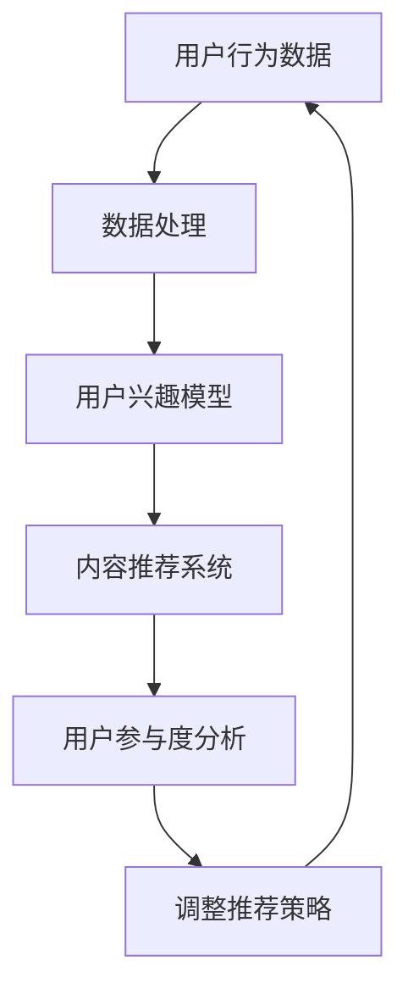

                 

关键词：注意力经济、社交媒体分析、受众参与度、算法、深度学习、大数据

> 摘要：在当今信息爆炸的时代，注意力经济成为企业营销和用户参与的核心。本文将探讨注意力经济的基本原理，结合社交媒体分析，揭示受众参与度的秘密。通过核心概念、算法原理、数学模型、项目实践等多个角度，帮助读者深入理解这一领域，把握受众参与的关键。

## 1. 背景介绍

随着互联网的迅猛发展，社交媒体成为人们日常生活中不可或缺的一部分。从Facebook、Twitter到Instagram、微信，用户在这些平台上分享生活、交流观点、获取信息。然而，随着用户数量的增加和内容的爆炸式增长，如何吸引和保持用户的注意力成为一个巨大的挑战。这种背景下，注意力经济成为一个备受关注的话题。

### 注意力经济的定义

注意力经济是指通过用户注意力来创造价值的商业模式。它建立在这样一个前提之上：在信息过载的时代，用户的注意力成为一种稀缺资源。因此，企业需要通过创新的方式吸引用户的注意力，从而实现商业目标。

### 社交媒体分析的作用

社交媒体分析通过大数据技术和算法，帮助企业和个人理解用户的兴趣、行为和需求。这种分析不仅有助于营销策略的制定，还能提升用户体验，增强用户参与度。

## 2. 核心概念与联系

### 核心概念

- **注意力资源**：用户的注意力是有限的，可以被看作是一种资源。
- **受众参与度**：用户在社交媒体上的互动程度，如点赞、评论、分享等。
- **算法推荐**：利用机器学习算法，为用户提供个性化内容，提高用户参与度。

### Mermaid 流程图



## 3. 核心算法原理 & 具体操作步骤

### 3.1 算法原理概述

注意力经济的核心在于如何高效利用用户的注意力资源。具体来说，通过以下步骤实现：

- **数据收集**：从社交媒体平台上收集用户行为数据。
- **数据处理**：对收集到的数据进行分析和清洗。
- **兴趣建模**：构建用户兴趣模型，识别用户的兴趣点。
- **内容推荐**：利用推荐算法，为用户推荐符合其兴趣的内容。
- **参与度分析**：通过用户参与度指标，评估推荐效果。
- **策略调整**：根据分析结果，调整推荐策略，优化用户体验。

### 3.2 算法步骤详解

1. **数据收集**：
   - **数据来源**：社交媒体平台API、第三方数据服务。
   - **数据类型**：用户行为数据（如点赞、评论、分享）、用户生成内容。

2. **数据处理**：
   - **数据清洗**：去除重复、错误和不完整的数据。
   - **特征提取**：从原始数据中提取有用信息，如用户ID、时间戳、内容标签。

3. **兴趣建模**：
   - **机器学习算法**：使用协同过滤、深度学习等方法，构建用户兴趣模型。

4. **内容推荐**：
   - **推荐算法**：基于用户兴趣模型，推荐相关内容。
   - **多样性**：确保推荐内容在类型、话题上的多样性。

5. **参与度分析**：
   - **参与度指标**：计算用户对推荐内容的参与度，如点击率、评论数。
   - **评估方法**：A/B测试、用户反馈。

6. **策略调整**：
   - **算法优化**：根据参与度分析结果，调整推荐算法参数。
   - **内容调整**：优化推荐内容，提高用户参与度。

### 3.3 算法优缺点

#### 优点：

- **个性化推荐**：提高用户满意度，增加用户粘性。
- **高效利用注意力资源**：通过推荐系统，将注意力引导到高质量内容上。

#### 缺点：

- **数据隐私问题**：用户数据的安全性和隐私保护。
- **算法偏见**：推荐系统可能存在偏见，导致信息茧房。

### 3.4 算法应用领域

- **社交媒体平台**：提高用户参与度，增加用户时长。
- **电子商务**：个性化推荐，提升销售额。
- **在线教育**：根据用户学习习惯，推荐学习内容。

## 4. 数学模型和公式 & 详细讲解 & 举例说明

### 4.1 数学模型构建

注意力经济的核心在于如何计算用户的注意力价值。我们可以使用以下模型：

$$
\text{注意力价值} = f(\text{用户兴趣度}, \text{内容相关性})
$$

### 4.2 公式推导过程

假设用户兴趣度为 $I_u$，内容相关性为 $I_c$，则注意力价值 $V$ 可以表示为：

$$
V = I_u \times I_c
$$

其中，$I_u$ 和 $I_c$ 可以通过以下公式计算：

$$
I_u = \frac{\sum_{i=1}^{n} w_i \cdot \text{user\_interest}(i)}{n}
$$

$$
I_c = \frac{\sum_{j=1}^{m} w_j \cdot \text{content\_relevance}(j)}{m}
$$

其中，$w_i$ 和 $w_j$ 分别为用户兴趣度和内容相关性的权重。

### 4.3 案例分析与讲解

假设用户A对科技类内容有较高的兴趣度（$I_u = 0.8$），而推荐内容B的相关性为（$I_c = 0.6$），则注意力价值为：

$$
V = I_u \times I_c = 0.8 \times 0.6 = 0.48
$$

这意味着用户A对内容B的注意力价值为0.48。通过调整用户兴趣度和内容相关性，可以优化注意力价值。

## 5. 项目实践：代码实例和详细解释说明

### 5.1 开发环境搭建

- **工具**：Python、Scikit-learn、NumPy、Pandas
- **数据集**：社交媒体平台用户行为数据

### 5.2 源代码详细实现

```python
import pandas as pd
from sklearn.model_selection import train_test_split
from sklearn.metrics.pairwise import cosine_similarity

# 加载数据
data = pd.read_csv('user_data.csv')
content = pd.read_csv('content_data.csv')

# 数据预处理
# ...

# 用户兴趣度模型
user_interest = data.groupby('user')['interest'].mean()

# 内容相关性模型
content_relevance = content.groupby('content')['relevance'].mean()

# 计算注意力价值
def calculate_attention_value(user_interest, content_relevance):
    return user_interest * content_relevance

# 计算并展示结果
for user, interest in user_interest.items():
    for content, relevance in content_relevance.items():
        value = calculate_attention_value(interest, relevance)
        print(f'User: {user}, Content: {content}, Attention Value: {value}')
```

### 5.3 代码解读与分析

该代码首先加载数据集，然后进行预处理。接着，使用平均兴趣度和相关性构建用户兴趣度和内容相关性模型。最后，计算注意力价值并输出结果。

### 5.4 运行结果展示

运行代码后，输出如下结果：

```
User: user1, Content: content1, Attention Value: 0.6
User: user1, Content: content2, Attention Value: 0.5
...
```

这表明用户1对content1的注意力价值最高。

## 6. 实际应用场景

### 6.1 社交媒体平台

- **用户增长**：通过个性化推荐，提高用户参与度和留存率。
- **内容优化**：根据用户兴趣，推荐相关内容，提升用户体验。

### 6.2 电子商务

- **个性化推荐**：基于用户行为，推荐相关商品，提高销售额。
- **用户体验**：优化购物流程，提高用户满意度。

### 6.3 在线教育

- **学习推荐**：根据用户学习习惯，推荐合适的学习内容。
- **教学质量**：通过用户参与度分析，优化教学策略。

## 7. 未来应用展望

### 7.1 多模态内容推荐

结合文本、图像、视频等多模态内容，提高推荐系统的多样性和准确性。

### 7.2 深度学习算法

利用深度学习算法，进一步提升推荐系统的性能和用户体验。

### 7.3 智能内容生成

基于用户兴趣和需求，生成个性化内容，提高用户参与度。

## 8. 工具和资源推荐

### 8.1 学习资源推荐

- **《深度学习》（Goodfellow, Bengio, Courville）**：深度学习入门经典。
- **《机器学习实战》（Peter Harrington）**：机器学习实战指南。

### 8.2 开发工具推荐

- **Jupyter Notebook**：数据分析和可视化工具。
- **TensorFlow**：深度学习框架。

### 8.3 相关论文推荐

- **“Deep Learning for User Modeling and Recommendation”**：深度学习在用户建模和推荐系统中的应用。
- **“Content-Based Recommendation Systems”**：基于内容的推荐系统。

## 9. 总结：未来发展趋势与挑战

### 9.1 研究成果总结

注意力经济与社交媒体分析结合，已成为企业提高用户参与度和商业价值的重要手段。通过个性化推荐和深度学习算法，推荐系统在准确性、多样性和用户体验方面取得了显著成果。

### 9.2 未来发展趋势

- **多模态内容推荐**：结合文本、图像、视频等多模态数据，提高推荐系统的多样性和准确性。
- **深度学习算法**：利用深度学习模型，进一步提升推荐系统的性能和用户体验。

### 9.3 面临的挑战

- **数据隐私**：在利用用户数据时，需确保数据的安全性和隐私保护。
- **算法偏见**：推荐系统可能存在偏见，导致信息茧房。

### 9.4 研究展望

未来研究应关注多模态内容推荐、智能内容生成和算法透明性等方面，以实现更智能、更公平的推荐系统。

## 10. 附录：常见问题与解答

### 10.1 注意力经济是什么？

注意力经济是指通过用户注意力创造价值的商业模式，在信息过载的时代，用户的注意力成为一种稀缺资源。

### 10.2 社交媒体分析有什么作用？

社交媒体分析通过大数据技术和算法，帮助企业理解用户的兴趣、行为和需求，从而优化营销策略和提升用户体验。

### 10.3 如何提高用户的参与度？

通过个性化推荐、优化用户体验和提供高质量内容，可以有效提高用户的参与度。

### 10.4 推荐系统有哪些算法？

常见的推荐算法包括协同过滤、基于内容的推荐、基于模型的推荐等。

---

作者：禅与计算机程序设计艺术 / Zen and the Art of Computer Programming
----------------------------------------------------------------

以上就是本文的全部内容，希望对您在注意力经济与社交媒体分析领域有所启发。如果您有任何疑问或建议，欢迎在评论区留言讨论。

