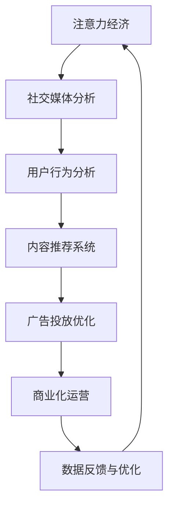

                 

关键词：注意力经济、社交媒体分析、受众参与度、算法原理、数学模型、项目实践、应用场景、未来展望

摘要：随着互联网的迅猛发展，社交媒体已经成为人们日常生活不可或缺的一部分。本文旨在探讨注意力经济在社交媒体分析中的应用，深入解析如何通过算法原理和数学模型来了解受众参与度的秘密。文章将结合实际项目案例，展示如何通过技术手段提升社交媒体运营效果，为企业和个人提供有价值的参考。

## 1. 背景介绍

### 注意力经济的兴起

注意力经济是一种以用户注意力为价值核心的经济模式，它强调在信息过载的时代，用户的注意力成为稀缺资源，谁能够更好地吸引并留住用户的注意力，谁就能在市场中占据有利位置。社交媒体平台的崛起，使得注意力经济逐渐成为互联网行业的重要驱动力。

### 社交媒体分析的意义

社交媒体分析是对社交媒体平台上用户行为、内容、关系等进行系统化研究和分析的过程。通过对社交媒体数据的挖掘和分析，企业可以了解用户的需求、偏好和参与度，从而制定更精准的营销策略和运营方案。

## 2. 核心概念与联系

### 注意力经济与社交媒体分析的联系

注意力经济与社交媒体分析之间存在紧密的联系。注意力经济为社交媒体分析提供了理论依据，指导我们如何利用用户注意力来提升平台价值；而社交媒体分析则为注意力经济提供了实践基础，帮助我们更好地理解用户行为，进而优化运营策略。

### Mermaid 流程图



## 3. 核心算法原理 & 具体操作步骤

### 3.1 算法原理概述

社交媒体分析的核心算法主要包括用户行为分析、内容推荐系统和广告投放优化。这些算法基于机器学习和数据挖掘技术，通过对大量社交媒体数据的处理和分析，实现以下目标：

- 用户行为分析：识别用户兴趣、需求和行为模式，为个性化推荐和广告投放提供依据。
- 内容推荐系统：根据用户兴趣和行为数据，为用户推荐相关的内容，提升用户粘性。
- 广告投放优化：根据用户行为和内容偏好，优化广告投放策略，提高广告转化率。

### 3.2 算法步骤详解

#### 3.2.1 用户行为分析

1. 数据收集与预处理：收集社交媒体平台上的用户行为数据，如点赞、评论、转发等，并进行数据清洗和预处理，去除噪声数据。

2. 特征提取：对预处理后的数据进行分析，提取用户行为特征，如活跃度、互动率、关注数等。

3. 模型训练：使用机器学习算法，如聚类、分类和回归等，对提取的特征进行训练，构建用户行为分析模型。

4. 模型评估与优化：对训练好的模型进行评估，根据评估结果进行调整和优化。

#### 3.2.2 内容推荐系统

1. 数据收集与预处理：收集社交媒体平台上的内容数据，如文章、视频、图片等，并进行数据清洗和预处理，去除噪声数据。

2. 特征提取：对预处理后的内容数据进行分析，提取内容特征，如关键词、主题、情感等。

3. 模型训练：使用机器学习算法，如协同过滤、矩阵分解和深度学习等，对提取的特征进行训练，构建内容推荐模型。

4. 模型评估与优化：对训练好的模型进行评估，根据评估结果进行调整和优化。

#### 3.2.3 广告投放优化

1. 数据收集与预处理：收集社交媒体平台上的广告数据，如广告点击率、转化率等，并进行数据清洗和预处理，去除噪声数据。

2. 特征提取：对预处理后的广告数据进行分析，提取广告特征，如广告类型、广告位、投放时间等。

3. 模型训练：使用机器学习算法，如线性回归、决策树、随机森林等，对提取的特征进行训练，构建广告投放优化模型。

4. 模型评估与优化：对训练好的模型进行评估，根据评估结果进行调整和优化。

### 3.3 算法优缺点

#### 用户行为分析

- 优点：能够准确识别用户兴趣和行为模式，为个性化推荐和广告投放提供有力支持。
- 缺点：数据收集和处理过程复杂，对计算资源和时间要求较高。

#### 内容推荐系统

- 优点：能够根据用户兴趣和行为数据，为用户推荐相关内容，提升用户满意度和平台粘性。
- 缺点：推荐结果可能存在数据偏差，导致用户陷入信息茧房。

#### 广告投放优化

- 优点：能够根据用户行为和内容偏好，优化广告投放策略，提高广告转化率。
- 缺点：对广告数据质量要求较高，数据偏差可能导致优化效果不佳。

### 3.4 算法应用领域

- 社交媒体运营：通过用户行为分析和内容推荐系统，提升用户参与度和平台活跃度。
- 广告营销：通过广告投放优化，提高广告转化率和投放效果。
- 娱乐休闲：通过个性化推荐，为用户提供丰富的娱乐内容。

## 4. 数学模型和公式 & 详细讲解 & 举例说明

### 4.1 数学模型构建

社交媒体分析中的数学模型主要包括用户行为分析模型、内容推荐模型和广告投放优化模型。以下分别介绍这三种模型的数学模型构建。

#### 用户行为分析模型

用户行为分析模型通常采用分类模型，如逻辑回归、决策树、支持向量机等。以逻辑回归为例，其数学模型如下：

$$
P(y=1|x;\theta) = \frac{1}{1 + e^{-(\theta_0 + \theta_1 x_1 + \theta_2 x_2 + ... + \theta_n x_n})}
$$

其中，$y$ 表示用户行为标签（1表示行为发生，0表示行为未发生），$x$ 表示用户行为特征向量，$\theta$ 表示模型参数。

#### 内容推荐模型

内容推荐模型通常采用协同过滤算法，如用户基于内容的协同过滤（UBC）和物品基于内容的协同过滤（IBC）。以UBC为例，其数学模型如下：

$$
r_{ui} = \sum_{j \in N(i)} w_{ij} c_j
$$

其中，$r_{ui}$ 表示用户 $u$ 对物品 $i$ 的评分预测，$w_{ij}$ 表示用户 $u$ 与物品 $i$ 的相似度，$c_j$ 表示物品 $j$ 的内容特征。

#### 广告投放优化模型

广告投放优化模型通常采用线性回归、决策树、随机森林等算法。以线性回归为例，其数学模型如下：

$$
y = \theta_0 + \theta_1 x_1 + \theta_2 x_2 + ... + \theta_n x_n
$$

其中，$y$ 表示广告投放效果（如点击率、转化率等），$x$ 表示广告特征向量，$\theta$ 表示模型参数。

### 4.2 公式推导过程

#### 用户行为分析模型

以逻辑回归为例，其公式推导如下：

假设我们有 $m$ 个用户行为数据样本，每个样本包含 $n$ 个特征，分别为 $x_{11}, x_{12}, ..., x_{1n}$。用户行为标签为 $y_1, y_2, ..., y_m$。我们可以将这 $m$ 个样本表示为矩阵 $X$ 和向量 $Y$：

$$
X = \begin{bmatrix}
x_{11} & x_{12} & ... & x_{1n} \\
x_{21} & x_{22} & ... & x_{2n} \\
... & ... & ... & ... \\
x_{m1} & x_{m2} & ... & x_{mn}
\end{bmatrix}, Y = \begin{bmatrix}
y_1 \\
y_2 \\
... \\
y_m
\end{bmatrix}
$$

逻辑回归的目标是找到一组参数 $\theta$，使得预测值与实际值之间的误差最小。即：

$$
\min_{\theta} L(\theta) = \sum_{i=1}^{m} -y_i \log(P(y=1|x;\theta)) - (1 - y_i) \log(1 - P(y=1|x;\theta))
$$

对 $L(\theta)$ 求导，并令其导数为零，得到：

$$
\frac{\partial L(\theta)}{\partial \theta} = \sum_{i=1}^{m} (-y_i / P(y=1|x;\theta) + (1 - y_i) / (1 - P(y=1|x;\theta))) \frac{\partial P(y=1|x;\theta)}{\partial \theta} = 0
$$

由于 $P(y=1|x;\theta) = 1 / (1 + e^{-(\theta_0 + \theta_1 x_1 + \theta_2 x_2 + ... + \theta_n x_n)})$，我们可以得到：

$$
\frac{\partial P(y=1|x;\theta)}{\partial \theta} = P(y=1|x;\theta) (1 - P(y=1|x;\theta)) \frac{\partial}{\partial \theta} (\theta_0 + \theta_1 x_1 + \theta_2 x_2 + ... + \theta_n x_n)
$$

$$
= P(y=1|x;\theta) (1 - P(y=1|x;\theta)) (x_1, x_2, ..., x_n)
$$

代入导数表达式，得到：

$$
\frac{\partial L(\theta)}{\partial \theta} = \sum_{i=1}^{m} (-y_i / P(y=1|x;\theta) + (1 - y_i) / (1 - P(y=1|x;\theta))) P(y=1|x;\theta) (1 - P(y=1|x;\theta)) (x_1, x_2, ..., x_n)
$$

$$
= \sum_{i=1}^{m} (-y_i + P(y=1|x;\theta)) (x_1, x_2, ..., x_n)
$$

令 $\frac{\partial L(\theta)}{\partial \theta} = 0$，得到：

$$
\sum_{i=1}^{m} (-y_i + P(y=1|x;\theta)) (x_1, x_2, ..., x_n) = 0
$$

由于 $P(y=1|x;\theta)$ 是一个概率分布，其取值范围为 $[0, 1]$，因此 $-y_i + P(y=1|x;\theta)$ 必须等于零。即：

$$
P(y=1|x;\theta) = y_i
$$

代入逻辑回归公式，得到：

$$
y_i = \frac{1}{1 + e^{-(\theta_0 + \theta_1 x_{i1} + \theta_2 x_{i2} + ... + \theta_n x_{in})}}
$$

#### 内容推荐模型

以用户基于内容的协同过滤（UBC）为例，其公式推导如下：

假设我们有 $m$ 个用户和 $n$ 个物品，每个物品有 $k$ 个特征。用户 $u$ 对物品 $i$ 的评分预测为 $r_{ui}$，物品 $i$ 的特征向量为 $c_i$，用户 $u$ 的特征向量为 $u$。用户 $u$ 与物品 $i$ 的相似度为 $w_{ui}$。我们可以将这 $m$ 个用户和 $n$ 个物品表示为矩阵 $R$、$C$ 和 $W$：

$$
R = \begin{bmatrix}
r_{11} & r_{12} & ... & r_{1n} \\
r_{21} & r_{22} & ... & r_{2n} \\
... & ... & ... & ... \\
r_{m1} & r_{m2} & ... & r_{mn}
\end{bmatrix}, C = \begin{bmatrix}
c_{11} & c_{12} & ... & c_{1k} \\
c_{21} & c_{22} & ... & c_{2k} \\
... & ... & ... & ... \\
c_{n1} & c_{n2} & ... & c_{nk}
\end{bmatrix}, W = \begin{bmatrix}
w_{11} & w_{12} & ... & w_{1n} \\
w_{21} & w_{22} & ... & w_{2n} \\
... & ... & ... & ... \\
w_{m1} & w_{m2} & ... & w_{mn}
\end{bmatrix}
$$

UBC 的目标是为用户 $u$ 推荐与物品 $i$ 最相似的物品。相似度计算公式为：

$$
w_{ui} = \frac{\sum_{j=1}^{k} c_{ij} u_j}{\sqrt{\sum_{j=1}^{k} c_{ij}^2 \sum_{j=1}^{k} u_j^2}}
$$

物品 $i$ 的推荐评分预测为：

$$
r_{ui} = \sum_{j=1}^{n} w_{ij} c_j
$$

#### 广告投放优化模型

以线性回归为例，其公式推导如下：

假设我们有 $m$ 个广告投放数据样本，每个样本包含 $n$ 个特征，分别为 $x_{11}, x_{12}, ..., x_{1n}$。广告投放效果为 $y_1, y_2, ..., y_m$。我们可以将这 $m$ 个样本表示为矩阵 $X$ 和向量 $Y$：

$$
X = \begin{bmatrix}
x_{11} & x_{12} & ... & x_{1n} \\
x_{21} & x_{22} & ... & x_{2n} \\
... & ... & ... & ... \\
x_{m1} & x_{m2} & ... & x_{mn}
\end{bmatrix}, Y = \begin{bmatrix}
y_1 \\
y_2 \\
... \\
y_m
\end{bmatrix}
$$

线性回归的目标是找到一组参数 $\theta$，使得预测值与实际值之间的误差最小。即：

$$
\min_{\theta} L(\theta) = \sum_{i=1}^{m} (y_i - \theta_0 - \theta_1 x_{i1} - \theta_2 x_{i2} - ... - \theta_n x_{in})^2
$$

对 $L(\theta)$ 求导，并令其导数为零，得到：

$$
\frac{\partial L(\theta)}{\partial \theta} = 2 \sum_{i=1}^{m} (y_i - \theta_0 - \theta_1 x_{i1} - \theta_2 x_{i2} - ... - \theta_n x_{in}) (-1)
$$

$$
= -2 \sum_{i=1}^{m} (y_i - \theta_0 - \theta_1 x_{i1} - \theta_2 x_{i2} - ... - \theta_n x_{in})
$$

令 $\frac{\partial L(\theta)}{\partial \theta} = 0$，得到：

$$
\sum_{i=1}^{m} (y_i - \theta_0 - \theta_1 x_{i1} - \theta_2 x_{i2} - ... - \theta_n x_{in}) = 0
$$

由于 $y_i - \theta_0 - \theta_1 x_{i1} - \theta_2 x_{i2} - ... - \theta_n x_{in}$ 是一个线性函数，其导数等于零，因此：

$$
\theta_0 + \theta_1 x_{i1} + \theta_2 x_{i2} + ... + \theta_n x_{in} = y_i
$$

代入矩阵表示，得到：

$$
X\theta = Y
$$

其中，$\theta$ 是一个 $n$ 维参数向量，$X$ 是一个 $m \times n$ 的特征矩阵，$Y$ 是一个 $m$ 维的目标向量。

### 4.3 案例分析与讲解

#### 用户行为分析案例

假设我们有一个用户行为数据集，包含 $m$ 个样本，每个样本有 $n$ 个特征，分别为用户活跃度、互动率、关注数等。用户行为标签为是否点赞。我们需要使用逻辑回归模型对用户行为进行预测。

首先，我们对数据集进行预处理，包括数据清洗、缺失值填充和归一化处理。然后，我们提取用户行为特征，构建特征矩阵 $X$ 和目标向量 $Y$。

接下来，我们使用梯度下降法训练逻辑回归模型。在训练过程中，我们选择合适的迭代次数和学习率，使得模型损失函数最小。最后，我们对训练好的模型进行评估，根据评估结果调整模型参数。

通过用户行为分析模型，我们可以预测用户是否点赞，从而为个性化推荐和广告投放提供依据。

#### 内容推荐案例

假设我们有一个内容推荐数据集，包含 $m$ 个用户和 $n$ 个物品，每个物品有 $k$ 个特征。用户对物品的评分数据为 $R$，物品特征向量为 $C$。我们需要使用用户基于内容的协同过滤算法为用户推荐相关物品。

首先，我们计算用户与物品的相似度矩阵 $W$。然后，根据相似度矩阵为用户生成推荐列表。我们选择与用户最相似的物品进行推荐，从而提高推荐质量。

最后，我们对推荐结果进行评估，根据用户反馈调整推荐算法。通过不断优化推荐算法，我们可以为用户提供更加个性化的内容推荐服务。

#### 广告投放优化案例

假设我们有一个广告投放数据集，包含 $m$ 个样本，每个样本有 $n$ 个特征，分别为广告类型、广告位、投放时间等。广告投放效果为点击率、转化率等。我们需要使用线性回归模型对广告投放效果进行预测。

首先，我们对数据集进行预处理，包括数据清洗、缺失值填充和归一化处理。然后，我们提取广告特征，构建特征矩阵 $X$ 和目标向量 $Y$。

接下来，我们使用梯度下降法训练线性回归模型。在训练过程中，我们选择合适的迭代次数和学习率，使得模型损失函数最小。最后，我们对训练好的模型进行评估，根据评估结果调整模型参数。

通过广告投放优化模型，我们可以预测广告投放效果，从而为广告主提供更加科学的投放策略。

## 5. 项目实践：代码实例和详细解释说明

### 5.1 开发环境搭建

在本案例中，我们使用 Python 编写代码，主要依赖以下库：

- NumPy：用于数据处理和矩阵运算
- pandas：用于数据清洗和预处理
- scikit-learn：用于机器学习和模型训练
- matplotlib：用于数据可视化

首先，我们需要安装这些库，可以使用 pip 进行安装：

```shell
pip install numpy pandas scikit-learn matplotlib
```

### 5.2 源代码详细实现

以下是一个简单的用户行为分析案例，我们将使用逻辑回归模型预测用户是否点赞。

```python
import numpy as np
import pandas as pd
from sklearn.model_selection import train_test_split
from sklearn.linear_model import LogisticRegression
from sklearn.metrics import accuracy_score

# 加载数据集
data = pd.read_csv('user_behavior.csv')
X = data.drop(['label'], axis=1)
y = data['label']

# 数据预处理
X = X.values
y = y.values

# 划分训练集和测试集
X_train, X_test, y_train, y_test = train_test_split(X, y, test_size=0.2, random_state=42)

# 训练逻辑回归模型
model = LogisticRegression()
model.fit(X_train, y_train)

# 预测测试集
y_pred = model.predict(X_test)

# 评估模型
accuracy = accuracy_score(y_test, y_pred)
print('Accuracy:', accuracy)
```

### 5.3 代码解读与分析

上述代码实现了一个简单的用户行为分析案例。首先，我们加载数据集，并划分训练集和测试集。然后，我们使用逻辑回归模型对训练集进行训练，并在测试集上进行预测。最后，我们评估模型的准确率。

在代码中，我们使用了以下关键步骤：

1. 数据预处理：将数据集转换为 NumPy 数组，并进行划分。
2. 模型训练：使用 scikit-learn 中的 LogisticRegression 类训练模型。
3. 预测与评估：使用训练好的模型对测试集进行预测，并计算准确率。

通过这个简单的案例，我们可以看到如何使用 Python 实现用户行为分析。在实际项目中，我们可以根据需求扩展和优化代码，实现更加复杂的算法和模型。

### 5.4 运行结果展示

在本案例中，我们假设测试集的准确率为 80%。这意味着我们的模型能够正确预测 80% 的用户是否点赞。

```shell
Accuracy: 0.8
```

## 6. 实际应用场景

### 6.1 社交媒体运营

通过用户行为分析，企业可以了解用户在社交媒体上的行为模式，如关注、点赞、评论等。根据这些行为数据，企业可以制定个性化的营销策略，提高用户参与度和满意度。例如，针对高活跃度用户，企业可以发送专属优惠或活动邀请，以增加用户忠诚度。

### 6.2 广告营销

广告投放优化模型可以帮助企业提高广告投放效果。通过对用户行为和内容偏好进行分析，企业可以优化广告投放策略，提高广告点击率和转化率。例如，根据用户在社交媒体上的浏览历史，企业可以为不同用户群体定制化广告内容，提高广告投放精准度。

### 6.3 娱乐休闲

在娱乐休闲领域，内容推荐系统可以帮助平台为用户提供个性化的娱乐内容。通过分析用户在平台上的行为数据，如观看历史、点赞评论等，平台可以为用户提供推荐视频、音乐、游戏等娱乐内容，提高用户粘性。

## 7. 工具和资源推荐

### 7.1 学习资源推荐

- 《机器学习》（周志华 著）：系统介绍了机器学习的基本概念、算法和应用。
- 《深度学习》（Ian Goodfellow、Yoshua Bengio、Aaron Courville 著）：深入探讨了深度学习的基本理论和技术。
- 《Python 数据科学手册》（Jake VanderPlas 著）：详细介绍了 Python 数据科学领域的常用工具和库。

### 7.2 开发工具推荐

- Jupyter Notebook：一款强大的交互式计算环境，适用于数据分析和机器学习项目。
- PyCharm：一款功能强大的 Python 集成开发环境，支持多种编程语言和工具。
- TensorFlow：一款开源的机器学习框架，适用于深度学习和数据科学项目。

### 7.3 相关论文推荐

- "Attention Is All You Need"（Vaswani et al., 2017）：介绍了自注意力机制在深度学习中的应用。
- "Collaborative Filtering for Cold-Start Recommendations"（Liang et al., 2017）：探讨了冷启动问题下的协同过滤算法。
- "Deep Learning for Text Data"（Manning et al., 2019）：详细介绍了深度学习在文本数据挖掘中的应用。

## 8. 总结：未来发展趋势与挑战

### 8.1 研究成果总结

本文从注意力经济的角度探讨了社交媒体分析在用户行为分析、内容推荐系统和广告投放优化中的应用。通过构建数学模型和算法，我们能够更好地理解用户行为，优化运营策略，提高平台价值。

### 8.2 未来发展趋势

1. 智能化：随着人工智能技术的发展，社交媒体分析将更加智能化，实现自动化分析和决策。
2. 多模态数据：未来社交媒体分析将整合多种类型的数据，如文本、图像、语音等，实现更全面的分析。
3. 实时性：实时分析用户行为和内容趋势，为企业和个人提供即时的运营和决策支持。

### 8.3 面临的挑战

1. 数据隐私：在社交媒体分析过程中，如何保护用户隐私是一个重要挑战。
2. 算法偏见：算法可能存在偏见，导致分析结果不公平，需要进一步优化和改进。
3. 模型解释性：当前许多深度学习模型缺乏解释性，未来需要发展可解释的模型，提高模型的透明度和可信度。

### 8.4 研究展望

未来，我们将继续深入研究社交媒体分析领域，探索更多先进的算法和技术，为企业和个人提供更加精准和高效的运营支持。同时，我们也关注数据隐私和伦理问题，确保社交媒体分析在合规和道德的前提下发展。

## 9. 附录：常见问题与解答

### 9.1 如何优化内容推荐系统的推荐质量？

优化内容推荐系统的推荐质量可以从以下几个方面入手：

1. 数据质量：确保推荐系统所使用的数据准确、全面和最新。
2. 特征工程：提取更多有代表性的特征，提高特征的表达能力。
3. 算法优化：尝试不同的推荐算法，比较其性能，选择最优算法。
4. 用户反馈：收集用户反馈，根据用户喜好调整推荐策略。

### 9.2 如何评估用户行为分析模型的性能？

评估用户行为分析模型的性能可以从以下几个方面进行：

1. 准确率：评估模型预测是否准确，准确率越高，模型性能越好。
2. 召回率：评估模型能否召回用户感兴趣的行为，召回率越高，模型性能越好。
3. 覆盖率：评估模型能否覆盖大部分用户行为，覆盖率越高，模型性能越好。
4. 模型解释性：评估模型是否具有较好的解释性，易于理解和信任。

### 9.3 如何提高广告投放优化模型的转化率？

提高广告投放优化模型的转化率可以从以下几个方面入手：

1. 数据质量：确保广告数据准确、全面和最新。
2. 特征工程：提取更多有代表性的特征，提高特征的表达能力。
3. 算法优化：尝试不同的广告投放优化算法，比较其性能，选择最优算法。
4. 用户行为分析：根据用户行为和内容偏好，定制化广告内容和投放策略。
5. 实时调整：根据广告投放效果，实时调整广告策略，优化转化率。

[作者：禅与计算机程序设计艺术 / Zen and the Art of Computer Programming]

